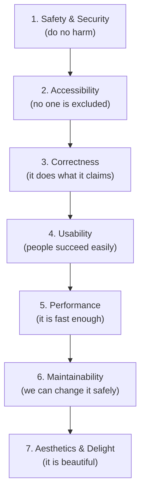
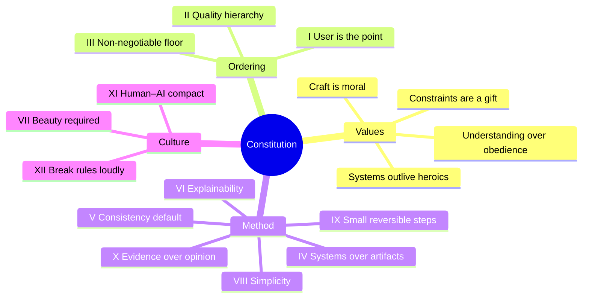

# 00 — The Constitution

### The Non-Negotiable First Principles of the Studio

> *"A studio is not the people in it or the tools it uses. A studio is the set of decisions it makes when no one is watching. This document is that set of decisions, written down."*

---

**Chapter type:** Foundation (governs all other chapters)
**DRI:** Software Architect + Creative Director (joint)
**Amendment rule:** Requires leadership consensus (see [`README.md` §12](./README.md)). Changes rarely and deliberately.
**Read before:** everything else.

---

## Table of Contents

1. [Purpose](#1-purpose)
2. [Philosophy](#2-philosophy)
3. [Principles](#3-principles) — *The Articles of the Constitution*
4. [Best Practices](#4-best-practices)
5. [Anti-Patterns](#5-anti-patterns)
6. [Real-World Examples](#6-real-world-examples)
7. [Common Mistakes](#7-common-mistakes)
8. [AI Implementation Guidance](#8-ai-implementation-guidance)
9. [Human Review Checklist](#9-human-review-checklist)
10. [Automation Opportunities](#10-automation-opportunities)
11. [References for Further Study](#11-references-for-further-study)
12. [Review Checklist & Measurable Quality Criteria](#12-review-checklist--measurable-quality-criteria)

---

## 1. Purpose

Every organization that produces excellent work does so because it has an **implicit constitution** — a shared, deeply held agreement about what "good" means and how disagreements get resolved. In most companies this constitution is invisible. It lives in the reflexes of senior people and the scar tissue of past failures. It cannot be taught, only absorbed, and it dies when key people leave.

This chapter makes our constitution **explicit**.

Its purpose is to answer the questions that every other chapter assumes are already answered:

- **What do we value, and in what order, when values conflict?**
- **Who decides, and how, when reasonable people disagree?**
- **What is the minimum bar below which we will not ship, ever?**
- **How do humans and AI agents divide labor and hold each other accountable?**
- **When is it acceptable to break a rule?**

Where the [`README.md`](./README.md) defines the *rules of the manual*, the Constitution defines the *rules of the work*. It is the highest authority in this repository. When any other chapter conflicts with the Constitution, **the Constitution wins** — and the conflicting chapter must be amended.

This is deliberately a *short-ish* chapter relative to the technical ones. A constitution that tries to legislate every detail becomes a bureaucracy. This one legislates *values and decision procedures*; the details belong to the specialist chapters.

---

## 2. Philosophy

Four beliefs sit beneath everything the studio does. They are not techniques. They are the worldview from which techniques are derived.

### 2.1 Craft is a moral act, not a cosmetic one

Software is not neutral. A slow page wastes a stranger's afternoon. An inaccessible form locks a disabled person out of a service they are entitled to. A dark pattern manipulates someone into a choice they would not freely make. A security hole exposes people who trusted us. **Quality is how we express respect for the people who use what we build.** We hold a high bar not out of vanity but out of obligation.

### 2.2 Systems outlive heroics

A brilliant individual can produce a brilliant artifact once. A good system produces good artifacts a thousand times, with ordinary people, on ordinary days. We optimize for the **repeatable** over the **remarkable**, because a studio that depends on heroics is one bad week away from mediocrity. When you feel the urge to be a hero, ask instead: *what system would have made heroism unnecessary?*

### 2.3 Constraints are a gift

A blank canvas is paralyzing and, worse, inconsistent. Constraints — a design token scale, a component library, a performance budget, a naming convention — do not limit creativity; they **redirect** it from re-deciding solved problems toward the problems that are actually novel. We embrace constraints so that our creative energy is spent where it matters.

### 2.4 Understanding beats obedience

We do not want a studio of rule-followers. We want a studio of people (and agents) who understand *why* the rules exist, because only they know when a rule no longer applies. **Every rule in this manual carries its rationale.** If you cannot explain why a rule exists, you are not yet qualified to follow it — or to break it.

> These four beliefs resolve into a single operating stance: **We build as if the person on the other side of the screen is someone we respect, using a system we can trust, within constraints we chose on purpose, because we understand the reasons.**

---

## 3. Principles

*These are the Articles of the Constitution. They are numbered so they can be cited directly (e.g. "this violates Article IV").*

### Article I — The User Is the Point

**The user's outcome is the final arbiter of every decision.** Not our aesthetic preferences, not the elegance of our architecture, not the cleverness of our animation. When a decision cannot be resolved by other principles, resolve it in favor of the user's real-world outcome.

> *Rationale:* Every other quality — beauty, performance, security — is instrumental. It matters only because it serves a human. Losing sight of this produces technically impressive products nobody wants.

### Article II — The Quality Hierarchy

When qualities conflict and cannot all be maximized, resolve them in this order:



This ordering is **not** a claim that aesthetics don't matter — they matter enormously (see Article VII). It is a claim about **what yields when you cannot have everything.** A beautiful, insecure product is a failure. A beautiful, inaccessible product is a failure. Beauty is the crown, not the foundation.

> *Rationale:* Trade-offs are inevitable under real constraints. Without an agreed order, every trade-off becomes a political fight decided by whoever argues loudest. This hierarchy decides it in advance.

### Article III — The Non-Negotiable Floor

There is a floor below which we **do not ship**, regardless of deadline. Crossing the floor is not a trade-off to be debated; it is a release blocker.

| The floor requires | Minimum standard |
| --- | --- |
| **Security** | No known-exploitable vulnerabilities. Secrets never in source. Input validated. (See [`37`](./37-SECURITY.md)) |
| **Accessibility** | WCAG 2.2 **AA** on all core flows. Keyboard operable. (See [`22`](./22-ACCESSIBILITY.md)) |
| **Data safety** | No user data loss. Destructive actions are reversible or confirmed. |
| **Correctness** | Core user journey works end-to-end with no known critical bugs. |
| **Legal/ethical** | No dark patterns. Honest copy. Consent respected. |

> *Rationale:* Deadlines are real, but some corners, when cut, transfer harm to users. Those corners are off-limits. Making the floor explicit removes it from negotiation.

### Article IV — Systems Over Artifacts

**We design and build systems, not one-off pages or features.** A new UI element belongs to the component library or it does not ship. A color is a token or it does not exist. A pattern used twice is extracted. Duplication is a debt taken on only with a conscious reason.

> *Rationale:* One-off decisions compound into chaos. Consistency is a feature users feel even when they can't name it, and it is the single largest multiplier of a small team's output.

### Article V — Consistency Is the Default; Novelty Is Spent Deliberately

Consistency beats creativity **by default**. Novelty has a real cost: it must be learned by users, maintained by engineers, and justified to reviewers. We spend novelty like a budget — rarely, and only where it creates disproportionate value.

> *Rationale:* Most creativity in software should go into *what* problem we solve, not into re-inventing scrollbars. Novelty for its own sake taxes everyone downstream.

### Article VI — Every Decision Must Be Explainable

If you cannot explain why a pixel, a prop, a query, or an animation exists, it should not exist. **"Because it looked nice" and "because it worked" are not explanations.** A decision is explainable when it references a principle, a measurement, a user need, or a documented trade-off.

> *Rationale:* Unexplainable decisions cannot be reviewed, taught, or safely changed later. Explainability is what makes a codebase and a design system *legible* to the next person and the next agent.

### Article VII — Beauty Is a Requirement, Not a Luxury

Article II ranks aesthetics last *among things that yield under conflict* — but that is not permission to ship ugly work. **When no higher principle is at stake, beauty is mandatory.** Craft, polish, rhythm, and restraint are part of the job, not a bonus. We assume everything we build will be shown in public.

> *Rationale:* Beauty is a signal of care, and care builds trust. Users infer the invisible qualities they cannot see (security, reliability) from the visible qualities they can. Ugly work erodes trust in everything else.

### Article VIII — Simplicity Is the Highest Sophistication

**Never introduce unnecessary complexity.** Prefer the smallest solution that fully solves the problem. Complexity must be *earned* by a real, present requirement — never added speculatively for an imagined future. The best code is code not written; the best feature is often the one removed.

> *Rationale:* Complexity is the primary source of bugs, onboarding cost, and change paralysis. It accretes silently and is extremely hard to remove later. Fighting it is a permanent, active discipline.

### Article IX — Reversibility and Small Steps

Prefer **small, reversible changes** over large, irreversible ones. Ship in increments that can be reviewed, measured, and rolled back. One-way doors (data migrations, public API contracts, framework commitments) get extra scrutiny; two-way doors get speed.

> *Rationale:* We cannot predict the future accurately. Small reversible steps let reality correct us cheaply and often, instead of expensively and rarely.

### Article X — Evidence Over Opinion

Disagreements are resolved by **evidence** (measurements, user research, tests, benchmarks) wherever evidence is obtainable. Where it is not, they are resolved by the **most senior relevant specialist's judgment**, explicitly labeled as judgment. **"I think" is a hypothesis, not a conclusion.**

> *Rationale:* Opinion-driven organizations relitigate the same debates forever and reward confidence over correctness. Evidence ends debates and compounds learning.

### Article XI — The Human–AI Compact

AI agents are collaborators, not oracles and not mere tools. The division of authority is fixed:

- **AI proposes; humans dispose.** Agents generate, draft, refactor, and analyze at scale. **A human is accountable for every merged decision that affects users.**
- **Agents must cite and self-review.** Every agent output states which principles/chapters it applied and reports its self-review against the relevant checklist.
- **Humans must give agents what they need.** Clear scope, context, constraints, and a definition of done. A vague prompt is a human failure, not an agent failure.
- **Neither may bypass the floor** (Article III). No agent auto-merges past a quality gate; no human waives the floor to hit a date.

> *Rationale:* AI dramatically amplifies output — including mistakes. Amplification without accountability is dangerous. This compact keeps velocity high and responsibility unambiguous.

### Article XII — Rules May Be Broken, But Never Silently

Every SHOULD in this manual may be overridden when the situation genuinely warrants it — but **never silently.** Breaking a rule requires a written rationale, recorded where the work lives (PR description, ADR, design note), naming the rule, the reason, and the trade-off accepted. MUST rules (the floor, Article III) may not be broken at all.

> *Rationale:* Rigid rules break under real-world edge cases; silent exceptions destroy the system's integrity. A visible, justified exception preserves both flexibility and trust — and becomes a data point for improving the rule.

---

### The Constitution at a glance



---

## 4. Best Practices

Practices that turn the Articles from posters on a wall into daily behavior.

### 4.1 Make the rationale travel with the decision
Record *why* next to *what*. Use commit messages, PR descriptions, code comments (for the non-obvious), and **Architecture Decision Records (ADRs)** for significant choices. A decision without a recorded reason is a future mystery.

**Minimal ADR template:**
```markdown
# ADR-000: <short title>
Date: YYYY-MM-DD · Status: Proposed | Accepted | Superseded by ADR-XXX
## Context
What forces are at play? What constraints and requirements?
## Decision
What we chose, stated plainly.
## Consequences
What becomes easier, harder, or riskier as a result. What we're NOT doing.
## Alternatives considered
Option A / Option B and why they lost.
```

### 4.2 Define "done" before you start
Every task carries a **Definition of Done** referencing the relevant chapter's Human Review Checklist. Work that cannot state its DoD is not ready to start.

### 4.3 Resolve conflicts with the hierarchy, out loud
When two qualities collide, name the Article, name the ordering, and state the trade-off. "Security outranks the animation here (Article II), so we drop the fancy transition on the login form." Debate ends; learning persists.

### 4.4 Treat the floor as a CI gate, not a hope
Article III is enforced by machines wherever possible: security scanning, accessibility linting, and a11y tests, secret scanning, and a "core journey" smoke test all block the pipeline. Humans verify what machines can't.

### 4.5 Prefer boring technology
Choose well-understood, widely-supported tools for the load-bearing parts. Spend your "innovation tokens" on the few places where novelty is the actual product value. (This is Article V applied to the stack.)

### 4.6 Write for the next person and the next agent
Assume the reader has none of your context and half your time. Optimize code, docs, and designs for *legibility*. Legibility is a gift to your future self.

### 4.7 Escalate early, decide at the right level
Trivial calls: decide and move. Reversible team calls: decide with a peer. One-way doors and cross-team impact: escalate to the DRI/leadership *before* building. The cost of a wrong one-way door dwarfs the cost of a five-minute conversation.

---

## 5. Anti-Patterns

> Each anti-pattern names the Article it violates.

| Anti-pattern | What it looks like | Violates | Why it fails |
| --- | --- | --- | --- |
| **Deadline-driven floor erosion** | "Ship now, we'll fix a11y/security later." | III | "Later" rarely comes; harm ships to users today. |
| **Hero culture** | One person heroically saves every release. | §2.2 | The system's weakness is hidden by the hero's effort; collapses when they leave. |
| **Cargo-cult consistency** | Copying a pattern's *form* without its *reason*. | VI | Produces plausible-looking work that solves the wrong problem. |
| **Novelty addiction** | Reinventing solved UI/architecture for freshness. | V, VIII | Taxes users and maintainers with no offsetting value. |
| **Speculative generality** | Building abstractions for imagined future needs. | VIII | Complexity paid now for a future that usually never arrives. |
| **Opinion jousting** | Loudest/most senior voice wins design debates. | X | Rewards confidence over correctness; demoralizes; repeats forever. |
| **Silent rule-breaking** | Bending a standard with no recorded rationale. | XII | Erodes the system invisibly; the next person can't tell rule from accident. |
| **AI rubber-stamping** | Merging agent output without human accountability. | XI | Amplifies mistakes at machine speed; no one owns the outcome. |
| **Beauty as afterthought** | "Make it work, we'll make it pretty in phase 2." | VII | Aesthetics designed-in are cheap; bolted-on are expensive and shallow. |
| **Big-bang changes** | Massive, unreviewable, irreversible PRs/migrations. | IX | Impossible to review well; failure is catastrophic instead of cheap. |

---

## 6. Real-World Examples

Worked scenarios showing the Constitution deciding real trade-offs.

### Example A — The animated checkout button

**Situation:** A designer proposes a delightful 600ms spring animation on the "Place Order" button. QA finds it delays the user's perception of success and, on low-end devices, drops frames. The Motion Designer loves it. The deadline is tomorrow.

**Constitutional resolution:**
1. Article I (user outcome): the user's goal is a *confirmed order*, felt instantly.
2. Article II (hierarchy): usability (4) and performance (5) outrank delight (7).
3. **Decision:** Confirm state changes immediately; move the flourish to a subtle, interruptible micro-animation that never delays feedback. Record the trade-off (Article XII) in the PR.

> The animation didn't lose because animations are bad. It lost because *this* animation, *here*, harmed a higher-ranked quality.

### Example B — "Can we skip alt text to hit the launch?"

**Situation:** Marketing wants to launch a landing page tonight; the images lack alt text and one form field has no label.

**Constitutional resolution:** Article III — accessibility on core flows is the **floor**, not a trade-off. This is not a negotiation. **Blocker.** The fix is ~20 minutes; the launch waits 20 minutes. If it truly could not be fixed, the page ships *without the offending images* rather than with inaccessible ones.

### Example C — The tempting abstraction

**Situation:** An engineer building the second data table wants to create a fully generic `<UniversalTable>` supporting every conceivable future column type, filter, and data source.

**Constitutional resolution:** Article VIII + IX. There are two tables today, not twenty. **Decision:** Extract the *shared* parts of the two real tables into one reusable component (Article IV — systems over artifacts), and stop there. Generalize further only when a third real case reveals the true shape of the abstraction. Record as an ADR so the intent is clear.

### Example D — Agent-generated feature

**Situation:** An AI agent produces a complete, well-typed feature with tests in ten minutes.

**Constitutional resolution:** Article XI. The agent cites the chapters it applied and reports its self-review. A **human engineer is the accountable reviewer**: they run the Human Review Checklist, verify the floor (Article III) via CI + manual a11y/security spot-checks, and only then merge. Velocity gained; accountability preserved.

---

## 7. Common Mistakes

- **Treating the Quality Hierarchy (Article II) as a ranking of importance.** It is a ranking of *what yields under conflict*. Aesthetics ranking "last" does not make it optional (Article VII).
- **Confusing the floor (MUST) with defaults (SHOULD).** The floor is never negotiable; defaults are overridable with a written reason.
- **Citing "the user" without evidence.** "Users want X" is a hypothesis until measured or researched (Article X). Everyone claims to speak for the user.
- **Using the Constitution as a weapon.** It exists to resolve disagreements, not to win them. Cite Articles to *clarify*, not to bully.
- **Letting explainability become bureaucracy.** Trivial, reversible decisions don't need ADRs. Reserve heavy process for heavy (one-way) decisions (Article IX).
- **Assuming agents absorb context.** Agents only know what they're given. A bad agent output often traces to a human who skipped scope/context (Article XI).
- **Over-legislating.** Adding detailed rules to the Constitution that belong in specialist chapters. Keep this document about values and decision procedures.

---

## 8. AI Implementation Guidance

How an AI agent operationalizes the Constitution on every task.

### 8.1 The pre-flight checklist (run before generating)

```
[ ] I have loaded 00-CONSTITUTION and the task-relevant chapters.
[ ] I can state the user outcome this task serves (Article I).
[ ] I know which quality dimensions are in tension and their order (Article II).
[ ] I know the floor requirements that apply (Article III).
[ ] I have a Definition of Done tied to a Human Review Checklist.
[ ] If I must break a SHOULD, I have a written rationale ready (Article XII).
```

### 8.2 The conflict-resolution protocol

When the agent detects that a requirement conflicts with a principle, it does **not** silently pick one. It surfaces the conflict:

```
CONFLICT DETECTED
  Requirement: <what was asked>
  Conflicts with: Article <n> — <name>
  Options:
    A) <option> — honors the principle, costs <x>
    B) <option> — honors the requirement, costs <y>
  Recommendation: <A/B> because <reason grounded in the Quality Hierarchy>.
  Awaiting human decision.
```

### 8.3 Standard output preamble

Every substantive agent deliverable begins with a short trace:

```
APPLIED: Articles I, II, VIII · Chapters 32 (TS), 43 (Clean Code)
FLOOR CHECK: security ✓ · a11y ✓ (keyboard + labels) · data-safety ✓
TRADE-OFFS: chose readability over micro-optimization in parse loop (Art. VIII)
SELF-REVIEW: 9/9 checklist items pass; item 7 (i18n) N/A this task.
```

### 8.4 Prompt example (delegating a constitutional task)

```
ROLE: You are the studio's engineer, bound by 00-CONSTITUTION.
TASK: Add a "delete account" action to settings.
CONSTITUTION FOCUS:
  - Article III: destructive action MUST be reversible or explicitly confirmed.
  - Article I: the user's real goal is safe control over their data.
  - Article XI: you propose; a human merges.
DEFINITION OF DONE:
  - Confirmation with typed acknowledgment; 30-day soft-delete window.
  - a11y: focus-trapped dialog, ESC to cancel, labelled controls.
  - Tests cover confirm, cancel, and recovery paths.
OUTPUT: diff + self-review preamble.
```

### 8.5 What the agent must never do

- Auto-merge past a quality gate (violates XI + III).
- Invent user research or metrics to win an argument (violates X).
- Add speculative abstraction "to be safe" (violates VIII).
- Omit the trade-off note when overriding a default (violates XII).

---

## 9. Human Review Checklist

The reviewer uses this to confirm a piece of work is *constitutionally sound* — independent of its technical chapter checklist.

- [ ] **Article I:** The work serves a clearly stated user outcome, not just an internal preference.
- [ ] **Article II:** Where qualities conflicted, they were resolved in the correct order and the trade-off is stated.
- [ ] **Article III:** The floor is met — security, accessibility (AA), data safety, correctness, ethics. No exceptions.
- [ ] **Article IV:** New UI/logic belongs to a system (tokens/components/utilities), not a one-off.
- [ ] **Article V:** Any novelty is justified; consistency is the default elsewhere.
- [ ] **Article VI:** Every non-trivial decision is explainable and, where significant, recorded.
- [ ] **Article VII:** The work is polished and showcase-ready where no higher principle is at stake.
- [ ] **Article VIII:** No unnecessary complexity; the solution is the smallest that fully works.
- [ ] **Article IX:** The change is appropriately small and reversible; one-way doors got extra scrutiny.
- [ ] **Article X:** Claims are backed by evidence or labeled as judgment.
- [ ] **Article XI:** A human is accountable; agent contributions are cited and self-reviewed.
- [ ] **Article XII:** Any broken SHOULD has a written rationale; no MUST was broken.

---

## 10. Automation Opportunities

What can enforce the Constitution without a human in the loop.

| Article | Automatable enforcement |
| --- | --- |
| III — Floor (security) | Secret scanning, dependency/SCA scanning, SAST in CI; block on high severity. |
| III — Floor (a11y) | Linting (`eslint-plugin-jsx-a11y`), automated axe checks in E2E, contrast checks in the token pipeline. |
| III — Floor (correctness) | Required "core journey" smoke test; block merge on failure. |
| IV — Systems | Lint rules banning raw hex colors / magic spacing values (must use tokens); design-token diffing. |
| VI — Explainability | PR template requiring "why"; ADR presence check for flagged paths (e.g. `schema/`, `public API`). |
| VIII — Simplicity | Complexity/size budgets (cyclomatic complexity, bundle size) reported on PR. |
| IX — Small steps | PR size warnings; migration checklists auto-attached when `migrations/` changes. |
| XI — Human–AI compact | Bot that blocks merge unless a human (not the authoring agent) approves; requires self-review preamble. |
| XII — Loud exceptions | Required "rule-override" section in PR template; label + rationale enforced by CI. |

> Automation enforces the *floor and the mechanics*. Judgment (Articles I, II, VII, X) still requires humans.

---

## 11. References for Further Study

*Pointers, not reproductions. Consult primary sources.*

- **Decision records:** the ADR (Architecture Decision Record) practice as popularized in the software architecture community.
- **Quality attributes & trade-offs:** established literature on software architecture and quality-attribute trade-off analysis.
- **Accessibility as a floor:** W3C WCAG 2.2 (conformance levels AA/AAA) and the WAI-ARIA Authoring Practices.
- **Security baselines:** OWASP Top Ten and OWASP ASVS as references for "known-exploitable."
- **Simplicity & boring technology:** the industry essays and talks on "choose boring technology" and essential vs. accidental complexity.
- **Evidence culture:** foundational writing on experimentation, A/B testing, and research-driven product decisions.
- **Cross-references within this manual:** [`README.md`](./README.md) (governance, scorecard), [`22-ACCESSIBILITY.md`](./22-ACCESSIBILITY.md), [`37-SECURITY.md`](./37-SECURITY.md), [`46-CODE_REVIEW.md`](./46-CODE_REVIEW.md), [`50-CONTINUOUS_IMPROVEMENT.md`](./50-CONTINUOUS_IMPROVEMENT.md).

---

## 12. Review Checklist & Measurable Quality Criteria

### Chapter self-review (is this chapter itself sound?)

- [ ] Every Article has a rationale (satisfies Article VI about itself).
- [ ] The floor (Article III) is unambiguous and CI-enforceable.
- [ ] The Quality Hierarchy is a total order (no ties that can deadlock).
- [ ] The Human–AI compact assigns accountability without a gap.
- [ ] Nothing here duplicates detail that belongs in a specialist chapter.

### Measurable quality criteria for constitutional adherence

| Criterion | Target | How measured |
| --- | --- | --- |
| Merged work meeting the Article III floor | **100%** | CI gates + release audit |
| PRs with a recorded rationale for the change | ≥ 95% | PR-template compliance check |
| SHOULD-overrides that include a written trade-off | **100%** | "rule-override" section audit |
| Agent outputs including a self-review preamble | **100%** | Merge-bot enforcement |
| Design/architecture debates resolved by evidence or named-judgment | ≥ 90% | Retro sampling |
| One-way-door decisions with an ADR | **100%** | ADR presence check on flagged paths |
| Repeat occurrences of the same anti-pattern (quarter over quarter) | **↓ trend** | Retro + incident tagging |

---

*End of `00-CONSTITUTION.md`. This document is the highest authority in the repository. When any chapter conflicts with it, the Constitution governs and the chapter must be amended.*
