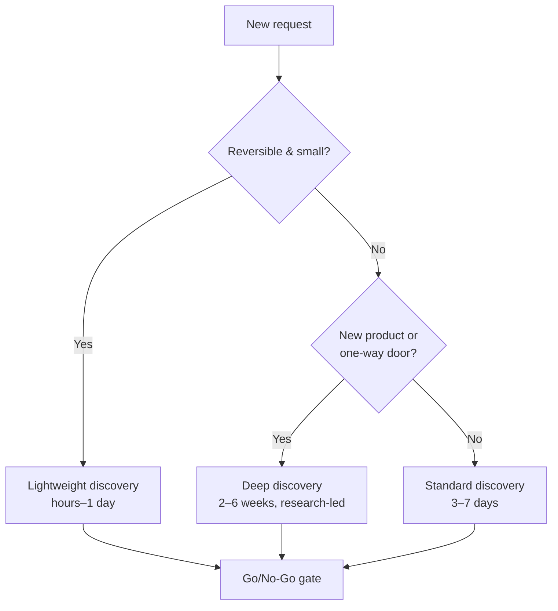

# 01 — Project Discovery

### Turning Ambiguity Into Scoped, Evidence-Based Work

> *"Weeks of coding can save you hours of planning. Discovery is how we refuse that trade."*

---

**Chapter type:** Phase 1 — Discovery & Strategy
**DRI:** UX Researcher + Product Designer (joint)
**Depends on:** [`00-CONSTITUTION.md`](./00-CONSTITUTION.md) (esp. Article I, Article X)
**Feeds:** [`02-PRODUCT_STRATEGY.md`](./02-PRODUCT_STRATEGY.md), [`26-USER_EXPERIENCE.md`](./26-USER_EXPERIENCE.md), [`27-INFORMATION_ARCHITECTURE.md`](./27-INFORMATION_ARCHITECTURE.md)

---

## Table of Contents
1. [Purpose](#1-purpose)
2. [Philosophy](#2-philosophy)
3. [Principles](#3-principles)
4. [Best Practices](#4-best-practices)
5. [Anti-Patterns](#5-anti-patterns)
6. [Real-World Examples](#6-real-world-examples)
7. [Common Mistakes](#7-common-mistakes)
8. [AI Implementation Guidance](#8-ai-implementation-guidance)
9. [Human Review Checklist](#9-human-review-checklist)
10. [Automation Opportunities](#10-automation-opportunities)
11. [References for Further Study](#11-references-for-further-study)
12. [Review Checklist & Measurable Quality Criteria](#12-review-checklist--measurable-quality-criteria)

---

## 1. Purpose

Discovery is the disciplined process of converting a vague request — *"we need an app," "make it modern," "build a dashboard"* — into a **shared, evidence-based understanding** of the problem worth solving, for whom, why now, and how we will know we succeeded.

Its purpose is to eliminate the single most expensive failure in software: **building the wrong thing well.** No amount of engineering excellence, design polish, or performance tuning can rescue a product that solves a problem no one has. Discovery is the cheapest insurance we can buy against that failure, because a wrong assumption caught in a one-hour interview costs an hour; the same assumption caught after launch costs a quarter.

This chapter defines what we do *before* we commit to a solution, the artifacts we produce, and the go/no-go gate that ends discovery.

---

## 2. Philosophy

**Fall in love with the problem, not the solution.** The moment a team commits to a solution ("let's build a Kanban board"), it stops seeing the problem ("people can't tell what to work on next"). Solutions are cheap and plentiful; correctly framed problems are rare and valuable. Discovery keeps us in problem-space long enough to find the *right* problem before we spend money in solution-space.

**Ambiguity is not the enemy; unexamined certainty is.** Every project begins ambiguous. That is normal and healthy. The danger is false confidence — a stakeholder who "knows exactly what they want," a team that skips research because "it's obvious." Article X of the Constitution governs here: *"I think" is a hypothesis, not a conclusion.* Discovery converts confident opinions into tested assumptions.

**Discovery is convergent, not just divergent.** It is not endless research. It deliberately narrows: from many possible problems to one prioritized problem, from many users to a primary user, from infinite scope to a defined first slice. A discovery that does not converge has failed.

**The output of discovery is a decision, not a document.** Documents are a means. The end is a confident, evidence-backed **go / no-go / pivot** decision that the whole team owns.

---

## 3. Principles

### Principle 1 — Understand before you scope; scope before you build
> *Rationale:* Estimating and designing a solution to a misunderstood problem produces precise answers to the wrong question.

### Principle 2 — Every assumption is a risk until tested
Treat "we assume users want X" as a line item on a risk register, ranked by *impact × uncertainty*. Test the riskiest assumptions first and cheapest.
> *Rationale (Article IX + X):* The point of discovery is to buy down risk with the smallest possible experiment.

### Principle 3 — Talk to real users, not proxies
Stakeholders describe the user they *imagine*. Sales describes the user who *complains loudest*. Only real users reveal the user who *actually exists*.
> *Rationale (Article I):* The user is the point; secondhand accounts systematically distort.

### Principle 4 — Separate problems from solutions in the language you use
Ban solution words in problem-framing ("a button," "a dashboard," "an AI feature"). Force problem language ("the user cannot determine X in time Y").
> *Rationale:* Premature solution language collapses the option space before it's explored.

### Principle 5 — Define success as a measurable change in behavior or outcome
"Launch the feature" is an output, not success. "Reduce time-to-first-value from 12 min to under 3 min" is success.
> *Rationale (Article X):* Unmeasurable success is unfalsifiable; you can never learn whether you helped.

### Principle 6 — Timebox discovery; it must converge
Discovery has a start and an explicit end (the go/no-go gate). It is proportional to project risk — days for a small feature, weeks for a new product.
> *Rationale (Article IX):* Analysis without a deadline becomes paralysis.

### Principle 7 — Constraints discovered early are cheap; discovered late are catastrophic
Surface budget, timeline, tech, legal, accessibility, and organizational constraints on day one.
> *Rationale:* A constraint found at launch (e.g. a compliance requirement) can invalidate months of work.

---

## 4. Best Practices

### 4.1 Run a structured kickoff
The first session aligns everyone on *why we're here*. A tight agenda:

| Segment | Question answered | Output |
| --- | --- | --- |
| Context | Why now? What triggered this? | Problem statement draft |
| Users | Who is this for? | Primary/secondary user sketch |
| Success | How will we know it worked? | Success metrics draft |
| Constraints | What's fixed? (time, money, tech, legal) | Constraint list |
| Risks | What could make this fail? | Risk register seed |
| Scope guardrails | What is explicitly OUT? | Non-goals list |

### 4.2 Use a Discovery Brief as the single source of truth
One living document, owned by the DRI, that everyone references. Template:

```markdown
# Discovery Brief: <Project>
## Problem statement (one sentence, no solution words)
## Who has this problem (primary user + context)
## Evidence it's real (interviews, data, support tickets)
## Why now (the trigger / cost of inaction)
## Success metrics (measurable, baselined)
## Constraints (time / budget / tech / legal / a11y)
## Non-goals (explicitly out of scope)
## Key assumptions & risks (ranked by impact × uncertainty)
## Open questions
## Recommendation: GO / NO-GO / PIVOT + rationale
```

### 4.3 Frame problems with Jobs To Be Done (JTBD)
> *"When [situation], I want to [motivation], so I can [expected outcome]."*

Example: *"When I'm handed a new project, I want to understand what problem it really solves, so I can avoid building the wrong thing."* JTBD keeps focus on progress the user is trying to make, independent of any solution.

### 4.4 Interview well
- **Ask about the past, not the future.** "Tell me about the last time you…" beats "Would you use…?" People are terrible predictors of their own behavior and great narrators of their history.
- **Ask "why" five times** to reach the root need.
- **Shut up.** The interviewer should talk <20% of the time. Silence pulls out truth.
- **Never pitch.** The moment you sell, you stop learning.
- **Aim for ~5 users per segment** to surface the majority of major issues; add more for high-risk decisions.

### 4.5 Build a risk register and attack the top of it
```
| Assumption/Risk                    | Impact | Uncertainty | Priority | Test (cheapest)          |
|------------------------------------|--------|-------------|----------|--------------------------|
| Users will trust AI suggestions    | High   | High        | 1        | Prototype + 5 interviews |
| Data export is a must-have         | High   | Medium      | 2        | Support-ticket analysis  |
| SSO required for enterprise deals  | Medium | Low         | 4        | Ask sales / 3 prospects  |
```

### 4.6 Map the current state before designing the future state
Document how people solve the problem *today* (even if the answer is spreadsheets, email, and heroics). The workaround reveals the real requirements.

### 4.7 Choose the right discovery depth


---

## 5. Anti-Patterns

| Anti-pattern | Why it fails | Constitution |
| --- | --- | --- |
| **Solution-first briefs** ("build us a mobile app") | Locks scope before the problem is understood. | Art. I, VIII |
| **HiPPO-driven scope** (Highest Paid Person's Opinion) | Substitutes authority for evidence. | Art. X |
| **Research theater** (interviews whose findings never change the plan) | Wastes everyone's time; erodes trust in research. | Art. X |
| **Boiling the ocean** (discovery with no timebox) | Never converges; delays value indefinitely. | Art. IX |
| **Proxy users** (asking sales/support what users "really" want) | Systematically distorted signal. | Art. I |
| **Feature-list "requirements"** with no problem attached | Builds a pile of features nobody asked to be a product. | Art. I, IV |
| **Ignoring the current workaround** | Misses the true, revealed requirements. | Art. X |
| **Skipping non-goals** | Uncontrolled scope creep; nothing is ever "done." | Art. VIII |

---

## 6. Real-World Examples

### Example A — From "build a dashboard" to the real problem
**Request:** "Build an analytics dashboard for our ops team."
**Discovery findings:** Interviews revealed ops staff didn't *browse* metrics — they reacted to a single question three times a day: *"Are we going to miss today's SLA?"* They already had dashboards; they ignored them.
**Reframe (JTBD):** *"When my shift starts, I want to know if we're at risk of missing SLA today, so I can reallocate people before it's too late."*
**Outcome:** Instead of a 20-chart dashboard, the team shipped a single risk indicator with a drill-down. Build cost dropped ~70%; adoption went to near-100%. *The dashboard was the requested solution; the alert was the needed one.*

### Example B — Killing a project at the gate (a success)
A proposed "social feed" feature reached the go/no-go gate. The risk register's top item — *"users want social features in this tool"* — was tested with 8 interviews and a fake-door test. Zero interest; the fake door got a 0.3% click-through. **Decision: NO-GO.** Discovery cost one week and saved an estimated two engineering months. *A no-go is a discovery success, not a failure.*

### Example C — Constraint discovered late (a cautionary tale)
A team designed a data product for three weeks before someone asked legal about data residency. A regulation required in-region storage, invalidating the chosen managed service and the entire data model. **Lesson:** Constraint elicitation (Principle 7) is a day-one activity, not a pre-launch checklist item.

---

## 7. Common Mistakes

- **Confirmation-seeking interviews** — asking leading questions that fish for the answer you want.
- **Sample of one** — generalizing from the loudest stakeholder or a single power user.
- **Confusing feasibility with desirability** — proving *we can build it* while never checking *anyone wants it*.
- **No baseline** — declaring a success metric ("increase engagement") with no current number to measure against.
- **Writing the brief and never updating it** — the brief is a living document; stale briefs mislead.
- **Treating discovery as a phase you exit forever** — discovery recurs whenever a major new assumption appears.
- **Vanity metrics** — choosing metrics that look good (page views) over metrics that reflect the user's outcome.

---

## 8. AI Implementation Guidance

AI agents accelerate discovery but must never fabricate the one thing discovery is about: **real evidence.**

### 8.1 Where agents help
- **Synthesize interview notes** into themes, affinity clusters, and candidate JTBD statements — *from real transcripts you provide.*
- **Draft the Discovery Brief and risk register** from raw inputs, flagging gaps.
- **Generate interview guides** and non-leading question sets.
- **Analyze existing data** (support tickets, analytics exports, reviews) to surface patterns.
- **Stress-test framing** by arguing the opposite case ("here's why this problem might not be real").

### 8.2 Hard rules for agents (Article X, XI)
- **Never invent users, quotes, metrics, or research findings.** If evidence is absent, say: *"No evidence provided for assumption X — recommend testing before proceeding."*
- **Label inference vs. evidence** explicitly in every synthesis.
- **A human owns the go/no-go decision.** The agent may *recommend* with rationale.

### 8.3 Prompt example — synthesizing research
```
ROLE: UX Researcher for the studio, bound by 00-CONSTITUTION (Art. X).
INPUT: 6 raw interview transcripts (attached).
TASK:
  1. Extract recurring pains; cluster into themes with frequency counts.
  2. For each theme, quote 1–2 verbatim lines as evidence (cite transcript #).
  3. Propose 3 candidate JTBD statements (no solution words).
  4. List assumptions the data does NOT yet support.
RULES: Do not invent quotes. Mark every inference as [INFERENCE].
OUTPUT: themes table + JTBD list + gaps list.
```

### 8.4 Prompt example — drafting the brief
```
TASK: Draft a Discovery Brief from the attached kickoff notes + research synthesis.
Fill the standard template. For any section lacking evidence, write
"⚠️ INSUFFICIENT EVIDENCE" and list the cheapest test to close the gap.
End with a GO/NO-GO/PIVOT recommendation labeled as [RECOMMENDATION, human decides].
```

---

## 9. Human Review Checklist

- [ ] The problem statement contains **no solution words**.
- [ ] There is **real evidence** the problem exists (not just stakeholder belief).
- [ ] The **primary user** is specific and real, not a demographic abstraction.
- [ ] Success is defined as a **measurable** change, with a **baseline**.
- [ ] Constraints (time, budget, tech, legal, a11y) are documented.
- [ ] **Non-goals** are explicit.
- [ ] The **top risks** are identified and the riskiest have been tested.
- [ ] The current-state workaround is documented.
- [ ] The brief ends in a clear **GO / NO-GO / PIVOT** with rationale, owned by a human.
- [ ] Any AI-synthesized findings distinguish evidence from inference.

---

## 10. Automation Opportunities

| Task | Automation |
| --- | --- |
| Interview transcription | Speech-to-text pipeline feeding the synthesis prompt. |
| Theme clustering | LLM-assisted affinity mapping on real transcripts. |
| Support-ticket mining | Automated topic modeling to surface recurring pains. |
| Brief completeness | Linter that flags missing template sections / "⚠️ INSUFFICIENT EVIDENCE." |
| Fake-door / smoke tests | Landing-page + analytics harness to test demand cheaply. |
| Metric baselining | Auto-pull current values for proposed success metrics from analytics. |

---

## 11. References for Further Study
- **Jobs To Be Done** — the JTBD framework and switch-interview technique (Christensen; Klement).
- **User interviewing** — established practitioner literature on qualitative research and the "Mom Test" style of non-leading questioning.
- **Continuous discovery** — Teresa Torres's opportunity-solution tree approach.
- **Lean/assumption testing** — Lean Startup and Lean UX bodies of work on riskiest-assumption tests.
- **Cross-references:** [`02-PRODUCT_STRATEGY.md`](./02-PRODUCT_STRATEGY.md), [`26-USER_EXPERIENCE.md`](./26-USER_EXPERIENCE.md), [`29-USER_FLOWS.md`](./29-USER_FLOWS.md).

---

## 12. Review Checklist & Measurable Quality Criteria

### Measurable criteria
| Criterion | Target |
| --- | --- |
| Projects entering build with a signed-off Discovery Brief | 100% |
| Problem statements free of solution language | 100% |
| Success metrics with a documented baseline | 100% |
| Riskiest assumption tested before build | 100% |
| Discovery cycle time vs. planned timebox | within +20% |
| Post-launch "we built the wrong thing" incidents | trend → 0 |
| Ratio of go : no-go/pivot decisions | healthy no-go rate (a studio that never says no-go isn't really deciding) |

---

*End of `01-PROJECT_DISCOVERY.md`.*
