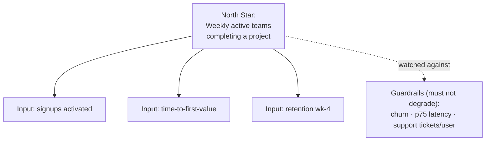

# 02 — Product Strategy

### Positioning, Prioritization, and the Discipline of Saying No

> *"Strategy is not a plan of what to do. It is a coherent set of choices about what to do — and, more importantly, what to refuse."*

---

**Chapter type:** Phase 1 — Discovery & Strategy
**DRI:** Product Designer + Brand Strategist (joint)
**Depends on:** [`00-CONSTITUTION.md`](./00-CONSTITUTION.md), [`01-PROJECT_DISCOVERY.md`](./01-PROJECT_DISCOVERY.md)
**Feeds:** [`03-BRAND_STRATEGY.md`](./03-BRAND_STRATEGY.md), [`26-USER_EXPERIENCE.md`](./26-USER_EXPERIENCE.md), all product-surface chapters (16–19)

---

## Table of Contents
1. [Purpose](#1-purpose)
2. [Philosophy](#2-philosophy)
3. [Principles](#3-principles)
4. [Best Practices](#4-best-practices)
5. [Anti-Patterns](#5-anti-patterns)
6. [Real-World Examples](#6-real-world-examples)
7. [Common Mistakes](#7-common-mistakes)
8. [AI Implementation Guidance](#8-ai-implementation-guidance)
9. [Human Review Checklist](#9-human-review-checklist)
10. [Automation Opportunities](#10-automation-opportunities)
11. [References for Further Study](#11-references-for-further-study)
12. [Review Checklist & Measurable Quality Criteria](#12-review-checklist--measurable-quality-criteria)

---

## 1. Purpose

Discovery ([`01`](./01-PROJECT_DISCOVERY.md)) tells us *which problem is worth solving and for whom.* Product strategy answers the next questions: **How will we win? What will we build first, and next, and never? How will we know we're winning?**

The purpose of this chapter is to give the studio a repeatable way to turn a validated problem into a **coherent, defensible set of choices** — a positioning, a prioritized roadmap, and a metric system — that aligns designers, engineers, and stakeholders on the *same* bets. Without strategy, teams ship features that individually make sense and collectively make none. With it, every feature is a move in a game the whole team can see.

---

## 2. Philosophy

**Strategy is choice, and choice is subtraction.** A strategy that includes everything is not a strategy; it's a wish list. The hardest, most valuable work of strategy is deciding what *not* to do — which customers to ignore, which features to refuse, which comparisons to lose on purpose. A team that cannot name what it won't build has no strategy.

**A roadmap is a set of hypotheses, not a set of promises.** We do not "commit to shipping feature X in Q3." We commit to *learning* whether X moves the metric it's supposed to move, and to adjusting. Roadmaps built as delivery calendars decay into death marches; roadmaps built as learning agendas stay honest (Article X, IX).

**Differentiation beats optimization.** Being 10% better than a competitor on the same axis is a losing game — the incumbent has more resources to out-optimize you. Being *different* on an axis customers care about is how small teams win. Strategy finds that axis.

**Outcomes over outputs, always.** Shipping is not winning. A feature that ships and changes nothing is waste dressed up as progress. Every strategic bet is defined by the *outcome* it targets, and killed if it doesn't produce one.

---

## 3. Principles

### Principle 1 — Positioning is the foundation; build it first
Before roadmaps, answer: *For [target], who [need], our product is a [category] that [key benefit], unlike [alternative], because [differentiator].* Everything downstream inherits this.
> *Rationale:* Features without positioning are a random walk. Positioning is the compass.

### Principle 2 — Prioritize by value and cost of delay, not by loudness
Use a transparent framework (see 4.3). The question is never "who asked?" but "what produces the most user+business outcome per unit of effort and risk?"
> *Rationale (Art. X):* Replaces politics with a defensible model.

### Principle 3 — Ruthlessly define non-goals
For every strategy, maintain an explicit "We are NOT doing this" list. It is as important as the roadmap.
> *Rationale (Art. VIII):* Focus is a finite resource; non-goals protect it.

### Principle 4 — Sequence for learning, not just delivery
Order work so the riskiest, most informative bets come first. Front-load the experiments that could invalidate the strategy.
> *Rationale (Art. IX, X):* Learn cheaply and early; fail before you've spent the budget.

### Principle 5 — Every initiative maps to a metric; every metric maps to a user outcome
No orphan features (features with no target metric) and no vanity metrics (metrics with no user meaning).
> *Rationale (Art. I, X):* Connects the whole roadmap to real value.

### Principle 6 — Strategy is time-boxed and revisited
Set a strategy horizon (e.g. a quarter/half), review it on cadence, and change it when evidence demands — loudly (Art. XII).
> *Rationale:* A strategy never revisited becomes dogma; a strategy changed weekly is noise.

### Principle 7 — Constraints shape strategy; name them
Team size, runway, tech, distribution, and brand all bound what's viable. Strategy that ignores constraints is fantasy.

---

## 4. Best Practices

### 4.1 Write a one-page Strategy Brief
```markdown
# Product Strategy: <Product/Initiative> — <horizon>
## Positioning statement (the fill-in-the-blank from Principle 1)
## Target segment (primary; who we're NOT for)
## Problem & JTBD (from Discovery)
## Winning aspiration (what "winning" looks like in one sentence)
## Where we play / How we win (the core choices)
## Differentiator (the axis we own)
## Roadmap themes (Now / Next / Later — outcomes, not features)
## Success metrics (North Star + supporting; with baselines & targets)
## Non-goals (explicit refusals)
## Key risks & the experiments that de-risk them
```

### 4.2 Choose a North Star Metric (NSM) + guardrails
The **North Star** is the single metric that best captures the value users get (e.g. "weekly active teams completing a project"). Pair it with **guardrail metrics** that must not degrade (e.g. churn, latency, support load) so you don't win the NSM by harming something else.



### 4.3 Prioritize with a transparent framework
Pick one and apply it consistently. Two workhorses:

**RICE** — score = (Reach × Impact × Confidence) ÷ Effort.

| Initiative | Reach | Impact | Confidence | Effort | RICE |
| --- | --- | --- | --- | --- | --- |
| Onboarding revamp | 4000 | 2.0 | 80% | 3 | 2133 |
| CSV export | 900 | 1.0 | 100% | 1 | 900 |
| AI summary | 4000 | 1.5 | 40% | 5 | 480 |

**Cost of Delay ÷ Duration (CD3 / WSJF)** — best when timing matters (deadlines, market windows). Rank by cost-of-delay per unit time.

Whatever the framework: **the number informs the decision; it does not make it.** Humans adjust for strategic fit.

### 4.4 Structure the roadmap as Now / Next / Later
Avoid date-based roadmaps that overpromise. Use confidence-decaying horizons:

| Horizon | Confidence | Granularity |
| --- | --- | --- |
| **Now** | High | Specific, scoped, in-flight |
| **Next** | Medium | Themes with rough shape |
| **Later** | Low | Directions/bets, not commitments |

### 4.5 Run a pre-mortem on the strategy
Before committing: *"It's a year from now and this strategy failed. Why?"* List the causes; convert the top ones into risks with experiments (ties to Discovery's risk register).

### 4.6 Map the competitive axis, then pick a different one
Plot competitors on the two axes customers actually care about. Look for an **unoccupied, valuable corner** — that's your differentiation. If every corner is taken, question whether the market is right (back to Discovery).

### 4.7 Connect strategy to design and engineering
The Strategy Brief is an input to the product-surface chapters ([`16`](./16-DASHBOARD_DESIGN.md)–[`19`](./19-ECOMMERCE_DESIGN.md)) and to architecture ([`41`](./41-CODE_ARCHITECTURE.md)). If a strategic bet implies scale, that must reach the Backend Architect *now*, not at launch.

---

## 5. Anti-Patterns

| Anti-pattern | Why it fails | Constitution |
| --- | --- | --- |
| **The everything roadmap** | No focus; team spread thin; nothing excellent. | Art. VIII |
| **Feature parity chasing** | Optimizing on the incumbent's axis; you lose by default. | — |
| **Date-driven promises** | Turns hypotheses into obligations; breeds death marches. | Art. IX |
| **Vanity North Star** (e.g. raw pageviews) | Optimizes something that isn't user value. | Art. I, X |
| **Roadmap by loudest customer** | Strategy captured by whoever complains most. | Art. X |
| **No guardrails** | Winning the NSM by silently harming churn/latency/trust. | Art. II |
| **Strategy as a slide, never revisited** | Becomes stale dogma; reality drifts away from it. | Art. XII |
| **Copy-competitor strategy** | Inherits their trade-offs without their resources. | — |

---

## 6. Real-World Examples

### Example A — Choosing a North Star that changed the roadmap
A collaboration tool measured success by "monthly active users." It grew MAU while revenue stalled — people logged in, poked around, and left. The team switched the North Star to **"weekly active teams that completed a shared project."** Suddenly, onboarding and collaboration features (not vanity growth hacks) rose to the top of the roadmap, because *those* moved the new metric. Retention and revenue followed. *The metric wasn't a scoreboard; it was a steering wheel.*

### Example B — Winning by picking a different axis
Entering a crowded note-taking market, a small studio mapped competitors on two axes: *power* and *simplicity*. Everyone clustered at "powerful + complex." The empty corner was "opinionated + effortless for one specific job (meeting notes)." They positioned there, refused to add general-purpose features (non-goals!), and won a defensible niche. *Differentiation, not optimization.*

### Example C — A pre-mortem that saved a quarter
Pre-mortem question: *"Why did our AI feature fail?"* Top answer from the team: *"Users didn't trust the output and had no way to verify it."* This surfaced *before* build. The team re-sequenced to ship a "show your sources / editable draft" experience first — de-risking trust before investing in model quality. The feature launched with adoption instead of skepticism.

---

## 7. Common Mistakes

- **Confusing a roadmap with a strategy.** A list of features in order is not a set of coherent choices.
- **Skipping positioning.** Jumping to features without deciding who you're for and how you win.
- **One metric to rule them all, with no guardrails.** Every metric can be gamed in a way that harms something unmeasured.
- **Prioritization theater.** Building a RICE spreadsheet, then ignoring it for the HiPPO's pet feature.
- **Never saying no.** A backlog that only grows signals a strategy that never chooses.
- **Estimating impact with false precision.** RICE numbers are directional; treating them as exact is self-deception.
- **Divorcing strategy from feasibility.** Betting on scale/features the team and runway can't support.

---

## 8. AI Implementation Guidance

### 8.1 Where agents help
- **Draft positioning statements** and generate multiple differentiation angles to react to.
- **Build and pressure-test prioritization models** (RICE/WSJF) from provided inputs; expose the sensitivity of rankings to each input.
- **Run structured pre-mortems** by generating failure modes to consider.
- **Summarize competitive landscapes** from provided material and plot axes.
- **Check coherence:** does every roadmap item map to a metric, and every metric to a user outcome? Flag orphans.

### 8.2 Hard rules (Art. X, XI)
- Agents **do not set strategy**; they generate options and expose trade-offs. A human commits.
- **No invented market data, competitor facts, or metric values.** Use only provided inputs or clearly-labeled, sourced web research; mark estimates as estimates.
- Every recommendation states the assumptions it depends on and how sensitive it is to them.

### 8.3 Prompt example — prioritization sanity check
```
ROLE: Product strategist, bound by 00-CONSTITUTION (Art. X).
INPUT: backlog with Reach/Impact/Confidence/Effort estimates (attached).
TASK:
  1. Compute RICE; rank.
  2. Flag any item lacking a target metric ("orphan feature").
  3. Show which rankings flip if Confidence on the top 3 is halved
     (sensitivity analysis).
  4. Name the top strategic risk the numbers ignore.
OUTPUT: ranked table + sensitivity note + risk callout. Do NOT invent estimates.
```

### 8.4 Prompt example — positioning options
```
TASK: From the Strategy Brief inputs, generate 3 distinct positioning statements,
each targeting a DIFFERENT differentiation axis. For each, list who we implicitly
say NO to (the non-goals it creates). Label all market claims [ASSUMPTION] unless sourced.
```

---

## 9. Human Review Checklist

- [ ] A crisp **positioning statement** exists (target, need, category, benefit, differentiator).
- [ ] The strategy names an explicit **differentiation axis** (not "be better at everything").
- [ ] A **North Star metric** is defined with a baseline and target, plus **guardrails**.
- [ ] Every roadmap item maps to a metric; every metric maps to a **user outcome** (no orphans, no vanity metrics).
- [ ] **Non-goals** are explicit and specific.
- [ ] The roadmap is **Now/Next/Later** (confidence-decaying), not date-promised.
- [ ] The riskiest bets are **sequenced first** for learning.
- [ ] A **pre-mortem** was run and top risks have experiments.
- [ ] Constraints (team, runway, tech, distribution) are acknowledged.
- [ ] A human owns the committed strategy; AI contributions are labeled.

---

## 10. Automation Opportunities

| Task | Automation |
| --- | --- |
| Metric tracking | Dashboard pulling NSM + guardrails automatically, with alerts on guardrail breach. |
| Prioritization | Spreadsheet/tool that recomputes RICE/WSJF and flags orphan features. |
| Roadmap coherence | Linter checking each initiative links to a metric and an outcome. |
| Competitive monitoring | Scheduled research digests (human-verified) on competitor moves. |
| Strategy review cadence | Calendar automation forcing the periodic strategy revisit (Principle 6). |

---

## 11. References for Further Study
- **Positioning:** the classic positioning literature (Ries & Trout) and April Dunford's modern "obviously awesome" approach.
- **Strategy as choice:** Lafley & Martin's *Playing to Win* (where-to-play / how-to-win cascade).
- **Good/bad strategy:** Richard Rumelt on the "kernel" of strategy and strategy as diagnosis + guiding policy + coherent action.
- **Metrics:** the North Star framework and the AARRR "pirate metrics" model; guardrail-metric practice.
- **Prioritization:** RICE (Intercom), WSJF/Cost of Delay (SAFe/lean literature).
- **Cross-references:** [`01-PROJECT_DISCOVERY.md`](./01-PROJECT_DISCOVERY.md), [`03-BRAND_STRATEGY.md`](./03-BRAND_STRATEGY.md), [`50-CONTINUOUS_IMPROVEMENT.md`](./50-CONTINUOUS_IMPROVEMENT.md).

---

## 12. Review Checklist & Measurable Quality Criteria

| Criterion | Target |
| --- | --- |
| Initiatives with a target metric | 100% (no orphans) |
| Metrics traceable to a user outcome | 100% (no vanity metrics) |
| Strategy documents with explicit non-goals | 100% |
| Guardrail metrics defined per North Star | ≥ 3 |
| Strategy reviewed on committed cadence | 100% of cycles |
| Roadmap accuracy of "Now" horizon (shipped as planned ± scope) | ≥ 80% |
| Bets validated/invalidated by experiment before full build | ≥ 90% of high-risk bets |

---

*End of `02-PRODUCT_STRATEGY.md`.*
