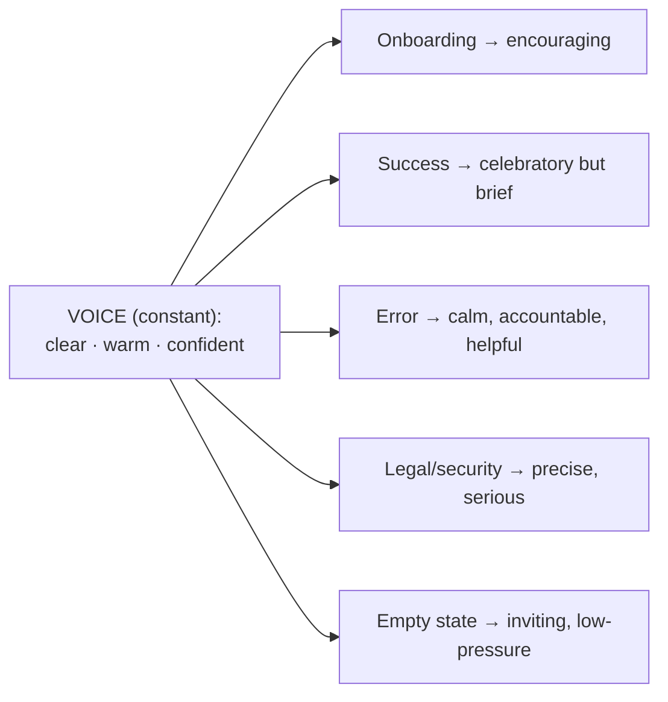

# 03 — Brand Strategy

### Identity, Voice, and the Strategic Role of Brand

> *"Brand is not what you say you are. It is what people expect from you — the promise they trust before they click."*

---

**Chapter type:** Phase 1 — Discovery & Strategy
**DRI:** Brand Strategist + Creative Director (joint)
**Depends on:** [`00-CONSTITUTION.md`](./00-CONSTITUTION.md), [`01-PROJECT_DISCOVERY.md`](./01-PROJECT_DISCOVERY.md), [`02-PRODUCT_STRATEGY.md`](./02-PRODUCT_STRATEGY.md)
**Feeds:** [`04-DESIGN_PHILOSOPHY.md`](./04-DESIGN_PHILOSOPHY.md), [`05-VISUAL_PSYCHOLOGY.md`](./05-VISUAL_PSYCHOLOGY.md), [`06-COLOR_SYSTEM.md`](./06-COLOR_SYSTEM.md), [`07-TYPOGRAPHY_SYSTEM.md`](./07-TYPOGRAPHY_SYSTEM.md), [`25-COPYWRITING.md`](./25-COPYWRITING.md)

---

## Table of Contents
1. [Purpose](#1-purpose)
2. [Philosophy](#2-philosophy)
3. [Principles](#3-principles)
4. [Best Practices](#4-best-practices)
5. [Anti-Patterns](#5-anti-patterns)
6. [Real-World Examples](#6-real-world-examples)
7. [Common Mistakes](#7-common-mistakes)
8. [AI Implementation Guidance](#8-ai-implementation-guidance)
9. [Human Review Checklist](#9-human-review-checklist)
10. [Automation Opportunities](#10-automation-opportunities)
11. [References for Further Study](#11-references-for-further-study)
12. [Review Checklist & Measurable Quality Criteria](#12-review-checklist--measurable-quality-criteria)

---

## 1. Purpose

Brand strategy defines **who the product is** — its personality, voice, values, and the promise it makes — so that every downstream decision (color, type, motion, copy, even error messages) expresses one coherent identity instead of a committee of unrelated choices.

The purpose of this chapter is to make brand a **strategic input to design and engineering**, not a decorative afterthought. A logo is not a brand. A color is not a brand. A brand is the *consistent, felt experience* of interacting with a product — the sum of a thousand small signals that together answer the user's subconscious question: *"Can I trust these people, and are they for someone like me?"* This chapter turns that intangible into a documented system the whole studio can execute against.

---

## 2. Philosophy

**Brand is the pre-experience of the product.** Before a user reads a single feature, they've already formed expectations from the first screen's color, tone, and typography. Brand manages those expectations so the product feels *inevitable* rather than arbitrary. When brand and product agree, trust compounds; when they contradict (a playful brand with a cold product, or vice versa), users feel a dissonance they can't name and trust erodes.

**Consistency is the entire mechanism.** A brand's power comes almost entirely from repetition. The same voice, the same palette, the same rhythm — encountered again and again — is what turns recognition into familiarity and familiarity into trust. This is Article V (consistency by default) applied to identity. A brand that reinvents itself every screen has no brand.

**Brand lives in the details users don't consciously notice.** The tone of an empty state, the copy of a 404, the easing of a hover, the punctuation in a button — these "unimportant" moments *are* the brand, because they reveal whether care is systemic or superficial. Article VII: beauty and care are requirements, and brand is where they become felt.

**Authenticity over aspiration.** A brand must reflect what the product actually is and does, not what the marketing wishes it were. A promise the product can't keep is worse than no promise — it manufactures betrayal. Brand strategy is bounded by truth.

---

## 3. Principles

### Principle 1 — Brand is downstream of strategy, upstream of design
It inherits the positioning and differentiator from [`02`](./02-PRODUCT_STRATEGY.md), and it dictates the constraints that [`04`–`25`](./04-DESIGN_PHILOSOPHY.md) must express.
> *Rationale:* Brand without strategy is decoration; design without brand is inconsistency.

### Principle 2 — Define personality before aesthetics
Decide *who the brand is* (traits, voice) before *how it looks* (color, type). Aesthetics are the expression; personality is the source.
> *Rationale:* Choosing colors before knowing the personality produces pretty but meaningless choices (Art. VI — explainability).

### Principle 3 — One voice, many volumes
The brand voice is constant; its *tone* adapts to context (a celebration vs. an error vs. a legal notice). Same person, different moments.
> *Rationale:* Voice = identity (fixed); tone = appropriateness (variable). Confusing them yields either robotic sameness or personality whiplash.

### Principle 4 — Every brand attribute must be operationalized
"Friendly" is useless until it becomes *rules*: "We use contractions. We never blame the user. We keep sentences under 20 words." Abstract adjectives don't ship.
> *Rationale (Art. VI):* Un-operationalized values can't be executed or reviewed.

### Principle 5 — Accessibility and ethics are brand attributes
An inaccessible or manipulative brand is not "edgy"; it's untrustworthy. Inclusivity and honesty are part of identity, not constraints on it (Art. II, III).

### Principle 6 — Brand is a system, versioned like code
Guidelines live in the repo, are versioned, and evolve deliberately (Art. IV). The brand system connects to design tokens ([`15`](./15-DESIGN_TOKENS.md)).

### Principle 7 — Consistency across every touchpoint
The brand is the same in the app, the emails, the docs, the error logs users see, and the support replies. One identity, everywhere.

---

## 4. Best Practices

### 4.1 Write a Brand Strategy Brief
```markdown
# Brand Strategy: <Product>
## Brand promise (one sentence — what we reliably deliver)
## Positioning inheritance (from 02: target, differentiator)
## Personality (3–5 traits, each with a "we are / we are not" pair)
## Voice (how we always sound) + Tone matrix (how we adapt by context)
## Values (what we will and won't do — includes a11y & ethics)
## Naming & terminology (product/feature naming conventions)
## Visual direction brief (mood, references, constraints — NOT final design)
## Do / Don't examples (real snippets)
```

### 4.2 Define personality with polarity pairs
Vague adjectives get sharp when bounded by their opposite:

| Trait | We ARE | We are NOT |
| --- | --- | --- |
| Confident | direct, clear | arrogant, dismissive |
| Warm | human, encouraging | saccharine, fake-cheerful |
| Precise | accurate, specific | pedantic, cold |
| Efficient | respects your time | rushed, terse to the point of rude |

### 4.3 Build a tone matrix (voice constant, tone contextual)


| Context | Tone | Example copy |
| --- | --- | --- |
| Success | Warm, brief | "Nice — your project is live." |
| Error (our fault) | Accountable, calm | "Something went wrong on our end. We're on it — try again in a moment." |
| Error (user input) | Helpful, never blaming | "That email doesn't look right. Mind checking it?" |
| Destructive confirm | Serious, clear | "This permanently deletes 3 projects. This can't be undone." |
| Empty state | Inviting | "No projects yet. Create your first — it takes about a minute." |

### 4.4 Create a terminology dictionary
Decide the *canonical* word for each concept and never deviate. If it's a "project," it's never sometimes a "workspace" or "board." Consistency of naming is consistency of thought (feeds [`25`](./25-COPYWRITING.md), [`27`](./27-INFORMATION_ARCHITECTURE.md)).

| Concept | Canonical term | Never use |
| --- | --- | --- |
| A unit of work | Project | Board, workspace, space |
| A person on a team | Member | User (in UI), seat |
| Removing access | Remove | Kick, ban, delete (person) |

### 4.5 Translate brand into visual constraints (not final design)
The Brand Strategist hands the design foundations chapters a *brief*, not finished art: emotional targets, references, and constraints. Example: *"Confident + warm → high-contrast neutral base with one warm accent; a humanist sans (not geometric-cold, not decorative); generous whitespace signals confidence; motion is quick and purposeful, never bouncy."* This directly seeds [`06`](./06-COLOR_SYSTEM.md), [`07`](./07-TYPOGRAPHY_SYSTEM.md), [`23`](./23-MOTION_SYSTEM.md).

### 4.6 Audit for consistency regularly
Periodically sample real touchpoints (app screens, emails, error messages, docs) and score each against the brief. Drift is normal; catching it is the job.

---

## 5. Anti-Patterns

| Anti-pattern | Why it fails | Constitution |
| --- | --- | --- |
| **Logo = brand** | Reduces identity to a mark; ignores voice, behavior, consistency. | Art. IV |
| **Adjective soup** ("modern, clean, innovative") | Means nothing; every brand claims these; not operational. | Art. VI |
| **Personality whiplash** | Playful onboarding, cold errors, corporate emails — no coherent self. | Art. V |
| **Aspiration over truth** | Promising what the product can't deliver; manufactures betrayal. | Art. I |
| **Voice/tone confusion** | Either robotic sameness or unhinged inconsistency. | — |
| **Terminology drift** | Same concept called three names; users get confused, IA rots. | Art. V |
| **Manipulative "bold" brand** | Dark patterns dressed as personality; destroys trust. | Art. III |
| **Guidelines as a dead PDF** | Never referenced, never enforced, immediately stale. | Art. IV |

---

## 6. Real-World Examples

### Example A — Operationalizing "friendly" so it actually shipped
A team kept writing "be friendly" in reviews, yet the product felt cold. The fix wasn't more reminders — it was *rules*: use contractions; address the user as "you"; never use "invalid" or "illegal input"; success messages ≤ 8 words; every error offers a next step. Suddenly reviewers could *check* friendliness, agents could *generate* it, and the felt brand changed. *Abstract values don't ship; operationalized ones do (Principle 4).*

### Example B — Voice constant, tone adaptive
A finance app's voice is "precise and reassuring." In a successful transfer: *"Sent. Your $500 will arrive by Friday."* (reassuring, brief). In a failed one: *"We couldn't complete this transfer. Your money hasn't moved. Here's what to check."* (still precise, now accountable and calming). Same voice, different tone — the user feels one consistent, trustworthy personality across opposite emotional moments. *(Principle 3.)*

### Example C — Terminology dictionary preventing IA rot
A product used "folder," "collection," and "group" interchangeably for the same concept across UI, docs, and API. New users were constantly confused; support tickets spiked. Introducing a terminology dictionary (canonical term: "collection," everywhere) cut related confusion tickets significantly and made the information architecture legible. *Naming is not cosmetic; it's cognitive (Principle 4, feeds [`27`](./27-INFORMATION_ARCHITECTURE.md)).*

---

## 7. Common Mistakes

- **Designing visuals before defining personality** (Principle 2 inverted) — pretty choices with no meaning behind them.
- **Copying a competitor's or admired company's brand** — inherits their identity, contradicts your own product truth.
- **Leaving error/empty/legal states "for later"** — these edge moments are where brand is most tested and most often broken.
- **Treating accessibility as opposed to brand aesthetics** — a false trade-off; inclusive *is* on-brand (Principle 5).
- **No single owner** — brand-by-committee produces averaged mush.
- **Guidelines with no examples** — abstract rules get interpreted inconsistently; always show do/don't snippets.
- **Never auditing** — assuming the brand stays consistent without measurement (it never does).

---

## 8. AI Implementation Guidance

Brand is one of the highest-leverage places for AI *and* one of the easiest to get subtly wrong, because tone is delicate.

### 8.1 Where agents help
- **Generate on-voice copy at scale** (empty states, errors, microcopy) — *given the operationalized voice rules.*
- **Audit existing copy** against the tone matrix and flag off-brand instances.
- **Enforce the terminology dictionary** by scanning for banned/inconsistent terms.
- **Draft the brand brief** from strategy inputs and propose personality polarity pairs.
- **Produce mood/visual-direction briefs** for the design foundations chapters (as constraints, not final art).

### 8.2 Hard rules (Art. V, VI)
- The agent must be **given the voice rules and terminology dictionary**; it must not invent a brand voice and silently apply it.
- Every generated string is checked against: voice rules, tone-for-context, terminology dictionary, reading level, and a11y (no reliance on tone alone to convey critical meaning).
- Flag, don't fix silently: when the agent changes brand-affecting copy, it lists what it changed and why (Art. XII).

### 8.3 Prompt example — generate on-brand microcopy
```
ROLE: Brand copywriter, bound by 00-CONSTITUTION + this chapter.
BRAND: voice = clear, warm, confident. Rules: contractions on; never blame the
  user; errors offer a next step; success ≤ 8 words. Terminology: "project" (not
  board/workspace); "member" (not user in UI).
TASK: Write copy for these states: empty projects list, failed save (our fault),
  invalid email input, delete-project confirmation.
CONSTRAINTS: Match the tone-per-context matrix. Reading level ≤ grade 8.
  No meaning conveyed by tone/color alone.
OUTPUT: table of {state, tone, copy}. Flag any place brand rules conflict.
```

### 8.4 Prompt example — brand audit
```
TASK: Audit the attached 40 UI strings against our voice rules + terminology
dictionary. Output a table: {string, issue, rule violated, suggested rewrite}.
Do not rewrite strings that already comply. Mark subjective calls as [JUDGMENT].
```

---

## 9. Human Review Checklist

- [ ] A **brand promise** is stated and is *true to the product* (authentic, not aspirational fiction).
- [ ] **Personality** is defined with polarity pairs (we are / we are not), not adjective soup.
- [ ] **Voice** is constant and documented; a **tone matrix** covers success/error/empty/legal/destructive contexts.
- [ ] Every brand attribute is **operationalized** into checkable rules.
- [ ] A **terminology dictionary** exists and is applied everywhere (UI, docs, API).
- [ ] Accessibility and ethics are treated as **brand attributes** (Principle 5), not constraints.
- [ ] Brand translates into a **visual-direction brief** feeding the design foundations chapters.
- [ ] Edge states (404, empty, error, legal) are on-brand — not left for "later."
- [ ] The brand system is **versioned** and has a single owner (DRI).
- [ ] AI-generated copy was checked against voice, tone, terminology, reading level, and a11y.

---

## 10. Automation Opportunities

| Task | Automation |
| --- | --- |
| Terminology enforcement | Linter/CI rule flagging banned or off-canonical terms in code, copy, docs. |
| Voice consistency | LLM-based copy audit run on PRs touching user-facing strings. |
| Reading-level check | Automated readability scoring on microcopy (target grade level). |
| Brand drift audit | Scheduled sampling of screenshots + strings scored against the brief. |
| Token linkage | Brand visual constraints wired into design tokens ([`15`](./15-DESIGN_TOKENS.md)) so palette/type stay on-brand. |
| a11y-in-copy | Check that no critical meaning is carried by tone/color words alone. |

---

## 11. References for Further Study
- **Brand strategy fundamentals:** Marty Neumeier's *The Brand Gap* / *Zag* (differentiation, brand-as-gut-feeling).
- **Verbal identity & voice:** established content-strategy literature on voice-vs-tone (e.g. the voice-and-tone practice popularized by MailChimp's public content guide as a *reference pattern*, not to copy).
- **Archetypes:** the brand-archetype framework (Jung-derived) as one tool for personality definition.
- **Naming & terminology:** content-design literature on plain language and consistent terminology.
- **Cross-references:** [`02-PRODUCT_STRATEGY.md`](./02-PRODUCT_STRATEGY.md), [`05-VISUAL_PSYCHOLOGY.md`](./05-VISUAL_PSYCHOLOGY.md), [`06-COLOR_SYSTEM.md`](./06-COLOR_SYSTEM.md), [`07-TYPOGRAPHY_SYSTEM.md`](./07-TYPOGRAPHY_SYSTEM.md), [`25-COPYWRITING.md`](./25-COPYWRITING.md).

---

## 12. Review Checklist & Measurable Quality Criteria

| Criterion | Target |
| --- | --- |
| Brand attributes operationalized into checkable rules | 100% |
| User-facing surfaces covered by the tone matrix | 100% |
| Terminology-dictionary compliance across UI/docs/API | ≥ 98% |
| Edge states (error/empty/404/legal) reviewed for brand | 100% |
| Brand guidelines versioned with a named owner | Yes |
| Brand-drift audit cadence honored | 100% of cycles |
| Aided brand recognition / trust (where measurable) | ↑ trend |

---

*End of `03-BRAND_STRATEGY.md`. Phase 1 (Discovery & Strategy) complete.*
