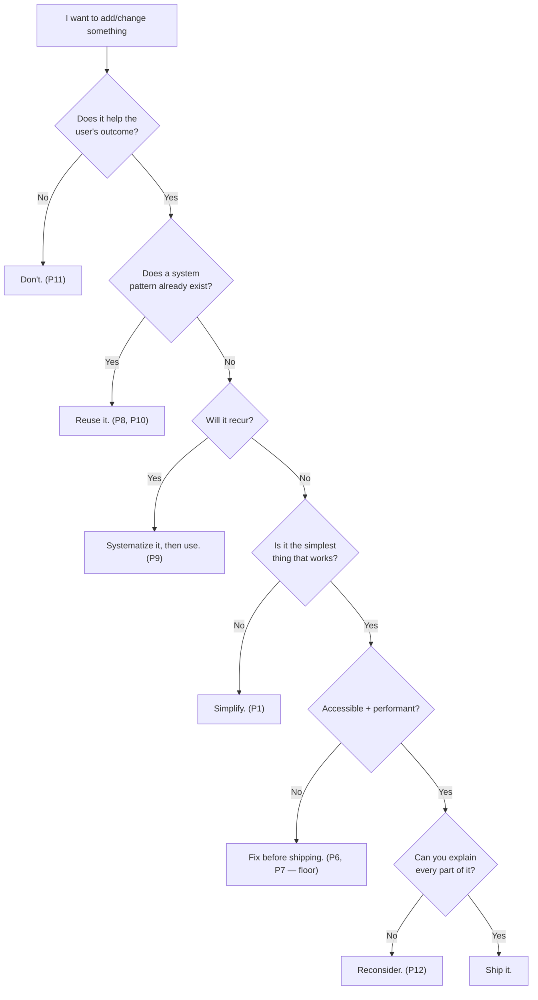

# 04 — Design Philosophy

### The Craft Creed, Expanded

> *"Good design is as little design as possible — but no less. The art is knowing where 'as possible' ends."*

---

**Chapter type:** Phase 2 — Design Foundations
**DRI:** Creative Director + Senior UI Designer (joint)
**Depends on:** [`00-CONSTITUTION.md`](./00-CONSTITUTION.md), [`03-BRAND_STRATEGY.md`](./03-BRAND_STRATEGY.md)
**Feeds:** every design chapter (05–29), and indirectly every engineering chapter

---

## Table of Contents
1. [Purpose](#1-purpose)
2. [Philosophy](#2-philosophy)
3. [Principles](#3-principles)
4. [Best Practices](#4-best-practices)
5. [Anti-Patterns](#5-anti-patterns)
6. [Real-World Examples](#6-real-world-examples)
7. [Common Mistakes](#7-common-mistakes)
8. [AI Implementation Guidance](#8-ai-implementation-guidance)
9. [Human Review Checklist](#9-human-review-checklist)
10. [Automation Opportunities](#10-automation-opportunities)
11. [References for Further Study](#11-references-for-further-study)
12. [Review Checklist & Measurable Quality Criteria](#12-review-checklist--measurable-quality-criteria)

---

## 1. Purpose

This chapter expands the twelve-point Design Philosophy from the [`README`](./README.md) and [`Constitution`](./00-CONSTITUTION.md) into a working creed that every subsequent design chapter (color, type, spacing, layout, components, motion, UX) inherits and specializes.

Its purpose is to give the studio a **shared aesthetic and functional worldview** — so that when ten designers and five AI agents each make a hundred micro-decisions, those decisions *rhyme*. Design philosophy is the tuning fork the whole orchestra listens to. Without it, individually reasonable choices produce a collectively incoherent product. With it, even distributed, asynchronous, human-plus-AI design converges on one voice.

This is the "why" chapter for design. The chapters that follow are the "how."

---

## 2. Philosophy

**Design is not how it looks; design is how it works — *and* how it feels while working.** The old dichotomy ("form vs. function") is false. In software, the form *is* part of the function: a confusing layout is a broken feature; an ugly interface erodes trust in a correct system. We reject both "make it pretty" (decoration without purpose) and "just make it work" (function without care). We hold both, in the order the Constitution's Quality Hierarchy demands.

**Design is a system of decisions, not a collection of screens.** Any designer can make one beautiful screen. The discipline is making a thousand screens that feel like one product — by designing the *rules* (tokens, scales, patterns, components) rather than the artifacts. This is Article IV made visual. A studio's design maturity is measured not by its best screen but by the *consistency of its worst* one.

**Restraint is the hardest skill and the highest one.** Adding is easy; anyone can add a gradient, a shadow, an animation, a feature. Subtracting — knowing what to leave out — requires taste, confidence, and understanding of the goal. Every element added dilutes the ones already there. The mature designer's default move is *removal*.

**Every decision is explainable or it is wrong.** (Article VI.) "It felt right" is the beginning of a rationale, not the end. Behind every good design choice is a reason grounded in a user need, a perceptual principle, a brand attribute, or a measured outcome. Taste is compressed reasoning; we decompress it so it can be taught and reviewed.

---

## 3. Principles

The twelve tenets, each expanded with rationale and a concrete test you can apply.

### Principle 1 — Minimalism over clutter
Remove until it breaks, then add back the one thing you needed. Clutter is unmade decisions.
**Test:** Can you delete this element and still accomplish the user's goal? If yes, delete it.
> *Rationale:* Every element competes for attention; fewer elements means each remaining one is stronger.

### Principle 2 — Hierarchy over decoration
Guide the eye through importance; don't ornament equally. The user should always know where to look first, second, third.
**Test:** Squint at the screen. Can you still tell what's most important? If everything blurs into one gray mass, hierarchy has failed.
> *Rationale:* Users scan, they don't read. Hierarchy is how you speak to a scanner.

### Principle 3 — Whitespace is a design feature
Space is not "empty" or "wasted." It creates grouping, focus, rhythm, and calm. Density is a choice, not a default.
**Test:** Is spacing *intentional and consistent* (from the scale, [`08`](./08-SPACING_SYSTEM.md)) or accidental?
> *Rationale:* Proximity communicates relationship (Gestalt). Space is how you say "these things belong together" and "this deserves room to breathe."

### Principle 4 — Typography carries hierarchy
Most "design problems" are typography problems. Size, weight, spacing, and contrast in type do 80% of hierarchy's work.
**Test:** Remove all color and imagery. Is the page still navigable by type alone? It should be.
> *Rationale:* Text is the dominant content of most software; getting type right fixes more than any other single lever ([`07`](./07-TYPOGRAPHY_SYSTEM.md)).

### Principle 5 — Motion guides attention
Animation is wayfinding, not decoration. It shows relationships (this came from there), directs focus, and confirms actions.
**Test:** Does this animation *tell the user something*? If it's purely ornamental and delays them, cut it ([`23`](./23-MOTION_SYSTEM.md)).
> *Rationale (Art. I, II):* Motion that doesn't inform costs performance and attention for nothing.

### Principle 6 — Performance is part of design
A design that is slow is a bad design, no matter how it looks in a static mockup. Perceived speed is a design deliverable.
**Test:** Have you designed the loading, empty, slow, and error states — not just the happy, fully-loaded state?
> *Rationale (Art. II):* Users experience the *running* product, not the Figma file ([`35`](./35-PERFORMANCE.md)).

### Principle 7 — Accessibility is mandatory
Inclusive design is not a mode or a phase; it's the definition of "done." Contrast, focus, targets, semantics, and keyboard operability are design decisions.
**Test:** Can you complete the core task with a keyboard only, at 200% zoom, with AA contrast? ([`22`](./22-ACCESSIBILITY.md))
> *Rationale (Art. III):* Accessibility is the floor. Non-negotiable.

### Principle 8 — Consistency beats creativity
Reuse the established pattern unless novelty creates disproportionate value. Predictability is a feature.
**Test:** Does a similar problem already have a solution in the system? Use it, or justify why not (Art. XII).
> *Rationale (Art. V):* Novelty taxes users (relearning) and engineers (maintenance).

### Principle 9 — Systems beat individual pages
Design the machine that makes the pages, not the pages. Tokens → components → patterns → screens.
**Test:** Is this a reusable pattern, or a one-off? If it will recur, systematize it ([`14`](./14-COMPONENT_LIBRARY.md), [`15`](./15-DESIGN_TOKENS.md)).
> *Rationale (Art. IV):* Systems scale; artifacts don't.

### Principle 10 — Reusable components over duplication
The same UI concept should have exactly one implementation. Duplication is inconsistency waiting to happen.
**Test:** Are there two buttons/cards/inputs that are *almost* the same? Merge them.
> *Rationale (Art. IV, VIII):* Divergent copies drift apart and multiply maintenance.

### Principle 11 — User outcomes over visual effects
When a flourish and a user goal conflict, the goal wins. Impressive ≠ effective.
**Test:** Does this choice help the user succeed, or does it help us look clever?
> *Rationale (Art. I):* The user is the point.

### Principle 12 — Every element earns its place
Every pixel has a purpose; every animation has intent; every component belongs to the one system; every decision is explainable.
**Test:** Point at any element and ask "why is this here, exactly like this?" You must have an answer.
> *Rationale (Art. VI):* This is the meta-principle; the other eleven are its instances.

---

### The philosophy as a decision tree



---

## 4. Best Practices

### 4.1 Design the states, not the screen
For every view, design all of: **empty · loading · partial · ideal · error · too-much-data**. The "ideal" state is the least common in real use. (Feeds [`26`](./26-USER_EXPERIENCE.md).)

### 4.2 Establish hierarchy in three passes
1. **Structure** — what's the one primary action/message? Everything else is secondary or tertiary.
2. **Type** — express that hierarchy with size/weight/spacing *before* reaching for color.
3. **Color & space** — reinforce, don't create, the hierarchy.

### 4.3 Use the squint test and the grayscale test
- **Squint:** blur your eyes; the primary focal point should survive.
- **Grayscale:** design in grayscale first; if hierarchy works without color, color becomes enhancement, not crutch (also a built-in accessibility check).

### 4.4 Subtract in review
In every design review, ask "what can we remove?" before "what can we add?" Make removal the default cultural move.

### 4.5 Tie every choice to a source
Annotate designs with *why*: "spacing = token space-6," "this is the Card component," "primary color per brand attribute 'confident'." Reviewable design is teachable design (Art. VI).

### 4.6 Design mobile-first, enhance up
Constraints of the small screen force prioritization; the desktop is the small screen with room added, not the reverse ([`20`](./20-MOBILE_FIRST.md)).

### 4.7 Prototype the interaction, not just the picture
Static mockups hide timing, feedback, and transitions. Prototype the *feel* for anything non-trivial ([`24`](./24-MICRO_INTERACTIONS.md)).

---

## 5. Anti-Patterns

| Anti-pattern | Why it fails | Principle/Article |
| --- | --- | --- |
| **Decoration mistaken for design** (gradients, shadows, effects with no function) | Adds noise, cost, and load for no user benefit. | P1, P11 |
| **Everything-is-important** (no hierarchy; all bold, all big) | The eye has nowhere to land; nothing stands out. | P2 |
| **Cramming** (fear of whitespace; filling every pixel) | Destroys grouping and calm; raises cognitive load. | P3 |
| **Color-only hierarchy** | Fails grayscale + colorblind users; fragile. | P4, P7 |
| **Animation for its own sake** | Delays users; drains battery/CPU; distracts. | P5 |
| **Mockup-driven design** (only the perfect state exists) | Real states (empty/error/slow) ship broken. | P6 |
| **A11y as phase two** | Guarantees rework or exclusion; violates the floor. | P7, Art. III |
| **Snowflake components** (one-off variants everywhere) | System fragments; consistency + maintainability collapse. | P8, P9, P10 |
| **Clever over clear** | Impresses peers, confuses users. | P11 |
| **Vibes-only decisions** | Unreviewable, unteachable, unrepeatable. | P12, Art. VI |

---

## 6. Real-World Examples

### Example A — The subtraction that clarified a page
A pricing page had three plans, each in a card with a gradient border, an icon, a shadow, a "most popular" ribbon, animated on scroll, plus a background pattern. Conversions were flat and the page felt frantic. The team applied Principle 1: they removed the background pattern, the gradients, and two of three shadows; kept *one* clear "recommended" emphasis; and let typography carry the plan hierarchy. The page got calmer, faster, and conversions improved. *Less decoration, more decision.*

### Example B — Grayscale test catching a hierarchy bug
A dashboard "looked fine" in color: the critical alert was red, secondary info was blue. In grayscale (Principle 4 / 4.3), the red alert and blue info were nearly identical in value — meaning colorblind users and quick-scanners couldn't tell the urgent from the routine. The fix: give the alert stronger *type weight and size and* an icon, not just color. Hierarchy survived grayscale, and accessibility improved for free.

### Example C — Designing the empty state as a feature
A team's project tool showed a blank white void to new users (the "ideal state" assumption). Activation was poor. Applying Principle 6/4.1, they designed the *empty* state deliberately: one friendly line of on-brand copy ([`03`](./03-BRAND_STRATEGY.md)), a single primary action, and a one-line hint of value. Time-to-first-value dropped sharply. *The least-designed state was the most important one.*

---

## 7. Common Mistakes

- **Reaching for color before type** to create hierarchy (Principle 4 inverted).
- **Confusing "clean" with "empty"** — minimalism is *clarity*, not the absence of content or guidance.
- **Adding motion because the tool makes it easy**, not because it informs (Principle 5).
- **Designing only the happy path** and discovering the real states in production (Principle 6).
- **Treating consistency as boring** and chasing novelty for a portfolio, at the user's expense (Principle 8, 11).
- **One-off components** built under deadline pressure that never get folded back into the system (Principle 9, 10).
- **Unable to explain a choice** when asked in review — a sign the choice was decoration, not design (Principle 12).

---

## 8. AI Implementation Guidance

Design philosophy is where AI most needs guardrails, because models are trained on averages and defaults — and *average* is precisely what a strong philosophy refuses.

### 8.1 Where agents help
- **Generate multiple layout/hierarchy options** for a given content set to react to.
- **Run the tests automatically:** grayscale render, squint/blur render, contrast check, "list every element and its purpose."
- **Audit for anti-patterns:** flag color-only hierarchy, missing states, one-off components, decorative motion.
- **Produce all six states** (empty/loading/partial/ideal/error/overflow) for a view, not just the ideal.

### 8.2 Hard rules (Art. VI, VIII, and P11/P12)
- The agent must **justify every non-trivial element** in output ("this exists because…"). Unjustifiable elements are removed.
- Default to **removal and reuse.** Never introduce a new component/variant when a system pattern exists ([`14`](./14-COMPONENT_LIBRARY.md)); if none exists and it'll recur, propose systematizing it.
- Never add motion/decoration by default; add only when it serves attention or feedback, and say what it communicates.
- Always produce non-ideal states.

### 8.3 Prompt example — philosophy-bound layout
```
ROLE: Product Designer, bound by 00-CONSTITUTION + 04-DESIGN_PHILOSOPHY.
TASK: Propose a layout for <view> with this content: <list>.
CONSTRAINTS:
  - Establish clear hierarchy with TYPE first (P4), color/space second.
  - Use only existing system components/tokens; flag anything missing.
  - Provide empty/loading/error states, not just ideal (P6).
  - No decorative elements. Each element must state its purpose (P12).
OUTPUT: annotated layout + a table {element → purpose → source token/component}.
SELF-CHECK: report grayscale-hierarchy pass/fail and AA contrast pass/fail.
```

### 8.4 Prompt example — subtraction pass
```
TASK: Here is a design/description. Perform a subtraction pass: list every element
you would REMOVE and why, applying P1/P11. Then show the minimal version that still
achieves <user goal>. Do not add anything.
```

---

## 9. Human Review Checklist

- [ ] **Hierarchy** is unmistakable (passes the squint test).
- [ ] Hierarchy **survives grayscale** (not color-dependent) — also aids a11y.
- [ ] **Typography** does the primary work of hierarchy (Principle 4).
- [ ] **Whitespace** is intentional and drawn from the spacing scale.
- [ ] Only **necessary elements** remain; a subtraction pass was done (Principle 1).
- [ ] All relevant **states** are designed (empty/loading/error/overflow), not just ideal.
- [ ] **Motion** (if any) informs or confirms; nothing purely decorative delays the user.
- [ ] Uses **existing system components/tokens**; any new pattern is systematized, not one-off.
- [ ] Meets the **accessibility floor** (contrast, focus, targets, keyboard, semantics).
- [ ] **Performance** considered (perceived speed, asset weight, skeleton/loading design).
- [ ] Every element is **explainable** (Principle 12) — reviewer can ask "why?" of anything and get an answer.

---

## 10. Automation Opportunities

| Task | Automation |
| --- | --- |
| Contrast checking | Automated AA/AAA contrast tests in the token pipeline + CI ([`06`](./06-COLOR_SYSTEM.md)). |
| Grayscale hierarchy check | CI step rendering key screens in grayscale for review. |
| Component reuse | Lint rule flagging raw values / off-system elements (must use tokens & components). |
| State coverage | Storybook requirement: every component ships empty/loading/error stories. |
| Motion budget | Lint/config capping animation durations and respecting `prefers-reduced-motion`. |
| Spacing consistency | Design-lint flagging non-scale spacing values. |

---

## 11. References for Further Study
- **Foundational design principles:** Dieter Rams's *Ten Principles of Good Design*; the Gestalt principles of perception.
- **Design as function:** established writing on usability and "the design of everyday things" (Norman) — affordances, signifiers, feedback.
- **Visual hierarchy & grids:** classic Swiss/typographic and grid-systems literature (Müller-Brockmann as reference).
- **Refactoring UI**-style practitioner guidance on hierarchy, spacing, and restraint (as a reference pattern).
- **Cross-references:** [`05-VISUAL_PSYCHOLOGY.md`](./05-VISUAL_PSYCHOLOGY.md), [`07-TYPOGRAPHY_SYSTEM.md`](./07-TYPOGRAPHY_SYSTEM.md), [`08-SPACING_SYSTEM.md`](./08-SPACING_SYSTEM.md), [`22-ACCESSIBILITY.md`](./22-ACCESSIBILITY.md), [`23-MOTION_SYSTEM.md`](./23-MOTION_SYSTEM.md).

---

## 12. Review Checklist & Measurable Quality Criteria

| Criterion | Target |
| --- | --- |
| Screens passing the squint (hierarchy) test | 100% |
| Hierarchy that survives grayscale | 100% |
| Views with all non-ideal states designed | 100% |
| New UI reusing system components (vs. one-offs) | ≥ 95% |
| Elements with a documented purpose in review | 100% |
| AA contrast compliance | 100% (floor) |
| Decorative-only animations shipped | 0 |

---

*End of `04-DESIGN_PHILOSOPHY.md`.*
