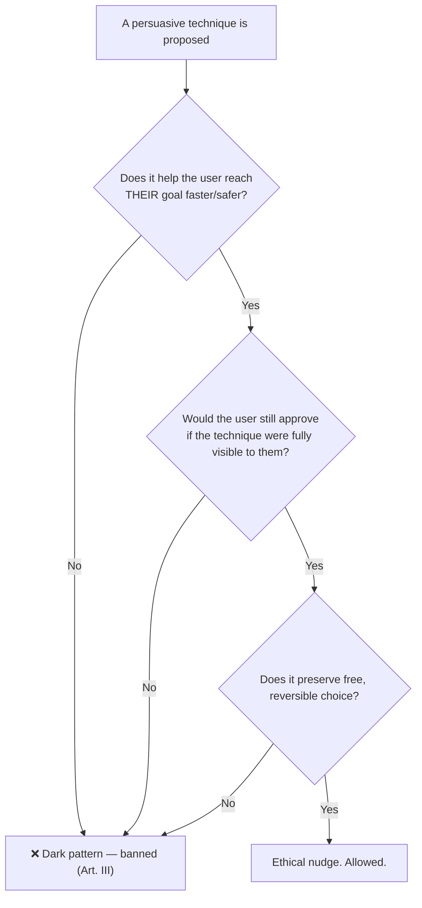

# 05 — Visual Psychology

### Perception, Cognition, and Ethical Persuasion

> *"Design works with the brain the user already has — not the one we wish they had. Every interface is a conversation with perception."*

---

**Chapter type:** Phase 2 — Design Foundations
**DRI:** UX Researcher + Creative Director (joint)
**Depends on:** [`00-CONSTITUTION.md`](./00-CONSTITUTION.md), [`04-DESIGN_PHILOSOPHY.md`](./04-DESIGN_PHILOSOPHY.md)
**Feeds:** [`06`](./06-COLOR_SYSTEM.md)–[`13`](./13-FORM_DESIGN.md), [`23`](./23-MOTION_SYSTEM.md), [`24`](./24-MICRO_INTERACTIONS.md), [`26`](./26-USER_EXPERIENCE.md)

---

## Table of Contents
1. [Purpose](#1-purpose)
2. [Philosophy](#2-philosophy)
3. [Principles](#3-principles)
4. [Best Practices](#4-best-practices)
5. [Anti-Patterns](#5-anti-patterns)
6. [Real-World Examples](#6-real-world-examples)
7. [Common Mistakes](#7-common-mistakes)
8. [AI Implementation Guidance](#8-ai-implementation-guidance)
9. [Human Review Checklist](#9-human-review-checklist)
10. [Automation Opportunities](#10-automation-opportunities)
11. [References for Further Study](#11-references-for-further-study)
12. [Review Checklist & Measurable Quality Criteria](#12-review-checklist--measurable-quality-criteria)

---

## 1. Purpose

This chapter explains *why* the design principles in [`04`](./04-DESIGN_PHILOSOPHY.md) work — grounding them in how human perception and cognition actually operate. When a designer knows *that* whitespace groups elements, they can follow the rule. When they know *why* (the Gestalt law of proximity, and the brain's automatic pre-attentive grouping), they can apply it to novel situations, defend it in review, and know its limits.

Its second purpose is to draw a firm **ethical line**. The same psychology that helps a user succeed can be weaponized to manipulate them. This chapter equips the studio to use persuasion *for* the user (reducing effort, clarifying choices, preventing errors) and forbids using it *against* them (dark patterns). Article I and Article III of the Constitution govern here: the user is the point, and manipulation crosses the floor.

---

## 2. Philosophy

**The user's brain is a prediction-and-shortcut machine, not a rational calculator.** People don't read; they scan. They don't evaluate; they satisfice (pick the first "good enough" option). They don't perceive pixels; they perceive *patterns, groups, and meanings*, pre-attentively, in milliseconds, before conscious thought. Design that fights these facts loses. Design that cooperates with them feels "intuitive" — which is just another word for *matching the brain's existing model.*

**Cognitive load is the scarcest resource in the room.** Every decision, every unlabeled icon, every inconsistency spends a little of the user's finite working memory. Great design is not "rich"; it is *frugal with attention.* The job is to make the right thing obvious so thinking is spent on the user's actual task, not on operating our interface.

**Persuasion is unavoidable; ethics is the choice.** Every design nudges — the mere ordering of options is a nudge. You cannot build a neutral interface. The question is never "should we influence?" but "**do we influence toward the user's benefit or ours at their expense?**" We choose the user's benefit, always (Article I). Influence that a user would resent if they saw it clearly is a dark pattern, and dark patterns are banned (Article III).

**Perception is universal but not uniform.** Core mechanisms (grouping, contrast sensitivity, attention) are shared, but color vision, literacy, culture, age, and ability vary. Designing for perception means designing for the *range* of human perception — which is exactly why accessibility is a psychological necessity, not just a compliance item.

---

## 3. Principles

### Principle 1 — Design for scanning, not reading
Users move in F- and Z-shaped patterns, fixate on headings, bold words, faces, and edges. Structure content for the scanner: front-load meaning, chunk it, use headings.
> *Rationale:* Matches documented eye-tracking behavior; fighting it means your content is skipped.

### Principle 2 — Minimize cognitive load (intrinsic, extraneous, germane)
Reduce **extraneous** load (clutter, inconsistency, unclear labels) ruthlessly; respect **intrinsic** load (inherent task difficulty) by chunking; invest **germane** load only where it helps the user learn something worthwhile.
> *Rationale:* Working memory holds only a few items; overload causes errors and abandonment.

### Principle 3 — Use pre-attentive attributes for instant hierarchy
Certain properties are processed *before* conscious attention: **contrast, size, color, position, motion, orientation, enclosure.** Use them to make the important thing pop in <200ms.
> *Rationale:* This is how you speak to the fast, automatic visual system ([`04`](./04-DESIGN_PHILOSOPHY.md) P2/P3).

### Principle 4 — Leverage the Gestalt laws
The brain auto-groups by **proximity, similarity, continuity, closure, common region, common fate (shared motion), and figure/ground.** Use them deliberately; violating them creates confusion.
> *Rationale:* These are not style choices; they're how humans parse visual fields.

### Principle 5 — Honor Hick's, Fitts's, and Miller's constraints
- **Hick's Law:** more choices = slower decisions → reduce/segment options.
- **Fitts's Law:** target acquisition time depends on size and distance → make important targets big and close.
- **Miller's ~7±2 / chunking:** group information into digestible chunks.
> *Rationale:* These are measurable, predictive laws of interaction cost.

### Principle 6 — Respect memory: recognition over recall
Show options; don't make users remember them. Persist context; don't force re-entry. Provide sensible defaults.
> *Rationale:* Recognition is cheap; recall is expensive and error-prone.

### Principle 7 — Use consistency to build correct mental models
Consistent patterns let users transfer learning across the product. A control that behaves the same everywhere becomes invisible (in the good way).
> *Rationale (Art. V):* Mental models are the user's cached understanding; consistency keeps the cache valid.

### Principle 8 — Persuade ethically or not at all
Use influence to help the user do what *they* want faster and with fewer errors. Never to trick, pressure, shame, or obscure.
> *Rationale (Art. I, III):* The Persuasion Ethics Test below is a hard gate.

---

### The Persuasion Ethics Test (a hard gate)



---

## 4. Best Practices

### 4.1 Chunk and label information
Break long forms, lists, and content into labeled groups of related items. A 20-field form becomes 4 labeled sections of 5. (Miller/Gestalt proximity + common region.)

### 4.2 Establish a single, obvious focal point per view
Use pre-attentive attributes so exactly one thing wins attention. Competing focal points cancel out (P3 + [`04`](./04-DESIGN_PHILOSOPHY.md)).

### 4.3 Make the primary action the biggest, closest, most contrasting target
Fitts + pre-attentive contrast. The primary button is unmistakable; destructive/secondary actions are visually quieter and, for destructive ones, placed to resist accidental clicks.

### 4.4 Reduce choices at the point of decision
Apply Hick's Law: progressive disclosure, smart defaults, and "recommended" options reduce the visible decision space without removing capability. (Ethical version of a nudge.)

### 4.5 Design feedback within human time thresholds
- **< 100ms:** feels instant → give immediate acknowledgment.
- **~1s:** keeps flow → still no spinner needed, but confirm.
- **> ~1s:** show progress; **> ~10s:** allow other work / show meaningful progress.
These map perception to [`35`](./35-PERFORMANCE.md) and [`24`](./24-MICRO_INTERACTIONS.md).

### 4.6 Prefer recognition patterns
Autocomplete over free recall, visible menus over memorized commands, showing the current selection, breadcrumbs for location. (P6.)

### 4.7 Use social proof and defaults honestly
Real testimonials, real usage numbers, genuinely-recommended defaults are ethical and effective. Fabricated urgency ("2 people are looking at this!" when false) is a banned dark pattern.

### 4.8 Account for the full range of perception
Never rely on color alone (colorblindness); ensure contrast (low vision); support reduced motion (vestibular disorders); keep language simple (cognitive load, non-native speakers). Psychology *is* accessibility ([`22`](./22-ACCESSIBILITY.md)).

---

## 5. Anti-Patterns (incl. the dark-pattern catalog)

| Dark pattern | What it does | Why it's banned |
| --- | --- | --- |
| **Confirmshaming** | Guilt-trips the decline option ("No thanks, I hate saving money") | Manipulates via shame; fails the Ethics Test. |
| **Roach motel** | Easy to sign up, near-impossible to cancel | Traps the user; removes free reversible choice (Art. III). |
| **Fake urgency/scarcity** | Countdown timers / "only 1 left" that are false | Deception; erodes trust. |
| **Forced continuity** | Silent charge after a "free" trial with no reminder | Extracts value the user didn't consent to. |
| **Misdirection** | Visual tricks steering to the choice that benefits us | Uses pre-attentive attributes *against* the user. |
| **Sneak into basket / preselected add-ons** | Opt-outs hidden or pre-checked | Violates informed consent. |
| **Bait and switch** | Action does something other than what it implies | Breaks the mental model deliberately. |
| **Nagging** | Repeated interruptions until the user gives in | Coercion by attrition. |

**Non-dark anti-patterns:**

| Anti-pattern | Why it fails | Principle |
| --- | --- | --- |
| **Choice overload** (dozens of equal options) | Paralysis; slower/worse decisions. | P5 (Hick) |
| **Tiny/distant primary targets** | Frustration, mis-taps, especially on mobile. | P5 (Fitts) |
| **Icon-only controls with no labels** | Forces recall + guessing; ambiguous. | P6 |
| **Inconsistent controls** | Breaks mental models; every screen re-learned. | P7 |
| **Rainbow of equal-weight elements** | No pre-attentive winner; nothing stands out. | P3 |
| **Wall of text** | Defeats scanners; content ignored. | P1 |

---

## 6. Real-World Examples

### Example A — Gestalt proximity fixing a "confusing" form
A settings form felt confusing though every field was labeled. The problem: uniform spacing between *all* fields meant the brain couldn't tell which labels grouped with which inputs, or which fields related. Applying proximity + common region (P4): tighten space between a label and its input, add space between groups, and enclose each group. Nothing was added or removed — only *spacing changed* — and comprehension jumped. *Perception, not content, was the bug.*

### Example B — Hick's Law and the paralyzing plan page
A pricing page listed nine plans with fine-grained differences. Conversions were low; support asked "which should I pick?" constantly. Applying P5: collapse to three tiers with a clear "recommended" (an ethical default — genuinely best for most), and put the nine-way detail behind a "compare all plans" link (progressive disclosure). Decision time and conversions both improved *without removing any real capability.*

### Example C — Rejecting a dark pattern, keeping the win
Growth proposed a pre-checked "add premium support (+$9/mo)" box at checkout to lift revenue. It failed the Persuasion Ethics Test (users wouldn't approve if they saw the trick; it exploits inattention). **Rejected (Art. III).** The ethical alternative — an *unchecked* option with a genuinely compelling one-line benefit and social proof — was implemented instead. It converted less than the trap would have, but every sale was consensual and refund/chargeback rates stayed low. *Short-term trickery vs. long-term trust — we choose trust.*

---

## 7. Common Mistakes

- **Designing for how *you* read the screen** (you know where everything is) instead of a first-time scanner (P1).
- **Adding options to "empower" users**, causing overload and worse outcomes (P5).
- **Relying on color alone** to signal state/importance — invisible to colorblind users and in grayscale (P3, [`22`](./22-ACCESSIBILITY.md)).
- **Icon-only interfaces** that assume universal icon literacy (P6).
- **Confusing persuasion with manipulation** — assuming any conversion lift is good (Ethics Test).
- **Ignoring feedback timing** — no acknowledgment on slow actions, so users double-click or abandon (4.5).
- **Breaking established patterns for novelty**, invalidating users' mental models (P7).

---

## 8. AI Implementation Guidance

### 8.1 Where agents help
- **Predict scan patterns / attention** heuristically and flag views with no clear pre-attentive focal point.
- **Audit for dark patterns** — scan flows and copy against the catalog in §5 and run the Persuasion Ethics Test.
- **Estimate cognitive load** — count decisions per screen, flag choice overload, unlabeled icons, inconsistent controls.
- **Check perceptual accessibility** — color-only signals, contrast, motion, reading level.
- **Suggest chunking/grouping** improvements grounded in Gestalt laws.

### 8.2 Hard rules (Art. I, III)
- The agent must **refuse to design or optimize dark patterns**, even if explicitly asked to "increase conversion by any means." It states the refusal and offers the ethical alternative.
- When proposing a persuasive technique, the agent must **run and report the Persuasion Ethics Test.**
- Never rely on a single perceptual channel (color/motion/tone) to convey required meaning.

### 8.3 Prompt example — attention + ethics audit
```
ROLE: UX Researcher, bound by 00-CONSTITUTION (Art. I, III) + 05-VISUAL_PSYCHOLOGY.
TASK: Audit the attached flow.
  1. Identify the intended focal point of each screen; flag screens with none or many.
  2. Count decisions per screen; flag Hick's-Law overload.
  3. Detect any dark patterns (use the §5 catalog); for each persuasive element,
     run the Persuasion Ethics Test and report PASS/REJECT with reasoning.
  4. Flag color-only signals and unlabeled icons.
OUTPUT: findings table + recommended ethical fixes. Refuse to optimize any dark pattern.
```

### 8.4 Prompt example — reduce cognitive load
```
TASK: This screen has <N> fields/options. Apply Gestalt grouping + Miller chunking +
Hick's Law to propose a lower-load version WITHOUT removing capability
(use progressive disclosure/defaults). Explain each change by the principle it applies.
```

---

## 9. Human Review Checklist

- [ ] Each key view has **one clear pre-attentive focal point** (survives the squint test).
- [ ] Content is **scannable** (chunked, headed, front-loaded) — not a wall of text.
- [ ] Related items are **grouped** via proximity/common region; grouping matches meaning (Gestalt).
- [ ] Choice count at each decision is **reasonable** (Hick's Law); overload uses progressive disclosure/defaults.
- [ ] Primary targets are **large and reachable** (Fitts); destructive actions are guarded.
- [ ] The UI favors **recognition over recall** (labels, defaults, persisted context).
- [ ] Controls are **consistent** with established patterns (mental model preserved).
- [ ] **Feedback timing** matches human thresholds (instant ack, progress for slow ops).
- [ ] No meaning relies on a **single channel** (color/motion/tone alone).
- [ ] **No dark patterns.** Every persuasive element passes the Persuasion Ethics Test.

---

## 10. Automation Opportunities

| Task | Automation |
| --- | --- |
| Dark-pattern scanning | LLM audit of flows/copy against the §5 catalog on PRs touching conversion surfaces. |
| Color-only signal detection | Grayscale render + heuristic check in CI. |
| Choice-count / load heuristics | Static analysis counting interactive elements & decisions per view. |
| Contrast & reading level | Automated contrast + readability checks ([`06`](./06-COLOR_SYSTEM.md), [`25`](./25-COPYWRITING.md)). |
| Attention prediction | Saliency/attention-heatmap models on key screens for reviewer reference. |
| Reduced-motion compliance | Lint enforcing `prefers-reduced-motion` handling ([`23`](./23-MOTION_SYSTEM.md)). |

---

## 11. References for Further Study
- **Perception:** Gestalt psychology (laws of grouping); pre-attentive processing research (Colin Ware, *Information Visualization*).
- **Cognition & behavior:** Kahneman's *Thinking, Fast and Slow* (System 1/2); Cognitive Load Theory (Sweller).
- **Interaction laws:** Hick's Law, Fitts's Law, Miller's "magical number seven" (primary literature).
- **Persuasion & ethics:** Cialdini's *Influence* (principles of persuasion — to use ethically); the deceptive-patterns (dark patterns) body of work (Harry Brignull) for what to avoid.
- **Usability heuristics:** Nielsen's 10 usability heuristics (recognition vs. recall, consistency, feedback).
- **Cross-references:** [`04-DESIGN_PHILOSOPHY.md`](./04-DESIGN_PHILOSOPHY.md), [`06-COLOR_SYSTEM.md`](./06-COLOR_SYSTEM.md), [`22-ACCESSIBILITY.md`](./22-ACCESSIBILITY.md), [`24-MICRO_INTERACTIONS.md`](./24-MICRO_INTERACTIONS.md), [`26-USER_EXPERIENCE.md`](./26-USER_EXPERIENCE.md).

---

## 12. Review Checklist & Measurable Quality Criteria

| Criterion | Target |
| --- | --- |
| Views with a single clear focal point | 100% |
| Dark patterns present | 0 (floor, Art. III) |
| Persuasive elements passing the Ethics Test | 100% |
| Required meaning conveyed by a single channel only | 0 |
| Decisions per primary screen | within Hick's-reasonable range (segment if high) |
| Feedback provided within human time thresholds | 100% of actions |
| Task success rate / time-on-task (where measured) | ↑ / ↓ trend respectively |

---

*End of `05-VISUAL_PSYCHOLOGY.md`.*
