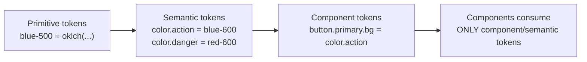

# 06 — Color System

### Perceptual Color, Palettes, Contrast, and Semantic Meaning

> *"Color is not decoration you apply at the end. It is a system of meaning you design from the start — and every hue must earn its contrast."*

---

**Chapter type:** Phase 2 — Design Foundations
**DRI:** Senior UI Designer + Design Systems Engineer (joint)
**Depends on:** [`00-CONSTITUTION.md`](./00-CONSTITUTION.md), [`03-BRAND_STRATEGY.md`](./03-BRAND_STRATEGY.md), [`04-DESIGN_PHILOSOPHY.md`](./04-DESIGN_PHILOSOPHY.md), [`05-VISUAL_PSYCHOLOGY.md`](./05-VISUAL_PSYCHOLOGY.md)
**Feeds:** [`07`](./07-TYPOGRAPHY_SYSTEM.md), [`11`](./11-CARD_DESIGN.md)–[`14`](./14-COMPONENT_LIBRARY.md), [`15`](./15-DESIGN_TOKENS.md), [`22`](./22-ACCESSIBILITY.md), [`33`](./33-TAILWIND_GUIDE.md)

---

## Table of Contents
1. [Purpose](#1-purpose)
2. [Philosophy](#2-philosophy)
3. [Principles](#3-principles)
4. [Best Practices](#4-best-practices)
5. [Anti-Patterns](#5-anti-patterns)
6. [Real-World Examples](#6-real-world-examples)
7. [Common Mistakes](#7-common-mistakes)
8. [AI Implementation Guidance](#8-ai-implementation-guidance)
9. [Human Review Checklist](#9-human-review-checklist)
10. [Automation Opportunities](#10-automation-opportunities)
11. [References for Further Study](#11-references-for-further-study)
12. [Review Checklist & Measurable Quality Criteria](#12-review-checklist--measurable-quality-criteria)

---

## 1. Purpose

This chapter defines how the studio designs, structures, names, and enforces color — as a **system of semantic meaning and perceptual contrast**, not a mood board of nice hues. It exists so that color decisions are consistent across every screen, accessible by default (Article III floor), tied to brand ([`03`](./03-BRAND_STRATEGY.md)), and expressible as tokens ([`15`](./15-DESIGN_TOKENS.md)) that both humans and machines can apply and verify.

A good color system answers, unambiguously: *What color is a primary button? A destructive action? A disabled input? An error message on a dark background? Text on the brand color?* — and guarantees each answer passes contrast requirements. Color is where accessibility, brand, and visual hierarchy intersect; getting it systematic is one of the highest-leverage things a studio does.

---

## 2. Philosophy

**Color carries meaning before it carries beauty.** In an interface, red means danger, green means success, a single saturated accent means "act here." Users read these meanings pre-attentively ([`05`](./05-VISUAL_PSYCHOLOGY.md)) before they read a word. So we design the *semantics* first (what does this color mean?) and the *aesthetics* second (which exact hue expresses it). A gorgeous palette with no semantic structure is a liability.

**Contrast is not negotiable; it is the floor.** A color that can't be read isn't a design choice, it's a defect (Article III). We design in a perceptual color space so that contrast and "lightness steps" are predictable, and we verify every foreground/background pair against WCAG. If a brand color fails contrast for its intended use, the *use* changes — never the requirement.

**Design in a perceptual space, not in sRGB hex-guessing.** Traditional HSL lies: two colors with the same "lightness" value can look wildly different in brightness. We prefer **OKLCH/LCH** (perceptually uniform) so that a "500" step looks like the middle of every ramp, palettes stay harmonious, and dark mode is a principled transform rather than hand-tweaking. (Provide hex fallbacks for tooling that needs them.)

**Semantic tokens over raw values, always.** Components never reference `#3B82F6`; they reference `--color-action` (which *maps* to a palette step). This indirection is what makes theming, dark mode, rebranding, and accessibility fixes a one-line change instead of a thousand-file search-and-replace (Article IV).

---

## 3. Principles

### Principle 1 — Three token tiers: primitive → semantic → component
Never let a component reference a raw color. Layer the system.
> *Rationale:* Indirection localizes change; it's the difference between theming in one place and everywhere.



### Principle 2 — Contrast is a hard requirement (AA minimum)
Body text ≥ **4.5:1**; large text (≥24px, or ≥19px bold) and UI components/graphical objects ≥ **3:1**; aim for AAA (7:1) on primary reading surfaces.
> *Rationale (Art. III):* Readability is the floor; every pair is verified.

### Principle 3 — Never encode meaning in color alone
Pair color with an icon, label, shape, or text. Error ≠ "red"; error = red + icon + message.
> *Rationale ([`05`](./05-VISUAL_PSYCHOLOGY.md), [`22`](./22-ACCESSIBILITY.md)):* ~8% of men have color-vision deficiency; grayscale/scan users too.

### Principle 4 — One accent, disciplined neutrals, minimal semantics
A restrained palette: one (maybe two) brand accents, a full neutral ramp (the workhorse of UI), and a small set of semantic colors (success/warning/danger/info). Resist rainbow palettes.
> *Rationale (Art. VIII, [`04`](./04-DESIGN_PHILOSOPHY.md) P1):* Restraint makes the accent *mean* something.

### Principle 5 — Build full ramps (typically 50→950), perceptually even
Each color has ~11 steps with predictable lightness. This gives you hover/active/disabled/border/background variants without ad-hoc tweaking.
> *Rationale:* Systematic ramps make states derivable, not invented.

### Principle 6 — Dark mode is a semantic remap, not an inversion
Don't invert colors. Re-map semantic tokens to appropriate palette steps for dark surfaces; reduce large saturated fills; verify contrast again.
> *Rationale:* Naive inversion breaks brand, contrast, and depth cues.

### Principle 7 — Color is themeable by design
The system supports multiple themes (light/dark/high-contrast/brands) because everything routes through semantic tokens.
> *Rationale (Art. IV):* Theming is free when the architecture is right and impossible when it isn't.

---

## 4. Best Practices

### 4.1 Structure the palette
A complete, minimal system:

| Group | Purpose | Steps |
| --- | --- | --- |
| **Neutral / Gray** | Text, borders, backgrounds, surfaces — ~70% of the UI | 50–950 |
| **Brand / Primary** | The accent; primary actions, focus, emphasis | 50–950 |
| **Success** | Positive states, confirmations | 50–950 |
| **Warning** | Caution, needs attention | 50–950 |
| **Danger / Error** | Destructive actions, errors | 50–950 |
| **Info** (optional) | Neutral informational callouts | 50–950 |

### 4.2 Define semantic tokens (the layer components actually use)

```css
:root {
  /* Primitives (perceptual; hex fallback in comments) */
  --blue-600:  oklch(0.55 0.18 255); /* ~#2563EB */
  --gray-50:   oklch(0.98 0.005 255);
  --gray-900:  oklch(0.21 0.01 255);
  --red-600:   oklch(0.55 0.20 27);
  --green-600: oklch(0.60 0.15 150);

  /* Semantic (meaning, not hue) */
  --color-bg:            var(--gray-50);
  --color-surface:       #ffffff;
  --color-text:          var(--gray-900);
  --color-text-muted:    oklch(0.50 0.02 255);
  --color-border:        oklch(0.90 0.01 255);
  --color-action:        var(--blue-600);
  --color-action-hover:  oklch(0.49 0.18 255);
  --color-danger:        var(--red-600);
  --color-success:       var(--green-600);
  --color-focus-ring:    var(--blue-600);
}

[data-theme="dark"] {
  --color-bg:         var(--gray-950, oklch(0.16 0.01 255));
  --color-surface:    oklch(0.21 0.01 255);
  --color-text:       oklch(0.96 0.005 255);
  --color-text-muted: oklch(0.72 0.02 255);
  --color-border:     oklch(0.32 0.01 255);
  --color-action:     oklch(0.68 0.16 255); /* lighter/less saturated for dark */
}
```

### 4.3 Verify every semantic pair against WCAG
Maintain a contrast matrix as part of the system; it is CI-enforced (§10).

| Foreground | Background | Ratio | Use | AA? |
| --- | --- | --- | --- | --- |
| `--color-text` | `--color-bg` | 15.8:1 | Body text | ✅ AAA |
| `--color-text-muted` | `--color-bg` | 5.2:1 | Secondary text | ✅ AA |
| white | `--color-action` | 4.7:1 | Button label | ✅ AA |
| `--color-danger` | `--color-surface` | 4.6:1 | Error text | ✅ AA |
| `--color-text-muted` | `--color-surface` (dark) | 4.9:1 | Muted (dark) | ✅ AA |

> **Rule:** If a pair fails, fix the *token mapping*, not the requirement. A failing brand button becomes a darker step or gets dark text.

### 4.4 Map to Tailwind cleanly
Wire semantic tokens into the Tailwind theme so utilities stay on-system ([`33`](./33-TAILWIND_GUIDE.md)):

```js
// tailwind.config — reference CSS vars so themes swap at runtime
export default {
  theme: {
    extend: {
      colors: {
        bg: 'var(--color-bg)',
        surface: 'var(--color-surface)',
        text: { DEFAULT: 'var(--color-text)', muted: 'var(--color-text-muted)' },
        action: { DEFAULT: 'var(--color-action)', hover: 'var(--color-action-hover)' },
        danger: 'var(--color-danger)',
        success: 'var(--color-success)',
        border: 'var(--color-border)',
      },
    },
  },
}
```

### 4.5 Design state variants systematically
Derive interaction states from ramp steps, not eyeballed values:

| State | Rule |
| --- | --- |
| Default | semantic step (e.g. action = 600) |
| Hover | one step darker (700) in light; lighter in dark |
| Active/pressed | two steps darker (800) |
| Disabled | reduce to a muted neutral + lowered opacity; must still be distinguishable, not necessarily AA (non-interactive) |
| Focus | visible ring using `--color-focus-ring`, ≥3:1 against adjacent colors |

### 4.6 Respect `prefers-color-scheme` and offer a manual toggle
Default to the system preference; persist the user's explicit choice. Provide a high-contrast theme where feasible ([`22`](./22-ACCESSIBILITY.md)).

### 4.7 Document the *meaning* of each semantic token
Every token has a one-line "use when…/don't use when…" so humans and agents apply it correctly (Art. VI).

---

## 5. Anti-Patterns

| Anti-pattern | Why it fails | Principle/Article |
| --- | --- | --- |
| **Raw hex in components** | Un-themeable; drift; a11y fixes require global search. | P1, Art. IV |
| **Failing contrast for brand's sake** | Unreadable; violates the floor. | P2, Art. III |
| **Color-only status** (red = error, no icon/text) | Excludes colorblind & grayscale users. | P3 |
| **Rainbow UI** (many equal saturated colors) | No hierarchy; accent means nothing. | P4 |
| **Ad-hoc shades** (hand-picked per component) | Inconsistent; no systematic states. | P5 |
| **Naive dark-mode inversion** | Broken contrast, garish saturation, lost depth. | P6 |
| **Pure black `#000` / pure white text everywhere** | Harsh; eye strain; too-high contrast can shimmer. | — |
| **Hardcoding light-mode assumptions** | Dark/high-contrast themes impossible to add later. | P7 |

---

## 6. Real-World Examples

### Example A — The brand color that failed the button test
Brand guidelines specified a bright cyan (`~#22D3EE`) as "primary." White text on it measured ~1.9:1 — far below AA. Rather than break the floor (Art. III), the team kept cyan for *large non-text brand moments* (hero accents, illustrations) and defined the *action* semantic token as a darker, contrast-passing step for buttons, with white text at 4.6:1. **The brand feeling survived; readability was never sacrificed.** *Semantic tokens let one brand hue play different, contrast-appropriate roles.*

### Example B — Perceptual space fixing an ugly ramp
A palette built in HSL had a "yellow-500" that looked far brighter than "blue-500" at the same numeric step, making semantic colors feel inconsistent in weight. Rebuilding the ramps in **OKLCH with a fixed lightness curve** made every "-600" read as the same visual weight across hues. Buttons, badges, and alerts suddenly felt like one family. *Perceptual uniformity turned a set of colors into a system.*

### Example C — Dark mode done as a remap
A first attempt at dark mode inverted colors programmatically: the brand blue became an eye-searing orange, and shadows disappeared. The team scrapped inversion and instead **re-mapped semantic tokens** — surfaces to `gray-900/850` for layered depth, action to a *lighter, less saturated* blue step for contrast on dark, muted text re-verified at 4.9:1. Dark mode became a first-class theme, not a broken filter. *(Principle 6.)*

---

## 7. Common Mistakes

- **Picking colors before defining what they *mean*** (aesthetics before semantics).
- **Testing contrast only on white** and forgetting dark surfaces, hover states, and disabled states.
- **Using opacity to "dim" text** onto unknown backgrounds — the resulting contrast is unpredictable; prefer a defined muted token.
- **Too many semantic colors** (five kinds of "info blue") diluting meaning.
- **Forgetting focus-ring contrast** (≥3:1 against adjacent colors) — a common a11y miss.
- **Hardcoding `#fff`/`#000`** instead of surface/text tokens, blocking theming.
- **Treating dark mode as inversion** rather than a designed remap.

---

## 8. AI Implementation Guidance

### 8.1 Where agents help
- **Generate full perceptual ramps** (50–950 in OKLCH) from a seed brand color with even lightness steps.
- **Build the semantic token layer** and Tailwind/CSS-var wiring from a palette.
- **Compute and enforce the contrast matrix**, proposing token remaps for any failing pair.
- **Generate dark/high-contrast themes** as principled remaps, re-verifying contrast.
- **Audit codebases** for raw hex values, color-only status, and off-token colors.

### 8.2 Hard rules (Art. III, IV)
- The agent must **verify contrast for every foreground/background pair it introduces** and report ratios. It must **never** ship a text pair below 4.5:1 (or 3:1 for large/UI) — if the brand color fails, it remaps the use and says so.
- It must **never emit raw hex in components** — only semantic/component tokens.
- It must **never encode required meaning in color alone**; it pairs color with icon/label/text.

### 8.3 Prompt example — generate a compliant system
```
ROLE: Design Systems Engineer, bound by 00-CONSTITUTION (Art. III, IV) + 06.
INPUT: brand accent = <hex>; brand attributes (from 03) = confident, warm.
TASK:
  1. Generate OKLCH ramps (50–950) for: neutral, brand, success, warning, danger.
  2. Define semantic tokens (bg, surface, text, text-muted, border, action(+hover/active),
     danger, success, focus-ring) for light AND dark themes.
  3. Produce the contrast matrix; ensure ALL text pairs ≥4.5:1, UI/large ≥3:1.
     For any failure, remap the token and note the change.
  4. Emit CSS custom properties + Tailwind theme wiring.
OUTPUT: tokens (CSS) + Tailwind config + contrast matrix table. No raw hex in components.
```

### 8.4 Prompt example — audit
```
TASK: Scan the repo for (a) raw hex/rgb color literals in components, (b) status conveyed
by color only, (c) any text/bg pair below AA. Output a table {file:line, issue, fix}
mapping each to the correct semantic token. Do not change brand meaning—only the mapping.
```

---

## 9. Human Review Checklist

- [ ] Components reference **semantic/component tokens only** — no raw hex.
- [ ] Every text pair meets **AA (4.5:1)**; large text & UI components meet **3:1**.
- [ ] **Focus rings** meet ≥3:1 against adjacent colors and are visible in all themes.
- [ ] **No meaning by color alone** — status uses color + icon/label/text.
- [ ] Palette is **restrained** (one accent, disciplined neutrals, minimal semantics).
- [ ] Ramps are **perceptually even** (built in OKLCH/LCH), full 50–950.
- [ ] **Dark mode** is a designed remap (contrast re-verified), not an inversion.
- [ ] Interaction **states** (hover/active/disabled/focus) derive from the ramp systematically.
- [ ] Each semantic token has documented **usage guidance**.
- [ ] Theming works via `prefers-color-scheme` + persisted manual toggle.

---

## 10. Automation Opportunities

| Task | Automation |
| --- | --- |
| Contrast enforcement | CI step computing every semantic pair's ratio; fail build on < AA. |
| Raw-color linting | Stylelint/ESLint rule banning hex/rgb literals outside the primitive layer. |
| Ramp generation | Script generating OKLCH ramps + hex fallbacks from seed colors. |
| Color-only status detection | Grayscale render diff + heuristic scan in CI ([`05`](./05-VISUAL_PSYCHOLOGY.md)). |
| Token/Tailwind sync | Build step generating Tailwind theme from the token source of truth ([`15`](./15-DESIGN_TOKENS.md)). |
| Visual regression | Screenshot tests per theme (light/dark/high-contrast). |

---

## 11. References for Further Study
- **Perceptual color:** OKLCH/LCH and CIELAB color spaces; the case for perceptually-uniform palettes (Björn Ottosson's OKLCH work as a reference).
- **Contrast standards:** W3C WCAG 2.2 success criteria 1.4.3 (contrast minimum), 1.4.6 (enhanced), 1.4.11 (non-text contrast), 1.4.1 (use of color).
- **Color & meaning:** color-psychology literature (apply with cultural caution) and information-visualization color guidance (Colin Ware).
- **Systematic palettes:** public design-system color documentation from major tech companies as *reference patterns* (study, don't copy).
- **Cross-references:** [`03-BRAND_STRATEGY.md`](./03-BRAND_STRATEGY.md), [`05-VISUAL_PSYCHOLOGY.md`](./05-VISUAL_PSYCHOLOGY.md), [`15-DESIGN_TOKENS.md`](./15-DESIGN_TOKENS.md), [`22-ACCESSIBILITY.md`](./22-ACCESSIBILITY.md), [`33-TAILWIND_GUIDE.md`](./33-TAILWIND_GUIDE.md).

---

## 12. Review Checklist & Measurable Quality Criteria

| Criterion | Target |
| --- | --- |
| Text color pairs meeting AA | 100% (floor) |
| Non-text/UI contrast meeting 3:1 | 100% |
| Raw hex/rgb literals in components | 0 |
| Status indicators using color alone | 0 |
| Semantic tokens with documented usage | 100% |
| Themes supported (light/dark min) | ≥ 2, contrast-verified each |
| Palette color families | ≤ 6 (restraint) |

---

*End of `06-COLOR_SYSTEM.md`.*
