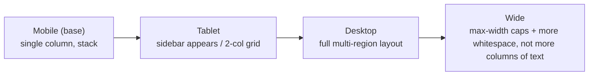

# 09 — Layout System

### Composition, Structure, and Spatial Relationships

> *"Layout is the argument the interface makes about what matters. Composition is persuasion made spatial."*

---

**Chapter type:** Phase 2 — Design Foundations
**DRI:** Senior UI Designer + Frontend Architect (joint)
**Depends on:** [`00-CONSTITUTION.md`](./00-CONSTITUTION.md), [`04-DESIGN_PHILOSOPHY.md`](./04-DESIGN_PHILOSOPHY.md), [`05-VISUAL_PSYCHOLOGY.md`](./05-VISUAL_PSYCHOLOGY.md), [`07-TYPOGRAPHY_SYSTEM.md`](./07-TYPOGRAPHY_SYSTEM.md), [`08-SPACING_SYSTEM.md`](./08-SPACING_SYSTEM.md)
**Feeds:** [`10`](./10-GRID_SYSTEM.md), [`16`](./16-DASHBOARD_DESIGN.md)–[`21`](./21-RESPONSIVE_DESIGN.md), [`30`](./30-REACT_GUIDE.md), [`33`](./33-TAILWIND_GUIDE.md)

---

## Table of Contents
1. [Purpose](#1-purpose)
2. [Philosophy](#2-philosophy)
3. [Principles](#3-principles)
4. [Best Practices](#4-best-practices)
5. [Anti-Patterns](#5-anti-patterns)
6. [Real-World Examples](#6-real-world-examples)
7. [Common Mistakes](#7-common-mistakes)
8. [AI Implementation Guidance](#8-ai-implementation-guidance)
9. [Human Review Checklist](#9-human-review-checklist)
10. [Automation Opportunities](#10-automation-opportunities)
11. [References for Further Study](#11-references-for-further-study)
12. [Review Checklist & Measurable Quality Criteria](#12-review-checklist--measurable-quality-criteria)

---

## 1. Purpose

Where the grid ([`10`](./10-GRID_SYSTEM.md)) provides the columns and the spacing system ([`08`](./08-SPACING_SYSTEM.md)) provides the gaps, **layout is how we compose everything into a coherent whole**: page structure, reading order, focal points, alignment, balance, and the responsive behavior that keeps composition intact across screens.

This chapter defines the studio's reusable **layout primitives** (Stack, Cluster, Grid, Sidebar, Center, Cover, Frame, Switcher) and the compositional principles that govern them. The goal is that engineers and designers assemble screens from a small, well-understood set of layout building blocks — expressed with modern CSS (Flexbox, Grid, container queries) — rather than reinventing structural CSS on every page. Layout is where visual design becomes robust, responsive HTML/CSS.

---

## 2. Philosophy

**Layout expresses hierarchy in space.** The eye enters a composition somewhere, moves along a path, and rests. Good layout controls that journey: it places the most important element where attention lands first, uses alignment and space to create groups, and leaves a clear route through the content ([`05`](./05-VISUAL_PSYCHOLOGY.md)). A layout without a clear focal point and reading order is noise, however pretty its parts.

**Composition is intentional, not incidental.** Every alignment, every relationship between blocks, every choice of what sits beside what — is an argument about relationships and importance. We compose deliberately using classical tools (alignment, proximity, balance, contrast, repetition, white space) rather than dropping elements onto a canvas and hoping.

**Layouts should be intrinsic and resilient.** Modern CSS lets layouts *respond to their content and container*, not just to viewport breakpoints. We prefer layouts that adapt gracefully — that don't break when text is longer, a translation is verbose, an image is missing, or the container is narrow. A layout that only works with perfect content is a demo, not a design (Article II, [`21`](./21-RESPONSIVE_DESIGN.md)).

**Compose from primitives, not from snowflakes.** A handful of layout primitives, combined, express nearly every screen. Building them once and reusing them (Article IV) means layout behavior is consistent, tested, and responsive by default — instead of a thousand bespoke flex/grid declarations that each break differently.

---

## 3. Principles

### Principle 1 — Establish a clear structure: skeleton before skin
Decide the page's macro-structure (header, nav, main, aside, footer) with semantic HTML before styling.
> *Rationale (Art. III, [`22`](./22-ACCESSIBILITY.md)):* Semantic structure is accessibility + a stable layout foundation.

### Principle 2 — One primary focal point per view; a clear reading order
The composition must answer "where do I look first?" and guide a path from there.
> *Rationale ([`05`](./05-VISUAL_PSYCHOLOGY.md)):* Scanning users need an entry point and a route.

### Principle 3 — Align everything to a system; embrace edges
Elements share alignment lines. Strong, consistent alignment reads as order; misalignment reads as sloppiness.
> *Rationale:* Alignment is the cheapest, most powerful signal of intentionality.

### Principle 4 — Compose from layout primitives
Use named primitives (Stack, Cluster, Grid, Sidebar, Center, Cover, Switcher, Frame) rather than ad-hoc CSS.
> *Rationale (Art. IV):* Reusable, tested, responsive-by-default building blocks.

### Principle 5 — Prefer intrinsic, content-aware layout
Use `flex-wrap`, `minmax()`, `auto-fit`, `clamp()`, and container queries so layouts adapt to content and container, minimizing breakpoint-specific hacks.
> *Rationale ([`21`](./21-RESPONSIVE_DESIGN.md)):* Resilience to real, messy content.

### Principle 6 — Balance and rhythm, not symmetry for its own sake
Aim for visual balance (weight distributed intentionally); asymmetry is often more dynamic and equally balanced.
> *Rationale:* Balance = comfort; forced symmetry = stiffness and wasted space.

### Principle 7 — Constrain measure and container widths
Content containers have sensible `max-width`s (esp. text, ~45–75ch per [`07`](./07-TYPOGRAPHY_SYSTEM.md)); full-bleed is a deliberate exception.
> *Rationale:* Unconstrained widths destroy readability on large screens.

### Principle 8 — Design layout for all states and directions
Layout must hold up with empty/overflowing content, and support RTL and different writing modes via logical properties.
> *Rationale (Art. II, internationalization):* Real content and global users break naive layouts.

---

## 4. Best Practices

### 4.1 Start with a semantic page skeleton
```html
<body>
  <header>…</header>
  <nav aria-label="Primary">…</nav>
  <main id="main">          <!-- skip-link target -->
    <h1>…</h1>
    <section>…</section>
  </main>
  <aside aria-label="Related">…</aside>
  <footer>…</footer>
</body>
```

### 4.2 Build the layout primitives (the studio's structural vocabulary)

| Primitive | Job | Core CSS |
| --- | --- | --- |
| **Stack** | Vertical rhythm between children | `flex; flex-direction: column; gap` |
| **Cluster** | Wrap a group of items (tags, buttons) | `flex; flex-wrap: wrap; gap` |
| **Sidebar** | Content + side panel that collapses gracefully | `flex; flex-wrap; sidebar has basis, main `flex:1` w/ min-width |
| **Switcher** | Row that switches to column below a threshold | `flex-wrap` + `min-width` math |
| **Grid (auto)** | Responsive card grid without breakpoints | `grid; grid-template-columns: repeat(auto-fit, minmax(min, 1fr))` |
| **Center** | Horizontally center + constrain measure | `margin-inline: auto; max-width; padding-inline` |
| **Cover** | Full-height with centered content (heroes) | `min-height: 100dvh; flex column; center` |
| **Frame** | Fixed aspect-ratio media box | `aspect-ratio; object-fit: cover` |

```css
/* Stack */
.stack { display: flex; flex-direction: column; gap: var(--space-4); }

/* Auto grid: as many columns as fit, no media queries */
.grid-auto {
  display: grid;
  gap: var(--space-5);
  grid-template-columns: repeat(auto-fit, minmax(min(16rem, 100%), 1fr));
}

/* Sidebar: side panel + fluid main, collapses when space runs out */
.with-sidebar { display: flex; flex-wrap: wrap; gap: var(--space-6); }
.with-sidebar > .side { flex-basis: 18rem; flex-grow: 1; }
.with-sidebar > .main { flex-basis: 0; flex-grow: 999; min-width: 60%; }

/* Center with measure constraint */
.center { box-sizing: content-box; max-width: 72ch; margin-inline: auto;
          padding-inline: var(--space-5); }
```

### 4.3 Use container queries for component-level responsiveness
```css
.card-list { container-type: inline-size; }
@container (min-width: 32rem) {
  .card { grid-template-columns: auto 1fr; } /* card adapts to ITS space, not the viewport */
}
```
> Component-driven responsiveness ([`21`](./21-RESPONSIVE_DESIGN.md)) means a component looks right wherever it's placed.

### 4.4 Fluidly scale with `clamp()`
```css
.hero-title { font-size: clamp(2rem, 5vw + 1rem, 3.5rem); }
.section    { padding-block: clamp(var(--space-6), 8vw, var(--space-9)); }
```
Reduces breakpoint proliferation (Principle 5).

### 4.5 Use logical properties for i18n/RTL
Prefer `margin-inline`, `padding-block`, `inset-inline-start` over `left/right`. The layout mirrors correctly for RTL for free (Principle 8).

### 4.6 Establish alignment discipline
Pick alignment lines and stick to them; align labels, values, and actions consistently. In review, look for elements that are *almost* aligned (worse than clearly not) and snap them.

### 4.7 Design the responsive plan explicitly

Mobile-first ([`20`](./20-MOBILE_FIRST.md)); enhance up; cap content width on very wide screens rather than stretching text.

---

## 5. Anti-Patterns

| Anti-pattern | Why it fails | Principle/Article |
| --- | --- | --- |
| **`div` soup, no semantics** | No structure for AT; brittle layout. | P1, Art. III |
| **No focal point** (everything equal weight) | Eye has nowhere to land. | P2 |
| **Near-miss alignment** | Reads as sloppy; undermines trust. | P3 |
| **Bespoke flex/grid per page** | Inconsistent, buggy, unmaintainable. | P4 |
| **Breakpoint sprawl** (dozens of media queries for content that could flow) | Fragile; misses in-between sizes. | P5 |
| **Absolute positioning for structure** | Breaks with content changes; not responsive. | P5, P8 |
| **Full-width text on desktop** | Unreadable measure. | P7 |
| **Fixed heights on text containers** | Overflow/clipping with real content. | P8 |
| **`left/right` instead of logical props** | Breaks RTL. | P8 |
| **Layout only works with perfect content** | Empty/overflow states break it. | P8, Art. II |

---

## 6. Real-World Examples

### Example A — Replacing breakpoint sprawl with an auto grid
A card gallery had four media queries (1/2/3/4 columns) and still looked awkward at in-between widths. Replacing it with a single `grid-auto` (`repeat(auto-fit, minmax(16rem, 1fr))`) removed all four media queries, worked at *every* width, and stayed aligned. *Intrinsic layout beat breakpoint micromanagement (Principle 5).*

### Example B — The sidebar that collapsed gracefully
A docs layout hard-coded a 280px sidebar with `float` and a `calc()` main width; it broke on tablets and in RTL. Rebuilding with the **Sidebar primitive** (flex-wrap + min-width) made the sidebar drop below the content automatically when space ran out, worked in RTL via logical properties, and needed zero media queries. *A named, tested primitive replaced fragile bespoke CSS (Principle 4, 8).*

### Example C — Focal point rescue on a busy dashboard
A dashboard showed twelve equally-sized, equally-weighted panels; users didn't know where to start. Applying Principle 2, the team gave the single most important KPI a larger cell (grid `span`), stronger type ([`07`](./07-TYPOGRAPHY_SYSTEM.md)), and more surrounding space ([`08`](./08-SPACING_SYSTEM.md)); the rest formed a calm secondary grid. Composition now had an entry point and a reading order. *Layout is hierarchy in space.*

---

## 7. Common Mistakes

- **Styling before structuring** — skipping the semantic skeleton, then retrofitting a11y.
- **Reinventing layout CSS** per component instead of using primitives.
- **Over-relying on viewport breakpoints** where intrinsic/container-based layout would be simpler and more robust.
- **Ignoring the in-between sizes** (designing only for 375/768/1440 and breaking at 900).
- **Letting text run full width** on large screens.
- **Fixed heights** that clip real content.
- **`left/right` and physical margins** that break in RTL.
- **Only testing the ideal content**, never empty or overflowing states.

---

## 8. AI Implementation Guidance

### 8.1 Where agents help
- **Generate semantic skeletons** and assemble screens from the layout primitives.
- **Convert breakpoint-heavy CSS** into intrinsic/auto-grid/container-query equivalents.
- **Audit** for div-soup, near-miss alignment, physical (non-logical) properties, fixed heights, and missing focal points.
- **Produce the responsive plan** (mobile→wide) and cap content widths.
- **Generate all-states layouts** (empty/overflow) and RTL-safe markup.

### 8.2 Hard rules (Art. III, IV, VIII)
- Start from **semantic HTML** (`header/nav/main/aside/footer`, headings) with a skip link.
- Compose from **named primitives/tokens**; do not emit bespoke one-off structural CSS when a primitive fits.
- Use **logical properties** and **intrinsic layout** by default; justify any viewport breakpoint.
- Ensure a **single clear focal point** and constrained **measure** for text.

### 8.3 Prompt example — compose a screen
```
ROLE: Frontend Architect + UI Designer, bound by 00-CONSTITUTION + 09.
TASK: Build the layout for <screen> from content: <list>.
CONSTRAINTS:
  - Semantic skeleton (header/nav/main/aside/footer) + skip link.
  - Use ONLY the layout primitives (Stack/Cluster/Sidebar/Switcher/Grid-auto/Center/Cover/Frame)
    + spacing tokens from 08.
  - Prefer auto-grid + container queries + clamp() over media-query sprawl.
  - Logical properties (RTL-safe). Constrain text measure (~45–75ch).
  - Establish ONE focal point; state the intended reading order.
OUTPUT: HTML + CSS using primitives/tokens + a note on the reading order + empty/overflow behavior.
```

### 8.4 Prompt example — modernize layout
```
TASK: Refactor the attached layout to remove breakpoint sprawl. Replace fixed columns with
auto-fit/minmax grids, floats/absolute structure with flex/grid primitives, and physical
props with logical ones. Preserve visual intent. List each change + rationale.
```

---

## 9. Human Review Checklist

- [ ] Page uses a **semantic skeleton** (landmarks + headings) with a skip link.
- [ ] There is **one clear focal point** and an intelligible reading order.
- [ ] Composition is built from **layout primitives**, not bespoke CSS.
- [ ] **Alignment** is consistent — no near-miss misalignments.
- [ ] Layout is **intrinsic/responsive** (auto-grid, container queries, `clamp`), minimal breakpoint hacks.
- [ ] Text **measure is constrained**; content width capped on wide screens.
- [ ] **Logical properties** used (RTL-safe); no fixed heights on text containers.
- [ ] Layout holds up in **empty and overflow** states.
- [ ] Balance/rhythm is intentional; whitespace passes the squint test.

---

## 10. Automation Opportunities

| Task | Automation |
| --- | --- |
| Semantics lint | Rules requiring landmarks/headings; flag div-soup ([`22`](./22-ACCESSIBILITY.md)). |
| Physical-property lint | Stylelint flagging `left/right/margin-left` in favor of logical props. |
| Primitive enforcement | Lint/codemod nudging bespoke flex/grid toward primitives. |
| Responsive testing | Visual regression across a range of widths (incl. in-between sizes). |
| Overflow/empty testing | Story fixtures with long/empty content in CI. |
| Measure guard | Check that prose containers have max-width ([`07`](./07-TYPOGRAPHY_SYSTEM.md)). |

---

## 11. References for Further Study
- **Layout primitives:** the "Every Layout" methodology (Stack/Cluster/Sidebar/Switcher/Cover, etc.) as a reference approach.
- **Modern CSS layout:** MDN + web.dev on CSS Grid, Flexbox, container queries, logical properties, and `clamp()`.
- **Composition fundamentals:** classic graphic-design composition (alignment, balance, contrast, repetition, proximity) and grid theory (see [`10`](./10-GRID_SYSTEM.md)).
- **Accessibility structure:** WAI landmark and heading-structure guidance.
- **Cross-references:** [`08-SPACING_SYSTEM.md`](./08-SPACING_SYSTEM.md), [`10-GRID_SYSTEM.md`](./10-GRID_SYSTEM.md), [`20-MOBILE_FIRST.md`](./20-MOBILE_FIRST.md), [`21-RESPONSIVE_DESIGN.md`](./21-RESPONSIVE_DESIGN.md), [`33-TAILWIND_GUIDE.md`](./33-TAILWIND_GUIDE.md).

---

## 12. Review Checklist & Measurable Quality Criteria

| Criterion | Target |
| --- | --- |
| Pages with semantic landmark structure | 100% |
| Screens composed from layout primitives | ≥ 90% |
| Media queries per layout (vs. intrinsic) | minimized; justified when present |
| Layouts passing empty + overflow state tests | 100% |
| RTL-safe (logical properties) | 100% |
| Text measure constrained on wide screens | 100% |
| Alignment defects found in review | trend → 0 |

---

*End of `09-LAYOUT_SYSTEM.md`.*
