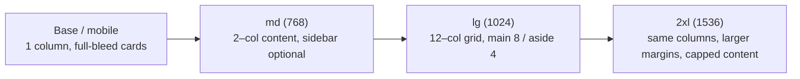

# 10 — Grid System

### Grids, Columns, Breakpoints, and the Baseline

> *"A grid is a shared agreement about where things go — so that a thousand decisions collapse into one."*

---

**Chapter type:** Phase 2 — Design Foundations
**DRI:** Senior UI Designer + Frontend Architect (joint)
**Depends on:** [`00-CONSTITUTION.md`](./00-CONSTITUTION.md), [`04-DESIGN_PHILOSOPHY.md`](./04-DESIGN_PHILOSOPHY.md), [`08-SPACING_SYSTEM.md`](./08-SPACING_SYSTEM.md), [`09-LAYOUT_SYSTEM.md`](./09-LAYOUT_SYSTEM.md)
**Feeds:** [`11`](./11-CARD_DESIGN.md), [`16`](./16-DASHBOARD_DESIGN.md)–[`21`](./21-RESPONSIVE_DESIGN.md), [`33`](./33-TAILWIND_GUIDE.md)

---

## Table of Contents
1. [Purpose](#1-purpose)
2. [Philosophy](#2-philosophy)
3. [Principles](#3-principles)
4. [Best Practices](#4-best-practices)
5. [Anti-Patterns](#5-anti-patterns)
6. [Real-World Examples](#6-real-world-examples)
7. [Common Mistakes](#7-common-mistakes)
8. [AI Implementation Guidance](#8-ai-implementation-guidance)
9. [Human Review Checklist](#9-human-review-checklist)
10. [Automation Opportunities](#10-automation-opportunities)
11. [References for Further Study](#11-references-for-further-study)
12. [Review Checklist & Measurable Quality Criteria](#12-review-checklist--measurable-quality-criteria)

---

## 1. Purpose

The grid is the **coordinate system** of the interface: the columns, gutters, margins, and breakpoints that give every element a principled place to live. Where [`09`](./09-LAYOUT_SYSTEM.md) defines composition and primitives, this chapter defines the *substrate* they compose onto — a consistent column grid and a small, deliberate set of breakpoints — so that alignment, rhythm, and responsive behavior are shared across every page and product surface.

Its purpose is to make "where does this go and how wide is it?" a **solved, systematic question** rather than a per-screen negotiation. A defined grid is what lets a marketing page, a dashboard, and a settings screen all feel like the same product, and what lets designers and engineers hand off work without ambiguity.

---

## 2. Philosophy

**A grid is a constraint that creates freedom.** By agreeing in advance on columns and gutters, we remove a whole class of arbitrary decisions and their inevitable inconsistencies (Article VIII, [`04`](./04-DESIGN_PHILOSOPHY.md)). The grid does the alignment work automatically; the designer spends their attention on content and hierarchy instead of re-deciding column math on every page. Constraints here are pure leverage.

**Breakpoints follow content, not devices.** We do not chase a moving target of specific phone/tablet/laptop dimensions. We set breakpoints where the *content and layout* start to break or where more space becomes usefully available. The device landscape changes yearly; content-driven breakpoints age well (Article IX, [`21`](./21-RESPONSIVE_DESIGN.md)).

**The modern grid is intrinsic first, columns second.** CSS Grid lets layouts respond to content and container ([`09`](./09-LAYOUT_SYSTEM.md)). We reach for a fixed 12-column grid where alignment across regions genuinely matters (page-level composition), and for intrinsic auto grids where content should simply flow. Neither is dogma; each has its place.

**Alignment is trust.** Elements that share grid lines read as intentional and trustworthy; elements that float off-grid read as careless. The grid is the invisible discipline users feel as "polish." Respecting it is respecting the user (Article VII).

---

## 3. Principles

### Principle 1 — Adopt a consistent column grid (commonly 12)
12 divides cleanly into 2/3/4/6, covering most layouts. Define columns, gutters, and outer margins as tokens.
> *Rationale:* A shared, divisible column count makes region widths systematic.

### Principle 2 — Gutters and margins come from the spacing scale
Grid spacing is not special; it draws from [`08`](./08-SPACING_SYSTEM.md).
> *Rationale (Art. IV):* One spacing system, everywhere.

### Principle 3 — Breakpoints are few, named, and content-driven
A small set (e.g. `sm/md/lg/xl/2xl`), chosen where layouts need to change — not per device.
> *Rationale ([`21`](./21-RESPONSIVE_DESIGN.md)):* Fewer, meaningful breakpoints = simpler, more robust responsive behavior.

### Principle 4 — Cap content width; add whitespace, not text width, on large screens
Beyond a max container width, add margins/whitespace rather than stretching content.
> *Rationale ([`07`](./07-TYPOGRAPHY_SYSTEM.md), [`09`](./09-LAYOUT_SYSTEM.md)):* Readability and focus over "filling the screen."

### Principle 5 — Mobile-first grid definition
Define the base (single-column) grid first; add columns as viewports grow.
> *Rationale ([`20`](./20-MOBILE_FIRST.md)):* Progressive enhancement produces leaner, more resilient CSS.

### Principle 6 — Prefer CSS Grid/`gap`; use fractional units and `minmax`
Use native CSS Grid with `fr`, `minmax`, `auto-fit/auto-fill` rather than float/percentage hacks.
> *Rationale:* Native grid is robust, gap-aware, and content-flexible.

### Principle 7 — Respect the grid, but break it intentionally
Full-bleed images, feature moments, and overlaps can break the grid — *deliberately and rarely* (Article XII).
> *Rationale (Art. V):* Purposeful grid-breaks create emphasis; accidental ones create chaos.

### Principle 8 — Consider a baseline (vertical) grid where it pays off
For text-dense, editorial surfaces, align to a vertical rhythm tied to line-height ([`07`](./07-TYPOGRAPHY_SYSTEM.md)).
> *Rationale:* Vertical alignment of text across columns reads as highly composed (use judiciously — strict baselines are costly on the web).

---

## 4. Best Practices

### 4.1 Define grid tokens and breakpoints

```css
:root {
  --grid-columns: 12;
  --grid-gutter: var(--space-5);       /* 24px */
  --grid-margin: var(--space-5);       /* outer page margin (mobile) */
  --container-max: 80rem;              /* 1280px content cap */
  --container-prose: 72ch;            /* reading measure */
}

/* Named, content-driven breakpoints (min-width, mobile-first) */
/* sm 40rem(640) · md 48rem(768) · lg 64rem(1024) · xl 80rem(1280) · 2xl 96rem(1536) */
```

### 4.2 A robust 12-column container
```css
.container {
  width: 100%;
  max-width: var(--container-max);
  margin-inline: auto;
  padding-inline: var(--grid-margin);
}

.grid-12 {
  display: grid;
  grid-template-columns: repeat(var(--grid-columns), minmax(0, 1fr));
  gap: var(--grid-gutter);
}

/* Span helpers (mobile-first: full width, then span at md+) */
.col-span-4  { grid-column: span 4; }
.col-span-6  { grid-column: span 6; }
.col-span-8  { grid-column: span 8; }
@media (max-width: 48rem) {
  [class*="col-span-"] { grid-column: 1 / -1; } /* stack on small screens */
}
```

### 4.3 Increase outer margins with viewport
```css
.container { --grid-margin: var(--space-5); }              /* mobile: 24 */
@media (min-width: 64rem) { .container { --grid-margin: var(--space-7); } } /* lg: 48 */
@media (min-width: 96rem) { .container { --grid-margin: var(--space-9); } } /* 2xl: 96 */
```
Content stays capped at `--container-max`; extra space becomes calm margin (Principle 4).

### 4.4 Use intrinsic grids where content should flow
```css
/* No breakpoints needed — see 09 */
.card-grid {
  display: grid;
  gap: var(--grid-gutter);
  grid-template-columns: repeat(auto-fit, minmax(min(18rem, 100%), 1fr));
}
```
Reserve the fixed 12-col grid for page composition where cross-region alignment matters.

### 4.5 Map to Tailwind precisely
Tailwind ships `grid-cols-12`, `col-span-*`, `gap-*`, and breakpoint prefixes. Configure its `screens`, `container`, and `gap` scale to match these tokens so `lg:col-span-8` means exactly the system's grid ([`33`](./33-TAILWIND_GUIDE.md)). Ban arbitrary column/gap values via lint.

### 4.6 Document the grid visually
Ship a grid overlay (dev-only) so designers/engineers can toggle columns and verify alignment:
```css
.debug-grid::after { /* dev overlay of columns */ content:""; position:fixed; inset:0;
  background: repeating-linear-gradient(90deg, rgba(255,0,0,.06) 0 calc((100% - 11*var(--grid-gutter))/12),
  transparent 0 var(--grid-gutter)); pointer-events:none; }
```

### 4.7 Plan grid transformation across breakpoints


---

## 5. Anti-Patterns

| Anti-pattern | Why it fails | Principle/Article |
| --- | --- | --- |
| **Device-specific breakpoints** (iPhone-14 widths) | Ages instantly; misses other devices & in-betweens. | P3 |
| **Too many breakpoints** | Complex, fragile, contradictory rules. | P3 |
| **Stretching content edge-to-edge on 4K** | Unreadable measure; loses focus. | P4 |
| **Float/percentage grid hacks** | Brittle, gap-unaware, hard to maintain. | P6 |
| **Off-grid placement everywhere** | Looks careless; no alignment discipline. | P1, P3 |
| **Accidental grid-breaks** | Chaos mistaken for creativity. | P7 |
| **Arbitrary Tailwind grid values** (`grid-cols-[7]`, `gap-[13px]`) | Escapes the system. | P2, P6 |
| **Grid tokens divorced from spacing scale** | Two competing spacing systems. | P2 |

---

## 6. Real-World Examples

### Example A — 12-col page + intrinsic content grids (best of both)
A product page needed the header, hero, and footer to align across a consistent page grid, but its feature cards should just flow. The team used a **fixed 12-column container** for page composition (hero text spanning 6, image 6; footer regions on the same lines) and an **intrinsic `auto-fit` grid** for the cards. Alignment where it mattered, flow where it didn't — no wasted breakpoints. *(Principles 1, 6.)*

### Example B — Capping width instead of stretching
On ultrawide monitors, a dashboard stretched its main content to full width, pushing related controls far apart and hurting reading. Applying Principle 4, they capped the content at `--container-max` and let the extra space become symmetric margin. Scanning improved and the layout felt intentional rather than "zoomed." *More screen ≠ more content width.*

### Example C — Fewer, content-driven breakpoints
A codebase had eleven breakpoints tuned to specific devices; every content change caused regressions at some size. Consolidating to five named, content-driven breakpoints (`sm/md/lg/xl/2xl`) plus intrinsic grids removed most device-specific rules and fixed the "breaks at 900px" gaps. Maintenance dropped sharply. *(Principle 3.)*

---

## 7. Common Mistakes

- **Designing to exact device widths** instead of where the layout actually needs to change.
- **Mixing grid gutters/margins outside the spacing scale**, creating two spacing systems.
- **Never capping content width**, so text sprawls on large screens.
- **Reaching for a heavy 12-col grid** when a simple intrinsic auto-grid would do (over-engineering).
- **Breaking the grid by accident** and calling it a design choice.
- **Arbitrary Tailwind grid/gap values** that bypass tokens.
- **Ignoring the in-between viewport sizes** (only checking the exact breakpoints).

---

## 8. AI Implementation Guidance

### 8.1 Where agents help
- **Generate grid tokens, container, and breakpoint config** consistent with the spacing scale and Tailwind.
- **Decide 12-col vs. intrinsic** per region and justify the choice.
- **Produce responsive span plans** (mobile→wide) and cap content width.
- **Audit** for device-specific/too-many breakpoints, off-grid placement, arbitrary values, and uncapped content.
- **Render grid overlays** for alignment verification.

### 8.2 Hard rules (Art. IV, VIII)
- Gutters/margins are **spacing-scale tokens**; column counts and breakpoints come from the defined set — no arbitrary values.
- Content width is **capped**; extra space becomes margin, not text width.
- Use a **fixed 12-col grid only where cross-region alignment matters**; otherwise prefer intrinsic grids (avoid over-engineering).
- Breakpoints must be **content-driven and named**, never device-specific.

### 8.3 Prompt example — build the grid
```
ROLE: Frontend Architect, bound by 00-CONSTITUTION + 10.
TASK: Define the studio grid: 12 columns, gutters/margins from the spacing scale,
container max 80rem, named breakpoints sm/md/lg/xl/2xl (content-driven, mobile-first).
Then lay out <page> regions with a responsive span plan (base→2xl), using the fixed
12-col grid for page composition and intrinsic auto-grids for flowing content.
CONSTRAINTS: no device-specific breakpoints; cap content width; Tailwind-compatible.
OUTPUT: grid tokens + container/grid CSS + Tailwind screens/config + per-region span plan.
```

### 8.4 Prompt example — audit/modernize
```
TASK: Audit the grid CSS: flag device-specific or excess breakpoints, off-scale gutters,
uncapped content width, float/percentage grids, and arbitrary Tailwind grid values.
Propose a consolidated content-driven breakpoint set + CSS-Grid replacements. List changes.
```

---

## 9. Human Review Checklist

- [ ] A consistent **column grid** (e.g. 12) is defined with tokenized gutters/margins from the spacing scale.
- [ ] Breakpoints are **few, named, and content-driven** (not device-specific).
- [ ] Content width is **capped**; large screens gain whitespace, not text width.
- [ ] Grid is **mobile-first** and enhances upward.
- [ ] Native **CSS Grid** (`fr`/`minmax`/`auto-fit`) is used, not float/percentage hacks.
- [ ] Fixed 12-col grid used **where alignment matters**; intrinsic grids where content flows (no over-engineering).
- [ ] Elements **align to the grid**; any grid-break is intentional and documented.
- [ ] Behavior verified at **in-between sizes**, not just at breakpoints.
- [ ] Tailwind grid/gap map exactly to tokens; no arbitrary values.

---

## 10. Automation Opportunities

| Task | Automation |
| --- | --- |
| Grid/token generation | Script emitting grid tokens + Tailwind `screens`/`container`/`gap`. |
| Arbitrary-value lint | Ban `grid-cols-[*]`, `gap-[*]`, off-scale gutters. |
| Breakpoint audit | Lint flagging device-named/excess media queries. |
| Content-width guard | Check containers have `max-width`. |
| Responsive/visual testing | Screenshot diffs across a width sweep (incl. in-between). |
| Grid overlay | Dev-only alignment overlay toggled in review builds. |

---

## 11. References for Further Study
- **Grid theory:** Josef Müller-Brockmann, *Grid Systems in Graphic Design*; classic Swiss grid literature (as reference).
- **Responsive grids:** MDN + web.dev CSS Grid documentation; the intrinsic-web-design approach (Jen Simmons) to grids and breakpoints.
- **Breakpoints:** content-driven breakpoint practice (set breakpoints where the design breaks).
- **Baseline grids:** vertical-rhythm/baseline-grid discussions (apply pragmatically on the web).
- **Cross-references:** [`08-SPACING_SYSTEM.md`](./08-SPACING_SYSTEM.md), [`09-LAYOUT_SYSTEM.md`](./09-LAYOUT_SYSTEM.md), [`20-MOBILE_FIRST.md`](./20-MOBILE_FIRST.md), [`21-RESPONSIVE_DESIGN.md`](./21-RESPONSIVE_DESIGN.md), [`33-TAILWIND_GUIDE.md`](./33-TAILWIND_GUIDE.md).

---

## 12. Review Checklist & Measurable Quality Criteria

| Criterion | Target |
| --- | --- |
| Grid gutters/margins drawn from spacing scale | 100% |
| Named, content-driven breakpoints | ≤ ~5, 0 device-specific |
| Pages capping content width | 100% |
| Arbitrary grid/gap values | 0 |
| Layouts verified at in-between viewport sizes | 100% |
| Intentional (documented) grid-breaks vs. accidental | 100% intentional |

---

*End of `10-GRID_SYSTEM.md`. Phase 2 (Design Foundations) complete.*
