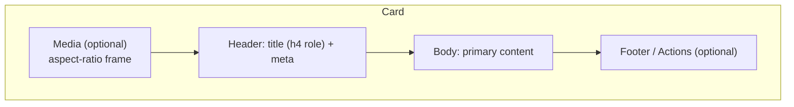

# 11 — Card Design

### Containers, Elevation, and Content Composition

> *"A card is a promise: everything inside belongs together, and the whole thing does one job. Break that promise and the card becomes a box of unrelated stuff."*

---

**Chapter type:** Phase 3 — Components & Tokens
**DRI:** Senior UI Designer + Product Designer (joint)
**Depends on:** [`00-CONSTITUTION.md`](./00-CONSTITUTION.md), [`04-DESIGN_PHILOSOPHY.md`](./04-DESIGN_PHILOSOPHY.md), [`06-COLOR_SYSTEM.md`](./06-COLOR_SYSTEM.md), [`07-TYPOGRAPHY_SYSTEM.md`](./07-TYPOGRAPHY_SYSTEM.md), [`08-SPACING_SYSTEM.md`](./08-SPACING_SYSTEM.md), [`09-LAYOUT_SYSTEM.md`](./09-LAYOUT_SYSTEM.md)
**Feeds:** [`14`](./14-COMPONENT_LIBRARY.md), [`16`](./16-DASHBOARD_DESIGN.md), [`17`](./17-LANDING_PAGE_DESIGN.md), [`19`](./19-ECOMMERCE_DESIGN.md), [`22`](./22-ACCESSIBILITY.md)

---

## Table of Contents
1. [Purpose](#1-purpose)
2. [Philosophy](#2-philosophy)
3. [Principles](#3-principles)
4. [Best Practices](#4-best-practices)
5. [Anti-Patterns](#5-anti-patterns)
6. [Real-World Examples](#6-real-world-examples)
7. [Common Mistakes](#7-common-mistakes)
8. [AI Implementation Guidance](#8-ai-implementation-guidance)
9. [Human Review Checklist](#9-human-review-checklist)
10. [Automation Opportunities](#10-automation-opportunities)
11. [References for Further Study](#11-references-for-further-study)
12. [Review Checklist & Measurable Quality Criteria](#12-review-checklist--measurable-quality-criteria)

---

## 1. Purpose

The card is the most ubiquitous container pattern in modern software — it groups a self-contained unit of content or functionality (a product, a metric, a user, a setting) into a bounded, scannable region. This chapter defines how the studio designs cards so they are **consistent, accessible, composable, and purposeful**, rather than the default dumping ground for "some stuff that goes together, probably."

Cards are deceptively hard. They accumulate elevation abuse (shadow everywhere), nesting abuse (cards in cards in cards), interaction ambiguity (is the whole card clickable? just the title? both?), and accessibility traps (nested interactive elements, unclear focus). This chapter turns the card into a disciplined system component with clear anatomy, states, and rules — the first concrete application of the Phase 2 foundations to a real component.

---

## 2. Philosophy

**A card is a unit of meaning, not a unit of decoration.** Its entire justification is *cohesion*: the contents belong together and represent one thing. If you can't state in a sentence "this card is a ___," it isn't a card — it's a bordered region hiding a lack of information architecture ([`27`](./27-INFORMATION_ARCHITECTURE.md)). The border and shadow are consequences of grouping, not the point of it.

**Elevation is information, not ornament.** A shadow says "this surface floats above that one." That is a *meaningful* claim about depth and layering ([`05`](./05-VISUAL_PSYCHOLOGY.md), figure/ground). When everything has a shadow, nothing is elevated and the signal is destroyed. We use a small, tokenized elevation scale where each level *means* something (Article IV, VI).

**The card should be the calmest way to show grouped content — often that means no card at all.** Cards have a cost: borders and shadows add visual weight and divide the page into competing boxes. Sometimes whitespace and typography group content better than a container does ([`04`](./04-DESIGN_PHILOSOPHY.md) P1/P3). We reach for a card when boundedness genuinely helps, not reflexively.

**Interaction must be unambiguous.** A user must always know what is clickable and what will happen. A card that is *sometimes* clickable, with clickable things inside it, is an accessibility and usability minefield. We make the interaction model explicit and keep it consistent (Article III, [`22`](./22-ACCESSIBILITY.md)).

---

## 3. Principles

### Principle 1 — One card, one subject
Every card represents exactly one coherent thing. If it holds two subjects, split it.
> *Rationale:* Cohesion is the card's only reason to exist.

### Principle 2 — Define a fixed anatomy
Card = optional media + header (title/meta) + body + optional footer/actions. Slots are consistent across the system.
> *Rationale (Art. IV):* A shared anatomy makes cards composable and predictable.

### Principle 3 — Elevation is a tokenized, meaningful scale
Use a small set (e.g. `elevation-0…3`); each level maps to a real layering meaning (flat, raised, overlay, modal).
> *Rationale (Art. VI):* Depth communicates hierarchy; unbounded shadows communicate nothing.

### Principle 4 — Prefer border OR shadow, not both by default; sometimes neither
Choose one separation strategy per surface context. On busy pages a subtle border often beats a shadow.
> *Rationale ([`04`](./04-DESIGN_PHILOSOPHY.md) P1):* Restraint keeps the page calm and elevation meaningful.

### Principle 5 — The whole-card-clickable pattern needs care
If the entire card is a link/button, use ONE primary action and avoid nested interactive elements — or use the "card with a stretched link" pattern that stays accessible.
> *Rationale (Art. III):* Nested interactives break keyboard/AT and create ambiguous targets.

### Principle 6 — Cards use the design foundations, not custom values
Padding from the spacing scale, radius/shadow/color from tokens, text from type roles.
> *Rationale (Art. IV):* No snowflake cards.

### Principle 7 — Design every card state
Default, hover (if interactive), focus-visible, loading (skeleton), empty, error, selected.
> *Rationale ([`04`](./04-DESIGN_PHILOSOPHY.md) P6):* The ideal state is the rarest one in production.

### Principle 8 — Don't over-nest
Avoid cards within cards within cards. Nesting past one level usually signals an IA problem.
> *Rationale (Art. VIII):* Deep nesting = visual noise + cognitive load.

---

## 4. Best Practices

### 4.1 Card anatomy (tokens throughout)



```html
<article class="card">
  <div class="card__media"></div>
  <header class="card__header">
    <h3 class="card__title">Project Atlas</h3>
    <p class="card__meta">Updated 2h ago</p>
  </header>
  <div class="card__body"><p>Short, scannable description.</p></div>
  <footer class="card__actions">
    <button class="btn btn--primary">Open</button>
    <button class="btn btn--ghost">Share</button>
  </footer>
</article>
```

```css
.card {
  display: flex; flex-direction: column;
  gap: var(--space-4);
  padding: var(--space-5);
  background: var(--color-surface);
  border: 1px solid var(--color-border);   /* border OR shadow — pick one */
  border-radius: var(--radius-lg);
  color: var(--color-text);
}
.card__title { font: var(--weight-semibold) var(--text-lg)/var(--leading-snug) var(--font-sans); }
.card__meta  { color: var(--color-text-muted); font-size: var(--text-sm); }
.card__media { aspect-ratio: 16 / 9; overflow: hidden; border-radius: var(--radius-md); }
.card__media img { width: 100%; height: 100%; object-fit: cover; }
```

### 4.2 The elevation scale (tokenized)

| Token | Use | Example shadow (light) |
| --- | --- | --- |
| `elevation-0` | Flat, on-page (border only) | none |
| `elevation-1` | Raised card / resting | `0 1px 2px rgba(0,0,0,.06), 0 1px 3px rgba(0,0,0,.10)` |
| `elevation-2` | Hover / dropdown | `0 4px 8px rgba(0,0,0,.08), 0 2px 4px rgba(0,0,0,.06)` |
| `elevation-3` | Overlay / popover | `0 12px 24px rgba(0,0,0,.12)` |
| `elevation-4` | Modal / dialog | `0 24px 48px rgba(0,0,0,.18)` |

> In dark mode, shadows are weaker; convey elevation with **lighter surface tokens** ([`06`](./06-COLOR_SYSTEM.md)) as much as shadow.

### 4.3 The accessible clickable card
Prefer a real element for the primary action, then "stretch" it over the card so the whole surface is a target *without* nesting interactives illegally:

```html
<article class="card card--interactive">
  <h3 class="card__title">
    <a href="/projects/atlas" class="card__link">Project Atlas</a>
  </h3>
  <p class="card__body">Description…</p>
  <!-- secondary actions must be positioned ABOVE the stretched link (z-index) -->
  <button class="card__bookmark" aria-label="Bookmark Project Atlas">★</button>
</article>
```
```css
.card--interactive { position: relative; }
.card__link::after { content:""; position:absolute; inset:0; } /* stretches hit area */
.card__bookmark { position: relative; z-index: 1; }           /* stays clickable */
.card--interactive:focus-within { outline: 2px solid var(--color-focus-ring); outline-offset: 2px; }
```
- The **accessible name** comes from the link text, not the card.
- Only **one** navigational target for the whole-card click; extra actions sit above it and have their own labels.
- Hover raises elevation (`1 → 2`); focus shows a visible ring via `:focus-within`.

### 4.4 Skeleton loading state
```html
<article class="card" aria-busy="true">
  <div class="skeleton skeleton--media"></div>
  <div class="skeleton skeleton--line" style="width:60%"></div>
  <div class="skeleton skeleton--line" style="width:90%"></div>
</article>
```
Match skeleton geometry to real content to avoid layout shift ([`35`](./35-PERFORMANCE.md)); respect `prefers-reduced-motion` for the shimmer ([`23`](./23-MOTION_SYSTEM.md)).

### 4.5 Card grids use intrinsic layout
Lay out card collections with the auto-grid from [`10`](./10-GRID_SYSTEM.md) (`repeat(auto-fit, minmax(...))`) so cards flow without breakpoint sprawl. Give cards equal height via the grid/flex, not fixed pixel heights (content varies).

### 4.6 Keep density and truncation honest
When truncating text, ensure the full content is reachable (tooltip/detail view). Never hide critical information purely to fit a card's height.

### 4.7 Selected/active states for selectable cards
Use a clear, non-color-only indicator (border + check icon + `aria-pressed`/`aria-selected`) — not just a tint ([`05`](./05-VISUAL_PSYCHOLOGY.md), [`22`](./22-ACCESSIBILITY.md)).

---

## 5. Anti-Patterns

| Anti-pattern | Why it fails | Principle/Article |
| --- | --- | --- |
| **Shadow on everything** | Destroys the meaning of elevation. | P3 |
| **Border + heavy shadow + tint together** | Visual noise; heavy page. | P4, [`04`](./04-DESIGN_PHILOSOPHY.md) |
| **Card of unrelated things** | No cohesion; it's just a box. | P1 |
| **Cards nested 3+ deep** | Noise + cognitive load; IA smell. | P8 |
| **Whole card clickable + buttons inside** (naive) | Nested interactives; keyboard/AT breakage. | P5, Art. III |
| **Ambiguous clickability** | Users don't know what's interactive. | P5 |
| **Fixed-height cards clipping content** | Loses information with real data. | P7, [`09`](./09-LAYOUT_SYSTEM.md) |
| **Custom padding/radius per card** | Snowflakes; inconsistency. | P6 |
| **Color-only selected state** | Fails colorblind/grayscale users. | P7, [`22`](./22-ACCESSIBILITY.md) |
| **No skeleton/empty state** | Jarring loads; blank voids. | P7 |

---

## 6. Real-World Examples

### Example A — Removing shadows to restore hierarchy
A dashboard gave every one of 14 panels a medium drop shadow. The page looked "busy" and no panel felt primary. The team moved to `elevation-0` (subtle border) for resting panels and reserved `elevation-2` for the *one* interactive, hoverable panel and for dropdowns. Suddenly elevation *meant* something again, and the primary content stood out. *Shadow is a signal you can spend only once (Principle 3).*

### Example B — Fixing the inaccessible clickable card
A product card made the whole `<div>` clickable via a JS `onClick`, with a "favorite" button inside. Keyboard users couldn't reach it; screen readers announced nothing meaningful; the inner button's clicks bubbled to the card. Rebuilt with the **stretched-link pattern**: the title is a real `<a>` (keyboard-focusable, announced), its `::after` stretches the hit area, and the favorite button sits above with `z-index` and its own `aria-label`. Fully accessible, still whole-card clickable. *(Principle 5, 4.3.)*

### Example C — No card was the right answer
A settings page wrapped every single setting row in its own card, producing 20 stacked boxes with shadows. Replacing the cards with a single bordered list — grouped by section headings and whitespace ([`08`](./08-SPACING_SYSTEM.md) proximity) — was calmer, faster, and easier to scan. *Sometimes the best card is no card (Philosophy).*

---

## 7. Common Mistakes

- **Defaulting to a card** for any group of content without asking if a container helps.
- **Elevation inflation** — every hover/state bumps shadow until everything floats.
- **Nesting interactive elements** inside a clickable card.
- **Fixed heights** that clip variable content.
- **Color-only selection/hover** states.
- **Skipping skeleton/empty/error states** for card grids that load async.
- **Reinventing card padding/radius** instead of using tokens.
- **Overusing truncation** so key info becomes unreachable.

---

## 8. AI Implementation Guidance

### 8.1 Where agents help
- **Generate the card component** (all slots, states, tokens) in React/TSX + CSS/Tailwind.
- **Produce the accessible clickable-card** pattern correctly (stretched link, no nested interactives).
- **Generate skeleton/empty/error/selected states** automatically.
- **Audit** existing cards for elevation abuse, nested interactives, color-only states, fixed heights, and off-token values.

### 8.2 Hard rules (Art. III, IV, VI)
- Cards use **tokens only** (spacing/radius/elevation/color/type) — no magic values.
- Clickable cards must be **keyboard-accessible with a real element** and must not nest interactive controls illegally; the accessible name is explicit.
- **No meaning by color alone** for selected/hover/error states.
- Every generated card ships **default + interactive states + loading + empty + error**.
- Elevation comes from the **tokenized scale**; agent never invents shadows.

### 8.3 Prompt example — build a card
```
ROLE: Product Designer + Frontend, bound by 00-CONSTITUTION + 11.
TASK: Build a <ProjectCard> (media 16:9, title, meta, description, primary "Open"
action + secondary "bookmark"). Whole card navigates to the project.
CONSTRAINTS:
  - Tokens only (space/radius/elevation/color/type from 06–10).
  - Accessible stretched-link pattern; bookmark stays independently clickable/labelled.
  - Provide states: default, hover (elevation 1→2), focus-visible, loading (skeleton),
    empty, error, selected (not color-only).
  - Border OR shadow, not both. Respect prefers-reduced-motion for skeleton.
OUTPUT: TSX + CSS/Tailwind + a state matrix. Report a11y self-check (keyboard + name).
```

### 8.4 Prompt example — audit
```
TASK: Audit card components for: shadow on non-elevated surfaces, nested interactive
elements inside clickable cards, color-only selected/hover states, fixed heights clipping
content, and off-token padding/radius. Output {file:line, issue, fix}.
```

---

## 9. Human Review Checklist

- [ ] Each card represents **one coherent subject**.
- [ ] Uses the **standard anatomy** and **tokens** (space/radius/elevation/color/type) — no snowflakes.
- [ ] **Elevation** is from the scale and *means* something; not shadow-on-everything.
- [ ] **Border OR shadow** chosen deliberately (not both by default; sometimes neither).
- [ ] Interaction is **unambiguous**; clickable cards are keyboard-accessible with a clear accessible name and **no illegal nested interactives**.
- [ ] All **states** exist: default, hover/focus (if interactive), loading (skeleton), empty, error, selected.
- [ ] Selected/hover/error states are **not color-only**.
- [ ] No **fixed heights** clipping variable content; card grids use intrinsic layout with equal heights.
- [ ] Nesting depth ≤ ~1 (no card-in-card-in-card).
- [ ] Skeletons match content geometry (no layout shift); shimmer respects reduced motion.

---

## 10. Automation Opportunities

| Task | Automation |
| --- | --- |
| Token enforcement | Lint banning raw shadow/radius/padding in card components. |
| Elevation audit | Static scan flagging shadows outside the elevation scale. |
| Nested-interactive detection | a11y lint/axe rule catching interactive-in-interactive. |
| State coverage | Storybook requirement: card ships all states as stories. |
| Color-only state check | Grayscale render diff in CI ([`05`](./05-VISUAL_PSYCHOLOGY.md)). |
| CLS from skeletons | Web-Vitals check that skeletons match final geometry. |

---

## 11. References for Further Study
- **Elevation & surfaces:** material-elevation concepts and surface-tinting for dark themes (as reference patterns).
- **Accessible cards:** the "block link" / stretched-link accessible pattern; WAI guidance on nested interactive elements.
- **Grouping & figure-ground:** Gestalt references in [`05`](./05-VISUAL_PSYCHOLOGY.md).
- **Cross-references:** [`06-COLOR_SYSTEM.md`](./06-COLOR_SYSTEM.md), [`08-SPACING_SYSTEM.md`](./08-SPACING_SYSTEM.md), [`10-GRID_SYSTEM.md`](./10-GRID_SYSTEM.md), [`14-COMPONENT_LIBRARY.md`](./14-COMPONENT_LIBRARY.md), [`22-ACCESSIBILITY.md`](./22-ACCESSIBILITY.md).

---

## 12. Review Checklist & Measurable Quality Criteria

| Criterion | Target |
| --- | --- |
| Cards using tokens (no magic values) | 100% |
| Shadows within the elevation scale | 100% |
| Clickable cards keyboard-accessible w/ clear name | 100% (floor) |
| Nested illegal interactives in cards | 0 |
| Cards shipping all required states | 100% |
| Color-only selected/hover/error states | 0 |
| Card grids with fixed heights clipping content | 0 |

---

*End of `11-CARD_DESIGN.md`.*
