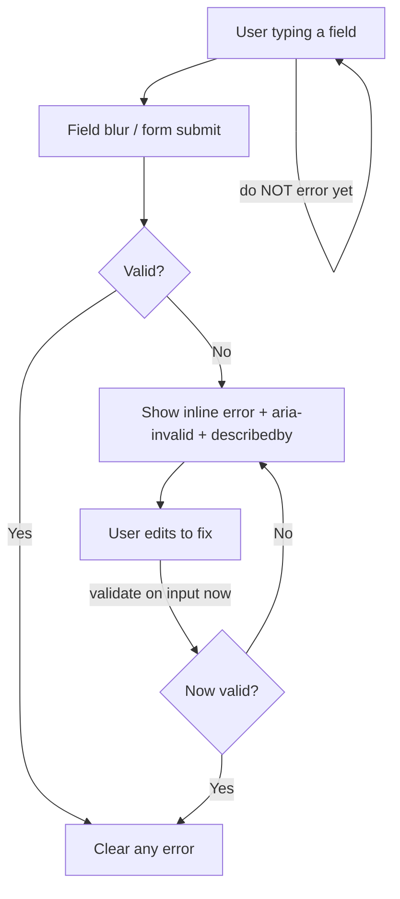

# 13 — Form Design

### Inputs, Validation, and Error Recovery

> *"Every form is a conversation where we do all the asking. The least we can do is ask clearly, one thing at a time, and forgive mistakes."*

---

**Chapter type:** Phase 3 — Components & Tokens
**DRI:** Product Designer + Accessibility Specialist (joint)
**Depends on:** [`00-CONSTITUTION.md`](./00-CONSTITUTION.md), [`05-VISUAL_PSYCHOLOGY.md`](./05-VISUAL_PSYCHOLOGY.md), [`08-SPACING_SYSTEM.md`](./08-SPACING_SYSTEM.md), [`12-BUTTON_DESIGN.md`](./12-BUTTON_DESIGN.md)
**Feeds:** [`14`](./14-COMPONENT_LIBRARY.md), [`22`](./22-ACCESSIBILITY.md), [`25`](./25-COPYWRITING.md), [`26`](./26-USER_EXPERIENCE.md), [`37`](./37-SECURITY.md)

---

## Table of Contents
1. [Purpose](#1-purpose)
2. [Philosophy](#2-philosophy)
3. [Principles](#3-principles)
4. [Best Practices](#4-best-practices)
5. [Anti-Patterns](#5-anti-patterns)
6. [Real-World Examples](#6-real-world-examples)
7. [Common Mistakes](#7-common-mistakes)
8. [AI Implementation Guidance](#8-ai-implementation-guidance)
9. [Human Review Checklist](#9-human-review-checklist)
10. [Automation Opportunities](#10-automation-opportunities)
11. [References for Further Study](#11-references-for-further-study)
12. [Review Checklist & Measurable Quality Criteria](#12-review-checklist--measurable-quality-criteria)

---

## 1. Purpose

Forms are where users give the product what it needs — and where they most often get frustrated, make errors, and abandon. This chapter defines how the studio designs forms that are **fast to complete, hard to get wrong, and forgiving when errors happen** — accessible by default (Article III) and honest in their asking (Article I).

Form design touches everything: label association and keyboard operability ([`22`](./22-ACCESSIBILITY.md)), validation timing and error messaging ([`25`](./25-COPYWRITING.md)), cognitive load and chunking ([`05`](./05-VISUAL_PSYCHOLOGY.md)), spacing and proximity ([`08`](./08-SPACING_SYSTEM.md)), submit-button states ([`12`](./12-BUTTON_DESIGN.md)), and input sanitization/security ([`37`](./37-SECURITY.md)). It is one of the highest-stakes component chapters because forms are where conversion and accessibility are won or lost.

---

## 2. Philosophy

**A form is an interrogation we should make feel like a favor.** Every field is a demand on the user's time, memory, and patience. The ethical, effective stance ([`05`](./05-VISUAL_PSYCHOLOGY.md), Article I) is to ask for the *minimum*, ask *clearly*, and make each answer as easy as possible — smart defaults, correct input types, no needless required fields. The best field is the one you removed.

**Prevent errors before you handle them.** The cheapest error to recover from is the one that never happened. Good input types, constraints, examples, input masks, and inline guidance prevent mistakes; validation and error messages are the *safety net*, not the plan. When errors do occur, the design must forgive: preserve input, point precisely, and explain how to fix it — never blame.

**Accessibility is the form's foundation, not a coat of paint.** A form that isn't keyboard-operable, whose labels aren't programmatically associated, whose errors aren't announced, is broken for a large population — full stop (Article III). Native, semantic form controls give us most of accessibility for free; we start there and only build custom controls when we can fully replicate native behavior.

**Respect the user's data and effort.** Never lose what someone typed. Never validate hostilely mid-keystroke. Never demand information you don't need or will never use. The form is a trust transaction; every friction and every over-ask spends trust ([`03`](./03-BRAND_STRATEGY.md)).

---

## 3. Principles

### Principle 1 — Ask for the minimum
Every field must justify its existence. Remove optional fields; defer what can be collected later.
> *Rationale (Art. I, VIII):* Fewer fields = higher completion + less data risk.

### Principle 2 — Every input has an associated, visible label
Programmatic association (`<label for>`), visible at all times. Placeholders are **not** labels.
> *Rationale (Art. III, [`05`](./05-VISUAL_PSYCHOLOGY.md)):* Placeholders vanish on input and fail AT/contrast.

### Principle 3 — Use the right input type and attributes
Correct `type`, `inputmode`, `autocomplete`, constraints. Let the platform help.
> *Rationale:* Right keyboard, autofill, native validation, fewer errors ([`20`](./20-MOBILE_FIRST.md)).

### Principle 4 — Validate at the right time, forgivingly
Validate on blur / on submit; for corrections, validate on input to confirm the fix. Don't error while the user is still typing a valid-in-progress value.
> *Rationale ([`05`](./05-VISUAL_PSYCHOLOGY.md)):* Premature errors feel hostile; late errors waste effort.

### Principle 5 — Errors are specific, kind, and announced
Say what's wrong and how to fix it, next to the field, in text (not color alone), announced to AT (`aria-describedby`, `aria-invalid`, live region for summaries).
> *Rationale (Art. III, VI, [`25`](./25-COPYWRITING.md)):* Vague/hidden errors strand users.

### Principle 6 — Never lose user input
Preserve entered data across validation errors, navigation, and failures; support autosave for long forms.
> *Rationale (Art. I):* Retyping is a betrayal of effort.

### Principle 7 — Group and chunk logically
Related fields grouped (`<fieldset>/<legend>`), long forms chunked/stepped, proximity from [`08`](./08-SPACING_SYSTEM.md).
> *Rationale ([`05`](./05-VISUAL_PSYCHOLOGY.md) Miller/Gestalt):* Reduces cognitive load.

### Principle 8 — Mark required/optional explicitly and consistently
State which fields are required (or which are optional if most are required). Don't rely on `*` alone without a legend.
> *Rationale (Art. VI):* Ambiguity causes errors.

### Principle 9 — Sanitize and validate on the server too
Client validation is UX; server validation is security. Both, always.
> *Rationale (Art. III, [`37`](./37-SECURITY.md)):* Client checks are bypassable.

---

## 4. Best Practices

### 4.1 Anatomy of a field (accessible by construction)

```html
<div class="field">
  <label for="email" class="field__label">Email address</label>
  <input
    id="email" name="email" type="email"
    inputmode="email" autocomplete="email"
    class="field__input"
    aria-describedby="email-hint email-error"
    aria-invalid="true"        <!-- only when invalid -->
    required
  />
  <p id="email-hint" class="field__hint">We'll send a confirmation here.</p>
  <p id="email-error" class="field__error" role="alert">
    That email doesn't look right — check for a typo.
  </p>
</div>
```

```css
.field { display: flex; flex-direction: column; gap: var(--space-2); }  /* label↔input tight */
.field + .field { margin-block-start: var(--space-5); }                 /* group spacing */
.field__label { font: var(--weight-medium) var(--text-sm)/1.3 var(--font-sans); }
.field__input {
  min-height: 2.75rem; padding: var(--space-2) var(--space-3);
  border: 1px solid var(--color-border); border-radius: var(--radius-md);
  font-size: var(--text-base);           /* ≥16px prevents iOS zoom-on-focus */
  background: var(--color-surface); color: var(--color-text);
}
.field__input:focus-visible { outline: 2px solid var(--color-focus-ring); outline-offset: 1px; }
.field__input[aria-invalid="true"] { border-color: var(--color-danger); }
.field__hint  { color: var(--color-text-muted); font-size: var(--text-sm); }
.field__error { color: var(--color-danger); font-size: var(--text-sm); display: flex; gap: var(--space-1); }
/* error shows an icon too — never color alone */
```

### 4.2 Validation timing model


On submit with errors: move focus to the first invalid field (or a summary), and render an error **summary** with in-page links for long forms.

### 4.3 Error summary for long forms (accessible)
```html
<div role="alert" class="form-summary" tabindex="-1">
  <h2>There are 2 problems with your submission</h2>
  <ul>
    <li><a href="#email">Enter a valid email address</a></li>
    <li><a href="#password">Password must be at least 8 characters</a></li>
  </ul>
</div>
```
Focus the summary on failed submit; links jump to fields.

### 4.4 Right types & autofill (huge mobile win)
| Data | `type` / attributes |
| --- | --- |
| Email | `type="email" inputmode="email" autocomplete="email"` |
| Phone | `type="tel" inputmode="tel" autocomplete="tel"` |
| Number/OTP | `inputmode="numeric" autocomplete="one-time-code"` |
| Name | `autocomplete="name"` (or given/family) |
| Address | `autocomplete="street-address"`, etc. |
| Password | `type="password" autocomplete="current-password" / new-password` |
| Card | `autocomplete="cc-number"` + `inputmode="numeric"` |

### 4.5 Labels, not placeholders
Placeholders disappear, fail contrast, and aren't announced reliably. Use a persistent label; use placeholders only for *format examples* ("e.g. jane@acme.com") — never as the label. (Floating labels are acceptable if a real label remains in the accessibility tree.)

### 4.6 Reduce effort
- Smart defaults; remember prior choices where appropriate.
- One column layout for linear forms (faster than multi-column).
- Correct field width hints at expected length (a ZIP field shouldn't be full-width).
- Input masking/formatting that doesn't fight the user (allow paste; format on blur).
- Show password toggle; allow paste in password/OTP fields (never block paste — a security anti-pattern too).

### 4.7 Submit button states ([`12`](./12-BUTTON_DESIGN.md))
- Prefer **enabled** submit with validation-on-submit over a disabled button (a disabled submit gives no feedback about *why*). If disabled, explain what's missing.
- On submit: loading state, `aria-busy`, prevent double-submit, preserve input, surface server errors inline + summary.

### 4.8 Security & privacy ([`37`](./37-SECURITY.md))
- Validate/sanitize server-side; never trust client input.
- Minimize collected data (Principle 1 doubles as privacy).
- Protect against CSRF; rate-limit sensitive forms; avoid leaking which field (email vs. password) was wrong on login (generic "email or password is incorrect").

---

## 5. Anti-Patterns

| Anti-pattern | Why it fails | Principle/Article |
| --- | --- | --- |
| **Placeholder as label** | Vanishes; poor contrast; AT-unfriendly. | P2, Art. III |
| **Validate on every keystroke** | Hostile; errors while typing valid-in-progress. | P4 |
| **Vague errors** ("Invalid input") | User can't fix it. | P5, [`25`](./25-COPYWRITING.md) |
| **Errors by color/border only** | Colorblind/AT users miss them. | P5, [`22`](./22-ACCESSIBILITY.md) |
| **Losing input on error/nav** | Retyping; abandonment. | P6, Art. I |
| **Too many/needless fields** | Lower completion; privacy risk. | P1 |
| **Wrong input type** (`type=text` for email/number) | Wrong keyboard; no autofill; more errors. | P3 |
| **Disabled submit with no reason** | User stuck, guessing. | P8/P4, [`12`](./12-BUTTON_DESIGN.md) |
| **Blocking paste** (passwords/OTP) | Frustrates; harms password managers. | P6 |
| **`*` required with no legend** | Ambiguous. | P8 |
| **Client-only validation** | Security hole. | P9, Art. III |
| **`<16px` inputs on mobile** | iOS zooms on focus; janky. | P3, [`20`](./20-MOBILE_FIRST.md) |

---

## 6. Real-World Examples

### Example A — Cutting fields lifted completion
A signup form asked for name, email, password, company, role, team size, and phone — seven fields. Discovery ([`01`](./01-PROJECT_DISCOVERY.md)) showed only email + password were needed to start; the rest could be gathered progressively in-product. Cutting to two fields materially increased completion, and the deferred fields were collected later with better context. *The best field is the one you removed (Principle 1).*

### Example B — Forgiving validation vs. hostile validation
A password field errored red on the first keystroke ("Too short") while the user was obviously still typing. Users felt scolded. Switching to the timing model (validate on blur/submit, then on input *after* an error to confirm the fix) made it feel supportive. Combined with a live strength hint, error rates and frustration dropped. *(Principle 4, 4.2.)*

### Example C — Accessible error recovery
A checkout showed errors only as red borders with no text and no announcement; screen-reader users had no idea what failed. The team added inline text errors with icons, `aria-invalid`/`aria-describedby`, an `role="alert"` summary that received focus on failed submit, and per-error jump links. Completion for AT users rose sharply and support tickets fell. *Errors must be specific, visible, and announced (Principle 5).*

---

## 7. Common Mistakes

- **Using placeholders as the only label.**
- **Validating too eagerly** (per keystroke) and punishing in-progress input.
- **Generic error text** that doesn't say how to fix it.
- **Signaling errors with color/border only.**
- **Wrong `type`/missing `autocomplete`/`inputmode`**, hurting mobile + autofill.
- **Losing input** after a server error or navigation.
- **Disabled submit** with no explanation.
- **Inputs under 16px** causing iOS zoom.
- **Skipping server-side validation** because "the client already checks."
- **Multi-column layouts** for linear forms, slowing completion and confusing tab order.

---

## 8. AI Implementation Guidance

### 8.1 Where agents help
- **Generate accessible field/form components** with correct label association, ARIA, types, and the validation timing model.
- **Write specific, kind error messages** and hints ([`25`](./25-COPYWRITING.md)).
- **Produce error summaries** and focus management on failed submit.
- **Audit** forms for placeholder-as-label, missing labels, wrong types, color-only errors, missing server validation, input loss, and disabled-submit-without-reason.

### 8.2 Hard rules (Art. I, III, VI)
- Every input has a **programmatically associated, visible label**; placeholders are never labels.
- Errors are **text + icon** (never color alone), associated via `aria-describedby`, with `aria-invalid`, and announced.
- **Never lose user input** across validation/errors.
- Correct **`type`/`inputmode`/`autocomplete`**; inputs ≥16px on mobile.
- **Server-side validation** always accompanies client validation; never block paste on passwords/OTP.
- Ask only for **needed** fields; challenge every field's necessity.

### 8.3 Prompt example — build a form
```
ROLE: Product Designer + A11y Specialist, bound by 00-CONSTITUTION + 13.
TASK: Build a <SignupForm> (email, password) with:
  - Associated visible labels; correct types/inputmode/autocomplete; inputs ≥16px.
  - Validation on blur/submit, then on-input after an error; forgiving (no keystroke errors).
  - Inline errors (text + icon, aria-invalid, aria-describedby) + an role=alert summary
    that receives focus on failed submit with jump links.
  - Preserve input on error; submit shows loading (aria-busy), prevents double-submit.
  - Note the required server-side validation contract.
OUTPUT: TSX + CSS + validation logic + a11y self-check. Justify every field's necessity.
```

### 8.4 Prompt example — audit
```
TASK: Audit forms for: placeholder-as-label, unassociated labels, wrong input types,
color-only errors, missing aria-invalid/describedby, input loss on error, disabled submit
without reason, <16px inputs, blocked paste, and missing server validation notes.
Output {file:line, issue, fix}.
```

---

## 9. Human Review Checklist

- [ ] Every input has a **visible, associated label** (no placeholder-as-label).
- [ ] Correct **`type`/`inputmode`/`autocomplete`**; inputs ≥ 16px on mobile.
- [ ] Validation is **forgiving** (blur/submit; on-input only after an error).
- [ ] Errors are **specific, kind, text+icon** (not color-only), **associated & announced**.
- [ ] Failed submit **moves focus** to first error / a focusable summary with jump links.
- [ ] **Input is never lost** across errors/navigation; long forms autosave.
- [ ] Fields are **grouped/chunked**; required vs. optional is explicit and consistent.
- [ ] Only **necessary** fields are requested (each justified).
- [ ] Submit uses proper **states** (loading, no double-submit); disabled states explain why.
- [ ] **Server-side validation/sanitization** present; paste not blocked; login errors are generic.

---

## 10. Automation Opportunities

| Task | Automation |
| --- | --- |
| Label association | `jsx-a11y/label-has-associated-control` + axe in CI. |
| Input-type lint | Rule flagging `type=text` for email/tel/number patterns. |
| ARIA error wiring | Lint/tests asserting `aria-invalid` + `aria-describedby` on invalid fields. |
| Color-only error check | Grayscale render diff ([`05`](./05-VISUAL_PSYCHOLOGY.md)). |
| Input-loss test | E2E asserting values persist through a failed submit. |
| Focus-on-error test | E2E asserting focus moves to first error/summary. |
| Server-validation gate | Contract test ensuring endpoints validate independently ([`37`](./37-SECURITY.md)). |

---

## 11. References for Further Study
- **Form usability:** Luke Wroblewski, *Web Form Design*; the GOV.UK Design System form patterns and error-summary approach (reference).
- **Accessible forms:** WAI tutorials on forms; WCAG SC 3.3.1–3.3.4 (error identification, labels, suggestions, error prevention), 1.3.5 (identify input purpose / autocomplete).
- **Microcopy:** error-message and helper-text guidance ([`25`](./25-COPYWRITING.md)).
- **Security:** OWASP input-validation and CSRF guidance ([`37`](./37-SECURITY.md)).
- **Cross-references:** [`05-VISUAL_PSYCHOLOGY.md`](./05-VISUAL_PSYCHOLOGY.md), [`08-SPACING_SYSTEM.md`](./08-SPACING_SYSTEM.md), [`12-BUTTON_DESIGN.md`](./12-BUTTON_DESIGN.md), [`22-ACCESSIBILITY.md`](./22-ACCESSIBILITY.md), [`25-COPYWRITING.md`](./25-COPYWRITING.md).

---

## 12. Review Checklist & Measurable Quality Criteria

| Criterion | Target |
| --- | --- |
| Inputs with associated visible labels | 100% (floor) |
| Errors that are text + announced (not color-only) | 100% (floor) |
| Correct input types/autocomplete | 100% |
| Forms preserving input on error | 100% |
| Forms with server-side validation | 100% (floor) |
| Form completion rate | ↑ trend |
| Error rate per submission | ↓ trend |
| Time-to-complete core forms | ↓ trend |

---

*End of `13-FORM_DESIGN.md`.*
