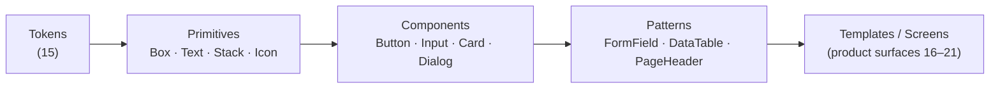
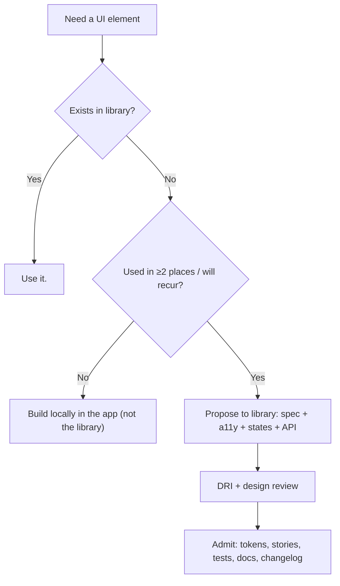

# 14 — Component Library

### The Single Source of UI Truth

> *"A component library is not a folder of components. It is a contract: this is how we build UI here, and there is exactly one way."*

---

**Chapter type:** Phase 3 — Components & Tokens
**DRI:** Design Systems Engineer + Frontend Architect (joint)
**Depends on:** [`00-CONSTITUTION.md`](./00-CONSTITUTION.md), [`04-DESIGN_PHILOSOPHY.md`](./04-DESIGN_PHILOSOPHY.md), [`06`](./06-COLOR_SYSTEM.md)–[`13`](./13-FORM_DESIGN.md), [`15-DESIGN_TOKENS.md`](./15-DESIGN_TOKENS.md)
**Feeds:** [`16`](./16-DASHBOARD_DESIGN.md)–[`21`](./21-RESPONSIVE_DESIGN.md), [`30`](./30-REACT_GUIDE.md), [`32`](./32-TYPESCRIPT_GUIDE.md), [`41`](./41-CODE_ARCHITECTURE.md), [`44`](./44-TESTING.md)

---

## Table of Contents
1. [Purpose](#1-purpose)
2. [Philosophy](#2-philosophy)
3. [Principles](#3-principles)
4. [Best Practices](#4-best-practices)
5. [Anti-Patterns](#5-anti-patterns)
6. [Real-World Examples](#6-real-world-examples)
7. [Common Mistakes](#7-common-mistakes)
8. [AI Implementation Guidance](#8-ai-implementation-guidance)
9. [Human Review Checklist](#9-human-review-checklist)
10. [Automation Opportunities](#10-automation-opportunities)
11. [References for Further Study](#11-references-for-further-study)
12. [Review Checklist & Measurable Quality Criteria](#12-review-checklist--measurable-quality-criteria)

---

## 1. Purpose

The component library is where the design system becomes *code you can import*. It is the single, versioned source of every reusable UI building block — buttons, inputs, cards, dialogs, tables, navigation — each encapsulating its design decisions, states, accessibility, and behavior behind a clean, typed API.

This chapter defines how the studio **structures, builds, documents, tests, versions, and governs** that library so that (a) building a new screen means *composing existing parts*, not writing UI from scratch; (b) a fix or change propagates everywhere at once; and (c) consistency (Article V) and reuse (Article IV) are the path of least resistance. This is the chapter that makes "systems beat individual pages" ([`04`](./04-DESIGN_PHILOSOPHY.md) P9) operationally real.

---

## 2. Philosophy

**One component, one implementation, one source of truth.** The entire value of a component library evaporates the moment there are two Buttons. Divergent copies drift apart, and the system fractures into per-team dialects. We enforce singularity ruthlessly (Article IV): if it's a Button, it's *the* Button, everywhere.

**Components encapsulate decisions so consumers don't re-decide them.** A well-built `<Button variant="primary">` has *already* resolved color, spacing, focus, states, and accessibility. The consumer supplies intent (variant, label, onClick) and gets correctness for free. The library's job is to make the right thing the easy thing and the wrong thing hard or impossible — accessibility, tokens, and states baked in, not bolted on.

**API design is the real design.** A component's props are its contract. A confusing, leaky, or overly-flexible API produces inconsistent usage no matter how good the visuals. We design component APIs with the same rigor as any public interface ([`40`](./40-API_DESIGN.md)): minimal, predictable, composable, hard to misuse, typed ([`32`](./32-TYPESCRIPT_GUIDE.md)).

**A component isn't done until it's documented, tested, and accessible.** "Works on my screen" is not done. Done means: all states exist, it passes a11y checks (Article III), it has stories/docs, it has tests, and its API is stable and typed. An undocumented component is an untrusted component; people will rebuild rather than risk it.

**The library is a product with users (the engineers).** It has versioning, a changelog, breaking-change discipline, and developer experience as a first-class concern ([`50`](./50-CONTINUOUS_IMPROVEMENT.md)). If the library is painful to use, teams route around it — the worst outcome.

---

## 3. Principles

### Principle 1 — Atomic layering: primitives → components → patterns → templates
Organize by composition level so complexity is layered, not tangled.
> *Rationale:* Small, composable parts build predictable wholes ([`41`](./41-CODE_ARCHITECTURE.md)).

### Principle 2 — Everything consumes tokens, nothing hardcodes
Components reference design tokens ([`15`](./15-DESIGN_TOKENS.md)) exclusively for color/space/type/radius/elevation.
> *Rationale (Art. IV):* Theming, dark mode, and rebrands become one change.

### Principle 3 — Accessibility is built in, not optional
Every interactive component ships correct semantics, keyboard support, focus management, and ARIA — verified.
> *Rationale (Art. III):* The library is the best place to guarantee the a11y floor once.

### Principle 4 — Minimal, predictable, hard-to-misuse APIs
Sensible defaults; few required props; composition over configuration; typed; invalid states unrepresentable where possible.
> *Rationale (Art. VIII, [`32`](./32-TYPESCRIPT_GUIDE.md)):* The API shapes how the whole org builds UI.

### Principle 5 — Every component ships all states + stories + tests
Default/hover/focus/active/disabled/loading/empty/error as applicable, each documented and tested.
> *Rationale ([`04`](./04-DESIGN_PHILOSOPHY.md) P6):* Undocumented states get reinvented inconsistently.

### Principle 6 — Composition over configuration; escape hatches without leaks
Prefer composable subcomponents/slots over mega-prop objects; provide controlled escape hatches (e.g. `className`, `asChild`) that don't break invariants.
> *Rationale:* Flexibility without forking; avoids prop explosion.

### Principle 7 — Versioned, with breaking-change discipline
Semantic versioning, changelog, deprecation path, codemods for migrations.
> *Rationale (Art. IX):* Consumers need stability and safe upgrades.

### Principle 8 — Governance: a clear path to add/change
A defined process (and DRI) for proposing, reviewing, and admitting components; a bar for what qualifies.
> *Rationale (Art. XII):* Without governance the library bloats or fractures.

---

## 4. Best Practices

### 4.1 Folder structure

```
packages/ui/
├── src/
│   ├── tokens/                # generated from 15-DESIGN_TOKENS (source of truth)
│   ├── primitives/            # Box, Stack, Cluster, Text, Icon, VisuallyHidden
│   ├── components/
│   │   ├── button/
│   │   │   ├── button.tsx
│   │   │   ├── button.stories.tsx
│   │   │   ├── button.test.tsx
│   │   │   ├── button.a11y.test.tsx
│   │   │   └── index.ts
│   │   ├── input/  card/  dialog/  ...
│   ├── patterns/              # composed: FormField, DataTable, PageHeader, Toolbar
│   ├── hooks/                 # useControllableState, useFocusTrap, useId
│   └── index.ts              # public entry (explicit exports)
├── CHANGELOG.md
└── package.json
```

### 4.2 The atomic layers



| Layer | Contains | Rule |
| --- | --- | --- |
| **Tokens** | color/space/type/radius/elevation | Generated; never hardcoded downstream |
| **Primitives** | layout & text atoms | No business logic; pure structure |
| **Components** | single UI concepts | Self-contained, accessible, stateful UI |
| **Patterns** | composed multi-component units | Compose components; still generic |
| **Templates/Screens** | product-specific pages | Live in the app, not the library |

### 4.3 A well-designed component API (example)
```tsx
// Composition over configuration: Dialog as composable parts
<Dialog>
  <Dialog.Trigger asChild><Button>Delete</Button></Dialog.Trigger>
  <Dialog.Content>
    <Dialog.Title>Delete project?</Dialog.Title>
    <Dialog.Description>This permanently deletes 3 projects.</Dialog.Description>
    <Dialog.Footer>
      <Dialog.Close asChild><Button variant="secondary">Cancel</Button></Dialog.Close>
      <Button variant="destructive" onClick={onDelete}>Delete</Button>
    </Dialog.Footer>
  </Dialog.Content>
</Dialog>
```
- Focus trap, ESC-to-close, `role="dialog"`, `aria-labelledby/-describedby`, scroll-lock, return-focus-on-close — **all built in**.
- `asChild` composes with our Button without a hardcoded internal button (escape hatch without leak).

### 4.4 Typed, hard-to-misuse props ([`32`](./32-TYPESCRIPT_GUIDE.md))
```tsx
// Discriminated union makes invalid combinations unrepresentable
type IconButtonProps = { iconOnly: true; 'aria-label': string; children: React.ReactNode };
type TextButtonProps = { iconOnly?: false; children: React.ReactNode };
type ButtonProps = (IconButtonProps | TextButtonProps) & BaseButtonProps;
// → iconOnly buttons cannot compile without an aria-label
```

### 4.5 Document with stories + usage guidance
Each component has: interactive stories (all states/variants), a props table (auto-generated from types), do/don't examples, accessibility notes, and "when to use / when not to." Treat the docs site as the library's UI.

### 4.6 Test at three levels ([`44`](./44-TESTING.md))
1. **Unit/behavior** (Testing Library): renders, interactions, controlled/uncontrolled, edge cases.
2. **Accessibility** (axe/jest-axe): no violations; keyboard flows; focus management.
3. **Visual regression** (snapshot/Chromatic-style): catch unintended visual changes across states/themes.

### 4.7 Version & migrate responsibly
- SemVer; breaking changes only in majors, with a **changelog** entry and, where feasible, a **codemod**.
- Deprecate before removing (warn in dev, document replacement).
- Provide a migration guide per major ([`50`](./50-CONTINUOUS_IMPROVEMENT.md)).

### 4.8 Governance — the admission bar


---

## 5. Anti-Patterns

| Anti-pattern | Why it fails | Principle/Article |
| --- | --- | --- |
| **Two of the same component** | System fractures; drift. | P1, Art. IV |
| **Hardcoded values in components** | No theming; inconsistency. | P2 |
| **A11y left to the consumer** | Guaranteed to be skipped somewhere. | P3, Art. III |
| **Prop explosion / god-component** | Unusable API; every screen configures differently. | P4, P6 |
| **Boolean soup** (`isPrimary isSecondary isDanger`) | Contradictory states representable. | P4 |
| **Leaky escape hatches** (`style` overrides everywhere) | Invariants broken; consistency lost. | P6 |
| **Undocumented/untested components** | Distrusted → rebuilt locally. | P5 |
| **No versioning/changelog** | Silent breakage on upgrade. | P7 |
| **No governance** | Bloat or fragmentation. | P8 |
| **Library imports app/business logic** | Coupling; not reusable. | P1, [`41`](./41-CODE_ARCHITECTURE.md) |
| **Barrel-export bloat** killing tree-shaking | Bundle bloat. | [`35`](./35-PERFORMANCE.md) |

---

## 6. Real-World Examples

### Example A — Killing the second Button
An audit found three "Button" implementations across an app (one in a legacy folder, one copied for a marketing page, one in the library). They had subtly different padding, focus behavior, and one lacked keyboard support. The team consolidated to the single library Button, wrote a codemod to migrate imports, and added a lint rule banning local button components. Consistency and a11y were fixed *everywhere at once* — the whole point of a library (Principle 1).

### Example B — API redesign that stopped misuse
A `<Modal>` took 18 props including `showHeader`, `headerText`, `footerButtons: [...]`. Every team used it differently and accessibility varied. Redesigning to a **composable** `Dialog.*` (Principle 6) with built-in focus trap and ARIA made correct usage the default and cut the prop count dramatically. Misuse dropped because the composable API guided people into the right structure. *(4.3.)*

### Example C — Type-level prevention of an a11y bug
Icon-only buttons kept shipping without `aria-label`. Rather than rely on review, the team made it a **discriminated union**: `iconOnly: true` *requires* `aria-label` at the type level (4.4). The bug became a compile error. *The best guardrail is one the compiler enforces (Principle 4).*

---

## 7. Common Mistakes

- **Starting the library by building components before defining tokens** ([`15`](./15-DESIGN_TOKENS.md)) — everything hardcodes and must be redone.
- **Over-abstracting early** — building a generic `<Table>` for every future case before two real cases exist (violates [`00`](./00-CONSTITUTION.md) Art. VIII).
- **Under-abstracting** — never promoting recurring patterns, so duplication spreads.
- **Treating docs/tests as optional** — the components then get distrusted and rebuilt.
- **Leaky styling escape hatches** that let consumers break the system.
- **No deprecation path** — breaking people on every release.
- **Coupling the library to app/business logic** — it stops being reusable.

---

## 8. AI Implementation Guidance

### 8.1 Where agents help
- **Scaffold new components** to the folder structure with stories, tests, a11y tests, and typed APIs.
- **Enforce token usage** and refactor hardcoded values.
- **Design/critique component APIs** (suggest composition over prop explosion; discriminated unions).
- **Generate docs** (props tables, do/don't, a11y notes) from types.
- **Audit** for duplicate components, hardcoded values, missing states/tests/a11y, and leaky escape hatches.
- **Write codemods** for breaking changes.

### 8.2 Hard rules (Art. III, IV, VIII)
- **Never create a second version** of an existing component; extend the existing one or propose a change.
- Components use **tokens only**; the agent never hardcodes design values.
- Every generated component ships **all states + stories + unit tests + a11y tests + typed API**; a11y is built in (semantics/keyboard/focus/ARIA), not deferred.
- Prefer **composition**; avoid prop explosion and boolean soup; make invalid states unrepresentable where feasible.
- Don't add to the library unless it meets the **admission bar** (recurs / ≥2 uses); otherwise build locally.

### 8.3 Prompt example — scaffold a component
```
ROLE: Design Systems Engineer, bound by 00-CONSTITUTION + 14 (+ relevant 06–13).
TASK: Add a <Tabs> component to packages/ui.
CONSTRAINTS:
  - Composable API (Tabs / Tabs.List / Tabs.Tab / Tabs.Panel).
  - Full keyboard support (arrow keys, Home/End), roving tabindex, correct ARIA
    (tablist/tab/tabpanel, aria-selected, aria-controls).
  - Tokens only; controlled + uncontrolled modes via a useControllableState hook.
  - Ship stories (all states), unit tests, jest-axe test, typed props.
OUTPUT: files per the folder structure + CHANGELOG entry + docs (props + do/don't + a11y notes).
SELF-CHECK: report a11y (keyboard map + axe) and confirm no hardcoded values.
```

### 8.4 Prompt example — audit
```
TASK: Audit packages/ui + app for: duplicate/parallel components, hardcoded design values,
components missing stories/tests/a11y tests, prop explosion/boolean soup, leaky style escape
hatches, and library files importing app/business logic. Output a prioritized {issue, location, fix}.
```

---

## 9. Human Review Checklist

- [ ] The component is the **only** implementation of its concept (no duplicates).
- [ ] Uses **tokens exclusively**; no hardcoded design values.
- [ ] **Accessibility built in** (semantics, keyboard, focus, ARIA) and verified (axe + manual).
- [ ] API is **minimal, predictable, typed**, composition-first; invalid states unrepresentable where feasible.
- [ ] Ships **all states** + **stories** + **unit tests** + **a11y tests** + **docs** (props, do/don't, a11y).
- [ ] Escape hatches don't **leak/break invariants**.
- [ ] Correctly placed in the **atomic layer**; no app/business-logic coupling.
- [ ] **Versioning/changelog** updated; breaking changes have a deprecation path + codemod.
- [ ] Meets the **admission bar** (genuinely reusable) or lives locally instead.
- [ ] Tree-shakeable exports; no bundle bloat.

---

## 10. Automation Opportunities

| Task | Automation |
| --- | --- |
| Duplicate detection | Lint/CI banning local re-implementations of library components. |
| Token enforcement | Stylelint/ESLint banning hardcoded design values in components. |
| A11y gates | jest-axe + Storybook a11y addon in CI; block on violations. |
| Story/test presence | CI check that each component has stories + unit + a11y tests. |
| Props docs | Auto-generate props tables from TypeScript types. |
| Visual regression | Chromatic-style snapshots across states/themes. |
| Breaking-change safety | Public-API snapshot diff; require changelog + codemod on change. |
| Bundle budget | Size-limit per component/export ([`35`](./35-PERFORMANCE.md)). |

---

## 11. References for Further Study
- **Atomic design:** Brad Frost, *Atomic Design* (atoms→templates).
- **Design systems practice:** public design systems and their docs (structure, governance, versioning) as reference patterns — study, don't copy.
- **Accessible component patterns:** WAI-ARIA Authoring Practices (dialog, tabs, menu, combobox, etc.) — the canonical behavior specs.
- **Headless/unstyled component approaches** (e.g. the "primitive + your styles" model) as an architectural reference.
- **Cross-references:** [`15-DESIGN_TOKENS.md`](./15-DESIGN_TOKENS.md), [`30-REACT_GUIDE.md`](./30-REACT_GUIDE.md), [`32-TYPESCRIPT_GUIDE.md`](./32-TYPESCRIPT_GUIDE.md), [`41-CODE_ARCHITECTURE.md`](./41-CODE_ARCHITECTURE.md), [`44-TESTING.md`](./44-TESTING.md).

---

## 12. Review Checklist & Measurable Quality Criteria

| Criterion | Target |
| --- | --- |
| Duplicate component implementations | 0 |
| Components using tokens only | 100% |
| Interactive components passing automated a11y | 100% (floor) |
| Components with stories + unit + a11y tests | 100% |
| Components with generated props docs | 100% |
| Breaking changes with changelog + migration | 100% |
| UI built by composing library (vs. from scratch) | ≥ 90% |
| Component bundle sizes within budget | 100% |

---

*End of `14-COMPONENT_LIBRARY.md`.*
