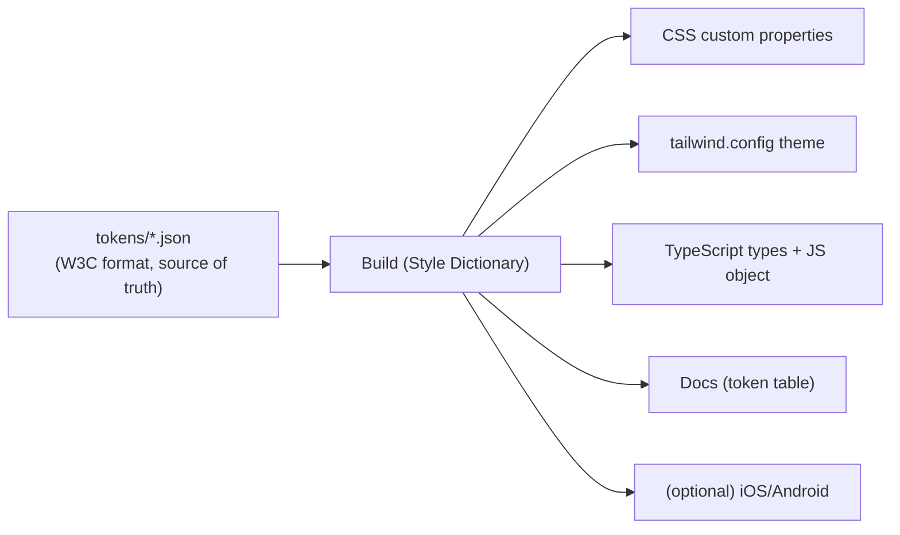

# 15 — Design Tokens

### The Machine-Readable Source of Design Truth

> *"A design token is a decision, frozen into data, so it can be made once and honored everywhere — by every designer, every engineer, every platform, and every machine."*

---

**Chapter type:** Phase 3 — Components & Tokens
**DRI:** Design Systems Engineer (lead) + Frontend Architect
**Depends on:** [`00-CONSTITUTION.md`](./00-CONSTITUTION.md), [`06`](./06-COLOR_SYSTEM.md), [`07`](./07-TYPOGRAPHY_SYSTEM.md), [`08`](./08-SPACING_SYSTEM.md), [`09`](./09-LAYOUT_SYSTEM.md), [`10`](./10-GRID_SYSTEM.md), [`14-COMPONENT_LIBRARY.md`](./14-COMPONENT_LIBRARY.md)
**Feeds:** every component and product-surface chapter; [`33`](./33-TAILWIND_GUIDE.md), [`47`](./47-DEPLOYMENT.md)

---

## Table of Contents
1. [Purpose](#1-purpose)
2. [Philosophy](#2-philosophy)
3. [Principles](#3-principles)
4. [Best Practices](#4-best-practices)
5. [Anti-Patterns](#5-anti-patterns)
6. [Real-World Examples](#6-real-world-examples)
7. [Common Mistakes](#7-common-mistakes)
8. [AI Implementation Guidance](#8-ai-implementation-guidance)
9. [Human Review Checklist](#9-human-review-checklist)
10. [Automation Opportunities](#10-automation-opportunities)
11. [References for Further Study](#11-references-for-further-study)
12. [Review Checklist & Measurable Quality Criteria](#12-review-checklist--measurable-quality-criteria)

---

## 1. Purpose

Design tokens are the atomic, named, platform-agnostic data that encode every design decision — a color, a spacing step, a font size, a radius, a shadow, a duration. This chapter defines how the studio **structures, names, stores, transforms, and governs** tokens so that a single source of truth flows automatically into CSS, Tailwind, React components, and (if needed) native platforms.

Tokens are the connective tissue that makes the entire design system real and enforceable. The Color, Type, Spacing, Layout, and Grid chapters (06–10) each *defined* their values; this chapter is where those values become one governed, machine-readable pipeline that components (14) consume and that CI can verify. Without a token layer, "consistency" is a wish; with it, consistency is the default and drift is a build error.

---

## 2. Philosophy

**A token is a decision made once.** The purpose of a token is to move a design decision out of a thousand scattered literals and into *one named place*. Change the token, and every consumer updates in lockstep. This is Article IV (systems over artifacts) reduced to its purest form: the token *is* the system's memory of a decision, and the reference *is* the honoring of it.

**Tokens must mean something, not just be something.** A raw value (`#2563EB`) is a *what*; a token (`color.action`) is a *why*. The power of tokens comes from the **semantic layer** — naming decisions by intent (action, danger, surface, muted) rather than by appearance (blue-600). Semantic tokens are what make theming, dark mode, and rebranding a remap instead of a rewrite ([`06`](./06-COLOR_SYSTEM.md)).

**One source, many targets.** Designers and engineers should never hand-sync values between Figma, CSS, Tailwind, and native code. The tokens live in one canonical source and are *transformed* into every platform's format by a build step. Duplication is the enemy; the pipeline is the cure.

**Tokens are governed like code.** They are versioned, reviewed, changelogged, and tested (contrast, naming, references resolve). A token change is a system-wide change and deserves system-wide rigor (Article IX, XII). Tokens are also the ideal enforcement point: lint rules ban raw values, CI checks contrast, and drift becomes impossible to merge.

---

## 3. Principles

### Principle 1 — Three tiers: primitive → semantic → component
Primitives (raw scales) → semantic (intent) → component (specific usage). Consumers use semantic/component tiers.
> *Rationale ([`06`](./06-COLOR_SYSTEM.md)):* Indirection localizes change and encodes meaning.

### Principle 2 — Single source of truth, transformed to all targets
One canonical token source; a build step generates CSS vars, Tailwind config, TS types, etc.
> *Rationale (Art. IV):* No manual cross-platform syncing.

### Principle 3 — Consistent, predictable naming
A documented naming scheme (`category.concept.variant.state`) applied uniformly.
> *Rationale (Art. V, VI):* Predictable names are learnable and tooling-friendly.

### Principle 4 — Themes are token overrides, not forks
Light/dark/high-contrast/brand themes override the *semantic* layer only.
> *Rationale ([`06`](./06-COLOR_SYSTEM.md) P6/P7):* Theming is free when architecture is right.

### Principle 5 — Tokens are typed and validated
References resolve; contrast passes; names conform; types are generated for autocomplete.
> *Rationale (Art. III, [`32`](./32-TYPESCRIPT_GUIDE.md)):* Catch errors at build, not in production.

### Principle 6 — No raw values downstream
Components/apps reference tokens only; raw literals are lint-banned.
> *Rationale (Art. IV):* The token layer is worthless if bypassed.

### Principle 7 — Versioned and governed
SemVer, changelog, deprecation, migration for token changes.
> *Rationale (Art. IX):* Token changes ripple everywhere.

### Principle 8 — Keep the set small and intentional
Every token earns its place; prune unused tokens.
> *Rationale (Art. VIII):* A bloated token set is as bad as no system.

---

## 4. Best Practices

### 4.1 The three-tier model

```mermaid
flowchart LR
    subgraph Primitive["Primitive (raw scales)"]
      p1["color.blue.600 = oklch(...)"]
      p2["size.4 = 1rem"]
      p3["font.size.500 = 1.25rem"]
    end
    subgraph Semantic["Semantic (intent)"]
      s1["color.action = {color.blue.600}"]
      s2["space.md = {size.4}"]
      s3["text.body.size = {font.size.400}"]
    end
    subgraph Component["Component (usage)"]
      c1["button.primary.bg = {color.action}"]
      c2["card.padding = {space.lg}"]
    end
    Primitive --> Semantic --> Component
    Component --> App["Components & apps consume<br/>semantic/component tiers ONLY"]
```



### 4.2 Canonical source format (W3C-style JSON)
Use the emerging **W3C Design Tokens** format (`$value`, `$type`, `{references}`) as the source of truth:

```json
{
  "color": {
    "blue": { "600": { "$value": "oklch(0.55 0.18 255)", "$type": "color" } },
    "red":  { "600": { "$value": "oklch(0.55 0.20 27)",  "$type": "color" } }
  },
  "semantic": {
    "color": {
      "action": { "$value": "{color.blue.600}", "$type": "color",
                  "$description": "Primary interactive color. Use for primary buttons, links, focus." },
      "danger": { "$value": "{color.red.600}",  "$type": "color" },
      "surface":{ "$value": "#ffffff", "$type": "color" },
      "text":   { "$value": "{color.gray.900}", "$type": "color" }
    }
  },
  "component": {
    "button": {
      "primary": { "bg": { "$value": "{semantic.color.action}", "$type": "color" } }
    }
  }
}
```

### 4.3 Naming convention
`category.concept.variant.state` — lowercase, dot- or hyphen-delimited, consistent.

| Example | Meaning |
| --- | --- |
| `color.action` | Semantic primary action color |
| `color.action.hover` | Its hover state |
| `space.md` / `space.4` | Spacing step (pick t-shirt **or** numeric, not both) |
| `text.body.size` | Body text size |
| `radius.lg` | Large corner radius |
| `elevation.2` | Elevation level 2 |
| `duration.fast` | Motion duration ([`23`](./23-MOTION_SYSTEM.md)) |
| `button.primary.bg` | Component token |

> **Rule:** choose ONE spacing/size naming style and one delimiter, document it, enforce it (Art. V).

### 4.4 The transformation pipeline
Use a tool (e.g. Style Dictionary or the design-tokens tooling ecosystem) to compile the JSON source into every target:



Generated CSS:
```css
:root {
  --color-action: oklch(0.55 0.18 255);
  --space-md: 1rem;
  --radius-lg: 0.75rem;
}
[data-theme="dark"] { --color-action: oklch(0.68 0.16 255); /* semantic override */ }
```
Generated TS (autocomplete + safety):
```ts
export const tokens = { color: { action: 'var(--color-action)' }, space: { md: 'var(--space-md)' } } as const;
export type ColorToken = keyof typeof tokens.color;
```

### 4.5 Themes as semantic overrides
```json
// themes/dark.json — overrides SEMANTIC layer only, primitives unchanged
{ "semantic": { "color": {
  "surface": { "$value": "{color.gray.900}" },
  "text":    { "$value": "{color.gray.50}" },
  "action":  { "$value": "{color.blue.400}" }
}}}
```

### 4.6 Validate in the build (fail fast)
- **References resolve** (no dangling `{...}`).
- **Contrast** of semantic text/bg pairs passes AA ([`06`](./06-COLOR_SYSTEM.md)) — computed in CI.
- **Naming** conforms to the scheme (lint).
- **No orphan/unused** tokens (report).
- **Types generated** and committed/checked.

### 4.7 Govern token changes
Treat the token repo/package like the component library ([`14`](./14-COMPONENT_LIBRARY.md)): PR review by the DRI, changelog, SemVer, deprecation notes, and a migration guide for renames/removals (provide a codemod or mapping).

---

## 5. Anti-Patterns

| Anti-pattern | Why it fails | Principle/Article |
| --- | --- | --- |
| **Only primitive tokens** (`blue-600` everywhere, no semantic layer) | No intent; theming impossible; rebrand = rewrite. | P1 |
| **Hand-syncing values across platforms** | Drift; wasted effort; inconsistency. | P2 |
| **Inconsistent naming** (`primaryColor`, `color-primary`, `brand`) | Unlearnable; tooling breaks. | P3 |
| **Themes as forked value sets** | Duplication; they drift apart. | P4 |
| **Raw values in components** | Token layer bypassed; system defeated. | P6 |
| **Unversioned token changes** | Silent, system-wide breakage. | P7 |
| **Token explosion** (thousands, many unused) | Unmaintainable; defeats simplicity. | P8 |
| **Encoding appearance in semantic names** (`color.blue.action`) | Locks meaning to a hue; breaks theming. | P1, [`06`](./06-COLOR_SYSTEM.md) |
| **No contrast validation in the pipeline** | Ships inaccessible pairs. | P5, Art. III |

---

## 6. Real-World Examples

### Example A — Rebrand in one afternoon
A company rebranded from blue to green. Because every component referenced `color.action` (semantic) which pointed to `color.blue.600` (primitive), the change was: repoint `color.action → color.green.600`, run the token build, re-verify the contrast matrix. The entire product — buttons, links, focus rings, charts — updated consistently, and CI confirmed contrast still passed. *A decision made once, honored everywhere (Philosophy).* Had components used raw hex, this would have been a multi-week search-and-replace with inevitable misses.

### Example B — Dark mode via semantic override
A team shipped dark mode by adding a `themes/dark.json` that overrode only the **semantic** color tokens (surface/text/action) — primitives untouched, components unchanged. The build generated a `[data-theme="dark"]` block automatically, and the contrast validator re-ran for the dark pairs. No component code changed. *Themes are overrides, not forks (Principle 4).*

### Example C — Pipeline caught an inaccessible token before merge
A designer lightened `color.text.muted` for "a softer look." The token build's contrast check flagged that `text.muted` on `surface` had dropped to 3.9:1 — below AA (4.5:1). The PR failed CI with a precise message. The value was adjusted to pass before merge. *Tokens are the perfect place to enforce the accessibility floor (Principle 5, Article III).*

---

## 7. Common Mistakes

- **Skipping the semantic layer** and referencing primitives directly in components.
- **Baking appearance into semantic names** (`color.blue.primary`), which breaks theming.
- **Two naming conventions coexisting** (numeric `space-4` and t-shirt `space-md`) causing confusion.
- **Manually editing generated files** instead of the source (changes get overwritten).
- **No contrast/reference validation** in the build, so bad tokens ship.
- **Letting apps use raw values** because "it's just one color" — the crack that spreads.
- **Never pruning** unused tokens, letting the set bloat.
- **Treating token changes casually** without versioning/changelog.

---

## 8. AI Implementation Guidance

### 8.1 Where agents help
- **Generate the full three-tier token source** (W3C JSON) from the 06–10 systems, including themes.
- **Configure the transformation pipeline** (Style Dictionary → CSS/Tailwind/TS).
- **Validate**: resolve references, compute the contrast matrix, check naming, find orphans.
- **Refactor apps** to replace raw values with tokens.
- **Generate TS types + docs** from the source.
- **Write migration mappings/codemods** for token renames.

### 8.2 Hard rules (Art. III, IV, VIII)
- Always produce/maintain the **semantic layer**; components reference semantic/component tokens, **never primitives or raw values**.
- Semantic names encode **intent, not appearance**.
- The agent **runs contrast validation** on generated color tokens and fails/repoints any pair below AA.
- **One source of truth**; the agent never edits generated outputs directly.
- Keep the set **lean**; flag/prune unused tokens; use **one** naming convention consistently.

### 8.3 Prompt example — generate the token system
```
ROLE: Design Systems Engineer, bound by 00-CONSTITUTION + 15 (+06–10).
INPUT: color ramps, type scale, spacing scale, radii, elevations from 06–10; brand accent.
TASK:
  1. Produce W3C-format token JSON in three tiers (primitive→semantic→component).
     Semantic names = intent (action/danger/surface/text/muted/border/focus...).
  2. Add themes/dark.json overriding ONLY the semantic layer.
  3. Configure Style Dictionary to emit: CSS custom properties, Tailwind theme, TS types+object, docs table.
  4. Add build validation: references resolve, AA contrast on all text/bg pairs, naming lint, orphan report.
OUTPUT: token files + pipeline config + generated samples + validation report.
CONSTRAINT: no appearance-based semantic names; no raw values downstream.
```

### 8.4 Prompt example — audit/migrate
```
TASK: Scan the app for raw color/space/radius/shadow literals and off-token values.
Map each to the correct semantic/component token; produce a codemod + a report of any
values with no token match (candidates for new tokens or removal). Do not touch generated files.
```

---

## 9. Human Review Checklist

- [ ] Tokens follow the **three-tier model**; components consume **semantic/component** tiers only.
- [ ] Semantic names encode **intent, not appearance**.
- [ ] **One source of truth**; all platform outputs are **generated**, not hand-synced.
- [ ] **Naming convention** is consistent (one style, one delimiter) and documented.
- [ ] **Themes are semantic overrides**, not forked value sets.
- [ ] Build **validates** references, **contrast (AA)**, naming, and reports orphans.
- [ ] **TS types generated** for autocomplete/safety.
- [ ] **No raw values** in components/apps (lint-enforced).
- [ ] Token changes are **versioned/changelogged** with migration for renames/removals.
- [ ] Token set is **lean** (unused pruned).

---

## 10. Automation Opportunities

| Task | Automation |
| --- | --- |
| Transform pipeline | Style Dictionary build in CI generating all targets. |
| Contrast validation | CI step computing AA on semantic text/bg pairs; fail on violation ([`06`](./06-COLOR_SYSTEM.md)). |
| Reference resolution | Build fails on dangling `{...}` references. |
| Naming lint | Enforce the naming scheme on token keys. |
| Raw-value ban | Stylelint/ESLint banning literals outside the primitive source. |
| Orphan detection | Report tokens never referenced by components/apps. |
| Type generation | Auto-generate + type-check token TS. |
| Change safety | Token public-API diff; require changelog + migration on renames. |
| Figma sync | (Optional) two-way sync between design tool variables and the source. |

---

## 11. References for Further Study
- **Standard format:** the W3C Design Tokens Community Group format specification.
- **Tooling:** Style Dictionary (Amazon) and the broader token-transformation ecosystem; Tokens Studio (Figma) as a reference for design-tool integration.
- **Foundational articles:** the original Salesforce/Lightning "design tokens" concept and subsequent multi-platform token practice.
- **Theming architecture:** semantic-token/theming patterns from public design systems (reference).
- **Cross-references:** [`06-COLOR_SYSTEM.md`](./06-COLOR_SYSTEM.md), [`07-TYPOGRAPHY_SYSTEM.md`](./07-TYPOGRAPHY_SYSTEM.md), [`08-SPACING_SYSTEM.md`](./08-SPACING_SYSTEM.md), [`14-COMPONENT_LIBRARY.md`](./14-COMPONENT_LIBRARY.md), [`33-TAILWIND_GUIDE.md`](./33-TAILWIND_GUIDE.md).

---

## 12. Review Checklist & Measurable Quality Criteria

| Criterion | Target |
| --- | --- |
| Design decisions represented as tokens | 100% (color/space/type/radius/elevation/motion) |
| Components referencing tokens (not raw values) | 100% |
| Semantic tokens with intent-based names | 100% |
| Contrast validation in the token build | Yes; 100% AA on text pairs |
| Platform outputs generated from one source | 100% (no hand-sync) |
| Token naming-convention compliance | 100% |
| Unused/orphan tokens | trend → 0 |
| Token changes with changelog + migration | 100% |

---

*End of `15-DESIGN_TOKENS.md`. Phase 3 (Components & Tokens) complete.*
