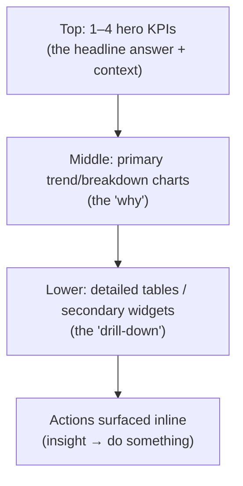

# 16 — Dashboard Design

### Data Density, Scanning, and Decision Support

> *"A dashboard is not a place to show data. It is a place to answer a question fast enough to act on it."*

---

**Chapter type:** Phase 4 — Product Surfaces
**DRI:** Product Designer + UX Researcher (joint)
**Depends on:** [`00-CONSTITUTION.md`](./00-CONSTITUTION.md), [`04`](./04-DESIGN_PHILOSOPHY.md)–[`15`](./15-DESIGN_TOKENS.md), [`27-INFORMATION_ARCHITECTURE.md`](./27-INFORMATION_ARCHITECTURE.md)
**Feeds:** [`18-SAAS_DESIGN.md`](./18-SAAS_DESIGN.md), [`26-USER_EXPERIENCE.md`](./26-USER_EXPERIENCE.md), [`35-PERFORMANCE.md`](./35-PERFORMANCE.md)

---

## Table of Contents
1. [Purpose](#1-purpose)
2. [Philosophy](#2-philosophy)
3. [Principles](#3-principles)
4. [Best Practices](#4-best-practices)
5. [Anti-Patterns](#5-anti-patterns)
6. [Real-World Examples](#6-real-world-examples)
7. [Common Mistakes](#7-common-mistakes)
8. [AI Implementation Guidance](#8-ai-implementation-guidance)
9. [Human Review Checklist](#9-human-review-checklist)
10. [Automation Opportunities](#10-automation-opportunities)
11. [References for Further Study](#11-references-for-further-study)
12. [Review Checklist & Measurable Quality Criteria](#12-review-checklist--measurable-quality-criteria)

---

## 1. Purpose

This chapter defines how the studio designs dashboards — dense, data-driven surfaces whose job is to help a specific person answer a specific question and take a specific action, fast. It applies the Phase 2–3 systems (hierarchy, color, spacing, cards, tables) to the hardest layout problem in software: presenting a lot of information without overwhelming the user.

Dashboards fail in predictable ways — they become "data landfills" that show everything and answer nothing, or decoration-heavy vanity screens that impress in a demo and get ignored in daily use. This chapter defines how to build dashboards people actually rely on: scannable, prioritized, accessible, performant, and anchored to real decisions ([`01`](./01-PROJECT_DISCOVERY.md) JTBD).

---

## 2. Philosophy

**A dashboard answers a question; it does not display a database.** The most common dashboard mistake is starting from "what data do we have?" instead of "what decision does this person need to make?" Every widget must trace to a question a real user asks on a real cadence ([`01`](./01-PROJECT_DISCOVERY.md), Article I). Data without a decision attached is noise wearing a chart's clothing.

**Density is a feature, but clarity is the floor.** Dashboards are legitimately dense — that's their nature ([`08`](./08-SPACING_SYSTEM.md) density modes). But density without hierarchy is chaos. The discipline is making the *most important* thing unmistakable even when the screen is full ([`05`](./05-VISUAL_PSYCHOLOGY.md) pre-attentive; [`04`](./04-DESIGN_PHILOSOPHY.md) P2). A dense dashboard where everything is equally loud has failed.

**The best dashboard is often smaller than requested.** Stakeholders ask for "all the metrics." Users need the three that drive action, with the rest a click away (progressive disclosure). Overview → detail, not everything-at-once. This is Article VIII (simplicity) applied to information.

**Show status, then enable action.** A dashboard that only *reports* is half a product. The great ones connect insight to action — "you're at risk of missing SLA" links to "reassign these tickets." Insight the user can't act on is trivia (Article I).

---

## 3. Principles

### Principle 1 — Start from the question and the decision
Each dashboard (and each widget) maps to a user question and the action it enables.
> *Rationale (Art. I):* No orphan widgets; every element earns its place.

### Principle 2 — Establish ruthless visual hierarchy
The 1–3 most important metrics dominate; supporting data recedes. Hierarchy survives a full screen.
> *Rationale ([`04`](./04-DESIGN_PHILOSOPHY.md) P2, [`05`](./05-VISUAL_PSYCHOLOGY.md)):* Users must know where to look first.

### Principle 3 — Overview first, then drill down
Show the summary; let users progressively disclose detail. Don't dump everything at top level.
> *Rationale ([`05`](./05-VISUAL_PSYCHOLOGY.md) Hick/Miller):* Reduces cognitive load; scales to complexity.

### Principle 4 — Choose the right visualization for the question
Comparison → bar; trend → line; part-to-whole → stacked/limited pie; single status → big number/gauge; distribution → histogram. Match chart to intent.
> *Rationale:* The wrong chart obscures the answer.

### Principle 5 — Provide context for every number
A number alone is meaningless; show comparison (vs. target, prior period, benchmark) and trend direction.
> *Rationale (Art. VI):* "$40k" means nothing; "$40k, +12% vs last month, above target" means everything.

### Principle 6 — Design for real, messy, and empty data
Loading, empty (new user / no data), partial, error, and overflow states — plus stale-data indicators.
> *Rationale ([`04`](./04-DESIGN_PHILOSOPHY.md) P6):* Live data is never as tidy as the mock.

### Principle 7 — Accessibility for data
Never color-only encoding; accessible charts (labels, patterns, data tables as alternatives); keyboard-navigable; screen-reader summaries.
> *Rationale (Art. III, [`22`](./22-ACCESSIBILITY.md)):* Charts are a notorious a11y gap.

### Principle 8 — Performance is a dashboard feature
Dashboards load lots of data; budget it. Virtualize big tables, lazy-load below-fold widgets, paginate/aggregate server-side.
> *Rationale (Art. II, [`35`](./35-PERFORMANCE.md)):* A slow dashboard is an abandoned dashboard.

---

## 4. Best Practices

### 4.1 The dashboard layout hierarchy



### 4.2 Design the KPI card (status + context + action)
```html
<article class="kpi-card">
  <p class="kpi-card__label">Monthly recurring revenue</p>
  <p class="kpi-card__value">$142.8k</p>
  <p class="kpi-card__delta kpi-card__delta--up">
    <span aria-hidden="true">▲</span> 12.4% <span class="kpi-card__ctx">vs. last month</span>
  </p>
  <p class="kpi-card__target">Target $150k · 95% there</p>
  <a class="kpi-card__action" href="/revenue">View breakdown →</a>
</article>
```
- Delta uses **icon + sign + text**, never color alone (Principle 7).
- Always pair the value with **comparison + target** (Principle 5).

### 4.3 Chart selection guide

| Question | Chart | Avoid |
| --- | --- | --- |
| How does X change over time? | Line / area | Pie |
| How do categories compare? | Horizontal bar | 3D anything |
| Part-to-whole (few parts) | Stacked bar / limited donut | Pie with >5 slices |
| Single status vs. target | Big number + delta / bullet | Gauge overload |
| Distribution | Histogram / box | Line |
| Relationship | Scatter | — |
| Geographic | Choropleth (carefully) | — |

### 4.4 Data tables that scale ([`14`](./14-COMPONENT_LIBRARY.md))
- **Virtualize** large row sets; **paginate or infinite-scroll** with server-side sort/filter.
- Sticky header; right-align numbers; monospace-tabular figures for scanning.
- Row actions consistent ([`12`](./12-BUTTON_DESIGN.md)); bulk selection accessible.
- Column density toggle (compact/cozy, [`08`](./08-SPACING_SYSTEM.md)) keeping ≥44px targets.

### 4.5 States and freshness
- **Empty (new user):** explain what will appear + a first action, not a blank grid.
- **Loading:** skeletons matching final geometry (no layout shift).
- **Error/partial:** show what loaded; isolate the failed widget; offer retry.
- **Stale data:** timestamp ("Updated 2m ago") and a manual refresh; indicate live vs. cached.

### 4.6 Filters & time range
- Persistent, discoverable global filters (time range, segment) with clear current-state.
- Preserve filter state in the URL (shareable, back-button friendly, [`31`](./31-NEXTJS_GUIDE.md)).
- Sensible defaults (most users want "last 30 days," not "all time").

### 4.7 Accessible data viz ([`22`](./22-ACCESSIBILITY.md))
- Provide a **data-table alternative** for every chart (toggle or visually-hidden table).
- Encode with **pattern/shape + label**, not color alone; ensure series colors meet contrast and are colorblind-safe.
- Charts get an accessible name + summary; interactive charts are keyboard-operable.

### 4.8 Performance budget ([`35`](./35-PERFORMANCE.md))
- Lazy-load below-the-fold widgets; defer heavy charts.
- Aggregate server-side; don't ship 100k rows to the client.
- Cache and stream; show meaningful progress for slow queries.

---

## 5. Anti-Patterns

| Anti-pattern | Why it fails | Principle/Article |
| --- | --- | --- |
| **Data landfill** (every metric, no priority) | Answers nothing; users can't find the signal. | P1, P2 |
| **Vanity dashboard** (pretty, decorative, unused) | Impresses in demo; ignored in use. | P1, Art. I |
| **Everything equal weight** | No hierarchy; eye has nowhere to land. | P2 |
| **Numbers without context** | Meaningless; no decision possible. | P5 |
| **Wrong chart** (pie for trends, 3D) | Obscures the answer. | P4 |
| **Color-only encoding** | Fails colorblind/AT; inaccessible charts. | P7, Art. III |
| **Only the happy state** | Empty/error/stale states break in production. | P6 |
| **Shipping all rows to client** | Slow, janky, memory-heavy. | P8 |
| **Filters that don't persist** | Lost on refresh; not shareable. | P6/4.6 |
| **KPI vanity metrics** | Optimizes the wrong thing ([`02`](./02-PRODUCT_STRATEGY.md)). | Art. X |

---

## 6. Real-World Examples

### Example A — From landfill to one question (recap of [`01`](./01-PROJECT_DISCOVERY.md) Example A, realized)
An ops dashboard showed 20 charts nobody used. Discovery revealed the real recurring question: *"Are we at risk of missing today's SLA?"* The redesign led with **one hero status** ("On track / At risk") + the two inputs that drive it, with everything else a drill-down. Adoption jumped to near-100% and the build was far smaller. *Answer the question; hide the rest (Principles 1–3).*

### Example B — Context turned a number into a decision
A revenue widget showed "$142.8k." Users still asked "is that good?" Adding **delta vs. last month, target, and % to target** turned a passive number into an actionable one — teams could see at a glance whether to push. *A number needs a neighbor (Principle 5).*

### Example C — Accessible charts, broader reach
A analytics product encoded series by color only; colorblind users and screen-reader users were locked out. Adding colorblind-safe palettes + patterns, per-chart data-table toggles, and screen-reader summaries made the product usable by everyone and, incidentally, clearer for all users in grayscale printing. *Accessibility improved the product for everyone (Principle 7, Article III).*

---

## 7. Common Mistakes

- **Designing from available data** instead of from user questions/decisions.
- **No clear hero** — every widget the same size/weight.
- **Bare numbers** with no comparison/target/trend.
- **Pie charts for trends** or too many slices; decorative 3D.
- **Color-only series/status**, inaccessible charts.
- **Only the fully-loaded state** — no empty/error/stale handling.
- **Client-side everything** — no server aggregation/pagination/virtualization.
- **Filters not persisted** in URL; no sensible defaults.

---

## 8. AI Implementation Guidance

### 8.1 Where agents help
- **Map widgets to questions/decisions** and flag orphan widgets.
- **Recommend chart types** from the data + question; generate accessible chart components (with data-table alternatives).
- **Generate KPI cards** with context (delta/target/trend) and all states.
- **Audit** for hierarchy, color-only encoding, missing states, and client-side data overload.
- **Add virtualization/pagination** and lazy-loading for performance.

### 8.2 Hard rules (Art. I, III, VIII)
- Every widget must **trace to a user question/decision**; the agent flags any that don't.
- Charts must be **accessible**: never color-only, provide a data-table alternative, accessible name + summary, keyboard-operable; colorblind-safe, contrast-checked palettes.
- Numbers ship **with context** (comparison/target/trend).
- Produce **all states** (empty/loading/error/stale/overflow).
- Enforce **performance** (server aggregation, virtualization, lazy-load) — never dump full datasets client-side.

### 8.3 Prompt example — design a dashboard
```
ROLE: Product Designer, bound by 00-CONSTITUTION + 16.
INPUT: user role = <ops lead>; recurring question = <"at risk of missing SLA today?">; data = <schema>.
TASK:
  1. Define the hero status + the 2–3 driving inputs; everything else = drill-down.
  2. Choose chart types per the selection guide; generate accessible components
     (data-table alt, colorblind-safe, keyboard, summary).
  3. KPI cards with delta/target/trend (icon+text, not color-only).
  4. All states (empty/loading/error/stale/overflow); URL-persisted filters w/ sensible defaults.
  5. Note performance plan (server aggregation, virtualization, lazy-load).
OUTPUT: layout + components (TSX) + state matrix + a11y & perf self-check. Flag any orphan widget.
```

### 8.4 Prompt example — audit
```
TASK: Audit the dashboard for: widgets with no linked decision, missing visual hierarchy,
bare numbers (no context), wrong chart types, color-only encoding, missing empty/error/stale
states, non-persisted filters, and client-side data overload. Output {location, issue, fix}.
```

---

## 9. Human Review Checklist

- [ ] Every widget maps to a **user question/decision** (no orphans).
- [ ] There is a **clear hero**; hierarchy survives a full screen (squint test).
- [ ] **Overview → drill-down**; not everything at top level.
- [ ] **Chart types match** the questions; no pies-for-trends / 3D.
- [ ] Numbers include **context** (comparison/target/trend).
- [ ] Charts are **accessible**: not color-only, data-table alternative, keyboard, summaries, colorblind-safe.
- [ ] All **states** present (empty/loading/error/stale/overflow); freshness shown.
- [ ] **Filters persist** (URL) with sensible defaults.
- [ ] **Performance** handled (server aggregation, virtualization, lazy-load; within budget).
- [ ] Tables scale (virtualized/paginated, sticky header, tabular numerals, accessible actions).

---

## 10. Automation Opportunities

| Task | Automation |
| --- | --- |
| Orphan-widget check | Lint/spec requiring each widget to declare its linked question/metric. |
| Chart a11y | Automated checks: data-table alternative present, contrast, keyboard, name/summary. |
| Color-only detection | Grayscale render diff of charts ([`05`](./05-VISUAL_PSYCHOLOGY.md)). |
| State coverage | Storybook stories for empty/loading/error/stale per widget. |
| Perf budgets | Bundle + data-payload budgets; virtualization lint for large tables ([`35`](./35-PERFORMANCE.md)). |
| Filter persistence | E2E test that filters survive refresh and are in the URL. |

---

## 11. References for Further Study
- **Information design:** Edward Tufte (data-ink ratio, chartjunk); Stephen Few (dashboard design, *Information Dashboard Design*).
- **Chart choice:** the "financial times / data viz" chart-suggestion guides; perceptual accuracy of encodings (Cleveland & McGill).
- **Accessible data viz:** WAI guidance and practitioner work on accessible charts (data tables, patterns, sonification).
- **Cross-references:** [`05-VISUAL_PSYCHOLOGY.md`](./05-VISUAL_PSYCHOLOGY.md), [`08-SPACING_SYSTEM.md`](./08-SPACING_SYSTEM.md), [`14-COMPONENT_LIBRARY.md`](./14-COMPONENT_LIBRARY.md), [`22-ACCESSIBILITY.md`](./22-ACCESSIBILITY.md), [`35-PERFORMANCE.md`](./35-PERFORMANCE.md).

---

## 12. Review Checklist & Measurable Quality Criteria

| Criterion | Target |
| --- | --- |
| Widgets linked to a user decision | 100% |
| Numbers shown with context | 100% |
| Charts with accessible alternatives | 100% (floor) |
| Color-only encodings | 0 |
| Dashboards with all states designed | 100% |
| Filter state persisted in URL | 100% |
| Dashboard time-to-interactive | within budget ([`35`](./35-PERFORMANCE.md)) |
| Dashboard adoption / daily use | ↑ trend |

---

*End of `16-DASHBOARD_DESIGN.md`.*
