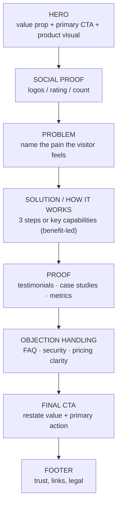

# 17 — Landing Page Design

### Persuasion, Clarity, and Conversion (Ethically)

> *"A landing page has one job and about five seconds to do it: make a stranger understand what you offer, believe it's for them, and want the next step."*

---

**Chapter type:** Phase 4 — Product Surfaces
**DRI:** Creative Director + Brand Strategist + SEO Specialist (joint)
**Depends on:** [`00-CONSTITUTION.md`](./00-CONSTITUTION.md), [`02`](./02-PRODUCT_STRATEGY.md), [`03`](./03-BRAND_STRATEGY.md), [`04`](./04-DESIGN_PHILOSOPHY.md)–[`15`](./15-DESIGN_TOKENS.md), [`05`](./05-VISUAL_PSYCHOLOGY.md), [`25`](./25-COPYWRITING.md), [`36`](./36-SEO.md)
**Feeds:** [`18-SAAS_DESIGN.md`](./18-SAAS_DESIGN.md), [`19-ECOMMERCE_DESIGN.md`](./19-ECOMMERCE_DESIGN.md)

---

## Table of Contents
1. [Purpose](#1-purpose)
2. [Philosophy](#2-philosophy)
3. [Principles](#3-principles)
4. [Best Practices](#4-best-practices)
5. [Anti-Patterns](#5-anti-patterns)
6. [Real-World Examples](#6-real-world-examples)
7. [Common Mistakes](#7-common-mistakes)
8. [AI Implementation Guidance](#8-ai-implementation-guidance)
9. [Human Review Checklist](#9-human-review-checklist)
10. [Automation Opportunities](#10-automation-opportunities)
11. [References for Further Study](#11-references-for-further-study)
12. [Review Checklist & Measurable Quality Criteria](#12-review-checklist--measurable-quality-criteria)

---

## 1. Purpose

This chapter defines how the studio designs landing pages — the high-stakes marketing surfaces whose success is measured by whether a stranger *understands, believes, and acts*. It synthesizes brand ([`03`](./03-BRAND_STRATEGY.md)), positioning ([`02`](./02-PRODUCT_STRATEGY.md)), visual psychology ([`05`](./05-VISUAL_PSYCHOLOGY.md)), copy ([`25`](./25-COPYWRITING.md)), performance ([`35`](./35-PERFORMANCE.md)), and SEO ([`36`](./36-SEO.md)) into one conversion-focused, *ethical* discipline.

Landing pages are where the studio's design principles meet the market's brutal attention economy. Done well, they clearly communicate value and convert. Done badly, they confuse (unclear value), manipulate (dark patterns — banned by Article III), or simply load too slowly to matter. This chapter covers the anatomy, the persuasion (used ethically), and the technical execution.

---

## 2. Philosophy

**Clarity converts better than cleverness.** The single biggest lever on a landing page is not a persuasion trick — it's whether a first-time visitor instantly understands *what this is, who it's for, and why it's better*. Confused visitors leave. The bar is the "five-second test": show someone the hero for five seconds; can they say what you offer and to whom? Most pages fail this, and no amount of animation fixes a muddy message ([`04`](./04-DESIGN_PHILOSOPHY.md) P2, [`25`](./25-COPYWRITING.md)).

**Persuasion, yes; manipulation, never.** Landing pages persuade — that's their job. But the studio persuades *ethically*: real social proof, honest benefits, genuine urgency (or none), transparent pricing. Fake countdowns, confirmshaming, hidden costs, and forced continuity are dark patterns and are banned ([`05`](./05-VISUAL_PSYCHOLOGY.md) Persuasion Ethics Test, Article III). Trust is the actual conversion engine over any horizon that matters.

**Speed and SEO are part of the design.** A gorgeous hero that takes 6 seconds to render has already lost most mobile visitors (Article II). Core Web Vitals, semantic structure, and metadata aren't a post-launch chore — they're design constraints from the first wireframe ([`35`](./35-PERFORMANCE.md), [`36`](./36-SEO.md)). The fastest-loading clear page usually wins.

**One page, one goal, one primary action.** A landing page is not a site map. It has a single conversion goal and repeats one primary call-to-action ([`12`](./12-BUTTON_DESIGN.md) one-primary). Competing CTAs split attention and lower conversion ([`05`](./05-VISUAL_PSYCHOLOGY.md) Hick's Law).

---

## 3. Principles

### Principle 1 — Lead with a clear value proposition
The hero states what it is, who it's for, and the key benefit — passing the five-second test.
> *Rationale (Art. I, [`02`](./02-PRODUCT_STRATEGY.md)):* Clarity is the top conversion lever.

### Principle 2 — One goal, one repeated primary CTA
Define the single conversion action; make it unmistakable and repeat it down the page.
> *Rationale ([`05`](./05-VISUAL_PSYCHOLOGY.md) Hick, [`12`](./12-BUTTON_DESIGN.md)):* Focus converts.

### Principle 3 — Structure as a persuasion narrative
Problem → solution → how it works → proof → objection-handling → CTA. Guide the reader.
> *Rationale ([`05`](./05-VISUAL_PSYCHOLOGY.md)):* People follow a story, not a feature dump.

### Principle 4 — Benefits over features; show, don't just tell
Translate features into outcomes; demonstrate with real product visuals/screenshots.
> *Rationale (Art. I):* Users buy outcomes, not specs.

### Principle 5 — Real, specific social proof
Genuine testimonials, logos, numbers, case studies — specific and verifiable.
> *Rationale ([`05`](./05-VISUAL_PSYCHOLOGY.md) social proof, Art. III):* Fabricated proof is a banned dark pattern.

### Principle 6 — Ethical persuasion only
Every persuasive element passes the Persuasion Ethics Test; no dark patterns.
> *Rationale (Art. III):* Manipulation destroys trust and crosses the floor.

### Principle 7 — Performance & Core Web Vitals are requirements
Fast LCP, minimal CLS, responsive images, lean JS — designed in.
> *Rationale (Art. II, [`35`](./35-PERFORMANCE.md)):* Speed is conversion and ranking.

### Principle 8 — SEO & semantics from the start
Semantic HTML, one `h1`, logical headings, metadata, structured data, accessible.
> *Rationale ([`36`](./36-SEO.md), [`22`](./22-ACCESSIBILITY.md)):* Discoverable + accessible = more reach.

### Principle 9 — Mobile-first; most visitors are on phones
Design the mobile experience first; thumb-reachable CTAs; test real devices.
> *Rationale ([`20`](./20-MOBILE_FIRST.md)):* Mobile is the majority, not an afterthought.

---

## 4. Best Practices

### 4.1 The landing page anatomy (a proven narrative)



### 4.2 The hero (you have ~5 seconds)
- **Headline:** the value proposition in plain language — outcome-focused, specific. Not a clever pun that hides the point.
- **Subhead:** one sentence expanding *what it is / who it's for*.
- **Primary CTA:** one action, verb-led ([`12`](./12-BUTTON_DESIGN.md), [`25`](./25-COPYWRITING.md)); optional secondary (e.g. "See how it works").
- **Visual:** real product UI (see the [Linear teardown](./references/linear-app.md) — "product as hero"), not generic stock art.
- **Above-the-fold clarity** beats a beautiful-but-vague hero every time.

### 4.3 Copy that converts (ethically) ([`25`](./25-COPYWRITING.md))
- Speak to the reader ("you"), in their language, about their outcome.
- Specific > vague ("Ship 30% faster" beats "Boost productivity") — and only if *true*.
- Handle objections explicitly (price, effort, risk, switching cost).
- One idea per section; scannable headings; short paragraphs ([`05`](./05-VISUAL_PSYCHOLOGY.md) scanning).

### 4.4 Social proof, done honestly
- Real names/photos/companies (with permission); specific results ("cut onboarding from 3 weeks to 4 days").
- Recognizable logos if you have them; real ratings/counts.
- **Never** fabricate reviews, inflate numbers, or fake "X people viewing" (Principle 5/6, Article III).

### 4.5 CTAs
- One primary action, repeated at natural decision points (after hero, after proof, at the end).
- Reduce friction: state what happens next ("Start free — no card required" *if true*).
- Thumb-reachable on mobile; sticky CTA acceptable if unobtrusive.

### 4.6 Performance execution ([`35`](./35-PERFORMANCE.md))
- **LCP:** optimize the hero image/text; preload the hero asset and critical font ([`07`](./07-TYPOGRAPHY_SYSTEM.md)); prioritize above-the-fold.
- **CLS:** reserve space for images/embeds; use `aspect-ratio`; avoid late-injected banners.
- **JS:** ship minimal JS; prefer static/SSR ([`31`](./31-NEXTJS_GUIDE.md) Server Components); lazy-load below-fold and heavy embeds.
- **Images:** responsive `srcset`, modern formats (AVIF/WebP), lazy-load below the fold.

### 4.7 SEO & semantics ([`36`](./36-SEO.md))
- One `<h1>` (usually the value prop); logical heading order; landmarks ([`09`](./09-LAYOUT_SYSTEM.md)).
- Title + meta description; Open Graph/Twitter cards; canonical URL.
- Structured data (Organization/Product/FAQ) where appropriate.
- Descriptive alt text; accessible ([`22`](./22-ACCESSIBILITY.md)) — a11y and SEO reinforce each other.

### 4.8 Measure & iterate ([`02`](./02-PRODUCT_STRATEGY.md), [`50`](./50-CONTINUOUS_IMPROVEMENT.md))
- Define the conversion metric + guardrails before launch.
- A/B test *hypotheses* (headline, CTA, proof), not random guesses; keep tests honest.
- Watch for the "won the test, hurt trust/refunds" trap (guardrails).

---

## 5. Anti-Patterns

| Anti-pattern | Why it fails | Principle/Article |
| --- | --- | --- |
| **Vague/clever hero** (fails 5-sec test) | Visitor doesn't understand → leaves. | P1 |
| **Competing CTAs** (many equal actions) | Splits attention; lowers conversion. | P2 |
| **Feature dump** (no narrative, no benefits) | Doesn't connect to outcomes. | P3, P4 |
| **Fake urgency/scarcity/reviews** | Dark pattern; destroys trust. | P5, P6, Art. III |
| **Hidden costs / forced continuity** | Manipulative; refunds/chargebacks. | P6, Art. III |
| **Stock-art hero, no product** | Generic; says nothing real. | P4 |
| **Slow hero / high CLS** | Bounce before it renders. | P7 |
| **Div-soup, no `h1`/semantics** | Bad SEO + a11y. | P8 |
| **Desktop-first** | Fails the mobile majority. | P9 |
| **Autoplay video w/ sound / motion overload** | Hostile; a11y + perf harm. | [`23`](./23-MOTION_SYSTEM.md), Art. III |

---

## 6. Real-World Examples

### Example A — Clarity beat cleverness
A startup's hero read "Reimagine the flow of work" over an abstract illustration. Visitors couldn't tell what it did; bounce was high. Rewriting to "Project management for software teams — plan, track, and ship in one place" with a real product screenshot passed the five-second test and lifted sign-ups substantially. *Say what it is (Principle 1).*

### Example B — Removing a competing CTA
A page had "Start free trial," "Book a demo," and "Download whitepaper" all as equal primary buttons in the hero. Conversion was diffuse. Making "Start free trial" the single primary and demoting the others to secondary/inline text focused visitors and increased trial starts. *One goal, one primary (Principle 2).*

### Example C — Rejecting a fake-urgency "win"
Growth A/B-tested a fake "⏳ Offer ends in 09:59" countdown that reset on reload. It lifted conversions in the test — and failed the Persuasion Ethics Test ([`05`](./05-VISUAL_PSYCHOLOGY.md)): visitors wouldn't approve of the trick, and it wasn't real. **Rejected (Article III).** A *genuine* limited cohort ("First 100 teams get onboarding support") — actually enforced — was used instead: honest, still motivating, and trust-preserving. *Short-term trick vs. durable trust — we choose trust.*

---

## 7. Common Mistakes

- **Writing the hero for insiders** who already know the product, not first-time strangers.
- **Leading with features/specs** instead of the outcome.
- **Too many CTAs / unclear next step.**
- **Generic stock imagery** instead of showing the real thing.
- **Treating performance/SEO/a11y as post-launch** cleanup.
- **Fabricated or vague social proof.**
- **Designing on desktop**, discovering mobile problems late.
- **A/B testing random tweaks** with no hypothesis, or chasing a metric that harms trust.

---

## 8. AI Implementation Guidance

### 8.1 Where agents help
- **Run the "Any References?" protocol first** ([`51`](./51-REFERENCE_ANALYSIS.md) §7) — gather user + researched references, synthesize an original direction, get approval before building.
- **Draft value propositions/headlines** and full section copy ([`25`](./25-COPYWRITING.md)), then run the five-second-test framing.
- **Generate the semantic, performant page** (SSR/Server Components, responsive images, metadata, structured data).
- **Audit** for clarity, competing CTAs, dark patterns, CWV risks, SEO/a11y gaps.
- **Propose honest A/B hypotheses.**

### 8.2 Hard rules (Art. I, III)
- **No dark patterns, ever** — the agent runs the Persuasion Ethics Test on every persuasive element and refuses fake urgency/scarcity/reviews/hidden costs even if asked to "maximize conversion."
- **No fabricated social proof/metrics**; only real, provided, attributable proof.
- One clear **value prop** + one repeated **primary CTA**; the agent flags competing CTAs.
- **Performance & SEO & a11y designed in** (LCP/CLS budget, semantic `h1`/landmarks, metadata, alt text) — not deferred.
- **Mobile-first**; product-as-hero over stock art where possible.

### 8.3 Prompt example — build a landing page
```
ROLE: Creative Director + Frontend + SEO, bound by 00-CONSTITUTION + 17.
PRECONDITION: Run the 51 "Any References?" protocol and get direction approval first.
INPUT: product = <x>; audience = <y>; positioning/differentiator (from 02); brand (03).
TASK:
  1. Value prop + hero (headline/subhead/primary CTA + product visual) passing the 5-sec test.
  2. Narrative sections (problem→solution→how→proof→objections→final CTA); benefit-led copy.
  3. Honest social proof only (from provided material).
  4. Semantic, mobile-first, SSR page: one h1, landmarks, responsive images, metadata,
     structured data; LCP/CLS budget respected; minimal JS.
  5. One repeated primary CTA; run the Persuasion Ethics Test on every persuasive element.
OUTPUT: page (TSX) + copy + SEO metadata + perf/a11y self-check. Refuse any dark pattern.
```

### 8.4 Prompt example — audit
```
TASK: Audit this landing page for: hero failing the 5-sec test, competing CTAs, feature-dump
(no benefits), fabricated/vague social proof, dark patterns (fake urgency/scarcity/hidden costs),
CWV risks (LCP/CLS), missing h1/metadata/structured data, alt text, and desktop-first issues.
Output {location, issue, fix}. Flag any dark pattern as a blocker.
```

---

## 9. Human Review Checklist

- [ ] The **"Any References?" protocol** was run; direction approved before build ([`51`](./51-REFERENCE_ANALYSIS.md)).
- [ ] Hero passes the **five-second test** (what/who/why-better clear).
- [ ] **One goal, one primary CTA**, repeated at decision points; no competing CTAs.
- [ ] Structured as a **narrative**; **benefits over features**; shows real product.
- [ ] Social proof is **real, specific, attributable**.
- [ ] **No dark patterns**; every persuasive element passes the Ethics Test.
- [ ] **Core Web Vitals** budgeted (LCP/CLS); minimal JS; responsive/modern images.
- [ ] **SEO & semantics**: one `h1`, logical headings, metadata, structured data, alt text.
- [ ] **Accessible** (contrast, focus, keyboard, reduced motion).
- [ ] **Mobile-first**; CTAs thumb-reachable; tested on real devices.

---

## 10. Automation Opportunities

| Task | Automation |
| --- | --- |
| CWV budgets | Lighthouse CI with LCP/CLS/JS budgets blocking merge ([`35`](./35-PERFORMANCE.md)). |
| SEO checks | Automated audit: single h1, meta tags, OG/Twitter, structured data, canonical ([`36`](./36-SEO.md)). |
| Dark-pattern scan | LLM audit of copy/flows against the [`05`](./05-VISUAL_PSYCHOLOGY.md) catalog. |
| A11y | axe + contrast + keyboard tests in CI ([`22`](./22-ACCESSIBILITY.md)). |
| Image optimization | Build-time responsive/modern-format image pipeline. |
| Five-second-test harness | Unmoderated testing tooling for hero clarity. |
| Reading level | Readability scoring of copy ([`25`](./25-COPYWRITING.md)). |

---

## 11. References for Further Study
- **Conversion & clarity:** the "five-second test" usability method; landing-page optimization literature (with an ethics lens).
- **Persuasion (ethical):** Cialdini's principles used *for* the user; the deceptive-patterns catalog for what to avoid ([`05`](./05-VISUAL_PSYCHOLOGY.md)).
- **Copywriting:** value-proposition and benefit-led copy frameworks ([`25`](./25-COPYWRITING.md)).
- **Performance & SEO:** web.dev Core Web Vitals; search engines' structured-data and page-experience guidance ([`35`](./35-PERFORMANCE.md), [`36`](./36-SEO.md)).
- **Cross-references:** [`02-PRODUCT_STRATEGY.md`](./02-PRODUCT_STRATEGY.md), [`03-BRAND_STRATEGY.md`](./03-BRAND_STRATEGY.md), [`05-VISUAL_PSYCHOLOGY.md`](./05-VISUAL_PSYCHOLOGY.md), [`25-COPYWRITING.md`](./25-COPYWRITING.md), [`35-PERFORMANCE.md`](./35-PERFORMANCE.md), [`36-SEO.md`](./36-SEO.md), [`51-REFERENCE_ANALYSIS.md`](./51-REFERENCE_ANALYSIS.md).

---

## 12. Review Checklist & Measurable Quality Criteria

| Criterion | Target |
| --- | --- |
| Hero passes the five-second test | Yes (validated) |
| Primary CTAs per page goal | 1 (repeated) |
| Dark patterns present | 0 (floor, Art. III) |
| Fabricated social proof | 0 |
| LCP / CLS | LCP ≤ 2.5s / CLS ≤ 0.1 ([`35`](./35-PERFORMANCE.md)) |
| SEO essentials (h1/meta/OG/structured data) | 100% present |
| Accessibility (AA) | 100% (floor) |
| Conversion rate (with trust guardrails) | ↑ trend, guardrails held |

---

*End of `17-LANDING_PAGE_DESIGN.md`.*
