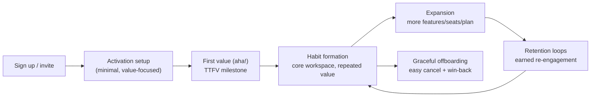

# 18 — SaaS Design

### Onboarding, Retention, and the Product-Led Surface

> *"A SaaS product is not bought once; it is re-bought every day the user logs in. Design is how you win that re-purchase."*

---

**Chapter type:** Phase 4 — Product Surfaces
**DRI:** Product Designer + Frontend Architect (joint)
**Depends on:** [`00-CONSTITUTION.md`](./00-CONSTITUTION.md), [`01`](./01-PROJECT_DISCOVERY.md), [`02`](./02-PRODUCT_STRATEGY.md), [`04`](./04-DESIGN_PHILOSOPHY.md)–[`17`](./17-LANDING_PAGE_DESIGN.md)
**Feeds:** [`16-DASHBOARD_DESIGN.md`](./16-DASHBOARD_DESIGN.md), [`26-USER_EXPERIENCE.md`](./26-USER_EXPERIENCE.md), [`38-AUTHENTICATION.md`](./38-AUTHENTICATION.md)

---

## Table of Contents
1. [Purpose](#1-purpose)
2. [Philosophy](#2-philosophy)
3. [Principles](#3-principles)
4. [Best Practices](#4-best-practices)
5. [Anti-Patterns](#5-anti-patterns)
6. [Real-World Examples](#6-real-world-examples)
7. [Common Mistakes](#7-common-mistakes)
8. [AI Implementation Guidance](#8-ai-implementation-guidance)
9. [Human Review Checklist](#9-human-review-checklist)
10. [Automation Opportunities](#10-automation-opportunities)
11. [References for Further Study](#11-references-for-further-study)
12. [Review Checklist & Measurable Quality Criteria](#12-review-checklist--measurable-quality-criteria)

---

## 1. Purpose

This chapter defines how the studio designs SaaS applications — the logged-in product surfaces where users work repeatedly over months and years. It covers the full lifecycle: **onboarding and activation, the core workspace, navigation at scale, settings/account, billing, empty states, and the retention loops** that keep users coming back. Where [`17`](./17-LANDING_PAGE_DESIGN.md) wins the sign-up, this chapter wins the *second, tenth, and hundredth* session.

SaaS design is uniquely demanding because the product is used habitually: small friction compounds into churn, and small delight compounds into loyalty. It sits at the intersection of dashboards ([`16`](./16-DASHBOARD_DESIGN.md)), forms ([`13`](./13-FORM_DESIGN.md)), the component library ([`14`](./14-COMPONENT_LIBRARY.md)), and UX ([`26`](./26-USER_EXPERIENCE.md)) — applied to the goal of durable, recurring value.

---

## 2. Philosophy

**Time-to-value is the whole game.** A new SaaS user is asking one question: *"Will this make my life better, and how fast?"* Every screen between sign-up and the first real "aha" is a chance to lose them. The studio obsesses over shortening **time-to-first-value (TTFV)** — the moment the user gets the outcome they came for ([`01`](./01-PROJECT_DISCOVERY.md) JTBD). A beautiful product with slow TTFV loses to an ugly one with fast TTFV.

**Design for the returning expert, not just the first-timer — and serve both.** SaaS has a hard dual mandate: be *learnable* for newcomers and *efficient* for power users who live in the tool daily. Onboarding scaffolding that helps on day one becomes friction on day 100. The resolution is progressive: teach, then get out of the way (progressive disclosure, keyboard shortcuts, defaults that adapt). GitHub and Linear excel here (see [`references/`](./references/README.md)).

**Retention is a design outcome, not just a growth tactic.** Habits form through consistent value, low friction, and appropriate re-engagement. Design shapes all three: the faster and more reliably the product delivers value, the stronger the habit. Manipulative retention (roach motels, guilt notifications) is banned (Article III, [`05`](./05-VISUAL_PSYCHOLOGY.md)); *earned* retention is the goal.

**The workspace is a system, not a collection of pages.** A SaaS app is dozens or hundreds of screens that must feel like one coherent product (Article IV, V). This is impossible without the design system (tokens + components, [`14`](./14-COMPONENT_LIBRARY.md)/[`15`](./15-DESIGN_TOKENS.md)) — SaaS is where that investment pays off most.

---

## 3. Principles

### Principle 1 — Minimize time-to-first-value
Design the shortest credible path from sign-up to the user's first real outcome.
> *Rationale (Art. I):* TTFV is the strongest predictor of activation and retention.

### Principle 2 — Onboard by doing, not by touring
Get users to real value through guided action on real (or realistic) data, not passive feature tours/modals.
> *Rationale ([`05`](./05-VISUAL_PSYCHOLOGY.md)):* People learn by doing; tours are skipped and forgotten.

### Principle 3 — Design empty states as onboarding
Every empty state is a teaching + activation moment: explain, show value, offer the first action.
> *Rationale ([`04`](./04-DESIGN_PHILOSOPHY.md) P6):* New accounts are *all* empty states.

### Principle 4 — Progressive disclosure: learnable then efficient
Reveal complexity as needed; add power-user affordances (shortcuts, bulk actions, command palette) for depth.
> *Rationale:* Serves both newcomers and experts without compromising either.

### Principle 5 — Consistent, scalable navigation & IA
A navigation model that holds from 3 features to 300; clear location, search, and structure.
> *Rationale ([`27`](./27-INFORMATION_ARCHITECTURE.md)):* Users must always know where they are and how to get anywhere.

### Principle 6 — Everything from the design system
Every screen composes tokens + library components; no snowflakes across the vast surface.
> *Rationale (Art. IV, V):* Coherence at scale is only possible systematically.

### Principle 7 — Respect the user's data and workflow
Autosave, undo, no data loss, non-destructive defaults, forgiving errors; never interrupt flow needlessly.
> *Rationale (Art. I, III):* Habitual tools must be trustworthy with the user's work.

### Principle 8 — Ethical retention only
Re-engagement, trials, and cancellation must pass the Persuasion Ethics Test; cancellation is as easy as signup.
> *Rationale (Art. III):* Roach motels and guilt loops are banned dark patterns.

### Principle 9 — Multi-tenancy, roles, and states are first-class
Design for teams, permissions/roles, plan tiers, seats, and account states (trial/active/past-due) from the start.
> *Rationale:* SaaS is rarely single-user; retrofitting roles/billing is painful.

---

## 4. Best Practices

### 4.1 The SaaS lifecycle map



### 4.2 Onboarding that activates
- **Reduce setup to the minimum** required to reach first value ([`13`](./13-FORM_DESIGN.md) — ask only what's needed).
- **Seed with sample/real data** so the empty product isn't a void; let users act immediately.
- **Checklists over tours:** a short "get started" checklist (create X, invite Y, connect Z) drives action and shows progress.
- **Contextual hints** at the moment of need, dismissible, never blocking.
- **Celebrate the first win** (subtle, [`24`](./24-MICRO_INTERACTIONS.md)) — mark the aha moment.

### 4.3 Empty states (the most-skipped, highest-leverage screens)
Each empty state includes: a one-line explanation of what goes here, why it's valuable, a **single primary action**, and optionally a sample/template. On-brand copy ([`03`](./03-BRAND_STRATEGY.md), [`25`](./25-COPYWRITING.md)).

### 4.4 Navigation at scale
- **Persistent primary nav** (sidebar/top) with clear sections; current location always evident.
- **Global search + command palette** (⌘K) for power users — jump anywhere/do anything.
- **Breadcrumbs** for deep hierarchies; **URL state** so everything is linkable/shareable ([`31`](./31-NEXTJS_GUIDE.md)).
- Scales via IA ([`27`](./27-INFORMATION_ARCHITECTURE.md)), not by cramming more into one menu.

### 4.5 The account/settings/billing surface
- Predictable structure (profile, team/members, roles, billing, integrations, security, notifications).
- **Roles & permissions** clearly shown; destructive/role changes guarded ([`12`](./12-BUTTON_DESIGN.md), Art. III).
- **Billing:** transparent plan/usage, clear upgrade/downgrade, honest proration, **easy cancellation** (no roach motel).
- Account states surfaced kindly (trial ending, payment failed → clear recovery, not lockout-by-surprise).

### 4.6 Power-user affordances
Keyboard shortcuts (discoverable via a help overlay), bulk actions, command palette, saved views/filters, sensible adaptive defaults. These are what make daily users *love* the tool (see Raycast/Linear/GitHub in [`references/`](./references/README.md)).

### 4.7 Performance & reliability as retention
Fast navigation (optimistic UI, prefetch, [`35`](./35-PERFORMANCE.md)), reliable autosave, graceful error/offline handling ([`57` future]). A daily tool that's slow or loses work churns users regardless of features.

### 4.8 Ethical retention loops
Notifications/emails that provide real value (not guilt); trials that convert on merit; **cancellation as easy as signup** with an honest win-back offer. Run every re-engagement mechanic through the Persuasion Ethics Test ([`05`](./05-VISUAL_PSYCHOLOGY.md)).

---

## 5. Anti-Patterns

| Anti-pattern | Why it fails | Principle/Article |
| --- | --- | --- |
| **Long setup before any value** | High drop-off before activation. | P1 |
| **Feature tours/modals as onboarding** | Skipped, forgotten; no real learning. | P2 |
| **Blank empty states** (void on first login) | Confusion; no activation. | P3 |
| **Everything exposed at once** | Overwhelms newcomers (Hick's Law). | P4 |
| **No power-user affordances** | Loses daily/expert users to friction. | P4 |
| **Menu cramming** instead of IA | Unnavigable at scale. | P5 |
| **Snowflake screens** off-system | Incoherence across the app. | P6 |
| **Data loss / no undo / no autosave** | Destroys trust in a habitual tool. | P7, Art. I |
| **Roach-motel cancellation / guilt loops** | Dark patterns; churn + reputation damage. | P8, Art. III |
| **Single-user assumptions** (no roles/teams) | Painful, costly retrofits. | P9 |

---

## 6. Real-World Examples

### Example A — Cutting TTFV by seeding data
A project tool dropped new users into an empty workspace with a 6-step setup wizard; activation was poor. Redesign (Principles 1–3): reduce required setup to email+workspace name, **seed a sample project**, and replace the wizard with a 3-item "get started" checklist embedded in the real UI. Users hit first value in minutes instead of abandoning the wizard. *Activation is a design problem.*

### Example B — Command palette for the daily expert
A SaaS app's power users complained navigation was slow for repetitive tasks. Adding a **⌘K command palette** (jump to any entity, run any action) — discoverable via a hint and the help overlay — made experts dramatically faster while newcomers kept the visual nav. *Progressive disclosure serves both audiences (Principle 4; cf. Linear/Raycast in [`references/`](./references/README.md)).*

### Example C — Ethical cancellation that improved retention
A company had a deliberately painful cancel flow (hidden, multi-step, guilt-laden). Churn "looked" low but refund requests, chargebacks, and negative reviews were high. Replacing it with **one-click cancel + an honest win-back offer** (pause option, downgrade, genuine discount) *reduced* true churn (some chose pause/downgrade) and repaired reputation. *Earned retention beats trapped retention (Principle 8, Article III).*

---

## 7. Common Mistakes

- **Optimizing the marketing site but neglecting onboarding** — the sign-up is worthless without activation.
- **Designing only the full-of-data state**, so empty/new-account screens ship broken (Principle 3).
- **Passive tours** instead of learn-by-doing.
- **Ignoring power users** until they churn to a faster competitor.
- **Retrofitting teams/roles/billing** after launching single-user.
- **Manipulative retention** that inflates short-term metrics and destroys trust.
- **Inconsistent screens** because the design system wasn't enforced across a large surface.
- **Slow navigation / lost work** — killing habit formation.

---

## 8. AI Implementation Guidance

### 8.1 Where agents help
- **Run the "Any References?" protocol** ([`51`](./51-REFERENCE_ANALYSIS.md)) — SaaS patterns from Linear/GitHub/ASKTC etc. are in the KB.
- **Generate onboarding flows, checklists, and empty states** (with primary actions + on-brand copy).
- **Scaffold navigation/IA, settings/billing, roles/permissions** from the design system.
- **Build command palettes, keyboard shortcuts, optimistic-UI** patterns.
- **Audit** for TTFV blockers, blank empty states, missing power-user affordances, dark-pattern retention, and off-system screens.

### 8.2 Hard rules (Art. I, III, IV)
- Every generated flow **minimizes TTFV** and states the activation milestone it targets.
- **Every screen has designed empty/loading/error states**; empty states include a primary action.
- **Cancellation is as easy as signup**; the agent refuses roach-motel/guilt-loop retention and runs the Persuasion Ethics Test on re-engagement.
- All screens **compose library components/tokens** — no snowflakes.
- **Roles, plan tiers, and account states** are considered from the start.

### 8.3 Prompt example — design onboarding
```
ROLE: Product Designer, bound by 00-CONSTITUTION + 18.
PRECONDITION: run the 51 references protocol; cite SaaS exemplars used.
INPUT: product = <x>; core JTBD/first value = <the aha>; personas = <newcomer + power user>.
TASK:
  1. Map the shortest credible path to first value; name the TTFV milestone.
  2. Design activation: minimal setup, seeded sample data, a 3-item get-started checklist
     (learn-by-doing, not a tour).
  3. Design the key empty states (each: explanation + value + one primary action).
  4. Add progressive power-user affordances (⌘K palette, shortcuts) discoverable via help.
  5. Use library components/tokens only.
OUTPUT: flow + screens (TSX) + copy + state matrix + a11y/perf self-check.
```

### 8.4 Prompt example — audit
```
TASK: Audit the SaaS app for: TTFV blockers (long setup before value), blank empty states,
tour-based onboarding, missing power-user affordances, off-system screens, dark-pattern
retention/cancellation, and missing roles/billing/account states. Output {location, issue, fix}.
Flag any dark pattern as a blocker.
```

---

## 9. Human Review Checklist

- [ ] The **shortest path to first value** is designed; TTFV milestone named.
- [ ] Onboarding is **learn-by-doing** (checklist + seeded data), not a passive tour.
- [ ] Every **empty state** teaches + offers a primary action.
- [ ] **Progressive disclosure**: learnable for newcomers, efficient for power users (shortcuts/⌘K).
- [ ] **Navigation/IA scales**; location always clear; state in the URL.
- [ ] Every screen uses **library components/tokens** (no snowflakes).
- [ ] **Data safety**: autosave, undo, no loss, forgiving errors.
- [ ] **Settings/billing** transparent; **cancellation as easy as signup**; retention passes the Ethics Test.
- [ ] **Roles/permissions, plan tiers, account states** designed.
- [ ] **Performance** (fast nav, optimistic UI) supports habit formation.

---

## 10. Automation Opportunities

| Task | Automation |
| --- | --- |
| TTFV tracking | Funnel analytics from signup → first-value milestone; alert on drop-off. |
| Empty-state coverage | Storybook/CI requiring empty+error states per view. |
| Dark-pattern audit | LLM scan of onboarding/cancellation/retention vs. the [`05`](./05-VISUAL_PSYCHOLOGY.md) catalog. |
| Cancellation-parity check | Test asserting cancel is ≤ the steps of signup. |
| Design-system conformance | Lint banning off-system components across app screens. |
| Role/permission tests | Automated checks that UI respects roles/plan gating. |
| Perf budgets | Route-level performance budgets ([`35`](./35-PERFORMANCE.md)). |

---

## 11. References for Further Study
- **Activation & onboarding:** the "time-to-value" / product-led growth literature; onboarding-checklist and "aha moment" practice.
- **Retention & habits:** the Hook Model (Nir Eyal) — applied *ethically*; retention/engagement analytics practice.
- **Product-led SaaS patterns:** public SaaS design systems and product teardowns (study the KB: Linear, GitHub, ASKTC, Notion, Figma).
- **Ethics:** the deceptive-patterns catalog on subscriptions/cancellation ([`05`](./05-VISUAL_PSYCHOLOGY.md)); relevant consumer-protection "click-to-cancel" norms.
- **Cross-references:** [`13-FORM_DESIGN.md`](./13-FORM_DESIGN.md), [`16-DASHBOARD_DESIGN.md`](./16-DASHBOARD_DESIGN.md), [`26-USER_EXPERIENCE.md`](./26-USER_EXPERIENCE.md), [`27-INFORMATION_ARCHITECTURE.md`](./27-INFORMATION_ARCHITECTURE.md), [`38-AUTHENTICATION.md`](./38-AUTHENTICATION.md), [`references/`](./references/README.md).

---

## 12. Review Checklist & Measurable Quality Criteria

| Criterion | Target |
| --- | --- |
| Views with designed empty/loading/error states | 100% |
| Onboarding drives to a named first-value milestone | Yes |
| Cancellation ease vs. signup | ≤ signup steps (floor) |
| Dark-pattern retention mechanics | 0 (Art. III) |
| Screens using the design system | ≥ 95% |
| Time-to-first-value | ↓ trend |
| Activation rate (signup → first value) | ↑ trend |
| Week-4 / month-3 retention | ↑ trend |

---

*End of `18-SAAS_DESIGN.md`.*
