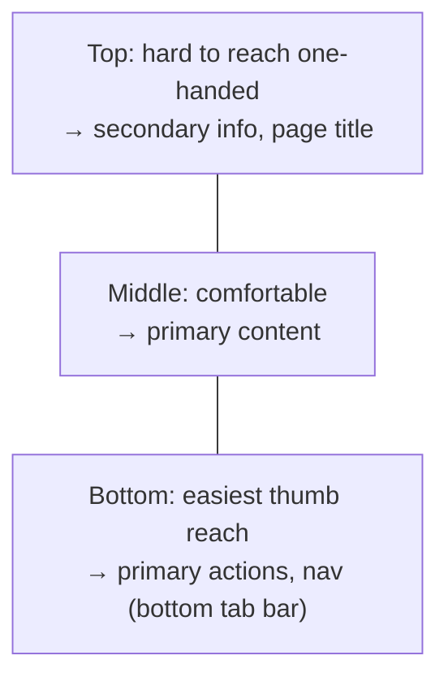

# 20 — Mobile-First Design

### Designing for the Constraint, Enhancing for the Space

> *"Design for the phone in a distracted hand on a slow network, and everything else gets easier. Design for the 27-inch monitor first, and the phone gets the scraps."*

---

**Chapter type:** Phase 4 — Product Surfaces
**DRI:** Product Designer + Frontend Architect (joint)
**Depends on:** [`00-CONSTITUTION.md`](./00-CONSTITUTION.md), [`04`](./04-DESIGN_PHILOSOPHY.md), [`08`](./08-SPACING_SYSTEM.md)–[`10`](./10-GRID_SYSTEM.md), [`22`](./22-ACCESSIBILITY.md)
**Feeds:** [`21-RESPONSIVE_DESIGN.md`](./21-RESPONSIVE_DESIGN.md), [`35-PERFORMANCE.md`](./35-PERFORMANCE.md)

---

## Table of Contents
1. [Purpose](#1-purpose)
2. [Philosophy](#2-philosophy)
3. [Principles](#3-principles)
4. [Best Practices](#4-best-practices)
5. [Anti-Patterns](#5-anti-patterns)
6. [Real-World Examples](#6-real-world-examples)
7. [Common Mistakes](#7-common-mistakes)
8. [AI Implementation Guidance](#8-ai-implementation-guidance)
9. [Human Review Checklist](#9-human-review-checklist)
10. [Automation Opportunities](#10-automation-opportunities)
11. [References for Further Study](#11-references-for-further-study)
12. [Review Checklist & Measurable Quality Criteria](#12-review-checklist--measurable-quality-criteria)

---

## 1. Purpose

This chapter establishes **mobile-first** as the studio's default design and build approach: start from the smallest, most constrained context (a phone, a distracted user, a slow network, a thumb) and *progressively enhance* toward larger screens and more capable devices. It complements [`21-RESPONSIVE_DESIGN.md`](./21-RESPONSIVE_DESIGN.md) (which covers adapting across the full range) by focusing on *why we start small and how*.

Mobile-first is not "make it work on phones too." It is a discipline that forces prioritization (the small screen has no room for the non-essential), improves performance (you add weight deliberately rather than trimming a bloated desktop build), and matches reality: for most products, mobile is the majority of traffic. Getting mobile right is getting the product right.

---

## 2. Philosophy

**Constraints clarify.** The phone screen is a forcing function: it physically cannot hold clutter, so it makes you decide what actually matters ([`04`](./04-DESIGN_PHILOSOPHY.md) P1). When you design mobile-first, priority is not optional — the single most important action, the essential content, the core flow must be identified and everything else deferred or removed. That clarity then *improves* the desktop design too. Designing desktop-first and "shrinking down" produces a phone experience that is a compromised afterthought.

**Progressive enhancement, not graceful degradation.** We build a solid, functional core that works on the least capable context, then *layer on* enhancements (more columns, richer interactions, hover states, larger media) where the device and viewport allow. This is more robust than building a rich experience and hoping it degrades — because the baseline is guaranteed to work (Article II, IX).

**The mobile context is hostile, and we respect that.** Mobile users are often distracted, one-handed, on flaky networks, in bright sunlight, in a hurry. This shapes everything: bigger touch targets, thumb-reachable actions, high contrast, minimal typing, tolerance for interruption, and ruthless performance. Designing for the *ideal* context (focused user, fast wifi, mouse) is designing for a minority.

**Performance is a mobile-first concern above all.** Mobile devices are slower and networks less reliable; the performance budget ([`35`](./35-PERFORMANCE.md)) is set with the low-end phone in mind. Mobile-first naturally produces leaner experiences because you add weight consciously rather than inheriting a heavy desktop bundle.

---

## 3. Principles

### Principle 1 — Design the smallest screen first
Start layouts, content, and flows at mobile width; enhance upward.
> *Rationale ([`04`](./04-DESIGN_PHILOSOPHY.md)):* Forces prioritization; guarantees a working baseline.

### Principle 2 — Prioritize ruthlessly: one primary action per view
The small screen has room for the essential only; defer/hide the rest (progressive disclosure).
> *Rationale ([`05`](./05-VISUAL_PSYCHOLOGY.md) Hick):* Focus is mandatory when space is scarce.

### Principle 3 — Thumb-first ergonomics
Place primary actions in the thumb-reachable zone; respect one-handed use.
> *Rationale (Fitts + ergonomics):* Most phone use is one-handed; reach matters.

### Principle 4 — Touch targets ≥ 44–48px with spacing
Adequate size and separation for imprecise fingers.
> *Rationale (Art. III, [`08`](./08-SPACING_SYSTEM.md), [`22`](./22-ACCESSIBILITY.md)):* Small/crowded targets fail motor accuracy.

### Principle 5 — Minimize input; leverage the platform
Fewer fields, correct input types/`inputmode`, autofill, native pickers, ≥16px inputs (no iOS zoom).
> *Rationale ([`13`](./13-FORM_DESIGN.md)):* Typing on mobile is costly; the platform can help.

### Principle 6 — Build up with progressive enhancement
Solid core first; add columns, hover, richer media as viewport/capability grows.
> *Rationale (Art. II, IX):* Guaranteed baseline + layered richness.

### Principle 7 — Performance budget set for the low-end device
Lean payloads, responsive images, minimal JS, test on real/throttled devices.
> *Rationale ([`35`](./35-PERFORMANCE.md)):* Mobile is where perf hurts most.

### Principle 8 — Respect the physical/contextual realities
High contrast (sunlight), resilience to interruption, offline tolerance, safe-area insets (notches).
> *Rationale (Art. I):* Design for the real environment, not the studio.

---

## 4. Best Practices

### 4.1 Start mobile, enhance up (CSS)
```css
/* Base = mobile (no media query). Enhance upward. */
.grid { display: grid; grid-template-columns: 1fr; gap: var(--space-4); }
@media (min-width: 48rem) { .grid { grid-template-columns: repeat(2, 1fr); } }
@media (min-width: 64rem) { .grid { grid-template-columns: repeat(4, 1fr); } }
```
> Mobile-first media queries use `min-width` (add as you grow), not `max-width` (subtract from desktop). Prefer intrinsic layout ([`09`](./09-LAYOUT_SYSTEM.md)/[`10`](./10-GRID_SYSTEM.md)) to reduce breakpoints entirely.

### 4.2 The thumb zone

Put primary CTAs and navigation within bottom/thumb reach (see DoorDash/Uber Eats bottom tabs in [`references/`](./references/README.md)). Avoid critical actions stranded in top corners.

### 4.3 Navigation patterns for mobile
- **Bottom tab bar** for 3–5 top destinations (thumb-reachable, always visible).
- **Hamburger/drawer** only for secondary/overflow (it hides things — use judiciously).
- Sticky primary CTA where appropriate (e.g. "Add to cart"), unobtrusive.

### 4.4 Touch, gesture, and feedback
- Targets ≥44–48px with spacing; generous hit areas even if the icon is small ([`12`](./12-BUTTON_DESIGN.md)).
- Support expected gestures (swipe, pull-to-refresh) **with accessible alternatives** ([`22`](./22-ACCESSIBILITY.md)).
- Immediate touch feedback (active states); avoid hover-dependent functionality (there is no hover on touch).

### 4.5 Forms on mobile ([`13`](./13-FORM_DESIGN.md))
Minimal fields; correct `type`/`inputmode`/`autocomplete`; ≥16px inputs (prevent iOS zoom); native date/select pickers; single-column; big submit in thumb reach; never block paste (OTP/passwords).

### 4.6 Media & performance ([`35`](./35-PERFORMANCE.md))
Responsive images (`srcset`/`sizes`, AVIF/WebP), lazy-load below fold, reserve space (`aspect-ratio`) to prevent CLS, minimal JS, test on throttled 3G/4G and low-end devices. The mobile bundle is the budget.

### 4.7 Handle the physical device
- Respect **safe-area insets** (`env(safe-area-inset-*)`) for notches/home indicators.
- High contrast for outdoor readability ([`06`](./06-COLOR_SYSTEM.md)).
- Support both orientations gracefully; don't lock unless essential.
- Design for interruption (save state; resume where they left off).

### 4.8 Test on real devices
Emulators lie about performance and touch. Test on actual low/mid-range phones, real networks, one-handed, in varied lighting.

---

## 5. Anti-Patterns

| Anti-pattern | Why it fails | Principle/Article |
| --- | --- | --- |
| **Desktop-first, shrink later** | Mobile becomes a compromised afterthought. | P1 |
| **Everything crammed onto mobile** | No prioritization; overwhelming. | P2 |
| **Critical actions in top corners** | Unreachable one-handed. | P3 |
| **Tiny/crowded touch targets** | Mis-taps; fails motor accuracy. | P4, Art. III |
| **Hover-dependent functionality** | No hover on touch; features unreachable. | P4/P6 |
| **Huge forms, wrong input types** | Painful typing; abandonment. | P5 |
| **`user-scalable=no` / <16px inputs** | Blocks zoom; iOS zoom jank; excludes low-vision. | P5, Art. III |
| **Heavy desktop bundle on mobile** | Slow, janky on real networks/devices. | P7 |
| **Ignoring safe-area insets** | Content clipped by notches/indicators. | P8 |
| **Only emulator testing** | Misses real perf/touch problems. | 4.8 |

---

## 6. Real-World Examples

### Example A — Prioritization forced by the phone
A dashboard designed desktop-first crammed 12 widgets; on mobile it was an endless unusable scroll. Redesigning **mobile-first** forced the question "what does the user need *right now*?" → one hero status + a drill-down, everything else behind a menu. The discipline improved the *desktop* version too (clearer hierarchy). *Constraints clarified the whole product (Principle 1–2; cf. [`16`](./16-DASHBOARD_DESIGN.md)).*

### Example B — Moving the CTA into the thumb zone
An e-commerce PDP had "Add to cart" at the top of a long mobile page; users lost it while scrolling images/specs. Adding a **sticky bottom "Add to cart"** in the thumb zone (with price) lifted mobile add-to-cart rate notably. *Ergonomics is conversion (Principle 3; cf. [`19`](./19-ECOMMERCE_DESIGN.md)).*

### Example C — 16px inputs killed the checkout jank
A checkout used 14px inputs; every field tap triggered an iOS auto-zoom, then a reflow — jarring and error-prone on mobile. Bumping inputs to **≥16px** (plus correct `inputmode`/`autocomplete`) eliminated the zoom and sped completion. *A one-line fix rooted in mobile reality (Principle 5).*

---

## 7. Common Mistakes

- **Designing/prototyping only at desktop width** and bolting on mobile at the end.
- **Not identifying the single primary action** per mobile view.
- **Relying on hover** for menus/tooltips/functionality.
- **Small inputs (<16px)** and wrong input types causing zoom/typing pain.
- **Forgetting thumb reach** — primary actions stranded top-of-screen.
- **Shipping the desktop JS/image payload** to phones.
- **Ignoring safe areas/orientation/interruption.**
- **Testing only in a desktop browser's device emulator.**

---

## 8. AI Implementation Guidance

### 8.1 Where agents help
- **Author mobile-first CSS** (`min-width` enhancement / intrinsic layout) and thumb-zone layouts.
- **Generate mobile nav** (bottom tabs), forms (correct types, ≥16px, autofill), and sticky CTAs.
- **Audit** for desktop-first patterns, tiny targets, hover-dependence, `user-scalable=no`, <16px inputs, missing safe-area handling, and heavy mobile payloads.
- **Set + check performance budgets** for low-end devices ([`35`](./35-PERFORMANCE.md)).

### 8.2 Hard rules (Art. II, III)
- Design/build **mobile-first**: base styles are mobile; enhancements use `min-width` (or intrinsic layout). No desktop-first shrink.
- **Touch targets ≥44px**; primary actions **thumb-reachable**; no **hover-dependent** functionality.
- Inputs **≥16px** with correct `inputmode`/`autocomplete`; **never** emit `user-scalable=no`.
- **Performance budget targets the low-end device**; responsive images; no desktop-only payload on mobile.
- Respect **safe-area insets** and interruption/resume.

### 8.3 Prompt example — build mobile-first
```
ROLE: Product Designer + Frontend, bound by 00-CONSTITUTION + 20.
TASK: Design <screen> mobile-first, then enhance to tablet/desktop.
CONSTRAINTS:
  - Base = mobile; enhance with min-width or intrinsic layout (prefer 09/10 primitives).
  - One primary action per view, in the thumb zone; bottom-tab nav if 3–5 destinations.
  - Targets ≥44px; no hover-dependent features; inputs ≥16px + correct types/autocomplete.
  - Respect safe-area insets; responsive images; low-end performance budget.
OUTPUT: markup + mobile-first CSS + a note on what's enhanced at each breakpoint + perf/a11y self-check.
```

### 8.4 Prompt example — audit
```
TASK: Audit for desktop-first CSS (max-width cascades), touch targets <44px, hover-dependent
functionality, user-scalable=no, inputs <16px, primary actions outside thumb reach, missing
safe-area handling, and desktop-weight payloads on mobile. Output {file:line, issue, fix}.
```

---

## 9. Human Review Checklist

- [ ] Designed/built **mobile-first** (base = mobile; `min-width` enhancement or intrinsic layout).
- [ ] **One clear primary action** per mobile view; non-essentials deferred.
- [ ] Primary actions/nav are **thumb-reachable**; bottom-tab nav where appropriate.
- [ ] **Touch targets ≥ 44–48px** with adequate spacing.
- [ ] **No hover-dependent** functionality; touch feedback present.
- [ ] Forms: **≥16px inputs**, correct types/autocomplete, minimal fields, zoom not disabled.
- [ ] **Safe-area insets**, orientation, and interruption/resume handled.
- [ ] **Performance budget** met on low-end device/throttled network; responsive images; no CLS.
- [ ] Tested on **real devices**, one-handed.
- [ ] Enhancements to larger screens are **additive**, not the starting point.

---

## 10. Automation Opportunities

| Task | Automation |
| --- | --- |
| Desktop-first lint | Flag `max-width` cascades / desktop-first patterns. |
| Target-size audit | Automated ≥44px check on interactive elements ([`22`](./22-ACCESSIBILITY.md)). |
| Zoom/input lint | Flag `user-scalable=no` and `<16px` inputs. |
| Hover-dependence check | Detect functionality gated only behind `:hover`. |
| Mobile perf budgets | Lighthouse mobile CI with throttling ([`35`](./35-PERFORMANCE.md)). |
| Responsive-image check | Ensure `srcset`/`sizes` + aspect-ratio on images. |
| Device-lab testing | Automated real-device (BrowserStack-style) runs. |

---

## 11. References for Further Study
- **Mobile-first origin:** Luke Wroblewski, *Mobile First*.
- **Progressive enhancement:** the foundational PE literature and resilient-web-design practice (Jeremy Keith).
- **Touch ergonomics:** thumb-zone research (Steven Hoober) and platform HIG touch-target guidance.
- **Performance on mobile:** web.dev mobile performance + Core Web Vitals ([`35`](./35-PERFORMANCE.md)).
- **Cross-references:** [`08-SPACING_SYSTEM.md`](./08-SPACING_SYSTEM.md), [`09-LAYOUT_SYSTEM.md`](./09-LAYOUT_SYSTEM.md), [`10-GRID_SYSTEM.md`](./10-GRID_SYSTEM.md), [`13-FORM_DESIGN.md`](./13-FORM_DESIGN.md), [`21-RESPONSIVE_DESIGN.md`](./21-RESPONSIVE_DESIGN.md), [`22-ACCESSIBILITY.md`](./22-ACCESSIBILITY.md), [`35-PERFORMANCE.md`](./35-PERFORMANCE.md).

---

## 12. Review Checklist & Measurable Quality Criteria

| Criterion | Target |
| --- | --- |
| Designed mobile-first (base = mobile) | 100% |
| Touch targets ≥ 44px | 100% (floor) |
| Hover-dependent functionality | 0 |
| Inputs ≥16px / zoom enabled | 100% (floor) |
| Mobile LCP (low-end/throttled) | ≤ 2.5s |
| Primary actions in thumb zone | 100% |
| Tested on real devices | Yes |
| Mobile conversion/usability | ↑ trend |

---

*End of `20-MOBILE_FIRST.md`.*
