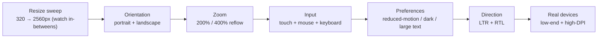

# 21 — Responsive Design

### One Codebase, Every Screen — Fluidly

> *"There is no 'mobile version' and 'desktop version.' There is one experience that adapts, gracefully, to whatever it finds itself on."*

---

**Chapter type:** Phase 4 — Product Surfaces
**DRI:** Frontend Architect + Senior UI Designer (joint)
**Depends on:** [`00-CONSTITUTION.md`](./00-CONSTITUTION.md), [`08`](./08-SPACING_SYSTEM.md)–[`10`](./10-GRID_SYSTEM.md), [`20-MOBILE_FIRST.md`](./20-MOBILE_FIRST.md), [`22`](./22-ACCESSIBILITY.md)
**Feeds:** all product surfaces (16–19), [`33-TAILWIND_GUIDE.md`](./33-TAILWIND_GUIDE.md), [`35-PERFORMANCE.md`](./35-PERFORMANCE.md)

---

## Table of Contents
1. [Purpose](#1-purpose)
2. [Philosophy](#2-philosophy)
3. [Principles](#3-principles)
4. [Best Practices](#4-best-practices)
5. [Anti-Patterns](#5-anti-patterns)
6. [Real-World Examples](#6-real-world-examples)
7. [Common Mistakes](#7-common-mistakes)
8. [AI Implementation Guidance](#8-ai-implementation-guidance)
9. [Human Review Checklist](#9-human-review-checklist)
10. [Automation Opportunities](#10-automation-opportunities)
11. [References for Further Study](#11-references-for-further-study)
12. [Review Checklist & Measurable Quality Criteria](#12-review-checklist--measurable-quality-criteria)

---

## 1. Purpose

This chapter defines how the studio builds **a single experience that adapts fluidly across the entire continuum of screens** — from a small phone to an ultrawide monitor, across orientations, input types (touch/mouse/keyboard), pixel densities, and user preferences (font size, reduced motion, color scheme). Where [`20-MOBILE_FIRST.md`](./20-MOBILE_FIRST.md) covers *starting small*, this chapter covers *adapting across the full range* — and doing it with modern, intrinsic CSS rather than a pile of device-specific hacks.

Responsive design is the technical realization of the studio's promise that quality is universal: the same care, the same accessibility, the same brand, on every device a real person might use. It ties the layout ([`09`](./09-LAYOUT_SYSTEM.md)), grid ([`10`](./10-GRID_SYSTEM.md)), and spacing ([`08`](./08-SPACING_SYSTEM.md)) systems into one adaptive whole.

---

## 2. Philosophy

**There is one experience, not many versions.** We reject the "m.dot / separate mobile site" and "desktop vs. mobile design" mental model. There is *one* responsive product that reshapes itself. This keeps content, features, and quality consistent everywhere and avoids the maintenance nightmare of divergent versions (Article IV, VIII).

**Adapt to content and container, not just to device widths.** The modern responsive toolkit (intrinsic grids, `clamp()`, container queries, logical properties) lets layouts respond to how much space *a component actually has* and how much *content* it holds — not to a guessed list of device sizes ([`09`](./09-LAYOUT_SYSTEM.md), [`10`](./10-GRID_SYSTEM.md)). A component should look right wherever it's placed, whatever it contains. This is far more robust than viewport-breakpoint micromanagement.

**Responsiveness is more than width.** True responsiveness honors the *whole* range of human/device variation: **input** (touch vs. pointer — `hover`/`pointer` media queries), **preferences** (`prefers-reduced-motion`, `prefers-color-scheme`, font-size/zoom), **density** (retina images), **orientation**, and **capability**. Width is just the most obvious axis ([`22`](./22-ACCESSIBILITY.md)).

**Test the in-between, not just the famous sizes.** Designs break not at 375/768/1440 (the sizes everyone checks) but at 600 and 900 and 1100 — the gaps between breakpoints, and at extreme zoom. A responsive design is only proven when it holds across the *continuum*, including 200–400% zoom (Article III).

---

## 3. Principles

### Principle 1 — One adaptive experience; content parity everywhere
Same content and core features across screens; no crippled "mobile version."
> *Rationale (Art. I, IV):* Users expect the full product on any device.

### Principle 2 — Mobile-first, enhance upward
Base styles are mobile; add capability with `min-width`/intrinsic layout ([`20`](./20-MOBILE_FIRST.md)).
> *Rationale:* Guaranteed baseline + deliberate enhancement.

### Principle 3 — Prefer intrinsic/fluid over fixed breakpoints
Use `auto-fit/minmax`, `clamp()`, `flex-wrap`, container queries to reduce breakpoint count.
> *Rationale ([`09`](./09-LAYOUT_SYSTEM.md), [`10`](./10-GRID_SYSTEM.md)):* Robust across the continuum, less brittle.

### Principle 4 — Breakpoints are content-driven and few
Add a breakpoint where the design breaks, not per device; keep the set small and named.
> *Rationale ([`10`](./10-GRID_SYSTEM.md)):* Fewer, meaningful breakpoints = maintainable.

### Principle 5 — Respond to input, preference, and capability, not just width
Handle touch vs. pointer, reduced motion, color scheme, font-size/zoom, density, orientation.
> *Rationale (Art. III, [`22`](./22-ACCESSIBILITY.md)):* Real variation exceeds screen width.

### Principle 6 — Fluid type & space; cap the measure
Scale with `clamp()`; constrain reading measure; cap content width on large screens ([`07`](./07-TYPOGRAPHY_SYSTEM.md), [`10`](./10-GRID_SYSTEM.md)).
> *Rationale:* Readability across the range; no sprawl on ultrawide.

### Principle 7 — Responsive media & performance
Responsive images (`srcset`/`sizes`), art direction (`<picture>`), density-aware; reserve space (no CLS).
> *Rationale ([`35`](./35-PERFORMANCE.md)):* Don't ship desktop images to phones; keep it fast + stable.

### Principle 8 — Test the whole continuum + zoom + RTL
Verify in-between widths, both orientations, 200–400% zoom, and RTL (logical properties).
> *Rationale (Art. III):* Breakage hides between the famous sizes.

---

## 4. Best Practices

### 4.1 The modern responsive toolkit
```css
/* Intrinsic grid — adapts with NO breakpoints */
.cards { display: grid; gap: var(--space-5);
  grid-template-columns: repeat(auto-fit, minmax(min(18rem, 100%), 1fr)); }

/* Fluid type & space with clamp() */
.title { font-size: clamp(1.75rem, 4vw + 1rem, 3rem); }
.section { padding-block: clamp(var(--space-6), 8vw, var(--space-9)); }

/* Container queries — component responds to ITS space, not the viewport */
.card-wrap { container-type: inline-size; }
@container (min-width: 30rem) { .card { grid-template-columns: auto 1fr; } }

/* Logical properties — RTL-safe */
.panel { padding-inline: var(--space-5); margin-block-start: var(--space-4); }
```

### 4.2 Respond to more than width
```css
/* Input type: only give hover affordances to real pointers */
@media (hover: hover) and (pointer: fine) { .card:hover { box-shadow: var(--elevation-2); } }
/* Coarse pointers (touch) get bigger targets */
@media (pointer: coarse) { .btn { min-height: 3rem; } }

/* User preferences */
@media (prefers-reduced-motion: reduce) { * { animation: none !important; transition: none !important; } }
@media (prefers-color-scheme: dark) { :root { /* dark tokens */ } }
```

### 4.3 Named, content-driven breakpoints (when you do need them)
Reuse the system's small set (`sm 40rem / md 48rem / lg 64rem / xl 80rem / 2xl 96rem`, [`10`](./10-GRID_SYSTEM.md)); add one only where the layout genuinely breaks. Prefer intrinsic layout first.

### 4.4 Responsive navigation
Transform, don't hide: bottom-tabs/compact nav on mobile → full nav on desktop; disclosure that's discoverable on all inputs. Avoid hamburger-only on desktop where space allows ([`20`](./20-MOBILE_FIRST.md)).

### 4.5 Responsive tables & complex components
Big data tables are the classic hard case. Options: horizontal scroll with a sticky first column; "cards on mobile, table on desktop" transform; prioritized-column hiding with a details expander; container-query-driven reflow. Never just shrink text to 8px.

### 4.6 Responsive images ([`35`](./35-PERFORMANCE.md))
```html

```
Use `<picture>` for art direction (different crop on mobile). Always set `width`/`height` or `aspect-ratio` to prevent CLS.

### 4.7 Handle zoom, font-size, and RTL
- Use `rem` and support **200–400% zoom / reflow** (WCAG 1.4.10, [`22`](./22-ACCESSIBILITY.md)); never disable zoom.
- Respect user font-size settings; test enlarged text.
- Use **logical properties** so RTL mirrors for free ([`09`](./09-LAYOUT_SYSTEM.md)).

### 4.8 Test across the continuum


---

## 5. Anti-Patterns

| Anti-pattern | Why it fails | Principle/Article |
| --- | --- | --- |
| **Separate "mobile version"/m.dot** | Divergent, crippled, unmaintainable. | P1 |
| **Content/feature disparity by device** | Users can't do on phone what they can on desktop. | P1 |
| **Device-specific breakpoints** | Ages instantly; misses in-betweens. | P4 |
| **Breakpoint sprawl** | Brittle; contradictory rules. | P3, P4 |
| **Width-only thinking** | Ignores input/preference/zoom/density. | P5 |
| **Hover affordances on touch** | Unreachable on touch devices. | P5 |
| **Fixed px everywhere / zoom disabled** | Breaks user font-size/zoom; excludes low-vision. | P6, Art. III |
| **Desktop images on mobile** | Slow; wasteful; CLS. | P7 |
| **Shrinking tables to unreadable text** | Illegible; bad UX. | 4.5 |
| **Testing only 375/768/1440** | Breaks in the gaps + at zoom. | P8 |
| **`left/right` (physical) props** | Breaks RTL. | P8 |

---

## 6. Real-World Examples

### Example A — Container queries fixed a reused component
A "media card" looked right in the main column but broke in the narrow sidebar (text cramped, image squashed) — because it responded to the *viewport*, not its own space. Switching to **container queries** made the card adapt to whatever container it sat in; it now works in the grid, the sidebar, and a modal without special-casing. *Components should respond to their space (Principle 3; cf. [`09`](./09-LAYOUT_SYSTEM.md)).*

### Example B — Killing breakpoint sprawl with intrinsic layout
A gallery had five media queries and still looked awkward at ~900px. Replacing it with a single `auto-fit/minmax` grid + `clamp()` spacing removed all five breakpoints and worked at *every* width, including the previously-broken in-betweens. Maintenance and bugs dropped. *(Principles 3–4.)*

### Example C — The zoom failure nobody tested
A "responsive" app passed all device checks but broke badly at 200% browser zoom — fixed-height headers clipped text, a menu overlapped content — locking out low-vision users (a WCAG AA failure, Article III). Adding **reflow testing at 200–400% zoom** to the review process (and fixing fixed heights → intrinsic) closed a real accessibility gap. *Responsiveness includes zoom (Principle 8).*

---

## 7. Common Mistakes

- **Thinking in two versions** (mobile/desktop) instead of one adaptive experience.
- **Removing content/features** on small screens.
- **Chasing device widths** instead of content-driven breakpoints.
- **Only testing the famous sizes**, missing in-betweens and zoom.
- **Width-only responsiveness** — ignoring hover/pointer, reduced motion, color scheme, density.
- **Fixed px + disabled zoom**, breaking user preferences.
- **Serving one big image to all** devices.
- **Physical (`left/right`) properties** that break RTL.

---

## 8. AI Implementation Guidance

### 8.1 Where agents help
- **Generate intrinsic/fluid layouts** (auto-fit grids, `clamp()`, container queries, logical props) minimizing breakpoints.
- **Add preference/input responsiveness** (`prefers-reduced-motion`/`-color-scheme`, `hover`/`pointer`).
- **Produce responsive images** (`srcset`/`sizes`/`<picture>` + dimensions).
- **Refactor** breakpoint sprawl and device-specific media queries into intrinsic layout.
- **Audit** across the continuum + zoom + RTL + input types.

### 8.2 Hard rules (Art. III, IV)
- Build **one adaptive experience** with **content parity**; no separate mobile version, no feature stripping by device.
- **Mobile-first + intrinsic layout first**; breakpoints only where the design breaks, few and named.
- Respond to **preferences and input** (reduced motion, color scheme, hover/pointer), not just width.
- **`rem` + zoom support to 200–400%**; never disable zoom; **logical properties** (RTL-safe).
- **Responsive images** with dimensions (no CLS); no desktop payload on mobile.

### 8.3 Prompt example — build responsive
```
ROLE: Frontend Architect, bound by 00-CONSTITUTION + 21 (+ 09/10/20).
TASK: Make <page/component> fully responsive.
CONSTRAINTS:
  - One adaptive experience, content parity; mobile-first.
  - Prefer intrinsic layout (auto-fit/minmax, clamp, container queries) over media queries;
    any breakpoint must be content-driven + from the named set.
  - Handle prefers-reduced-motion/-color-scheme + hover/pointer; logical properties (RTL).
  - Responsive images with width/height; support 200–400% zoom.
OUTPUT: markup + CSS + notes on what adapts and why + a continuum/zoom/RTL test checklist.
```

### 8.4 Prompt example — audit
```
TASK: Audit for: separate mobile version / feature disparity, device-specific or excessive
breakpoints, width-only responsiveness (no reduced-motion/color-scheme/hover-pointer handling),
fixed px / disabled zoom, non-responsive images, physical (left/right) props, and breakage at
in-between widths + 200% zoom. Output {file:line, issue, fix}.
```

---

## 9. Human Review Checklist

- [ ] **One adaptive experience** with full **content/feature parity** across devices.
- [ ] **Mobile-first**; **intrinsic/fluid** layout preferred; breakpoints few, named, content-driven.
- [ ] Responds to **preferences** (reduced motion, color scheme) and **input** (hover/pointer), not just width.
- [ ] **Fluid type/space** (`clamp`); **measure capped**; content width capped on large screens.
- [ ] **Responsive images** with dimensions (no CLS); no desktop payload on mobile.
- [ ] **`rem` + zoom to 200–400%** works (reflow); zoom not disabled.
- [ ] **Logical properties**; verified in **RTL**.
- [ ] Verified across the **continuum** (in-betweens), **orientations**, and **real devices**.

---

## 10. Automation Opportunities

| Task | Automation |
| --- | --- |
| Responsive/visual regression | Screenshot diffs across a width sweep + orientations (incl. in-betweens). |
| Zoom/reflow tests | Automated 200%/400% zoom checks on core flows ([`22`](./22-ACCESSIBILITY.md)). |
| Breakpoint lint | Flag device-specific/excessive media queries; nudge to intrinsic layout. |
| Physical-property lint | Enforce logical properties (RTL) ([`09`](./09-LAYOUT_SYSTEM.md)). |
| Responsive-image check | Require `srcset`/`sizes` + dimensions; ban desktop-only images on mobile. |
| Preference handling | Lint for `prefers-reduced-motion`/`-color-scheme` support. |
| CWV per breakpoint | Performance budgets across viewports ([`35`](./35-PERFORMANCE.md)). |

---

## 11. References for Further Study
- **Foundations:** Ethan Marcotte's *Responsive Web Design* (the origin) and *Responsive Design: Patterns & Principles*.
- **Modern/intrinsic:** Jen Simmons on intrinsic web design; MDN + web.dev on container queries, `clamp()`, logical properties, responsive images.
- **Accessibility & responsiveness:** WCAG 1.4.10 (reflow), 1.4.4 (resize text), 1.4.12 (text spacing).
- **Cross-references:** [`08-SPACING_SYSTEM.md`](./08-SPACING_SYSTEM.md), [`09-LAYOUT_SYSTEM.md`](./09-LAYOUT_SYSTEM.md), [`10-GRID_SYSTEM.md`](./10-GRID_SYSTEM.md), [`20-MOBILE_FIRST.md`](./20-MOBILE_FIRST.md), [`22-ACCESSIBILITY.md`](./22-ACCESSIBILITY.md), [`33-TAILWIND_GUIDE.md`](./33-TAILWIND_GUIDE.md), [`35-PERFORMANCE.md`](./35-PERFORMANCE.md).

---

## 12. Review Checklist & Measurable Quality Criteria

| Criterion | Target |
| --- | --- |
| Content/feature parity across devices | 100% |
| Media queries per layout (vs. intrinsic) | minimized; justified |
| Usable at 200–400% zoom (reflow) | 100% (floor) |
| Responds to reduced-motion/color-scheme/input | 100% |
| Responsive images with dimensions | 100% |
| RTL-verified (logical properties) | 100% |
| Verified at in-between widths | 100% |
| Layout defects across the continuum | trend → 0 |

---

*End of `21-RESPONSIVE_DESIGN.md`. Phase 4 (Product Surfaces) complete.*
