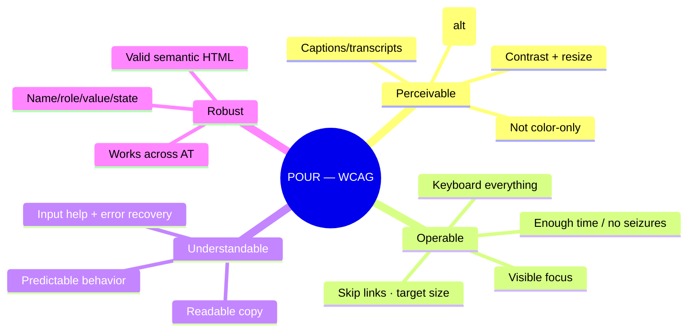
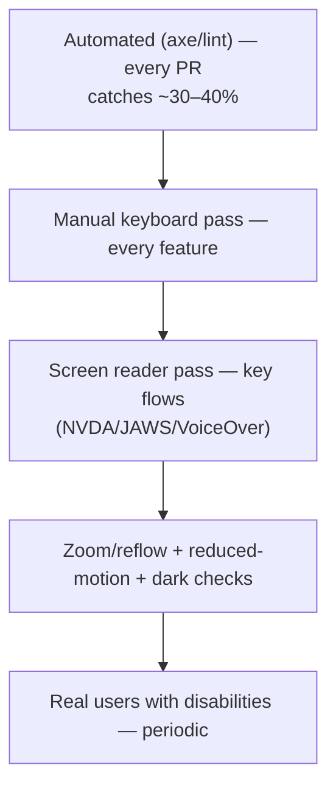

# 22 — Accessibility

### Designing and Building for Everyone (WCAG AA/AAA)

> *"Accessibility is not a feature you add. It is a floor you never fall below. A product that excludes people is not 'mostly done' — it is broken for the people it excludes."*

---

**Chapter type:** Phase 5 — Experience & Interaction
**DRI:** Accessibility Specialist (lead) + Frontend Architect
**Depends on:** [`00-CONSTITUTION.md`](./00-CONSTITUTION.md) (Article III — the floor), [`04`](./04-DESIGN_PHILOSOPHY.md)–[`15`](./15-DESIGN_TOKENS.md)
**Feeds:** every design and engineering chapter — accessibility is cross-cutting

---

## Table of Contents
1. [Purpose](#1-purpose)
2. [Philosophy](#2-philosophy)
3. [Principles](#3-principles)
4. [Best Practices](#4-best-practices)
5. [Anti-Patterns](#5-anti-patterns)
6. [Real-World Examples](#6-real-world-examples)
7. [Common Mistakes](#7-common-mistakes)
8. [AI Implementation Guidance](#8-ai-implementation-guidance)
9. [Human Review Checklist](#9-human-review-checklist)
10. [Automation Opportunities](#10-automation-opportunities)
11. [References for Further Study](#11-references-for-further-study)
12. [Review Checklist & Measurable Quality Criteria](#12-review-checklist--measurable-quality-criteria)

---

## 1. Purpose

This chapter defines how the studio designs and builds so that **everyone** — regardless of ability, device, or context — can use what we make. It operationalizes Constitution **Article III**, which places accessibility on the non-negotiable floor: WCAG 2.2 **AA** is our minimum on all core flows, **AAA** our aspiration where feasible.

Accessibility is referenced by nearly every other chapter (color contrast in [`06`](./06-COLOR_SYSTEM.md), labels in [`13`](./13-FORM_DESIGN.md), focus in [`12`](./12-BUTTON_DESIGN.md), reduced motion in [`23`](./23-MOTION_SYSTEM.md), semantics in [`09`](./09-LAYOUT_SYSTEM.md)). This chapter is the single, authoritative source those references point to: the principles, the techniques, the review process, and the automation that make accessibility a *default* rather than a heroic last-minute effort.

---

## 2. Philosophy

**Accessibility is a civil right, not a nice-to-have.** People with disabilities are entitled to the same access to information and services as everyone else. When we ship an inaccessible product, we are not merely lowering a quality score — we are locking real people out of things they need: a job application, a bank, a doctor's portal, a school. That is why Article III makes it a *floor*, not a trade-off. Deadlines never justify exclusion.

**Disability is diverse, situational, and universal.** It spans permanent (blindness, motor impairment), temporary (a broken arm, an eye infection), and situational (bright sunlight, holding a baby, a noisy room, a slow connection). Roughly *everyone* is disabled sometimes. Designing for the edges improves the experience for the middle — captions help in loud gyms, high contrast helps in sunlight, keyboard support helps power users. Accessibility is the rising tide.

**The web is accessible by default; we break it.** A plain HTML document with real headings, labels, and buttons is *already* accessible. Accessibility problems are almost always things we *added*: `<div>`s pretending to be buttons, color-only meaning, custom widgets that don't announce, motion that can't be stopped. The first rule is therefore *don't break what's free* — use semantic HTML, and only reach for ARIA when native elements genuinely can't do the job.

**"Accessible" is verifiable, not a vibe.** WCAG provides testable success criteria; assistive technology can be tested with; real users can be observed. We hold ourselves to *measured* accessibility (automated + manual + AT + user testing), not the comforting assumption that "it's probably fine." Automated tools catch perhaps a third of issues — the rest need human judgment.

---

## 3. Principles

### Principle 1 — WCAG AA is the floor; POUR is the frame
Meet WCAG 2.2 AA on all core flows. Organize thinking around **POUR**: Perceivable, Operable, Understandable, Robust.
> *Rationale (Art. III):* A shared, testable standard removes "is it accessible enough?" debates.

### Principle 2 — Semantic HTML first; ARIA only when necessary
Use the right native element (`button`, `a`, `nav`, `h1`–`h6`, `label`, `table`). Reach for ARIA only to fill genuine gaps — and "no ARIA is better than bad ARIA."
> *Rationale:* Native elements bring behavior, focus, and semantics for free; wrong ARIA actively harms.

### Principle 3 — Everything works by keyboard
Every interactive element is reachable and operable via keyboard, in a logical order, with visible focus.
> *Rationale ([`12`](./12-BUTTON_DESIGN.md)):* Keyboard access underpins screen readers, switch devices, and power users.

### Principle 4 — Never encode meaning in a single channel
Don't rely on color alone (or sound, or position) — pair with text/icon/shape.
> *Rationale ([`05`](./05-VISUAL_PSYCHOLOGY.md), [`06`](./06-COLOR_SYSTEM.md)):* Color-blindness, low vision, and context break single-channel meaning.

### Principle 5 — Sufficient contrast and scalable text
Text ≥ 4.5:1 (large/UI ≥ 3:1); usable at 200% zoom / reflow; respect user font sizes.
> *Rationale ([`06`](./06-COLOR_SYSTEM.md), [`07`](./07-TYPOGRAPHY_SYSTEM.md)):* Low vision is common and increases with age.

### Principle 6 — Respect user preferences
Honor `prefers-reduced-motion`, `prefers-color-scheme`, `prefers-contrast`, and OS text-size settings.
> *Rationale ([`23`](./23-MOTION_SYSTEM.md)):* Preferences encode real needs (vestibular disorders, photosensitivity).

### Principle 7 — Name, role, value, state for every component
Custom components must expose an accessible name, correct role, current value, and state changes to AT.
> *Rationale:* This is the machine-readable contract screen readers depend on.

### Principle 8 — Manage focus deliberately
Trap focus in modals, return it on close, move it to errors/new content, provide skip links.
> *Rationale ([`13`](./13-FORM_DESIGN.md)):* Lost or trapped focus strands keyboard/AT users.

### Principle 9 — Test with real assistive technology and real users
Automated + manual (keyboard, screen reader) + periodic testing with disabled users.
> *Rationale:* Automation catches ~30–40%; the rest is human judgment and lived experience.

---

## 4. Best Practices

### 4.1 POUR at a glance



### 4.2 Semantic HTML is the foundation
```html
<!-- ✅ Native: accessible for free -->
<button type="button" onclick="save()">Save</button>
<a href="/pricing">Pricing</a>
<nav aria-label="Primary">…</nav>
<main id="main">…</main>

<!-- ❌ Reinvented: broken for keyboard + AT -->
<div class="btn" onclick="save()">Save</div>
```
One accessible page skeleton: landmarks (`header/nav/main/aside/footer`), one `h1`, logical heading order, a **skip link** to `#main`.

### 4.3 Images, icons, and media
- **Informative images:** meaningful `alt` describing purpose/content.
- **Decorative images:** `alt=""` (empty) so AT skips them.
- **Icon-only controls:** `aria-label`; decorative icons `aria-hidden="true"` ([`12`](./12-BUTTON_DESIGN.md)).
- **Video/audio:** captions, transcripts; no autoplay-with-sound.
- **Complex images/charts:** text alternative or data-table equivalent ([`16`](./16-DASHBOARD_DESIGN.md)).

### 4.4 Keyboard & focus
```css
/* Never remove focus without an equal (or better) replacement */
:focus-visible { outline: 2px solid var(--color-focus-ring); outline-offset: 2px; }
```
- Logical tab order (DOM order matches visual order); avoid positive `tabindex`.
- **Focus trap** in dialogs; **return focus** to the trigger on close; **ESC** closes.
- Move focus to the **first error** (or an error summary) on failed submit ([`13`](./13-FORM_DESIGN.md)).
- **Skip link** first in the DOM; visible on focus.

### 4.5 ARIA — the rules of use
1. **Prefer a native element** over ARIA.
2. Don't change native semantics needlessly (`<button role="heading">` — no).
3. All interactive ARIA widgets must be **keyboard operable**.
4. Don't put `aria-hidden="true"` on a focusable element.
5. Every form control has an **accessible name**.
Use the **WAI-ARIA Authoring Practices** patterns (dialog, tabs, combobox, menu, disclosure) as the canonical behavior spec — they define the exact keys and states ([`14`](./14-COMPONENT_LIBRARY.md)).

### 4.6 Live regions & dynamic updates
```html
<div aria-live="polite" id="status"></div>   <!-- non-urgent updates -->
<div role="alert">Your changes were saved.</div>  <!-- urgent, interrupts -->
```
Announce async results (saved, errors, search counts) so AT users aren't left guessing.

### 4.7 Forms (see [`13`](./13-FORM_DESIGN.md))
Associated visible labels; `aria-describedby` for hints/errors; `aria-invalid` on invalid fields; group with `fieldset/legend`; errors in text (not color-only) and announced.

### 4.8 Motion, contrast, and preferences ([`23`](./23-MOTION_SYSTEM.md), [`06`](./06-COLOR_SYSTEM.md))
```css
@media (prefers-reduced-motion: reduce) {
  *, *::before, *::after { animation-duration:.01ms !important; transition-duration:.01ms !important; scroll-behavior:auto !important; }
}
```
No flashing > 3 times/second (seizure risk). Support dark/high-contrast themes via tokens.

### 4.9 Target size & spacing
Interactive targets ≥ **24×24 CSS px** (WCAG 2.2 AA minimum 2.5.8) — the studio's stronger default is **≥44×44px** with spacing ([`08`](./08-SPACING_SYSTEM.md), [`20`](./20-MOBILE_FIRST.md)).

### 4.10 The testing pyramid


---

## 5. Anti-Patterns

| Anti-pattern | Why it fails | Principle |
| --- | --- | --- |
| **`<div onclick>` "buttons"** | No keyboard, role, or focus. | P2, P3 |
| **`outline: none`** with no replacement | Keyboard users can't see focus. | P3 |
| **Color-only meaning** (red = error) | Excludes color-blind/low-vision. | P4 |
| **Placeholder as label** | Vanishes; poor contrast; unannounced. | P7, [`13`](./13-FORM_DESIGN.md) |
| **`aria-label` everything / ARIA soup** | Bad ARIA overrides good semantics; confuses AT. | P2 |
| **`user-scalable=no` / tiny fixed text** | Blocks zoom; excludes low-vision. | P5 |
| **Autoplay motion / no reduced-motion** | Vestibular harm; distraction. | P6 |
| **Modal without focus trap/return** | Keyboard users lost behind the dialog. | P8 |
| **Missing alt / decorative images with alt text** | AT reads noise or misses meaning. | P4 |
| **Accessibility overlay widgets** | Marketed "fix"; often make things worse + don't achieve conformance. | P9 |
| **"We'll do a11y in phase 2"** | Guarantees rework/exclusion; violates the floor. | Art. III |

---

## 6. Real-World Examples

### Example A — The `<div>` that locked out keyboard users
A "Run report" control built as a styled `<div onclick>` couldn't be tabbed to, triggered by Enter/Space, or announced by a screen reader. Swapping to a real `<button>` restored *all* of that for free and deleted custom JS. **Rule:** if it acts like a button, it must *be* a `<button>` (Principle 2/3; cf. [`12`](./12-BUTTON_DESIGN.md)).

### Example B — Color-only status excluded 8% of users
A dashboard showed system health with red/green dots only. Colorblind users (and anyone in grayscale) couldn't tell "down" from "up." Adding an **icon + text label** ("● Down", "● Operational") plus the color fixed it — and made the dashboard clearer for *everyone* scanning quickly (Principle 4; cf. [`16`](./16-DASHBOARD_DESIGN.md)).

### Example C — The zoom failure that automated tests missed
An app passed axe and looked responsive, but at **200% browser zoom** a fixed-height header clipped text and a menu overlapped content — a WCAG 1.4.10 (reflow) failure locking out low-vision users. Automated tools didn't catch it; a **manual zoom pass** did. The fix: intrinsic layout, no fixed heights on text containers ([`09`](./09-LAYOUT_SYSTEM.md), [`21`](./21-RESPONSIVE_DESIGN.md)). *Automation catches ~a third; humans catch the rest (Principle 9).*

---

## 7. Common Mistakes

- **Assuming automated tools = accessible** (they catch a minority of issues).
- **Reinventing native controls** (custom dropdowns/checkboxes) without replicating full keyboard/AT behavior.
- **Adding ARIA to "boost" accessibility** — usually makes it worse; native first.
- **Testing only with a mouse** — never trying keyboard-only or a screen reader.
- **Forgetting focus management** in modals, drawers, and after route changes.
- **Contrast checked only on white**, ignoring dark mode, hover, and disabled states.
- **Treating it as a checklist at the end** rather than a design input from the start.
- **Trusting overlay widgets** to "make the site accessible."

---

## 8. AI Implementation Guidance

### 8.1 Where agents help
- **Generate accessible-by-construction markup** (semantic elements, labels, ARIA only where needed, focus management).
- **Implement WAI-ARIA patterns** correctly (dialog/tabs/combobox with proper keys + states).
- **Audit** for the anti-patterns in §5 and produce a prioritized remediation list.
- **Write alt text**, `aria-label`s, and live-region wiring.
- **Add reduced-motion / contrast / zoom** handling.

### 8.2 Hard rules (Art. III — the floor)
- The agent **defaults to semantic HTML**; it uses ARIA only to fill real gaps and never breaks native semantics.
- **Every interactive element is keyboard operable with visible focus**; the agent never emits `outline:none` without an equal replacement, nor `user-scalable=no`.
- **No meaning by color/single channel alone**; status = color + icon/text.
- **Contrast ≥ AA** for everything it produces (verified, cf. [`06`](./06-COLOR_SYSTEM.md)); usable at 200% zoom.
- Custom widgets expose **name/role/value/state**; modals **trap + return focus**; forms follow [`13`](./13-FORM_DESIGN.md).
- The agent **reports a self-audit** (keyboard map, contrast, axe result) and states that automated checks are necessary-but-insufficient (a human must verify).

### 8.3 Prompt example — build accessibly
```
ROLE: Accessibility Specialist + Frontend, bound by 00-CONSTITUTION (Art. III) + 22.
TASK: Build <component/flow>.
CONSTRAINTS:
  - Semantic HTML first; ARIA only where native can't; follow the WAI-ARIA pattern for <widget>.
  - Full keyboard operability + visible :focus-visible; logical tab order; focus trap/return for dialogs.
  - No color-only meaning; AA contrast (report ratios); usable at 200% zoom.
  - Respect prefers-reduced-motion/-color-scheme; targets ≥44px.
  - Live regions for async updates; labels + aria-describedby/aria-invalid for forms.
OUTPUT: markup/TSX + a11y self-audit (keyboard map, contrast, axe result) + note that a human AT pass is still required.
```

### 8.4 Prompt example — audit
```
TASK: Audit for: non-semantic interactive elements, missing/incorrect focus styles, color-only
meaning, unlabeled controls/images, ARIA misuse, missing focus management in modals, contrast
failures (incl. dark mode + states), zoom/reflow breakage at 200%, and missing reduced-motion.
Output {file:line, WCAG SC, issue, fix}, prioritized by severity.
```

---

## 9. Human Review Checklist

- [ ] **Semantic HTML** used; ARIA only where necessary and correct; one `h1` + logical headings + landmarks + skip link.
- [ ] **Keyboard:** everything reachable/operable, logical order, **visible focus**, no traps (except intentional modal traps that return focus).
- [ ] **No color-only** (or single-channel) meaning anywhere.
- [ ] **Contrast ≥ AA** for text/UI, verified across themes + states.
- [ ] Usable at **200% zoom / reflow**; text resizes; zoom not disabled.
- [ ] **Preferences** honored: reduced motion, color scheme, contrast, OS text size.
- [ ] Custom components expose **name/role/value/state**; follow WAI-ARIA patterns.
- [ ] **Focus management**: modals trap+return, errors/new content receive focus.
- [ ] **Images/media**: correct alt, decorative `alt=""`, captions/transcripts, no autoplay-with-sound.
- [ ] **Targets ≥ 44px**; no flashing > 3×/sec.
- [ ] Tested with **keyboard + a screen reader**; periodic **real-user** testing scheduled.

---

## 10. Automation Opportunities

| Task | Automation |
| --- | --- |
| Static a11y lint | `eslint-plugin-jsx-a11y` in CI; block on errors. |
| Runtime checks | axe-core in unit/E2E (jest-axe, Playwright/Cypress axe); block on violations. |
| Contrast | Token-pipeline contrast validation ([`06`](./06-COLOR_SYSTEM.md), [`15`](./15-DESIGN_TOKENS.md)); CI fail < AA. |
| Keyboard/focus | E2E tab-order + focus-trap/return assertions. |
| Zoom/reflow | Automated 200%/400% zoom screenshots on core flows. |
| Story coverage | Storybook a11y addon; require a11y-clean stories per component. |
| Reduced motion | Lint requiring `prefers-reduced-motion` handling for animations. |
| Regression | Visual + AT-snapshot checks per theme. |

> **Automation gate + human gate:** CI enforces the machine-checkable subset; a human performs the keyboard + screen-reader pass before merge on core flows.

---

## 11. References for Further Study
- **Standards:** W3C **WCAG 2.2** (success criteria, AA/AAA), **WAI-ARIA Authoring Practices Guide (APG)** (component patterns), ARIA in HTML spec.
- **Guidance:** MDN accessibility docs; the WebAIM articles and annual "WebAIM Million" report; the A11y Project checklist.
- **Testing:** using screen readers (NVDA/JAWS/VoiceOver) for testing; axe-core / Deque University resources.
- **Legal context:** ADA / Section 508 (US), EN 301 549 / European Accessibility Act — accessibility as legal obligation.
- **Cross-references:** [`06-COLOR_SYSTEM.md`](./06-COLOR_SYSTEM.md), [`07-TYPOGRAPHY_SYSTEM.md`](./07-TYPOGRAPHY_SYSTEM.md), [`12-BUTTON_DESIGN.md`](./12-BUTTON_DESIGN.md), [`13-FORM_DESIGN.md`](./13-FORM_DESIGN.md), [`14-COMPONENT_LIBRARY.md`](./14-COMPONENT_LIBRARY.md), [`23-MOTION_SYSTEM.md`](./23-MOTION_SYSTEM.md).

---

## 12. Review Checklist & Measurable Quality Criteria

| Criterion | Target |
| --- | --- |
| WCAG 2.2 AA conformance on core flows | 100% (floor, Art. III) |
| Automated a11y violations (axe) in CI | 0 (blocking) |
| Interactive elements keyboard-operable w/ visible focus | 100% |
| Color-only meaning instances | 0 |
| Text/UI contrast meeting AA (all themes/states) | 100% |
| Core flows usable at 200% zoom | 100% |
| Components conforming to WAI-ARIA patterns | 100% |
| Keyboard + screen-reader manual pass before merge | 100% of core flows |
| Real-user (disabled) testing cadence | ≥ per major release |

---

*End of `22-ACCESSIBILITY.md`.*
