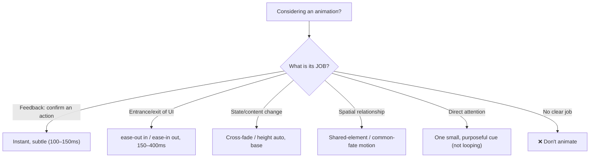

# 23 — Motion System

### Animation as Wayfinding, Feedback, and Meaning

> *"Every animation must have intent. Motion that doesn't inform is motion that distracts — and on the web, it also costs battery, frames, and sometimes a person's balance."*

---

**Chapter type:** Phase 5 — Experience & Interaction
**DRI:** Motion Designer (lead) + Design Systems Engineer
**Depends on:** [`00-CONSTITUTION.md`](./00-CONSTITUTION.md), [`04`](./04-DESIGN_PHILOSOPHY.md), [`05`](./05-VISUAL_PSYCHOLOGY.md), [`15`](./15-DESIGN_TOKENS.md), [`22`](./22-ACCESSIBILITY.md)
**Feeds:** [`24-MICRO_INTERACTIONS.md`](./24-MICRO_INTERACTIONS.md), [`34-FRAMER_MOTION_GUIDE.md`](./34-FRAMER_MOTION_GUIDE.md), [`35-PERFORMANCE.md`](./35-PERFORMANCE.md)

---

## Table of Contents
1. [Purpose](#1-purpose)
2. [Philosophy](#2-philosophy)
3. [Principles](#3-principles)
4. [Best Practices](#4-best-practices)
5. [Anti-Patterns](#5-anti-patterns)
6. [Real-World Examples](#6-real-world-examples)
7. [Common Mistakes](#7-common-mistakes)
8. [AI Implementation Guidance](#8-ai-implementation-guidance)
9. [Human Review Checklist](#9-human-review-checklist)
10. [Automation Opportunities](#10-automation-opportunities)
11. [References for Further Study](#11-references-for-further-study)
12. [Review Checklist & Measurable Quality Criteria](#12-review-checklist--measurable-quality-criteria)

---

## 1. Purpose

This chapter defines the studio's **motion system** — the tokenized durations, easings, and choreography rules that make animation purposeful, consistent, performant, and accessible. It turns "add a nice transition" into a *system* (Article IV): a small set of motion tokens and patterns that every component and surface reuses, so motion feels like one coherent language rather than a collection of one-off effects.

Motion is a powerful tool for wayfinding (showing where things came from and went), feedback (confirming actions), and focus (directing attention) — but it is also one of the easiest things to overdo, and one with real accessibility ([`22`](./22-ACCESSIBILITY.md)) and performance ([`35`](./35-PERFORMANCE.md)) costs. This chapter establishes *when* to animate, *how much*, and *how to encode it as tokens* so both humans and AI agents apply motion with intent. Micro-interactions ([`24`](./24-MICRO_INTERACTIONS.md)) and the Framer Motion implementation ([`34`](./34-FRAMER_MOTION_GUIDE.md)) build on this foundation.

---

## 2. Philosophy

**Motion is a wayfinding tool, not decoration** ([`04`](./04-DESIGN_PHILOSOPHY.md) P5). The nervous system is wired to notice movement — so movement is a *loud* channel that must be spent carefully. Good motion answers questions the user is already asking: *Where did that panel come from? Did my click register? What just changed? Where should I look now?* Motion that answers none of these is noise wearing a nice easing curve, and it competes with the content for attention it hasn't earned (Article I).

**Physics, not linearity.** Real objects have mass; they accelerate and decelerate. Interfaces that move linearly feel robotic and cheap. Natural motion uses easing (ease-out for entrances, ease-in for exits) or spring physics — and it is *fast*. Most UI motion should be **150–300ms**; anything longer starts to feel sluggish and delays the user. The best motion is often the one you barely notice consciously but feel as "smooth."

**Motion is a system, expressed as tokens.** Durations and easings are design decisions, so they are **design tokens** ([`15`](./15-DESIGN_TOKENS.md)) — `duration.fast`, `ease.standard` — not magic numbers scattered across components. This is what makes motion consistent across a product and tunable in one place (Article IV, V). Ten engineers hand-picking `0.3s ease-in-out` is chaos; one token everyone references is a language.

**Accessibility and performance are part of motion, not constraints on it.** Some users get *physically ill* from motion (vestibular disorders); some devices drop frames under heavy animation; some content flashing at the wrong rate can trigger seizures. Respecting `prefers-reduced-motion`, animating only cheap properties (transform/opacity), and avoiding dangerous flashing are not limitations on creativity — they are the definition of *professional* motion (Article II, III; [`22`](./22-ACCESSIBILITY.md), [`35`](./35-PERFORMANCE.md)).

---

## 3. Principles

### Principle 1 — Every animation has an intent
Before animating, name the job: entrance/exit, feedback, state change, spatial relationship, or attention. No intent → no animation.
> *Rationale (Art. VI, [`04`](./04-DESIGN_PHILOSOPHY.md) P5):* Purposeless motion distracts and costs.

### Principle 2 — Fast and natural (150–300ms, eased)
Default UI motion is short and physically eased; reserve longer durations for large/hero transitions only.
> *Rationale ([`05`](./05-VISUAL_PSYCHOLOGY.md)):* Slow motion delays users; linear motion feels robotic.

### Principle 3 — Motion is tokenized
Durations, easings (and common patterns) are design tokens reused everywhere.
> *Rationale (Art. IV, [`15`](./15-DESIGN_TOKENS.md)):* Consistency + one-place tuning.

### Principle 4 — Animate cheap properties only
Prefer `transform` and `opacity` (GPU-composited); avoid animating layout properties (width/height/top/left) that trigger reflow.
> *Rationale ([`35`](./35-PERFORMANCE.md)):* Cheap props hit 60fps; layout animation janks.

### Principle 5 — Respect `prefers-reduced-motion`
Provide a reduced (or no) motion path for every animation; never require motion to convey meaning.
> *Rationale (Art. III, [`22`](./22-ACCESSIBILITY.md)):* Motion can cause nausea/vertigo; some users disable it.

### Principle 6 — Motion reinforces spatial/logical relationships
Elements enter from where they conceptually belong; connected things move together (shared-element/common-fate).
> *Rationale ([`05`](./05-VISUAL_PSYCHOLOGY.md) Gestalt):* Consistent spatial logic builds a mental model.

### Principle 7 — Never block or delay the user
Feedback is immediate; animations are interruptible; motion never gates the user's next action.
> *Rationale (Art. I):* The user's goal outranks the flourish.

### Principle 8 — No harmful motion
No flashing > 3×/second (seizure risk); avoid large parallax/zoom that triggers vestibular issues even at default.
> *Rationale (Art. III, WCAG 2.3.1):* Safety floor.

---

## 4. Best Practices

### 4.1 Motion tokens (the source of truth)

```css
:root {
  /* Durations */
  --duration-instant: 100ms;  /* micro feedback (hover, press) */
  --duration-fast:    150ms;  /* small UI transitions */
  --duration-base:    250ms;  /* default (dropdowns, tabs) */
  --duration-slow:    400ms;  /* larger surfaces (modals, drawers) */
  --duration-slower:  600ms;  /* hero/page transitions (rare) */

  /* Easings */
  --ease-standard: cubic-bezier(0.2, 0, 0, 1);     /* most UI: quick out, gentle settle */
  --ease-out:      cubic-bezier(0, 0, 0, 1);        /* entrances */
  --ease-in:       cubic-bezier(0.3, 0, 1, 1);      /* exits */
  --ease-emphasized: cubic-bezier(0.2, 0, 0, 1.2);  /* subtle overshoot for delight (sparingly) */
}
```

### 4.2 Duration by scope (bigger = slightly longer)
| Motion | Token | Notes |
| --- | --- | --- |
| Hover/press feedback | `instant` (100ms) | must feel immediate |
| Toggle, small fade | `fast` (150ms) | |
| Dropdown, tab, tooltip | `base` (250ms) | |
| Modal, drawer, sheet | `slow` (400ms) | larger travel |
| Page/hero transition | `slower` (600ms) | rare, deliberate |

### 4.3 The motion intent map


### 4.4 Performant animation (transform/opacity)
```css
/* ✅ Cheap: composited, hits 60fps */
.panel-enter { opacity: 0; transform: translateY(8px); }
.panel-enter-active {
  opacity: 1; transform: translateY(0);
  transition: opacity var(--duration-base) var(--ease-out),
              transform var(--duration-base) var(--ease-out);
}
/* ❌ Expensive: triggers layout/reflow every frame */
.bad { transition: height .3s, top .3s, width .3s; }
```
Use `will-change` sparingly (only during animation); prefer FLIP for layout moves; avoid animating box-shadow on large elements (paint cost) — animate an overlay pseudo-element instead.

### 4.5 Reduced motion — always
```css
@media (prefers-reduced-motion: reduce) {
  *, *::before, *::after {
    animation-duration: .01ms !important;
    animation-iteration-count: 1 !important;
    transition-duration: .01ms !important;
    scroll-behavior: auto !important;
  }
}
```
Better than "kill everything": provide a *reduced* path — replace movement with a simple fade, keep essential state changes instant. Test the reduced experience; it must still be fully usable ([`22`](./22-ACCESSIBILITY.md)).

### 4.6 Choreography & staggering
When multiple elements enter, **stagger** slightly (e.g. 30–50ms apart) so they read as a sequence, not a flash — but keep the *total* short. Orchestrate exits before entrances on transitions. Connected elements share a spring so they feel physically linked (Principle 6).

### 4.7 Spring vs. duration-based
- **Duration + easing:** predictable, tokenizable, great for most UI (fades, slides).
- **Springs (physics):** natural for draggable/gestural/interruptible UI (see [`34`](./34-FRAMER_MOTION_GUIDE.md)). Prefer springs where the user's input drives the motion; prefer durations for deterministic transitions.

### 4.8 Loading & perceived performance ([`35`](./35-PERFORMANCE.md))
Skeletons and progress use motion to make waits feel shorter — but the shimmer respects reduced motion, matches final geometry (no CLS, [`11`](./11-CARD_DESIGN.md)), and never implies "done" when it isn't.

---

## 5. Anti-Patterns

| Anti-pattern | Why it fails | Principle |
| --- | --- | --- |
| **Decorative motion with no job** | Distracts; costs frames/battery. | P1 |
| **Slow animations** (>400ms on small UI) | Feels sluggish; delays the user. | P2, P7 |
| **Linear easing** | Robotic, cheap-feeling. | P2 |
| **Magic-number durations everywhere** | Inconsistent; unmaintainable. | P3 |
| **Animating width/height/top/left** | Reflow jank; dropped frames. | P4 |
| **No `prefers-reduced-motion` path** | Nausea/vertigo; excludes users. | P5, Art. III |
| **Meaning conveyed only by motion** | Lost for reduced-motion users. | P5 |
| **Motion that blocks input** (uninterruptible) | User trapped waiting. | P7 |
| **Flashing > 3×/sec / heavy parallax** | Seizure/vestibular risk. | P8 |
| **Looping/attention-grabbing animation** | Constant distraction; ignored (banner blindness). | P1 |
| **Autoplay carousels/marquees w/o pause** | Distracting; a11y + perf cost. | P1, P5 |

---

## 6. Real-World Examples

### Example A — The 600ms button that felt broken (recap of [`00`](./00-CONSTITUTION.md) Example A)
A delightful 600ms spring on "Place Order" delayed the perceived confirmation and dropped frames on low-end phones. Motion's *job* here is **feedback** — which must be **instant** (Principle 2/7). The fix: confirm state changes immediately (100ms), move the flourish to a subtle, interruptible micro-animation that never delays success. *The animation wasn't bad; it was the wrong duration for its job.*

### Example B — Tokens turned chaos into a language
An app had transitions ranging from `0.15s ease` to `0.5s ease-in-out` chosen ad hoc; the product felt inconsistent — some interactions snappy, others sluggish. Introducing **motion tokens** (`duration.*`, `ease.*`) and mapping each interaction type to a token made the whole product feel like one coherent, snappy system, and let the team retune globally in one file (Principle 3; [`15`](./15-DESIGN_TOKENS.md)).

### Example C — Reduced motion done right
A site used a dramatic scroll-parallax hero. For users with `prefers-reduced-motion`, it caused discomfort. Rather than just disabling everything, the team provided a **reduced path**: the parallax became a static, well-composed hero; essential reveals became instant fades. Both experiences were polished and fully usable — motion was *enhancement*, and the content worked without it (Principle 5; [`22`](./22-ACCESSIBILITY.md)).

---

## 7. Common Mistakes

- **Animating because the tool makes it easy**, not because it has a job.
- **Durations too long** — 300ms+ on small UI reads as slow.
- **Ignoring easing** or using `linear` everywhere.
- **Hardcoding durations** instead of using tokens.
- **Animating layout properties**, causing jank.
- **Forgetting reduced motion** entirely, or nuking motion so state changes become confusing.
- **Motion that can't be interrupted** or that blocks the next action.
- **Looping/attention animations** that become permanent distractions.

---

## 8. AI Implementation Guidance

### 8.1 Where agents help
- **Generate the motion token set** and map interaction types to tokens.
- **Implement transitions** using cheap properties + tokens (CSS or Framer Motion, [`34`](./34-FRAMER_MOTION_GUIDE.md)).
- **Add reduced-motion paths** automatically to every animation.
- **Audit** for magic-number durations, layout-property animation, missing reduced-motion, over-long/linear motion, and purposeless/looping effects.

### 8.2 Hard rules (Art. I, III, IV)
- Every animation the agent adds must **state its intent**; purposeless motion is not added.
- Durations/easings come from **motion tokens** — no magic numbers.
- Animate **transform/opacity only** by default; the agent flags/refactors layout-property animation.
- **Every animation ships a `prefers-reduced-motion` path**; meaning is **never** motion-only.
- Feedback is **immediate and interruptible**; motion never blocks input; **no flashing > 3×/sec**.

### 8.3 Prompt example — add motion
```
ROLE: Motion Designer + Frontend, bound by 00-CONSTITUTION + 23.
TASK: Add motion to <component/transition>.
CONSTRAINTS:
  - State the intent (feedback/entrance/state-change/spatial/attention); if none, don't animate.
  - Use motion tokens (duration.*/ease.*); default 150–300ms, physically eased.
  - Animate transform/opacity only (no layout props).
  - Provide a prefers-reduced-motion path (reduced/fade); meaning never motion-only.
  - Interruptible; never blocks input; no flashing >3/sec.
OUTPUT: code (CSS/Framer) using tokens + the reduced-motion variant + a one-line intent per animation + perf note.
```

### 8.4 Prompt example — audit
```
TASK: Audit animations for: magic-number durations/easings, layout-property animation (width/
height/top/left), missing prefers-reduced-motion, durations >400ms on small UI, linear easing,
motion-only meaning, uninterruptible/blocking motion, and flashing/looping distractions.
Output {file:line, issue, fix → token/cheap-prop/reduced-path}.
```

---

## 9. Human Review Checklist

- [ ] Every animation has a **stated job** (feedback/entrance/state/spatial/attention).
- [ ] Durations are **150–300ms** for UI (longer only for large/hero), **physically eased** (not linear).
- [ ] All motion uses **tokens** (no magic numbers).
- [ ] Only **transform/opacity** animated (no layout-property jank); 60fps on low-end.
- [ ] Every animation has a **reduced-motion path**; no meaning is motion-only.
- [ ] Motion reinforces **spatial/logical relationships** consistently.
- [ ] Feedback is **immediate**; animations are **interruptible** and never block input.
- [ ] **No flashing > 3×/sec**; no gratuitous parallax/looping/autoplay-without-pause.
- [ ] Loading motion (skeletons) matches final geometry (no CLS) and respects reduced motion.

---

## 10. Automation Opportunities

| Task | Automation |
| --- | --- |
| Token enforcement | Lint banning raw durations/easings outside the token set. |
| Cheap-property lint | Flag transitions on width/height/top/left; nudge to transform/opacity. |
| Reduced-motion check | Lint requiring a `prefers-reduced-motion` path for animations. |
| Duration budget | Warn on UI transitions > 400ms. |
| Perf (frames) | Automated FPS/long-frame checks on key interactions ([`35`](./35-PERFORMANCE.md)). |
| Flash detection | Automated check against >3 flashes/sec (WCAG 2.3.1). |
| Reduced-motion snapshot | Visual test of the reduced-motion variant. |

---

## 11. References for Further Study
- **Principles:** Disney's 12 principles of animation (adapted for UI); the "12 principles of UX in motion" (Issara Willenskomer).
- **UI motion systems:** the Material motion guidelines (duration/easing/choreography) as a reference; Val Head's *Designing Interface Animation*.
- **Performance:** web.dev on high-performance animations (compositor-only properties, avoiding layout/paint).
- **Accessibility:** WCAG 2.3.3 (animation from interactions), 2.3.1 (three flashes), `prefers-reduced-motion` docs ([`22`](./22-ACCESSIBILITY.md)).
- **Cross-references:** [`04-DESIGN_PHILOSOPHY.md`](./04-DESIGN_PHILOSOPHY.md), [`05-VISUAL_PSYCHOLOGY.md`](./05-VISUAL_PSYCHOLOGY.md), [`15-DESIGN_TOKENS.md`](./15-DESIGN_TOKENS.md), [`24-MICRO_INTERACTIONS.md`](./24-MICRO_INTERACTIONS.md), [`34-FRAMER_MOTION_GUIDE.md`](./34-FRAMER_MOTION_GUIDE.md), [`35-PERFORMANCE.md`](./35-PERFORMANCE.md).

---

## 12. Review Checklist & Measurable Quality Criteria

| Criterion | Target |
| --- | --- |
| Animations with a stated intent | 100% |
| Motion values drawn from tokens | 100% |
| Animations of layout properties | 0 (use transform/opacity) |
| Animations with a reduced-motion path | 100% (floor) |
| Meaning conveyed by motion alone | 0 |
| UI transition duration | ≤ 300ms (≤400ms for large surfaces) |
| Flashing > 3×/sec | 0 (floor) |
| Interaction frame rate (low-end) | ~60fps / no long frames |

---

*End of `23-MOTION_SYSTEM.md`.*
