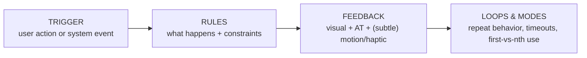

# 24 — Micro-Interactions

### The Small Moments That Make a Product Feel Alive

> *"Details are not the details. They make the design. A micro-interaction is a tiny conversation: the user does something, and the product answers — clearly, instantly, and with a little bit of character."*

---

**Chapter type:** Phase 5 — Experience & Interaction
**DRI:** Senior UI Designer + Motion Designer (joint)
**Depends on:** [`00-CONSTITUTION.md`](./00-CONSTITUTION.md), [`05`](./05-VISUAL_PSYCHOLOGY.md), [`12`](./12-BUTTON_DESIGN.md), [`13`](./13-FORM_DESIGN.md), [`22`](./22-ACCESSIBILITY.md), [`23`](./23-MOTION_SYSTEM.md)
**Feeds:** [`26-USER_EXPERIENCE.md`](./26-USER_EXPERIENCE.md), [`34-FRAMER_MOTION_GUIDE.md`](./34-FRAMER_MOTION_GUIDE.md)

---

## Table of Contents
1. [Purpose](#1-purpose)
2. [Philosophy](#2-philosophy)
3. [Principles](#3-principles)
4. [Best Practices](#4-best-practices)
5. [Anti-Patterns](#5-anti-patterns)
6. [Real-World Examples](#6-real-world-examples)
7. [Common Mistakes](#7-common-mistakes)
8. [AI Implementation Guidance](#8-ai-implementation-guidance)
9. [Human Review Checklist](#9-human-review-checklist)
10. [Automation Opportunities](#10-automation-opportunities)
11. [References for Further Study](#11-references-for-further-study)
12. [Review Checklist & Measurable Quality Criteria](#12-review-checklist--measurable-quality-criteria)

---

## 1. Purpose

This chapter defines how the studio designs **micro-interactions** — the small, single-purpose moments of feedback and response that happen constantly in a product: a button acknowledging a press, a toggle sliding, a field validating, a "copied!" confirmation, a like animating, a pull-to-refresh. Where [`23`](./23-MOTION_SYSTEM.md) defines the *motion language* (tokens, easings, rules), this chapter defines the *interaction moments* that use it — the anatomy of a good response to a user's action.

Micro-interactions are where a product earns the words "polished," "responsive," and "delightful." They are also where feedback (a floor-level usability need — the user must know their action registered) meets craft (the character that makes a product feel cared-for, Article VII). Done well, they build trust and reduce uncertainty; done badly or excessively, they annoy, distract, and slow people down.

---

## 2. Philosophy

**Feedback is a necessity; delight is a bonus.** Every micro-interaction has two layers. The **functional** layer is non-negotiable: when a user acts, the product *must* acknowledge it immediately and communicate the result (pressed, loading, succeeded, failed). Without feedback, users are left uncertain — they double-click, they wonder if it's broken, they lose trust ([`05`](./05-VISUAL_PSYCHOLOGY.md), feedback within human time thresholds). The **delight** layer — a satisfying spring, a playful confirmation — is the bonus that turns "it works" into "it feels great." We always deliver the functional layer; we add delight where it fits the brand and doesn't cost the user.

**A micro-interaction is a tiny, complete conversation.** Dan Saffer's model frames each as a **trigger → rules → feedback → loops/modes**: the user (or system) triggers it, rules define what happens, feedback communicates it, and loops/modes govern its behavior over time. Designing a micro-interaction means designing all four parts deliberately — especially the *failure* and *edge* cases, not just the happy path.

**Restraint is what makes delight land.** If everything sparkles, nothing is special, and the sparkle becomes noise (banner blindness, [`05`](./05-VISUAL_PSYCHOLOGY.md)). Delightful micro-interactions work precisely because they are *occasional* — a first-time success, a milestone, a moment of relief. Overusing delight taxes attention, performance, and patience (Article VIII). The mature move is to make the *functional* feedback flawless everywhere and reserve *delight* for the moments that matter.

**Details compound into trust.** Individually, a hover state or a validation checkmark is trivial. Collectively, hundreds of well-crafted micro-interactions tell the user "the people who made this pay attention" — and users transfer that inferred care to the invisible qualities they can't see (reliability, security). Sloppy micro-interactions do the opposite. This is Article VII (beauty as a requirement) at the smallest scale.

---

## 3. Principles

### Principle 1 — Always acknowledge the user's action, immediately
Every interactive element responds to input within ~100ms (hover, active, focus, loading).
> *Rationale ([`05`](./05-VISUAL_PSYCHOLOGY.md), Art. I):* Un-acknowledged actions cause uncertainty and double-actions.

### Principle 2 — Design all four parts (trigger, rules, feedback, loops)
Especially the loading, empty, error, and repeated-use states — not just success.
> *Rationale ([`04`](./04-DESIGN_PHILOSOPHY.md) P6):* The happy path is the rarest in real use.

### Principle 3 — Function before delight; delight is earned and rare
Nail the functional feedback everywhere; reserve delightful flourishes for meaningful moments.
> *Rationale (Art. VIII):* Overused delight becomes noise and cost.

### Principle 4 — Built on the motion system
Use motion tokens, cheap properties, and easings from [`23`](./23-MOTION_SYSTEM.md).
> *Rationale (Art. IV):* Consistency + performance + one-place tuning.

### Principle 5 — Accessible feedback (not visual-only)
Announce important state changes to AT (live regions); provide non-motion, non-color feedback too.
> *Rationale (Art. III, [`22`](./22-ACCESSIBILITY.md)):* Screen-reader/reduced-motion/color-blind users need the same feedback.

### Principle 6 — Never block or lie
Feedback is interruptible and honest — never imply success before it happens, never trap the user.
> *Rationale (Art. I, III):* Optimistic UI must reconcile with reality; fake progress is deception.

### Principle 7 — Consistent responses to consistent actions
The same interaction behaves the same everywhere (all buttons press alike, all toggles slide alike).
> *Rationale (Art. V, [`05`](./05-VISUAL_PSYCHOLOGY.md)):* Predictability builds mental models and trust.

### Principle 8 — Match effort to importance
Bigger/rarer moments (first success, completion) warrant more; frequent/mundane actions stay subtle.
> *Rationale:* A confetti burst on every keystroke is exhausting; on a milestone it delights.

---

## 4. Best Practices

### 4.1 The anatomy (Saffer's model)

Design each part — and each *state*: default → hover → active/press → focus → loading → success → error → disabled.

### 4.2 The state ladder for an interactive element
| State | What it communicates | How |
| --- | --- | --- |
| Default | available | resting style |
| Hover (pointer only) | interactive | subtle bg/elevation (`@media (hover:hover)`) |
| Focus-visible | keyboard location | visible ring ([`22`](./22-ACCESSIBILITY.md)) |
| Active/press | registered | quick scale/translate (100ms) |
| Loading | working, wait | spinner + `aria-busy`, width preserved ([`12`](./12-BUTTON_DESIGN.md)) |
| Success | done | checkmark + text/announcement |
| Error | failed + why | message (not color-only) + focus/announce ([`13`](./13-FORM_DESIGN.md)) |
| Disabled | unavailable + why | reduced style + explanation ([`12`](./12-BUTTON_DESIGN.md)) |

### 4.3 Worked example: the "Copy" button (a complete micro-interaction)
```tsx
function CopyButton({ text }: { text: string }) {
  const [copied, setCopied] = useState(false);
  async function onCopy() {
    await navigator.clipboard.writeText(text);
    setCopied(true);
    setTimeout(() => setCopied(false), 2000); // loop: reset
  }
  return (
    <button onClick={onCopy} className="btn btn--ghost" aria-live="polite">
      {copied ? <><CheckIcon aria-hidden /> Copied</> : <><CopyIcon aria-hidden /> Copy</>}
    </button>
  );
}
```
- **Trigger:** click/Enter. **Rules:** copy → confirm → auto-reset after 2s.
- **Feedback:** icon+label swap (visual) + `aria-live="polite"` (announced) — *not* color-only.
- **Loop:** resets to default; **honest** (only shows "Copied" after the copy succeeds).

### 4.4 Optimistic UI — done honestly ([`23`](./23-MOTION_SYSTEM.md), Principle 6)
For instant-feeling actions (like/favorite), update the UI immediately, then reconcile with the server; on failure, **revert and inform**. Never leave the optimistic state if the action actually failed.

### 4.5 Reserve delight for the right moments
- **Subtle, always:** press, hover, focus, validation tick, toggle slide.
- **Delightful, occasionally:** first successful action, task completion, a milestone/streak, an empty→first-item transition.
- **Never:** looping/attention animations on routine elements; confetti on every action; delight that delays the task.

### 4.6 Haptics & sound (where available)
On supported devices, a subtle haptic can reinforce feedback (press, success, error) — but it must be optional, respect system settings, and never be the *only* feedback channel ([`22`](./22-ACCESSIBILITY.md)). Sound is rarely appropriate on the web; if used, it's opt-in and muted by default.

### 4.7 Accessibility of micro-interactions ([`22`](./22-ACCESSIBILITY.md), [`23`](./23-MOTION_SYSTEM.md))
- Announce important results via `aria-live`/`role="alert"` (copied, saved, error).
- Provide the same feedback without motion (respect `prefers-reduced-motion`) and without color alone.
- Keep hover-triggered feedback available via focus too (keyboard/touch have no hover).

### 4.8 Performance ([`35`](./35-PERFORMANCE.md))
Cheap properties only ([`23`](./23-MOTION_SYSTEM.md) P4); debounce/throttle high-frequency triggers (scroll, drag, input) so feedback stays at 60fps and doesn't thrash.

---

## 5. Anti-Patterns

| Anti-pattern | Why it fails | Principle |
| --- | --- | --- |
| **No feedback on action** | User uncertain; double-clicks; distrust. | P1 |
| **Only the success state designed** | Loading/error/empty break in production. | P2 |
| **Delight everywhere** (confetti on all actions) | Noise; distraction; fatigue. | P3, P8 |
| **Ad-hoc motion** (ignores the system) | Inconsistent; unmaintainable. | P4 |
| **Visual-only / color-only feedback** | Excludes AT/reduced-motion/color-blind users. | P5 |
| **Fake/premature success** (shows "done" before it is) | Deception; data confusion. | P6, Art. III |
| **Blocking/uninterruptible feedback** | Traps the user waiting. | P6 |
| **Inconsistent responses** (buttons behave differently) | Breaks mental model. | P7 |
| **Over-animated routine elements** (looping) | Permanent distraction; banner blindness. | P8 |
| **Janky feedback** (layout-prop animation, unthrottled) | Dropped frames; feels broken. | P4, [`35`](./35-PERFORMANCE.md) |

---

## 6. Real-World Examples

### Example A — Feedback that prevented double-submits
A "Save" button gave no feedback on click; on slow connections users clicked repeatedly, creating duplicate records. Adding an **immediate loading state** (`aria-busy`, spinner, disabled, width preserved) plus a success confirmation eliminated duplicates and the "is it broken?" support tickets. *The functional feedback layer is non-negotiable (Principle 1; [`12`](./12-BUTTON_DESIGN.md)).*

### Example B — Delight, reserved and earned
A habit app added a small celebratory animation. First version: it fired on *every* checkbox tick — users found it exhausting within a day. Reworked to fire only on **completing all daily habits** (a milestone), the same animation became a genuinely delightful reward people looked forward to. *Restraint is what makes delight land (Principles 3, 8).*

### Example C — Accessible, honest "Copied"
A code block's copy button flashed a green background only. Colorblind users couldn't tell it worked; screen-reader users got nothing; reduced-motion users missed the flash. Rebuilt (per 4.3): **icon + "Copied" text** (not color-only), **`aria-live`** announcement, an honest 2s reset — feedback that reaches everyone and never lies (Principles 5, 6; [`22`](./22-ACCESSIBILITY.md)).

---

## 7. Common Mistakes

- **Designing only the happy path**, discovering loading/error states in production.
- **Skipping feedback** on actions that take time (leading to double-actions).
- **Over-delighting** — flourishes on routine actions that quickly annoy.
- **Color-only or motion-only** feedback (excludes users).
- **Optimistic UI that never reconciles** on failure (stale/false state).
- **Ad-hoc animation** ignoring motion tokens ([`23`](./23-MOTION_SYSTEM.md)).
- **Hover-only feedback** with no focus/touch equivalent.
- **Unthrottled high-frequency** interactions causing jank.

---

## 8. AI Implementation Guidance

### 8.1 Where agents help
- **Generate complete micro-interactions** (all four parts + all states) for buttons, toggles, inputs, copy, like, etc.
- **Add accessible feedback** (`aria-live`/`role=alert`, non-color, reduced-motion variants).
- **Implement optimistic UI with reconciliation** (revert + inform on failure).
- **Audit** for missing feedback, happy-path-only states, over-delight, color/motion-only feedback, and inconsistent responses.

### 8.2 Hard rules (Art. I, III, VIII)
- **Every interactive element acknowledges input immediately** and ships **all states** (incl. loading/error/empty), not just success.
- Feedback is **not color-only and not motion-only**; important results are **announced** to AT; a **reduced-motion** path exists.
- **Never fake/premature success**; optimistic UI **reverts + informs** on failure; feedback is interruptible.
- Motion uses **tokens + cheap properties** ([`23`](./23-MOTION_SYSTEM.md)); high-frequency triggers are throttled.
- **Delight is reserved** for meaningful moments; the agent does not add flourishes to routine actions by default.

### 8.3 Prompt example — build a micro-interaction
```
ROLE: UI + Motion, bound by 00-CONSTITUTION + 24 (+23/22).
TASK: Build the <toggle / copy / like / save> micro-interaction.
CONSTRAINTS:
  - Design trigger → rules → feedback → loops; ALL states (default/hover/focus/active/loading/success/error/disabled).
  - Immediate acknowledgment (<100ms); motion from 23's tokens, cheap props only.
  - Feedback not color-only/motion-only; announce results via aria-live; reduced-motion path.
  - If async: optimistic update + reconcile (revert + inform on failure); never fake success.
  - Subtle by default; delight only if this is a meaningful moment (state which).
OUTPUT: TSX + CSS/Framer + a state matrix + a11y note (what's announced) + intent-of-any-delight.
```

### 8.4 Prompt example — audit
```
TASK: Audit micro-interactions for: missing/absent feedback on actions, only-success states,
color-only or motion-only feedback, missing aria-live announcements, over-delight on routine
elements, fake/premature success, non-token/ layout-property animation, and hover-only feedback.
Output {location, issue, fix}.
```

---

## 9. Human Review Checklist

- [ ] Every interactive element **acknowledges input immediately** (hover/active/focus/loading).
- [ ] **All states** designed (default→hover→focus→active→loading→success→error→disabled), not just success.
- [ ] Feedback is **not color-only and not motion-only**; important results are **announced** to AT.
- [ ] A **reduced-motion path** exists; hover feedback has a **focus/touch** equivalent.
- [ ] Motion uses **tokens + cheap properties** ([`23`](./23-MOTION_SYSTEM.md)); no jank; high-frequency triggers throttled.
- [ ] Optimistic UI **reconciles** (reverts + informs) on failure; **no fake/premature success**; feedback interruptible.
- [ ] Responses are **consistent** across the product (buttons/toggles behave alike).
- [ ] **Delight is reserved** for meaningful moments; routine actions stay subtle.

---

## 10. Automation Opportunities

| Task | Automation |
| --- | --- |
| State coverage | Storybook stories for every interaction state; CI requires them. |
| Feedback presence | Lint/test that async actions have loading + result feedback. |
| a11y of feedback | axe + tests asserting `aria-live`/`role=alert` on key results ([`22`](./22-ACCESSIBILITY.md)). |
| Color/motion-only check | Grayscale + reduced-motion snapshots of feedback states. |
| Token/perf | Motion-token lint + cheap-property lint ([`23`](./23-MOTION_SYSTEM.md), [`35`](./35-PERFORMANCE.md)). |
| Optimistic-UI test | E2E asserting revert + message on simulated failure. |

---

## 11. References for Further Study
- **Foundational:** Dan Saffer, *Microinteractions* (trigger/rules/feedback/loops model).
- **Craft & delight:** the "delightful details" body of work; Emil Kowalski's animation writing/courses; Val Head on interface animation.
- **Feedback timing & psychology:** response-time thresholds (Nielsen) and feedback heuristics ([`05`](./05-VISUAL_PSYCHOLOGY.md)).
- **Accessibility:** ARIA live regions and status messages (WCAG 4.1.3) ([`22`](./22-ACCESSIBILITY.md)).
- **Cross-references:** [`12-BUTTON_DESIGN.md`](./12-BUTTON_DESIGN.md), [`13-FORM_DESIGN.md`](./13-FORM_DESIGN.md), [`22-ACCESSIBILITY.md`](./22-ACCESSIBILITY.md), [`23-MOTION_SYSTEM.md`](./23-MOTION_SYSTEM.md), [`34-FRAMER_MOTION_GUIDE.md`](./34-FRAMER_MOTION_GUIDE.md).

---

## 12. Review Checklist & Measurable Quality Criteria

| Criterion | Target |
| --- | --- |
| Interactive elements with immediate feedback | 100% |
| Interactions shipping all states (incl. loading/error) | 100% |
| Color-only or motion-only feedback | 0 |
| Important results announced to AT | 100% |
| Fake/premature success instances | 0 |
| Micro-interactions using motion tokens | 100% |
| Delight flourishes on routine actions | 0 (reserved for milestones) |
| Interaction frame rate | ~60fps |

---

*End of `24-MICRO_INTERACTIONS.md`.*
