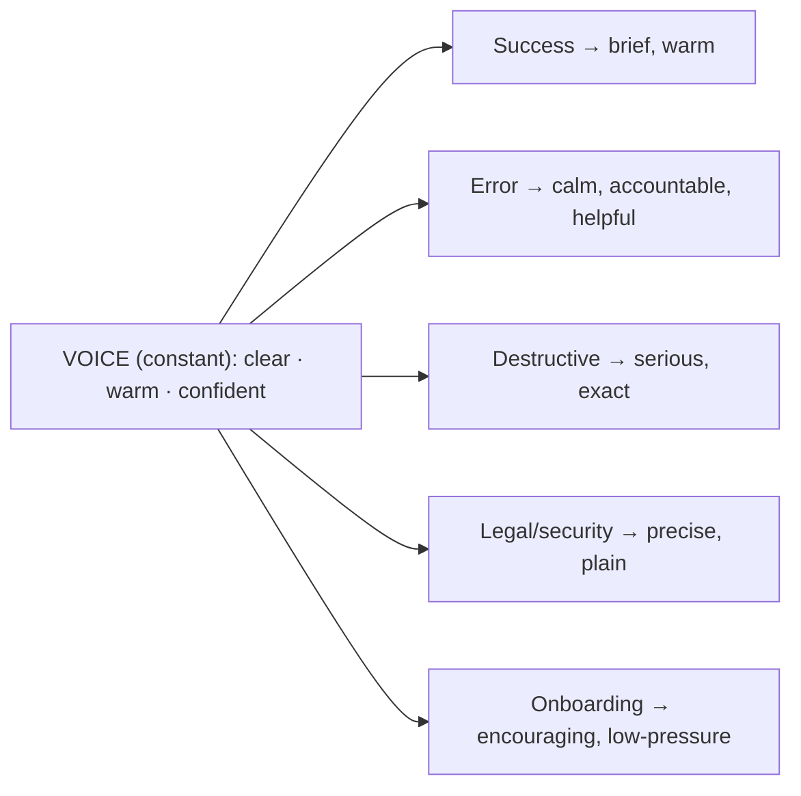

# 25 — Copywriting (UX Writing & Content Design)

### Words Are the Interface

> *"Users don't read your interface — they read your words. The label on the button, the sentence in the error, the empty state's one line: that IS the product to them. Content is design."*

---

**Chapter type:** Phase 5 — Experience & Interaction
**DRI:** Technical Writer + Brand Strategist (joint)
**Depends on:** [`00-CONSTITUTION.md`](./00-CONSTITUTION.md), [`03`](./03-BRAND_STRATEGY.md), [`05`](./05-VISUAL_PSYCHOLOGY.md), [`13`](./13-FORM_DESIGN.md), [`22`](./22-ACCESSIBILITY.md)
**Feeds:** [`12`](./12-BUTTON_DESIGN.md), [`17`](./17-LANDING_PAGE_DESIGN.md), [`26`](./26-USER_EXPERIENCE.md), [`36`](./36-SEO.md)

---

## Table of Contents
1. [Purpose](#1-purpose)
2. [Philosophy](#2-philosophy)
3. [Principles](#3-principles)
4. [Best Practices](#4-best-practices)
5. [Anti-Patterns](#5-anti-patterns)
6. [Real-World Examples](#6-real-world-examples)
7. [Common Mistakes](#7-common-mistakes)
8. [AI Implementation Guidance](#8-ai-implementation-guidance)
9. [Human Review Checklist](#9-human-review-checklist)
10. [Automation Opportunities](#10-automation-opportunities)
11. [References for Further Study](#11-references-for-further-study)
12. [Review Checklist & Measurable Quality Criteria](#12-review-checklist--measurable-quality-criteria)

---

## 1. Purpose

This chapter defines how the studio writes the words *inside* a product — **UX writing / content design**: button labels, form hints and errors, empty states, tooltips, onboarding, confirmations, notifications, and microcopy — as well as the principles that govern longer-form product and marketing copy. It carries the brand voice ([`03`](./03-BRAND_STRATEGY.md)) into every string a user reads and makes copy a first-class design material, not an afterthought bolted on before launch.

Words are one of the highest-leverage, lowest-cost improvements available: rewriting a confusing error or a vague button can lift comprehension and conversion more than a visual redesign. Copy is also where accessibility (plain language, [`22`](./22-ACCESSIBILITY.md)), brand ([`03`](./03-BRAND_STRATEGY.md)), and ethics (honest, non-manipulative language, Article III) all meet the user directly.

---

## 2. Philosophy

**Content is design, not decoration.** The label, the empty state, the error — these are not "copy to fill in later"; they are core interaction design. A perfect layout with the word "Submit" on its primary button is worse than a plain layout with "Create my account." Words carry the meaning, set expectations, and drive action. Treating copy as a final-hour task ("lorem ipsum until launch") guarantees a product that looks designed but *reads* like an afterthought (Article VII).

**Clarity is the highest virtue; brevity serves clarity.** The user is busy, distracted, and scanning ([`05`](./05-VISUAL_PSYCHOLOGY.md)). Good UX writing is *clear first, short second, clever last (if ever)*. Every unnecessary word is friction; every ambiguous word is a support ticket. We write for a scanning, stressed reader, in plain language, at a low reading level — not because users are unintelligent, but because their attention is elsewhere and their goal is to get something done.

**Words carry the brand — consistently or not at all.** Voice is constant, tone adapts ([`03`](./03-BRAND_STRATEGY.md) voice-vs-tone). The personality established in brand strategy must show up in the *actual strings* — contractions, warmth, directness — operationalized into rules a writer (or agent) can apply and a reviewer can check. Terminology must be consistent (one canonical word per concept, [`03`](./03-BRAND_STRATEGY.md) dictionary): if it's a "project," it's never sometimes a "workspace." Inconsistent words are inconsistent thinking.

**Honest words, always.** Copy is where dark patterns often live: confirmshaming ("No thanks, I like paying full price"), fake urgency, buried consequences, guilt-tripping. The studio writes *honestly* — clear about what will happen, what it costs, and how to say no (Article I, III; [`05`](./05-VISUAL_PSYCHOLOGY.md) Persuasion Ethics Test). Never blame the user, never trick them, never hide the truth in the fine print.

---

## 3. Principles

### Principle 1 — Clarity above all
If a user can misread it, rewrite it. Clear beats clever beats cute.
> *Rationale (Art. I, [`05`](./05-VISUAL_PSYCHOLOGY.md)):* Confusion = errors, abandonment, support load.

### Principle 2 — Write for a scanning, stressed reader
Front-load meaning; short sentences; low reading level (aim ~grade 6–8); one idea per line.
> *Rationale ([`05`](./05-VISUAL_PSYCHOLOGY.md)):* People skim; heavy prose is skipped.

### Principle 3 — Action labels are specific verbs
Buttons/links say what happens (verb + object): "Create account," "Delete 3 files" — never "Submit/OK/Click here."
> *Rationale ([`12`](./12-BUTTON_DESIGN.md)):* The label is the promise of the outcome.

### Principle 4 — Voice constant, tone contextual
One brand voice; adapt tone to the moment (celebration vs. error vs. legal).
> *Rationale ([`03`](./03-BRAND_STRATEGY.md)):* Consistent identity, appropriate emotion.

### Principle 5 — Consistent terminology
One canonical term per concept, everywhere (UI, docs, API), per the brand dictionary.
> *Rationale (Art. V, [`03`](./03-BRAND_STRATEGY.md)):* Term drift confuses users and rots IA.

### Principle 6 — Errors: say what's wrong, why, and how to fix it — kindly
Never blame the user; be specific and offer the next step.
> *Rationale (Art. VI, [`13`](./13-FORM_DESIGN.md)):* Blaming/vague errors strand users.

### Principle 7 — Honest, non-manipulative language
No confirmshaming, fake urgency, buried costs, or guilt. Make declining easy and clear.
> *Rationale (Art. III, [`05`](./05-VISUAL_PSYCHOLOGY.md)):* Manipulative copy is a banned dark pattern.

### Principle 8 — Plain, inclusive, accessible language
Avoid jargon, idioms that don't translate, and ableist/exclusionary terms; write for global + AT users.
> *Rationale (Art. III, [`22`](./22-ACCESSIBILITY.md)):* Plain language is an accessibility + inclusion requirement.

### Principle 9 — Design content for all states
Write empty, loading, error, success, and edge-case copy — not just the happy path.
> *Rationale ([`04`](./04-DESIGN_PHILOSOPHY.md) P6):* Real products live in the non-ideal states.

---

## 4. Best Practices

### 4.1 The microcopy state kit (write these for every feature)
| Moment | Job | Example (voice: clear, warm) |
| --- | --- | --- |
| **Button/label** | promise the outcome | "Create account" · "Delete project" |
| **Empty state** | explain + invite first action | "No projects yet. Create your first — it takes about a minute." |
| **Loading** | reassure | "Setting things up…" (only if noticeably slow) |
| **Success** | confirm, briefly | "Project created." |
| **Error (our fault)** | own it, offer next step | "Something went wrong on our end. Try again in a moment." |
| **Error (input)** | specific, kind, fixable | "That email doesn't look right — check for a typo." |
| **Destructive confirm** | state exact consequence | "This permanently deletes 3 projects. This can't be undone." |
| **Tooltip/hint** | reduce uncertainty | "Only you can see this until you publish." |

### 4.2 Action labels: verb + object
```
❌ Submit        → ✅ Create account
❌ OK            → ✅ Delete project   (destructive confirm matches the action)
❌ Click here    → ✅ View pricing
❌ Yes / No      → ✅ Keep editing / Discard changes
```
Confirm-dialog buttons restate the *specific* action, so a user reading only the buttons still understands the choice.

### 4.3 Error message formula
> **[What happened] + [why, if useful] + [how to fix / next step]** — never blame.

- ❌ "Invalid input." → ✅ "Enter a date in the future — this one has already passed."
- ❌ "Error 402." → ✅ "Your payment didn't go through. Check your card details and try again."
- ❌ "You entered the wrong password." → ✅ (login) "That email or password is incorrect." (also more secure — doesn't reveal which; [`13`](./13-FORM_DESIGN.md), [`37`](./37-SECURITY.md))

### 4.4 The tone matrix (voice constant; tone adapts) — from [`03`](./03-BRAND_STRATEGY.md)


### 4.5 Plain-language rules
- Prefer short, common words ("use" not "utilize"; "help" not "facilitate").
- Active voice ("We saved your changes" > "Your changes have been saved" where a subject helps clarity).
- Sentence case for UI (easier to read than Title Case or ALL CAPS).
- Expand or avoid unexplained acronyms/jargon.
- Numbers as numerals in UI ("3 items"); be specific ("in 2 minutes" > "soon").
- Target ~grade 6–8 reading level for core UI (measure it, §10).

### 4.6 Inclusive & global-ready language
- Avoid idioms/metaphors that don't translate ("hit it out of the park," "piece of cake").
- Avoid ableist terms ("crazy," "lame," "blind to," "sanity check") — pick neutral alternatives.
- Gender-neutral by default ("they," role nouns).
- Design for **i18n**: expandable strings (German ~+30%), no concatenation of sentence fragments, externalized strings, RTL-aware ([`21`](./21-RESPONSIVE_DESIGN.md)).

### 4.7 Honest persuasion (marketing + product) ([`05`](./05-VISUAL_PSYCHOLOGY.md), [`17`](./17-LANDING_PAGE_DESIGN.md))
- Benefits over features, but **true** benefits (specific, verifiable).
- Decline options are neutral and easy ("No thanks" — never "No, I don't want to save money").
- Costs, terms, and consequences are stated plainly, up front — never buried.
- Run every persuasive string through the Persuasion Ethics Test.

### 4.8 Process & governance
Write copy *with* the design (not after); keep a **content style guide** + terminology dictionary in the repo ([`03`](./03-BRAND_STRATEGY.md)); externalize strings for translation and reuse; review copy in code review ([`46`](./46-CODE_REVIEW.md)).

---

## 5. Anti-Patterns

| Anti-pattern | Why it fails | Principle |
| --- | --- | --- |
| **Lorem ipsum until launch** | Copy designed last = reads like an afterthought. | §2, P9 |
| **Vague labels** ("Submit/OK/Click here") | User doesn't know the outcome. | P3 |
| **Jargon / clever-over-clear** | Confuses; excludes; impresses no one who's stuck. | P1, P8 |
| **Blaming errors** ("You entered invalid data") | Feels hostile; doesn't help fix it. | P6 |
| **Vague errors** ("Something went wrong") with no next step | Strands the user. | P6 |
| **Terminology drift** (workspace/board/project) | Confusion; IA rot. | P5 |
| **Confirmshaming / guilt copy** | Manipulative; banned dark pattern. | P7, Art. III |
| **Fake urgency / buried costs in copy** | Deceptive; erodes trust. | P7, Art. III |
| **Ableist/idiomatic/untranslatable language** | Excludes users; breaks i18n. | P8 |
| **Happy-path-only content** | Empty/error/edge states unwritten. | P9 |
| **Concatenated strings** for i18n | Breaks in other languages. | 4.6 |

---

## 6. Real-World Examples

### Example A — "Submit" → "Create account" (label as outcome)
A signup form's primary button said "Submit." Users hesitated ("submit *what*?"). Changing it to **"Create account"** — stating the exact outcome — measurably improved completion and reduced hesitation, at zero engineering cost. *The label is the promise (Principle 3; [`12`](./12-BUTTON_DESIGN.md)).*

### Example B — The error that stopped blaming
A form showed "You entered an invalid phone number." Users felt scolded and often still didn't know the fix. Rewritten with the formula (4.3): **"Add your area code — we need a 10-digit number like 415-555-0134."** Specific, kind, and *actionable*. Error-related drop-off fell. *Say what's wrong and how to fix it, kindly (Principle 6).*

### Example C — Rejecting confirmshaming
Growth proposed a newsletter modal whose decline button read *"No thanks, I don't want to grow my business."* It failed the Persuasion Ethics Test (guilt/manipulation) — **rejected** (Article III). The neutral **"No thanks"** with a genuinely compelling one-line benefit above it performed nearly as well on sign-ups *and* preserved trust and brand warmth. *Honest words, always (Principle 7; [`05`](./05-VISUAL_PSYCHOLOGY.md)).*

---

## 7. Common Mistakes

- **Treating copy as post-design filler** rather than a design input.
- **Generic action labels** ("Submit/OK") that hide the outcome.
- **Writing for yourself** (jargon, insider terms) instead of a first-time, scanning user.
- **Blaming or vague errors** with no path to resolution.
- **Terminology drift** across UI/docs/API.
- **Only writing the happy path** — empty/error/edge copy missing.
- **Manipulative decline/urgency copy** that trades trust for a metric.
- **Idioms/ableist terms/concatenated strings** that break inclusion and translation.

---

## 8. AI Implementation Guidance

Copy is one of the highest-value, and subtlest, things AI generates — tone and honesty are easy to get *almost* right and wrong in important ways.

### 8.1 Where agents help
- **Generate on-voice microcopy** for all states (given the voice rules + terminology dictionary from [`03`](./03-BRAND_STRATEGY.md)).
- **Rewrite** vague labels and blaming/vague errors into specific, kind, actionable copy.
- **Audit** strings against voice, tone-by-context, terminology, reading level, inclusive-language, and dark-pattern checks.
- **Prepare copy for i18n** (externalize, avoid concatenation, flag expansion risks).

### 8.2 Hard rules (Art. I, III, V)
- The agent must be **given the voice rules + terminology dictionary**; it does not invent a brand voice silently.
- **Action labels = verb + object**; never "Submit/OK/Click here."
- **Errors** follow the formula (what/why/how-to-fix), **never blame** the user.
- **No dark-pattern copy** — the agent refuses confirmshaming/fake-urgency/buried-cost language and runs the Persuasion Ethics Test; decline options are neutral.
- **Plain, inclusive language** (target reading level; no ableist/idiomatic/untranslatable phrasing); **consistent terminology**.
- Writes copy for **all states**, not just success; strings are **i18n-ready**.

### 8.3 Prompt example — generate microcopy
```
ROLE: UX Writer, bound by 00-CONSTITUTION + 25 (+ 03 voice/terminology).
BRAND VOICE: clear, warm, confident. RULES: contractions on; never blame the user;
errors offer a next step; success ≤ 8 words. TERMINOLOGY: "project" (not board/workspace).
TASK: Write copy for these states of <feature>: button label, empty, loading, success,
input error, our-fault error, destructive confirm, one tooltip.
CONSTRAINTS: verb+object labels; error formula (what/why/fix); reading level ≤ grade 8;
inclusive + i18n-ready (no idioms/concatenation); tone matched per context.
OUTPUT: table {state, tone, copy}. Flag any place a brand rule conflicts. Refuse any dark-pattern phrasing.
```

### 8.4 Prompt example — audit
```
TASK: Audit these UI strings for: vague labels (Submit/OK/Click here), blaming/vague errors,
terminology drift, dark-pattern copy (confirmshaming/fake urgency/buried cost), jargon/ableist/
idiomatic language, reading level > grade 8, and concatenated i18n strings.
Output {string, issue, rule/WCAG or ethics ref, rewrite}. Don't rewrite compliant strings.
```

---

## 9. Human Review Checklist

- [ ] Copy was written **with** the design (no lorem-ipsum-until-launch); **all states** have copy.
- [ ] **Action labels** are specific verbs (verb + object), matching the outcome.
- [ ] **Errors** say what's wrong, why, and how to fix it — **kindly, never blaming**.
- [ ] **Voice** is consistent; **tone** matches each context (success/error/destructive/legal/onboarding).
- [ ] **Terminology** is consistent with the dictionary across UI/docs/API.
- [ ] **Plain language** at target reading level; sentence case; specific (numbers, times).
- [ ] **Inclusive + global-ready**: no ableist/idiomatic terms; i18n-safe (no concatenation; expansion allowed).
- [ ] **Honest**: no confirmshaming/fake urgency/buried costs; decline options neutral and easy.
- [ ] Copy is **accessible** (clear labels for AT; not relying on visual context alone).

---

## 10. Automation Opportunities

| Task | Automation |
| --- | --- |
| Reading level | Automated readability scoring (Flesch-Kincaid) on UI strings; flag > target. |
| Terminology | Lint/CI flagging banned/off-canonical terms ([`03`](./03-BRAND_STRATEGY.md)). |
| Vague-label lint | Flag "Submit/OK/Click here" in buttons/links. |
| Dark-pattern copy scan | LLM audit vs. the [`05`](./05-VISUAL_PSYCHOLOGY.md) catalog on conversion strings. |
| Inclusive language | Linter for ableist/exclusionary terms; suggest alternatives. |
| i18n readiness | Detect concatenated strings, hardcoded copy, missing externalization. |
| Voice/tone audit | LLM check of strings against voice rules + tone matrix. |
| Error-formula check | Flag error strings lacking a next step / that blame the user. |

---

## 11. References for Further Study
- **Content design/UX writing:** Torrey Podmajersky, *Strategic Writing for UX*; Kinneret Yifrah, *Microcopy: The Complete Guide*; Nicely Said (Kissane & Redish).
- **Plain language & voice:** GOV.UK content style guide and plain-language guidance; the voice-and-tone practice popularized by public content guides (as a *reference pattern*, not to copy).
- **Inclusive language:** major style guides' inclusive/accessible-writing sections; conscious-language references.
- **Ethics:** deceptive-patterns catalog on manipulative copy ([`05`](./05-VISUAL_PSYCHOLOGY.md)).
- **Cross-references:** [`03-BRAND_STRATEGY.md`](./03-BRAND_STRATEGY.md), [`12-BUTTON_DESIGN.md`](./12-BUTTON_DESIGN.md), [`13-FORM_DESIGN.md`](./13-FORM_DESIGN.md), [`17-LANDING_PAGE_DESIGN.md`](./17-LANDING_PAGE_DESIGN.md), [`22-ACCESSIBILITY.md`](./22-ACCESSIBILITY.md), [`26-USER_EXPERIENCE.md`](./26-USER_EXPERIENCE.md).

---

## 12. Review Checklist & Measurable Quality Criteria

| Criterion | Target |
| --- | --- |
| Action labels that are specific verbs | 100% (no Submit/OK/Click here) |
| Error messages following the formula (no blame) | 100% |
| Terminology-dictionary compliance (UI/docs/API) | ≥ 98% |
| Core UI reading level | ≤ grade 8 |
| Dark-pattern copy instances | 0 (floor, Art. III) |
| Ableist/exclusionary terms | 0 |
| Features with all-state copy (empty/error/etc.) | 100% |
| i18n-ready strings (externalized, no concatenation) | 100% |

---

*End of `25-COPYWRITING.md`.*
