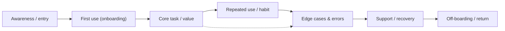

# 26 — User Experience (UX)

### Usability, Mental Models, and the Whole Journey

> *"UX is not a screen or a feature. It is the entire felt experience of trying to get something done — including the parts that happen in the user's head, and the parts where things go wrong."*

---

**Chapter type:** Phase 5 — Experience & Interaction
**DRI:** UX Researcher + Product Designer (joint)
**Depends on:** [`00-CONSTITUTION.md`](./00-CONSTITUTION.md), [`01`](./01-PROJECT_DISCOVERY.md), [`05`](./05-VISUAL_PSYCHOLOGY.md), [`22`](./22-ACCESSIBILITY.md)–[`25`](./25-COPYWRITING.md)
**Feeds:** [`27-INFORMATION_ARCHITECTURE.md`](./27-INFORMATION_ARCHITECTURE.md), [`28-WIREFRAMING.md`](./28-WIREFRAMING.md), [`29-USER_FLOWS.md`](./29-USER_FLOWS.md), all product surfaces (16–19)

---

## Table of Contents
1. [Purpose](#1-purpose)
2. [Philosophy](#2-philosophy)
3. [Principles](#3-principles)
4. [Best Practices](#4-best-practices)
5. [Anti-Patterns](#5-anti-patterns)
6. [Real-World Examples](#6-real-world-examples)
7. [Common Mistakes](#7-common-mistakes)
8. [AI Implementation Guidance](#8-ai-implementation-guidance)
9. [Human Review Checklist](#9-human-review-checklist)
10. [Automation Opportunities](#10-automation-opportunities)
11. [References for Further Study](#11-references-for-further-study)
12. [Review Checklist & Measurable Quality Criteria](#12-review-checklist--measurable-quality-criteria)

---

## 1. Purpose

This chapter defines how the studio thinks about and improves **user experience as a whole** — the usability heuristics, mental-model alignment, journey mapping, error prevention, and research/evaluation methods that make the difference between a product that *works* and one that *works for people*. Where the surface chapters (16–19) apply UX to specific product types and the interaction chapters (22–25) refine specific moments, this chapter is the connective discipline: the study of the *entire journey* and the standards it must meet.

UX is the operationalization of Constitution **Article I** (the user is the point) and **Article II** (usability sits high in the quality hierarchy). It gives the studio a shared vocabulary (heuristics), shared methods (research + evaluation), and a shared bar (measurable usability) so that "good UX" is a defined, checkable standard rather than a matter of taste.

---

## 2. Philosophy

**UX is the sum of the whole journey, not the quality of individual screens.** A user's experience spans discovery, first use, daily use, errors, edge cases, support, and off-boarding — much of it *between* screens and *inside their head*. A product can have beautiful screens and terrible UX if the *flow* between them is confusing, if the mental model is wrong, or if recovery from error is painful. We design and evaluate journeys, not just artifacts ([`29`](./29-USER_FLOWS.md)).

**Match the system to the user's mental model, not the other way around.** Users arrive with expectations formed by every other product they've used and by how they think about the task in the real world (Jakob's Law: users spend most of their time on *other* sites, so they expect yours to work like those). Fighting the mental model — clever-but-unfamiliar navigation, reinvented controls — forces users to learn instead of do. Great UX feels "intuitive," which simply means *it matched what was already in the user's head* ([`05`](./05-VISUAL_PSYCHOLOGY.md), Article V).

**Usability is not opinion; it is observable and measurable.** Whether people can complete a task, how long it takes, how many errors they make, how they feel — these are *observable*. We replace "I think users will…" with "we watched users…" (Article X). Nielsen's heuristics give a shared evaluation language; task-based usability testing gives evidence; metrics (success rate, time-on-task, error rate, SUS) give a bar. Taste guides; evidence decides.

**Prevent errors first; forgive them always.** The best error message is the one that never had to appear (Article-III-adjacent: safety and correctness). We design to prevent mistakes (constraints, confirmations for the dangerous, good defaults), and when errors happen, we make recovery obvious, cheap, and blame-free ([`13`](./13-FORM_DESIGN.md), [`25`](./25-COPYWRITING.md)). Reversibility (undo) usually beats prevention-by-friction.

---

## 3. Principles

*(Principles 1–10 are the studio's adaptation of Nielsen's 10 usability heuristics; 11–13 extend them.)*

### Principle 1 — Visibility of system status
Always show what's happening (loading, saved, progress, current location) with timely feedback.
> *Rationale ([`24`](./24-MICRO_INTERACTIONS.md)):* Uncertainty breeds distrust and errors.

### Principle 2 — Match between system and the real world
Use users' language and concepts; follow real-world and platform conventions.
> *Rationale ([`05`](./05-VISUAL_PSYCHOLOGY.md), [`25`](./25-COPYWRITING.md)):* Familiar = learnable.

### Principle 3 — User control and freedom
Provide undo/redo, easy exits, and clear "back out" paths; don't trap users.
> *Rationale (Art. I):* People make mistakes and change their minds.

### Principle 4 — Consistency and standards
Same things look/behave the same; follow platform and internal conventions ([`14`](./14-COMPONENT_LIBRARY.md)).
> *Rationale (Art. V):* Consistency is learnability.

### Principle 5 — Error prevention
Design out mistakes (constraints, good defaults, confirmations for destructive actions) before handling them.
> *Rationale:* Prevented errors cost nothing.

### Principle 6 — Recognition over recall
Show options and context; don't force users to remember across steps.
> *Rationale ([`05`](./05-VISUAL_PSYCHOLOGY.md)):* Recognition is cheap; recall is costly.

### Principle 7 — Flexibility and efficiency of use
Serve novices *and* experts (progressive disclosure + accelerators like shortcuts) ([`18`](./18-SAAS_DESIGN.md)).
> *Rationale:* One design must fit a range of expertise.

### Principle 8 — Aesthetic and minimalist design
Every element competes for attention; remove the non-essential ([`04`](./04-DESIGN_PHILOSOPHY.md)).
> *Rationale:* Clutter raises cognitive load.

### Principle 9 — Help users recognize, diagnose, and recover from errors
Clear, kind, actionable error messages ([`25`](./25-COPYWRITING.md)).
> *Rationale (Art. VI):* Users must be able to get unstuck.

### Principle 10 — Help and documentation
Provide contextual help where needed; ideal is a product so clear it's rarely needed.
> *Rationale:* Help is a safety net, not a substitute for clarity.

### Principle 11 — Decisions are evidence-based
Resolve UX debates with research/testing/metrics, not seniority or opinion.
> *Rationale (Art. X):* Evidence over opinion.

### Principle 12 — Design the whole journey, including edges
Map and design the end-to-end experience: first use, errors, empty, edge, off-boarding.
> *Rationale ([`04`](./04-DESIGN_PHILOSOPHY.md) P6, [`29`](./29-USER_FLOWS.md)):* The journey, not the screen, is the unit.

### Principle 13 — Accessibility is inseparable from UX
An experience that excludes people is bad UX, full stop ([`22`](./22-ACCESSIBILITY.md), Art. III).
> *Rationale:* "Usable" must mean usable by everyone.

---

## 4. Best Practices

### 4.1 Map the journey before designing screens

For each stage capture: the user's **goal**, **actions**, **thoughts/emotions**, **pain points**, and **opportunities**. A journey map surfaces the between-screen problems that screen-by-screen design misses.

### 4.2 Build on personas & JTBD from Discovery
Ground UX decisions in the real primary user and their Job To Be Done ([`01`](./01-PROJECT_DISCOVERY.md)). "For whom, doing what, in what context" precedes every design choice.

### 4.3 Run heuristic evaluation (fast, cheap, expert)
Have 2–3 evaluators independently rate the product against Principles 1–10, log issues with severity (0 cosmetic → 4 catastrophe), then consolidate. A structured expert review finds a large share of issues before you spend on user testing.

**Severity scale:**
| # | Meaning | Action |
| --- | --- | --- |
| 0 | Not a problem | — |
| 1 | Cosmetic | fix if time |
| 2 | Minor | low priority |
| 3 | Major | high priority |
| 4 | Catastrophe | must fix before release |

### 4.4 Test with real users (the gold standard)
- **~5 users per round** surfaces the majority of major issues; iterate in rounds.
- **Task-based:** give realistic tasks, watch (don't help), note where they struggle.
- **Think-aloud** reveals the mental model.
- **Moderated** (deep, early) vs. **unmoderated** (scale, later).
- Test **early and often** on prototypes ([`28`](./28-WIREFRAMING.md)) — cheaper than testing production.

### 4.5 Measure usability
| Metric | What it tells you |
| --- | --- |
| **Task success rate** | Can people actually do it? |
| **Time-on-task** | How efficient? |
| **Error rate** | How error-prone? |
| **SUS (System Usability Scale)** | Perceived usability (benchmarkable, ~68 = average) |
| **NPS / CSAT** | Satisfaction (directional) |
| **Funnel drop-off** | Where the journey leaks ([`02`](./02-PRODUCT_STRATEGY.md)) |

### 4.6 Reduce cognitive load ([`05`](./05-VISUAL_PSYCHOLOGY.md))
Chunk tasks, use progressive disclosure, provide sensible defaults, minimize choices at decision points (Hick), favor recognition (Principle 6). Every removed decision is a gift.

### 4.7 Prevent and forgive errors
- **Prevent:** constraints (date pickers can't pick invalid dates), confirmations for destructive actions, inline validation ([`13`](./13-FORM_DESIGN.md)).
- **Forgive:** undo windows (often better than confirm dialogs, [`12`](./12-BUTTON_DESIGN.md)), autosave, no data loss (Art. I/III), clear recovery paths.

### 4.8 Close the loop (continuous UX)
Feed analytics, support tickets, and research back into a prioritized backlog ([`50`](./50-CONTINUOUS_IMPROVEMENT.md)). UX is never "done"; it's monitored and improved.

---

## 5. Anti-Patterns

| Anti-pattern | Why it fails | Principle |
| --- | --- | --- |
| **Designing screens, not journeys** | Between-screen/mental-model problems ship. | P12 |
| **Fighting the mental model** (novel nav/controls for novelty) | Forces learning; feels "unintuitive." | P2, P4 |
| **No system status** (silent loads/actions) | Uncertainty; double-actions. | P1 |
| **Trapping the user** (no exit/undo, roach motels) | Frustration; distrust. | P3, Art. III |
| **Inconsistent patterns** across the app | Re-learning every screen. | P4 |
| **Handling errors instead of preventing them** | Avoidable failures reach users. | P5 |
| **Recall-heavy flows** (re-enter info, memorize codes) | Cognitive burden; errors. | P6 |
| **One-size design** (only novices *or* only experts) | Alienates half the audience. | P7 |
| **Opinion-driven UX** ("the CEO prefers…") | Wrong calls; unresolvable debates. | P11, Art. X |
| **A11y treated as separate from UX** | Excludes users; incomplete UX. | P13 |
| **Research theater** (testing that never changes anything) | Wastes effort; false confidence. | P11 |

---

## 6. Real-World Examples

### Example A — The journey map that found the real problem
A team obsessed over polishing the checkout *screen* while conversion stayed flat. A **journey map** revealed the leak was *before* checkout: users couldn't tell if items were in stock, so they abandoned at the product page. Fixing status visibility (Principle 1) on the PDP — not the checkout — recovered the conversions. *The problem was between the screens (Principle 12).*

### Example B — Jakob's Law beats cleverness
A startup built a "novel," gesture-driven navigation it was proud of. Usability testing (Principle 11) showed users couldn't find basic sections — they kept looking for a conventional nav. Reverting to a **familiar, standard navigation** (Principle 2/4) doubled task success. The clever nav wasn't wrong because it was ugly; it was wrong because it **fought the mental model**.

### Example C — Undo beat the confirmation dialog (recap, UX lens)
An app guarded every delete with a confirm dialog; power users found it tedious and *still* occasionally deleted the wrong thing. Switching to **optimistic delete + a 7-second Undo** (Principles 3, 5) was faster *and* safer — fewer interruptions, full recoverability. *Reversibility often beats friction (Article III; [`12`](./12-BUTTON_DESIGN.md)).*

---

## 7. Common Mistakes

- **Polishing individual screens** while the journey between them leaks.
- **Assuming you are the user** — designing for your own mental model, not theirs.
- **Skipping research** or doing "research theater" that never changes decisions.
- **Reinventing conventions** for novelty (violating Jakob's Law).
- **Silent system** — no feedback on status/actions.
- **Confirm-dialog everything** instead of preventing errors + offering undo.
- **Recall-heavy flows** that force memory across steps.
- **Treating accessibility as a separate track** from UX.
- **Measuring nothing** — no usability baseline, so no way to know if changes help.

---

## 8. AI Implementation Guidance

### 8.1 Where agents help
- **Generate journey maps** and flow diagrams from a described product/persona (to react to).
- **Run heuristic evaluations** against Principles 1–10 with severity ratings.
- **Draft usability test plans + tasks**; synthesize findings from *real* session notes.
- **Audit** flows for status visibility, dead-ends, recall burden, error-prevention gaps, and consistency.
- **Propose error-prevention + recovery** patterns (undo, constraints, defaults).

### 8.2 Hard rules (Art. I, X, III)
- The agent grounds UX proposals in the **real persona/JTBD** ([`01`](./01-PROJECT_DISCOVERY.md)); it does not invent users or research findings (Art. X) — absent evidence, it says so and recommends a test.
- Proposals **respect established mental models/conventions** (Jakob's Law); novelty must be justified (Art. V/XII).
- Every flow it designs has **status visibility, exits/undo, error prevention, and recognition-over-recall**, and meets the **accessibility floor** ([`22`](./22-ACCESSIBILITY.md)).
- It designs the **whole journey** (incl. errors/edges/empty), not just the happy path.
- It presents **measurable success criteria** (success rate/time/errors) for what it proposes.

### 8.3 Prompt example — journey + heuristic evaluation
```
ROLE: UX Researcher, bound by 00-CONSTITUTION + 26.
INPUT: product = <x>; primary persona + JTBD (from 01); current flow.
TASK:
  1. Map the end-to-end journey (goal/actions/thoughts/pain/opportunity per stage), incl. errors/edges.
  2. Heuristic evaluation against Nielsen's 10 (Principles 1–10) with severity 0–4 + fix per issue.
  3. Flag mental-model conflicts (Jakob's Law) and recall-heavy/dead-end/no-status spots.
  4. Propose error-prevention + recovery (undo/constraints/defaults).
CONSTRAINTS: don't invent research; mark inferences [INFERENCE]; meet the a11y floor.
OUTPUT: journey map + prioritized issue list (severity) + recommendations + measurable success criteria.
```

### 8.4 Prompt example — test plan
```
TASK: Draft a task-based usability test plan for <flow>: 5 realistic tasks, success criteria per task,
what to observe, moderated vs unmoderated, and the metrics to capture (success rate, time, errors, SUS).
Then, from the attached REAL session notes, synthesize findings by severity. Do not fabricate observations.
```

---

## 9. Human Review Checklist

- [ ] The **whole journey** is mapped and designed (first use → core task → errors/edges → recovery → return), not just screens.
- [ ] Design **matches the user's mental model** and follows conventions (Jakob's Law); novelty is justified.
- [ ] **System status** is always visible; feedback is timely.
- [ ] Users have **control/freedom** (exits, undo); no traps/dead-ends.
- [ ] **Consistency** across the product ([`14`](./14-COMPONENT_LIBRARY.md)).
- [ ] Errors are **prevented** where possible and **recoverable** (kind, actionable) where not.
- [ ] Flows favor **recognition over recall**; cognitive load minimized.
- [ ] Serves **novices and experts** (progressive disclosure + accelerators).
- [ ] Decisions backed by **evidence** (research/testing/metrics), not opinion.
- [ ] Meets the **accessibility floor** ([`22`](./22-ACCESSIBILITY.md)); a11y treated as part of UX.
- [ ] **Measurable success criteria** defined; a usability baseline exists.

---

## 10. Automation Opportunities

| Task | Automation |
| --- | --- |
| Behavior analytics | Funnel/drop-off, session replay, heatmaps to locate journey leaks. |
| Heuristic pre-screen | LLM heuristic pass on flows before human review. |
| Task-success tracking | Instrument key tasks; dashboard success rate/time/errors. |
| SUS/CSAT collection | In-product micro-surveys at journey milestones. |
| Dead-end/status audit | Static/heuristic scan for flows lacking feedback or exits. |
| A11y-in-UX | axe + keyboard tests wired into flow E2E ([`22`](./22-ACCESSIBILITY.md)). |
| Research repository | Tagged, searchable store of findings feeding the backlog ([`50`](./50-CONTINUOUS_IMPROVEMENT.md)). |

---

## 11. References for Further Study
- **Heuristics & usability:** Jakob Nielsen's 10 usability heuristics; *Usability Engineering*; NN/g articles (severity, 5-user testing, Jakob's Law).
- **Foundational:** Don Norman, *The Design of Everyday Things* (mental models, affordances, feedback); Steve Krug, *Don't Make Me Think*.
- **Journey/service design:** journey-mapping and service-blueprint practice.
- **Research methods:** Rosenfeld/observational usability testing; SUS (Brooke) for measurable usability.
- **Cross-references:** [`01-PROJECT_DISCOVERY.md`](./01-PROJECT_DISCOVERY.md), [`05-VISUAL_PSYCHOLOGY.md`](./05-VISUAL_PSYCHOLOGY.md), [`22-ACCESSIBILITY.md`](./22-ACCESSIBILITY.md), [`27-INFORMATION_ARCHITECTURE.md`](./27-INFORMATION_ARCHITECTURE.md), [`29-USER_FLOWS.md`](./29-USER_FLOWS.md), [`50-CONTINUOUS_IMPROVEMENT.md`](./50-CONTINUOUS_IMPROVEMENT.md).

---

## 12. Review Checklist & Measurable Quality Criteria

| Criterion | Target |
| --- | --- |
| Core journeys mapped (not just screens) | 100% |
| Catastrophe/major (sev 3–4) heuristic issues at release | 0 |
| Flows with visible status + exits/undo | 100% |
| Established conventions followed (unjustified novelty) | 0 |
| Task success rate (core tasks) | ≥ 90% (target) |
| Usability tested before major release | Yes (≥5 users/round) |
| SUS score | ≥ 68 (above average); trend ↑ |
| Accessibility floor met | 100% ([`22`](./22-ACCESSIBILITY.md)) |

---

*End of `26-USER_EXPERIENCE.md`.*
