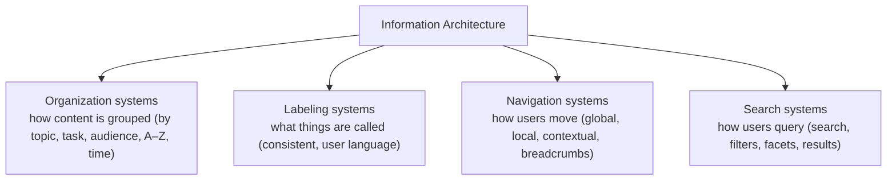

# 27 — Information Architecture (IA)

### Structure, Labeling, Navigation, and Findability

> *"If users can't find it, it doesn't exist. Information architecture is the invisible structure that decides whether your product feels obvious or like a maze."*

---

**Chapter type:** Phase 5 — Experience & Interaction
**DRI:** Information Architect + UX Researcher (joint)
**Depends on:** [`00-CONSTITUTION.md`](./00-CONSTITUTION.md), [`01`](./01-PROJECT_DISCOVERY.md), [`03`](./03-BRAND_STRATEGY.md), [`05`](./05-VISUAL_PSYCHOLOGY.md), [`26`](./26-USER_EXPERIENCE.md)
**Feeds:** [`28-WIREFRAMING.md`](./28-WIREFRAMING.md), [`29-USER_FLOWS.md`](./29-USER_FLOWS.md), [`09`](./09-LAYOUT_SYSTEM.md), [`36-SEO.md`](./36-SEO.md), [`42-FOLDER_STRUCTURE.md`](./42-FOLDER_STRUCTURE.md)

---

## Table of Contents
1. [Purpose](#1-purpose)
2. [Philosophy](#2-philosophy)
3. [Principles](#3-principles)
4. [Best Practices](#4-best-practices)
5. [Anti-Patterns](#5-anti-patterns)
6. [Real-World Examples](#6-real-world-examples)
7. [Common Mistakes](#7-common-mistakes)
8. [AI Implementation Guidance](#8-ai-implementation-guidance)
9. [Human Review Checklist](#9-human-review-checklist)
10. [Automation Opportunities](#10-automation-opportunities)
11. [References for Further Study](#11-references-for-further-study)
12. [Review Checklist & Measurable Quality Criteria](#12-review-checklist--measurable-quality-criteria)

---

## 1. Purpose

This chapter defines how the studio structures, labels, and organizes content and functionality so people can **find what they need and understand where they are** — the practice of information architecture. IA is the skeleton beneath navigation, taxonomy, labeling, search, and URL structure. It is largely invisible when done well and painfully obvious (as confusion, dead-ends, and support tickets) when done badly.

IA sits upstream of layout ([`09`](./09-LAYOUT_SYSTEM.md)), wireframing ([`28`](./28-WIREFRAMING.md)), and flows ([`29`](./29-USER_FLOWS.md)): you cannot lay out or wireframe a screen well until you know what belongs where and what it's called. It also directly shapes SEO ([`36`](./36-SEO.md)) and mirrors the thinking behind code folder structure ([`42`](./42-FOLDER_STRUCTURE.md)). Good IA is the difference between a product that scales gracefully to hundreds of features and one that collapses into an unnavigable pile.

---

## 2. Philosophy

**Findability is the whole point.** Peter Morville's maxim governs: *"You can't use what you can't find."* No feature, however brilliant, delivers value if users can't locate it. IA's job is to make everything findable — through structure (where things live), labeling (what they're called), navigation (how you move), and search (how you jump). A product's true feature set is not what it *has*, but what users can *find*.

**Organize around the user's mental model, not the org chart.** The single most common IA failure is structuring a product to mirror internal team boundaries or database tables rather than how users think about the domain (Conway's Law leaking into the UI). Users don't care that "Billing" and "Usage" are owned by different teams; they think "my account stuff." IA must reflect the *user's* categories and language ([`26`](./26-USER_EXPERIENCE.md), [`01`](./01-PROJECT_DISCOVERY.md)), discovered through research — not imposed from inside.

**Labels are decisions, and consistency is non-negotiable.** What you *call* things is as important as how you *group* them. A concept must have exactly one name, used everywhere (the terminology dictionary, [`03`](./03-BRAND_STRATEGY.md)). "Projects" in the nav, "workspaces" in the docs, and "boards" in the API is three names for one thing — guaranteed confusion. Labels should use the *user's* words (validated by research), not internal jargon or clever brand coinages that must be learned.

**Structure must scale and stay shallow.** IA is not a one-time decision; it must accommodate growth without collapsing. The tension is between **breadth** (many top-level options → choice overload) and **depth** (many levels → buried content, lost users). The craft is finding a structure that is broad enough to be shallow, shallow enough to be reachable, and flexible enough to grow — validated with real users, not guessed (Article X).

---

## 3. Principles

### Principle 1 — Findability is the goal
Optimize structure, labels, navigation, and search so users reach anything quickly.
> *Rationale:* "You can't use what you can't find."

### Principle 2 — Organize by the user's mental model
Group and name things as users think about them, discovered via research — not by the org chart or DB schema.
> *Rationale ([`26`](./26-USER_EXPERIENCE.md), Art. X):* Internal structure ≠ user structure.

### Principle 3 — Always answer "Where am I? Where can I go? How do I get back?"
Every screen shows location, options, and a way back (nav, breadcrumbs, active states).
> *Rationale ([`26`](./26-USER_EXPERIENCE.md) status/control):* Orientation prevents lostness.

### Principle 4 — Consistent, user-language labels
One canonical term per concept ([`03`](./03-BRAND_STRATEGY.md)); use words users use, validated by research.
> *Rationale (Art. V):* Label drift = confusion + IA rot.

### Principle 5 — Balance breadth and depth; keep it shallow
Avoid both too-many top-level options and too-deep burial; aim for reachability.
> *Rationale ([`05`](./05-VISUAL_PSYCHOLOGY.md) Hick/Miller):* Overload and burial both lose users.

### Principle 6 — Provide multiple wayfinding paths
Support browse (nav), search, and filters/facets — people find things differently.
> *Rationale:* Some users browse, some search; catalogs need faceting.

### Principle 7 — Validate structure with real users
Card sorting to build it; tree testing to prove it; analytics to monitor it.
> *Rationale (Art. X):* IA is a hypothesis until tested.

### Principle 8 — Structure is semantic and reflected in the URL/DOM
IA maps to semantic HTML, heading hierarchy, and clean, logical URLs.
> *Rationale ([`09`](./09-LAYOUT_SYSTEM.md), [`36`](./36-SEO.md), [`22`](./22-ACCESSIBILITY.md)):* Structure serves AT + SEO too.

---

## 4. Best Practices

### 4.1 The four IA systems (Rosenfeld & Morville)

Design all four deliberately; most IA failures are a neglected one (usually labeling or search).

### 4.2 Build the structure with card sorting
- **Open card sort:** users group content items and *name* the groups → reveals their mental model + label language.
- **Closed card sort:** users sort items into *your* predefined categories → validates a proposed structure.
- Run with representative users; look for consensus clusters and telling label choices.

### 4.3 Validate the structure with tree testing
Give users tasks ("where would you find how to cancel your plan?") on a **text-only tree** (no visual design) and measure: **success rate, directness (no backtracking), and time**. Tree testing isolates *structure* from *visual design* — proving the IA works before you wireframe.

### 4.4 Navigation systems
| Type | Role |
| --- | --- |
| **Global nav** | Top-level destinations, present everywhere (3–7 items ideal) |
| **Local nav** | Options within a section |
| **Contextual nav** | Links relevant to current content (related items) |
| **Breadcrumbs** | Show location in the hierarchy + path back (deep structures) |
| **Utility nav** | Account, search, help (secondary) |
| **Footer nav** | Comprehensive/overflow links, legal, sitemap |

Always show **active state** (where am I) and keep global nav consistent across the product.

### 4.5 Labeling
- One canonical term per concept, from the terminology dictionary ([`03`](./03-BRAND_STRATEGY.md)); enforce it in UI, docs, and API.
- Use **users' words** (validated), not internal jargon or unexplained brand coinages.
- Be specific and scannable; avoid clever labels that must be learned.
- Icons need labels (icon-only nav is a recall/accessibility risk, [`05`](./05-VISUAL_PSYCHOLOGY.md), [`22`](./22-ACCESSIBILITY.md)).

### 4.6 Search & faceted navigation (for content-heavy products)
- Prominent, forgiving search (typo tolerance, synonyms, useful empty/no-results states).
- **Facets/filters** for large catalogs (category, price, attributes) — the core wayfinding tool for e-commerce/catalogs ([`19`](./19-ECOMMERCE_DESIGN.md), [`16`](./16-DASHBOARD_DESIGN.md)).
- Clear result counts, sensible sort, filter state in the URL (shareable, [`31`](./31-NEXTJS_GUIDE.md)).

### 4.7 URL & semantic structure
- URLs mirror the IA: readable, hierarchical, stable (`/docs/billing/cancel` not `/p?id=8842`).
- Heading hierarchy (`h1`→`h2`→`h3`) reflects content structure ([`09`](./09-LAYOUT_SYSTEM.md), [`22`](./22-ACCESSIBILITY.md)).
- A sitemap (for SEO + user reference); handle faceted-URL duplication carefully ([`36`](./36-SEO.md)).

### 4.8 Scale gracefully
Design for growth: reserve room in the structure, prefer a shallow broad structure with search over deep nesting, and revisit IA as the product grows (card/tree tests again). Monitor analytics for "pogo-sticking" and failed searches — signals of IA breakdown.

---

## 5. Anti-Patterns

| Anti-pattern | Why it fails | Principle |
| --- | --- | --- |
| **Org-chart / DB-schema IA** | Mirrors internal structure, not user thinking. | P2 |
| **Label drift** (project/workspace/board) | Same concept, many names → confusion. | P4 |
| **Jargon/clever labels** | Users must learn them; findability drops. | P4 |
| **Too many top-level items** | Choice overload; nav becomes noise. | P5 |
| **Too-deep nesting** | Content buried; users lost. | P5 |
| **No breadcrumbs/active state in deep structures** | "Where am I?" unanswered. | P3 |
| **Menu cramming** as the product grows | Unnavigable; IA never revisited. | P5, P8 |
| **Search as an afterthought** | Content-heavy products become unusable. | P6 |
| **Icon-only navigation** | Recall burden; ambiguity; a11y gap. | P4, [`22`](./22-ACCESSIBILITY.md) |
| **Guessing the structure** (no card/tree testing) | Ships an untested hypothesis. | P7, Art. X |
| **Opaque URLs** (`?id=…`) | Bad for users, sharing, SEO. | P8 |

---

## 6. Real-World Examples

### Example A — Org-chart IA vs. user mental model
A B2B app's nav mirrored its internal teams: separate top-level "Billing," "Usage," "Provisioning," "Entitlements." Users were constantly lost — they thought in terms of "my account" and "my services." A **card sort** revealed the real mental model; regrouping into user categories ("Account," "Services," "Reports") with clearer labels cut navigation-related support tickets sharply. *Structure by mental model, not org chart (Principle 2).*

### Example B — Tree testing caught a failure before design
A team was about to wireframe a new help center based on a structure they were "sure" was intuitive. A quick **tree test** showed only ~40% could find "how to cancel." Reworking categories/labels and re-testing pushed success past 85% — *before a single screen was designed*. Testing structure in isolation saved weeks of building the wrong thing (Principle 7; [`26`](./26-USER_EXPERIENCE.md)).

### Example C — Terminology dictionary healed IA rot (recap, IA lens)
A product called one concept "folder," "collection," and "group" across UI/docs/API. New users were perpetually confused and search failed (they searched the "wrong" word). Adopting a **terminology dictionary** (canonical: "collection," everywhere) fixed navigation, search, *and* documentation coherence. *Labels are IA (Principle 4; [`03`](./03-BRAND_STRATEGY.md)).*

---

## 7. Common Mistakes

- **Structuring by internal teams/tech** instead of the user's mental model.
- **Skipping card sorting / tree testing** and shipping a guessed structure.
- **Inconsistent labels** across surfaces (UI/docs/API).
- **Jargon or clever coinages** users must learn.
- **Too broad or too deep** navigation; no balance.
- **Neglecting search/facets** on content-heavy products.
- **No breadcrumbs/active states** in deep hierarchies.
- **Never revisiting IA** as the product grows (menu cramming).
- **Opaque URLs** that don't reflect structure.

---

## 8. AI Implementation Guidance

### 8.1 Where agents help
- **Draft IA structures/taxonomies** and label sets from a content inventory + persona (to test, not to trust).
- **Generate card-sort item lists + tree-test task sets**; synthesize results from *real* participant data.
- **Audit** existing IA for label drift, org-chart structure, over-broad/deep nav, missing breadcrumbs/search, and opaque URLs.
- **Propose URL schemes + heading hierarchies** that mirror the IA (SEO + a11y aligned).
- **Enforce the terminology dictionary** across surfaces.

### 8.2 Hard rules (Art. V, X)
- The agent organizes by the **user's mental model**, not the org chart/DB — and states that any proposed structure is a **hypothesis to validate** (card/tree test), not a settled answer (Art. X).
- **Labels come from the terminology dictionary** ([`03`](./03-BRAND_STRATEGY.md)) and users' words; it flags drift and jargon.
- Structures answer **where-am-I / where-can-I-go / how-back** (nav + breadcrumbs + active states).
- It keeps navigation **balanced and shallow**; content-heavy products get **search + facets**.
- IA maps to **semantic headings + clean URLs** ([`22`](./22-ACCESSIBILITY.md), [`36`](./36-SEO.md)).

### 8.3 Prompt example — design & validate IA
```
ROLE: Information Architect, bound by 00-CONSTITUTION + 27.
INPUT: content inventory (attached); primary persona + JTBD (from 01); terminology dictionary (from 03).
TASK:
  1. Propose an organization scheme + labels based on the USER's mental model (flag it as a hypothesis).
  2. Provide a card-sort item list (open) + a closed-sort structure to validate labels/groups.
  3. Provide a tree-test task set (with success paths) to validate findability before design.
  4. Design the nav system (global/local/contextual/breadcrumbs) + URL scheme + heading hierarchy.
CONSTRAINTS: labels from the dictionary/user words; balanced+shallow; search+facets if content-heavy;
semantic + SEO-friendly URLs. Mark all structure as [TO VALIDATE].
OUTPUT: IA map + card/tree test artifacts + nav spec + URL/heading scheme.
```

### 8.4 Prompt example — audit
```
TASK: Audit the IA for: org-chart/DB-driven structure, label drift vs. the dictionary, jargon/clever
labels, too-broad or too-deep navigation, missing breadcrumbs/active states, absent/weak search+facets,
and opaque URLs. Output {location, issue, fix}, and recommend a card/tree test where structure is unproven.
```

---

## 9. Human Review Checklist

- [ ] Structure reflects the **user's mental model** (research-based), not the org chart/DB.
- [ ] **Labels** are consistent (terminology dictionary), use **users' words**, and avoid jargon.
- [ ] Every screen answers **where am I / where can I go / how do I get back** (nav + breadcrumbs + active state).
- [ ] Navigation is **balanced** (not too broad/deep) and **shallow/reachable**.
- [ ] **Multiple wayfinding paths** (browse + search + facets where needed).
- [ ] The structure was **validated** (card sort to build, tree test to prove).
- [ ] IA maps to **semantic headings + clean, hierarchical URLs** ([`22`](./22-ACCESSIBILITY.md), [`36`](./36-SEO.md)).
- [ ] Search has forgiving behavior + useful no-results states; filter state in the URL.
- [ ] IA is designed to **scale** and is monitored (failed searches, pogo-sticking).

---

## 10. Automation Opportunities

| Task | Automation |
| --- | --- |
| Card/tree testing | Tools (OptimalSort/Treejack-style) for remote, quantified IA validation. |
| Terminology enforcement | Lint/CI flagging off-canonical terms across UI/docs/API ([`03`](./03-BRAND_STRATEGY.md)). |
| Search analytics | Track failed/zero-result searches to surface IA/label gaps. |
| Navigation analytics | Pogo-sticking / drop-off detection to locate structural problems. |
| URL/heading audit | Lint for opaque URLs, heading-order violations ([`22`](./22-ACCESSIBILITY.md), [`36`](./36-SEO.md)). |
| Sitemap generation | Auto-generate sitemap.xml + human sitemap from the structure. |

---

## 11. References for Further Study
- **The canon:** Rosenfeld, Morville & Arango, *Information Architecture for the Web and Beyond* (the four systems).
- **Findability:** Peter Morville, *Ambient Findability*.
- **Validation methods:** card-sorting and tree-testing practice (NN/g; Optimal Workshop resources).
- **Labeling & taxonomy:** controlled-vocabulary and content-strategy literature; the terminology-dictionary practice ([`03`](./03-BRAND_STRATEGY.md)).
- **Cross-references:** [`03-BRAND_STRATEGY.md`](./03-BRAND_STRATEGY.md), [`09-LAYOUT_SYSTEM.md`](./09-LAYOUT_SYSTEM.md), [`26-USER_EXPERIENCE.md`](./26-USER_EXPERIENCE.md), [`28-WIREFRAMING.md`](./28-WIREFRAMING.md), [`29-USER_FLOWS.md`](./29-USER_FLOWS.md), [`36-SEO.md`](./36-SEO.md), [`42-FOLDER_STRUCTURE.md`](./42-FOLDER_STRUCTURE.md).

---

## 12. Review Checklist & Measurable Quality Criteria

| Criterion | Target |
| --- | --- |
| Structure validated (card sort + tree test) before build | 100% of new/major IA |
| Tree-test task success rate | ≥ 80% |
| Terminology-dictionary compliance (UI/docs/API) | ≥ 98% |
| Global nav top-level items | ~3–7 (balanced) |
| Deep pages with breadcrumbs + active state | 100% |
| Failed/zero-result search rate | ↓ trend |
| URLs reflecting IA (readable, hierarchical) | 100% |
| Navigation-related support tickets | ↓ trend |

---

*End of `27-INFORMATION_ARCHITECTURE.md`.*
