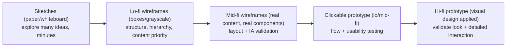

# 28 — Wireframing & Prototyping

### Thinking Cheaply Before Building Expensively

> *"A wireframe is an argument about structure you can throw away. The whole point is to be wrong on paper, fast and cheap, so you're right in code, slow and expensive, less often."*

---

**Chapter type:** Phase 5 — Experience & Interaction
**DRI:** Product Designer + UX Researcher (joint)
**Depends on:** [`00-CONSTITUTION.md`](./00-CONSTITUTION.md), [`04`](./04-DESIGN_PHILOSOPHY.md), [`26`](./26-USER_EXPERIENCE.md), [`27`](./27-INFORMATION_ARCHITECTURE.md)
**Feeds:** [`29-USER_FLOWS.md`](./29-USER_FLOWS.md), [`14`](./14-COMPONENT_LIBRARY.md), all product surfaces (16–19)

---

## Table of Contents
1. [Purpose](#1-purpose)
2. [Philosophy](#2-philosophy)
3. [Principles](#3-principles)
4. [Best Practices](#4-best-practices)
5. [Anti-Patterns](#5-anti-patterns)
6. [Real-World Examples](#6-real-world-examples)
7. [Common Mistakes](#7-common-mistakes)
8. [AI Implementation Guidance](#8-ai-implementation-guidance)
9. [Human Review Checklist](#9-human-review-checklist)
10. [Automation Opportunities](#10-automation-opportunities)
11. [References for Further Study](#11-references-for-further-study)
12. [Review Checklist & Measurable Quality Criteria](#12-review-checklist--measurable-quality-criteria)

---

## 1. Purpose

This chapter defines how the studio uses **wireframes and prototypes** to explore, validate, and communicate structure and interaction *before* committing to visual design or code. Wireframing is thinking made visible at low cost: it lets us test IA ([`27`](./27-INFORMATION_ARCHITECTURE.md)), flows ([`29`](./29-USER_FLOWS.md)), and content priority ([`25`](./25-COPYWRITING.md)) while changes still cost minutes, not sprints.

It covers the **fidelity ladder** (from sketch to high-fidelity prototype), *when* to use each, how to prototype for realistic testing ([`26`](./26-USER_EXPERIENCE.md)), and how wireframes hand off cleanly into components ([`14`](./14-COMPONENT_LIBRARY.md)). The goal is to make "fail cheap, learn fast" a disciplined default (Constitution Article IX — small, reversible steps).

---

## 2. Philosophy

**The purpose of a wireframe is to be wrong cheaply.** Every project contains bad ideas; the only question is *when* you discover them. Discovering a broken layout or confusing flow in a five-minute sketch costs five minutes; discovering it in production costs a sprint plus the reputational damage of shipping it. Wireframing front-loads being-wrong to the cheapest possible stage. A team that goes straight to high-fidelity design or code has chosen to be wrong expensively (Article IX).

**Fidelity is a tool, not a goal — match it to the question.** Low fidelity (sketches, boxes) is for exploring *structure and priority*; it invites bold changes precisely because it looks unfinished. High fidelity is for validating *visual design and detailed interaction*. Using the wrong fidelity wastes effort and distorts feedback: a polished mockup shown to test *structure* gets comments on button color, not layout; a scribble shown to a client to approve *the brand* gets rejected as "unfinished." Pick fidelity to fit the decision being made.

**Content and hierarchy first; decoration never (yet).** Wireframes deliberately strip color, imagery, and styling so the conversation stays on *what matters*: what content is here, what's most important, what's the primary action, does the flow make sense ([`04`](./04-DESIGN_PHILOSOPHY.md) hierarchy, [`26`](./26-USER_EXPERIENCE.md)). This is why grayscale, boxes, and even real-ish placeholder *content* (never lorem ipsum for decisions, [`25`](./25-COPYWRITING.md)) are features, not limitations.

**Prototypes exist to be tested, not admired.** A prototype's value is the *learning* it produces, not its polish. The best prototype is the lowest-fidelity one that can answer the question you have — often clickable wireframes are enough to run usability tests ([`26`](./26-USER_EXPERIENCE.md)) and catch major issues before design/build. Prototype the *risky* parts (novel flows, complex interactions), not the obvious ones.

---

## 3. Principles

### Principle 1 — Match fidelity to the question
Use the lowest fidelity that can answer the current question; escalate only as questions get more detailed.
> *Rationale (Art. VIII, IX):* Right fidelity = fast learning, honest feedback.

### Principle 2 — Structure and hierarchy before style
Wireframes resolve content, priority, and primary action — not color/typography/imagery.
> *Rationale ([`04`](./04-DESIGN_PHILOSOPHY.md)):* Solve the big things before the small.

### Principle 3 — Fail cheap, iterate fast
Prefer many quick, disposable iterations over one polished artifact.
> *Rationale (Art. IX):* Small reversible steps; reality corrects cheaply.

### Principle 4 — Use realistic content, not lorem ipsum (for decisions)
Real-ish labels, data lengths, empty/overflow states — placeholder text hides real problems.
> *Rationale ([`25`](./25-COPYWRITING.md), [`04`](./04-DESIGN_PHILOSOPHY.md) P6):* Lorem ipsum makes bad layouts look fine.

### Principle 5 — Wireframe all the states, not just the ideal
Sketch empty, loading, error, and overflow — the states that break real designs.
> *Rationale ([`04`](./04-DESIGN_PHILOSOPHY.md) P6, [`26`](./26-USER_EXPERIENCE.md)):* The ideal state is the rarest.

### Principle 6 — Prototype the risky parts and test them
Build interactive prototypes of novel/complex flows and run usability tests early.
> *Rationale ([`26`](./26-USER_EXPERIENCE.md), Art. X):* Validate before you invest.

### Principle 7 — Wireframes reflect the IA and hand off to components
Layouts express the validated IA ([`27`](./27-INFORMATION_ARCHITECTURE.md)) and map to existing library components ([`14`](./14-COMPONENT_LIBRARY.md)).
> *Rationale (Art. IV):* Continuity from structure → system → build.

### Principle 8 — Keep artifacts disposable and honestly labeled
Signal fidelity clearly (a sketch should look like a sketch) so feedback matches intent.
> *Rationale:* Polished-looking wireframes attract the wrong feedback and resist change.

---

## 4. Best Practices

### 4.1 The fidelity ladder — and when to use each


| Stage | Answers | Don't discuss |
| --- | --- | --- |
| **Sketch** | "Is this direction worth exploring?" | anything detailed |
| **Lo-fi wireframe** | "What content, what priority, what primary action?" | color, type, polish |
| **Mid-fi wireframe** | "Does this layout + IA work with real content/states?" | final visuals |
| **Clickable prototype** | "Can users complete the flow?" | pixel perfection |
| **Hi-fi prototype** | "Does the visual design + micro-interaction work?" | (now everything's on the table) |

### 4.2 Lo-fi wireframing that stays useful
- Grayscale + boxes; type as a few weights/sizes to show hierarchy (not final type).
- **Real-ish content** (actual labels, realistic data lengths) — never lorem ipsum for decisions (Principle 4).
- Annotate *intent* ("primary action," "this list can be empty → see empty state").
- Keep it visibly rough so feedback targets structure, not polish (Principle 8).

### 4.3 Wireframe the state set (Principle 5)
For each view, wireframe: **empty · loading · ideal · partial · error · overflow**. Most "surprises" in build are unhandled states that were never wireframed ([`26`](./26-USER_EXPERIENCE.md)).

### 4.4 Prototype for testing
- **Fidelity for testing:** clickable lo/mid-fi is usually enough to catch major usability issues ([`26`](./26-USER_EXPERIENCE.md) 5-user rounds).
- **Prototype the risk:** novel flows, complex interactions, anything the team is unsure about — not the boilerplate.
- **Realistic paths:** wire the happy path *and* at least one error/edge path so the test reflects reality.
- Keep prototypes **disposable**; their job is learning, then they're discarded.

### 4.5 From wireframe to components ([`14`](./14-COMPONENT_LIBRARY.md), [`27`](./27-INFORMATION_ARCHITECTURE.md))
Mid-fi wireframes should compose from *existing library components* wherever possible — so the wireframe is both a structural test and a head-start on build. Flag any genuinely new pattern for the design system (don't sketch a one-off that will become a snowflake).

### 4.6 Wireframe responsively (mobile-first)
Wireframe the mobile layout first ([`20`](./20-MOBILE_FIRST.md)); it forces prioritization. Then wireframe the enhanced larger-screen layout. Structural problems surface fastest at the smallest size.

### 4.7 Collaboration & handoff
- Wireframes are a **shared thinking tool** — review with engineering + product early (feasibility, edge cases).
- Annotate behavior, states, and IA intent so the handoff carries reasoning, not just boxes (Article VI).
- Version and date them; they're a record of *why* the structure is what it is.

### 4.8 Know when to stop wireframing
Escalate fidelity when the current-fidelity questions are answered; stop wireframing entirely when structure + flow are validated and the remaining questions are visual/interaction detail. Endless wireframing is its own anti-pattern (Article IX — converge).

---

## 5. Anti-Patterns

| Anti-pattern | Why it fails | Principle |
| --- | --- | --- |
| **Straight to hi-fi / code** | Being wrong expensively; slow iteration. | P1, P3 |
| **Wrong fidelity for the question** | Distorted feedback (color notes on a structure test). | P1 |
| **Discussing color/type on a wireframe** | Wastes the cheap-structure stage. | P2 |
| **Lorem ipsum for decisions** | Bad layouts look fine; hides real problems. | P4 |
| **Only the ideal state wireframed** | Empty/error/overflow break in build. | P5 |
| **Polished wireframes** | Attract wrong feedback; resist change. | P8 |
| **Prototyping the obvious, not the risky** | Learns nothing; skips the real unknowns. | P6 |
| **Prototype-as-deliverable** (admired, not tested) | No learning; false confidence. | P6 |
| **One-off patterns not mapped to components** | Snowflakes; broken continuity to build. | P7 |
| **Endless wireframing** (never converging) | Analysis paralysis. | P3, Art. IX |

---

## 6. Real-World Examples

### Example A — Five-minute sketch saved a sprint
A team was about to build a complex multi-step configurator. A **paper sketch** walked through in 20 minutes revealed that steps 2 and 3 were redundant and the whole thing could be a single smart form. They deleted two screens *before writing any code*. The sketch's ugliness was its strength — no one hesitated to tear it up (Principles 1, 3). *Being wrong on paper is free.*

### Example B — Lorem ipsum hid the real problem
A dashboard wireframe looked clean with lorem-ipsum labels and tidy fake numbers. Rebuilt with **real content** (long product names, a metric that could be "0" or "1,240,918"), the layout broke — titles truncated, columns misaligned, the empty state was a blank void. The realistic content (Principle 4) surfaced problems the placeholder had masked, and the empty state got designed as a feature ([`26`](./26-USER_EXPERIENCE.md); [`04`](./04-DESIGN_PHILOSOPHY.md) P6).

### Example C — Clickable lo-fi caught the flow flaw before design
Before investing in visual design, the team made a **clickable mid-fi prototype** of a novel onboarding flow and ran a 5-user test ([`26`](./26-USER_EXPERIENCE.md)). Users got stuck at a permissions step nobody expected. Fixing it in the prototype took an hour; fixing it after visual design + build would have taken a sprint. *Prototype the risk, test early (Principle 6; Article IX).*

---

## 7. Common Mistakes

- **Skipping wireframes** and going straight to hi-fi or code.
- **Over-polishing wireframes** so they attract visual feedback and resist change.
- **Using lorem ipsum** and fake tidy data, hiding real layout problems.
- **Only wireframing the happy/full state.**
- **Prototyping the easy parts** instead of the risky, unknown ones.
- **Treating the prototype as a deliverable** to admire rather than a tool to test.
- **Not involving engineering** early (missing feasibility/edge cases).
- **Never stopping** — wireframing past the point of useful learning.

---

## 8. AI Implementation Guidance

AI can generate wireframes and even code-based prototypes fast — which is powerful *and* a temptation to skip the cheap-thinking stage. Use it to accelerate iteration, not to jump to fidelity.

### 8.1 Where agents help
- **Generate lo/mid-fi wireframe layouts** (as annotated structure or lightweight HTML/JSX) from a described screen + IA.
- **Produce all-state variants** (empty/loading/error/overflow) automatically.
- **Generate realistic placeholder content** (not lorem ipsum) and edge-case data.
- **Build clickable prototypes** of risky flows for testing; wire happy + error paths.
- **Map wireframe elements to existing library components** ([`14`](./14-COMPONENT_LIBRARY.md)); flag new patterns.

### 8.2 Hard rules (Art. VIII, IX)
- The agent **matches fidelity to the question** and *recommends the lowest useful fidelity* — it does not jump to hi-fi/code when structure is still unvalidated.
- Wireframes use **realistic content**, never lorem ipsum for decisions, and include **all states** (not just ideal).
- Wireframes **reflect the validated IA** ([`27`](./27-INFORMATION_ARCHITECTURE.md)) and **compose existing components**; new one-offs are flagged, not silently created.
- Prototypes are framed as **disposable, for testing** — the agent proposes what to test and prototypes the **risky** parts.
- Mobile-first structure by default ([`20`](./20-MOBILE_FIRST.md)).

### 8.3 Prompt example — wireframe a screen
```
ROLE: Product Designer, bound by 00-CONSTITUTION + 28 (+26/27).
INPUT: screen = <x>; validated IA (from 27); content inventory; primary user goal.
TASK:
  1. Produce a LO/MID-FI wireframe (grayscale structure; annotate hierarchy + primary action).
  2. Use realistic content (no lorem ipsum) and realistic data lengths.
  3. Provide ALL states: empty, loading, ideal, partial, error, overflow.
  4. Wireframe mobile-first, then the enhanced desktop layout.
  5. Map each block to an existing library component; flag any genuinely new pattern.
CONSTRAINTS: no color/type/visual-design decisions; keep it visibly rough. State what question each choice answers.
OUTPUT: annotated wireframe(s) + state set + component mapping + "what to test next".
```

### 8.4 Prompt example — prototype for testing
```
TASK: From these wireframes, build a clickable mid-fi prototype of the RISKY flow (<name>),
wiring the happy path + at least one error/edge path. Then draft a 5-user task-based test plan
(tasks, success criteria, what to observe). Keep it disposable; do not add visual polish.
```

---

## 9. Human Review Checklist

- [ ] **Fidelity matches the question** (lowest useful; not hi-fi/code before structure is validated).
- [ ] Wireframes resolve **structure, hierarchy, and primary action** — not color/type.
- [ ] **Realistic content** used (no lorem ipsum for decisions); realistic data lengths.
- [ ] **All states** wireframed (empty/loading/error/overflow), not just ideal.
- [ ] Layout reflects the **validated IA** ([`27`](./27-INFORMATION_ARCHITECTURE.md)) and is **mobile-first**.
- [ ] Wireframes **compose existing components**; new patterns flagged for the system ([`14`](./14-COMPONENT_LIBRARY.md)).
- [ ] **Risky flows prototyped and tested** early ([`26`](./26-USER_EXPERIENCE.md)); prototypes treated as disposable.
- [ ] Engineering/product involved early (feasibility, edge cases); intent annotated.
- [ ] The team knows **when to stop** and escalate to visual design.

---

## 10. Automation Opportunities

| Task | Automation |
| --- | --- |
| Wireframe generation | AI/layout tools producing lo/mid-fi structures from prompts/IA. |
| Realistic data | Generators for realistic labels + edge-case data (long/empty/zero). |
| State scaffolding | Auto-produce empty/loading/error/overflow variants per screen. |
| Component mapping | Tooling linking wireframe blocks to library components ([`14`](./14-COMPONENT_LIBRARY.md)). |
| Prototype → test | Clickable-prototype export + unmoderated test distribution ([`26`](./26-USER_EXPERIENCE.md)). |
| Responsive preview | Auto-render wireframes across breakpoints ([`21`](./21-RESPONSIVE_DESIGN.md)). |

---

## 11. References for Further Study
- **Prototyping/fidelity:** the lean/UX literature on fidelity ladders and paper prototyping (Carolyn Snyder, *Paper Prototyping*).
- **Sketching:** Bill Buxton, *Sketching User Experiences* (sketch vs. prototype, exploring the right design).
- **Testing prototypes:** usability-testing methods ([`26`](./26-USER_EXPERIENCE.md)); tree/first-click testing for structure ([`27`](./27-INFORMATION_ARCHITECTURE.md)).
- **Lean UX:** Gothelf & Seiden, *Lean UX* (build-measure-learn, minimal artifacts).
- **Cross-references:** [`04-DESIGN_PHILOSOPHY.md`](./04-DESIGN_PHILOSOPHY.md), [`14-COMPONENT_LIBRARY.md`](./14-COMPONENT_LIBRARY.md), [`26-USER_EXPERIENCE.md`](./26-USER_EXPERIENCE.md), [`27-INFORMATION_ARCHITECTURE.md`](./27-INFORMATION_ARCHITECTURE.md), [`29-USER_FLOWS.md`](./29-USER_FLOWS.md).

---

## 12. Review Checklist & Measurable Quality Criteria

| Criterion | Target |
| --- | --- |
| Major features wireframed before hi-fi/build | 100% |
| Wireframes including all states (not just ideal) | 100% |
| Realistic content used (no lorem ipsum for decisions) | 100% |
| Risky flows prototyped + tested before build | 100% |
| Wireframes mapping to existing components | ≥ 90% |
| Issues caught at wireframe/prototype stage (vs. production) | ↑ trend |
| Rework after build due to structure/flow problems | ↓ trend |

---

*End of `28-WIREFRAMING.md`.*
