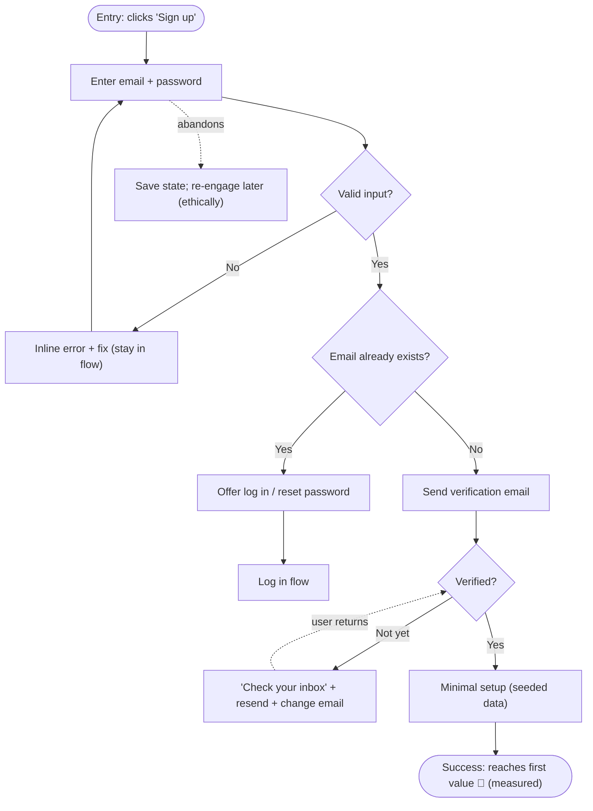

# 29 — User Flows

### Mapping the Paths People Take to Get Things Done

> *"A user flow is a promise about how someone will succeed — including every branch where they might get lost, change their mind, or hit an error. Design the branches, not just the straight line."*

---

**Chapter type:** Phase 5 — Experience & Interaction
**DRI:** Product Designer + UX Researcher (joint)
**Depends on:** [`00-CONSTITUTION.md`](./00-CONSTITUTION.md), [`01`](./01-PROJECT_DISCOVERY.md), [`26`](./26-USER_EXPERIENCE.md), [`27`](./27-INFORMATION_ARCHITECTURE.md), [`28`](./28-WIREFRAMING.md)
**Feeds:** [`13`](./13-FORM_DESIGN.md), [`18`](./18-SAAS_DESIGN.md), [`19`](./19-ECOMMERCE_DESIGN.md), [`31`](./31-NEXTJS_GUIDE.md), [`40-API_DESIGN.md`](./40-API_DESIGN.md)

---

## Table of Contents
1. [Purpose](#1-purpose)
2. [Philosophy](#2-philosophy)
3. [Principles](#3-principles)
4. [Best Practices](#4-best-practices)
5. [Anti-Patterns](#5-anti-patterns)
6. [Real-World Examples](#6-real-world-examples)
7. [Common Mistakes](#7-common-mistakes)
8. [AI Implementation Guidance](#8-ai-implementation-guidance)
9. [Human Review Checklist](#9-human-review-checklist)
10. [Automation Opportunities](#10-automation-opportunities)
11. [References for Further Study](#11-references-for-further-study)
12. [Review Checklist & Measurable Quality Criteria](#12-review-checklist--measurable-quality-criteria)

---

## 1. Purpose

This chapter defines how the studio maps and designs **user flows** — the step-by-step paths a person takes to accomplish a goal, including every decision point, branch, error path, and exit. It is the closing chapter of Phase 5: where UX ([`26`](./26-USER_EXPERIENCE.md)) sets the standards and IA ([`27`](./27-INFORMATION_ARCHITECTURE.md)) sets the structure, flows describe the *movement through* that structure toward a goal, and wireframes ([`28`](./28-WIREFRAMING.md)) render each step.

Flows are where the "whole journey" thinking of [`26`](./26-USER_EXPERIENCE.md) becomes a concrete, reviewable artifact — a map that engineering, design, and product can all read, that surfaces missing states before build, and that anchors instrumentation (funnels) after launch. A well-mapped flow is simultaneously a design tool, a communication tool, a QA checklist ([`45`](./45-QA.md)), and a measurement plan ([`02`](./02-PRODUCT_STRATEGY.md)).

---

## 2. Philosophy

**The straight line is the smallest part of the flow.** Teams love to design the "happy path" — the idealized route where the user does exactly the right thing with valid data on a fast connection. But real flows are mostly *branches*: the user changes their mind, enters bad data, loses connection, hits a permission wall, abandons and returns, already has an account. A flow that only maps the happy path is a flow that will break in production, because the branches were never designed ([`04`](./04-DESIGN_PHILOSOPHY.md) P6; [`26`](./26-USER_EXPERIENCE.md) error prevention/recovery). Designing the branches *is* the job.

**Every step is a chance to lose the user, so every step must be justified.** Flows leak. Each additional step, field, decision, or wait is a point where someone drops off ([`05`](./05-VISUAL_PSYCHOLOGY.md), funnel drop-off). The discipline is ruthless: does this step *need* to exist? Can it be removed, merged, deferred, or defaulted? The shortest path to the user's goal — while keeping them oriented and in control — usually wins (Article I, VIII). Flow design is largely *step subtraction*.

**A flow is a shared artifact, not a designer's private sketch.** A mapped flow (a diagram anyone can read) aligns design, engineering, product, and QA on *the same understanding* of how something works — including the edge cases. It's where the backend architect spots a missing API state, QA derives test cases, and product finds the drop-off to instrument. Un-mapped flows live only in one person's head and fracture on contact with reality (Article VI — explainability).

**Flows must be measured, not assumed.** Once live, a flow is a *funnel* with real drop-off at each step. We instrument flows so we can see *where* users actually fall out and *why* — replacing "the flow is fine" with evidence (Article X). The mapped flow and the measured funnel are two views of the same thing; keeping them in sync is how flows improve over time ([`50`](./50-CONTINUOUS_IMPROVEMENT.md)).

---

## 3. Principles

### Principle 1 — Start from the user's goal (JTBD), not the screens
Every flow begins with "what is the user trying to accomplish?" ([`01`](./01-PROJECT_DISCOVERY.md)).
> *Rationale (Art. I):* Screens serve the goal, not vice versa.

### Principle 2 — Map decisions, branches, errors, and exits — not just the happy path
Include invalid input, permissions, empty/edge states, abandonment, and returns.
> *Rationale ([`04`](./04-DESIGN_PHILOSOPHY.md) P6, [`26`](./26-USER_EXPERIENCE.md)):* Branches are most of real usage.

### Principle 3 — Minimize steps to the goal
Remove, merge, defer, or default every non-essential step/field/decision.
> *Rationale (Art. VIII, [`05`](./05-VISUAL_PSYCHOLOGY.md)):* Each step leaks users.

### Principle 4 — Keep the user oriented and in control at every step
Show progress/status, allow back/cancel/undo, never trap.
> *Rationale ([`26`](./26-USER_EXPERIENCE.md) status/control):* Lost or trapped users abandon.

### Principle 5 — Design for error prevention and graceful recovery
Prevent mistakes; when they happen, keep the user in the flow with a clear fix (no dead-ends).
> *Rationale ([`13`](./13-FORM_DESIGN.md), [`25`](./25-COPYWRITING.md)):* Errors shouldn't eject users from the flow.

### Principle 6 — Preserve state across the flow
Never lose entered data across steps, errors, navigation, or interruptions; support resume.
> *Rationale (Art. I, [`13`](./13-FORM_DESIGN.md)):* Losing work is a betrayal that kills flows.

### Principle 7 — The flow is a reviewable, shared diagram
Map flows visually (e.g. Mermaid) so all disciplines align on logic + edge cases.
> *Rationale (Art. VI):* Shared artifacts surface gaps early.

### Principle 8 — Instrument and measure the flow as a funnel
Define the success event and per-step drop-off; watch it in production.
> *Rationale (Art. X, [`02`](./02-PRODUCT_STRATEGY.md)):* Assumed flows ≠ real behavior.

---

## 4. Best Practices

### 4.1 The four questions before mapping any flow
1. **Who** is the user and what's their **goal/JTBD**? ([`01`](./01-PROJECT_DISCOVERY.md))
2. What's their **entry point** (and state — logged in? first time? from an email?)?
3. What is **success** (the completion event to measure)?
4. What can **go wrong or branch** at each step?

### 4.2 Map the flow (happy path + branches)

> Notice: the happy path is ~5 nodes; the branches (invalid input, existing account, unverified, abandonment) are the other half — and they're where flows usually fail.

### 4.3 Flow types to standardize
| Flow | Watch-outs |
| --- | --- |
| **Onboarding / signup** | TTFV, verification friction, existing-account branch ([`18`](./18-SAAS_DESIGN.md)) |
| **Auth** (login, reset, MFA) | generic errors, lockout recovery, session ([`38`](./38-AUTHENTICATION.md)) |
| **Checkout** | guest option, all-in pricing, payment errors ([`19`](./19-ECOMMERCE_DESIGN.md)) |
| **Core task** (create/edit/delete) | undo for destructive, autosave ([`12`](./12-BUTTON_DESIGN.md)) |
| **Search → find → act** | zero-results, filters, facets ([`27`](./27-INFORMATION_ARCHITECTURE.md)) |
| **Upgrade / cancel** | cancel as easy as signup (Art. III, [`18`](./18-SAAS_DESIGN.md)) |
| **Error recovery** | keep user in flow; clear next step |

### 4.4 Minimize and sequence steps (Principle 3)
- **Remove:** does this step exist for the user or for us?
- **Merge:** can two steps be one screen?
- **Defer:** collect it later, in context (progressive profiling).
- **Default:** pre-fill/assume the common case.
- **Sequence for momentum:** ask easy/valuable things first; put friction (verification, payment) after the user is invested — but never hide critical info (cost, consequences) until late (Art. III).

### 4.5 Keep users oriented and in control (Principle 4)
Progress indicators for multi-step flows; clear back/cancel; confirmation only for the genuinely destructive (prefer undo, [`12`](./12-BUTTON_DESIGN.md)); the current step and remaining steps visible. State in the URL where sensible so back/forward/refresh work ([`31`](./31-NEXTJS_GUIDE.md)).

### 4.6 Design every branch's states ([`26`](./26-USER_EXPERIENCE.md), [`28`](./28-WIREFRAMING.md))
For each decision node, define what the user sees and can do: invalid input → inline fix; permission denied → how to request access; empty results → suggestions; network error → retry with preserved state; interruption → resume where they left off.

### 4.7 Preserve state & support resume (Principle 6)
Autosave long flows; persist across refresh/nav/errors; allow "come back later" (esp. onboarding, checkout, forms). Losing a half-filled form is one of the fastest ways to lose a user ([`13`](./13-FORM_DESIGN.md)).

### 4.8 Instrument the funnel (Principle 8)
Define the **success event** and log entry + each step + completion. Watch per-step drop-off; the biggest leak is the highest-leverage fix ([`02`](./02-PRODUCT_STRATEGY.md), [`48`](./48-MONITORING.md), [`50`](./50-CONTINUOUS_IMPROVEMENT.md)). Keep the mapped flow and the measured funnel in sync.

---

## 5. Anti-Patterns

| Anti-pattern | Why it fails | Principle |
| --- | --- | --- |
| **Happy-path-only flow** | Branches/errors break in production. | P2 |
| **Too many steps** (unneeded fields/screens) | Compounding drop-off. | P3 |
| **No orientation** (no progress/where-am-I) | Users feel lost, abandon. | P4 |
| **Dead-end errors** (eject user from flow) | Frustration; lost conversion. | P5 |
| **Losing user input** across steps/errors | Betrayal; abandonment. | P6, Art. I |
| **Trapping the user** (no back/cancel; roach motel) | Distrust; can't escape. | P4, Art. III |
| **Un-mapped flows** (in one head only) | Gaps found in build/production. | P7 |
| **Burying critical info** (cost/consequence) until the end | Deceptive; late abandonment. | P4/P3, Art. III |
| **No instrumentation** | Can't see or fix the real leaks. | P8, Art. X |
| **Ignoring re-entry** (return/resume) | Interrupted users lost forever. | P2, P6 |

---

## 6. Real-World Examples

### Example A — The branch nobody designed
A signup flow shipped with a beautiful happy path — but no one designed the **"email already exists"** branch. Returning users who forgot they had an account hit a generic error and left. Adding that single branch (detect existing → offer log in / reset, Principle 2) recovered a meaningful chunk of "lost" signups. *The missing branch was the leak.*

### Example B — Step subtraction lifted completion (recap, flow lens)
An onboarding flow had 7 steps; the funnel showed a cliff at step 4 (a long profile form). Applying Principle 3: **defer** the profile (collect progressively in-product), **merge** two config steps, **default** the rest. The flow dropped to 3 steps and completion rose sharply. *Every removed step is recovered users (Article VIII; [`18`](./18-SAAS_DESIGN.md)).*

### Example C — Preserved state saved the checkout
A checkout lost the user's cart + entered details whenever payment failed, forcing a full restart — most didn't. Persisting state across the payment-error branch (Principle 6) so users could simply fix their card and retry — *without re-entering anything* — turned a dead-end into a recoverable step and lifted completion ([`19`](./19-ECOMMERCE_DESIGN.md); [`13`](./13-FORM_DESIGN.md)).

---

## 7. Common Mistakes

- **Designing only the happy path**, discovering branches in production.
- **Too many steps/fields** — not ruthlessly subtracting.
- **No progress/orientation** in multi-step flows.
- **Dead-end error states** that eject the user.
- **Losing entered data** on error/navigation/refresh.
- **No resume/re-entry** handling for interrupted users.
- **Flows that live only in someone's head** (never diagrammed/reviewed).
- **Launching without instrumentation**, so leaks are invisible.
- **Front-loading friction** (or hiding cost until the end).

---

## 8. AI Implementation Guidance

### 8.1 Where agents help
- **Generate flow diagrams** (Mermaid) from a described goal/entry/success — *including branches and error paths*.
- **Enumerate the branches** teams forget (existing account, invalid input, permission, empty, network error, abandonment, resume).
- **Propose step reduction** (remove/merge/defer/default) with rationale.
- **Derive QA test cases** and **funnel events** from the mapped flow.
- **Audit** flows for happy-path-only, excess steps, dead-ends, lost state, missing orientation, and un-instrumented funnels.

### 8.2 Hard rules (Art. I, VIII, X, III)
- The agent maps **branches, errors, and exits**, not just the happy path — every decision node has defined states.
- It **minimizes steps** (challenges each) and keeps the user **oriented + in control** (progress, back/cancel/undo).
- **State is never lost**; interrupted users can **resume**; **cancellation/exit is always available** (no traps, Art. III).
- Critical info (cost, consequences) is **never buried** to boost completion (Art. III).
- Every flow includes a **success event + funnel instrumentation** plan (Art. X); flows are delivered as a **shared diagram** (Art. VI).

### 8.3 Prompt example — map a flow
```
ROLE: Product Designer + UX Researcher, bound by 00-CONSTITUTION + 29 (+26/27).
INPUT: goal/JTBD (from 01); entry point + user state; definition of success.
TASK:
  1. Map the flow as a Mermaid diagram: happy path + ALL branches (invalid input, existing
     account, permission, empty/edge, network error, abandonment, resume).
  2. For each decision node, define what the user sees + can do (no dead-ends; keep them in flow).
  3. Minimize steps (remove/merge/defer/default) — justify each remaining step.
  4. Add orientation (progress, back/cancel/undo) and state-preservation/resume.
  5. Define the success event + per-step funnel instrumentation.
OUTPUT: flow diagram + branch/state table + step-reduction rationale + funnel/event plan + QA test cases.
CONSTRAINT: never trap the user; never bury cost/consequences; never lose state.
```

### 8.4 Prompt example — audit
```
TASK: Audit the flow for: happy-path-only gaps (list missing branches), unnecessary steps,
dead-end error states, lost user state across steps/errors, missing progress/back/cancel, buried
critical info, no resume handling, and missing funnel instrumentation. Output {step/branch, issue, fix}.
```

---

## 9. Human Review Checklist

- [ ] The flow starts from the **user's goal/JTBD** and a defined **entry point + success event**.
- [ ] **All branches** mapped (invalid input, existing account, permissions, empty/edge, network error, abandonment, resume) — not just the happy path.
- [ ] **Steps minimized** (each justified; unnecessary ones removed/merged/deferred/defaulted).
- [ ] User stays **oriented and in control** (progress, back/cancel/undo); **never trapped**.
- [ ] Errors are **prevented** and **recoverable in-flow** (no dead-ends).
- [ ] **State preserved** across steps/errors/nav; interrupted users can **resume**.
- [ ] Critical info (cost/consequences) is **not buried**; cancellation/exit always available.
- [ ] The flow is a **shared, reviewed diagram** aligning design/eng/product/QA.
- [ ] A **funnel + success event** is instrumented (or planned) to measure real drop-off.

---

## 10. Automation Opportunities

| Task | Automation |
| --- | --- |
| Flow diagramming | AI/Mermaid generation of flows incl. branches from specs. |
| Funnel analytics | Instrument entry→steps→success; per-step drop-off dashboards ([`48`](./48-MONITORING.md)). |
| Branch coverage | Checklist/lint ensuring error/empty/edge branches exist per flow. |
| State-preservation tests | E2E asserting data persists across errors/refresh/nav. |
| QA case generation | Derive test cases from the mapped flow ([`45`](./45-QA.md)). |
| Session replay | Watch real paths to find unmapped branches + friction. |
| Cancellation-parity | Test that exit/cancel is available and cancel ≤ signup steps ([`18`](./18-SAAS_DESIGN.md)). |

---

## 11. References for Further Study
- **Flow & journey mapping:** UX flow-diagram and task-flow practice; journey mapping ([`26`](./26-USER_EXPERIENCE.md)).
- **Funnels & conversion:** funnel analysis and drop-off diagnosis ([`02`](./02-PRODUCT_STRATEGY.md)); the Baymard checkout-flow research ([`19`](./19-ECOMMERCE_DESIGN.md)).
- **Error & recovery design:** Nielsen heuristics on error prevention/recovery ([`26`](./26-USER_EXPERIENCE.md)); form recovery ([`13`](./13-FORM_DESIGN.md)).
- **Notation:** Mermaid flowchart syntax for shareable diagrams.
- **Cross-references:** [`01-PROJECT_DISCOVERY.md`](./01-PROJECT_DISCOVERY.md), [`13-FORM_DESIGN.md`](./13-FORM_DESIGN.md), [`18-SAAS_DESIGN.md`](./18-SAAS_DESIGN.md), [`19-ECOMMERCE_DESIGN.md`](./19-ECOMMERCE_DESIGN.md), [`26-USER_EXPERIENCE.md`](./26-USER_EXPERIENCE.md), [`27-INFORMATION_ARCHITECTURE.md`](./27-INFORMATION_ARCHITECTURE.md), [`28-WIREFRAMING.md`](./28-WIREFRAMING.md), [`38-AUTHENTICATION.md`](./38-AUTHENTICATION.md).

---

## 12. Review Checklist & Measurable Quality Criteria

| Criterion | Target |
| --- | --- |
| Flows mapping all branches (not just happy path) | 100% |
| Decision nodes with defined states (no dead-ends) | 100% |
| Flows preserving state across errors/nav | 100% |
| Destructive steps with undo/confirm; exit always available | 100% |
| Critical flows instrumented as funnels | 100% |
| Steps per core flow | minimized (each justified) |
| Flow completion rate | ↑ trend |
| Per-step drop-off | ↓ trend (biggest leak prioritized) |

---

*End of `29-USER_FLOWS.md`. Phase 5 (Experience & Interaction) complete.*
