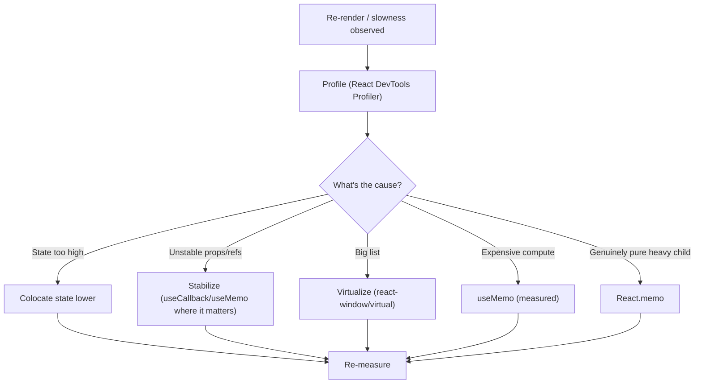

# 30 — React Guide

### Components, Composition, State, and the Rules That Keep React Sane

> *"React is not the hard part. Managing state, effects, and re-renders is. Master those, and React becomes a joy; ignore them, and it becomes a haunted house."*

---

**Chapter type:** Phase 6 — Engineering Craft
**DRI:** Principal React Engineer + Frontend Architect
**Depends on:** [`00-CONSTITUTION.md`](./00-CONSTITUTION.md), [`14`](./14-COMPONENT_LIBRARY.md), [`32`](./32-TYPESCRIPT_GUIDE.md), [`41`](./41-CODE_ARCHITECTURE.md), [`43`](./43-CLEAN_CODE.md)
**Feeds:** [`31-NEXTJS_GUIDE.md`](./31-NEXTJS_GUIDE.md), [`34-FRAMER_MOTION_GUIDE.md`](./34-FRAMER_MOTION_GUIDE.md), [`35-PERFORMANCE.md`](./35-PERFORMANCE.md), [`44-TESTING.md`](./44-TESTING.md)

---

## Table of Contents
1. [Purpose](#1-purpose)
2. [Philosophy](#2-philosophy)
3. [Principles](#3-principles)
4. [Best Practices](#4-best-practices)
5. [Anti-Patterns](#5-anti-patterns)
6. [Real-World Examples](#6-real-world-examples)
7. [Common Mistakes](#7-common-mistakes)
8. [AI Implementation Guidance](#8-ai-implementation-guidance)
9. [Human Review Checklist](#9-human-review-checklist)
10. [Automation Opportunities](#10-automation-opportunities)
11. [References for Further Study](#11-references-for-further-study)
12. [Review Checklist & Measurable Quality Criteria](#12-review-checklist--measurable-quality-criteria)

---

## 1. Purpose

This chapter defines how the studio writes **React** — component design, composition, state management, effects, performance, and the mental models that keep a React codebase maintainable at scale. React is the studio's default UI library ([`00`](./00-CONSTITUTION.md) engineering philosophy), and this guide is the opinionated, framework-agnostic-where-possible standard every React file is held to.

It complements the design-side component chapter ([`14`](./14-COMPONENT_LIBRARY.md), which covers *what* components exist and their design contract) by covering *how* to implement them well in React: hooks discipline, when (not) to use effects, rendering the right way, and the patterns that prevent the classic React pain (unnecessary re-renders, effect spaghetti, prop drilling, stale closures). It assumes modern React (function components, hooks, and — via [`31`](./31-NEXTJS_GUIDE.md) — Server Components).

---

## 2. Philosophy

**UI is a function of state.** React's core idea — `UI = f(state)` — is the mental model everything else descends from. You don't imperatively *change* the DOM; you describe what the UI *should be* for a given state, and React reconciles. Bugs almost always trace to state that is wrong, duplicated, or in the wrong place. So the highest-leverage skill in React is **state design**: what is the minimal, single-source-of-truth state, and where does it live? Get that right and components become simple, predictable functions.

**Composition over configuration, over inheritance.** React has no inheritance for a reason. We build complex UI by *composing* small, focused components and passing behavior via props, `children`, and composition patterns — not by piling props onto god-components or reaching for class hierarchies ([`14`](./14-COMPONENT_LIBRARY.md) P6). A component should do one thing; complexity emerges from combining simple pieces. When a component sprouts a dozen boolean props, that's a signal to split or compose, not to add prop #13.

**Effects are an escape hatch, not the main road.** The single most common React mistake is overusing `useEffect`. Effects exist to *synchronize with external systems* (network, DOM APIs, subscriptions) — not to transform data for rendering, not to respond to user events, not to chain state updates. Most "I need an effect" moments are actually "I need to compute during render" or "I need an event handler." Treating effects as a last resort, not a default, eliminates whole categories of bugs (infinite loops, stale data, double-fetches).

**Render less; the fastest render is the one that doesn't happen.** React re-renders are usually cheap, but *unnecessary cascading re-renders* are the top React performance problem. Rather than sprinkling `memo`/`useMemo`/`useCallback` everywhere (which adds its own cost and complexity, [`00`](./00-CONSTITUTION.md) Art. VIII), we fix the *cause*: state colocated too high, unstable references, and poor composition. Optimize with evidence (the profiler), not superstition ([`35`](./35-PERFORMANCE.md), Article X).

---

## 3. Principles

### Principle 1 — Design state first: minimal, single-source, correctly located
Derive don't duplicate; keep state as local as possible; lift only as far as needed.
> *Rationale:* Most React bugs are state-design bugs.

### Principle 2 — Compose small, focused, single-responsibility components
Prefer composition (`children`, slots, compound components) over prop explosion or inheritance.
> *Rationale (Art. VIII, [`14`](./14-COMPONENT_LIBRARY.md)):* Small pieces + composition scale; god-components don't.

### Principle 3 — `useEffect` is a last resort for external synchronization
Don't use effects to derive state, handle events, or chain updates.
> *Rationale:* Effect overuse is the #1 source of React bugs.

### Principle 4 — Components are pure; side effects are isolated
Rendering must be side-effect-free and idempotent; keep effects/handlers at the edges.
> *Rationale:* Purity enables Strict Mode, concurrent features, and predictability.

### Principle 5 — Everything is typed (no `any`)
Props, state, hooks, and events are fully typed ([`32`](./32-TYPESCRIPT_GUIDE.md)).
> *Rationale (Art. VI):* Types are the contract; `any` is a hole in it.

### Principle 6 — Extract reusable logic into custom hooks
Shared stateful logic lives in well-named `use*` hooks, not copy-paste.
> *Rationale (Art. IV):* Hooks are React's reuse primitive.

### Principle 7 — Optimize by evidence, not superstition
Profile first; fix causes (state location, stable refs, keys) before adding memoization.
> *Rationale (Art. X, VIII):* Premature memoization adds complexity and often doesn't help.

### Principle 8 — Accessible, semantic output
Components render semantic HTML and honor the a11y floor ([`22`](./22-ACCESSIBILITY.md)).
> *Rationale (Art. III):* React renders the DOM users depend on.

### Principle 9 — Prefer Server Components / server data where appropriate
Push work and data to the server; ship less client JS ([`31`](./31-NEXTJS_GUIDE.md)).
> *Rationale (Art. II, [`35`](./35-PERFORMANCE.md)):* Less client JS = faster, simpler.

---

## 4. Best Practices

### 4.1 State design: the questions to ask
1. **Can it be derived?** If it can be computed from existing state/props during render, *don't store it* — compute it.
2. **Is it duplicated?** One source of truth; never two states that must be kept in sync.
3. **Where should it live?** Local by default; lift to the nearest common ancestor only when shared; reach for context/state libraries only when prop-passing genuinely hurts.
4. **Is it derived-but-expensive?** Then `useMemo` — with a real measurement.

```tsx
// ❌ Redundant state synced by an effect (bug-prone)
const [items, setItems] = useState([]);
const [count, setCount] = useState(0);
useEffect(() => setCount(items.length), [items]); // don't

// ✅ Derive during render
const [items, setItems] = useState<Item[]>([]);
const count = items.length; // single source of truth
```

### 4.2 When you do NOT need an effect
| You think you need an effect to… | Do this instead |
| --- | --- |
| Transform data for rendering | Compute during render (or `useMemo` if expensive) |
| Respond to a user event | Put the logic in the event handler |
| Reset state when a prop changes | Use a `key` to remount, or compute during render |
| Chain state updates | Derive; or do it in one handler |
| Fetch data (in Next.js) | Fetch in a Server Component / route ([`31`](./31-NEXTJS_GUIDE.md)) |
| **Sync with an external system** (subscription, non-React widget, `document.title`) | ✅ *This* is a real effect |

```tsx
// ✅ A legitimate effect: subscribe to an external store
useEffect(() => {
  const sub = store.subscribe(onChange);
  return () => sub.unsubscribe(); // always clean up
}, [store]);
```

### 4.3 Composition patterns ([`14`](./14-COMPONENT_LIBRARY.md))
```tsx
// Compound components: flexible, no prop explosion
<Tabs defaultValue="a">
  <Tabs.List>
    <Tabs.Tab value="a">Account</Tabs.Tab>
    <Tabs.Tab value="b">Billing</Tabs.Tab>
  </Tabs.List>
  <Tabs.Panel value="a">…</Tabs.Panel>
  <Tabs.Panel value="b">…</Tabs.Panel>
</Tabs>

// children/slots beat boolean-prop soup
<Card header={<CardHeader/>} footer={<CardFooter/>}>{body}</Card>
```

### 4.4 Custom hooks for reusable logic
```tsx
function useDebouncedValue<T>(value: T, delay = 300): T {
  const [debounced, setDebounced] = useState(value);
  useEffect(() => {
    const id = setTimeout(() => setDebounced(value), delay);
    return () => clearTimeout(id);
  }, [value, delay]);
  return debounced;
}
```
Rules of Hooks (enforced by lint): call hooks only at the top level, only from components/hooks. Name them `use*`.

### 4.5 Data fetching
- **Prefer server data** (Server Components / route handlers, [`31`](./31-NEXTJS_GUIDE.md)) — no client fetch, no loading spaghetti.
- **Client-side server state:** use a dedicated library (TanStack Query / SWR) for caching, dedup, retries, and states — *don't* hand-roll fetch-in-`useEffect`.
- Always design **loading / error / empty** states ([`24`](./24-MICRO_INTERACTIONS.md), [`04`](./04-DESIGN_PHILOSOPHY.md) P6).

### 4.6 Lists, keys, and forms
- **Keys:** stable, unique IDs — never array index for dynamic lists (causes state/identity bugs).
- **Controlled inputs** for forms with validation ([`13`](./13-FORM_DESIGN.md)); consider a form library (React Hook Form) for complex forms.
- Colocate a list item's state within the item component where possible.

### 4.7 Performance — cause before cure ([`35`](./35-PERFORMANCE.md))

Use `memo`/`useMemo`/`useCallback` **surgically, with evidence** — not as a default reflex.

### 4.8 Error boundaries & resilience
Wrap risky subtrees in **error boundaries** so one component's crash doesn't white-screen the app; pair with sensible fallbacks ([`57` future — resilience]). Use `<Suspense>` boundaries for async UI where supported ([`31`](./31-NEXTJS_GUIDE.md)).

### 4.9 File & naming conventions ([`42`](./42-FOLDER_STRUCTURE.md), [`43`](./43-CLEAN_CODE.md))
- One component per file (plus its tightly-coupled subparts); `PascalCase` component names/files.
- Co-locate component + styles + tests + stories ([`14`](./14-COMPONENT_LIBRARY.md) structure).
- Custom hooks `useXxx.ts`; utilities pure and separately testable.

---

## 5. Anti-Patterns

| Anti-pattern | Why it fails | Principle |
| --- | --- | --- |
| **Effect overuse** (deriving state, handling events, chaining) | Infinite loops, stale data, double-fetches. | P3 |
| **Redundant/duplicated state** synced by effects | Sources drift out of sync; bugs. | P1 |
| **Prop drilling / god-components** (boolean-prop soup) | Unmaintainable; hard to reuse. | P2 |
| **`any` / untyped props** | Contract holes; runtime surprises. | P5 |
| **Array index as key** (dynamic lists) | State/identity bugs on reorder/insert. | 4.6 |
| **Fetch in `useEffect`** without a data lib | Race conditions, no cache, waterfalls. | 4.5 |
| **Memoization everywhere** (cargo-cult) | Complexity + cost with no measured gain. | P7 |
| **Side effects during render** | Breaks purity, Strict Mode, concurrency. | P4 |
| **Business logic in components** | Untestable, tangled; belongs in hooks/lib. | P6, [`41`](./41-CODE_ARCHITECTURE.md) |
| **`useState` for server state** (hand-rolled) | Reinvents caching/dedup badly. | 4.5 |
| **Non-semantic output** (`div` soup) | A11y failures. | P8, [`22`](./22-ACCESSIBILITY.md) |
| **Huge client bundles** (everything `"use client"`) | Slow; defeats Server Components. | P9, [`31`](./31-NEXTJS_GUIDE.md) |

---

## 6. Real-World Examples

### Example A — Deleting the effect fixed the bug
A component kept a `fullName` state synced from `firstName`/`lastName` via `useEffect` — and users saw stale names after fast edits (effect ran a tick late). The fix wasn't a better effect; it was **deriving during render**: `const fullName = `${first} ${last}``. The bug, the extra state, and the effect all disappeared. *Most effects are derived state in disguise (Principle 1, 3).*

### Example B — Composition killed the boolean soup
A `<Modal>` had grown to `showHeader`, `showFooter`, `headerText`, `footerButtons`, `size`, `variant`… 18 props, used inconsistently. Refactoring to **compound components** (`Dialog.Title`, `Dialog.Footer`, `children`) cut the API dramatically, made usage self-documenting, and let each screen compose exactly what it needed — without prop #19 ([`14`](./14-COMPONENT_LIBRARY.md), Principle 2).

### Example C — Profiling beat guessing
A dashboard felt sluggish; an engineer's instinct was to `memo` everything. Profiling (Principle 7) showed the real cause: a single piece of state lived at the top of the tree, re-rendering *everything* on every keystroke in a filter box. **Colocating that state** in the filter component fixed it — no memoization needed. The reflexive `memo` pass would have added complexity and missed the cause ([`35`](./35-PERFORMANCE.md), Article X).

---

## 7. Common Mistakes

- **Reaching for `useEffect`** to derive values or respond to events.
- **Storing derivable data** in state (and syncing it with effects).
- **Lifting state too high**, causing app-wide re-renders on local changes.
- **Array index keys** on dynamic lists.
- **Hand-rolled fetch-in-effect** instead of a data-fetching library or server data.
- **Cargo-cult memoization** without profiling.
- **Business logic inside components** instead of hooks/pure modules.
- **Marking everything `"use client"`**, bloating the bundle ([`31`](./31-NEXTJS_GUIDE.md)).
- **Forgetting loading/error/empty states** and error boundaries.

---

## 8. AI Implementation Guidance

### 8.1 Where agents help
- **Scaffold typed, composed components** with all states, following [`14`](./14-COMPONENT_LIBRARY.md).
- **Refactor effect-overuse** into derived state / event handlers / `key` remounts.
- **Extract custom hooks** from duplicated logic.
- **Diagnose re-render causes** and apply *targeted* fixes (state colocation, stable refs, virtualization).
- **Audit** for the anti-patterns in §5 (effects, keys, `any`, prop soup, cargo-cult memo, client-bundle bloat).

### 8.2 Hard rules (Art. VI, VIII; a11y floor)
- **No `any`**; props/state/hooks/events fully typed ([`32`](./32-TYPESCRIPT_GUIDE.md)).
- **`useEffect` only for external synchronization** — the agent must justify every effect and prefer derive/handler/`key`; it never uses effects to derive state or handle events.
- **Single source of truth**; no redundant state synced by effects.
- **Compose** (children/compound); no god-components / boolean-prop soup; business logic in hooks/lib, not components.
- **Stable, ID-based keys** (never index for dynamic lists); server data or a data lib for fetching (never raw fetch-in-effect).
- **Memoize only with a stated, measured reason** (Art. X) — not by default.
- Output is **semantic + accessible** ([`22`](./22-ACCESSIBILITY.md)); default to **Server Components**, `"use client"` only when needed ([`31`](./31-NEXTJS_GUIDE.md)).

### 8.3 Prompt example — build a component
```
ROLE: Principal React Engineer, bound by 00-CONSTITUTION + 30 (+14/32/22).
TASK: Build <component> in TypeScript React.
CONSTRAINTS:
  - Design minimal single-source state; derive (don't store/sync) computed values.
  - No useEffect unless synchronizing with an external system — justify any effect.
  - Compose (children/compound); no boolean-prop soup; extract reusable logic to a use* hook.
  - Fully typed (no any); stable ID keys; semantic + accessible output.
  - Provide loading/error/empty states; wrap risky async in Suspense/error boundary.
  - Default to a Server Component; add "use client" only if interactivity requires it (say why).
OUTPUT: component + hook(s) + a note on state design + which effects (if any) and why + a11y self-check.
```

### 8.4 Prompt example — audit/refactor
```
TASK: Audit this React code for: unnecessary effects (derivable state / event logic / chaining),
redundant state, prop drilling / god-components, `any`, index keys, fetch-in-effect, cargo-cult
memoization, side effects in render, business logic in components, and over-use of "use client".
Output {file:line, issue, fix} and refactor the top 3 with before/after.
```

---

## 9. Human Review Checklist

- [ ] **State is minimal, single-source, and correctly located**; nothing derivable is stored.
- [ ] **Every `useEffect` synchronizes with an external system** and is justified (no derive/event/chain effects); effects clean up.
- [ ] Components are **composed and single-responsibility** (no god-components / boolean-prop soup); logic extracted to **hooks**.
- [ ] **Fully typed** (no `any`); events/props/state typed.
- [ ] **Stable ID keys** (no index keys on dynamic lists).
- [ ] Data fetching uses **server data or a data library** (not raw fetch-in-effect); loading/error/empty designed.
- [ ] **Memoization is targeted + evidence-based** (profiled), not reflexive.
- [ ] Rendering is **pure** (no side effects during render).
- [ ] Output is **semantic + accessible** ([`22`](./22-ACCESSIBILITY.md)); risky subtrees have **error boundaries**.
- [ ] **Server Components by default**; `"use client"` only where needed ([`31`](./31-NEXTJS_GUIDE.md)).

---

## 10. Automation Opportunities

| Task | Automation |
| --- | --- |
| Rules of Hooks / deps | `eslint-plugin-react-hooks` (rules-of-hooks + exhaustive-deps) in CI. |
| Type safety | `tsc --noEmit` + `no-explicit-any` lint ([`32`](./32-TYPESCRIPT_GUIDE.md)). |
| A11y | `eslint-plugin-jsx-a11y` + jest-axe ([`22`](./22-ACCESSIBILITY.md)). |
| Re-render detection | React DevTools Profiler; `why-did-you-render` in dev for hotspots. |
| Bundle/client budget | `"use client"` boundary + bundle-size checks ([`35`](./35-PERFORMANCE.md), [`31`](./31-NEXTJS_GUIDE.md)). |
| Component tests | Testing Library + Storybook stories per component ([`44`](./44-TESTING.md), [`14`](./14-COMPONENT_LIBRARY.md)). |
| Key/index lint | Lint flagging array-index keys. |

---

## 11. References for Further Study
- **Official:** the React documentation (react.dev) — especially "You Might Not Need an Effect," "Thinking in React," and "Escape Hatches."
- **Patterns:** Kent C. Dodds (Epic React), the compound-component / hooks patterns literature.
- **Data fetching:** TanStack Query and SWR docs (server-state management).
- **Performance:** React profiler docs; web.dev on React performance ([`35`](./35-PERFORMANCE.md)).
- **Cross-references:** [`14-COMPONENT_LIBRARY.md`](./14-COMPONENT_LIBRARY.md), [`31-NEXTJS_GUIDE.md`](./31-NEXTJS_GUIDE.md), [`32-TYPESCRIPT_GUIDE.md`](./32-TYPESCRIPT_GUIDE.md), [`35-PERFORMANCE.md`](./35-PERFORMANCE.md), [`41-CODE_ARCHITECTURE.md`](./41-CODE_ARCHITECTURE.md), [`44-TESTING.md`](./44-TESTING.md).

---

## 12. Review Checklist & Measurable Quality Criteria

| Criterion | Target |
| --- | --- |
| `useEffect` instances that synchronize with external systems | 100% (no derive/event effects) |
| Components with `any` types | 0 |
| Dynamic lists using stable ID keys | 100% |
| Redundant state synced by effects | 0 |
| Data fetching via server/data-lib (not fetch-in-effect) | 100% |
| Memoization backed by a profiled reason | 100% of instances |
| Rules-of-Hooks / a11y lint violations | 0 (blocking) |
| Components shipping loading/error/empty states | 100% |

---

*End of `30-REACT_GUIDE.md`.*
