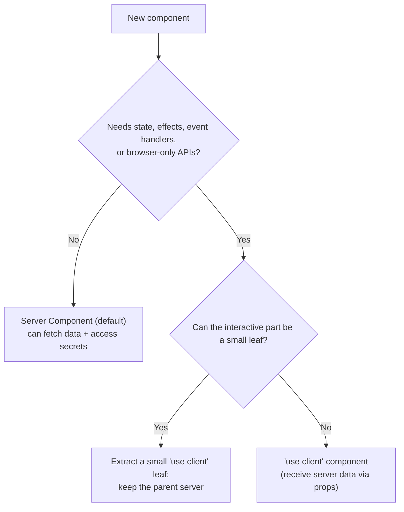

# 31 — Next.js Guide

### App Router, Server Components, Rendering, and Data

> *"The question is no longer 'how do I fetch data in the component?' It's 'does this even need to run on the client?' The default answer, in Next.js, is no."*

---

**Chapter type:** Phase 6 — Engineering Craft
**DRI:** Principal Next.js Engineer + Frontend Architect
**Depends on:** [`00-CONSTITUTION.md`](./00-CONSTITUTION.md), [`30`](./30-REACT_GUIDE.md), [`32`](./32-TYPESCRIPT_GUIDE.md), [`35`](./35-PERFORMANCE.md), [`36`](./36-SEO.md), [`37`](./37-SECURITY.md)
**Feeds:** [`40-API_DESIGN.md`](./40-API_DESIGN.md), [`42-FOLDER_STRUCTURE.md`](./42-FOLDER_STRUCTURE.md), [`47-DEPLOYMENT.md`](./47-DEPLOYMENT.md)

---

## Table of Contents
1. [Purpose](#1-purpose)
2. [Philosophy](#2-philosophy)
3. [Principles](#3-principles)
4. [Best Practices](#4-best-practices)
5. [Anti-Patterns](#5-anti-patterns)
6. [Real-World Examples](#6-real-world-examples)
7. [Common Mistakes](#7-common-mistakes)
8. [AI Implementation Guidance](#8-ai-implementation-guidance)
9. [Human Review Checklist](#9-human-review-checklist)
10. [Automation Opportunities](#10-automation-opportunities)
11. [References for Further Study](#11-references-for-further-study)
12. [Review Checklist & Measurable Quality Criteria](#12-review-checklist--measurable-quality-criteria)

---

## 1. Purpose

This chapter defines how the studio builds with **Next.js (App Router)** — the studio's default full-stack React framework ([`00`](./00-CONSTITUTION.md)). It covers the mental model of **Server vs. Client Components**, the rendering strategies (static, dynamic, streaming), data fetching and mutations (Server Actions, route handlers), caching, routing, metadata/SEO, and the security posture of a framework that runs code on both server and client.

It builds directly on the React guide ([`30`](./30-REACT_GUIDE.md)) — everything there still applies — and adds the framework-specific discipline that makes Next.js apps fast, secure, and maintainable. The through-line is the studio's engineering philosophy: **push work to the server, ship less client JS, and only opt into the client when interactivity truly requires it** ([`35`](./35-PERFORMANCE.md), Article II/VIII).

> Framework APIs evolve fast; treat the official Next.js docs as the living source of truth over any snapshot here. The *principles* (server-first, minimal client JS, cache deliberately, secure the boundary) outlast the API surface.

---

## 2. Philosophy

**Server-first: the client is the exception, not the default.** The App Router makes **React Server Components (RSC)** the default — components that render on the server and ship *zero* client JavaScript. This inverts the old mental model. Instead of "everything is a client component that fetches data," the question becomes: *does this specific piece need interactivity (state, effects, browser APIs, event handlers)?* If not — and most UI doesn't — it stays a Server Component. This is the single biggest lever for performance and simplicity in modern Next.js (Article II, VIII): less JS shipped, data fetched close to the source, secrets stay on the server.

**Render at the right time for the data.** Not all pages are equal. Marketing pages can be **static** (built once, served instantly, cached at the edge). Dashboards need **dynamic** (per-request) rendering. Long pages benefit from **streaming** (send the shell instantly, stream slower parts). Choosing the right rendering strategy per route — rather than making the whole app dynamic or the whole app static — is a core Next.js competency ([`35`](./35-PERFORMANCE.md)).

**Caching is a feature you must understand, not fight.** Next.js caches aggressively across several layers (request memoization, data cache, full-route cache, router cache). This is a superpower when understood and a source of "why is my data stale?" confusion when not. The discipline: know what's cached by default, cache deliberately, and **revalidate precisely** (time-based or tag/path-based) when data changes. Caching is not something to disable everywhere in frustration; it's something to *control*.

**The server/client boundary is a security boundary.** Because Next.js runs code in both places, the boundary matters enormously: secrets, tokens, and privileged logic must stay server-side; only explicitly-passed, serializable, non-sensitive data crosses to the client; Server Actions and route handlers are *public endpoints* that must validate input and check authorization ([`37`](./37-SECURITY.md), [`38`](./38-AUTHENTICATION.md)). "It's in my server component" is only safe if it *stays* there.

---

## 3. Principles

### Principle 1 — Server Components by default; `"use client"` only when needed
Reach for the client only for interactivity (state, effects, event handlers, browser APIs).
> *Rationale (Art. II, VIII):* Less client JS = faster + simpler; secrets stay server-side.

### Principle 2 — Push the client boundary down (leaves, not roots)
Keep `"use client"` on small interactive leaves; keep pages/layouts as Server Components.
> *Rationale:* A high boundary turns the whole subtree into client JS.

### Principle 3 — Choose rendering per route (static / dynamic / streaming)
Static for stable content, dynamic for per-request, stream slow parts with Suspense.
> *Rationale ([`35`](./35-PERFORMANCE.md)):* Match rendering to data freshness needs.

### Principle 4 — Fetch data on the server, close to where it's used
Fetch in Server Components / route handlers; avoid client fetch waterfalls.
> *Rationale ([`30`](./30-REACT_GUIDE.md)):* Server data = no client waterfall, no exposed keys.

### Principle 5 — Understand and control caching; revalidate precisely
Know the default caches; use `revalidateTag`/`revalidatePath`/time-based revalidation deliberately.
> *Rationale:* Stale-data bugs and over-fetching both come from misunderstood caching.

### Principle 6 — Mutations via Server Actions / route handlers, validated + authorized
Treat them as public endpoints: validate input, check auth, then mutate + revalidate.
> *Rationale (Art. III, [`37`](./37-SECURITY.md)):* They are attack surface.

### Principle 7 — Secrets and privileged logic stay server-side
Only `NEXT_PUBLIC_*` is client-exposed; never leak tokens across the boundary.
> *Rationale (Art. III, [`37`](./37-SECURITY.md)):* The boundary is a security boundary.

### Principle 8 — First-class metadata, images, fonts, and errors
Use the Metadata API, `next/image`, `next/font`, and `loading`/`error`/`not-found` files.
> *Rationale ([`36`](./36-SEO.md), [`35`](./35-PERFORMANCE.md), [`07`](./07-TYPOGRAPHY_SYSTEM.md)):* Framework primitives solve SEO/perf/UX correctly.

---

## 4. Best Practices

### 4.1 The Server/Client decision


```tsx
// app/dashboard/page.tsx — Server Component (default): fetch on the server
export default async function DashboardPage() {
  const projects = await getProjects(); // runs on server; secrets safe
  return (
    <main>
      <h1>Projects</h1>
      <ProjectList projects={projects} />       {/* server, static markup */}
      <NewProjectButton />                       {/* small 'use client' leaf */}
    </main>
  );
}
```
```tsx
// new-project-button.tsx
"use client";
export function NewProjectButton() {
  const [open, setOpen] = useState(false); // interactivity → client leaf
  return <Button onClick={() => setOpen(true)}>New project</Button>;
}
```

### 4.2 Rendering strategies (per route)
| Strategy | Use for | How (App Router) |
| --- | --- | --- |
| **Static (SSG/ISR)** | Marketing, docs, blog, stable pages | default when no dynamic APIs; `revalidate` for ISR |
| **Dynamic (SSR)** | Per-user dashboards, personalized | using `cookies()/headers()`/`no-store`/dynamic APIs |
| **Streaming** | Pages with slow parts | `<Suspense>` + `loading.tsx`; stream the shell first |
| **Client-rendered islands** | Highly interactive widgets | `"use client"` leaves fed by server data |

### 4.3 Data fetching & caching
```tsx
// Cached (default) — deduped + persisted; revalidate on a schedule
const data = await fetch(url, { next: { revalidate: 3600, tags: ["projects"] } });

// Always fresh (opt out of cache) — for per-request/dynamic data
const live = await fetch(url, { cache: "no-store" });
```
- **Know the layers:** request memoization (per render), Data Cache (persistent), Full Route Cache, Router Cache (client).
- **Revalidate precisely** after mutations: `revalidateTag("projects")` / `revalidatePath("/dashboard")` — don't blanket-disable caching.
- Parallelize independent fetches (`Promise.all`) to avoid server waterfalls.

### 4.4 Mutations with Server Actions (validated + authorized)
```tsx
// app/actions.ts
"use server";
import { z } from "zod";

const CreateProject = z.object({ name: z.string().min(1).max(100) });

export async function createProject(formData: FormData) {
  const session = await requireSession();               // ✅ authorize (37/38)
  const input = CreateProject.parse({                    // ✅ validate input (37)
    name: formData.get("name"),
  });
  await db.project.create({ data: { ...input, userId: session.userId } });
  revalidateTag("projects");                             // ✅ refresh cached data
}
```
Server Actions and route handlers are **public** — always validate + authorize (never trust the client), and keep secrets server-side.

### 4.5 Routing, layouts, and states
- App Router file conventions: `layout.tsx` (shared shell), `page.tsx`, `loading.tsx` (Suspense fallback), `error.tsx` (error boundary), `not-found.tsx`, route groups `(group)`, dynamic `[param]`.
- Nested layouts avoid re-rendering shared chrome on navigation.
- Ship real `loading`, `error`, and `not-found` states ([`04`](./04-DESIGN_PHILOSOPHY.md) P6, [`26`](./26-USER_EXPERIENCE.md)).
- Keep filter/tab/pagination state in the **URL** (searchParams) so it's shareable and back-button-friendly ([`27`](./27-INFORMATION_ARCHITECTURE.md), [`29`](./29-USER_FLOWS.md)).

### 4.6 Metadata, images, fonts (SEO + perf)
- **Metadata API** (`metadata` export / `generateMetadata`) for titles, descriptions, Open Graph, canonical ([`36`](./36-SEO.md)); structured data via JSON-LD.
- **`next/image`** for responsive, lazy, correctly-sized images (prevents CLS, [`35`](./35-PERFORMANCE.md), [`19`](./19-ECOMMERCE_DESIGN.md)).
- **`next/font`** for self-hosted, zero-layout-shift fonts ([`07`](./07-TYPOGRAPHY_SYSTEM.md)).

### 4.7 Performance defaults ([`35`](./35-PERFORMANCE.md))
Server Components + static where possible; stream slow content; `next/image` + `next/font`; keep client bundles small (small client leaves); dynamic-import heavy client-only widgets; measure Core Web Vitals in CI.

### 4.8 Security posture ([`37`](./37-SECURITY.md), [`38`](./38-AUTHENTICATION.md))
Secrets in server env only (never `NEXT_PUBLIC_*` for secrets); validate/authorize every Server Action + route handler; set security headers/CSP; sanitize any `dangerouslySetInnerHTML`; do auth checks on the server, not just in the UI.

---

## 5. Anti-Patterns

| Anti-pattern | Why it fails | Principle |
| --- | --- | --- |
| **`"use client"` at the top of the tree** | Turns the whole app into client JS; kills RSC benefits. | P1, P2 |
| **Client fetch-in-`useEffect`** for initial data | Waterfalls, exposed keys, worse perf/SEO. | P4 |
| **Making everything dynamic** (`no-store` everywhere) | Throws away caching/perf. | P3, P5 |
| **Fighting/blanket-disabling the cache** | Over-fetching or stale-data whack-a-mole. | P5 |
| **Unvalidated / unauthorized Server Actions** | Public endpoints = attack surface. | P6, Art. III |
| **Secrets in `NEXT_PUBLIC_*` / leaked across boundary** | Credential exposure. | P7, Art. III |
| **`` / raw fonts** instead of `next/image`/`next/font` | CLS, slow LCP, layout shift. | P8 |
| **Missing loading/error/not-found** files | Jarring UX; unhandled errors. | 4.5 |
| **State in client instead of URL** (filters/tabs) | Not shareable; broken back button. | 4.5 |
| **Auth checks only in the UI** | Bypassable; not real security. | P6/P7, [`38`](./38-AUTHENTICATION.md) |

---

## 6. Real-World Examples

### Example A — Pushing the client boundary down
A team marked an entire dashboard page `"use client"` because one button opened a modal — shipping the whole page (tables, charts, data) as client JS and fetching in effects. Refactor: the **page became a Server Component** that fetches on the server; only the button/modal became a small `"use client"` leaf. Client bundle shrank dramatically, data-fetch waterfalls vanished, and LCP improved (Principles 1, 2, 4; [`35`](./35-PERFORMANCE.md)).

### Example B — Precise revalidation beat "no-store everywhere"
A product had mysterious stale data, so an engineer added `cache: "no-store"` everywhere — instantly slow and expensive. The real fix (Principle 5): keep caching on, tag fetches (`tags: ["projects"]`), and call **`revalidateTag("projects")` inside the mutation**. Data was fresh *and* fast. *Control the cache; don't disable it.*

### Example C — The unvalidated Server Action
A Server Action created records straight from `formData` with no validation or auth check — a client could POST arbitrary data and write to any user's account. Adding **Zod validation + `requireSession()` + ownership checks** (Principle 6; [`37`](./37-SECURITY.md)/[`38`](./38-AUTHENTICATION.md)) closed the hole. *Server Actions are public endpoints — treat them like it.*

---

## 7. Common Mistakes

- **Defaulting to `"use client"`** (old mental model) instead of Server Components.
- **Placing the client boundary too high** (whole pages become client bundles).
- **Fetching initial data on the client** in effects.
- **Making the whole app dynamic** or **disabling caching** instead of controlling it.
- **Not revalidating** after mutations (stale UI).
- **Skipping validation/authorization** in Server Actions / route handlers.
- **Leaking secrets** via `NEXT_PUBLIC_*` or across the boundary.
- **Using ``/raw fonts**, causing CLS and slow LCP.
- **Missing `loading.tsx`/`error.tsx`/`not-found.tsx`.**
- **Keeping shareable state out of the URL.**

---

## 8. AI Implementation Guidance

### 8.1 Where agents help
- **Scaffold routes** with correct Server/Client split, `loading`/`error`/`not-found`, and metadata.
- **Convert client-fetch pages** to Server Components with server data + small client leaves.
- **Implement Server Actions** with validation (Zod) + authorization + precise revalidation.
- **Advise rendering strategy** per route (static/dynamic/streaming) and set caching correctly.
- **Audit** for high client boundaries, fetch-in-effect, cache misuse, unvalidated actions, secret leaks, and missing image/font/metadata primitives.

### 8.2 Hard rules (Art. II, III, VIII)
- **Server Components by default**; the agent adds `"use client"` only for real interactivity and pushes it to the **smallest leaf** (states why).
- **Initial data fetched on the server** (Server Components/route handlers) — never client fetch-in-effect for first render.
- **Server Actions/route handlers always validate input + check authorization**; secrets stay server-side (never `NEXT_PUBLIC_*` for secrets).
- **Caching is controlled, not disabled**; mutations **revalidate precisely** (`tag`/`path`).
- Uses **`next/image`, `next/font`, Metadata API**; ships **loading/error/not-found**; shareable state goes in the **URL**.
- Auth is enforced **server-side**, not just in the UI ([`38`](./38-AUTHENTICATION.md)).

### 8.3 Prompt example — build a route
```
ROLE: Principal Next.js Engineer, bound by 00-CONSTITUTION + 31 (+30/32/37).
TASK: Build the /dashboard/projects route (list + create).
CONSTRAINTS:
  - Page = Server Component; fetch projects on the server (tagged cache).
  - Interactivity (create modal) = small "use client" leaf fed by server data.
  - Create via a Server Action: Zod-validate input + requireSession() + ownership; revalidateTag.
  - Rendering: dynamic (per-user); stream with Suspense + loading.tsx; error.tsx + not-found.tsx.
  - Metadata API for title/description; next/image + next/font; filters in the URL.
  - No secrets client-side.
OUTPUT: files (page/layout/loading/error/action/leaf) + note on rendering + cache/revalidate + a security self-check.
```

### 8.4 Prompt example — audit
```
TASK: Audit this Next.js app for: "use client" placed too high, client fetch-in-effect for initial
data, everything-dynamic / blanket no-store, missing revalidation after mutations, unvalidated/
unauthorized Server Actions, secrets in NEXT_PUBLIC_*, /raw fonts, and missing loading/error/
not-found + metadata. Output {file, issue, fix}, prioritizing security + perf.
```

---

## 9. Human Review Checklist

- [ ] **Server Components by default**; `"use client"` only for real interactivity, pushed to **small leaves**.
- [ ] **Initial data fetched on the server** (no client fetch-in-effect); independent fetches parallelized.
- [ ] **Rendering strategy** chosen per route (static/dynamic/streaming) with a reason.
- [ ] **Caching understood + controlled**; mutations **revalidate precisely** (tag/path); no blanket `no-store`.
- [ ] **Server Actions/route handlers validate input + authorize**; treated as public endpoints.
- [ ] **Secrets server-side only** (no `NEXT_PUBLIC_*` secrets; nothing leaked across the boundary).
- [ ] Uses **`next/image`, `next/font`, Metadata API**; structured data where relevant ([`36`](./36-SEO.md)).
- [ ] Ships **`loading` / `error` / `not-found`** states; shareable state in the **URL**.
- [ ] **Auth enforced server-side**, not only in UI ([`38`](./38-AUTHENTICATION.md)).
- [ ] Core Web Vitals within budget ([`35`](./35-PERFORMANCE.md)).

---

## 10. Automation Opportunities

| Task | Automation |
| --- | --- |
| Client-boundary audit | Lint/analysis flagging high/oversized `"use client"` subtrees. |
| Secret-leak detection | Scan for secrets in `NEXT_PUBLIC_*` / client bundles ([`37`](./37-SECURITY.md)). |
| Server Action safety | Lint/tests requiring validation + auth in actions/route handlers. |
| CWV budgets | Lighthouse CI + bundle-size budgets per route ([`35`](./35-PERFORMANCE.md)). |
| Image/font checks | Lint banning ``/raw `@font-face` in favor of `next/*`. |
| Metadata/SEO | Automated checks for metadata, canonical, structured data ([`36`](./36-SEO.md)). |
| Cache/revalidate tests | E2E asserting data refresh after mutations. |

---

## 11. References for Further Study
- **Official (source of truth):** the Next.js App Router documentation — Server/Client Components, rendering, caching, Server Actions, Metadata, `next/image`, `next/font`.
- **React foundation:** react.dev on Server Components and Suspense ([`30`](./30-REACT_GUIDE.md)).
- **Performance & SEO:** web.dev Core Web Vitals ([`35`](./35-PERFORMANCE.md)); search engines' rendering/structured-data guidance ([`36`](./36-SEO.md)).
- **Security:** OWASP + Next.js security guidance on Server Actions, headers/CSP ([`37`](./37-SECURITY.md), [`38`](./38-AUTHENTICATION.md)).
- **Cross-references:** [`30-REACT_GUIDE.md`](./30-REACT_GUIDE.md), [`32-TYPESCRIPT_GUIDE.md`](./32-TYPESCRIPT_GUIDE.md), [`35-PERFORMANCE.md`](./35-PERFORMANCE.md), [`36-SEO.md`](./36-SEO.md), [`37-SECURITY.md`](./37-SECURITY.md), [`40-API_DESIGN.md`](./40-API_DESIGN.md), [`42-FOLDER_STRUCTURE.md`](./42-FOLDER_STRUCTURE.md), [`47-DEPLOYMENT.md`](./47-DEPLOYMENT.md).

---

## 12. Review Checklist & Measurable Quality Criteria

| Criterion | Target |
| --- | --- |
| Components that are Server Components (of those that can be) | ≥ 90% |
| Initial data fetched on the server | 100% |
| Server Actions/route handlers with validation + authz | 100% (floor) |
| Secrets exposed client-side | 0 |
| Mutations that revalidate affected data | 100% |
| Routes with loading/error/not-found states | 100% |
| Images/fonts via `next/image`/`next/font` | 100% |
| Core Web Vitals (LCP/INP/CLS) | within budget ([`35`](./35-PERFORMANCE.md)) |

---

*End of `31-NEXTJS_GUIDE.md`.*
