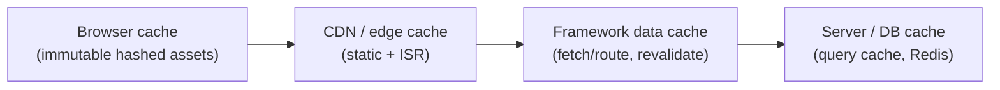

# 35 — Performance

### Core Web Vitals, Budgets, and Perceived Speed

> *"Performance is not a number in a lab. It is a stranger on a mid-range phone on a train, deciding in two seconds whether your product is worth their patience. Design for that person."*

---

**Chapter type:** Phase 7 — Quality Attributes
**DRI:** Performance Engineer + Frontend Architect
**Depends on:** [`00-CONSTITUTION.md`](./00-CONSTITUTION.md) (Article II), [`07`](./07-TYPOGRAPHY_SYSTEM.md), [`20`](./20-MOBILE_FIRST.md), [`30`](./30-REACT_GUIDE.md), [`31`](./31-NEXTJS_GUIDE.md)
**Feeds:** every surface + engineering chapter — performance is cross-cutting

---

## Table of Contents
1. [Purpose](#1-purpose)
2. [Philosophy](#2-philosophy)
3. [Principles](#3-principles)
4. [Best Practices](#4-best-practices)
5. [Anti-Patterns](#5-anti-patterns)
6. [Real-World Examples](#6-real-world-examples)
7. [Common Mistakes](#7-common-mistakes)
8. [AI Implementation Guidance](#8-ai-implementation-guidance)
9. [Human Review Checklist](#9-human-review-checklist)
10. [Automation Opportunities](#10-automation-opportunities)
11. [References for Further Study](#11-references-for-further-study)
12. [Review Checklist & Measurable Quality Criteria](#12-review-checklist--measurable-quality-criteria)

---

## 1. Purpose

This chapter defines how the studio makes software **fast** — and, just as important, how it *feels* fast. It covers the metrics that matter (Core Web Vitals and beyond), the discipline of **performance budgets** enforced in CI, the concrete techniques (JS reduction, image/font optimization, caching, rendering strategy), and the mindset that treats performance as a design and engineering requirement from day one — not a pre-launch scramble.

Performance is the single most-referenced quality attribute in this manual: it appears in typography (font loading, [`07`](./07-TYPOGRAPHY_SYSTEM.md)), mobile-first ([`20`](./20-MOBILE_FIRST.md)), landing pages ([`17`](./17-LANDING_PAGE_DESIGN.md)), e-commerce ([`19`](./19-ECOMMERCE_DESIGN.md)), React ([`30`](./30-REACT_GUIDE.md)), Next.js ([`31`](./31-NEXTJS_GUIDE.md)), and motion ([`23`](./23-MOTION_SYSTEM.md)/[`34`](./34-FRAMER_MOTION_GUIDE.md)). This chapter is the authoritative source those references point to. It operationalizes Constitution **Article II** ("Performance is part of design; a slow interface is a broken design").

---

## 2. Philosophy

**Performance is a feature, and slowness is a bug.** Users don't experience your Figma file or your clean architecture — they experience the *running product*, and if it's slow, none of the rest matters ([`04`](./04-DESIGN_PHILOSOPHY.md) P6, Article II). Performance directly moves the numbers everyone cares about: conversion, engagement, retention, bounce, and search ranking. It is not a "nice to have" you optimize if there's time; it is a load-bearing quality with measurable business and human impact. A beautiful page that takes six seconds has failed.

**Design for the P75 phone, not the developer's laptop.** The most dangerous performance illusion is testing on a fast machine, a fast network, and a warm cache. Real users are on mid-range Android phones, flaky mobile networks, and cold caches — and the performance gap between a developer's setup and a real user's can be 5–10×. We measure and budget against the **75th-percentile real-user experience** (throttled CPU, slow network), not the lab best case (Article X — evidence over comfortable assumptions).

**Perceived performance is as real as measured performance.** How fast something *feels* is a function of feedback and sequencing, not just raw milliseconds. Instant acknowledgment ([`24`](./24-MICRO_INTERACTIONS.md)), skeleton screens, streaming the important parts first, and optimistic UI can make a product feel fast even when work is still happening. Conversely, a technically-quick page that shows a blank screen then jumps around (layout shift) feels broken. We optimize both the numbers *and* the experience of waiting.

**The fastest code is the code you don't ship.** Most web performance problems are *weight* problems — too much JavaScript, too-large images, too many requests, unused CSS. The highest-leverage optimization is almost always *subtraction*: ship less JS (Server Components, [`31`](./31-NEXTJS_GUIDE.md)), fewer/smaller images, less third-party code. Performance and simplicity are the same discipline viewed from different angles (Article VIII). Optimize by removing before you optimize by tuning.

---

## 3. Principles

### Principle 1 — Meet Core Web Vitals (LCP, INP, CLS)
Good thresholds at P75: **LCP ≤ 2.5s**, **INP ≤ 200ms**, **CLS ≤ 0.1**.
> *Rationale (Art. II):* These are the user-centric, ranking-relevant metrics.

### Principle 2 — Set performance budgets and enforce them in CI
Hard limits (JS KB, image weight, LCP, CLS) that block merges when exceeded.
> *Rationale (Art. III-style floor):* Un-enforced budgets erode silently.

### Principle 3 — Measure real users (RUM) + lab, at P75
Combine field data (RUM) with lab tests (Lighthouse) under throttling.
> *Rationale (Art. X):* Lab ≠ field; the P75 phone is the real bar.

### Principle 4 — Ship less JavaScript
Server-render/Server Components, code-split, tree-shake, defer/lazy-load, minimize third parties.
> *Rationale (Art. VIII, [`31`](./31-NEXTJS_GUIDE.md)):* JS is the most expensive resource.

### Principle 5 — Optimize the critical rendering path
Prioritize above-the-fold; preload critical assets; avoid render-blocking resources.
> *Rationale:* LCP lives in the critical path.

### Principle 6 — Images and fonts are usually the biggest wins
Responsive/modern-format/lazy images with reserved space; subset, `swap`, self-hosted fonts.
> *Rationale ([`07`](./07-TYPOGRAPHY_SYSTEM.md), [`19`](./19-ECOMMERCE_DESIGN.md)):* Media dominates page weight + LCP/CLS.

### Principle 7 — Prevent layout shift (CLS) by reserving space
Set dimensions/`aspect-ratio`; no late-injected content above content; stable fonts.
> *Rationale:* Shifting layout is jarring and mis-taps.

### Principle 8 — Cache deliberately at every layer
CDN/edge, HTTP caching, framework data cache, and client caching — controlled, not accidental.
> *Rationale ([`31`](./31-NEXTJS_GUIDE.md)):* Caching is the biggest speed multiplier.

### Principle 9 — Optimize perceived performance
Instant feedback, skeletons, streaming, optimistic UI, prefetch likely next steps.
> *Rationale ([`24`](./24-MICRO_INTERACTIONS.md)):* Feel is as real as measurement.

### Principle 10 — Performance is designed in, monitored continuously
Consider it from wireframe to production; watch it forever ([`48`](./48-MONITORING.md), [`50`](./50-CONTINUOUS_IMPROVEMENT.md)).
> *Rationale (Art. II):* Perf regresses without vigilance.

---

## 4. Best Practices

### 4.1 The metrics that matter
| Metric | What it measures | Good (P75) |
| --- | --- | --- |
| **LCP** (Largest Contentful Paint) | Loading — when main content appears | ≤ 2.5s |
| **INP** (Interaction to Next Paint) | Responsiveness — input → visual response | ≤ 200ms |
| **CLS** (Cumulative Layout Shift) | Visual stability — unexpected movement | ≤ 0.1 |
| **TTFB** | Server/network responsiveness | ≤ ~0.8s |
| **FCP** | First content paint | ≤ ~1.8s |
| **TBT** (lab proxy for INP) | Main-thread blocking | ≤ ~200ms |

### 4.2 The performance budget (enforced in CI, [`47`](./47-DEPLOYMENT.md))
```jsonc
// Example budget — fail the build if exceeded
{
  "resourceSizes": [
    { "resourceType": "script", "budget": 170 },   // KB gzipped JS (initial route)
    { "resourceType": "image", "budget": 300 },
    { "resourceType": "font", "budget": 100 },
    { "resourceType": "total", "budget": 600 }
  ],
  "timings": [
    { "metric": "largest-contentful-paint", "budget": 2500 },
    { "metric": "cumulative-layout-shift", "budget": 0.1 },
    { "metric": "interaction-to-next-paint", "budget": 200 }
  ]
}
```
A budget nobody enforces is a wish. Wire Lighthouse CI + bundle-size checks to block merges (§10).

### 4.3 Ship less JavaScript ([`31`](./31-NEXTJS_GUIDE.md), [`30`](./30-REACT_GUIDE.md))
- **Server Components / SSR** by default; keep `"use client"` on small leaves.
- **Code-split** by route and lazy-load heavy/optional client widgets (`dynamic(() => …)`).
- **Tree-shake**; audit the bundle (why is this here?); prefer smaller libraries; avoid moment-sized deps.
- **Ruthlessly limit third-party scripts** (analytics, chat, tags) — they're often the biggest, least-controlled weight; load async/deferred, and question each one.

### 4.4 Optimize images ([`19`](./19-ECOMMERCE_DESIGN.md))
- **Responsive** (`srcset`/`sizes`) so phones don't download desktop images.
- **Modern formats** (AVIF/WebP) with fallbacks.
- **Lazy-load** below-the-fold; **eager + preload** the LCP image.
- **Reserve space** (`width`/`height` or `aspect-ratio`) → no CLS.
- Use the framework primitive (`next/image`, [`31`](./31-NEXTJS_GUIDE.md)) which does most of this.

### 4.5 Optimize fonts ([`07`](./07-TYPOGRAPHY_SYSTEM.md))
Self-host `woff2`, **subset** to needed glyphs, `font-display: swap`, **preload** the critical face, use a **metrics-matched fallback** to prevent CLS, prefer **variable** fonts over many weights. `next/font` handles most of this.

### 4.6 Optimize the critical path
- Inline critical CSS / minimize render-blocking CSS/JS.
- `preconnect`/`dns-prefetch` critical origins; `preload` the LCP asset + critical font.
- Defer non-critical JS; avoid long main-thread tasks (break them up) to protect INP.

### 4.7 Caching layers ([`31`](./31-NEXTJS_GUIDE.md), [`47`](./47-DEPLOYMENT.md))

Cache static assets immutably (content-hashed filenames); cache pages/data at the edge where possible; revalidate precisely on change ([`31`](./31-NEXTJS_GUIDE.md)); add a data/query cache for hot DB reads ([`39`](./39-DATABASE_DESIGN.md)).

### 4.8 Perceived performance ([`24`](./24-MICRO_INTERACTIONS.md), [`31`](./31-NEXTJS_GUIDE.md))
- **Instant feedback** (<100ms) on every interaction.
- **Skeletons** matching final geometry (no CLS); **stream** the shell then slower parts (Suspense).
- **Optimistic UI** for actions that usually succeed (reconcile on failure, [`24`](./24-MICRO_INTERACTIONS.md)).
- **Prefetch** likely next routes/data on intent (hover/viewport).

### 4.9 Runtime performance (INP)
Keep the main thread free: virtualize long lists ([`16`](./16-DASHBOARD_DESIGN.md)), debounce/throttle high-frequency handlers, avoid unnecessary re-renders ([`30`](./30-REACT_GUIDE.md)), offload heavy work (web workers), animate cheap properties only ([`23`](./23-MOTION_SYSTEM.md)).

---

## 5. Anti-Patterns

| Anti-pattern | Why it fails | Principle |
| --- | --- | --- |
| **Testing only on fast dev machine/network** | Hides the real P75 experience. | P3 |
| **No performance budget** (or unenforced) | Silent, cumulative regression. | P2 |
| **JS everywhere** (whole app client-rendered) | Huge bundles; slow TTI/INP. | P4 |
| **Unoptimized images** (``, desktop-size on mobile, no dims) | Slow LCP + CLS; wasted bandwidth. | P6, P7 |
| **Render-blocking fonts / FOIT** | Invisible text; late LCP; CLS. | P5, P6 |
| **Layout shift** (no reserved space; late banners) | Jarring; mis-taps; poor CLS. | P7 |
| **Third-party script sprawl** | Uncontrolled weight + main-thread blocking. | P4 |
| **Disabling caching** everywhere | Slow, expensive, repeated work. | P8 |
| **Optimizing without measuring** | Effort on non-bottlenecks. | P3, Art. X |
| **Long main-thread tasks** | Poor INP; janky interactions. | P9 |
| **"We'll optimize before launch"** | Perf debt compounds; hard to retrofit. | P10 |

---

## 6. Real-World Examples

### Example A — Server Components halved the bundle
A dashboard client-rendered everything and shipped a large JS bundle; LCP on a throttled phone was ~5s. Moving data-fetching + static markup to **Server Components** and keeping only interactive leaves as `"use client"` ([`31`](./31-NEXTJS_GUIDE.md)) cut the client JS dramatically and brought LCP under budget. *The biggest win was shipping less JS, not tuning what remained (Principle 4, Article VIII).*

### Example B — Reserving space fixed a CLS disaster
A content page loaded images without dimensions and injected a cookie banner above the fold; content jumped as things loaded (CLS ~0.4) and users mis-tapped. Adding **`aspect-ratio`/dimensions** to media, reserving the banner's space, and using metrics-matched fonts ([`07`](./07-TYPOGRAPHY_SYSTEM.md)) dropped CLS under 0.1. *Layout shift is almost always unreserved space (Principle 7).*

### Example C — Perceived speed beat raw speed
A search that took ~1.2s felt broken because it showed a blank area then popped results in. No backend change was made; instead they added **instant input feedback, a skeleton, and streamed results** ([`24`](./24-MICRO_INTERACTIONS.md), Principle 9). Measured time was identical; *perceived* speed and satisfaction rose sharply. *How waiting feels is as real as the milliseconds.*

---

## 7. Common Mistakes

- **Only testing on a fast laptop/network** (no throttling, no P75).
- **No enforced budget**, so bundles and images creep up over time.
- **Client-rendering everything** instead of leveraging the server ([`31`](./31-NEXTJS_GUIDE.md)).
- **Shipping desktop-sized/unoptimized images** and `` without dimensions.
- **Render-blocking or FOIT fonts** ([`07`](./07-TYPOGRAPHY_SYSTEM.md)).
- **Unreserved space** causing layout shift.
- **Adding third-party scripts** without measuring their cost.
- **Optimizing by guesswork** instead of profiling the actual bottleneck.
- **Treating perf as a pre-launch task** rather than a continuous one.

---

## 8. AI Implementation Guidance

### 8.1 Where agents help
- **Generate performance budgets + Lighthouse CI config** and wire them to block merges.
- **Refactor for less JS** (Server Components, code-split, lazy-load, lighter deps).
- **Optimize images/fonts** (responsive/modern/lazy + reserved space; subset/preload/swap).
- **Diagnose CWV** from a report and prescribe targeted fixes (LCP asset, CLS source, INP long tasks).
- **Audit** for the anti-patterns in §5 (bundle bloat, unoptimized media, third-party sprawl, layout shift).

### 8.2 Hard rules (Art. II, VIII, X)
- The agent **sets/respects a performance budget** and targets **CWV at P75** (LCP ≤2.5s, INP ≤200ms, CLS ≤0.1).
- **Ship less JS by default** (Server Components/SSR, small client leaves, lazy-load); it justifies each third-party script.
- **Images/fonts always optimized** (responsive/modern/lazy + reserved dimensions; subset/swap/preload) — never raw ``/unbounded fonts.
- **Reserve space** to prevent CLS; keep the **main thread free** (protect INP).
- **Optimize by measurement**, not guesswork (Art. X); it reports the metric it's improving.
- **Cache deliberately** ([`31`](./31-NEXTJS_GUIDE.md)); never blanket-disable.

### 8.3 Prompt example — build within budget
```
ROLE: Performance Engineer, bound by 00-CONSTITUTION + 35 (+31/30/07).
TASK: Build/optimize <page> to meet the budget.
BUDGET: initial JS ≤170KB gz; LCP ≤2.5s, INP ≤200ms, CLS ≤0.1 at P75 (throttled).
CONSTRAINTS:
  - Server Components/SSR by default; small "use client" leaves; code-split heavy widgets.
  - next/image (responsive/modern/lazy, reserved dims) + next/font (subset/swap/preload).
  - Reserve space for all media/embeds (no CLS); keep main-thread tasks short (INP).
  - Deliberate caching + precise revalidation; minimal justified third-party scripts.
  - Perceived speed: instant feedback + skeletons + streaming + prefetch.
OUTPUT: implementation + which metric each choice targets + a Lighthouse-CI budget config.
```

### 8.4 Prompt example — audit
```
TASK: From this Lighthouse/CWV report + bundle stats, diagnose the top performance problems.
For each: identify the cause (LCP asset, CLS source, long INP tasks, oversized JS/deps, third-party),
and give a targeted fix with expected impact. Output prioritized {issue, cause, fix, metric affected}.
```

---

## 9. Human Review Checklist

- [ ] **Core Web Vitals** meet thresholds at **P75** (LCP ≤2.5s, INP ≤200ms, CLS ≤0.1).
- [ ] A **performance budget** exists and is **enforced in CI**.
- [ ] Measured with **RUM + lab under throttling** (not just fast dev setup).
- [ ] **JS minimized** (Server Components/SSR, code-split, lazy-load, lean deps); third parties justified.
- [ ] **Images optimized** (responsive/modern/lazy) with **reserved dimensions**; LCP image prioritized.
- [ ] **Fonts optimized** (subset/`swap`/preload/metrics-matched); variable where possible.
- [ ] **No layout shift** — space reserved for media/embeds/banners.
- [ ] **Caching** controlled at each layer; revalidation precise.
- [ ] **Perceived performance** handled (feedback, skeletons, streaming, prefetch).
- [ ] **Main thread protected** (virtualization, throttling, cheap animations) for good INP.

---

## 10. Automation Opportunities

| Task | Automation |
| --- | --- |
| CWV/lab budgets | Lighthouse CI with timing + resource budgets; block merge on breach. |
| Bundle budgets | `size-limit` / bundle-analyzer checks per route in CI ([`47`](./47-DEPLOYMENT.md)). |
| RUM | Real-user CWV collection (web-vitals lib) → dashboard + alerts ([`48`](./48-MONITORING.md)). |
| Image checks | Lint banning ``/missing dimensions; build-time image pipeline. |
| Font checks | CI: woff2-only, subset size, `font-display`, preload present ([`07`](./07-TYPOGRAPHY_SYSTEM.md)). |
| Third-party audit | Flag new third-party scripts + their weight in PRs. |
| Regression alerts | Alert on CWV/bundle regressions between deploys ([`50`](./50-CONTINUOUS_IMPROVEMENT.md)). |

---

## 11. References for Further Study
- **Core Web Vitals & how-to:** web.dev (LCP, INP, CLS guides; optimize-* series); Chrome DevTools/Lighthouse docs.
- **Budgets & RUM:** the performance-budget methodology; the `web-vitals` library for field measurement.
- **Framework perf:** Next.js performance docs ([`31`](./31-NEXTJS_GUIDE.md)); React performance ([`30`](./30-REACT_GUIDE.md)).
- **Foundational:** Addy Osmani's writing on JS/image performance; the "cost of JavaScript" research.
- **Cross-references:** [`07-TYPOGRAPHY_SYSTEM.md`](./07-TYPOGRAPHY_SYSTEM.md), [`19-ECOMMERCE_DESIGN.md`](./19-ECOMMERCE_DESIGN.md), [`20-MOBILE_FIRST.md`](./20-MOBILE_FIRST.md), [`23-MOTION_SYSTEM.md`](./23-MOTION_SYSTEM.md), [`30-REACT_GUIDE.md`](./30-REACT_GUIDE.md), [`31-NEXTJS_GUIDE.md`](./31-NEXTJS_GUIDE.md), [`48-MONITORING.md`](./48-MONITORING.md).

---

## 12. Review Checklist & Measurable Quality Criteria

| Criterion | Target (P75) |
| --- | --- |
| LCP | ≤ 2.5s |
| INP | ≤ 200ms |
| CLS | ≤ 0.1 |
| Initial route JS (gzipped) | ≤ 170KB (budget) |
| Performance budget enforced in CI | Yes (blocking) |
| Images responsive + dimensioned | 100% |
| Fonts subset/`swap`/preloaded | 100% |
| CWV monitored via RUM in production | Yes |

---

*End of `35-PERFORMANCE.md`.*
