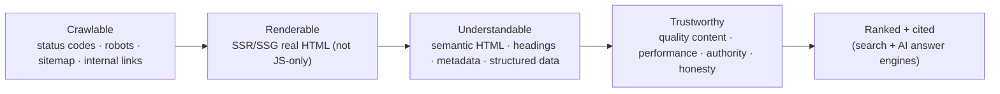

# 36 — SEO (Search & Discoverability)

### Being Findable — Technically, Semantically, and Honestly

> *"You can build the best product in the world, but if a search engine can't crawl it, understand it, and trust it, most people will never know it exists. SEO is the bridge between great work and the people who need it."*

---

**Chapter type:** Phase 7 — Quality Attributes
**DRI:** SEO Specialist + Frontend Architect
**Depends on:** [`00-CONSTITUTION.md`](./00-CONSTITUTION.md), [`09`](./09-LAYOUT_SYSTEM.md), [`22`](./22-ACCESSIBILITY.md), [`25`](./25-COPYWRITING.md), [`27`](./27-INFORMATION_ARCHITECTURE.md), [`31`](./31-NEXTJS_GUIDE.md), [`35`](./35-PERFORMANCE.md)
**Feeds:** [`17-LANDING_PAGE_DESIGN.md`](./17-LANDING_PAGE_DESIGN.md), [`19-ECOMMERCE_DESIGN.md`](./19-ECOMMERCE_DESIGN.md)

---

## Table of Contents
1. [Purpose](#1-purpose)
2. [Philosophy](#2-philosophy)
3. [Principles](#3-principles)
4. [Best Practices](#4-best-practices)
5. [Anti-Patterns](#5-anti-patterns)
6. [Real-World Examples](#6-real-world-examples)
7. [Common Mistakes](#7-common-mistakes)
8. [AI Implementation Guidance](#8-ai-implementation-guidance)
9. [Human Review Checklist](#9-human-review-checklist)
10. [Automation Opportunities](#10-automation-opportunities)
11. [References for Further Study](#11-references-for-further-study)
12. [Review Checklist & Measurable Quality Criteria](#12-review-checklist--measurable-quality-criteria)

---

## 1. Purpose

This chapter defines how the studio makes products **discoverable** by search engines (and, increasingly, AI answer engines) — through technical SEO (crawlability, rendering, performance), on-page SEO (semantic structure, metadata, content), and structured data — done **honestly**, without manipulative tricks. It is the discoverability counterpart to accessibility ([`22`](./22-ACCESSIBILITY.md)): both depend on semantic, well-structured, well-labeled HTML, and doing one well largely does the other.

SEO is referenced by the landing-page ([`17`](./17-LANDING_PAGE_DESIGN.md)) and e-commerce ([`19`](./19-ECOMMERCE_DESIGN.md)) chapters and depends on IA ([`27`](./27-INFORMATION_ARCHITECTURE.md)), performance ([`35`](./35-PERFORMANCE.md)), Next.js rendering ([`31`](./31-NEXTJS_GUIDE.md)), and copy ([`25`](./25-COPYWRITING.md)). This chapter is the authoritative source. The studio's stance: **earn rankings by being genuinely fast, accessible, well-structured, and useful** — never by gaming algorithms (Article I, III).

---

## 2. Philosophy

**SEO is a byproduct of quality, not a bag of tricks.** Modern search engines are built to reward pages that are fast, accessible, well-structured, and genuinely useful to a real person's intent. Almost everything in this manual — semantic HTML ([`09`](./09-LAYOUT_SYSTEM.md), [`22`](./22-ACCESSIBILITY.md)), performance ([`35`](./35-PERFORMANCE.md)), clear IA ([`27`](./27-INFORMATION_ARCHITECTURE.md)), good copy ([`25`](./25-COPYWRITING.md)) — *is* SEO. When you build for humans and machines equally well, rankings largely follow. The era of keyword-stuffing shortcuts is over; the durable strategy is quality (Article I).

**Crawlable, renderable, understandable, trustworthy — in that order.** A search engine must be able to *reach* your pages (crawl), *see* your content (render — a real risk with client-only rendering), *interpret* them (semantics + structured data), and *trust* them (quality, authority, no manipulation). A failure at any earlier stage makes the later ones moot: perfect content on a page that returns the wrong status code or renders blank without JS is invisible. We fix the pipeline in order.

**Serve intent, not keywords.** People search to accomplish something — to *know*, to *do*, to *buy*, to *go*. Great SEO content matches the *intent* behind a query, not just its literal words. This aligns SEO with the whole product philosophy: understand the user's job ([`01`](./01-PROJECT_DISCOVERY.md)) and serve it well. Content written for algorithms reads like it was written for algorithms — and increasingly ranks like it too.

**Discoverability now includes AI answer engines.** Search is expanding beyond ten blue links to AI-generated answers and assistants that read, summarize, and cite pages. The same foundations — clean semantic HTML, structured data, clear factual content, fast rendering — make a page equally consumable by a crawler and an LLM. Building well-structured, honest, machine-readable content future-proofs discoverability across both worlds.

---

## 3. Principles

### Principle 1 — Be crawlable and indexable
Correct status codes, robots directives, sitemap, no accidental `noindex`/blocking; clean internal linking.
> *Rationale:* Uncrawlable = invisible, regardless of content.

### Principle 2 — Ensure content renders without relying on client JS
Prefer SSR/SSG so crawlers (and AI) get real HTML; don't hide content behind client-only rendering.
> *Rationale ([`31`](./31-NEXTJS_GUIDE.md)):* Client-only content risks being unseen/late-seen.

### Principle 3 — Semantic HTML + one clear `h1` + logical headings
Structure content meaningfully (landmarks, headings, lists) — the same structure that serves a11y.
> *Rationale ([`09`](./09-LAYOUT_SYSTEM.md), [`22`](./22-ACCESSIBILITY.md)):* Semantics = machine understanding.

### Principle 4 — Unique, descriptive metadata per page
Unique `<title>`, meta description, canonical, Open Graph/Twitter cards on every page.
> *Rationale ([`31`](./31-NEXTJS_GUIDE.md)):* Metadata drives SERP presentation + social sharing.

### Principle 5 — Structured data (Schema.org / JSON-LD) where relevant
Mark up products, articles, FAQs, breadcrumbs, orgs for rich results + machine understanding.
> *Rationale:* Structured data earns rich results and feeds answer engines.

### Principle 6 — Performance & Core Web Vitals are ranking + UX factors
Fast, stable pages rank better and convert better ([`35`](./35-PERFORMANCE.md)).
> *Rationale (Art. II):* Page experience is part of ranking and of quality.

### Principle 7 — Clean, stable, hierarchical URLs
Readable, logical URLs reflecting IA; stable (301-redirect on change); canonical for duplicates.
> *Rationale ([`27`](./27-INFORMATION_ARCHITECTURE.md)):* URLs are structure + trust signals.

### Principle 8 — Content serves real intent, honestly
Useful, accurate, intent-matched content; no keyword stuffing, cloaking, or manipulation.
> *Rationale (Art. I, III):* Quality is the durable strategy; tricks get penalized.

### Principle 9 — Accessible = discoverable (they reinforce each other)
Alt text, semantic structure, and clarity serve both users with AT and crawlers.
> *Rationale ([`22`](./22-ACCESSIBILITY.md)):* Do the work once; benefit twice.

---

## 4. Best Practices

### 4.1 The discoverability pipeline

Fix left-to-right: a downstream win is wasted if an upstream stage is broken.

### 4.2 Technical SEO foundations
- **Status codes:** 200 for real pages, 301 for moved (never soft-404s); 404 for missing.
- **`robots.txt`** + per-page robots meta (only `noindex` what you mean to); don't accidentally block CSS/JS or whole sections.
- **`sitemap.xml`** (auto-generated, [`27`](./27-INFORMATION_ARCHITECTURE.md)) submitted to search consoles.
- **Canonical URLs** to dedupe (esp. faceted/param URLs in e-commerce, [`19`](./19-ECOMMERCE_DESIGN.md)).
- **HTTPS**, mobile-friendly ([`20`](./20-MOBILE_FIRST.md)), no intrusive interstitials.
- **Internal linking** with descriptive anchor text (spreads authority + aids crawl).

### 4.3 Rendering for SEO ([`31`](./31-NEXTJS_GUIDE.md))
Prefer **SSR/SSG** so crawlers receive complete HTML. Client-only SPAs risk content being unseen or rendered late/inconsistently. In Next.js: Server Components + static/dynamic rendering deliver real HTML by default — a major SEO advantage. Verify with "view source" / URL inspection that content is in the server response, not injected only by client JS.

### 4.4 On-page: metadata (Next.js Metadata API, [`31`](./31-NEXTJS_GUIDE.md))
```tsx
export const metadata = {
  title: "Project Atlas — Plan & ship software | Studio",   // unique, ≤ ~60 chars
  description: "Plan, track, and ship software in one place. Free to start.", // ~150–160 chars, benefit-led (25)
  alternates: { canonical: "https://example.com/atlas" },
  openGraph: { title: "…", description: "…", images: ["/og/atlas.png"], type: "website" },
  twitter: { card: "summary_large_image", title: "…", description: "…", images: ["/og/atlas.png"] },
};
```
- **Title:** unique per page, primary intent first, brand last.
- **Description:** compelling, accurate, benefit-led ([`25`](./25-COPYWRITING.md)) — it's ad copy for the SERP (not a ranking factor per se, but drives clicks).
- **OG/Twitter:** correct social preview (image dimensions right → no broken cards).

### 4.5 Structured data (JSON-LD)
```html
<script type="application/ld+json">
{
  "@context": "https://schema.org",
  "@type": "Product",
  "name": "Wireless Headphones",
  "image": ["https://example.com/img/headphones.jpg"],
  "offers": { "@type": "Offer", "price": "129.00", "priceCurrency": "USD", "availability": "https://schema.org/InStock" },
  "aggregateRating": { "@type": "AggregateRating", "ratingValue": "4.6", "reviewCount": "218" }
}
</script>
```
Use for **Product** (offers/price/availability/reviews, [`19`](./19-ECOMMERCE_DESIGN.md)), **Article**, **FAQ**, **BreadcrumbList**, **Organization**, **LocalBusiness**. Rules: mark up **only content visible on the page** (marking up invisible content is a violation); keep it accurate and in sync with the page; validate it.

### 4.6 Content & keyword strategy (intent-led, honest)
- Research the **intent** behind target queries (know/do/buy/go); map content to intent, not raw keywords.
- One primary topic per page; clear H1; descriptive subheads; scannable ([`05`](./05-VISUAL_PSYCHOLOGY.md), [`25`](./25-COPYWRITING.md)).
- Use natural language + relevant terms (no stuffing); answer the question thoroughly and accurately.
- Keep content fresh/accurate; fix outdated info; consolidate thin/duplicate pages.

### 4.7 Images & media SEO ([`35`](./35-PERFORMANCE.md), [`22`](./22-ACCESSIBILITY.md))
Descriptive `alt` (serves a11y + image search), descriptive filenames, responsive/optimized images, `ImageObject`/video structured data where relevant, lazy-load below the fold.

### 4.8 International / multi-region (where relevant)
`hreflang` for language/region variants; locale-aware URLs; consistent canonicalization; don't machine-translate carelessly ([`25`](./25-COPYWRITING.md) i18n).

### 4.9 Measure & iterate ([`48`](./48-MONITORING.md), [`50`](./50-CONTINUOUS_IMPROVEMENT.md))
Use Search Console (coverage, queries, CWV, rich-result status), analytics (organic traffic, landing pages), and rank/visibility tracking. SEO is continuous — content, competitors, and algorithms move.

---

## 5. Anti-Patterns

| Anti-pattern | Why it fails | Principle |
| --- | --- | --- |
| **Content only in client JS** | Crawlers/AI may not see it; late/inconsistent indexing. | P2 |
| **Accidental `noindex`/robots block** (staging config shipped) | De-indexes real pages; catastrophic. | P1 |
| **Duplicate/thin content, no canonicals** | Dilutes ranking; index bloat. | P7, P8 |
| **Missing/duplicate titles & descriptions** | Poor SERP presentation; lost clicks. | P4 |
| **Keyword stuffing / cloaking / hidden text** | Manipulation → penalties; dishonest. | P8, Art. III |
| **Non-semantic markup** (`div` soup, no h1) | Machines can't understand structure. | P3 |
| **Structured data for invisible/fake content** | Spam violation; loss of rich results. | P5, Art. III |
| **Slow/unstable pages** (poor CWV) | Worse ranking + UX. | P6 |
| **Opaque/unstable URLs** (no redirects on change) | Lost equity; broken links. | P7 |
| **Buying links / manipulative schemes** | Penalties; short-term at best. | P8, Art. III |
| **Ignoring alt text** | Loses image search + a11y. | P9 |

---

## 6. Real-World Examples

### Example A — SSR rescued an invisible SPA
A client-only React SPA had great content but near-zero organic traffic — "view source" showed an empty `<div id="root">`; crawlers saw nothing. Migrating to **SSR/Server Components** ([`31`](./31-NEXTJS_GUIDE.md)) so pages returned real HTML made the content indexable; organic impressions climbed within weeks. *Renderable comes before understandable (Principle 2).*

### Example B — The staging `noindex` that tanked a site
A deploy accidentally shipped the staging config with a site-wide `noindex` meta tag. Within days the site fell out of the index and organic traffic collapsed. The fix was one line — but the lesson was **automated checks** (§10) that fail the build if a production page is `noindex`/robots-blocked (Principle 1). *The cheapest catastrophe to prevent.*

### Example C — Product structured data earned rich results
An e-commerce site added **Product JSON-LD** (price, availability, aggregate rating) accurately matching visible content ([`19`](./19-ECOMMERCE_DESIGN.md), Principle 5). Listings began showing star ratings and prices directly in search results, lifting click-through meaningfully — earned by *marking up real, honest data*, not by tricks. *Structured data is understanding, not gaming (Principle 5, 8).*

---

## 7. Common Mistakes

- **Relying on client-side rendering** for important content.
- **Shipping `noindex`/robots blocks** from staging to production.
- **Duplicate/missing titles & descriptions**; no canonicals for param/faceted URLs.
- **Keyword stuffing** or writing for algorithms instead of intent.
- **Non-semantic HTML** / multiple or missing `h1`.
- **Structured data that doesn't match visible content** (or is invented).
- **Ignoring Core Web Vitals** as an SEO+UX factor.
- **Changing URLs without 301 redirects**, losing equity and breaking links.
- **Skipping alt text/filenames** (losing image search + a11y).

---

## 8. AI Implementation Guidance

### 8.1 Where agents help
- **Generate metadata** (unique titles/descriptions, OG/Twitter, canonical) via the Metadata API ([`31`](./31-NEXTJS_GUIDE.md)).
- **Produce accurate JSON-LD** for products/articles/FAQ/breadcrumbs matching visible content.
- **Audit** crawlability/rendering/semantics/metadata/CWV and produce a prioritized fix list.
- **Draft intent-led content outlines** (mapped to search intent, honest) — not keyword-stuffed copy.
- **Generate sitemaps/robots** and internal-linking suggestions.

### 8.2 Hard rules (Art. I, III)
- The agent ensures content is **renderable server-side** (real HTML), not client-JS-only ([`31`](./31-NEXTJS_GUIDE.md)).
- **Unique, accurate metadata per page**; canonical for duplicates; correct status codes; no accidental `noindex` on production pages.
- **Semantic HTML** (one `h1`, logical headings, landmarks) — same structure as a11y ([`22`](./22-ACCESSIBILITY.md)).
- **Structured data only for content actually on the page**, accurate and validated — never for invisible/fake content (Art. III).
- **No manipulative SEO** — no keyword stuffing, cloaking, hidden text, or link schemes, even if asked to "rank higher fast"; content serves **intent honestly**.
- **Performance/CWV** targeted as an SEO factor ([`35`](./35-PERFORMANCE.md)); **alt text** present ([`22`](./22-ACCESSIBILITY.md)).

### 8.3 Prompt example — SEO-complete page
```
ROLE: SEO Specialist + Frontend, bound by 00-CONSTITUTION + 36 (+31/35/22/25).
TASK: Make <page> SEO-complete.
CONSTRAINTS:
  - Server-render real HTML; semantic structure (one h1, logical headings, landmarks).
  - Unique title (≤60 chars, intent-first) + description (~150–160, benefit-led) + canonical + OG/Twitter.
  - JSON-LD for <type> matching ONLY visible, accurate content; validate it.
  - Alt text on images; clean hierarchical URL; internal links with descriptive anchors.
  - Meet CWV budget (35). No manipulative tactics; content matches real search intent.
OUTPUT: metadata + JSON-LD + semantic markup notes + an SEO self-check (crawl/render/understand/trust).
```

### 8.4 Prompt example — audit
```
TASK: Audit for: client-only-rendered content, accidental noindex/robots blocks, duplicate/missing
titles & descriptions, missing canonicals on param URLs, non-semantic markup / missing or multiple h1,
structured data not matching visible content, keyword stuffing, poor CWV, unstable URLs, and missing alt.
Output prioritized {issue, severity, fix}. Flag any manipulative tactic or de-indexing risk as a blocker.
```

---

## 9. Human Review Checklist

- [ ] Important content is **server-rendered** (real HTML), verified in "view source".
- [ ] **Crawlable/indexable**: correct status codes, intentional robots/`noindex`, sitemap, no blocked assets.
- [ ] **Semantic HTML**: one `h1`, logical headings, landmarks (shared with a11y, [`22`](./22-ACCESSIBILITY.md)).
- [ ] **Unique metadata** per page (title, description, canonical, OG/Twitter).
- [ ] **Structured data** present where relevant, **accurate + matching visible content**, validated.
- [ ] **Core Web Vitals** within budget ([`35`](./35-PERFORMANCE.md)).
- [ ] **URLs** clean, hierarchical, stable (301s on change); duplicates canonicalized.
- [ ] Content serves **real intent honestly** — no stuffing/cloaking/manipulation.
- [ ] **Alt text + descriptive filenames** on images.
- [ ] Discoverability **monitored** (Search Console, organic analytics).

---

## 10. Automation Opportunities

| Task | Automation |
| --- | --- |
| De-index guard | CI check failing build if production pages are `noindex`/robots-blocked. |
| Metadata audit | Automated checks: unique title/description, canonical, OG/Twitter present. |
| Structured-data validation | Schema.org / Rich Results validation in CI. |
| Render check | Verify key content is in server HTML (not JS-only). |
| CWV | Lighthouse CI + Search Console CWV monitoring ([`35`](./35-PERFORMANCE.md)). |
| Sitemap/robots | Auto-generate + validate sitemap.xml and robots.txt ([`27`](./27-INFORMATION_ARCHITECTURE.md)). |
| Broken-link / redirect | Crawl for 404s and missing redirects after URL changes. |
| Alt-text lint | Flag images missing meaningful alt ([`22`](./22-ACCESSIBILITY.md)). |

---

## 11. References for Further Study
- **Primary:** Google Search Central documentation (crawling/indexing, page experience, structured data guidelines, spam policies); Bing Webmaster guidelines.
- **Structured data:** Schema.org vocabulary; the Rich Results test/validator.
- **Performance & SEO:** web.dev on Core Web Vitals as page-experience ([`35`](./35-PERFORMANCE.md)).
- **Framework:** Next.js Metadata API + SEO guidance ([`31`](./31-NEXTJS_GUIDE.md)).
- **Cross-references:** [`09-LAYOUT_SYSTEM.md`](./09-LAYOUT_SYSTEM.md), [`17-LANDING_PAGE_DESIGN.md`](./17-LANDING_PAGE_DESIGN.md), [`19-ECOMMERCE_DESIGN.md`](./19-ECOMMERCE_DESIGN.md), [`22-ACCESSIBILITY.md`](./22-ACCESSIBILITY.md), [`25-COPYWRITING.md`](./25-COPYWRITING.md), [`27-INFORMATION_ARCHITECTURE.md`](./27-INFORMATION_ARCHITECTURE.md), [`31-NEXTJS_GUIDE.md`](./31-NEXTJS_GUIDE.md), [`35-PERFORMANCE.md`](./35-PERFORMANCE.md).

---

## 12. Review Checklist & Measurable Quality Criteria

| Criterion | Target |
| --- | --- |
| Important content server-rendered (indexable) | 100% |
| Production pages accidentally `noindex`/blocked | 0 (CI-guarded) |
| Pages with unique title + description + canonical | 100% |
| Relevant pages with valid structured data | 100% |
| Semantic structure (one h1, logical headings) | 100% |
| Core Web Vitals (page experience) | within budget ([`35`](./35-PERFORMANCE.md)) |
| Images with meaningful alt | 100% |
| Manipulative SEO tactics | 0 (Art. III) |
| Organic visibility / impressions | ↑ trend |

---

*End of `36-SEO.md`.*
