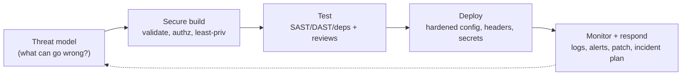

# 37 — Security

### The Non-Negotiable Floor: Protecting Users and Their Data

> *"Security is not a feature you sell; it is a promise you keep. Every input is hostile until proven safe, every secret is a liability, and the user's trust is the one thing you cannot rebuild once broken."*

---

**Chapter type:** Phase 7 — Quality Attributes
**DRI:** Security Engineer (lead) + Backend Architect
**Depends on:** [`00-CONSTITUTION.md`](./00-CONSTITUTION.md) (Article III — the floor), [`13`](./13-FORM_DESIGN.md), [`31`](./31-NEXTJS_GUIDE.md), [`32`](./32-TYPESCRIPT_GUIDE.md), [`39`](./39-DATABASE_DESIGN.md), [`40`](./40-API_DESIGN.md)
**Feeds:** [`38-AUTHENTICATION.md`](./38-AUTHENTICATION.md), [`47-DEPLOYMENT.md`](./47-DEPLOYMENT.md), [`48-MONITORING.md`](./48-MONITORING.md)

---

## Table of Contents
1. [Purpose](#1-purpose)
2. [Philosophy](#2-philosophy)
3. [Principles](#3-principles)
4. [Best Practices](#4-best-practices)
5. [Anti-Patterns](#5-anti-patterns)
6. [Real-World Examples](#6-real-world-examples)
7. [Common Mistakes](#7-common-mistakes)
8. [AI Implementation Guidance](#8-ai-implementation-guidance)
9. [Human Review Checklist](#9-human-review-checklist)
10. [Automation Opportunities](#10-automation-opportunities)
11. [References for Further Study](#11-references-for-further-study)
12. [Review Checklist & Measurable Quality Criteria](#12-review-checklist--measurable-quality-criteria)

---

## 1. Purpose

This chapter defines how the studio builds **secure** software — the practices that protect users, their data, and the systems we operate. It operationalizes Constitution **Article III**: security sits on the non-negotiable floor. No known-exploitable vulnerabilities, no secrets in source, all input validated — these are release blockers, not trade-offs to be weighed against a deadline.

Security is deeply cross-cutting: it appears in forms ([`13`](./13-FORM_DESIGN.md) — validation/sanitization), Next.js ([`31`](./31-NEXTJS_GUIDE.md) — the server/client boundary, Server Actions), TypeScript ([`32`](./32-TYPESCRIPT_GUIDE.md) — boundary validation), APIs ([`40`](./40-API_DESIGN.md)), databases ([`39`](./39-DATABASE_DESIGN.md)), deployment ([`47`](./47-DEPLOYMENT.md)), and authentication ([`38`](./38-AUTHENTICATION.md), its dedicated companion). This chapter is the authoritative source those references defer to. It uses the **OWASP** body of knowledge as its backbone.

---

## 2. Philosophy

**Security is a floor, not a feature — and it protects real people.** When we get security wrong, the harm doesn't fall on us; it falls on the users who trusted us with their data, their money, their private lives. A breach can mean identity theft, financial loss, or physical danger for vulnerable people. That is why Article III makes security non-negotiable: it is an ethical obligation, not a competitive line item. "We'll harden it after launch" is a decision to expose users to risk in the meantime, and we don't make it.

**Assume breach, defend in depth, grant least privilege.** No single control is perfect, so we layer them — even if one fails, others hold. We assume attackers *will* get past the perimeter and design so that the damage is contained (segmentation, least privilege, encryption). Every component, user, and service gets the *minimum* access it needs and no more, so a compromised part can't compromise the whole. Security is not a wall; it's a series of locked doors.

**All input is hostile until validated; never trust the client.** Every piece of data that crosses a trust boundary — form fields, URL params, headers, API bodies, file uploads, even "internal" service calls — is potentially malicious and must be validated and sanitized *on the server* ([`32`](./32-TYPESCRIPT_GUIDE.md) "parse, don't trust"). Client-side validation is UX, not security; it is trivially bypassed. The server is the only place trust is earned.

**Secrets are liabilities, and the boundary is sacred.** Every credential, token, and key is a thing that can leak — so we minimize them, never put them in source or client bundles, rotate them, and keep them server-side ([`31`](./31-NEXTJS_GUIDE.md) — the server/client boundary is a security boundary). And the whole edifice must be *maintained*: dependencies age into vulnerabilities, so patching is not optional housekeeping but active defense ([`49`](./49-MAINTENANCE.md)).

---

## 3. Principles

### Principle 1 — Security is the floor (Article III)
No known-exploitable vulns, no secrets in source, all input validated — release blockers.
> *Rationale:* Non-negotiable; deadlines never override.

### Principle 2 — Never trust input; validate + sanitize server-side
Treat all cross-boundary data as hostile; validate on the server ([`32`](./32-TYPESCRIPT_GUIDE.md), [`13`](./13-FORM_DESIGN.md)).
> *Rationale:* Client checks are bypassable; the server is the trust boundary.

### Principle 3 — Least privilege everywhere
Users, services, tokens, DB roles get the minimum access required.
> *Rationale:* Limits blast radius of any compromise.

### Principle 4 — Defense in depth
Layer controls (validation + parameterized queries + WAF + CSP + monitoring).
> *Rationale:* No single control is sufficient; redundancy contains failure.

### Principle 5 — Secrets stay out of source and out of the client
Env/secret manager only; never `NEXT_PUBLIC_*` for secrets; rotate; scan for leaks.
> *Rationale ([`31`](./31-NEXTJS_GUIDE.md)):* Leaked secrets = instant compromise.

### Principle 6 — Encrypt in transit and at rest; protect sensitive data
HTTPS everywhere; encrypt sensitive data at rest; hash passwords properly ([`38`](./38-AUTHENTICATION.md)); minimize data collected.
> *Rationale:* Data you can't read (or don't hold) can't be stolen usefully.

### Principle 7 — Authorize every action, server-side (not just authenticate)
Check *permission* on every protected operation on the server — not only in the UI ([`38`](./38-AUTHENTICATION.md)).
> *Rationale:* Broken access control is the #1 web risk (OWASP).

### Principle 8 — Keep dependencies patched; monitor and respond
Scan + update deps; log security events; have an incident plan ([`48`](./48-MONITORING.md), [`49`](./49-MAINTENANCE.md)).
> *Rationale:* Most breaches exploit known, unpatched vulns.

### Principle 9 — Fail securely and don't leak information
Errors reveal nothing sensitive (no stack traces/SQL to users); deny by default.
> *Rationale:* Verbose failures hand attackers a map.

---

## 4. Best Practices

### 4.1 The OWASP Top 10 — and how the studio addresses each
| Risk | Studio control |
| --- | --- |
| **Broken Access Control** | Authorize every action server-side; deny by default; object-level checks (ownership) ([`38`](./38-AUTHENTICATION.md)) |
| **Cryptographic Failures** | HTTPS/TLS; encrypt sensitive data at rest; strong password hashing (argon2/bcrypt); no home-rolled crypto |
| **Injection** (SQL/NoSQL/cmd) | Parameterized queries/ORM; validate + sanitize input; never string-concat queries ([`39`](./39-DATABASE_DESIGN.md)) |
| **Insecure Design** | Threat model early; secure defaults; this manual's floor |
| **Security Misconfiguration** | Hardened configs; security headers; no default creds; least-privilege infra ([`47`](./47-DEPLOYMENT.md)) |
| **Vulnerable Components** | Dependency scanning + timely patching ([`49`](./49-MAINTENANCE.md)) |
| **Auth Failures** | Strong auth, MFA, session/rate-limit ([`38`](./38-AUTHENTICATION.md)) |
| **Integrity Failures** | Verify integrity of deps/CI; SRI; signed artifacts |
| **Logging/Monitoring Failures** | Log security events; alert; retain; incident plan ([`48`](./48-MONITORING.md)) |
| **SSRF** | Validate/allow-list outbound URLs; restrict server fetches |

### 4.2 Input validation & injection prevention ([`32`](./32-TYPESCRIPT_GUIDE.md), [`39`](./39-DATABASE_DESIGN.md))
```ts
// ✅ Validate at the boundary (parse, don't trust), then use parameterized queries
const Input = z.object({ email: z.string().email(), age: z.coerce.number().int().min(0).max(120) });
export async function handler(body: unknown) {
  const { email, age } = Input.parse(body);          // hostile input → validated
  return db.user.findMany({ where: { email } });      // ORM = parameterized (no injection)
}
// ❌ NEVER: `SELECT * FROM users WHERE email = '${email}'`  ← SQL injection
```
Validate type, format, length, range; allow-list where possible; sanitize output for context (see XSS below).

### 4.3 XSS prevention
- **Escape by default:** React escapes text — don't defeat it. Avoid `dangerouslySetInnerHTML`; if unavoidable, **sanitize** (e.g. DOMPurify) allow-listed HTML.
- **Content Security Policy (CSP):** restrict script/style/img sources; disallow inline scripts where feasible (a strong XSS mitigation).
- Never build HTML/URLs from unsanitized input; encode for the output context.

### 4.4 CSRF, headers, and the browser perimeter ([`31`](./31-NEXTJS_GUIDE.md), [`47`](./47-DEPLOYMENT.md))
- **CSRF:** use anti-CSRF tokens / same-site cookies for state-changing requests; verify origin on mutations ([`38`](./38-AUTHENTICATION.md)).
- **Security headers:** `Content-Security-Policy`, `Strict-Transport-Security` (HSTS), `X-Content-Type-Options: nosniff`, `X-Frame-Options`/frame-ancestors (clickjacking), `Referrer-Policy`, `Permissions-Policy`.
- Cookies: `HttpOnly`, `Secure`, `SameSite` for session/auth cookies ([`38`](./38-AUTHENTICATION.md)).

### 4.5 Secrets management ([`31`](./31-NEXTJS_GUIDE.md))
- Secrets in a **secret manager / server env only**; **never in source, git history, or client bundles**; never `NEXT_PUBLIC_*` for secrets.
- **Scan** for leaked secrets (pre-commit + CI); if leaked, **rotate immediately** (don't just delete the commit).
- **Rotate** credentials regularly; scope tokens to least privilege.

### 4.6 Server Actions / API endpoints are attack surface ([`31`](./31-NEXTJS_GUIDE.md), [`40`](./40-API_DESIGN.md))
Every Server Action and route handler: **authenticate → authorize (ownership) → validate input → rate-limit → then act.** Treat them as public regardless of which UI calls them.
```ts
"use server";
export async function deleteProject(id: string) {
  const session = await requireSession();                 // authenticate (38)
  const project = await db.project.findUnique({ where: { id } });
  if (!project || project.userId !== session.userId) throw forbidden(); // authorize (ownership)
  await db.project.delete({ where: { id } });
}
```

### 4.7 Data protection & privacy (Art. I/III, [`39`](./39-DATABASE_DESIGN.md))
- **Minimize** data collected (you can't lose what you don't hold, [`13`](./13-FORM_DESIGN.md) P1).
- **Encrypt** sensitive data at rest; hash passwords with a modern algorithm ([`38`](./38-AUTHENTICATION.md)); **never log** secrets/PII/PANs.
- Respect privacy law (consent, data-subject rights, retention limits, deletion) — privacy is a security *and* ethical concern.
- Destructive/data-exposing actions require authorization + are auditable ([`00`](./00-CONSTITUTION.md) Art. III).

### 4.8 File uploads, SSRF, and rate limiting
- **Uploads:** validate type/size, store outside the web root / in object storage, scan, never execute; generate safe filenames.
- **SSRF:** allow-list and validate any server-side outbound URL; block internal metadata endpoints.
- **Rate-limit** auth, sensitive, and expensive endpoints (brute-force + abuse defense, [`38`](./38-AUTHENTICATION.md)).

### 4.9 Secure SDLC (threat model → build → test → deploy → monitor)

Security is continuous — dependencies rot, threats evolve ([`48`](./48-MONITORING.md), [`49`](./49-MAINTENANCE.md), [`50`](./50-CONTINUOUS_IMPROVEMENT.md)).

---

## 5. Anti-Patterns

| Anti-pattern | Why it fails | Principle |
| --- | --- | --- |
| **Trusting client-side validation** for security | Trivially bypassed. | P2 |
| **String-concatenated queries** | SQL/NoSQL injection. | P2 |
| **Auth checks only in the UI** | Bypassable; broken access control (#1 risk). | P7 |
| **Secrets in source / client / `NEXT_PUBLIC_*`** | Instant compromise. | P5 |
| **`dangerouslySetInnerHTML` unsanitized** | XSS. | 4.3 |
| **Home-rolled crypto / weak password hashing (md5/sha1/plain)** | Broken confidentiality. | P6 |
| **No security headers / CSP** | Clickjacking, XSS, downgrade. | 4.4 |
| **Verbose errors** (stack traces/SQL to users) | Info leakage; attacker map. | P9 |
| **Over-privileged tokens/DB roles/services** | Large blast radius. | P3 |
| **Unpatched dependencies** | Exploited known vulns (most breaches). | P8 |
| **Logging secrets/PII** | Leak via logs. | P6 |
| **"Security later"** | Ships risk to users; hard to retrofit. | P1, Art. III |

---

## 6. Real-World Examples

### Example A — The UI-only authorization hole
An app hid the "delete" button for non-owners but the Server Action only checked *authentication*, not *ownership* — so any logged-in user could delete anyone's project by calling it directly. The fix (4.6, Principle 7): **object-level authorization** (`project.userId !== session.userId → forbidden`) on the server. *Broken access control is the #1 web risk precisely because "it's hidden in the UI" feels safe and isn't.*

### Example B — Parameterized queries closed an injection
A search endpoint built SQL by string-concatenating the query param: `... WHERE name LIKE '%${q}%'`. A crafted `q` could dump the database. Switching to **parameterized queries / the ORM** (4.2) made injection impossible, and adding input validation ([`32`](./32-TYPESCRIPT_GUIDE.md)) added a second layer (defense in depth, Principle 4). *Never build queries from strings.*

### Example C — The leaked key and why rotation matters
A developer committed an API key to git "temporarily." Even after deleting the commit, the key remained in history and was scraped by bots within hours. The correct response wasn't "remove the commit" — it was **rotate the key immediately** (4.5, Principle 5) *and* add secret scanning to pre-commit + CI so it can't recur. *A leaked secret is compromised the moment it's pushed; assume it, rotate it.*

---

## 7. Common Mistakes

- **Relying on client-side validation** as a security control.
- **Building queries by string concatenation** (injection).
- **Checking auth only in the UI**, not authorizing on the server (esp. object ownership).
- **Committing secrets** / exposing them via `NEXT_PUBLIC_*` or client bundles.
- **Unsanitized `dangerouslySetInnerHTML`** or building HTML from input (XSS).
- **Weak/home-rolled crypto**; storing passwords unhashed or with md5/sha1.
- **Missing security headers/CSP** and insecure cookie flags.
- **Verbose error messages** leaking internals.
- **Over-privileged** tokens/roles/services.
- **Neglecting dependency patching** and monitoring.

---

## 8. AI Implementation Guidance

Security is the area where AI must be *most* conservative: a plausible-looking but insecure snippet can ship a vulnerability at scale.

### 8.1 Where agents help
- **Generate secure-by-default code**: boundary validation ([`32`](./32-TYPESCRIPT_GUIDE.md)), parameterized queries, server-side authorization, security headers/CSP.
- **Audit** against the OWASP Top 10; find injection, broken access control, XSS sinks, secret leaks, missing authz.
- **Add rate limiting, CSRF protection, secure cookies, input allow-lists.**
- **Threat-model** a feature (what can go wrong; what to defend).
- **Draft incident-response + dependency-patching** workflows.

### 8.2 Hard rules (Art. III — the floor)
- The agent **validates all cross-boundary input server-side** and uses **parameterized queries** — never string-concatenated queries, never client-validation-as-security.
- **Authorizes every protected action on the server** (including object ownership) — not just in the UI ([`38`](./38-AUTHENTICATION.md)).
- **Never places secrets in source/client/`NEXT_PUBLIC_*`**; recommends rotation if a leak is detected.
- **No unsanitized `dangerouslySetInnerHTML`**; uses framework escaping + CSP; **no home-rolled crypto**; strong password hashing ([`38`](./38-AUTHENTICATION.md)).
- **Fails securely** (no sensitive info in errors); **least privilege**; **rate-limits** sensitive endpoints.
- The agent **refuses to introduce known-insecure patterns** even if asked for speed, and flags any security trade-off explicitly (Art. XII). It reports a **security self-check** (OWASP-mapped) on security-relevant output — and notes that automated checks are necessary but not sufficient (human security review required).

### 8.3 Prompt example — secure an endpoint
```
ROLE: Security Engineer + Backend, bound by 00-CONSTITUTION (Art. III) + 37 (+32/38/39).
TASK: Implement <endpoint / Server Action>.
CONSTRAINTS:
  - authenticate → authorize (object-level ownership) → validate input (Zod) → rate-limit → act.
  - Parameterized queries/ORM only (no string SQL); allow-list inputs where possible.
  - No secrets in code/client; secure cookies (HttpOnly/Secure/SameSite); CSRF protection for mutations.
  - Fail securely (no sensitive info in errors); least-privilege DB role.
OUTPUT: implementation + a security self-check mapped to OWASP Top 10 + note that human security review is still required.
```

### 8.4 Prompt example — audit
```
TASK: Security-audit this code against OWASP Top 10. Find: injection (string queries), broken access
control (UI-only/missing ownership checks), XSS sinks (dangerouslySetInnerHTML), secret leaks
(source/client/NEXT_PUBLIC_*), weak crypto/password handling, missing headers/CSP, verbose errors,
over-privilege, and unvalidated input. Output {location, risk, severity, exploit sketch, fix}, prioritized.
```

---

## 9. Human Review Checklist

- [ ] **All cross-boundary input validated + sanitized server-side** (not client-only).
- [ ] **No injection**: parameterized queries/ORM; no string-built queries.
- [ ] **Every protected action authorized server-side** (incl. object-level ownership), not just UI-gated.
- [ ] **No secrets** in source/git history/client/`NEXT_PUBLIC_*`; secret scanning active; leaks rotated.
- [ ] **XSS controlled**: framework escaping preserved; any `dangerouslySetInnerHTML` sanitized; **CSP** in place.
- [ ] **CSRF protection** + **secure cookies** (HttpOnly/Secure/SameSite) for state-changing/auth.
- [ ] **Crypto**: HTTPS/HSTS; sensitive data encrypted at rest; strong password hashing ([`38`](./38-AUTHENTICATION.md)); no home-rolled crypto.
- [ ] **Security headers** set (CSP, HSTS, nosniff, frame-ancestors, referrer/permissions policy).
- [ ] **Least privilege** for tokens/DB roles/services; **rate limiting** on sensitive endpoints.
- [ ] **Fails securely** (no info leakage); **dependencies patched**; security events **logged/monitored** ([`48`](./48-MONITORING.md)); incident plan exists.

---

## 10. Automation Opportunities

| Task | Automation |
| --- | --- |
| Secret scanning | Pre-commit + CI (gitleaks/trufflehog); block on detection. |
| Dependency scanning | SCA (Dependabot/Snyk/`npm audit`) in CI; block on high severity ([`49`](./49-MAINTENANCE.md)). |
| SAST | Static analysis (CodeQL/Semgrep) for injection/XSS/authz patterns. |
| DAST | Dynamic scanning (OWASP ZAP) against staging. |
| Header/CSP checks | Automated security-header + CSP validation in CI/monitoring. |
| Input-validation lint | Convention requiring schema validation at boundaries ([`32`](./32-TYPESCRIPT_GUIDE.md)). |
| Authz tests | E2E asserting non-owners are forbidden (object-level). |
| Security logging | Alert on auth failures, privilege changes, anomalies ([`48`](./48-MONITORING.md)). |

> **Automation gate + human gate:** CI enforces the machine-checkable subset; a human security review is required for auth, payments, and data-handling changes.

---

## 11. References for Further Study
- **OWASP:** the OWASP Top 10, Application Security Verification Standard (ASVS), Cheat Sheet Series (input validation, XSS, CSRF, secrets, auth), and OWASP ZAP.
- **Headers/CSP:** MDN + web.dev security-headers and Content Security Policy guides.
- **Crypto/passwords:** password-storage best practices (argon2/bcrypt); "don't roll your own crypto."
- **Framework:** Next.js security guidance (Server Actions, headers) ([`31`](./31-NEXTJS_GUIDE.md)); Node/JS supply-chain security.
- **Cross-references:** [`13-FORM_DESIGN.md`](./13-FORM_DESIGN.md), [`31-NEXTJS_GUIDE.md`](./31-NEXTJS_GUIDE.md), [`32-TYPESCRIPT_GUIDE.md`](./32-TYPESCRIPT_GUIDE.md), [`38-AUTHENTICATION.md`](./38-AUTHENTICATION.md), [`39-DATABASE_DESIGN.md`](./39-DATABASE_DESIGN.md), [`40-API_DESIGN.md`](./40-API_DESIGN.md), [`47-DEPLOYMENT.md`](./47-DEPLOYMENT.md), [`48-MONITORING.md`](./48-MONITORING.md), [`49-MAINTENANCE.md`](./49-MAINTENANCE.md).

---

## 12. Review Checklist & Measurable Quality Criteria

| Criterion | Target |
| --- | --- |
| Known-exploitable vulnerabilities at release | 0 (floor, Art. III) |
| Secrets in source/client | 0 (scanned) |
| Cross-boundary inputs validated server-side | 100% |
| Protected actions authorized server-side (incl. ownership) | 100% |
| High/critical dependency vulns unpatched | 0 (CI-blocked) |
| Security headers + CSP present | 100% of responses |
| Sensitive endpoints rate-limited | 100% |
| Human security review for auth/payments/data changes | 100% |
| Mean time to patch critical vulns | ≤ defined SLA ([`49`](./49-MAINTENANCE.md)) |

---

*End of `37-SECURITY.md`.*
