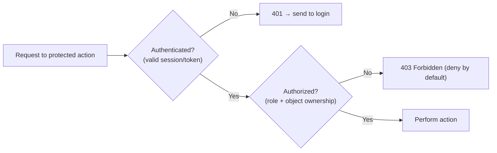

# 38 — Authentication & Authorization

### Identity, Sessions, and Who-Can-Do-What

> *"Authentication asks 'who are you?' Authorization asks 'are you allowed to do this?' Confuse them, skip the second, or roll your own crypto — and you've built a lock with the key taped to the door."*

---

**Chapter type:** Phase 7 — Quality Attributes
**DRI:** Security Engineer + Backend Architect (joint)
**Depends on:** [`00-CONSTITUTION.md`](./00-CONSTITUTION.md) (Article III), [`13`](./13-FORM_DESIGN.md), [`31`](./31-NEXTJS_GUIDE.md), [`37`](./37-SECURITY.md), [`39`](./39-DATABASE_DESIGN.md)
**Feeds:** [`18-SAAS_DESIGN.md`](./18-SAAS_DESIGN.md), [`29-USER_FLOWS.md`](./29-USER_FLOWS.md), [`40-API_DESIGN.md`](./40-API_DESIGN.md)

---

## Table of Contents
1. [Purpose](#1-purpose)
2. [Philosophy](#2-philosophy)
3. [Principles](#3-principles)
4. [Best Practices](#4-best-practices)
5. [Anti-Patterns](#5-anti-patterns)
6. [Real-World Examples](#6-real-world-examples)
7. [Common Mistakes](#7-common-mistakes)
8. [AI Implementation Guidance](#8-ai-implementation-guidance)
9. [Human Review Checklist](#9-human-review-checklist)
10. [Automation Opportunities](#10-automation-opportunities)
11. [References for Further Study](#11-references-for-further-study)
12. [Review Checklist & Measurable Quality Criteria](#12-review-checklist--measurable-quality-criteria)

---

## 1. Purpose

This chapter defines how the studio handles **authentication** (verifying identity) and **authorization** (enforcing permissions) — sessions, tokens, password handling, MFA, OAuth/social login, roles/permissions, and the secure flows around sign-up, login, logout, and password reset. It is the dedicated companion to Security ([`37`](./37-SECURITY.md)): where that chapter covers the whole security floor, this one goes deep on identity — the area with the most footguns and the highest stakes.

Auth touches forms ([`13`](./13-FORM_DESIGN.md) — login/reset UX), Next.js ([`31`](./31-NEXTJS_GUIDE.md) — server-side session checks, the boundary), user flows ([`29`](./29-USER_FLOWS.md) — auth flows and branches), SaaS ([`18`](./18-SAAS_DESIGN.md) — roles, seats, account states), APIs ([`40`](./40-API_DESIGN.md)), and databases ([`39`](./39-DATABASE_DESIGN.md) — user/session storage). This chapter operationalizes the identity portion of Constitution **Article III** (the floor).

---

## 2. Philosophy

**Authentication and authorization are different questions — and the second is the one people forget.** *Authentication* (authN) proves *who you are*; *authorization* (authZ) decides *what you may do*. The catastrophic, extremely common mistake is authenticating a user and then assuming that's enough — never checking, on the server, whether *this* user is allowed to perform *this* action on *this* object. "Broken access control" is the #1 web security risk ([`37`](./37-SECURITY.md)) precisely because authZ is invisible in the happy path and only bites when someone probes. Every protected action needs both questions answered, server-side.

**Don't roll your own auth; stand on proven shoulders.** Authentication is deceptively hard — password hashing, session management, token handling, timing attacks, reset-token entropy, MFA, account enumeration. The overwhelming default is to use a **battle-tested library or managed provider** (a well-maintained auth library, or a managed identity service) rather than hand-building. Home-grown auth is where subtle, devastating bugs live. We reserve custom auth for cases with genuine, justified need — and even then, lean on vetted primitives (Article VIII, XII).

**Treat every credential and token as radioactive.** Passwords are never stored, only *hashed* (with a modern, slow algorithm). Session tokens and secrets live in secure, `HttpOnly` cookies or a secret store — never in `localStorage` (XSS-readable) or client-visible code ([`37`](./37-SECURITY.md)). Tokens are scoped, short-lived where possible, and revocable. The blast radius of a leaked credential must be small and its lifetime short.

**Security and usability are partners, not opponents — designed together.** The most secure login is one nobody can use; the most usable is one anyone can breach. Great auth is *both*: MFA that's easy to enable, password rules that encourage strength without absurdity, social login for low friction, clear recovery flows, and honest error messages that help legitimate users without aiding attackers ([`13`](./13-FORM_DESIGN.md), [`25`](./25-COPYWRITING.md), [`29`](./29-USER_FLOWS.md)). We design auth flows with the same care as any core journey.

---

## 3. Principles

### Principle 1 — Authenticate identity, then authorize every action (server-side)
Verify who; then, on the server, verify permission for each protected operation (incl. object ownership).
> *Rationale ([`37`](./37-SECURITY.md), Art. III):* Broken access control is the top risk.

### Principle 2 — Don't roll your own auth
Use vetted libraries/providers; justify + review any custom auth.
> *Rationale (Art. VIII):* Auth is subtle; home-grown = bugs.

### Principle 3 — Hash passwords with a modern, slow algorithm
argon2id (preferred) or bcrypt/scrypt; salted; never plaintext/md5/sha1.
> *Rationale:* Fast/unsalted hashing is trivially cracked.

### Principle 4 — Secure sessions & tokens
`HttpOnly`+`Secure`+`SameSite` cookies (not `localStorage`); short-lived + rotating where possible; revocable.
> *Rationale ([`37`](./37-SECURITY.md)):* `localStorage` tokens are XSS-stealable.

### Principle 5 — Defend against brute force & enumeration
Rate-limit + lockout/backoff; generic auth errors; don't reveal which field was wrong or whether an account exists.
> *Rationale:* Prevents credential stuffing + account discovery.

### Principle 6 — Offer MFA; make it easy
Support (and encourage) a second factor (TOTP/WebAuthn/passkeys); step-up for sensitive actions.
> *Rationale:* MFA blocks the vast majority of account takeovers.

### Principle 7 — Least-privilege roles/permissions (RBAC/ABAC), enforced server-side
Model roles/permissions minimally; enforce on the server, not the UI.
> *Rationale ([`37`](./37-SECURITY.md) P3):* Over-privilege + UI-only checks = breaches.

### Principle 8 — Secure, humane recovery & lifecycle flows
Reset via short-lived, single-use, high-entropy tokens; secure sign-up/logout/session-expiry; cancel/delete honored ([`18`](./18-SAAS_DESIGN.md)).
> *Rationale:* Recovery is a prime attack + UX pain point.

### Principle 9 — Auth UX is designed with care
Clear, accessible, honest login/reset/MFA flows ([`13`](./13-FORM_DESIGN.md), [`29`](./29-USER_FLOWS.md), [`25`](./25-COPYWRITING.md)).
> *Rationale (Art. I):* Bad auth UX locks out legitimate users.

---

## 4. Best Practices

### 4.1 authN vs. authZ (keep them straight)

Both checks happen **on the server** on **every** protected action — never assume the UI hid it.

### 4.2 Choosing an approach
| Option | When |
| --- | --- |
| **Managed identity provider** (hosted auth) | Fastest, offloads most risk; great default for most products |
| **Vetted auth library** (self-hosted, e.g. Auth.js / Lucia-style) | Want control + own the data; still standing on proven code |
| **OAuth / social / SSO** (Google, GitHub, SAML/OIDC for enterprise) | Low friction; enterprise requirements |
| **Passkeys / WebAuthn** | Phishing-resistant, passwordless — increasingly the best UX + security |
| **Roll your own** | Only with strong justification + security review (Art. XII) — rarely |

### 4.3 Password handling (if you store passwords at all)
- **Hash** with **argon2id** (preferred) or bcrypt; per-user salt (built into these); never encrypt-reversibly or store plaintext.
- **Password policy** aligned with modern guidance (NIST-style): encourage length/passphrases, **check against breached-password lists**, *don't* force arbitrary composition rules or frequent rotation, allow paste + password managers ([`13`](./13-FORM_DESIGN.md)).
- Consider going **passwordless** (passkeys/magic links) to sidestep password risks entirely.

### 4.4 Sessions & tokens
- **Session cookies:** `HttpOnly`, `Secure`, `SameSite=Lax/Strict`; server-side session store (revocable) or signed stateless tokens with care.
- **JWTs:** short-lived access + rotating refresh; store refresh securely (HttpOnly cookie), keep a revocation strategy; validate signature + expiry + audience; **never** put secrets/PII in the (readable) payload.
- **Rotate** session on privilege change/login; **invalidate** on logout + password change; sensible idle + absolute timeouts.

### 4.5 Server-side checks in Next.js ([`31`](./31-NEXTJS_GUIDE.md), [`37`](./37-SECURITY.md))
```ts
"use server";
export async function updateOrg(orgId: string, data: unknown) {
  const session = await requireSession();                         // authN
  const input = OrgUpdate.parse(data);                            // validate (32/37)
  const member = await db.membership.findFirst({ where: { orgId, userId: session.userId } });
  if (!member || !can(member.role, "org:update")) throw forbidden(); // authZ: role + membership
  return db.org.update({ where: { id: orgId }, data: input });
}
```
Enforce in Server Components / Server Actions / route handlers / middleware — the UI hiding a control is **not** access control.

### 4.6 Brute-force & enumeration defense (Principle 5)
- **Rate-limit** login/reset/MFA by IP + account; exponential backoff / temporary lockout.
- **Generic errors:** "That email or password is incorrect" (not "no such user" / "wrong password") — prevents enumeration ([`13`](./13-FORM_DESIGN.md), [`25`](./25-COPYWRITING.md)).
- Same for password reset ("If an account exists, we've sent an email"), signup, and MFA.
- CAPTCHA/bot defense on abuse-prone endpoints; monitor for credential-stuffing patterns ([`48`](./48-MONITORING.md)).

### 4.7 MFA & step-up (Principle 6)
Offer TOTP (authenticator apps) and/or **WebAuthn/passkeys** (phishing-resistant); provide recovery codes; **step-up** auth (re-verify) for sensitive actions (changing email/password, payments, deleting account). Make enabling MFA easy and clearly beneficial.

### 4.8 Authorization models ([`37`](./37-SECURITY.md))
- **RBAC** (roles → permissions) for most apps; **ABAC**/policy for fine-grained/attribute-based needs.
- Model **least privilege**; centralize permission checks (`can(role, action, resource)`); include **object-level** (ownership/tenancy) checks — critical for multi-tenant SaaS ([`18`](./18-SAAS_DESIGN.md)).
- Test authZ explicitly (non-owner/other-tenant must be forbidden, §10).

### 4.9 Auth flow UX ([`13`](./13-FORM_DESIGN.md), [`29`](./29-USER_FLOWS.md), [`25`](./25-COPYWRITING.md))
Design the *full* flows incl. branches (existing account, wrong password, unverified email, expired reset link, MFA lost-device): accessible forms, correct input types/autocomplete (`current-password`/`new-password`), never-block-paste, clear honest errors, secure but humane recovery, and **cancellation/deletion as easy as signup** ([`18`](./18-SAAS_DESIGN.md), Art. III).

---

## 5. Anti-Patterns

| Anti-pattern | Why it fails | Principle |
| --- | --- | --- |
| **Authenticate but don't authorize** (esp. no object-ownership check) | #1 web risk; any user acts on any object. | P1 |
| **UI-only permission checks** | Bypassable; not real authZ. | P1, P7 |
| **Rolling your own auth** without need/review | Subtle, devastating bugs. | P2 |
| **Plaintext/md5/sha1/reversible passwords** | Trivially cracked on breach. | P3 |
| **Tokens in `localStorage`** | XSS-stealable. | P4 |
| **No rate limiting / lockout** | Brute force + credential stuffing. | P5 |
| **Enumeration-leaking errors** ("no such user") | Account discovery. | P5 |
| **No MFA option** for sensitive products | Easy account takeover. | P6 |
| **Over-privileged roles / no least privilege** | Large breach blast radius. | P7 |
| **Insecure reset** (long-lived/reusable/guessable tokens) | Account takeover via reset. | P8 |
| **Secrets/PII in JWT payload** | Readable by anyone with the token. | P4 |
| **Roach-motel cancellation** | Dark pattern; violates the floor. | P8, Art. III |

---

## 6. Real-World Examples

### Example A — IDOR: the missing ownership check (recap, auth lens)
An API let any authenticated user fetch `/api/invoices/:id` — it checked *authentication* but not *ownership*, so incrementing the ID exposed other customers' invoices (an Insecure Direct Object Reference). The fix: **object-level authorization** — `invoice.orgId === session.orgId → else 403` (Principle 1/7). *Authentication ≠ authorization; the second check is the one attackers count on you skipping.*

### Example B — Generic errors closed an enumeration hole
A login returned "No account with that email" vs. "Incorrect password," letting attackers enumerate valid accounts (then target them with credential stuffing). Switching to a **generic "email or password is incorrect"** message, plus **rate limiting** and the same generic treatment on signup/reset (Principle 5; [`13`](./13-FORM_DESIGN.md)), eliminated enumeration and slowed brute force. *Honest-to-legit-users, unhelpful-to-attackers.*

### Example C — Passkeys improved security *and* UX
A product plagued by password resets and phishing added **WebAuthn passkeys** (4.7). Users got faster, phishing-resistant, passwordless login; the company shed password-storage risk and cut reset-related support. *Security and usability rose together — the goal, not a trade-off (Philosophy).*

---

## 7. Common Mistakes

- **Skipping authorization** (esp. object-ownership/tenant checks) after authenticating.
- **Enforcing permissions only in the UI.**
- **Rolling custom auth** without justification/review.
- **Weak password storage** (plaintext/md5/sha1) or reversible encryption.
- **Storing tokens in `localStorage`** instead of `HttpOnly` cookies.
- **No rate limiting/lockout**; enumeration-revealing error messages.
- **No MFA** on sensitive products; no step-up for dangerous actions.
- **Insecure password reset** (long-lived/reusable/low-entropy tokens).
- **Over-privileged roles**; putting secrets/PII in JWTs.
- **Neglecting auth-flow UX** (blocked paste, hostile errors, painful recovery).

---

## 8. AI Implementation Guidance

Like security broadly, auth is high-stakes for AI: a plausible auth snippet can ship a takeover vector.

### 8.1 Where agents help
- **Wire up a vetted auth library/provider** (not custom crypto), with secure sessions/cookies.
- **Implement server-side authZ** (role + object-ownership) on every protected action.
- **Build secure flows**: login/signup/logout/reset with generic errors, rate limiting, MFA, correct autocomplete.
- **Model RBAC/ABAC** with least privilege + centralized `can()` checks.
- **Audit** for missing authZ, weak hashing, `localStorage` tokens, enumeration leaks, insecure reset, over-privilege.

### 8.2 Hard rules (Art. III, VIII)
- The agent **authorizes every protected action server-side** (role + object ownership) — never UI-only; **deny by default**.
- **Does not roll custom auth/crypto** without explicit, justified, review-flagged need — defaults to vetted libraries/providers (Art. VIII/XII).
- **Passwords hashed** with argon2id/bcrypt (salted); **tokens in `HttpOnly`+`Secure`+`SameSite` cookies**, never `localStorage`; no secrets/PII in JWT payloads.
- **Rate-limits** auth/reset/MFA; uses **generic, non-enumerating** error messages; reset tokens are **short-lived, single-use, high-entropy**.
- **Offers MFA** and **step-up** for sensitive actions where appropriate; models **least-privilege** roles.
- Auth flows are **accessible + humane** ([`13`](./13-FORM_DESIGN.md)); **cancellation/deletion is as easy as signup** (Art. III). Reports an **auth self-check** and notes human security review is required.

### 8.3 Prompt example — implement auth
```
ROLE: Security Engineer + Backend, bound by 00-CONSTITUTION (Art. III) + 38 (+37/31/13).
TASK: Implement authentication + authorization for <app>.
CONSTRAINTS:
  - Use a vetted auth library/provider (no custom crypto). Sessions in HttpOnly+Secure+SameSite cookies.
  - Server-side authZ on every protected action: role + object ownership; deny by default.
  - Login/signup/reset: generic (non-enumerating) errors, rate limiting, correct autocomplete, allow paste.
  - Offer TOTP + passkeys (WebAuthn); step-up for sensitive actions; recovery codes.
  - RBAC with least privilege + centralized can(role, action, resource). Password hashing = argon2id if applicable.
  - Cancellation/deletion as easy as signup.
OUTPUT: implementation + authZ model + an auth security self-check (authN/authZ/session/brute-force/reset) + "human security review required".
```

### 8.4 Prompt example — audit
```
TASK: Audit auth for: missing/weak authorization (esp. object-ownership/tenant checks), UI-only
permission checks, custom crypto, weak password hashing, tokens in localStorage, missing rate limiting,
enumeration-leaking errors, insecure/long-lived reset tokens, missing MFA, over-privileged roles, and
secrets/PII in JWTs. Output {location, risk, severity, fix}, prioritized. Flag any takeover vector as a blocker.
```

---

## 9. Human Review Checklist

- [ ] **Every protected action authorized server-side** (role + object ownership/tenant), deny by default — not UI-only.
- [ ] Uses a **vetted auth library/provider** (custom auth justified + security-reviewed if any).
- [ ] **Passwords hashed** (argon2id/bcrypt, salted); modern policy; breached-password check; paste allowed. (Or passwordless.)
- [ ] **Sessions/tokens** in `HttpOnly`+`Secure`+`SameSite` cookies (not `localStorage`); rotating/revocable; sensible timeouts; no secrets/PII in JWTs.
- [ ] **Rate limiting/lockout** + **generic, non-enumerating** errors on login/signup/reset/MFA.
- [ ] **MFA offered** (TOTP/passkeys) + **step-up** for sensitive actions; recovery codes.
- [ ] **Least-privilege RBAC/ABAC**, centralized checks, **authZ explicitly tested** (non-owner/other-tenant forbidden).
- [ ] **Password reset** uses short-lived, single-use, high-entropy tokens; session invalidated on password change.
- [ ] Auth **flows are accessible + humane** ([`13`](./13-FORM_DESIGN.md), [`29`](./29-USER_FLOWS.md)); **cancellation/deletion as easy as signup**.
- [ ] Auth events **logged/monitored**; incident path exists ([`48`](./48-MONITORING.md)); human security review done.

---

## 10. Automation Opportunities

| Task | Automation |
| --- | --- |
| AuthZ tests | E2E asserting non-owners/other-tenants get 403 (object-level). |
| Session/cookie checks | Lint/tests for HttpOnly/Secure/SameSite; ban tokens in localStorage. |
| Rate-limit tests | Automated brute-force simulation against auth endpoints. |
| Enumeration checks | Test that login/signup/reset responses don't reveal account existence. |
| Password-hash lint | Flag weak/absent hashing; enforce argon2/bcrypt. |
| Breached-password check | Integrate a breached-password (k-anonymity) check at set-password. |
| Dependency/secret scans | Auth-related deps + secret scanning in CI ([`37`](./37-SECURITY.md)). |
| Auth-event monitoring | Alert on spikes in failures, resets, privilege changes ([`48`](./48-MONITORING.md)). |

> **Human gate:** auth changes always get a human security review before merge ([`37`](./37-SECURITY.md), [`46`](./46-CODE_REVIEW.md)).

---

## 11. References for Further Study
- **OWASP:** Authentication, Session Management, Access Control, and Password Storage Cheat Sheets; ASVS (auth chapters); OWASP Top 10 (Broken Access Control, Auth Failures) ([`37`](./37-SECURITY.md)).
- **Standards:** NIST SP 800-63B (digital identity / password guidance); OAuth 2.0 / OpenID Connect; WebAuthn / FIDO2 (passkeys).
- **Libraries/providers:** the documentation of established auth libraries and managed identity services (evaluate current options).
- **Passwords:** the case for passphrases + breached-password checks; "haveibeenpwned" k-anonymity API pattern.
- **Cross-references:** [`13-FORM_DESIGN.md`](./13-FORM_DESIGN.md), [`18-SAAS_DESIGN.md`](./18-SAAS_DESIGN.md), [`29-USER_FLOWS.md`](./29-USER_FLOWS.md), [`31-NEXTJS_GUIDE.md`](./31-NEXTJS_GUIDE.md), [`37-SECURITY.md`](./37-SECURITY.md), [`39-DATABASE_DESIGN.md`](./39-DATABASE_DESIGN.md), [`40-API_DESIGN.md`](./40-API_DESIGN.md), [`48-MONITORING.md`](./48-MONITORING.md).

---

## 12. Review Checklist & Measurable Quality Criteria

| Criterion | Target |
| --- | --- |
| Protected actions with server-side authZ (role + ownership) | 100% (floor) |
| Custom auth/crypto without review | 0 |
| Passwords stored with modern hashing (or passwordless) | 100% |
| Tokens in `HttpOnly` cookies (not `localStorage`) | 100% |
| Auth endpoints rate-limited + non-enumerating | 100% |
| MFA available (+ step-up for sensitive actions) | Yes |
| AuthZ (non-owner/other-tenant) explicitly tested | 100% |
| Account takeover vulnerabilities | 0 (floor, Art. III) |
| Cancellation/deletion ease vs. signup | ≤ signup |

---

*End of `38-AUTHENTICATION.md`. Phase 7 (Quality Attributes) complete.*
