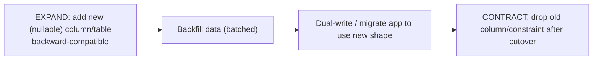

# 39 — Database Design

### Data Modeling, Integrity, and Query Performance

> *"Code is easy to change; data is not. A bad function is a bad afternoon; a bad schema is a bad year. Model the data as if you'll live with it for a decade — because you will."*

---

**Chapter type:** Phase 8 — Systems & Architecture
**DRI:** Backend Architect + Software Architect
**Depends on:** [`00-CONSTITUTION.md`](./00-CONSTITUTION.md), [`01`](./01-PROJECT_DISCOVERY.md), [`32`](./32-TYPESCRIPT_GUIDE.md), [`37`](./37-SECURITY.md)
**Feeds:** [`40-API_DESIGN.md`](./40-API_DESIGN.md), [`41-CODE_ARCHITECTURE.md`](./41-CODE_ARCHITECTURE.md), [`35-PERFORMANCE.md`](./35-PERFORMANCE.md), [`49-MAINTENANCE.md`](./49-MAINTENANCE.md)

---

## Table of Contents
1. [Purpose](#1-purpose)
2. [Philosophy](#2-philosophy)
3. [Principles](#3-principles)
4. [Best Practices](#4-best-practices)
5. [Anti-Patterns](#5-anti-patterns)
6. [Real-World Examples](#6-real-world-examples)
7. [Common Mistakes](#7-common-mistakes)
8. [AI Implementation Guidance](#8-ai-implementation-guidance)
9. [Human Review Checklist](#9-human-review-checklist)
10. [Automation Opportunities](#10-automation-opportunities)
11. [References for Further Study](#11-references-for-further-study)
12. [Review Checklist & Measurable Quality Criteria](#12-review-checklist--measurable-quality-criteria)

---

## 1. Purpose

This chapter defines how the studio designs **databases and data models** — schema design, normalization, relationships, integrity constraints, indexing, migrations, and the query-performance discipline that keeps data layers fast and correct at scale. Data is the most durable, highest-stakes part of a system: application code is rewritten freely, but the schema outlives frameworks, and the *data itself* is often irreplaceable.

Database design underpins the API ([`40`](./40-API_DESIGN.md), whose contracts expose the data), code architecture ([`41`](./41-CODE_ARCHITECTURE.md), which isolates data access), performance ([`35`](./35-PERFORMANCE.md), where slow queries hurt most), and security ([`37`](./37-SECURITY.md), where injection and access control live). It also depends on discovery ([`01`](./01-PROJECT_DISCOVERY.md) — model the real domain) and types ([`32`](./32-TYPESCRIPT_GUIDE.md) — schema-derived types). The through-line: **protect data integrity above convenience, and treat schema changes as one-way doors** ([`00`](./00-CONSTITUTION.md) Article IX).

---

## 2. Philosophy

**Data outlives code — so model it deliberately.** You will rewrite the frontend, swap frameworks, and refactor services many times over a product's life. The schema, and the data in it, persist through all of that. A rushed data model becomes a permanent tax: every feature works around it, every query fights it, and fixing it means a risky, expensive migration of live data. We invest disproportionately in getting the model right early, because it is the decision that is hardest to reverse (Article IX — one-way doors get extra scrutiny).

**Integrity is the database's job — enforce it there.** The database is the *last line of defense* for data correctness, and the only one that all code paths share. Constraints (foreign keys, `NOT NULL`, `UNIQUE`, `CHECK`), transactions, and appropriate types belong in the schema, not just in application code — because application code has bugs, races, and multiple entry points, while a database constraint is enforced universally and atomically. "The app checks that" is not integrity; a constraint is. Let the database refuse impossible states, just as types refuse them in code ([`32`](./32-TYPESCRIPT_GUIDE.md) — make invalid states unrepresentable, applied to data).

**Model the domain first; optimize for access second.** Start from a correct, normalized model of the real domain ([`01`](./01-PROJECT_DISCOVERY.md)) — one fact in one place, clear relationships. *Then* let real query patterns guide pragmatic denormalization, indexing, and caching where measurements demand it. Premature denormalization "for performance" (before you have queries to optimize) creates update anomalies and bugs; premature over-normalization creates painful joins. The sequence — normalize, then optimize with evidence — matters (Article X, VIII).

**Migrations are code, and destructive changes are dangerous.** Every schema change is versioned, reviewed, reversible where possible, and tested against realistic data — because it runs against *production data that cannot be regenerated*. Dropping a column, renaming a table, or a bad data migration can destroy information permanently (Article III — data safety is on the floor). We use expand/contract patterns, back up before destructive changes, and never run un-reviewed migrations against production.

---

## 3. Principles

### Principle 1 — Model the real domain; one fact, one place
Design normalized schemas reflecting the domain; avoid duplicated/derived data unless justified.
> *Rationale ([`01`](./01-PROJECT_DISCOVERY.md)):* Duplication causes update anomalies + inconsistency.

### Principle 2 — Enforce integrity in the database
Foreign keys, `NOT NULL`, `UNIQUE`, `CHECK`, correct types, transactions — at the schema level.
> *Rationale:* The DB is the shared last line of defense against bad data.

### Principle 3 — Normalize first, denormalize with evidence
Reach a sound normal form; denormalize only for measured, real query needs.
> *Rationale (Art. X, VIII):* Premature denormalization = anomalies; premature over-normalization = pain.

### Principle 4 — Index for real query patterns (and only those)
Add indexes to match actual queries; avoid unused indexes (they cost writes + space).
> *Rationale ([`35`](./35-PERFORMANCE.md)):* Indexes are the biggest read lever and a write cost.

### Principle 5 — Choose the right database for the job
Relational by default; use NoSQL/other stores for specific, justified needs.
> *Rationale (Art. VIII):* Fit the data model + access pattern; don't cargo-cult.

### Principle 6 — Migrations are versioned, reversible, tested, reviewed
Schema changes as code; expand/contract for zero-downtime; back up before destructive ops.
> *Rationale (Art. III, IX):* Migrations touch irreplaceable production data.

### Principle 7 — Design for data safety, privacy, and security
No data loss; soft-delete/audit where needed; least-privilege DB roles; encrypt sensitive data ([`37`](./37-SECURITY.md)).
> *Rationale (Art. III):* Data safety + privacy are floor-level.

### Principle 8 — Plan for scale, but don't prematurely distribute
Design so scaling (indexes, read replicas, partitioning) is possible; add complexity only when needed.
> *Rationale (Art. VIII):* Sharding-before-you-need-it is a classic over-engineering trap.

### Principle 9 — Access data through a typed, isolated layer
No raw SQL scattered in the app; use an ORM/query builder + a repository/data layer ([`41`](./41-CODE_ARCHITECTURE.md), [`32`](./32-TYPESCRIPT_GUIDE.md)).
> *Rationale:* Isolation enables testing, safety (parameterization), and change.

---

## 4. Best Practices

### 4.1 Modeling & normalization
- **Entities → tables**, attributes → columns, relationships → foreign keys. One entity type per table; one fact per place.
- **Normal forms:** aim for **3NF** as the default sound baseline (no repeating groups; every non-key attribute depends on the key, the whole key, and nothing but the key).
- **Relationships:** 1-to-many via FK on the "many" side; many-to-many via a **join table**; model carefully (avoid accidental many-to-many).
- **Keys:** stable primary keys — prefer surrogate keys (UUID/ULID or bigint) over mutable natural keys; **ULID/UUIDv7** where you want sortable, non-guessable IDs (also avoids IDOR guessability, [`37`](./37-SECURITY.md)).

### 4.2 Integrity constraints (enforce in the schema)
```sql
CREATE TABLE projects (
  id          uuid PRIMARY KEY DEFAULT gen_random_uuid(),
  org_id      uuid NOT NULL REFERENCES orgs(id) ON DELETE CASCADE,   -- FK integrity + cascade
  name        text NOT NULL CHECK (length(name) BETWEEN 1 AND 100),  -- CHECK constraint
  status      text NOT NULL DEFAULT 'active'
              CHECK (status IN ('active','archived','deleted')),      -- enum-like guard
  created_at  timestamptz NOT NULL DEFAULT now(),
  updated_at  timestamptz NOT NULL DEFAULT now(),
  UNIQUE (org_id, name)                                               -- no dup names per org
);
```
Use **transactions** for multi-step writes that must be atomic (all-or-nothing). Enforce enums via `CHECK` or a native enum type. Correct types (`timestamptz` not `text`, `numeric` for money — never float).

### 4.3 Indexing (match real queries)
```sql
-- Query: WHERE org_id = ? ORDER BY created_at DESC
CREATE INDEX idx_projects_org_created ON projects (org_id, created_at DESC);
-- Foreign keys used in joins/filters should generally be indexed
CREATE INDEX idx_projects_org ON projects (org_id);
```
- Index columns used in `WHERE`, `JOIN`, `ORDER BY`; **composite indexes** ordered by selectivity/usage; partial/covering indexes where useful.
- **Read query plans** (`EXPLAIN ANALYZE`) — don't guess. Remove unused indexes (they slow writes + waste space, [`49`](./49-MAINTENANCE.md)).

### 4.4 The N+1 query problem (the #1 ORM performance bug)
```ts
// ❌ N+1: 1 query for projects + N queries for each project's owner
const projects = await db.project.findMany();
for (const p of projects) p.owner = await db.user.findUnique({ where: { id: p.ownerId } });

// ✅ Eager-load / join in one (or few) queries
const projects = await db.project.findMany({ include: { owner: true } });
```
N+1 is silent in dev (small data) and catastrophic in prod. Detect it ([§10](#10-automation-opportunities)); use eager loading, `JOIN`s, or dataloader batching.

### 4.5 Choosing a database
| Need | Default choice |
| --- | --- |
| General app data, relationships, transactions, integrity | **Relational (PostgreSQL)** — the studio default |
| Full-text / vector search | Postgres extensions or a dedicated search/vector store |
| High-write, flexible/denormalized, specific access patterns | Document/NoSQL — *with a clear, justified reason* |
| Caching / ephemeral / rate-limit counters | Redis (a complement, not the source of truth) |
| Analytics / OLAP | A columnar/warehouse store (separate from OLTP) |

> **Default to Postgres** unless a specific requirement justifies otherwise (Article VIII — boring, proven technology).

### 4.6 Migrations (expand/contract, zero-downtime)

- Migrations are **versioned + in source**, reviewed like code ([`46`](./46-CODE_REVIEW.md)), reversible where feasible, and **tested on realistic data**.
- **Back up before destructive changes**; prefer additive, backward-compatible steps; batch large backfills to avoid locks.
- Never run an un-reviewed migration against production (Article III, IX).

### 4.7 Data safety, privacy & security ([`37`](./37-SECURITY.md))
- **No data loss:** destructive user actions are reversible (soft delete + retention) or explicitly confirmed ([`00`](./00-CONSTITUTION.md) Art. III); **audit trails** for sensitive changes.
- **Parameterized queries only** (via ORM/query builder) — never string-concatenate SQL ([`37`](./37-SECURITY.md)).
- **Least-privilege DB roles** (app role can't `DROP`; separate migration role); **encrypt** sensitive columns at rest; **never store secrets/PII you don't need** ([`13`](./13-FORM_DESIGN.md) minimize).
- **Backups + tested restores** (an untested backup is not a backup); point-in-time recovery for critical data ([`49`](./49-MAINTENANCE.md)).

### 4.8 Data-access layer ([`41`](./41-CODE_ARCHITECTURE.md), [`32`](./32-TYPESCRIPT_GUIDE.md))
Isolate persistence behind a repository/data module; the rest of the app depends on that interface, not on the ORM directly. Derive **types from the schema** (Prisma/Drizzle/Kysely + Zod at boundaries) so the DB and code stay in sync (single source of truth).

---

## 5. Anti-Patterns

| Anti-pattern | Why it fails | Principle |
| --- | --- | --- |
| **Integrity only in app code** (no FKs/constraints) | Bad data slips in via bugs/races/other paths. | P2 |
| **Duplicated/denormalized data without reason** | Update anomalies; inconsistency. | P1, P3 |
| **N+1 queries** | Silent in dev, catastrophic in prod. | P4 |
| **No/over-indexing** | Slow reads / slow writes + bloat. | P4 |
| **Storing money as float** | Rounding errors → financial bugs. | P2 |
| **Mutable natural keys as PK** | Cascading pain on change. | 4.1 |
| **`SELECT *` + fetching everything** | Wasteful; over-fetch; couples to schema. | P4 |
| **String-concatenated SQL** | Injection. | P7, [`37`](./37-SECURITY.md) |
| **Unreviewed/irreversible migrations on prod** | Permanent data loss. | P6, Art. III |
| **Hard deletes of important data** | Irrecoverable; no audit. | P7 |
| **Premature sharding/NoSQL** for a relational problem | Complexity without need; anomalies. | P5, P8 |
| **Raw ORM calls scattered everywhere** | Untestable; no isolation. | P9 |

---

## 6. Real-World Examples

### Example A — The missing foreign key
An app enforced "an order must belong to a valid customer" only in application code. A race between two code paths (and a later bug) created **orphaned orders** pointing at deleted customers — corrupting reports and crashing the UI. Adding a **foreign key with `ON DELETE` handling** made the orphan state *impossible at the database level*, regardless of app bugs (Principle 2). *Integrity belongs in the schema.*

### Example B — N+1 brought production to its knees
A dashboard listing 50 projects each with its owner ran fine in dev (a few rows) but issued **51 queries** per page load; under real traffic the database saturated. Switching to **eager loading** (`include: { owner: true }`, 4.4) collapsed it to a single query and fixed the outage. It was invisible until scale — so the team added **N+1 detection** to catch it in CI thereafter (Principle 4; [`35`](./35-PERFORMANCE.md)).

### Example C — Expand/contract saved a rename
A team needed to rename `full_name` → split into `first_name`/`last_name` on a live table with millions of rows. A naive rename would have locked the table and broken the running app. Using **expand/contract** (4.6) — add new columns, backfill in batches, dual-write, migrate reads, then drop the old column after cutover — achieved it with **zero downtime and a backup taken first** (Principle 6, Article IX). *Migrations against live data are one-way doors; treat them like it.*

---

## 7. Common Mistakes

- **Relying on app code for integrity** instead of DB constraints.
- **Denormalizing prematurely** (before real query evidence) → anomalies.
- **N+1 queries** shipped because dev data is small.
- **Missing indexes** on filtered/joined columns (or unused indexes slowing writes).
- **Money as float**; wrong types (`text` for dates).
- **`SELECT *`/over-fetching**; not reading query plans.
- **Unreviewed or destructive migrations** without backups.
- **Hard-deleting** data that should be soft-deleted/audited.
- **Reaching for NoSQL/sharding** for a problem Postgres handles fine.

---

## 8. AI Implementation Guidance

### 8.1 Where agents help
- **Design normalized schemas** with constraints, correct types, and stable keys from a domain description.
- **Generate migrations** (expand/contract, reversible) and schema-derived types ([`32`](./32-TYPESCRIPT_GUIDE.md)).
- **Detect + fix N+1**, propose indexes from query patterns, and read `EXPLAIN` plans.
- **Audit** for missing constraints, float-money, injection risks, missing indexes, hard deletes, and unreviewed destructive migrations.
- **Design the data-access layer** (repository + parameterized queries).

### 8.2 Hard rules (Art. III, VIII, IX)
- **Enforce integrity in the schema** (FKs, `NOT NULL`, `UNIQUE`, `CHECK`, transactions) — not app-only; correct types (**never float for money**).
- **Normalize first**; denormalize only with a stated, measured reason (Art. X).
- **Parameterized queries only** (ORM/query builder) — never string-built SQL ([`37`](./37-SECURITY.md)).
- **Index for real query patterns**; the agent flags likely **N+1** and avoids `SELECT *`/over-fetch.
- **Migrations are reversible/expand-contract, tested on realistic data, and flagged for review**; destructive changes require a backup note and never auto-run on prod (Art. III/IX).
- **No hard deletes of important data** without soft-delete/audit; **least-privilege roles**; sensitive data minimized/encrypted ([`37`](./37-SECURITY.md)).
- Data access goes through a **typed, isolated layer** ([`41`](./41-CODE_ARCHITECTURE.md)).

### 8.3 Prompt example — design a schema
```
ROLE: Backend Architect, bound by 00-CONSTITUTION + 39 (+32/37).
INPUT: domain description (from 01); key query patterns.
TASK:
  1. Design a normalized (3NF) schema: tables, columns, correct types (money=numeric, dates=timestamptz),
     stable surrogate keys (UUIDv7/ULID).
  2. Enforce integrity in-schema: FKs (+ON DELETE), NOT NULL, UNIQUE, CHECK; transactions where atomic.
  3. Add indexes matching the stated query patterns; note any expected N+1 and how it's avoided (eager load).
  4. Provide reversible migrations (expand/contract) + schema-derived types + a repository interface.
  5. Data-safety: soft-delete/audit for important entities; least-privilege roles; minimize sensitive data.
OUTPUT: SQL/schema + migrations + types + repository + index rationale + a data-safety note.
```

### 8.4 Prompt example — audit
```
TASK: Audit schema + data access for: integrity enforced only in app code (missing FKs/constraints),
unjustified denormalization, N+1 queries, missing/unused indexes, float money / wrong types, string-built
SQL (injection), SELECT */over-fetch, hard deletes of important data, and destructive/unreviewed migrations.
Output {location, issue, severity, fix}. Flag any data-loss risk or injection as a blocker.
```

---

## 9. Human Review Checklist

- [ ] Schema **models the real domain**; normalized (≈3NF); duplication justified where present.
- [ ] **Integrity enforced in the schema** (FKs + `ON DELETE`, `NOT NULL`, `UNIQUE`, `CHECK`); transactions for atomic writes.
- [ ] **Correct types** (money = `numeric`, dates = `timestamptz`); **stable surrogate keys**.
- [ ] **Indexes match real query patterns**; no obvious **N+1**; no unnecessary `SELECT *`.
- [ ] **Parameterized queries only** (no string SQL); data access via a **typed, isolated layer**.
- [ ] **Migrations** versioned, reviewed, reversible/expand-contract, tested on realistic data; **backup before destructive**.
- [ ] **No hard deletes** of important data (soft-delete/audit); **no data loss** on user actions.
- [ ] **Least-privilege DB roles**; sensitive data minimized/encrypted ([`37`](./37-SECURITY.md)).
- [ ] **Backups exist and restores are tested** ([`49`](./49-MAINTENANCE.md)).
- [ ] Right database chosen for the job (Postgres default unless justified).

---

## 10. Automation Opportunities

| Task | Automation |
| --- | --- |
| N+1 detection | Query-count assertions in tests; ORM query logging in dev/CI. |
| Slow-query monitoring | `pg_stat_statements` / APM slow-query alerts ([`48`](./48-MONITORING.md)). |
| Migration safety | CI checks for reversibility + lint for locking/destructive ops; require review. |
| Schema↔type sync | Generate types from schema (Prisma/Drizzle/Kysely); fail on drift ([`32`](./32-TYPESCRIPT_GUIDE.md)). |
| Constraint/lint checks | Flag float-money, missing FKs, missing NOT NULL on key columns. |
| Index analysis | Report unused indexes + missing indexes for frequent queries. |
| Injection scanning | SAST for string-built SQL ([`37`](./37-SECURITY.md)). |
| Backup verification | Automated periodic restore tests ([`49`](./49-MAINTENANCE.md)). |

---

## 11. References for Further Study
- **Foundational:** relational theory + normalization (Codd; standard database texts); *Designing Data-Intensive Applications* (Martin Kleppmann).
- **SQL/Postgres:** the PostgreSQL documentation (constraints, indexing, `EXPLAIN`, transactions); Postgres performance guides.
- **Migrations:** expand/contract (parallel-change) migration patterns; zero-downtime migration literature.
- **ORMs/type-safe DB:** Prisma / Drizzle / Kysely docs; the repository pattern ([`41`](./41-CODE_ARCHITECTURE.md)).
- **Cross-references:** [`01-PROJECT_DISCOVERY.md`](./01-PROJECT_DISCOVERY.md), [`32-TYPESCRIPT_GUIDE.md`](./32-TYPESCRIPT_GUIDE.md), [`35-PERFORMANCE.md`](./35-PERFORMANCE.md), [`37-SECURITY.md`](./37-SECURITY.md), [`40-API_DESIGN.md`](./40-API_DESIGN.md), [`41-CODE_ARCHITECTURE.md`](./41-CODE_ARCHITECTURE.md), [`49-MAINTENANCE.md`](./49-MAINTENANCE.md).

---

## 12. Review Checklist & Measurable Quality Criteria

| Criterion | Target |
| --- | --- |
| Referential integrity enforced by DB constraints | 100% of relationships |
| Money/date/enum columns using correct types | 100% |
| Known N+1 queries in hot paths | 0 |
| Frequent queries backed by appropriate indexes | 100% |
| String-concatenated SQL | 0 (injection floor, [`37`](./37-SECURITY.md)) |
| Migrations reviewed + reversible/expand-contract | 100% |
| Hard deletes of important data | 0 (soft-delete/audit) |
| Backups with tested restores | Yes |
| Data-loss incidents | 0 (floor, Art. III) |

---

*End of `39-DATABASE_DESIGN.md`.*
