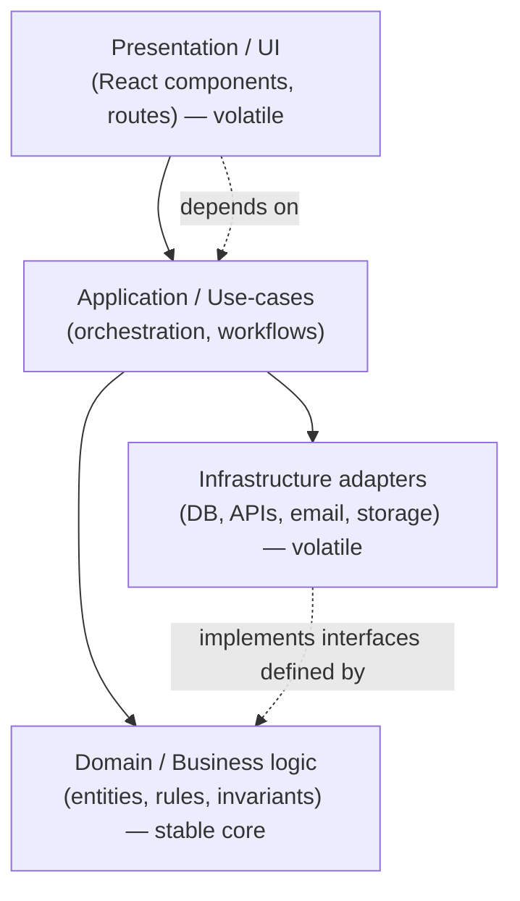

# 41 — Code Architecture

### Boundaries, Layers, and Managing Complexity Over Time

> *"Architecture is the set of decisions that are expensive to change. Get them roughly right and the codebase stays soft for years; get them wrong and every feature fights the last one."*

---

**Chapter type:** Phase 8 — Systems & Architecture
**DRI:** Software Architect (lead) + Backend Architect + Frontend Architect
**Depends on:** [`00-CONSTITUTION.md`](./00-CONSTITUTION.md), [`14`](./14-COMPONENT_LIBRARY.md), [`30`](./30-REACT_GUIDE.md)–[`32`](./32-TYPESCRIPT_GUIDE.md), [`39`](./39-DATABASE_DESIGN.md), [`40`](./40-API_DESIGN.md)
**Feeds:** [`42-FOLDER_STRUCTURE.md`](./42-FOLDER_STRUCTURE.md), [`43-CLEAN_CODE.md`](./43-CLEAN_CODE.md), [`44-TESTING.md`](./44-TESTING.md), [`49-MAINTENANCE.md`](./49-MAINTENANCE.md)

---

## Table of Contents
1. [Purpose](#1-purpose)
2. [Philosophy](#2-philosophy)
3. [Principles](#3-principles)
4. [Best Practices](#4-best-practices)
5. [Anti-Patterns](#5-anti-patterns)
6. [Real-World Examples](#6-real-world-examples)
7. [Common Mistakes](#7-common-mistakes)
8. [AI Implementation Guidance](#8-ai-implementation-guidance)
9. [Human Review Checklist](#9-human-review-checklist)
10. [Automation Opportunities](#10-automation-opportunities)
11. [References for Further Study](#11-references-for-further-study)
12. [Review Checklist & Measurable Quality Criteria](#12-review-checklist--measurable-quality-criteria)

---

## 1. Purpose

This chapter defines how the studio **structures code at the system level** — the boundaries, layers, dependency rules, and modularization that keep a codebase understandable, testable, and changeable as it grows from one file to hundreds of thousands of lines. It is the architectural counterpart to folder structure ([`42`](./42-FOLDER_STRUCTURE.md), the *physical* layout) and clean code ([`43`](./43-CLEAN_CODE.md), the *line-level* quality): this chapter is the *macro* — how the big pieces relate.

Architecture ties together components ([`14`](./14-COMPONENT_LIBRARY.md)), the React/TS guides ([`30`](./30-REACT_GUIDE.md)–[`32`](./32-TYPESCRIPT_GUIDE.md)), the data layer ([`39`](./39-DATABASE_DESIGN.md)), and APIs ([`40`](./40-API_DESIGN.md)) into a coherent whole. Its central concern is **complexity over time**: any code can be made to work once; architecture is about keeping it *changeable* on year three, with new people, under pressure. It operationalizes the Constitution's Article VIII (simplicity), IV (systems), and IX (reversibility).

---

## 2. Philosophy

**Architecture manages complexity; complexity is the enemy.** Every system accumulates complexity as it grows — that's inevitable. Bad architecture lets complexity spread *everywhere* (any change touches everything); good architecture *contains* it behind boundaries (a change stays local). The goal is not zero complexity (impossible) but **complexity you can reason about one piece at a time.** The best architecture is the *simplest* one that keeps the system changeable (Article VIII) — not the most layers, patterns, or abstractions.

**Boundaries and dependency direction are everything.** A codebase is defined less by its modules than by *how they depend on each other*. The core rule: **dependencies point inward/downward toward stable, abstract things** (business logic), and **outward/upward toward volatile details** (UI, database, frameworks) is forbidden. Business logic must not depend on the database or the web framework; it defines *interfaces* that those details implement. This "dependency inversion" is what lets you swap Postgres for another DB, or REST for GraphQL, without rewriting the domain — and what makes the core testable in isolation.

**Separate the stable from the volatile.** Some things change rarely (core domain rules, business invariants); some change constantly (UI frameworks, third-party APIs, database vendors). Architecture's job is to *isolate the volatile behind boundaries* so churn doesn't ripple into the stable core. When the volatile leaks into the stable — business logic tangled with React components or SQL — every framework upgrade or vendor change becomes a rewrite. We keep the core clean and push the churn to the edges.

**Earn your abstractions; don't speculate.** Abstraction is powerful and dangerous. The right abstraction contains complexity; the wrong or premature one *adds* it (an interface with one implementation, a "flexible" system for requirements that never arrive). We follow the rule of **concrete-first**: build the direct solution, extract an abstraction only when a *second real case* reveals its true shape (Article VIII; the DRY/WET balance — a little duplication is cheaper than the wrong abstraction). Architecture is applied where it earns its keep, incrementally — big up-front architecture for an unknown future is its own anti-pattern (Article IX).

---

## 3. Principles

### Principle 1 — Separation of concerns; single responsibility per module
Each module/layer has one clear reason to exist and change.
> *Rationale (Art. VIII):* Cohesive modules are understandable + changeable in isolation.

### Principle 2 — Dependencies point toward stability (dependency inversion)
Business logic depends on abstractions; details (UI, DB, framework) depend on the core, not vice versa.
> *Rationale:* Keeps the core swappable + testable; contains churn.

### Principle 3 — Isolate the volatile behind boundaries
Frameworks, DBs, and third parties live at the edges behind interfaces (adapters).
> *Rationale:* Vendor/framework change shouldn't rewrite the domain.

### Principle 4 — High cohesion, low coupling
Related things together; unrelated things apart; minimize inter-module dependencies.
> *Rationale:* The classic predictor of maintainability.

### Principle 5 — Explicit, one-directional dependencies (no cycles)
Modules import from allowed layers only; no circular dependencies.
> *Rationale:* Cycles = untestable, unbuildable, unreasonable tangles.

### Principle 6 — Earn abstractions; prefer the simplest thing that works
Concrete-first; extract on the second real case; no speculative generality.
> *Rationale (Art. VIII):* Wrong/premature abstraction is worse than duplication.

### Principle 7 — Design for testability
Pure core logic; dependencies injected; side effects at the edges ([`44`](./44-TESTING.md)).
> *Rationale:* Testable architecture is decoupled architecture.

### Principle 8 — Consistent, documented patterns (and recorded decisions)
One way to do common things; significant choices captured in ADRs ([`00`](./00-CONSTITUTION.md) 4.1).
> *Rationale (Art. V, VI):* Consistency + traceable rationale.

### Principle 9 — Evolve incrementally; don't over-architect up front
Start simple; add structure as complexity demands; refactor continuously.
> *Rationale (Art. IX):* Big up-front architecture for an unknown future usually misfits.

---

## 4. Best Practices

### 4.1 Layered architecture (the default)

- **Domain** (core): entities, business rules, invariants — pure, framework-free, no imports of DB/UI/HTTP.
- **Application**: use-cases/workflows that orchestrate the domain; defines the *ports* (interfaces) it needs.
- **Infrastructure**: adapters implementing those ports (repository→DB [`39`](./39-DATABASE_DESIGN.md), clients→external APIs [`40`](./40-API_DESIGN.md)).
- **Presentation**: UI/routes ([`30`](./30-REACT_GUIDE.md)/[`31`](./31-NEXTJS_GUIDE.md)) — calls application, never the DB directly.
> **The dependency rule:** inner layers know nothing about outer ones. Domain never imports React, Prisma, or `fetch`.

### 4.2 Feature-based (vertical) organization ([`42`](./42-FOLDER_STRUCTURE.md))
Organize by **feature/domain first**, then by layer within — not one giant `components/`, `services/`, `utils/` split. A feature (`billing/`, `projects/`) owns its UI, use-cases, data access, and types, exposing a small public API. This keeps related code together (high cohesion) and changes local. (Details in [`42`](./42-FOLDER_STRUCTURE.md).)

### 4.3 Dependency inversion in practice (ports & adapters)
```ts
// domain/application: defines the PORT (interface) it needs — knows nothing about the DB
export interface ProjectRepository {
  create(input: NewProject, ownerId: string): Promise<Project>;
  findById(id: string): Promise<Project | null>;
}

// application/use-case: pure orchestration, depends on the interface (injected)
export function makeCreateProject(repo: ProjectRepository) {
  return async (input: NewProject, ownerId: string) => {
    // business rules live here, framework-free + unit-testable
    return repo.create(input, ownerId);
  };
}

// infrastructure: the ADAPTER implements the port using the real DB (39)
export class PrismaProjectRepository implements ProjectRepository { /* … */ }
```
The use-case is testable with a fake repo; the DB is swappable; the domain has zero framework imports (Principles 2, 3, 7).

### 4.4 Manage side effects at the edges ([`30`](./30-REACT_GUIDE.md), [`44`](./44-TESTING.md))
Keep the core **pure** (deterministic, no I/O); push side effects (DB, network, time, randomness) to the boundary and inject them. Pure cores are trivially testable and reasoned about; effectful cores are neither.

### 4.5 Monolith first; extract services only when justified
Start with a **well-structured modular monolith** — clear internal boundaries, one deployable. Extract microservices only for real, demonstrated needs (independent scaling, team autonomy, differing tech) — never by default (Article VIII). Premature microservices trade in-process function calls for distributed-systems complexity (network failure, eventual consistency, ops overhead) you rarely need early.

### 4.6 State management architecture (frontend, [`30`](./30-REACT_GUIDE.md))
Distinguish **server state** (data from APIs → a data library like TanStack Query, [`30`](./30-REACT_GUIDE.md)) from **client/UI state** (local `useState`/reducer; a small store only when genuinely shared). Don't dump everything in a global store; colocate state (Principle 4). Keep data-fetching/mutation logic in a layer, not scattered in components.

### 4.7 Record significant decisions (ADRs) ([`00`](./00-CONSTITUTION.md) 4.1)
Capture architecturally significant choices (a boundary, a datastore, a pattern) as **Architecture Decision Records** — context, decision, consequences, alternatives. This makes the architecture *explainable* (Article VI) and prevents relitigating settled decisions or forgetting *why*.

### 4.8 Refactor continuously; watch for erosion ([`49`](./49-MAINTENANCE.md), [`50`](./50-CONTINUOUS_IMPROVEMENT.md))
Architecture decays under deadline pressure ("just import the DB here for now"). Treat boundary violations as debt: detect them (dependency lint, §10), track them, and refactor continuously rather than in a mythical "big rewrite." Small, reversible improvements (Article IX) keep the codebase soft.

---

## 5. Anti-Patterns

| Anti-pattern | Why it fails | Principle |
| --- | --- | --- |
| **Big ball of mud** (no boundaries) | Every change touches everything. | P1, P4 |
| **Business logic in UI components / SQL in components** | Untestable; volatile+stable tangled. | P2, P3 |
| **Domain importing framework/DB** (wrong dependency direction) | Can't swap details; can't unit-test core. | P2 |
| **Circular dependencies** | Untestable/unbuildable tangles. | P5 |
| **Layer-first mega-folders** (`components/`,`utils/` only) | Low cohesion; changes scatter. | P1, [`42`](./42-FOLDER_STRUCTURE.md) |
| **Premature abstraction / speculative generality** | Complexity for a future that never comes. | P6, Art. VIII |
| **Premature microservices** | Distributed complexity without need. | P9, Art. VIII |
| **God modules / god objects** | Do everything; can't change safely. | P1 |
| **Global-store-everything** (frontend) | Coupling; re-render storms ([`30`](./30-REACT_GUIDE.md)). | P4 |
| **Effectful core** (I/O everywhere) | Untestable; unpredictable. | P7 |
| **Undocumented architecture** (no ADRs, no rules) | Erodes; relitigated; unexplainable. | P8 |
| **Big up-front architecture** for unknown needs | Misfits reality; wasted. | P9 |

---

## 6. Real-World Examples

### Example A — SQL in the component, and the rewrite it forced
An app queried the database directly inside React components ("it was faster to ship"). When the team needed to (a) unit-test the logic, (b) reuse it in a background job, and (c) swap the ORM, they couldn't — the logic was welded to the UI. Introducing a **repository/use-case layer** (4.3) with the DB behind an interface made the logic testable, reusable across UI + jobs, and the ORM swappable. *Business logic in the UI is a boundary violation that compounds (Principles 2, 3).*

### Example B — The premature abstraction that hurt
An engineer built a "generic entity framework" to handle *any* future resource, before there were two real resources. It was complex, hard to understand, and — when real requirements arrived — didn't fit any of them, so every feature fought the abstraction. Reverting to **concrete implementations** and extracting shared pieces only when a genuine second case appeared (4.x, Principle 6) produced simpler, better-fitting code. *Wrong abstraction > duplication in cost (Article VIII).*

### Example C — Modular monolith beat premature microservices
A small team split their product into eight microservices "to be scalable." They spent most of their time on inter-service networking, distributed debugging, and deployment — not features — for a load a single well-structured app could handle. Consolidating into a **modular monolith** (clear internal boundaries, one deploy, 4.5) let them ship again; they can extract a service later *if* a real need appears. *Don't buy distributed-systems complexity before you need it (Principle 9).*

---

## 7. Common Mistakes

- **Putting business logic in UI components** (or SQL in components) — no boundary.
- **Wrong dependency direction** (domain importing framework/DB).
- **Circular dependencies** between modules.
- **Layer-first mega-folders** instead of feature/domain organization ([`42`](./42-FOLDER_STRUCTURE.md)).
- **Abstracting too early** (speculative generality) — or never (copy-paste sprawl).
- **Premature microservices/distributed architecture.**
- **God modules** and **global-store-everything** on the frontend.
- **Effect-laden core** that can't be unit-tested.
- **No ADRs / no documented dependency rules** — architecture erodes silently.
- **Over-architecting** a simple app up front.

---

## 8. AI Implementation Guidance

### 8.1 Where agents help
- **Scaffold layered/feature-based structure** with correct dependency direction (ports & adapters).
- **Extract business logic** out of UI/DB into use-cases + repositories; inject dependencies.
- **Detect boundary violations** (domain importing framework/DB, cycles, SQL-in-components).
- **Advise on abstraction timing** (flag speculative generality; suggest concrete-first).
- **Draft ADRs** for significant decisions.

### 8.2 Hard rules (Art. VIII, IV, IX)
- **Dependencies point toward stability**: the agent never has the domain import UI/DB/framework; it uses interfaces + injection.
- **No business logic in UI components or raw DB access in components** — it routes through application/use-case + repository layers ([`39`](./39-DATABASE_DESIGN.md)).
- **No circular dependencies**; feature/domain-first organization ([`42`](./42-FOLDER_STRUCTURE.md)).
- **Concrete-first**: it does *not* introduce speculative abstractions/microservices; it extracts on the second real case and states the reason (Art. VIII).
- Core logic is **pure + testable** (side effects injected at edges) ([`44`](./44-TESTING.md)).
- Significant architectural choices come with an **ADR** (Art. VI); the agent picks the **simplest architecture that works**, not the most elaborate.

### 8.3 Prompt example — structure a feature
```
ROLE: Software Architect, bound by 00-CONSTITUTION + 41 (+39/40/42).
TASK: Architect the <feature> module.
CONSTRAINTS:
  - Layered + feature-based: domain (pure rules) / application (use-cases + ports) /
    infrastructure (repository→DB, clients→APIs) / presentation (UI calls use-cases, not DB).
  - Dependency rule: domain imports NO framework/DB; details implement domain-defined interfaces (injected).
  - Pure, testable core; side effects at the edges. No circular deps. Concrete-first (no speculative abstraction).
  - Modular monolith (no microservices unless justified).
OUTPUT: module structure + interfaces (ports) + a sample use-case + repository adapter + an ADR for the key decision.
```

### 8.4 Prompt example — audit
```
TASK: Audit architecture for: business logic in UI / SQL in components, wrong dependency direction
(domain importing framework/DB), circular dependencies, layer-first mega-folders, premature abstraction
or microservices, god modules, global-store-everything, and effectful (untestable) core. Output
{location, issue, fix}, and propose the smallest refactor to restore boundaries.
```

---

## 9. Human Review Checklist

- [ ] **Clear boundaries/layers**; each module has a single responsibility (high cohesion, low coupling).
- [ ] **Dependencies point toward stability**; domain/business logic imports **no** UI/DB/framework.
- [ ] **Volatile details (DB, APIs, framework) isolated behind interfaces/adapters**; injected, swappable.
- [ ] **No business logic in UI**; **no raw DB access in components** — routed through use-case + repository layers.
- [ ] **No circular dependencies**; organization is **feature/domain-first** ([`42`](./42-FOLDER_STRUCTURE.md)).
- [ ] Abstractions are **earned** (concrete-first; no speculative generality/microservices).
- [ ] Core logic is **pure + testable**; side effects at the edges ([`44`](./44-TESTING.md)).
- [ ] Frontend state is **appropriately located** (server vs. client; no global-everything).
- [ ] Significant decisions have **ADRs**; dependency rules documented + enforced.
- [ ] Architecture is the **simplest that works** for current needs (not over-built).

---

## 10. Automation Opportunities

| Task | Automation |
| --- | --- |
| Dependency rules | Lint enforcing allowed imports between layers (`eslint-plugin-boundaries`/import rules). |
| Cycle detection | `madge`/dependency-cruiser to detect + block circular deps. |
| Boundary violations | Rules banning DB imports in UI, framework imports in domain. |
| Architecture diagrams | Auto-generate dependency graphs from imports ([`dependency-cruiser`]). |
| Complexity metrics | Track module size/coupling/cyclomatic complexity in CI ([`43`](./43-CLEAN_CODE.md)). |
| ADR checks | Require an ADR for changes to flagged paths (schema, public APIs, boundaries). |
| Test-in-isolation | Ensure domain/use-cases have unit tests with mocked ports ([`44`](./44-TESTING.md)). |

---

## 11. References for Further Study
- **Foundational:** Robert C. Martin, *Clean Architecture* (dependency rule, boundaries); the Ports & Adapters (Hexagonal) architecture (Alistair Cockburn); Domain-Driven Design (Eric Evans) for domain modeling.
- **Complexity:** John Ousterhout, *A Philosophy of Software Design* (deep modules, complexity); *Building Evolutionary Architectures*.
- **Pragmatics:** the "modular monolith" and "MonolithFirst" writing (Martin Fowler) on avoiding premature microservices.
- **Frontend architecture:** feature-sliced / vertical-slice organization references ([`42`](./42-FOLDER_STRUCTURE.md)).
- **Cross-references:** [`14-COMPONENT_LIBRARY.md`](./14-COMPONENT_LIBRARY.md), [`30-REACT_GUIDE.md`](./30-REACT_GUIDE.md), [`32-TYPESCRIPT_GUIDE.md`](./32-TYPESCRIPT_GUIDE.md), [`39-DATABASE_DESIGN.md`](./39-DATABASE_DESIGN.md), [`40-API_DESIGN.md`](./40-API_DESIGN.md), [`42-FOLDER_STRUCTURE.md`](./42-FOLDER_STRUCTURE.md), [`43-CLEAN_CODE.md`](./43-CLEAN_CODE.md), [`44-TESTING.md`](./44-TESTING.md).

---

## 12. Review Checklist & Measurable Quality Criteria

| Criterion | Target |
| --- | --- |
| Circular dependencies | 0 (enforced) |
| Boundary violations (DB-in-UI, framework-in-domain) | 0 (linted) |
| Domain/business logic unit-testable in isolation | 100% |
| Feature/domain-first organization | Yes |
| Speculative abstractions / premature microservices | 0 |
| Significant decisions with an ADR | 100% |
| Module coupling / complexity metrics | within thresholds ([`43`](./43-CLEAN_CODE.md)) |
| Change locality (avg. modules touched per feature) | ↓ trend |

---

*End of `41-CODE_ARCHITECTURE.md`.*
