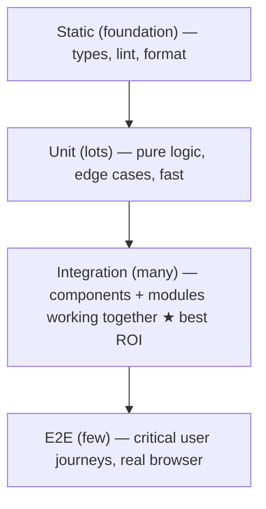

# 44 — Testing

### Confidence to Change, Encoded as Executable Truth

> *"Tests are not about proving code works today. They are about being unafraid to change it tomorrow. A codebase without tests is a codebase you're scared to touch — and scared code rots."*

---

**Chapter type:** Phase 9 — Assurance & Operations
**DRI:** QA Engineer + Principal Engineers
**Depends on:** [`00-CONSTITUTION.md`](./00-CONSTITUTION.md), [`22`](./22-ACCESSIBILITY.md), [`30`](./30-REACT_GUIDE.md)–[`32`](./32-TYPESCRIPT_GUIDE.md), [`41`](./41-CODE_ARCHITECTURE.md), [`43`](./43-CLEAN_CODE.md)
**Feeds:** [`45-QA.md`](./45-QA.md), [`46-CODE_REVIEW.md`](./46-CODE_REVIEW.md), [`47-DEPLOYMENT.md`](./47-DEPLOYMENT.md), [`50-CONTINUOUS_IMPROVEMENT.md`](./50-CONTINUOUS_IMPROVEMENT.md)

---

## Table of Contents
1. [Purpose](#1-purpose)
2. [Philosophy](#2-philosophy)
3. [Principles](#3-principles)
4. [Best Practices](#4-best-practices)
5. [Anti-Patterns](#5-anti-patterns)
6. [Real-World Examples](#6-real-world-examples)
7. [Common Mistakes](#7-common-mistakes)
8. [AI Implementation Guidance](#8-ai-implementation-guidance)
9. [Human Review Checklist](#9-human-review-checklist)
10. [Automation Opportunities](#10-automation-opportunities)
11. [References for Further Study](#11-references-for-further-study)
12. [Review Checklist & Measurable Quality Criteria](#12-review-checklist--measurable-quality-criteria)

---

## 1. Purpose

This chapter defines how the studio **tests software** — the testing strategy (the pyramid/trophy), what to test at each level (unit, integration, end-to-end, accessibility, visual), how to write tests that are valuable rather than brittle, and how tests gate the pipeline ([`47`](./47-DEPLOYMENT.md)). It is the technical, developer-authored counterpart to QA ([`45`](./45-QA.md), the broader quality discipline) and a prerequisite for confident code review ([`46`](./46-CODE_REVIEW.md)) and safe deployment ([`47`](./47-DEPLOYMENT.md)).

Testing is what turns a codebase from fragile to *changeable*. It's the executable expression of correctness (Constitution Article II) and a load-bearing enabler of everything upstream: clean refactoring ([`43`](./43-CLEAN_CODE.md)), architecture evolution ([`41`](./41-CODE_ARCHITECTURE.md)), and the "small, reversible steps" the Constitution demands (Article IX). It also enforces the accessibility floor programmatically ([`22`](./22-ACCESSIBILITY.md)) and validates API contracts ([`40`](./40-API_DESIGN.md)).

---

## 2. Philosophy

**Tests exist to give you the confidence to change code.** The point of a test is not to document that code worked once; it's to let a future engineer (or agent) refactor, extend, and upgrade *without fear* — because if they break something, a test tells them immediately. Untested code is code everyone is afraid to touch, so it calcifies: bugs accumulate, dependencies rot, and eventually someone demands a rewrite. A good test suite is the thing that keeps a codebase *soft* and changeable for years (Article IX).

**Test behavior, not implementation.** The most common testing mistake is coupling tests to *how* code works (internal functions, state, structure) rather than *what* it does (observable behavior from the user's or caller's perspective). Implementation-coupled tests break on every refactor even when behavior is unchanged — so they punish improvement and get deleted or ignored. Behavior-focused tests survive refactors and actually protect users. "The more your tests resemble the way your software is used, the more confidence they give you" (Testing Library's guiding principle).

**Confidence per second is the metric that matters.** Not coverage percentage, not test count — *how much confidence does this suite buy, and how fast does it run?* A fast, focused suite that covers the critical paths and survives refactors is worth more than a slow, brittle 100%-coverage suite that breaks constantly and tests trivia. We optimize for *meaningful* coverage of *important* behavior, run *fast enough to run constantly*, weighing the cost (writing + maintaining + running) against the confidence gained (Article VIII, X).

**A bug that escaped is a missing test.** When a defect reaches production, the fix is two-part: fix the bug, *and* write the test that would have caught it (a regression test). This ratchets quality upward — the same bug can never recur silently — and directs testing effort at where bugs actually happen rather than where they're imagined. Over time the suite becomes a precise map of the system's real failure modes ([`50`](./50-CONTINUOUS_IMPROVEMENT.md), [`45`](./45-QA.md)).

---

## 3. Principles

### Principle 1 — Tests buy confidence to change
Their value is enabling fearless refactoring/extension, not proving today's correctness.
> *Rationale (Art. IX):* Scared code rots; tested code stays soft.

### Principle 2 — Test behavior, not implementation
Assert on observable outputs/effects from the caller's/user's view; avoid internals.
> *Rationale:* Behavior tests survive refactors and protect users.

### Principle 3 — Right test at the right level (pyramid/trophy)
Many fast unit tests; solid integration; few high-value E2E; plus a11y + contract + visual where they pay.
> *Rationale (Art. VIII):* Match test type to the risk + cost.

### Principle 4 — Optimize confidence-per-second, not coverage %
Fast, meaningful, refactor-resilient > slow, brittle, 100%-coverage.
> *Rationale (Art. X):* Coverage is a proxy; confidence is the goal.

### Principle 5 — Tests are first-class code (clean, deterministic, isolated)
Readable, DRY-where-sensible, no flakiness, independent, fast ([`43`](./43-CLEAN_CODE.md)).
> *Rationale:* Bad tests get ignored/deleted; flaky tests destroy trust.

### Principle 6 — Every bug gets a regression test
Fix the bug + add the test that would have caught it.
> *Rationale ([`50`](./50-CONTINUOUS_IMPROVEMENT.md)):* Ratchets quality; targets real failures.

### Principle 7 — Accessibility and contracts are tested, not assumed
Automated a11y checks ([`22`](./22-ACCESSIBILITY.md)) + API contract tests ([`40`](./40-API_DESIGN.md)) in the suite.
> *Rationale (Art. III):* The floor + contracts must be machine-verified.

### Principle 8 — Tests gate the pipeline; a red suite blocks
CI runs tests on every change; failing tests block merge/deploy ([`47`](./47-DEPLOYMENT.md)).
> *Rationale (Art. III-style gate):* Untested/failing code doesn't ship.

### Principle 9 — Design for testability
Pure logic, injected dependencies, side effects at edges → tests are easy ([`41`](./41-CODE_ARCHITECTURE.md), [`43`](./43-CLEAN_CODE.md)).
> *Rationale:* Hard-to-test code is usually badly-architected code.

---

## 4. Best Practices

### 4.1 The testing shape (pyramid → "trophy" for frontend)

| Level | Tests | Tools (examples) | Ratio guidance |
| --- | --- | --- | --- |
| **Static** | Types, lint, format ([`32`](./32-TYPESCRIPT_GUIDE.md), [`43`](./43-CLEAN_CODE.md)) | `tsc`, ESLint, Prettier | always |
| **Unit** | Pure functions, hooks, edge cases | Vitest/Jest | many, fast |
| **Integration** | Components + real deps together (the sweet spot) | Testing Library + Vitest, MSW | **most value** |
| **E2E** | Full critical journeys in a real browser | Playwright/Cypress | few, high-value |
| **A11y** | Automated accessibility | jest-axe, Playwright-axe ([`22`](./22-ACCESSIBILITY.md)) | on components + flows |
| **Contract** | API request/response shape ([`40`](./40-API_DESIGN.md)) | schema/contract tests | per API |
| **Visual** | UI regression across states/themes | snapshot/Chromatic-style ([`14`](./14-COMPONENT_LIBRARY.md)) | key components |

> **The "trophy":** for UI-heavy apps, weight toward **integration** tests (components + their real collaborators) — they give the most confidence per test and resemble real usage. Keep E2E few (they're slow/flaky) but cover the money paths.

### 4.2 Behavior-focused component tests (Testing Library)
```tsx
// ✅ Tests behavior the user experiences — survives refactors
test("shows an error when submitting an invalid email", async () => {
  const user = userEvent.setup();
  render(<SignupForm />);
  await user.type(screen.getByLabelText(/email/i), "not-an-email");
  await user.click(screen.getByRole("button", { name: /create account/i }));
  expect(await screen.findByText(/that email doesn't look right/i)).toBeVisible();
});
// ❌ Tests implementation — breaks on refactor, protects nothing:
// expect(wrapper.state('emailError')).toBe(true)
```
Query by **role/label/text** (what users perceive), not by test-ids/classes where avoidable; assert on **visible outcomes** ([`13`](./13-FORM_DESIGN.md), [`22`](./22-ACCESSIBILITY.md) — role-based queries double as a11y checks).

### 4.3 Unit tests for pure logic + edge cases
```ts
describe("calculateShippingCost", () => {
  it("is free for digital orders", () => expect(getShippingCost(digital)).toBe(0));
  it("is free above the threshold", () => expect(getShippingCost(bigOrder)).toBe(0));
  it("charges by weight otherwise", () => expect(getShippingCost(order)).toBe(12.5));
  it("handles zero weight", () => expect(getShippingCost(zeroWeight)).toBe(BASE_RATE)); // edge case
});
```
Pure functions ([`41`](./41-CODE_ARCHITECTURE.md), [`43`](./43-CLEAN_CODE.md)) are trivially unit-testable — test the happy path *and* edges/boundaries (0, empty, max, null, negative).

### 4.4 Integration tests with mocked boundaries (MSW)
Mock at the **network boundary** (MSW intercepts fetch), not internal modules — so tests exercise real component+data-layer behavior while staying fast and deterministic. Prefer this over mocking your own functions (which couples to implementation).

### 4.5 E2E for critical journeys only ([`29`](./29-USER_FLOWS.md))
```ts
test("user can sign up and reach first value", async ({ page }) => {
  await page.goto("/signup");
  await page.getByLabel("Email").fill(uniqueEmail());
  await page.getByLabel("Password").fill("Str0ng!pass");
  await page.getByRole("button", { name: "Create account" }).click();
  await expect(page.getByRole("heading", { name: /welcome/i })).toBeVisible();
});
```
Cover the **money paths** (signup, checkout, core task, auth). Keep E2E few, stable, and independent; they're slow and flakier — don't test everything here.

### 4.6 Accessibility & contract tests (the floor + the promise)
```ts
// A11y — automated (necessary, not sufficient; pair with manual, 22)
it("has no axe violations", async () => {
  const { container } = render(<Card {...props} />);
  expect(await axe(container)).toHaveNoViolations();
});
```
Run **jest-axe / Playwright-axe** on components and key flows ([`22`](./22-ACCESSIBILITY.md)). Run **contract tests** asserting API responses match the schema ([`40`](./40-API_DESIGN.md)) so provider/consumer stay in sync.

### 4.7 Write good tests (Arrange-Act-Assert; deterministic)
- **AAA structure**; one logical behavior per test; descriptive names ("it does X when Y").
- **Deterministic:** control time/randomness (fake timers, seeded data); no reliance on order, network, or shared mutable state.
- **Isolated:** each test sets up + tears down its own state; no inter-test dependencies.
- **Fast:** unit/integration suites run in seconds so people run them constantly.
- **Kill flakiness ruthlessly:** a flaky test is worse than no test — it trains people to ignore red. Fix or quarantine immediately (§10).

### 4.8 TDD where it fits; test after where it doesn't
Test-Driven Development (red→green→refactor) is excellent for well-specified logic (algorithms, business rules, bug fixes) and *is* the design tool there. For exploratory UI, test-after is fine — but the code still ships tested. Choose pragmatically; the non-negotiable is that important behavior ends up covered.

### 4.9 Coverage as a signal, not a target ([`4`](#4-best-practices))
Track coverage to find *untested important code*, not to hit a magic number. **100% coverage of trivial code with 0 behavior tests is worthless; 70% covering all critical paths is valuable.** Gate on coverage *not decreasing* on critical modules rather than a blanket global %.

---

## 5. Anti-Patterns

| Anti-pattern | Why it fails | Principle |
| --- | --- | --- |
| **Testing implementation details** | Breaks on refactor; protects nothing. | P2 |
| **Coverage-chasing** (tests for trivia to hit %) | False confidence; wasted effort. | P4 |
| **E2E-heavy ("ice cream cone")** | Slow, flaky, expensive; poor ROI. | P3 |
| **Flaky tests tolerated** | Trains people to ignore red → suite worthless. | P5 |
| **Snapshot-everything** (giant, unreviewed snapshots) | Rubber-stamped; catch nothing meaningful. | P2 |
| **Mocking your own internals** | Couples to implementation; tests the mock. | 4.4 |
| **No a11y/contract tests** | Floor + contracts unverified. | P7, Art. III |
| **Tests depend on each other / order** | Fragile; hard to debug. | P5 |
| **Non-deterministic** (real time/network/random) | Flaky; unreliable. | P5 |
| **No regression test after a bug** | Same bug recurs. | P6 |
| **Untestable code** (side-effect-laden, no injection) | Can't test → doesn't get tested. | P9 |
| **Red suite ignored / not gating** | Broken code ships. | P8 |

---

## 6. Real-World Examples

### Example A — Implementation tests punished a refactor
A component's tests asserted on internal state (`wrapper.state('isOpen')`) and private method calls. A pure refactor (same behavior, cleaner code) broke 40 tests despite zero behavior change — so the team started avoiding refactors to avoid "breaking tests." Rewriting to **behavior tests** (query by role, assert visible outcomes, 4.2) meant the *next* refactor changed implementation freely with tests staying green — and they'd have caught a real regression. *Behavior tests reward improvement; implementation tests punish it (Principle 2).*

### Example B — The trophy beat the pyramid-gone-wrong
A frontend team had thousands of shallow unit tests (mocking everything) that passed while the actual app was broken — because nothing tested components working *together*. Rebalancing toward **integration tests** (real components + MSW-mocked network, 4.4) caught the real bugs (a broken data flow the unit tests mocked away), with fewer, more meaningful tests. *For UI, integration is the sweet spot (Principle 3).*

### Example C — The flaky test that got everyone ignoring red
An E2E suite had one flaky test (a race condition on a toast) that failed ~20% of runs. People started re-running CI until green — and then missed a *real* failure hidden in the noise. The team enforced a **zero-flaky policy**: fix the race (await the toast properly) or quarantine immediately, and treat red as always meaningful (4.7, Principle 5). *A flaky test is worse than no test — it destroys trust in the whole suite.*

---

## 7. Common Mistakes

- **Testing implementation** (internal state/methods) instead of behavior.
- **Chasing a coverage number** with low-value tests.
- **Too many E2E tests** (slow, flaky) and too few integration tests.
- **Tolerating flaky tests** instead of fixing/quarantining immediately.
- **Snapshotting everything** and rubber-stamping updates.
- **Mocking your own modules** (coupling to implementation).
- **Skipping a11y/contract tests.**
- **Non-deterministic tests** (real time/network/random).
- **Not adding a regression test** when fixing a bug.
- **Writing untestable code** (then blaming testing as "hard").

---

## 8. AI Implementation Guidance

AI is genuinely strong at generating tests — and at generating *bad* tests (implementation-coupled, coverage-padding, snapshot-everything). The bar: tests that a senior engineer would keep.

### 8.1 Where agents help
- **Generate behavior-focused** unit/integration/E2E/a11y tests at the right level.
- **Enumerate edge cases** (0, empty, max, null, negative, error paths) humans forget.
- **Write regression tests** from a bug report/repro.
- **Set up harnesses** (Vitest/Testing Library/Playwright/MSW/jest-axe) and CI gating.
- **Audit** a suite for implementation-coupling, flakiness, E2E-heaviness, missing a11y/edge cases.

### 8.2 Hard rules (Art. II, III, VIII, X)
- The agent tests **behavior, not implementation** (role/label queries, visible outcomes) — it does **not** assert on internal state/private methods.
- It puts tests at the **right level** (integration-weighted for UI; few E2E for money paths), optimizing **confidence-per-second**, not coverage %.
- Tests are **deterministic + isolated** (controlled time/randomness, mocked at the network boundary, no inter-test deps) — the agent does not produce flaky tests.
- It includes **a11y tests** ([`22`](./22-ACCESSIBILITY.md)) for components/flows and **contract tests** for APIs ([`40`](./40-API_DESIGN.md)), and covers **edge/error paths**, not just the happy path.
- For a bug fix, it **adds a regression test** first (repro that fails, then passes) (P6).
- It does **not** mock the code under test's own internals, snapshot-everything, or chase coverage with trivial tests.

### 8.3 Prompt example — test a feature
```
ROLE: QA Engineer, bound by 00-CONSTITUTION + 44 (+22/32/40).
TASK: Write tests for <component/feature>.
CONSTRAINTS:
  - Behavior-focused (Testing Library: query by role/label; assert visible outcomes) — NO internal state/impl.
  - Right level: integration-weighted; unit for pure logic edge cases; 1 E2E only if it's a money path.
  - Cover happy path + edge/error cases (0/empty/max/null/invalid) + loading/error states.
  - Add a jest-axe accessibility test; mock the network with MSW (not internal modules).
  - Deterministic + isolated (fake timers/seeded data); AAA structure; descriptive names.
OUTPUT: tests + a note on what confidence each level buys + any edge cases surfaced.
```

### 8.4 Prompt example — audit a suite
```
TASK: Audit this test suite for: implementation-coupled tests, coverage-padding trivia, E2E-heaviness,
flaky/non-deterministic tests (real time/network/random), snapshot-everything, self-mocking, missing
a11y/contract tests, and untested edge/error paths. Output {test, issue, fix}, and rewrite the 3 worst
into behavior-focused tests.
```

---

## 9. Human Review Checklist

- [ ] Tests assert **behavior/observable outcomes**, not implementation details.
- [ ] Tests are at the **right level** (integration-weighted for UI; few, high-value E2E on money paths).
- [ ] Suite optimizes **confidence-per-second**; coverage used as a signal, not a target.
- [ ] Tests are **deterministic + isolated + fast**; **no flaky tests** tolerated.
- [ ] **Edge/error/loading/empty** cases covered — not just the happy path.
- [ ] **A11y tests** on components/flows ([`22`](./22-ACCESSIBILITY.md)); **contract tests** on APIs ([`40`](./40-API_DESIGN.md)).
- [ ] Mocking is at the **network boundary** (MSW), not internal modules.
- [ ] Every fixed bug has a **regression test**.
- [ ] Tests are **clean, readable code** (AAA, good names) ([`43`](./43-CLEAN_CODE.md)).
- [ ] **CI runs tests + gates** merges/deploys; red blocks ([`47`](./47-DEPLOYMENT.md)).

---

## 10. Automation Opportunities

| Task | Automation |
| --- | --- |
| Run + gate | CI runs static + unit + integration + E2E + a11y on every PR; block on red ([`47`](./47-DEPLOYMENT.md)). |
| Coverage signal | Coverage report; gate on *no decrease* for critical modules (not a global %). |
| Flake detection | Retry-analytics / flaky-test detector; auto-quarantine + track. |
| A11y in CI | jest-axe + Playwright-axe as required checks ([`22`](./22-ACCESSIBILITY.md)). |
| Contract tests | Provider/consumer contract checks in CI ([`40`](./40-API_DESIGN.md)). |
| Visual regression | Chromatic-style snapshots per component/theme ([`14`](./14-COMPONENT_LIBRARY.md)). |
| Mutation testing | (Advanced) Stryker to measure whether tests actually catch bugs. |
| Pre-commit | Run affected tests on staged changes for fast feedback. |

---

## 11. References for Further Study
- **Guiding philosophy:** Kent C. Dodds — "Testing Trophy," "Write tests. Not too many. Mostly integration."; Testing Library guiding principles.
- **Practice:** *Unit Testing Principles, Practices, and Patterns* (Khorikov); *Working Effectively with Legacy Code* (Feathers) for testing untested code.
- **Tools:** Vitest/Jest, React Testing Library, Playwright/Cypress, MSW, jest-axe docs.
- **TDD:** Kent Beck, *Test-Driven Development by Example* (where it fits).
- **Cross-references:** [`22-ACCESSIBILITY.md`](./22-ACCESSIBILITY.md), [`30-REACT_GUIDE.md`](./30-REACT_GUIDE.md), [`40-API_DESIGN.md`](./40-API_DESIGN.md), [`41-CODE_ARCHITECTURE.md`](./41-CODE_ARCHITECTURE.md), [`43-CLEAN_CODE.md`](./43-CLEAN_CODE.md), [`45-QA.md`](./45-QA.md), [`46-CODE_REVIEW.md`](./46-CODE_REVIEW.md), [`47-DEPLOYMENT.md`](./47-DEPLOYMENT.md).

---

## 12. Review Checklist & Measurable Quality Criteria

| Criterion | Target |
| --- | --- |
| Tests focused on behavior (not implementation) | ≥ 95% |
| Flaky tests in the suite | 0 (fix/quarantine) |
| Critical user journeys covered by E2E | 100% |
| Components/flows with automated a11y tests | 100% |
| APIs with contract tests | 100% |
| Fixed bugs with a regression test | 100% |
| Unit+integration suite runtime | fast (seconds — runnable constantly) |
| Coverage of critical modules | non-decreasing; meaningful |
| CI gating on tests | Yes (red blocks) |

---

*End of `44-TESTING.md`.*
