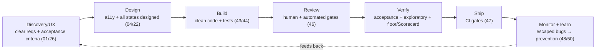
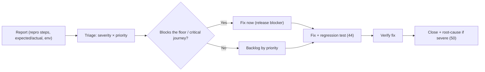

# 45 — Quality Assurance (QA)

### Quality as a Culture, Not a Gate at the End

> *"QA is not the department that finds bugs before customers do. QA is the practice of building quality in so there are fewer bugs to find. You cannot test quality into a product; you build it in."*

---

**Chapter type:** Phase 9 — Assurance & Operations
**DRI:** QA Engineer (lead) + Engineering Leads
**Depends on:** [`00-CONSTITUTION.md`](./00-CONSTITUTION.md), [`22`](./22-ACCESSIBILITY.md), [`26`](./26-USER_EXPERIENCE.md), [`29`](./29-USER_FLOWS.md), [`44`](./44-TESTING.md)
**Feeds:** [`46-CODE_REVIEW.md`](./46-CODE_REVIEW.md), [`47-DEPLOYMENT.md`](./47-DEPLOYMENT.md), [`48-MONITORING.md`](./48-MONITORING.md), [`50-CONTINUOUS_IMPROVEMENT.md`](./50-CONTINUOUS_IMPROVEMENT.md)

---

## Table of Contents
1. [Purpose](#1-purpose)
2. [Philosophy](#2-philosophy)
3. [Principles](#3-principles)
4. [Best Practices](#4-best-practices)
5. [Anti-Patterns](#5-anti-patterns)
6. [Real-World Examples](#6-real-world-examples)
7. [Common Mistakes](#7-common-mistakes)
8. [AI Implementation Guidance](#8-ai-implementation-guidance)
9. [Human Review Checklist](#9-human-review-checklist)
10. [Automation Opportunities](#10-automation-opportunities)
11. [References for Further Study](#11-references-for-further-study)
12. [Review Checklist & Measurable Quality Criteria](#12-review-checklist--measurable-quality-criteria)

---

## 1. Purpose

This chapter defines the studio's approach to **quality assurance** as a *whole-team, whole-lifecycle discipline* — distinct from, but built on, automated testing ([`44`](./44-TESTING.md)). Where testing is developer-authored executable checks, QA is the broader practice of *building quality in*: defining what "quality" means for a given product, preventing defects upstream, verifying against acceptance criteria, exploratory testing, bug triage, and closing the loop from production back into prevention.

QA ties together the whole manual's quality machinery: the Studio Scorecard ([`README`](./README.md)), the accessibility floor ([`22`](./22-ACCESSIBILITY.md)), UX standards ([`26`](./26-USER_EXPERIENCE.md)), user flows ([`29`](./29-USER_FLOWS.md)), automated tests ([`44`](./44-TESTING.md)), code review ([`46`](./46-CODE_REVIEW.md)), deployment gates ([`47`](./47-DEPLOYMENT.md)), and monitoring ([`48`](./48-MONITORING.md)). It operationalizes the Constitution's quality apparatus — Article II (quality hierarchy), Article III (the floor), and the manual's "assume it will be showcased publicly" bar.

---

## 2. Philosophy

**Quality is built in, not tested in.** The oldest QA fallacy is treating quality as a gate at the end — a team that finds and reports bugs after the code is "done." But you cannot inspect quality into a finished product; by the time a bug reaches QA, the cost to fix it has already multiplied. Real QA shifts *left*: quality is designed in (discovery, UX, a11y), built in (clean code, tests, review), and only *verified* at the end. The QA function's highest-value work is *preventing* defects and *raising the bar for everyone*, not being a human bug-catcher (Article II).

**Quality is everyone's job; QA is the discipline that makes it systematic.** In a healthy studio, the developer, designer, reviewer, and PM all own quality — QA doesn't absolve them of it. What a dedicated QA function/mindset adds is *system*: defining quality standards, ensuring the right checks exist at the right stages, running the exploratory and cross-cutting testing individuals miss, and closing feedback loops. "Throwing it over the wall to QA" is the anti-pattern; QA is a partner embedded throughout, not a downstream filter.

**"Quality" must be defined, or it's just vibes.** You cannot assure what you haven't defined. For each product/feature, quality means specific, measurable things: acceptance criteria met, the accessibility floor passed ([`22`](./22-ACCESSIBILITY.md)), performance budgets held ([`35`](./35-PERFORMANCE.md)), the Studio Scorecard bar cleared ([`README`](./README.md)), edge cases handled ([`29`](./29-USER_FLOWS.md)). QA turns the abstract "is it good?" into a concrete, checkable definition-of-done — replacing opinion with evidence (Article X, VI).

**The goal is not zero bugs; it's the right quality bar, reliably met.** All software has bugs; chasing literal perfection wastes resources on diminishing returns. QA's job is to ensure the product reliably meets the *appropriate* bar for its context — the non-negotiable floor always (Article III), and the target Scorecard level (≥3 for showcase) — while triaging the rest by real user impact. Mature QA is about *risk-based judgment*: focus rigor where failure hurts users most (safety, data, core flows), and accept lower-impact imperfection consciously.

---

## 3. Principles

### Principle 1 — Shift left: prevent defects, don't just find them
Build quality in at every stage (design→code→review→ship); QA's highest value is prevention.
> *Rationale (Art. II):* Bugs get exponentially cheaper to fix the earlier they're caught.

### Principle 2 — Quality is whole-team; QA makes it systematic
Everyone owns quality; QA provides the standards, coverage, and loops.
> *Rationale:* "Over the wall to QA" fails; embedded QA scales quality.

### Principle 3 — Define quality measurably (acceptance criteria + the floor + the Scorecard)
Concrete, checkable definition-of-done per feature; the floor is always required.
> *Rationale (Art. III, VI, X):* Undefined quality is unassurable.

### Principle 4 — Risk-based rigor
Concentrate testing effort where failure hurts users most (safety, data, money, core flows).
> *Rationale (Art. II):* Finite effort; spend it by impact.

### Principle 5 — Automate the repeatable; reserve humans for judgment
Automated checks for regressions/floor ([`44`](./44-TESTING.md)); humans for exploratory + UX + edge judgment.
> *Rationale (Art. VIII):* Machines for repetition; humans for insight.

### Principle 6 — Exploratory testing complements automation
Skilled, curious manual exploration finds what scripted tests can't.
> *Rationale:* Automation checks known cases; exploration finds unknown ones.

### Principle 7 — Triage by real user impact; track to closure
Severity/priority by impact; a defined bug lifecycle; nothing falls through.
> *Rationale ([`50`](./50-CONTINUOUS_IMPROVEMENT.md)):* Consistent triage + closure prevents rot.

### Principle 8 — Close the loop: production → prevention
Every escaped bug → root cause + a prevention (test/check/process) so it can't recur.
> *Rationale ([`44`](./44-TESTING.md) P6, [`50`](./50-CONTINUOUS_IMPROVEMENT.md)):* Ratchet quality upward.

### Principle 9 — The floor is a hard gate; the Scorecard is the bar
Article III floor blocks release unconditionally; Scorecard sets the target level ([`README`](./README.md)).
> *Rationale (Art. III):* Some quality is non-negotiable.

---

## 4. Best Practices

### 4.1 Shift-left quality across the lifecycle

QA participates at *every* stage — writing testable acceptance criteria early is higher-leverage than testing at the end.

### 4.2 Definition of Done (DoD) — the checkable quality contract
Every feature ships against an explicit DoD, e.g.:
- [ ] Acceptance criteria met (all specified behaviors).
- [ ] Automated tests pass (unit/integration/E2E/a11y/contract) ([`44`](./44-TESTING.md)).
- [ ] **Floor met**: WCAG AA on core flows ([`22`](./22-ACCESSIBILITY.md)), security ([`37`](./37-SECURITY.md)), no data loss, correctness (Art. III).
- [ ] All states handled (empty/loading/error/edge) ([`26`](./26-USER_EXPERIENCE.md), [`29`](./29-USER_FLOWS.md)).
- [ ] Performance budget held ([`35`](./35-PERFORMANCE.md)); responsive ([`21`](./21-RESPONSIVE_DESIGN.md)).
- [ ] Code review approved ([`46`](./46-CODE_REVIEW.md)); docs/changelog updated.
- [ ] Scorecard bar cleared (no dimension < 2; team avg ≥ 3) ([`README`](./README.md)).

### 4.3 Test planning (risk-based)
For each feature, map: *what could go wrong, how likely, how bad?* Concentrate effort on high-impact/high-likelihood areas. Cover: happy paths, edge cases, error paths, cross-browser/device ([`21`](./21-RESPONSIVE_DESIGN.md)), a11y ([`22`](./22-ACCESSIBILITY.md)), performance ([`35`](./35-PERFORMANCE.md)), security-sensitive flows ([`37`](./37-SECURITY.md)/[`38`](./38-AUTHENTICATION.md)), and the full user flow incl. branches ([`29`](./29-USER_FLOWS.md)).

### 4.4 Exploratory testing (the human superpower)
Beyond scripted tests, skilled testers *explore*: "what happens if I…?" — unusual inputs, interruptions, back-button, double-submit, slow network, tiny/huge screens, screen reader, weird data. Use **charters** ("explore checkout with invalid/edge payment data for 45 min") to focus. This finds the bugs automation never imagined ([`44`](./44-TESTING.md) complements this).

### 4.5 Manual verification beyond automation ([`22`](./22-ACCESSIBILITY.md), [`26`](./26-USER_EXPERIENCE.md))
Some quality *requires* human judgment: real screen-reader/keyboard passes (automation catches ~a third, [`22`](./22-ACCESSIBILITY.md)), UX "does this actually feel right?", visual polish, copy tone ([`25`](./25-COPYWRITING.md)), and real-device testing ([`20`](./20-MOBILE_FIRST.md)). These are on the DoD, not optional.

### 4.6 Bug triage & lifecycle

**Severity** = impact if it happens; **Priority** = when we fix it. A good bug report: clear title, exact repro steps, expected vs. actual, environment, evidence. Nothing falls through the cracks (Principle 7).

### 4.7 Severity scale (align with [`26`](./26-USER_EXPERIENCE.md))
| Sev | Meaning | Action |
| --- | --- | --- |
| **S1 Critical** | Data loss, security hole, core journey broken, floor breach | Release blocker; fix now |
| **S2 Major** | Important feature broken; no workaround | High priority |
| **S3 Minor** | Feature impaired; workaround exists | Scheduled |
| **S4 Cosmetic** | Visual/polish; low impact | As capacity allows |

### 4.8 Regression & release readiness ([`47`](./47-DEPLOYMENT.md))
Maintain an automated **regression suite** ([`44`](./44-TESTING.md)) that runs on every change; add a **smoke test** of critical journeys as a deploy gate. A release-readiness check confirms: floor met, acceptance criteria verified, no open S1/S2, budgets held, rollback plan ready ([`47`](./47-DEPLOYMENT.md)).

### 4.9 Close the loop (QA feeds prevention) ([`48`](./48-MONITORING.md), [`50`](./50-CONTINUOUS_IMPROVEMENT.md))
Every production defect → **root-cause analysis** (blameless) → a *prevention*: a regression test, a new automated check, a DoD item, or a process change. Track escaped-defect trends; the QA metric that matters is *fewer, less-severe escapes over time*, not "bugs found."

---

## 5. Anti-Patterns

| Anti-pattern | Why it fails | Principle |
| --- | --- | --- |
| **QA as an end-gate** (bugs found after "done") | Expensive late fixes; adversarial. | P1 |
| **"Over the wall to QA"** (devs don't own quality) | Diffuses responsibility; slower, worse. | P2 |
| **Undefined quality** ("is it good?" by vibes) | Unassurable; inconsistent. | P3 |
| **Uniform rigor** (test trivia as hard as core flows) | Wastes effort; misses high-impact risk. | P4 |
| **Manual-only** (no automation) | Slow, unrepeatable, regressions slip. | P5 |
| **Automation-only** (no exploratory) | Misses the unknown-unknowns. | P6 |
| **No triage / bugs lost** | Chaos; important bugs ignored. | P7 |
| **Fix-and-forget** (no regression test/root cause) | Same bugs recur. | P8 |
| **Shipping past the floor** to hit a date | Harms users; violates Art. III. | P9, Art. III |
| **"Bugs found" as the QA KPI** | Rewards late detection, not prevention. | P1, P8 |
| **Blame culture** on defects | Hides problems; kills learning. | P8 |

---

## 6. Real-World Examples

### Example A — Shifting left cut the bug rate
A team ran QA as a final gate; every release, QA found dozens of bugs, sending work back late and blowing timelines. Moving QA *upstream* — writing **testable acceptance criteria in discovery**, reviewing designs for a11y/edge states, pairing on test plans before build — meant far fewer bugs reached the end gate, because they were prevented (Principle 1). *You can't test quality in; you build it in.* The end-stage verification became fast because the work arrived already-good.

### Example B — Exploratory testing found what automation couldn't
A checkout had 100% passing automated tests. A tester exploring with a charter ("weird payment scenarios, 45 min") tried: entering an amount, backgrounding the app, returning, and double-tapping pay on a slow network — producing a **duplicate charge** no scripted test imagined ([`44`](./44-TESTING.md) idempotency, [`40`](./40-API_DESIGN.md)). Automation checks known cases; **skilled exploration finds the unknown ones** (Principle 6). The fix then got a regression test (Principle 8).

### Example C — Closing the loop stopped a recurring bug
The same class of null-handling bug shipped three times in six months. Instead of just fixing it a third time, a **blameless root-cause analysis** found the pattern (unvalidated optional API fields) and produced *prevention*: a lint rule + a boundary-validation convention ([`32`](./32-TYPESCRIPT_GUIDE.md)) + a DoD checklist item. The class of bug never recurred (Principle 8; [`50`](./50-CONTINUOUS_IMPROVEMENT.md)). *The metric that improved wasn't "bugs found" — it was "escapes prevented."*

---

## 7. Common Mistakes

- **Treating QA as a final gate** rather than a whole-lifecycle discipline.
- **Developers offloading quality** entirely to a QA team.
- **No measurable definition of quality** / vague acceptance criteria.
- **Testing everything with equal rigor** instead of risk-based prioritization.
- **Relying only on automation** (missing exploratory) or **only on manual** (missing regression safety).
- **No consistent bug triage/lifecycle**; important bugs lost in noise.
- **Fixing bugs without regression tests or root-cause analysis.**
- **Shipping past the floor** under deadline pressure.
- **Measuring "bugs found"** instead of "defects prevented / escaped."
- **Blaming individuals** for defects (drives problems underground).

---

## 8. AI Implementation Guidance

### 8.1 Where agents help
- **Generate testable acceptance criteria** + a Definition of Done from a feature spec.
- **Produce risk-based test plans** and exploratory-testing **charters**.
- **Generate bug reports** (structured repro/expected/actual) and **triage** by severity/impact.
- **Run automated floor checks** (a11y/perf/security) and summarize gaps ([`22`](./22-ACCESSIBILITY.md), [`35`](./35-PERFORMANCE.md), [`37`](./37-SECURITY.md)).
- **Root-cause analysis** support: pattern-find across incidents; propose preventions ([`50`](./50-CONTINUOUS_IMPROVEMENT.md)).

### 8.2 Hard rules (Art. II, III, X)
- The agent **defines quality measurably** (acceptance criteria + DoD) before "done," and treats the **Article III floor as a hard, non-waivable gate**.
- It applies **risk-based rigor** (more effort on safety/data/money/core flows) and **complements automation with exploratory charters** (it doesn't claim automation alone is sufficient — esp. for a11y/UX, [`22`](./22-ACCESSIBILITY.md)).
- Every proposed fix includes a **regression test + root-cause note** for severe/recurring bugs (P8).
- It **triages by real user impact**, not by ease of fixing.
- It frames QA success as **prevention/escape-reduction**, not "bugs found," and keeps root-cause analysis **blameless**.

### 8.3 Prompt example — quality-plan a feature
```
ROLE: QA Engineer, bound by 00-CONSTITUTION + 45 (+22/35/44).
INPUT: feature spec + user flow (29).
TASK:
  1. Write measurable acceptance criteria + a Definition of Done (incl. floor: a11y AA, security, no data loss, all states).
  2. Produce a risk-based test plan (what could go wrong × impact) prioritizing high-impact areas.
  3. Draft 3 exploratory-testing charters for the riskiest areas.
  4. List which checks are automatable (44) vs. require human verification (a11y/UX/real-device).
OUTPUT: acceptance criteria + DoD + risk-prioritized test plan + charters + automate-vs-human split.
```

### 8.4 Prompt example — triage & prevent
```
TASK: Given these production bug reports, triage each by severity (S1–S4) and priority, flag any floor
breaches as release blockers, and for the severe/recurring ones propose a blameless root cause + a
concrete prevention (regression test / automated check / DoD item / process change). Output a triage table
+ prevention plan. Judge by user impact, not fix difficulty.
```

---

## 9. Human Review Checklist

- [ ] Quality was **built in across the lifecycle** (QA involved from discovery/design), not just gated at the end.
- [ ] **Measurable acceptance criteria + DoD** defined; verified before release.
- [ ] The **Article III floor** (a11y AA, security, no data loss, correctness) is met — hard gate.
- [ ] Testing was **risk-based** (rigor concentrated on high-impact areas).
- [ ] **Automation + exploratory** both used; **human verification** done for a11y/UX/real-device.
- [ ] All **states + edge cases + flow branches** verified ([`26`](./26-USER_EXPERIENCE.md), [`29`](./29-USER_FLOWS.md)).
- [ ] **Bugs triaged** by impact with a clear lifecycle; **no open S1/S2** at release.
- [ ] Fixes include **regression tests**; severe/recurring bugs got **blameless root-cause + prevention**.
- [ ] **Scorecard bar** cleared (no dimension < 2; avg ≥ 3) ([`README`](./README.md)).
- [ ] QA success measured as **escapes prevented/reduced**, not "bugs found."

---

## 10. Automation Opportunities

| Task | Automation |
| --- | --- |
| Regression safety | Automated suite on every change ([`44`](./44-TESTING.md)); smoke test as deploy gate ([`47`](./47-DEPLOYMENT.md)). |
| Floor gates | a11y (axe), perf (Lighthouse budgets), security (SAST/deps) as required CI checks. |
| DoD enforcement | PR template / checklist bot verifying DoD items before merge. |
| Bug tracking | Structured issue templates; auto-labeling by severity/area; SLA tracking. |
| Escaped-defect metrics | Dashboard of escapes by severity/area over time ([`48`](./48-MONITORING.md), [`50`](./50-CONTINUOUS_IMPROVEMENT.md)). |
| Cross-browser/device | Automated matrix (BrowserStack/Playwright) for supported targets ([`21`](./21-RESPONSIVE_DESIGN.md)). |
| Release readiness | Automated checklist: floor ✓, budgets ✓, no S1/S2, rollback ready ([`47`](./47-DEPLOYMENT.md)). |

> **Automation + human:** automate the repeatable (regression, floor, matrix); reserve humans for exploratory, UX, and judgment (Principle 5/6).

---

## 11. References for Further Study
- **Shift-left & culture:** the "build quality in" / shift-left testing literature; W. Edwards Deming (quality is built in, not inspected in).
- **Exploratory testing:** James Bach & Michael Bolton (Rapid Software Testing; session-based testing / charters).
- **Risk-based & context-driven testing:** the context-driven testing school.
- **Blameless post-mortems / RCA:** SRE + incident-analysis practice ([`48`](./48-MONITORING.md), [`50`](./50-CONTINUOUS_IMPROVEMENT.md)).
- **Cross-references:** [`22-ACCESSIBILITY.md`](./22-ACCESSIBILITY.md), [`26-USER_EXPERIENCE.md`](./26-USER_EXPERIENCE.md), [`29-USER_FLOWS.md`](./29-USER_FLOWS.md), [`35-PERFORMANCE.md`](./35-PERFORMANCE.md), [`44-TESTING.md`](./44-TESTING.md), [`46-CODE_REVIEW.md`](./46-CODE_REVIEW.md), [`47-DEPLOYMENT.md`](./47-DEPLOYMENT.md), [`50-CONTINUOUS_IMPROVEMENT.md`](./50-CONTINUOUS_IMPROVEMENT.md).

---

## 12. Review Checklist & Measurable Quality Criteria

| Criterion | Target |
| --- | --- |
| Features with measurable acceptance criteria + DoD | 100% |
| Releases meeting the Article III floor | 100% (hard gate) |
| Open S1/S2 bugs at release | 0 |
| Fixed bugs with a regression test | 100% |
| Severe/recurring bugs with blameless root-cause + prevention | 100% |
| Escaped defects (severity-weighted) over time | ↓ trend |
| Scorecard: no dimension < 2, avg ≥ 3 | 100% of shipped work |
| Defect-fix cost (caught early vs. in prod) | ↓ (shift-left) |

---

*End of `45-QA.md`.*
