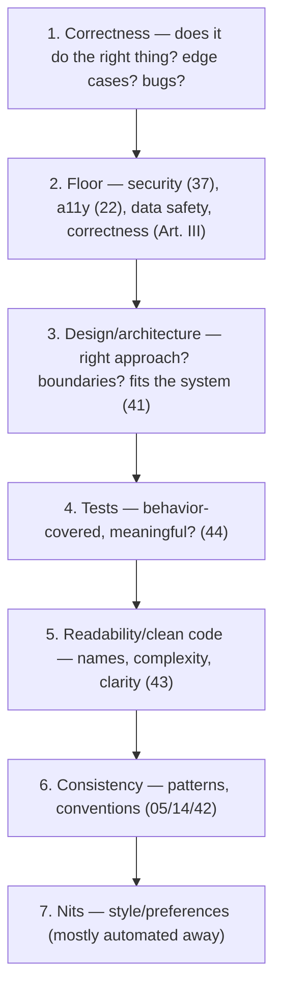

# 46 — Code Review

### Raising Quality and Sharing Knowledge, Kindly

> *"A code review is not a gate you defend or a test you pass. It is two people making the code — and each other — better. Review the code, never the person."*

---

**Chapter type:** Phase 9 — Assurance & Operations
**DRI:** Engineering Leads + Principal Engineers
**Depends on:** [`00-CONSTITUTION.md`](./00-CONSTITUTION.md), [`32`](./32-TYPESCRIPT_GUIDE.md), [`37`](./37-SECURITY.md), [`41`](./41-CODE_ARCHITECTURE.md)–[`44`](./44-TESTING.md)
**Feeds:** [`47-DEPLOYMENT.md`](./47-DEPLOYMENT.md), [`49-MAINTENANCE.md`](./49-MAINTENANCE.md), [`50-CONTINUOUS_IMPROVEMENT.md`](./50-CONTINUOUS_IMPROVEMENT.md)

---

## Table of Contents
1. [Purpose](#1-purpose)
2. [Philosophy](#2-philosophy)
3. [Principles](#3-principles)
4. [Best Practices](#4-best-practices)
5. [Anti-Patterns](#5-anti-patterns)
6. [Real-World Examples](#6-real-world-examples)
7. [Common Mistakes](#7-common-mistakes)
8. [AI Implementation Guidance](#8-ai-implementation-guidance)
9. [Human Review Checklist](#9-human-review-checklist)
10. [Automation Opportunities](#10-automation-opportunities)
11. [References for Further Study](#11-references-for-further-study)
12. [Review Checklist & Measurable Quality Criteria](#12-review-checklist--measurable-quality-criteria)

---

## 1. Purpose

This chapter defines how the studio conducts **code review** — the human review of proposed changes before they merge. It covers what reviewers look for, how to give and receive feedback, how to keep reviews fast and high-signal, the author's responsibilities, and how review integrates with automation ([`44`](./44-TESTING.md), CI [`47`](./47-DEPLOYMENT.md)) and the Constitution's human-review gates.

Code review is where the whole manual gets *enforced by humans*: the Constitution's Human Review Checklists ([`00`](./00-CONSTITUTION.md)), the accessibility floor ([`22`](./22-ACCESSIBILITY.md)), security ([`37`](./37-SECURITY.md)/[`38`](./38-AUTHENTICATION.md)), clean code ([`43`](./43-CLEAN_CODE.md)), architecture ([`41`](./41-CODE_ARCHITECTURE.md)), and testing ([`44`](./44-TESTING.md)) all converge at the pull request. Critically, it is also where **Article XI's human-accountability gate lives**: AI proposes, humans dispose — and code review is the "dispose." No agent output reaches production without a human review that owns the outcome.

---

## 2. Philosophy

**Review the code, never the person.** The single cultural determinant of whether code review helps or harms is whether it critiques *work* or *people*. "This function is hard to follow — could we extract the validation?" builds; "you always write messy code" destroys. We separate identity from output entirely: the author is not their diff. Feedback is about the code's readability, correctness, and fit — delivered with the assumption of competence and good intent (Article X, and the studio's "critique work, not people"). Psychological safety isn't softness; it's what makes people *want* review and *act* on it.

**Code review has two jobs, and knowledge-sharing is the underrated one.** The obvious job is catching defects (bugs, security holes, floor breaches). The equally important, often-forgotten job is **spreading knowledge and standards**: the reviewer learns the change, the author learns from feedback, patterns propagate, and the bus factor drops. A team that reviews well is a team that levels up continuously ([`50`](./50-CONTINUOUS_IMPROVEMENT.md)). Optimizing review *only* for defect-catching misses half its value.

**Speed and quality are both required — small PRs deliver both.** Slow reviews are a productivity tax and a quality risk (huge PRs get rubber-stamped because no one can review 2,000 lines well). The resolution is **small, focused pull requests**: they're reviewed fast *and* thoroughly, because a reviewer can actually hold the whole change in their head. Large PRs are the root cause of both slow and shallow review. Small PRs are an author responsibility and the highest-leverage review practice (Article IX — small, reversible steps).

**Distinguish blocking from non-blocking — not every comment is a veto.** A review that treats every preference as a blocker grinds work to a halt and breeds resentment; one that blocks nothing lets quality slide. Mature review separates **must-fix** (bugs, security, floor breaches, real design problems) from **suggestions** (preferences, nits, "consider…"). Label them explicitly (e.g. `nit:`, `suggestion:`, `blocking:`) so authors know what actually gates the merge. And personal style is *automated away* ([`43`](./43-CLEAN_CODE.md)) so humans never argue about it.

---

## 3. Principles

### Principle 1 — Review the code, not the person
Critique work with the assumption of competence + good intent; kind, specific, actionable.
> *Rationale (Art. X, studio culture):* Safety makes review effective.

### Principle 2 — Two goals: catch defects AND share knowledge
Optimize for both; review is a learning + standards-propagation mechanism.
> *Rationale ([`50`](./50-CONTINUOUS_IMPROVEMENT.md)):* Half of review's value is knowledge.

### Principle 3 — Small, focused PRs
Authors keep changes small + single-purpose; huge PRs are the enemy of good review.
> *Rationale (Art. IX):* Small PRs → fast + thorough review.

### Principle 4 — Distinguish blocking from non-blocking; label feedback
Must-fix vs. suggestion vs. nit, explicitly marked.
> *Rationale:* Clarity on what gates the merge; less friction.

### Principle 5 — Automate the mechanical; humans review judgment
Formatting/lint/types/tests/floor checks run in CI; humans review design, correctness, intent.
> *Rationale (Art. VIII, [`43`](./43-CLEAN_CODE.md)):* Never argue style humans; spend review on what machines can't judge.

### Principle 6 — Review against the studio standards + the floor
Check correctness, security ([`37`](./37-SECURITY.md)), a11y ([`22`](./22-ACCESSIBILITY.md)), tests ([`44`](./44-TESTING.md)), architecture ([`41`](./41-CODE_ARCHITECTURE.md)), clean code ([`43`](./43-CLEAN_CODE.md)) — and the Constitution's checklists.
> *Rationale (Art. III):* Review enforces the manual.

### Principle 7 — Human accountability for AI output (Article XI)
Agent-authored changes get a human reviewer (not the authoring agent) who owns the merge.
> *Rationale (Art. XI):* AI proposes; humans dispose.

### Principle 8 — Reviews are timely; unblock people
Review promptly (same day where possible); don't let PRs rot.
> *Rationale:* Slow review stalls the team + invites big-batch PRs.

### Principle 9 — The author's job is to make review easy
Small PR, clear description (what/why), self-review first, passing CI, context for the reviewer.
> *Rationale (Art. VI):* Reviewability is an author responsibility.

---

## 4. Best Practices

### 4.1 What a reviewer actually checks (priority order)

Spend the most energy at the top (correctness, floor, design); the bottom (style) should be **automated** so humans rarely touch it ([`43`](./43-CLEAN_CODE.md), Principle 5).

### 4.2 The reviewer's checklist (studio standard)
- [ ] **Correct**: does what it claims; edge/error cases handled; no obvious bugs.
- [ ] **Floor met**: security ([`37`](./37-SECURITY.md)/[`38`](./38-AUTHENTICATION.md) — esp. authZ/injection/secrets), a11y AA ([`22`](./22-ACCESSIBILITY.md)), no data loss (Art. III).
- [ ] **Design sound**: right approach; respects boundaries/dependency direction ([`41`](./41-CODE_ARCHITECTURE.md)); no needless complexity (Art. VIII).
- [ ] **Tested**: meaningful behavior tests for the change; regression test if it's a bug fix ([`44`](./44-TESTING.md)).
- [ ] **Readable**: intent-revealing names, small functions, why-comments ([`43`](./43-CLEAN_CODE.md)).
- [ ] **Consistent**: follows existing patterns/conventions ([`42`](./42-FOLDER_STRUCTURE.md)); uses the design system ([`14`](./14-COMPONENT_LIBRARY.md)/[`15`](./15-DESIGN_TOKENS.md)).
- [ ] **Explainable**: non-obvious decisions justified; ADR for significant ones ([`41`](./41-CODE_ARCHITECTURE.md)).
- [ ] **Scoped**: the PR is small + single-purpose; unrelated changes split out.

### 4.3 How to give feedback (kind, specific, actionable)
```
❌ "This is wrong."                → vague, judgmental
❌ "Why didn't you use X?"          → interrogative, implies fault
✅ "blocking: this misses the empty state (26/44) — users see a blank screen. Add an empty state?"
✅ "suggestion: extracting `validateEmail` would make this more testable (43). Non-blocking."
✅ "nit: naming — `data2` is hard to follow; `filteredProjects`? (43)"
✅ "praise: nice use of the discriminated union here — makes the states airtight (32)."
```
- **Label** every comment: `blocking:` / `suggestion:` / `nit:` / `question:` / `praise:`.
- Explain the **why** (link the chapter/principle); offer a **path forward**, not just a problem.
- **Praise good work** too — review isn't only for problems.
- Ask **questions** to understand before asserting ("what happens if X is null?").

### 4.4 How to receive feedback (as the author)
Assume good intent; separate ego from code (Principle 1); respond to every comment (fix, or explain why not); disagree respectfully with reasoning; thank reviewers. A review comment is a gift of attention, not an attack. If a discussion gets long/heated, move to a call — text amplifies friction.

### 4.5 Author responsibilities (make review easy — Principle 9)
- **Small, single-purpose PR** (Principle 3) — split large work into reviewable increments.
- **Clear description:** *what* changed and *why* (link the ticket/spec); screenshots for UI; call out anything risky or that needs extra eyes.
- **Self-review first:** read your own diff before requesting review — catch the obvious, add clarifying comments.
- **CI green:** don't request review on failing checks (format/lint/types/tests/floor) — automation goes first ([`44`](./44-TESTING.md), [`47`](./47-DEPLOYMENT.md)).
- **Note rule-overrides:** if you broke a `SHOULD`, say so with rationale in the PR (Article XII).

### 4.6 Keep reviews fast (Principle 8)
Small PRs review in minutes. Set a team norm (e.g. review within a few hours / same day). Reviewing is high-priority work, not an interruption to squeeze in. If you can't review deeply now, do a quick pass or hand off — don't let PRs rot (which pushes authors toward big batches).

### 4.7 The AI-output gate (Article XI) ([`00`](./00-CONSTITUTION.md))
Agent-generated changes go through the **same review**, with two additions: (1) the reviewer is a **human, not the authoring agent**, and **owns the merged outcome**; (2) the review confirms the agent's **self-review preamble** (which chapters/floor it applied) is accurate — trust but verify. Security/auth/payments/data-handling changes get **extra human scrutiny** ([`37`](./37-SECURITY.md)/[`38`](./38-AUTHENTICATION.md)) regardless of author.

### 4.8 Approvals & merge policy ([`47`](./47-DEPLOYMENT.md))
Require ≥1 approving review (2 for high-risk paths: auth, payments, migrations, public APIs); all CI checks green; no unresolved `blocking:` comments; branch protection enforces it. The author (or a defined owner) merges after approval; squash-merge for clean history where the team prefers.

---

## 5. Anti-Patterns

| Anti-pattern | Why it fails | Principle |
| --- | --- | --- |
| **Attacking the person** ("you always…") | Destroys safety; feedback ignored. | P1 |
| **Rubber-stamping** ("LGTM" without reading) | No defect-catching, no learning; false safety. | P2, P6 |
| **Huge PRs** | Un-reviewable → shallow review or slow. | P3 |
| **Every nit a blocker** | Grinds work to a halt; resentment. | P4 |
| **Style bikeshedding** (arguing formatting) | Wastes time on automatable trivia. | P5 |
| **Nitpick-only reviews** (miss design/correctness) | Focus on trivia; big issues slip. | P4, P6 |
| **Slow/rotting reviews** | Blocks team; invites big-batch PRs. | P8 |
| **Author defensiveness** (ego over code) | Kills the feedback loop. | P1 |
| **No description / self-review** | Wastes reviewer time; misses obvious. | P9 |
| **Auto-merging AI output** (no human owner) | Violates Article XI; amplifies mistakes. | P7, Art. XI |
| **Reviewing on red CI** | Humans do what automation should. | P5 |
| **Skipping floor checks** (security/a11y) in review | Ships harm. | P6, Art. III |

---

## 6. Real-World Examples

### Example A — Small PRs fixed slow, shallow reviews
A team's PRs averaged 1,500+ lines; reviews took days and were shallow ("LGTM" — no one could truly review that much). Enforcing **small, single-purpose PRs** (Principle 3) — splitting features into reviewable increments — dropped review time to hours *and* raised depth (reviewers could actually reason about the whole change), catching bugs they'd previously missed. *Small PRs deliver both speed and quality; large PRs sacrifice both.*

### Example B — Labeling feedback ended the friction
Reviews were contentious: authors couldn't tell which comments were "please fix this bug" vs. "I'd personally prefer X," so they either over-reacted or ignored feedback. Adopting **explicit labels** (`blocking:`/`suggestion:`/`nit:`/`praise:`, 4.3) instantly clarified what gated the merge. Authors addressed blockers fast, weighed suggestions freely, and friction dropped — same feedback, better framing (Principle 4). *Say what's a veto and what's a preference.*

### Example C — The AI-output gate caught what the agent missed
An agent produced a clean, well-tested feature and a self-review preamble claiming the a11y floor was met. In **human review** (Article XI, Principle 7), the reviewer keyboard-tested it and found a modal that didn't trap focus — an automated check the agent ran hadn't caught ([`22`](./22-ACCESSIBILITY.md): automation catches ~a third). The human reviewer *owned the outcome*, caught the gap, and the fix shipped. *AI proposes; a human disposes — and is accountable.*

---

## 7. Common Mistakes

- **Making it personal** instead of about the code.
- **Rubber-stamping** large or unread PRs.
- **Submitting huge PRs** that can't be reviewed well.
- **Treating every preference as blocking** (or nothing as blocking).
- **Bikeshedding style** that should be automated.
- **Nitpicking** while missing correctness/design/floor issues.
- **Letting reviews rot** (slow turnaround).
- **Author defensiveness** or not responding to comments.
- **No PR description / no self-review** before requesting.
- **Auto-merging or under-scrutinizing AI output** (Article XI violation).

---

## 8. AI Implementation Guidance

AI plays two roles here: it *authors* changes that humans review (Article XI), and it *assists* review. Both must respect the human-accountability gate.

### 8.1 Where agents help
- **Assist review:** flag likely bugs, security/a11y/floor issues, missing tests, complexity, and inconsistency on a diff — as *suggestions for the human reviewer*, not an approval.
- **Author-side:** generate clear PR descriptions, run self-review, split large diffs, and produce the **self-review preamble** (chapters applied + floor check) ([`00`](./00-CONSTITUTION.md) 8.3).
- **Draft feedback** in the kind/specific/labeled style (`blocking:`/`suggestion:`/`nit:`).

### 8.2 Hard rules (Art. XI, III)
- **An AI never gives final approval / never auto-merges.** A **human (not the authoring agent) approves and owns the merge** (Article XI, Principle 7). AI review is *advisory*.
- Agent-authored PRs must include a **self-review preamble** (applied chapters + floor check) for the human to verify — and the human **verifies, not trusts** it.
- The agent reviews against the **full standard + floor** (correctness, security, a11y, tests, architecture, clean code) — not just style; it flags **floor breaches as blocking**.
- Feedback is **kind, specific, actionable, and labeled** (blocking vs. suggestion vs. nit); it critiques **code, not the person** (Principle 1).
- The agent **defers style to automation** (doesn't bikeshed formatting) and focuses human-relevant review on judgment.
- For **security/auth/payments/data** changes, the agent flags that **extra human security review is required** ([`37`](./37-SECURITY.md)/[`38`](./38-AUTHENTICATION.md)).

### 8.3 Prompt example — AI-assisted review (advisory)
```
ROLE: Code-review assistant, bound by 00-CONSTITUTION (Art. XI) + 46 (+37/22/44/41/43).
TASK: Review this diff and produce ADVISORY feedback for the human reviewer (you do NOT approve/merge).
CHECK (priority order): correctness/edge cases → floor (security/authZ/injection/secrets 37,
  a11y AA 22, data safety) → design/architecture (41, complexity) → tests (behavior + regression, 44)
  → readability (43) → consistency (14/42). Style is automated — don't bikeshed it.
OUTPUT: labeled comments (blocking: / suggestion: / nit: / question: / praise:), each with the why + a
fix path + chapter ref. Flag any floor breach as blocking and note if human security review is required.
END WITH: "A human reviewer must approve and owns the merge (Article XI)."
```

### 8.4 Prompt example — author-side prep
```
TASK: Prepare this change for review: (1) write a clear PR description (what + why, linked ticket,
screenshots for UI, risks); (2) self-review the diff and add clarifying comments / flag anything risky;
(3) if the diff is large, propose how to split it into small single-purpose PRs; (4) produce the
self-review preamble (chapters applied + floor check: security ✓/a11y ✓/data-safety ✓).
```

---

## 9. Human Review Checklist

*(Meta: how to tell a review process is healthy.)*
- [ ] Feedback critiques **code, not the person**; kind, specific, actionable, **labeled** (blocking/suggestion/nit).
- [ ] Review covered **correctness + the floor** (security/a11y/data safety), not just style/nits.
- [ ] **Design/architecture** and **tests** were reviewed ([`41`](./41-CODE_ARCHITECTURE.md), [`44`](./44-TESTING.md)), not only surface details.
- [ ] Style/formatting was **automated** (not argued by humans) ([`43`](./43-CLEAN_CODE.md)).
- [ ] The **PR was small + single-purpose** with a clear description + passing CI.
- [ ] **Blocking vs. non-blocking** was clear; only real issues gated the merge.
- [ ] Review was **timely**; the author wasn't left blocked.
- [ ] **AI-authored changes had a human reviewer** (not the authoring agent) who **owns the merge**, and the self-review preamble was **verified** (Article XI).
- [ ] **High-risk paths** (auth/payments/migrations/public APIs) got extra scrutiny / a second reviewer.
- [ ] Good work was **acknowledged** (praise), and the review **shared knowledge** (Principle 2).

---

## 10. Automation Opportunities

| Task | Automation |
| --- | --- |
| Pre-review checks | CI runs format/lint/types/tests/floor before human review ([`43`](./43-CLEAN_CODE.md), [`44`](./44-TESTING.md)). |
| PR hygiene | Templates (description, checklist, rule-override section); size warnings for large PRs. |
| Branch protection | Require ≥1 (or 2 for high-risk) approvals + green CI + no unresolved blocking comments ([`47`](./47-DEPLOYMENT.md)). |
| AI-assisted review | Bot posting advisory findings (bugs/security/a11y/tests) for the human reviewer. |
| Human-accountability gate | Merge-bot requiring a human (not the authoring agent) approval on agent PRs (Art. XI). |
| CODEOWNERS | Route auth/payments/migrations/API changes to required specialist reviewers. |
| Review metrics | Track PR size, time-to-first-review, time-to-merge (to keep reviews fast). |

---

## 11. References for Further Study
- **Practice & culture:** Google's Engineering Practices ("How to do a code review" / "The CL author's guide"); the "conventional comments" labeling convention.
- **Human factors:** writing on kind, effective review feedback; psychological safety in engineering teams.
- **Small PRs & flow:** DORA / *Accelerate* (batch size, review as a flow constraint) ([`50`](./50-CONTINUOUS_IMPROVEMENT.md)).
- **AI + review:** the Constitution's Human–AI Compact (Article XI, [`00`](./00-CONSTITUTION.md)).
- **Cross-references:** [`00-CONSTITUTION.md`](./00-CONSTITUTION.md), [`22-ACCESSIBILITY.md`](./22-ACCESSIBILITY.md), [`37-SECURITY.md`](./37-SECURITY.md), [`41-CODE_ARCHITECTURE.md`](./41-CODE_ARCHITECTURE.md), [`43-CLEAN_CODE.md`](./43-CLEAN_CODE.md), [`44-TESTING.md`](./44-TESTING.md), [`45-QA.md`](./45-QA.md), [`47-DEPLOYMENT.md`](./47-DEPLOYMENT.md).

---

## 12. Review Checklist & Measurable Quality Criteria

| Criterion | Target |
| --- | --- |
| PRs with a human approval before merge | 100% (floor) |
| AI-authored PRs approved by a human (not the agent) | 100% (Art. XI) |
| High-risk paths with specialist/2nd review | 100% |
| Median PR size | small (reviewable in one sitting) |
| Time-to-first-review | ≤ same day (target) |
| Reviews covering floor (security/a11y), not just style | 100% |
| Style/formatting handled by automation | 100% |
| Feedback labeled (blocking vs. non-blocking) | ≥ 95% |
| Defects caught in review vs. escaped to prod | ↑ caught / ↓ escaped |

---

*End of `46-CODE_REVIEW.md`.*
