# 47 — Deployment

### Shipping Safely, Repeatably, and Reversibly

> *"The goal isn't to deploy rarely and carefully. It's to deploy so often, so automatically, and so reversibly that any single deploy is boring — and a bad one is a five-minute rollback, not a crisis."*

---

**Chapter type:** Phase 9 — Assurance & Operations
**DRI:** Performance Engineer + Backend Architect + Software Architect
**Depends on:** [`00-CONSTITUTION.md`](./00-CONSTITUTION.md), [`31`](./31-NEXTJS_GUIDE.md), [`35`](./35-PERFORMANCE.md), [`37`](./37-SECURITY.md), [`44`](./44-TESTING.md)–[`46`](./46-CODE_REVIEW.md)
**Feeds:** [`48-MONITORING.md`](./48-MONITORING.md), [`49-MAINTENANCE.md`](./49-MAINTENANCE.md), [`50-CONTINUOUS_IMPROVEMENT.md`](./50-CONTINUOUS_IMPROVEMENT.md)

---

## Table of Contents
1. [Purpose](#1-purpose)
2. [Philosophy](#2-philosophy)
3. [Principles](#3-principles)
4. [Best Practices](#4-best-practices)
5. [Anti-Patterns](#5-anti-patterns)
6. [Real-World Examples](#6-real-world-examples)
7. [Common Mistakes](#7-common-mistakes)
8. [AI Implementation Guidance](#8-ai-implementation-guidance)
9. [Human Review Checklist](#9-human-review-checklist)
10. [Automation Opportunities](#10-automation-opportunities)
11. [References for Further Study](#11-references-for-further-study)
12. [Review Checklist & Measurable Quality Criteria](#12-review-checklist--measurable-quality-criteria)

---

## 1. Purpose

This chapter defines how the studio **ships software to production** — CI/CD pipelines, environments, deployment strategies (rolling, blue-green, canary), release safety (rollbacks, feature flags), configuration/secrets, and the automation that makes deploying routine rather than terrifying. It is where all the assurance work (tests [`44`](./44-TESTING.md), QA [`45`](./45-QA.md), review [`46`](./46-CODE_REVIEW.md)) becomes a *gate*, and where the product actually reaches users.

Deployment connects the engineering half of the manual to operations: it runs the quality gates (the floor, [`00`](./00-CONSTITUTION.md) Article III; performance budgets, [`35`](./35-PERFORMANCE.md); security scans, [`37`](./37-SECURITY.md)), depends on the framework's build model ([`31`](./31-NEXTJS_GUIDE.md)), and feeds monitoring ([`48`](./48-MONITORING.md)) and maintenance ([`49`](./49-MAINTENANCE.md)). Its governing ethic is the Constitution's Article IX: **small, reversible steps** — make every deploy small, automated, and cheap to undo.

---

## 2. Philosophy

**Deploy small, deploy often, deploy boringly.** The instinct to reduce risk by deploying *rarely* (big, careful, quarterly releases) is exactly backwards: large releases bundle many changes, so when something breaks you can't tell what, and the blast radius is huge. **Small, frequent deploys** are *safer* — each contains little, so failures are rare, easy to diagnose, and cheap to reverse. The elite-performer pattern (DORA research) is many small deploys a day with low failure rates. We make deployment so routine and automated that it's *boring* — and boring is the goal (Article IX).

**Automate the whole path; humans don't do deploys by hand.** Manual deployment is slow, error-prone, and non-repeatable — the "works on my machine," the forgotten step, the fat-fingered production command. A **CI/CD pipeline** encodes the entire path (build → test → gate → deploy) as reviewed, versioned, repeatable automation. The same commit produces the same artifact deployed the same way every time. Humans decide *whether* and *when* to release (and can require approval for production); the *how* is automated (Article VIII, IV).

**Every deploy must be reversible — rollback is a feature you build first.** Things will break in production no matter how good your tests; the question is how fast you recover. **Fast, reliable rollback** (and forward-fix ability) turns a bad deploy from a crisis into a non-event. We build rollback capability *before* we need it: immutable versioned artifacts, backward-compatible database migrations ([`39`](./39-DATABASE_DESIGN.md) expand/contract), and feature flags to decouple *deploy* from *release*. A deploy you can't undo is a bet you shouldn't make (Article IX, III — data safety).

**Config and secrets live outside the build; environments are consistent.** The same artifact runs in every environment, configured by environment-specific config and secrets injected at runtime — never baked into the build, never in source ([`37`](./37-SECURITY.md), [`31`](./31-NEXTJS_GUIDE.md)). Environments (dev/staging/prod) are as identical as feasible so "it worked in staging" *means* something. This "build once, deploy anywhere" discipline (twelve-factor) is what makes deploys predictable.

---

## 3. Principles

### Principle 1 — Small, frequent, automated deploys
Many small releases via CI/CD; deploying is routine, not an event.
> *Rationale (Art. IX, DORA):* Small batches = safer, faster, easier to diagnose.

### Principle 2 — Fully automated, repeatable pipeline (CI/CD as code)
Build→test→gate→deploy is versioned automation; no manual deploy steps.
> *Rationale (Art. IV, VIII):* Repeatability + no human error.

### Principle 3 — Quality gates block bad releases (the floor is enforced here)
CI runs tests, a11y, perf budgets, security scans; failures block deploy ([`44`](./44-TESTING.md), [`22`](./22-ACCESSIBILITY.md), [`35`](./35-PERFORMANCE.md), [`37`](./37-SECURITY.md)).
> *Rationale (Art. III):* The floor is machine-enforced at the pipeline.

### Principle 4 — Every deploy is reversible (rollback built-in)
Immutable versioned artifacts; fast rollback; backward-compatible migrations.
> *Rationale (Art. IX, III):* Recovery speed > prevention alone.

### Principle 5 — Decouple deploy from release (feature flags)
Ship code dark; release to users via flags/gradual rollout independently of deploy.
> *Rationale:* De-risks; enables canary, instant "off," and testing in prod safely.

### Principle 6 — Build once, deploy anywhere (config/secrets external)
One immutable artifact; env-specific config + secrets injected at runtime, never in source ([`37`](./37-SECURITY.md)).
> *Rationale (twelve-factor):* Predictable, portable, secure.

### Principle 7 — Consistent environments; test the release path
Dev/staging/prod as identical as feasible; validate deploys in staging.
> *Rationale:* "Works in staging" must predict prod.

### Principle 8 — Zero-downtime by default; database changes are safe
Rolling/blue-green/canary; expand/contract migrations so schema + code stay compatible ([`39`](./39-DATABASE_DESIGN.md)).
> *Rationale (Art. III):* Users shouldn't feel a deploy; migrations mustn't lose data.

### Principle 9 — Observe every deploy; be ready to respond
Deploys are monitored; alerts + a rollback/incident plan are ready ([`48`](./48-MONITORING.md)).
> *Rationale:* A deploy isn't done until it's verified healthy.

---

## 4. Best Practices

### 4.1 The CI/CD pipeline

```mermaid
flowchart LR
    A["Commit / PR"] --> B["CI: build + static (types/lint)"]
    B --> C["Test gates: unit/integration/e2e/a11y/contract (44)"]
    C --> D["Quality gates: perf budgets (35) · security scans (37)"]
    D --> E["Human review approved (46)"]
    E --> F["Merge → build immutable artifact (once)"]
    F --> G["Deploy to staging → smoke test (45)"]
    G --> H["Deploy to prod (rolling/canary) behind flags (5)"]
    H --> I["Monitor health (48); auto-rollback on failure (4)"]
```

Every gate is **blocking**: red tests, failed a11y/perf/security checks, or an unapproved review stop the release (Principle 3, Article III).

### 4.2 Environments
| Env | Purpose | Data |
| --- | --- | --- |
| **Local/dev** | Development | Seed/fake |
| **Preview** (per-PR) | Review changes in isolation ([`31`](./31-NEXTJS_GUIDE.md) preview deploys) | Ephemeral |
| **Staging** | Production-like validation + smoke tests | Prod-like (sanitized) |
| **Production** | Real users | Real |
Keep them **consistent** (same artifact, same config shape); staging must meaningfully resemble prod (Principle 7). Preview deploys per PR make review concrete ([`46`](./46-CODE_REVIEW.md)).

### 4.3 Deployment strategies (zero-downtime)
| Strategy | How | When |
| --- | --- | --- |
| **Rolling** | Replace instances gradually | Default for stateless apps |
| **Blue-Green** | Two identical envs; switch traffic; instant rollback | High-stakes, instant-revert needs |
| **Canary** | Release to a small % first, watch metrics, then ramp | Risky changes; validate on real traffic |
| **Feature flags** | Deploy dark; toggle release per user/%/cohort | Decouple deploy from release (Principle 5) |
Prefer strategies that give **fast rollback** and **gradual exposure** for anything risky.

### 4.4 Rollback & forward-fix (Principle 4)
- **Immutable, versioned artifacts** → rollback = redeploy the previous known-good version (fast, reliable).
- **One-click / automated rollback** wired into the pipeline; **auto-rollback** on health-check failure ([`48`](./48-MONITORING.md)).
- **Backward-compatible DB migrations** (expand/contract, [`39`](./39-DATABASE_DESIGN.md)) so old + new code both work during/after a deploy — this is what makes app rollback *safe* (you can't "roll back" data easily).
- Decide per change: rollback (revert) vs. forward-fix (roll forward a patch) — both must be fast.

### 4.5 Feature flags (decouple deploy from release)
```ts
if (flags.enabled("new-checkout", { userId })) { /* new */ } else { /* old */ }
```
Merge + deploy code continuously (behind flags), then **release** by flipping a flag — enabling canary/gradual rollout, instant kill-switch, and testing-in-prod safely. Keep flags short-lived (remove stale flags — they're tech debt, [`49`](./49-MAINTENANCE.md)).

### 4.6 Config & secrets (Principle 6, [`37`](./37-SECURITY.md), [`31`](./31-NEXTJS_GUIDE.md))
- **Build once**; inject env config + secrets at runtime from a **secret manager / env** — never in the artifact or source; never `NEXT_PUBLIC_*` for secrets.
- Config is **versioned/auditable** (infrastructure-as-code where possible); secret **rotation** supported.
- Validate required env vars at startup (fail fast, clearly) — a missing secret should stop boot, not surface as a runtime mystery.

### 4.7 Database migrations in the pipeline (Principle 8, [`39`](./39-DATABASE_DESIGN.md))
Run migrations as a controlled, **reviewed** pipeline step; use **expand/contract** so schema changes are backward-compatible (deploy order: migrate-expand → deploy code → migrate-contract later). **Back up before destructive changes.** Never run un-reviewed migrations against prod (Article III/IX; [`39`](./39-DATABASE_DESIGN.md)).

### 4.8 Release readiness & verification ([`45`](./45-QA.md), [`48`](./48-MONITORING.md))
Before/at release: floor met (Art. III), CI green, no open S1/S2 ([`45`](./45-QA.md)), perf budget held ([`35`](./35-PERFORMANCE.md)), migrations safe + backed up, rollback plan ready, flags configured. After: **smoke-test critical journeys** and **watch health metrics** ([`48`](./48-MONITORING.md)); a deploy isn't "done" until it's verified healthy (Principle 9). Automate a post-deploy smoke test as a gate.

### 4.9 Infrastructure as code & reproducibility
Define infra (hosting, DNS, env, resources) as **code** (IaC) where feasible — versioned, reviewed, reproducible — so environments can be recreated and changes audited. Even on managed platforms ([`31`](./31-NEXTJS_GUIDE.md)/PaaS), keep deploy config in the repo.

---

## 5. Anti-Patterns

| Anti-pattern | Why it fails | Principle |
| --- | --- | --- |
| **Big, infrequent "release events"** | Bundles risk; hard to diagnose; huge blast radius. | P1 |
| **Manual deploys** (SSH + run commands) | Error-prone; non-repeatable; slow. | P2 |
| **No/weak quality gates** (deploy on red or unscanned) | Ships broken/insecure/inaccessible code. | P3, Art. III |
| **No rollback plan** | A bad deploy becomes a crisis. | P4 |
| **Irreversible/destructive migrations without backup** | Permanent data loss. | P8, Art. III |
| **Deploy = release** (no flags) | Can't canary, can't kill, risky big-bang exposure. | P5 |
| **Secrets/config in the build or source** | Leak; can't rotate; env-coupled artifact. | P6, [`37`](./37-SECURITY.md) |
| **Divergent environments** ("works in staging") | Staging predicts nothing. | P7 |
| **Downtime deploys** | Users feel every release. | P8 |
| **Deploy-and-forget** (no monitoring) | Failures found by users, not you. | P9 |
| **Snowflake servers** (hand-configured, un-reproducible) | Un-recoverable; drift. | 4.9 |
| **Stale feature flags** never removed | Config debt; complexity. | 4.5, [`49`](./49-MAINTENANCE.md) |

---

## 6. Real-World Examples

### Example A — Small deploys turned crises into non-events
A team shipped one big release every two weeks; each was tense, and when something broke they spent hours bisecting *which* of 40 changes caused it. Moving to **small, frequent, automated deploys** (Principle 1, 2) meant each deploy contained one or two changes — so failures were rare, instantly attributable, and a one-click rollback away. Deployment stopped being an event and became boring — exactly the goal (Article IX; DORA).

### Example B — Feature flags decoupled a risky launch
A high-risk checkout rewrite couldn't be safely big-banged. The team **deployed it dark behind a flag** (Principle 5), enabled it for internal users, then **canaried** to 1% → 10% → 50% → 100% while watching error/conversion metrics ([`48`](./48-MONITORING.md)) — with an instant kill-switch if metrics dipped. A latent bug surfaced at 10% and was flipped off in seconds, fixed, and re-rolled — *zero* broad user impact. *Decoupling deploy from release turns a scary launch into a controlled experiment.*

### Example C — Expand/contract made rollback safe
A deploy included a schema change. The first attempt renamed a column in the same release as the code change — so when the app deploy needed rollback, the *old* code couldn't read the *new* schema (you can't easily roll back data). Redoing it with **expand/contract** (add new column, backfill, dual-write, deploy code, drop old later — [`39`](./39-DATABASE_DESIGN.md), Principle 8) meant old and new code were *both* compatible with the schema throughout, so the app could roll back freely. *Backward-compatible migrations are what make deploys reversible (Article IX/III).*

---

## 7. Common Mistakes

- **Deploying rarely in big batches** instead of small and often.
- **Manual deployment steps** instead of an automated pipeline.
- **Weak or bypassed quality gates** (deploying on red, or without a11y/perf/security scans).
- **No rollback plan / no fast rollback.**
- **Destructive migrations without backups** or backward-compatibility.
- **Coupling deploy to release** (no feature flags), forcing risky big-bang exposure.
- **Baking secrets/config into the build** or committing them.
- **Divergent staging/prod** environments.
- **Not monitoring deploys** (finding failures via user complaints).
- **Leaving stale feature flags** around forever.

---

## 8. AI Implementation Guidance

### 8.1 Where agents help
- **Author CI/CD pipelines** (build→test→gate→deploy) with all quality gates wired in.
- **Set up environments, preview deploys, and deployment strategies** (rolling/canary/blue-green).
- **Implement feature-flag scaffolding**, rollback automation, and health-check-based auto-rollback.
- **Wire safe migration steps** (expand/contract + backup) into the pipeline ([`39`](./39-DATABASE_DESIGN.md)).
- **Audit** pipelines for missing gates, manual steps, secret leaks, missing rollback, unsafe migrations, deploy=release coupling.

### 8.2 Hard rules (Art. III, IX, VIII)
- The agent **automates the full pipeline** (no manual deploy steps) and makes **quality gates blocking**: tests ([`44`](./44-TESTING.md)), a11y ([`22`](./22-ACCESSIBILITY.md)), perf budgets ([`35`](./35-PERFORMANCE.md)), security scans ([`37`](./37-SECURITY.md)) — and a **human approval** for production (Article XI, [`46`](./46-CODE_REVIEW.md)).
- **Every deploy is reversible**: immutable versioned artifacts + fast rollback; DB migrations are **backward-compatible (expand/contract) with a backup** before destructive changes ([`39`](./39-DATABASE_DESIGN.md)) — it never generates an irreversible prod migration without flagging it loudly (Art. III/IX).
- **Build once; config/secrets injected at runtime** — never in the artifact/source/`NEXT_PUBLIC_*` ([`37`](./37-SECURITY.md)); validate required env at startup.
- Prefers **decoupling deploy from release** (feature flags) for risky changes; **zero-downtime** strategies by default.
- Wires **post-deploy smoke tests + monitoring/auto-rollback** ([`48`](./48-MONITORING.md)); prefers **small, frequent** deploys.

### 8.3 Prompt example — build a pipeline
```
ROLE: DevOps/Release Engineer, bound by 00-CONSTITUTION + 47 (+44/35/37/39/48).
TASK: Create the CI/CD pipeline for <app> (Next.js on <platform>).
CONSTRAINTS:
  - Stages: build + static → tests (unit/integration/e2e/a11y/contract) → perf budget (35) →
    security scans + secret scan (37) → human approval for prod (46/Art. XI) → build ONE immutable artifact.
  - Deploy: preview-per-PR → staging + smoke test → prod (rolling/canary) behind feature flags.
  - Rollback: versioned artifacts + one-click + auto-rollback on failed health checks.
  - DB: expand/contract migrations as a reviewed step + backup before destructive; deploy order safe.
  - Config/secrets injected at runtime (never in build/source); validate env at startup.
  - Post-deploy: smoke test + monitoring hooks (48).
OUTPUT: pipeline config + env/strategy notes + rollback + migration steps + gate list (all blocking).
```

### 8.4 Prompt example — audit
```
TASK: Audit this deployment setup for: manual steps, missing/bypassable quality gates (tests/a11y/perf/
security), no rollback capability, irreversible/unbacked-up migrations, secrets/config in the build or
source, divergent environments, deploy=release coupling (no flags), downtime deploys, and no post-deploy
monitoring. Output {issue, risk, fix}, prioritizing data-safety + floor gates.
```

---

## 9. Human Review Checklist

- [ ] Deployment is **fully automated** (CI/CD as code); **no manual steps**.
- [ ] Deploys are **small + frequent**; deploying is routine.
- [ ] **Quality gates are blocking**: tests, a11y, perf budgets, security scans — plus **human approval for prod** ([`46`](./46-CODE_REVIEW.md), Art. XI).
- [ ] **Rollback is fast + reliable** (immutable versioned artifacts; one-click/auto-rollback).
- [ ] **DB migrations are backward-compatible** (expand/contract) with a **backup** before destructive changes ([`39`](./39-DATABASE_DESIGN.md)).
- [ ] **Deploy is decoupled from release** (feature flags) for risky changes; **zero-downtime** strategy.
- [ ] **Build once**; config/secrets injected at runtime — **not in the build/source** ([`37`](./37-SECURITY.md)); env validated at startup.
- [ ] **Environments are consistent**; staging validated (+ preview deploys per PR).
- [ ] **Post-deploy smoke test + monitoring** in place; **rollback/incident plan** ready ([`48`](./48-MONITORING.md)).
- [ ] **Stale feature flags** are cleaned up ([`49`](./49-MAINTENANCE.md)).

---

## 10. Automation Opportunities

| Task | Automation |
| --- | --- |
| CI/CD | Pipeline-as-code (GitHub Actions/GitLab CI, etc.) build→test→gate→deploy. |
| Quality gates | Tests + a11y (axe) + Lighthouse budgets + SAST/deps/secret scans as required checks ([`44`](./44-TESTING.md)/[`35`](./35-PERFORMANCE.md)/[`37`](./37-SECURITY.md)). |
| Preview deploys | Per-PR ephemeral environments ([`31`](./31-NEXTJS_GUIDE.md)/PaaS). |
| Rollback | One-click + health-check-triggered auto-rollback. |
| Smoke tests | Post-deploy critical-journey smoke test as a gate ([`45`](./45-QA.md)). |
| Migrations | Automated, reviewed migration step + pre-destructive backup ([`39`](./39-DATABASE_DESIGN.md)). |
| Feature flags | Flag platform + stale-flag detection ([`49`](./49-MAINTENANCE.md)). |
| IaC | Infrastructure-as-code + drift detection. |
| DORA metrics | Track deploy frequency, lead time, change-fail rate, MTTR ([`50`](./50-CONTINUOUS_IMPROVEMENT.md)). |

---

## 11. References for Further Study
- **Foundational:** *Continuous Delivery* (Humble & Farley); *Accelerate* / DORA metrics (Forsgren, Humble, Kim) — deploy frequency, lead time, change-fail rate, MTTR.
- **Twelve-Factor App:** config/secrets, build-release-run separation, environment parity.
- **Progressive delivery:** feature-flag / canary / blue-green practice (LaunchDarkly-style references).
- **Framework/platform:** Next.js deployment docs; the deployment models of the PaaS teardowns ([`references/railway-render-flyio.md`](./references/railway-render-flyio.md)).
- **Cross-references:** [`31-NEXTJS_GUIDE.md`](./31-NEXTJS_GUIDE.md), [`35-PERFORMANCE.md`](./35-PERFORMANCE.md), [`37-SECURITY.md`](./37-SECURITY.md), [`39-DATABASE_DESIGN.md`](./39-DATABASE_DESIGN.md), [`44-TESTING.md`](./44-TESTING.md), [`45-QA.md`](./45-QA.md), [`46-CODE_REVIEW.md`](./46-CODE_REVIEW.md), [`48-MONITORING.md`](./48-MONITORING.md), [`49-MAINTENANCE.md`](./49-MAINTENANCE.md).

---

## 12. Review Checklist & Measurable Quality Criteria

| Criterion | Target |
| --- | --- |
| Deployment fully automated (no manual steps) | Yes |
| Blocking quality gates (tests/a11y/perf/security) on every deploy | 100% |
| Deploys with a fast, tested rollback path | 100% |
| Destructive migrations with backup + backward compatibility | 100% |
| Secrets/config in build artifact or source | 0 ([`37`](./37-SECURITY.md)) |
| Zero-downtime deploys | 100% |
| Deploy frequency | high (small, frequent — DORA "elite") |
| Change failure rate | low; **MTTR (recovery)** ≤ minutes |
| Post-deploy verification (smoke + monitoring) | 100% |

---

*End of `47-DEPLOYMENT.md`.*
