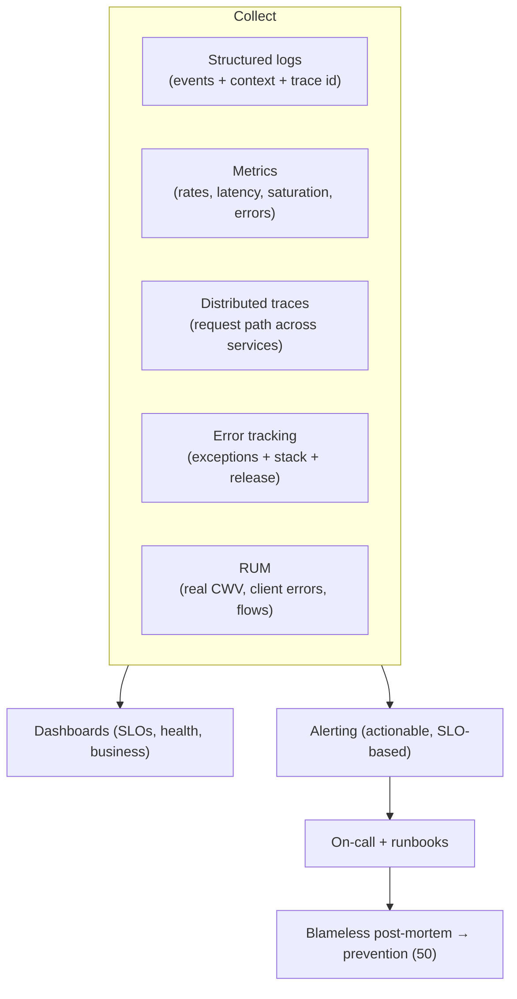
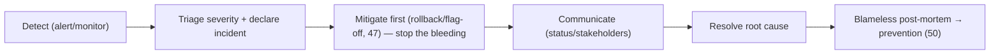

# 48 — Monitoring & Observability

### Knowing What Production Is Actually Doing

> *"You don't have a system you understand; you have a system you hope you understand. Monitoring is the difference between hope and knowledge — and between finding out from your dashboards or from your users."*

---

**Chapter type:** Phase 9 — Assurance & Operations
**DRI:** Performance Engineer + Backend Architect + SRE-minded leads
**Depends on:** [`00-CONSTITUTION.md`](./00-CONSTITUTION.md), [`35`](./35-PERFORMANCE.md), [`37`](./37-SECURITY.md), [`43`](./43-CLEAN_CODE.md), [`47`](./47-DEPLOYMENT.md)
**Feeds:** [`49-MAINTENANCE.md`](./49-MAINTENANCE.md), [`50-CONTINUOUS_IMPROVEMENT.md`](./50-CONTINUOUS_IMPROVEMENT.md)

---

## Table of Contents
1. [Purpose](#1-purpose)
2. [Philosophy](#2-philosophy)
3. [Principles](#3-principles)
4. [Best Practices](#4-best-practices)
5. [Anti-Patterns](#5-anti-patterns)
6. [Real-World Examples](#6-real-world-examples)
7. [Common Mistakes](#7-common-mistakes)
8. [AI Implementation Guidance](#8-ai-implementation-guidance)
9. [Human Review Checklist](#9-human-review-checklist)
10. [Automation Opportunities](#10-automation-opportunities)
11. [References for Further Study](#11-references-for-further-study)
12. [Review Checklist & Measurable Quality Criteria](#12-review-checklist--measurable-quality-criteria)

---

## 1. Purpose

This chapter defines how the studio **observes software in production** — logging, metrics, tracing, error tracking, real-user monitoring, alerting, dashboards, and incident response. It is what makes a live system *knowable*: the difference between discovering a problem from your own instruments versus from an angry user or a lost sale.

Monitoring closes the loop that deployment ([`47`](./47-DEPLOYMENT.md)) opens — a deploy isn't "done" until it's verified healthy — and it feeds maintenance ([`49`](./49-MAINTENANCE.md)) and continuous improvement ([`50`](./50-CONTINUOUS_IMPROVEMENT.md)). It carries production evidence back to performance ([`35`](./35-PERFORMANCE.md) — real-user CWV), security ([`37`](./37-SECURITY.md) — auth/anomaly events), QA ([`45`](./45-QA.md) — escaped defects), and product strategy ([`02`](./02-PRODUCT_STRATEGY.md) — the North Star + guardrail metrics). It operationalizes the Constitution's Article X (evidence over opinion) applied to the running system.

---

## 2. Philosophy

**If you can't see it, you can't run it — and you'll learn about failures from users.** Software in production is a black box until you instrument it. Without observability, incidents are discovered by customers (the worst possible detector), diagnosed by guesswork, and "fixed" without knowing if the fix worked. Monitoring turns the black box into a glass box: you *know* what's happening, you find problems before (or faster than) users do, and you have evidence to act on (Article X). The goal is to never be the last to know.

**Monitoring answers "is it broken?"; observability answers "why?"** These are related but distinct. *Monitoring* watches known signals (error rate, latency, uptime) and alerts when they cross thresholds — it tells you *something is wrong*. *Observability* is the property of being able to ask arbitrary new questions of your system (via rich logs, metrics, and traces) to understand *novel* failures you didn't predict — it tells you *why*. Modern systems fail in unforeseen ways; we build for both: alert on the knowns, and instrument richly enough to investigate the unknowns.

**Alert on symptoms users feel, not on noise.** The fastest way to make monitoring useless is alert fatigue: so many alerts (most non-actionable) that people mute them all — and then miss the real one. Every alert must be **actionable and tied to user impact** (the site is down, checkout is failing, latency breaches SLO) — not "CPU hit 80% for a minute." A page in the middle of the night must mean "a human must act now." We ruthlessly prune noisy alerts; a quiet, trusted alerting system beats a loud, ignored one.

**Measure the user's experience, not just the server's.** A server dashboard can show all-green while users suffer — slow real-world load times, client errors, a broken flow on a specific browser. **Real-user monitoring** (actual Core Web Vitals [`35`](./35-PERFORMANCE.md), client-side errors, funnel drop-off [`29`](./29-USER_FLOWS.md)) captures what people actually experience (Article I — the user is the point). We monitor the whole path to the user, weighted toward what they feel.

---

## 3. Principles

### Principle 1 — Observe production; never let users be your monitor
Instrument so you detect problems before/faster than users report them.
> *Rationale (Art. I, X):* Users are the worst detector; instruments are the best.

### Principle 2 — The three pillars: logs, metrics, traces (+ errors + RUM)
Structured logs (events), metrics (aggregates/trends), traces (request paths), error tracking, real-user monitoring.
> *Rationale:* Each answers different questions; together they explain the system.

### Principle 3 — Alert on actionable, user-impacting symptoms; kill noise
Every alert = a human must act, tied to user impact. Prune non-actionable alerts.
> *Rationale:* Alert fatigue makes monitoring worthless.

### Principle 4 — Define SLIs/SLOs; measure against them
Pick Service Level Indicators (latency, errors, availability); set Objectives; alert on burn.
> *Rationale (Art. X):* "Healthy" must be defined + measurable.

### Principle 5 — Monitor the user's experience (RUM), not just servers
Real Core Web Vitals, client errors, funnel/flow health — from actual users.
> *Rationale (Art. I, [`35`](./35-PERFORMANCE.md)):* Green servers ≠ happy users.

### Principle 6 — Structured, correlated, privacy-safe telemetry
Structured logs with correlation/trace IDs; **never log secrets/PII** ([`37`](./37-SECURITY.md)).
> *Rationale ([`43`](./43-CLEAN_CODE.md), [`37`](./37-SECURITY.md)):* Correlatable + safe or it's useless/dangerous.

### Principle 7 — Verify every deploy; watch releases
Post-deploy health checks + smoke; correlate metrics to deploys; auto-rollback on failure ([`47`](./47-DEPLOYMENT.md)).
> *Rationale (Art. IX):* A deploy isn't done until it's verified healthy.

### Principle 8 — Prepare to respond: on-call, runbooks, blameless post-mortems
An incident process exists; incidents produce learning + prevention, not blame.
> *Rationale ([`45`](./45-QA.md), [`50`](./50-CONTINUOUS_IMPROVEMENT.md)):* Detection is useless without response + learning.

### Principle 9 — Monitor security + business, not just infra
Auth anomalies/security events ([`37`](./37-SECURITY.md)) + product metrics (North Star/guardrails, [`02`](./02-PRODUCT_STRATEGY.md)).
> *Rationale:* Infra health is necessary, not sufficient.

---

## 4. Best Practices

### 4.1 The observability stack


### 4.2 The three pillars (what each is for)
| Pillar | Question it answers | Example |
| --- | --- | --- |
| **Logs** (structured) | "What happened, exactly?" | `{ level, msg, userId, traceId, orderId, latencyMs }` |
| **Metrics** (aggregates) | "How much / how often / what trend?" | error rate, p95 latency, req/s, saturation |
| **Traces** (distributed) | "Where did this request spend time / fail?" | request → service A → DB → service B path |
| **Errors** | "What's throwing, how often, since when?" | grouped exceptions + stack + release + user |
| **RUM** | "What do real users experience?" | field CWV ([`35`](./35-PERFORMANCE.md)), client errors, funnel drop-off ([`29`](./29-USER_FLOWS.md)) |

### 4.3 Structured, correlated logging ([`43`](./43-CLEAN_CODE.md), [`37`](./37-SECURITY.md))
```ts
logger.info("order.created", {
  traceId, userId, orderId, amount, latencyMs,   // structured fields (queryable)
});
// ❌ NEVER: logger.info(`User ${email} paid with card ${cardNumber}`)  ← PII/secret leak
```
- **Structured** (JSON) not string-concatenated — so logs are searchable/aggregatable.
- **Correlation/trace IDs** thread a request across logs/services/traces.
- **Log levels** used sanely (error/warn/info/debug); **never log secrets/PII/PANs** (Principle 6, [`37`](./37-SECURITY.md)).
- Meaningful events (the "why", cf. [`43`](./43-CLEAN_CODE.md) error handling), not noise.

### 4.4 The metrics that matter (RED + USE + Four Golden Signals)
- **RED** (per service/endpoint): **R**ate (req/s), **E**rrors (fail %), **D**uration (latency p50/p95/p99).
- **USE** (per resource): **U**tilization, **S**aturation, **E**rrors.
- **Four Golden Signals** (Google SRE): latency, traffic, errors, saturation.
- Plus **RUM** (real CWV) and **business** metrics (North Star/guardrails, [`02`](./02-PRODUCT_STRATEGY.md)).
Track **percentiles (p95/p99), not averages** — averages hide the tail where users hurt.

### 4.5 SLIs, SLOs, and error budgets (Principle 4)
- **SLI** (indicator): a measured signal, e.g. "% of requests < 300ms" or "% successful requests."
- **SLO** (objective): the target, e.g. "99.9% availability", "p95 latency < 300ms".
- **Error budget:** the allowed shortfall (100% − SLO). Alert on **burn rate** (are we spending the budget too fast?), not on every blip. Error budgets balance reliability vs. velocity ([`50`](./50-CONTINUOUS_IMPROVEMENT.md)).

### 4.6 Alerting that people trust (Principle 3)
- **Alert on symptoms, from the SLO** ("checkout error rate breaching SLO"), not causes/noise ("CPU 80%").
- Every alert is **actionable** (there's something a human should do) and **routed** to the right on-call.
- **Severity tiers:** page (act now) vs. ticket (handle in hours) vs. FYI (dashboard).
- Include **context + a runbook link** in the alert.
- **Continuously prune** noisy/non-actionable alerts — measure alert-to-action ratio.

### 4.7 Real-user monitoring & error tracking ([`35`](./35-PERFORMANCE.md), [`29`](./29-USER_FLOWS.md))
- **RUM:** collect field **Core Web Vitals** (LCP/INP/CLS), client-side JS errors, and **funnel/flow health** ([`29`](./29-USER_FLOWS.md)) — segmented by device/browser/geo (catches "slow only on low-end Android").
- **Error tracking** (Sentry-style): grouped exceptions with stack traces, release + user context, and **regression detection** (this error appeared in release X). Wire source maps so stack traces are readable.

### 4.8 Dashboards (Principle 4, 9)
Curate a few **high-signal dashboards**: a **service health** board (RED/golden signals + SLOs), a **RUM/UX** board (CWV, client errors, funnels), a **business** board (North Star/guardrails, [`02`](./02-PRODUCT_STRATEGY.md)), and a **security** board (auth failures, anomalies, [`37`](./37-SECURITY.md)). Overlay **deploy markers** so you can correlate a metric shift to a release ([`47`](./47-DEPLOYMENT.md)). Avoid dashboard sprawl (dozens no one reads).

### 4.9 Incident response (Principle 8)

Have **on-call rotation**, **runbooks** (how to diagnose/mitigate common failures), and clear severity/escalation. **Mitigate before you perfectly diagnose** (rollback/kill-switch, [`47`](./47-DEPLOYMENT.md)). Every significant incident → a **blameless post-mortem** producing concrete preventions ([`45`](./45-QA.md), [`50`](./50-CONTINUOUS_IMPROVEMENT.md)) — focus on systems, never on blaming people.

---

## 5. Anti-Patterns

| Anti-pattern | Why it fails | Principle |
| --- | --- | --- |
| **No monitoring** (users report failures) | Slow detection; guesswork; lost trust. | P1 |
| **Logs only / no metrics or traces** | Can't see trends or where requests fail. | P2 |
| **Alert fatigue** (noisy, non-actionable alerts) | People mute all → miss the real one. | P3 |
| **Alerting on causes, not symptoms** (CPU%, not user impact) | Noise; misses actual user pain. | P3 |
| **No SLOs** ("healthy" = vibes) | No agreed target; can't alert meaningfully. | P4 |
| **Server-only monitoring** (no RUM) | Green servers, suffering users. | P5 |
| **Unstructured logs / no correlation IDs** | Un-searchable; can't trace a request. | P6 |
| **Logging secrets/PII** | Security + privacy breach. | P6, Art. III |
| **Averages, not percentiles** | Hides the tail latency users feel. | 4.4 |
| **Deploy-and-forget** (no post-deploy watch) | Failures found late. | P7 |
| **No incident process / blameful post-mortems** | Chaos; problems hidden; no learning. | P8 |
| **Dashboard sprawl** nobody reads | Signal lost in noise. | 4.8 |

---

## 6. Real-World Examples

### Example A — Users as the monitor (the failure to avoid)
A checkout bug caused ~5% of payments to silently fail; the team learned about it three days later from support tickets and a revenue dip — after losing many sales. Adding **error tracking + a business metric alert** ("checkout success rate below SLO") meant the *next* such regression paged the on-call within minutes of the deploy that caused it, correlated to the release marker ([`47`](./47-DEPLOYMENT.md)) — caught before most users hit it (Principles 1, 7, 9). *Never let users be your detector.*

### Example B — Killing alert fatigue restored trust
A team had ~200 alerts/week, almost all non-actionable ("disk 70%", "CPU spike") — so everyone muted the channel, and then **missed a real outage**. They deleted every alert not tied to user impact, rebuilt alerting on **SLO burn rate** (Principle 3, 5), and dropped to a handful of high-signal, always-actionable alerts. On-call started trusting the pager again — a page now *means* act (Principle 3). *A quiet, trusted alert system beats a loud, ignored one.*

### Example C — Percentiles + RUM found what averages hid
A dashboard showed "average latency 180ms — all good," but users complained the app was slow. **Percentiles** revealed p99 latency of 4s (a slow query on large accounts), and **RUM segmentation** showed it concentrated on specific users/devices ([`35`](./35-PERFORMANCE.md)). Averages had masked a painful tail affecting real people. Fixing the query (an N+1, [`39`](./39-DATABASE_DESIGN.md)) fixed the experience (Principles 4, 5). *Measure the tail and the real user, not the average server.*

---

## 7. Common Mistakes

- **Shipping without monitoring** and finding out from users.
- **Only logs** (no metrics/traces/RUM) — can't see trends or trace requests.
- **Too many noisy alerts** → alert fatigue → muted → missed incidents.
- **Alerting on causes** (CPU/memory) instead of **user-impacting symptoms**.
- **No SLOs** — no measurable definition of "healthy."
- **Server-only monitoring**, ignoring real-user experience (RUM/CWV).
- **Unstructured logs**, no correlation IDs; **logging PII/secrets**.
- **Reporting averages** instead of p95/p99.
- **Not watching deploys**; **no incident runbooks / blameful post-mortems**.

---

## 8. AI Implementation Guidance

### 8.1 Where agents help
- **Instrument code** with structured logging, metrics, and tracing (correlation IDs) — PII-safe.
- **Define SLIs/SLOs** and generate SLO-burn-based alerting rules + dashboards.
- **Set up error tracking + RUM** (CWV, client errors, funnels) with release correlation.
- **Draft runbooks** and post-mortem templates; **analyze incidents** for root cause + prevention.
- **Audit** telemetry for missing metrics/traces, noisy/cause-based alerts, PII in logs, averages-not-percentiles, server-only monitoring.

### 8.2 Hard rules (Art. I, X, III)
- The agent instruments the **three pillars + errors + RUM** (not logs-only) with **structured, correlated** telemetry, and **never logs secrets/PII** ([`37`](./37-SECURITY.md)).
- Alerts are **actionable + symptom/SLO-based + tied to user impact** — it does not generate noisy, cause-based alerts; it prunes noise.
- It defines **SLIs/SLOs** and uses **percentiles (p95/p99)**, not averages.
- It monitors the **real user experience** (RUM/CWV, [`35`](./35-PERFORMANCE.md)) and **business + security** signals ([`02`](./02-PRODUCT_STRATEGY.md), [`37`](./37-SECURITY.md)), not just infra.
- It wires **post-deploy verification + release correlation + rollback triggers** ([`47`](./47-DEPLOYMENT.md)) and produces **blameless** post-mortems focused on prevention (never blame, [`50`](./50-CONTINUOUS_IMPROVEMENT.md)).

### 8.3 Prompt example — instrument + observe a service
```
ROLE: SRE/Performance Engineer, bound by 00-CONSTITUTION + 48 (+35/37/47).
TASK: Add observability to <service/flow>.
CONSTRAINTS:
  - Structured logging with traceId/correlation (no PII/secrets); meaningful events.
  - Metrics: RED (rate/errors/duration p50/p95/p99) + saturation; RUM for CWV + funnel (29/35).
  - Define SLIs/SLOs (availability, p95 latency, error rate) + error budget.
  - Alerting: SLO-burn-based, actionable, user-impacting only; severity tiers + runbook links.
  - Error tracking with release correlation; deploy markers on dashboards (47).
  - Security + business signals (auth anomalies 37; North Star/guardrails 02).
OUTPUT: instrumentation + SLO/alert config + a health dashboard spec + a runbook stub. No PII in telemetry.
```

### 8.4 Prompt example — audit
```
TASK: Audit observability for: missing metrics/traces (logs-only), noisy or cause-based alerts (alert
fatigue), no SLOs, server-only monitoring (no RUM), unstructured logs / missing correlation IDs, PII in
logs, averages instead of percentiles, and no post-deploy verification/incident process. Output {gap,
impact, fix}, prioritizing user-impact detection + PII safety.
```

---

## 9. Human Review Checklist

- [ ] Production is **instrumented** so problems are detected **before/faster than users** report them.
- [ ] **Three pillars + errors + RUM** present (not logs-only); logs are **structured + correlated**.
- [ ] **No secrets/PII in telemetry** ([`37`](./37-SECURITY.md)).
- [ ] **SLIs/SLOs defined**; metrics use **p95/p99**, not averages.
- [ ] **Alerts are actionable, symptom/SLO-based, user-impacting**; noise pruned; severity tiers + runbooks.
- [ ] **Real-user experience monitored** (CWV, client errors, funnels) segmented by device/browser/geo.
- [ ] **Business + security signals** monitored, not just infra ([`02`](./02-PRODUCT_STRATEGY.md), [`37`](./37-SECURITY.md)).
- [ ] **Every deploy is verified** (post-deploy checks + release correlation + rollback triggers) ([`47`](./47-DEPLOYMENT.md)).
- [ ] **Incident process** exists (on-call, runbooks, severity); **post-mortems are blameless → prevention** ([`50`](./50-CONTINUOUS_IMPROVEMENT.md)).
- [ ] Dashboards are **few + high-signal** (no sprawl).

---

## 10. Automation Opportunities

| Task | Automation |
| --- | --- |
| Telemetry | OpenTelemetry (logs/metrics/traces) + a backend (Datadog/Grafana/Honeycomb-style). |
| RUM + CWV | web-vitals reporting + RUM tooling; field CWV dashboards ([`35`](./35-PERFORMANCE.md)). |
| Error tracking | Sentry-style exception tracking with source maps + release correlation. |
| SLO alerting | SLO/burn-rate alerting; block noisy alerts via review. |
| Deploy correlation | Auto-annotate dashboards with release markers; auto-rollback on health failure ([`47`](./47-DEPLOYMENT.md)). |
| PII-in-logs detection | Scanner/redaction for secrets/PII in log pipelines ([`37`](./37-SECURITY.md)). |
| Synthetic monitoring | Scheduled uptime + critical-journey checks (external probes). |
| Incident tooling | On-call/paging + runbook + post-mortem templates; MTTR tracking ([`50`](./50-CONTINUOUS_IMPROVEMENT.md)). |

---

## 11. References for Further Study
- **SRE:** Google's *Site Reliability Engineering* + *The SRE Workbook* (SLIs/SLOs/error budgets, four golden signals, alerting, blameless post-mortems).
- **Observability:** *Observability Engineering* (Majors, Fong-Jones, Miranda); the RED (Weaveworks) and USE (Brendan Gregg) methods; OpenTelemetry docs.
- **RUM & web performance:** web.dev field-data / Core Web Vitals monitoring ([`35`](./35-PERFORMANCE.md)).
- **Incident practice:** blameless post-mortem culture; incident-command basics ([`45`](./45-QA.md), [`50`](./50-CONTINUOUS_IMPROVEMENT.md)).
- **Cross-references:** [`02-PRODUCT_STRATEGY.md`](./02-PRODUCT_STRATEGY.md), [`29-USER_FLOWS.md`](./29-USER_FLOWS.md), [`35-PERFORMANCE.md`](./35-PERFORMANCE.md), [`37-SECURITY.md`](./37-SECURITY.md), [`39-DATABASE_DESIGN.md`](./39-DATABASE_DESIGN.md), [`47-DEPLOYMENT.md`](./47-DEPLOYMENT.md), [`49-MAINTENANCE.md`](./49-MAINTENANCE.md), [`50-CONTINUOUS_IMPROVEMENT.md`](./50-CONTINUOUS_IMPROVEMENT.md).

---

## 12. Review Checklist & Measurable Quality Criteria

| Criterion | Target |
| --- | --- |
| Production incidents detected by monitoring (not users) | ≥ 90% |
| Services with defined SLIs/SLOs | 100% (critical services) |
| Alert actionability (alerts → action) | high; noise trend → 0 |
| Real-user monitoring (CWV + errors + funnels) in place | Yes |
| Secrets/PII in logs | 0 (floor, [`37`](./37-SECURITY.md)) |
| Metrics reported as percentiles (p95/p99) | Yes |
| Deploys verified + release-correlated | 100% |
| Mean Time To Detect / Recover (MTTD/MTTR) | ↓ trend |
| Significant incidents with a blameless post-mortem + prevention | 100% |

---

*End of `48-MONITORING.md`.*
