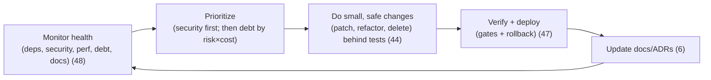

# 49 — Maintenance

### Keeping Software Healthy for the Long Run

> *"Software is not built and finished; it is grown and tended. The code you ship today starts decaying tomorrow — through dependency rot, changing requirements, and accumulated shortcuts. Maintenance is the gardening that keeps it alive."*

---

**Chapter type:** Phase 9 — Assurance & Operations
**DRI:** Software Architect + Engineering Leads
**Depends on:** [`00-CONSTITUTION.md`](./00-CONSTITUTION.md), [`37`](./37-SECURITY.md), [`39`](./39-DATABASE_DESIGN.md), [`41`](./41-CODE_ARCHITECTURE.md)–[`44`](./44-TESTING.md), [`48`](./48-MONITORING.md)
**Feeds:** [`50-CONTINUOUS_IMPROVEMENT.md`](./50-CONTINUOUS_IMPROVEMENT.md)

---

## Table of Contents
1. [Purpose](#1-purpose)
2. [Philosophy](#2-philosophy)
3. [Principles](#3-principles)
4. [Best Practices](#4-best-practices)
5. [Anti-Patterns](#5-anti-patterns)
6. [Real-World Examples](#6-real-world-examples)
7. [Common Mistakes](#7-common-mistakes)
8. [AI Implementation Guidance](#8-ai-implementation-guidance)
9. [Human Review Checklist](#9-human-review-checklist)
10. [Automation Opportunities](#10-automation-opportunities)
11. [References for Further Study](#11-references-for-further-study)
12. [Review Checklist & Measurable Quality Criteria](#12-review-checklist--measurable-quality-criteria)

---

## 1. Purpose

This chapter defines how the studio **keeps software healthy over its whole life** — dependency updates, security patching, technical-debt management, refactoring, documentation upkeep, deprecations, and the routine care that prevents a codebase from rotting into a system nobody dares touch. Most of a product's lifetime (and cost) is *after* the first launch; maintenance is where that majority is won or lost.

Maintenance draws on nearly the whole manual: security patching ([`37`](./37-SECURITY.md)), safe schema/dependency changes ([`39`](./39-DATABASE_DESIGN.md)), clean architecture and code that stay refactorable ([`41`](./41-CODE_ARCHITECTURE.md), [`43`](./43-CLEAN_CODE.md)), tests that make change safe ([`44`](./44-TESTING.md)), monitoring that surfaces health ([`48`](./48-MONITORING.md)), and deployment that makes changes routine ([`47`](./47-DEPLOYMENT.md)). It embodies the Constitution's Article IX (small, reversible steps), Article III (security patching is floor-level), and the "leave it cleaner than you found it" ethos ([`43`](./43-CLEAN_CODE.md)).

---

## 2. Philosophy

**Software rots even when you don't touch it.** A codebase left alone doesn't stay stable — it *decays*. Dependencies age into security vulnerabilities, browsers and platforms change, requirements shift, and the world around the code moves on. "Done" is an illusion; the moment you ship, entropy begins. Maintenance is the ongoing, deliberate work of resisting that decay — not a sign of failure but the normal, expected majority of a healthy product's life (Article IX — reality corrects us continuously).

**Technical debt is a tool, not a sin — if you track and repay it.** Taking a shortcut to hit a real deadline is a legitimate *loan*: you borrow speed now against interest later. The failure isn't taking debt; it's taking it *unconsciously* and *never repaying* it — letting interest compound until the codebase is bankrupt (the "we need a rewrite" endgame). We take debt *deliberately*, *record* it (visible, not hidden), and *repay* it steadily. Debt you name and manage is leverage; debt you ignore is a slow-motion rewrite (Article XII — break rules loudly; Article VIII).

**Small, continuous care beats big, rare rewrites.** The instinct to let things rot and then "fix it all in a big rewrite" is a trap: rewrites are enormously risky, usually over-run, and often recreate the original's problems. The proven alternative is **continuous maintenance** — small, safe, reversible improvements (a dependency bump here, a refactor there, a stale flag removed) backed by tests, done constantly (Article IX; the Boy Scout Rule, [`43`](./43-CLEAN_CODE.md)). A garden tended weekly never needs to be razed.

**Patching is not optional housekeeping; it is active security defense.** Most breaches exploit *known, unpatched* vulnerabilities ([`37`](./37-SECURITY.md)). Keeping dependencies current is therefore not a nice-to-have chore but a floor-level obligation (Article III). Un-updated dependencies are also *harder* to update the longer you wait (version drift compounds), so timely, routine patching is both safer and cheaper than a panicked catch-up years later.

---

## 3. Principles

### Principle 1 — Maintenance is expected, funded work — not failure
Budget ongoing capacity for care; "done" is a myth.
> *Rationale (Art. IX):* Most of a product's life is post-launch.

### Principle 2 — Patch dependencies + security promptly (floor-level)
Keep dependencies current; apply security patches within an SLA ([`37`](./37-SECURITY.md)).
> *Rationale (Art. III):* Most breaches exploit known, unpatched vulns.

### Principle 3 — Make technical debt visible, deliberate, and repaid
Take debt consciously (with rationale), track it, and pay it down steadily.
> *Rationale (Art. XII, VIII):* Unmanaged debt compounds to bankruptcy.

### Principle 4 — Continuous small improvements over big rewrites
Refactor incrementally, safely, backed by tests; avoid the rewrite trap.
> *Rationale (Art. IX, [`43`](./43-CLEAN_CODE.md)):* Small reversible steps beat risky big-bangs.

### Principle 5 — Refactor safely, behind a test net
Never refactor without tests protecting behavior ([`44`](./44-TESTING.md)); change structure, not behavior.
> *Rationale ([`44`](./44-TESTING.md)):* Tests are what make change fearless.

### Principle 6 — Keep documentation + knowledge current
Docs, ADRs, runbooks, and READMEs kept accurate; knowledge shared (low bus factor).
> *Rationale (Art. VI):* Stale docs mislead; siloed knowledge is fragile.

### Principle 7 — Delete relentlessly (dead code, stale flags, unused deps)
Remove what's unused; less code = less to maintain + fewer bugs ([`43`](./43-CLEAN_CODE.md)).
> *Rationale (Art. VIII):* The cheapest code to maintain is deleted code.

### Principle 8 — Deprecate gracefully; migrate safely
Deprecate with notice + migration path; version + expand/contract for breaking changes ([`39`](./39-DATABASE_DESIGN.md), [`40`](./40-API_DESIGN.md)).
> *Rationale (Art. IX):* Sudden removals break users/consumers.

### Principle 9 — Monitor health signals; maintain proactively
Use monitoring ([`48`](./48-MONITORING.md)) + code-health metrics to find rot before it bites.
> *Rationale (Art. X):* Proactive maintenance is cheaper than reactive firefighting.

---

## 4. Best Practices

### 4.1 The maintenance loop

Maintenance is a *continuous cadence*, not a one-off cleanup — budget recurring capacity (e.g. a standing % of each cycle, Principle 1).

### 4.2 Dependency & security patching (Principle 2, [`37`](./37-SECURITY.md))
- **Automate detection:** dependency + vulnerability scanning in CI (Dependabot/Renovate/Snyk); alerts on new CVEs.
- **Patch SLAs by severity:** critical security patches fast (e.g. days); routine updates on a **regular cadence** (e.g. weekly/monthly batches) — don't let versions drift for years.
- **Update safely:** automated PRs + the test suite ([`44`](./44-TESTING.md)) + staging verification ([`47`](./47-DEPLOYMENT.md)) catch breakage; batch minor/patch, isolate risky majors.
- **Prune unused deps** (`knip`/`depcheck`) — every dependency is attack surface + maintenance cost.

### 4.3 Managing technical debt (Principle 3)
- **Make it visible:** a tracked debt register / labeled backlog items — not `// TODO: fix this someday` buried in code.
- **Record it when taken:** when you take a deliberate shortcut, note *what*, *why*, and the *cost/plan* (Article XII) — a comment linking a ticket, or an ADR ([`41`](./41-CODE_ARCHITECTURE.md)).
- **Repay steadily:** allocate ongoing capacity (e.g. ~10–20% of each cycle) to debt paydown; prioritize by **risk × cost-of-delay** (debt in hot, changing, or risky code first).
- **Distinguish debt types:** deliberate/prudent (a conscious loan — fine), vs. inadvertent/reckless (from ignorance/sloppiness — prevent via review [`46`](./46-CODE_REVIEW.md)).

### 4.4 Refactoring safely (Principles 4, 5, [`43`](./43-CLEAN_CODE.md), [`44`](./44-TESTING.md))
- **Test first:** ensure behavior is covered by tests *before* refactoring; if it isn't, add characterization tests ([`44`](./44-TESTING.md)).
- **Small steps:** refactor in tiny, reversible commits (rename → extract → simplify), tests green at each step (Article IX).
- **Behavior-preserving:** refactoring changes *structure*, not *behavior* — if behavior changes, that's a feature/fix, tested separately.
- **Continuous (Boy Scout Rule):** improve code as you touch it ([`43`](./43-CLEAN_CODE.md)) — the primary defense against needing a rewrite.

### 4.5 Avoiding the rewrite trap (Principle 4)
Big rewrites are high-risk, usually over-run, and frequently reproduce the original's flaws while the old system stagnates. Prefer **incremental modernization**: the **strangler-fig** pattern (grow the new around the old, route traffic over piece by piece, retire the old gradually). Reserve full rewrites for genuinely exceptional cases, decided as a one-way door with eyes open (Article IX).

### 4.6 Documentation & knowledge upkeep (Principle 6, [`00`](./00-CONSTITUTION.md))
- Keep READMEs, setup guides, ADRs ([`41`](./41-CODE_ARCHITECTURE.md)), runbooks ([`48`](./48-MONITORING.md)), and API docs ([`40`](./40-API_DESIGN.md)) **current** — stale docs are worse than none (they mislead).
- Prefer docs that live *near the code* and are updated in the same PR; auto-generate where possible ([`40`](./40-API_DESIGN.md)).
- **Lower the bus factor:** share knowledge (pairing, review [`46`](./46-CODE_REVIEW.md), this manual); no single person is the only one who understands a critical system.

### 4.7 Deletion & deprecation (Principles 7, 8)
- **Delete dead code, unused exports, stale feature flags** ([`47`](./47-DEPLOYMENT.md)), and unused deps continuously (`knip`/`ts-prune`, §10) — version control remembers.
- **Deprecate gracefully:** announce, provide a migration path + timeline, use deprecation warnings/headers, monitor usage before removal ([`40`](./40-API_DESIGN.md)).
- **Migrate safely:** expand/contract for schema ([`39`](./39-DATABASE_DESIGN.md)); versioning for APIs ([`40`](./40-API_DESIGN.md)); codemods for library changes ([`14`](./14-COMPONENT_LIBRARY.md)).

### 4.8 Proactive health monitoring (Principle 9, [`48`](./48-MONITORING.md))
Track **code-health signals** (test coverage of critical modules, complexity/coupling trends [`41`](./41-CODE_ARCHITECTURE.md)/[`43`](./43-CLEAN_CODE.md), bundle size [`35`](./35-PERFORMANCE.md), dependency freshness/CVE count, flaky-test rate) alongside production monitoring ([`48`](./48-MONITORING.md)). Rising rot shows up in these before it becomes a crisis — maintain proactively, not reactively.

### 4.9 Backups, data retention & operational hygiene ([`39`](./39-DATABASE_DESIGN.md), [`37`](./37-SECURITY.md))
- **Backups exist and restores are tested** (an untested backup isn't a backup) — verify periodically ([`39`](./39-DATABASE_DESIGN.md)).
- **Rotate secrets/credentials** on a schedule ([`37`](./37-SECURITY.md)); review access/permissions periodically (least privilege).
- **Data retention/cleanup** jobs run and are correct (privacy + cost, [`37`](./37-SECURITY.md)); certificates renew (automate); scheduled jobs monitored.

---

## 5. Anti-Patterns

| Anti-pattern | Why it fails | Principle |
| --- | --- | --- |
| **"Done" mindset** (no maintenance budget) | Rot accumulates; eventual crisis. | P1 |
| **Neglected dependencies** (years out of date) | Known-vuln exposure; painful catch-up. | P2, Art. III |
| **Invisible/ignored tech debt** | Compounds to "we need a rewrite." | P3 |
| **The big rewrite** (instead of incremental) | High-risk, over-runs, repeats old flaws. | P4 |
| **Refactoring without tests** | Silent behavior breakage. | P5 |
| **Stale/wrong documentation** | Misleads; worse than none. | P6 |
| **Hoarding dead code / stale flags / unused deps** | More to maintain; more bugs; confusion. | P7 |
| **Sudden removals** (no deprecation) | Breaks users/consumers. | P8 |
| **Reactive-only maintenance** (firefighting) | Expensive; always behind. | P9 |
| **Untested backups / never-rotated secrets** | Data loss; standing security risk. | 4.9, Art. III |
| **Bus factor of one** on critical systems | Fragile; knowledge lost when they leave. | P6 |

---

## 6. Real-World Examples

### Example A — The dependency debt that became a security crisis
A team never updated dependencies ("if it works, don't touch it"). Three years later a **critical CVE** hit a core library — but updating it required jumping *several* major versions at once, cascading breaking changes across the app, under emergency time pressure. A neighboring team on **automated weekly updates** (Renovate + test suite, 4.2) patched the same CVE in an afternoon. *Timely, routine patching is both safer and vastly cheaper than a panicked catch-up (Principle 2; Article III).*

### Example B — Strangler-fig beat the big rewrite
A legacy module was painful, so the team proposed a **full rewrite**. History (and Article IX) warned against it. Instead they used the **strangler-fig** pattern (4.5): built new functionality alongside the old, routed features over one at a time behind flags ([`47`](./47-DEPLOYMENT.md)), and retired the legacy piece gradually — shipping value throughout and never facing a risky big-bang cutover. *Incremental modernization delivered what the rewrite promised, without the risk (Principle 4).*

### Example C — Visible debt got repaid; invisible debt bankrupted
Two teams took similar shortcuts under deadline. Team A **recorded the debt** (tracked tickets + ADR notes: what, why, cost) and repaid ~15% each cycle; their codebase stayed healthy. Team B left `// TODO: hack, fix later` comments buried in code; nobody tracked or repaid them, interest compounded, and two years later they demanded a rewrite. *Same debt, opposite outcomes — the difference was making it visible and repaying it steadily (Principle 3).*

---

## 7. Common Mistakes

- **Treating launch as "done"** with no ongoing maintenance capacity.
- **Letting dependencies rot** until a forced, painful, emergency upgrade.
- **Hiding tech debt** in code comments instead of tracking + repaying it.
- **Proposing big rewrites** instead of incremental modernization.
- **Refactoring without a test net** (breaking behavior silently).
- **Letting docs/ADRs/runbooks go stale.**
- **Hoarding dead code, stale flags, unused dependencies.**
- **Removing things suddenly** without deprecation/migration paths.
- **Firefighting reactively** instead of monitoring code health proactively.
- **Never testing backups or rotating secrets**; bus factor of one.

---

## 8. AI Implementation Guidance

AI is especially strong at the *routine, high-volume* maintenance work humans neglect — and must do it *safely* (behind tests, small steps).

### 8.1 Where agents help
- **Automate dependency updates**: propose + verify patch/minor bumps, triage majors, prune unused deps.
- **Refactor safely**: small behavior-preserving refactors *with* tests; add characterization tests first where missing.
- **Surface + track debt**: find risky/complex/stale code, dead code, stale flags; draft debt-register items.
- **Keep docs current**: update READMEs/ADRs/API docs alongside code changes.
- **Write migrations/codemods** for deprecations ([`39`](./39-DATABASE_DESIGN.md), [`40`](./40-API_DESIGN.md), [`14`](./14-COMPONENT_LIBRARY.md)).
- **Audit** health (dependency freshness/CVEs, complexity trends, coverage gaps, dead code).

### 8.2 Hard rules (Art. III, IX, VIII)
- The agent treats **security/dependency patching as floor-level** and prompt ([`37`](./37-SECURITY.md)); it verifies updates against **tests + staging**, never blindly.
- It **refactors only behind a test net** (adds characterization tests first if absent), in **small, reversible, behavior-preserving** steps ([`44`](./44-TESTING.md), Art. IX) — it does **not** propose big-bang rewrites when incremental modernization (strangler-fig) is viable.
- It makes **tech debt visible** (tracked, with rationale) rather than hidden in TODOs; records deliberate debt (Art. XII).
- It **deletes** dead code/stale flags/unused deps (version control remembers) and **deprecates gracefully** (notice + migration + expand/contract) — never sudden removals ([`39`](./39-DATABASE_DESIGN.md)/[`40`](./40-API_DESIGN.md)).
- It **updates docs/ADRs** in the same change (Art. VI); flags **untested backups / un-rotated secrets** as risks ([`37`](./37-SECURITY.md)/[`39`](./39-DATABASE_DESIGN.md)).

### 8.3 Prompt example — safe maintenance pass
```
ROLE: Maintenance engineer, bound by 00-CONSTITUTION + 49 (+37/44/47).
TASK: Perform a maintenance pass on <module/repo>.
CONSTRAINTS:
  - Dependencies: propose patch/minor updates (batched) + flag risky majors; prune unused deps;
    surface CVEs (security first). Verify against the test suite + note staging validation.
  - Refactor only behind tests (add characterization tests if missing); small, behavior-preserving steps.
  - Surface tech debt as tracked items (what/why/risk×cost), not buried TODOs.
  - Delete dead code + stale feature flags; update affected docs/ADRs in the same change.
  - No big-bang rewrites — prefer incremental (strangler-fig) if modernization is needed.
OUTPUT: prioritized change list (security first) + PRs (small, reversible) + debt register updates + docs updates.
```

### 8.4 Prompt example — health audit
```
TASK: Audit maintenance health: outdated/vulnerable dependencies (by severity), unused deps, dead code +
stale feature flags, low-coverage critical modules, rising complexity/coupling hotspots (41/43), stale
docs/ADRs, untested backups, and un-rotated secrets. Output a prioritized remediation plan
(security/floor first, then risk×cost), each item small + safe.
```

---

## 9. Human Review Checklist

- [ ] **Ongoing maintenance capacity** is budgeted (not treated as "done").
- [ ] **Dependencies current**; **security patches** applied within SLA; **unused deps pruned** ([`37`](./37-SECURITY.md)).
- [ ] **Tech debt is visible + tracked**; deliberate debt recorded with rationale; steady paydown happening.
- [ ] Modernization is **incremental** (no risky big-bang rewrite unless truly justified).
- [ ] **Refactors are behind tests**, small, and behavior-preserving ([`44`](./44-TESTING.md)).
- [ ] **Docs/ADRs/runbooks are current**; knowledge shared (bus factor > 1) ([`41`](./41-CODE_ARCHITECTURE.md), [`48`](./48-MONITORING.md)).
- [ ] **Dead code / stale flags / unused deps** are deleted, not hoarded.
- [ ] Removals use **graceful deprecation + migration** (expand/contract, versioning) ([`39`](./39-DATABASE_DESIGN.md), [`40`](./40-API_DESIGN.md)).
- [ ] **Code-health signals monitored** proactively ([`48`](./48-MONITORING.md)); maintenance isn't only firefighting.
- [ ] **Backups tested**, **secrets rotated**, access reviewed, certs auto-renew ([`37`](./37-SECURITY.md), [`39`](./39-DATABASE_DESIGN.md)).

---

## 10. Automation Opportunities

| Task | Automation |
| --- | --- |
| Dependency updates | Renovate/Dependabot auto-PRs + test suite verification ([`44`](./44-TESTING.md)). |
| Vulnerability scanning | Snyk/`npm audit`/GitHub security alerts in CI; block on high severity ([`37`](./37-SECURITY.md)). |
| Dead-code / unused deps | `knip`/`ts-prune`/`depcheck` reports; stale-flag detection ([`43`](./43-CLEAN_CODE.md), [`47`](./47-DEPLOYMENT.md)). |
| Code-health metrics | Track complexity/coupling/coverage/bundle-size trends in CI ([`41`](./41-CODE_ARCHITECTURE.md), [`35`](./35-PERFORMANCE.md)). |
| Docs freshness | Doc-lint / link-checkers; auto-generated API docs ([`40`](./40-API_DESIGN.md)). |
| Backups | Scheduled backups + automated periodic restore tests ([`39`](./39-DATABASE_DESIGN.md)). |
| Secret rotation / certs | Automated rotation + auto-renewing TLS ([`37`](./37-SECURITY.md)). |
| Debt tracking | Labeled backlog / debt register; report debt trend over time ([`50`](./50-CONTINUOUS_IMPROVEMENT.md)). |

---

## 11. References for Further Study
- **Tech debt:** the technical-debt quadrant (Martin Fowler); Ward Cunningham's original debt metaphor.
- **Refactoring:** *Refactoring* (Martin Fowler); *Working Effectively with Legacy Code* (Michael Feathers — characterization tests).
- **Incremental modernization:** the strangler-fig application pattern (Fowler); *Kill It with Fire* (Marianne Bellotti) on legacy modernization.
- **Dependency/security hygiene:** OWASP dependency-management guidance ([`37`](./37-SECURITY.md)); Renovate/Dependabot docs.
- **Cross-references:** [`37-SECURITY.md`](./37-SECURITY.md), [`39-DATABASE_DESIGN.md`](./39-DATABASE_DESIGN.md), [`40-API_DESIGN.md`](./40-API_DESIGN.md), [`41-CODE_ARCHITECTURE.md`](./41-CODE_ARCHITECTURE.md), [`43-CLEAN_CODE.md`](./43-CLEAN_CODE.md), [`44-TESTING.md`](./44-TESTING.md), [`47-DEPLOYMENT.md`](./47-DEPLOYMENT.md), [`48-MONITORING.md`](./48-MONITORING.md), [`50-CONTINUOUS_IMPROVEMENT.md`](./50-CONTINUOUS_IMPROVEMENT.md).

---

## 12. Review Checklist & Measurable Quality Criteria

| Criterion | Target |
| --- | --- |
| Critical security patches applied within SLA | 100% (floor, Art. III) |
| Dependency freshness / high-severity CVEs outstanding | current / 0 |
| Tech debt tracked + steadily repaid | Yes (visible register; paydown each cycle) |
| Refactors done behind tests (behavior-preserving) | 100% |
| Docs/ADRs/runbooks current | Yes |
| Dead code / stale flags / unused deps | trend → 0 |
| Backups tested (restore verified) + secrets rotated | Yes |
| Big-bang rewrites vs. incremental modernization | incremental default |
| Mean time to patch critical vulns | ≤ SLA |

---

*End of `49-MAINTENANCE.md`.*
