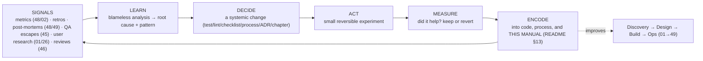

# 50 — Continuous Improvement

### The Learning Engine That Closes Every Loop

> *"A studio doesn't get great by being great once. It gets great by getting a little better, deliberately, every cycle — and by making sure it never has to learn the same lesson twice."*

---

**Chapter type:** Phase 9 — Assurance & Operations (the closing loop)
**DRI:** Software Architect + Creative Director + all discipline leads (shared)
**Depends on:** [`00-CONSTITUTION.md`](./00-CONSTITUTION.md), [`02`](./02-PRODUCT_STRATEGY.md), [`45`](./45-QA.md), [`46`](./46-CODE_REVIEW.md), [`48`](./48-MONITORING.md), [`49`](./49-MAINTENANCE.md)
**Feeds:** everything — this chapter loops back to [`01`](./01-PROJECT_DISCOVERY.md) and improves the manual itself ([`README`](./README.md))

---

## Table of Contents
1. [Purpose](#1-purpose)
2. [Philosophy](#2-philosophy)
3. [Principles](#3-principles)
4. [Best Practices](#4-best-practices)
5. [Anti-Patterns](#5-anti-patterns)
6. [Real-World Examples](#6-real-world-examples)
7. [Common Mistakes](#7-common-mistakes)
8. [AI Implementation Guidance](#8-ai-implementation-guidance)
9. [Human Review Checklist](#9-human-review-checklist)
10. [Automation Opportunities](#10-automation-opportunities)
11. [References for Further Study](#11-references-for-further-study)
12. [Review Checklist & Measurable Quality Criteria](#12-review-checklist--measurable-quality-criteria)

---

## 1. Purpose

This is the final chapter of the manual, and its purpose is to **close every loop the other 50 chapters open** — to make the studio a *learning system* that improves deliberately over time. It covers the feedback mechanisms (metrics, retrospectives, post-mortems, user research), how learnings become durable changes (to code, process, and this manual itself), and how the whole operating system evolves rather than ossifies.

Continuous improvement is the connective tissue of the entire manual: it takes signals from monitoring ([`48`](./48-MONITORING.md)), QA escapes ([`45`](./45-QA.md)), incident post-mortems ([`48`](./48-MONITORING.md)/[`49`](./49-MAINTENANCE.md)), product metrics ([`02`](./02-PRODUCT_STRATEGY.md)), and user research ([`01`](./01-PROJECT_DISCOVERY.md), [`26`](./26-USER_EXPERIENCE.md)) — and feeds them *back* into better discovery, design, engineering, and operations. It is the living embodiment of the Constitution: Article X (evidence over opinion), Article IX (small reversible steps, iterated), and the [`README`](./README.md)'s promise that this manual is a *living document* that improves through the Contribution Model. **The last chapter points back at the first.**

---

## 2. Philosophy

**A studio is a learning system or it is a decaying one — there is no steady state.** Markets move, tools change, teams turn over, and yesterday's best practice becomes today's liability. An organization that isn't deliberately getting better is, by default, getting relatively worse. Continuous improvement isn't a program you run occasionally; it's the *metabolism* of a healthy studio — the constant conversion of experience into capability. This manual itself is proof of the stance: it is explicitly a *living document* ([`README`](./README.md)), not a monument.

**Never learn the same lesson twice.** The single highest-leverage improvement practice is the **ratchet**: every incident, escaped bug, missed deadline, or dark-pattern near-miss becomes a *systemic change* — a test, a checklist item, a lint rule, a chapter amendment — so that failure mode is *closed forever*. Individual heroics fix a problem once; systemic learning fixes its entire class permanently (Article IV — systems over artifacts; [`44`](./44-TESTING.md) regression tests; [`45`](./45-QA.md) prevention). A studio's true quality is measured by how few of its mistakes recur.

**Blameless, or you learn nothing.** Improvement requires *truth*, and truth requires safety. When failure is met with blame, people hide problems, incidents go unreported, and the same rot festers in the dark. **Blameless retrospectives and post-mortems** — which ask "what about the *system* let this happen?" not "whose fault was it?" — are the only ones that surface real causes (Article X, and the studio's "critique work, not people" from [`46`](./46-CODE_REVIEW.md)). Psychological safety isn't a nicety; it's the precondition for learning.

**Measure to learn, not to judge — and improve deliberately, in small steps.** We instrument the studio's own performance (delivery, quality, reliability, well-being) to *learn where to improve*, not to rank people (which corrupts the metrics, Goodhart's Law). And improvement follows the same discipline as everything else: small, hypothesis-driven, reversible experiments (Article IX) — try a change, measure its effect, keep or revert. The studio applies the scientific method to itself (Article X), improving the *way it works* with the same rigor it applies to the products it ships.

---

## 3. Principles

### Principle 1 — Be a learning system; improvement is continuous
Deliberate, ongoing betterment is the default operating mode, not a periodic event.
> *Rationale (Art. X):* No steady state — improve or decay.

### Principle 2 — Ratchet: never learn the same lesson twice
Every failure → a systemic prevention (test/check/checklist/chapter) that closes its class.
> *Rationale (Art. IV, [`45`](./45-QA.md)):* Systems beat one-off fixes; recurrence is the real defect.

### Principle 3 — Blameless learning
Retros/post-mortems examine the *system*, never blame individuals.
> *Rationale (Art. X, [`46`](./46-CODE_REVIEW.md)):* Blame hides truth; safety surfaces it.

### Principle 4 — Close every loop back to the source
Feed learnings back to discovery/design/eng/ops — and into *this manual*.
> *Rationale ([`README`](./README.md)):* Learning that doesn't change behavior is wasted.

### Principle 5 — Measure to learn, not to judge
Instrument delivery/quality/reliability to guide improvement; don't weaponize metrics against people.
> *Rationale (Art. X, Goodhart):* Metrics-as-judgment corrupts the metrics.

### Principle 6 — Improve in small, hypothesis-driven, reversible experiments
Try → measure → keep or revert; apply the scientific method to how you work.
> *Rationale (Art. IX):* Small reversible process changes, like small reversible code changes.

### Principle 7 — The manual is a living document; contribute back
Learnings update the operating system itself via the Contribution Model.
> *Rationale ([`README`](./README.md) §13):* Knowledge in heads is a liability; encode it.

### Principle 8 — Balance improvement with delivery (and against decay)
Reserve real capacity for improvement + debt paydown; don't let "ship features" crowd out getting better.
> *Rationale (Art. VIII, [`49`](./49-MAINTENANCE.md)):* No improvement time = accumulating decay.

### Principle 9 — Evidence over opinion in improving, too
Base process changes on data + research, not the loudest voice or fashion.
> *Rationale (Art. X):* Same evidence discipline, turned inward.

---

## 4. Best Practices

### 4.1 The continuous-improvement loop (the studio's metabolism)

This loop runs continuously; the practices below are its concrete mechanisms.

### 4.2 Retrospectives (the team's learning cadence)
- **Regular cadence** (per cycle/sprint): what went well, what didn't, what to change.
- **Blameless + safe** (Principle 3); focus on systems + process, not people.
- **Action-oriented:** end with a *small number* of concrete, owned, time-boxed actions — and **review last retro's actions first** (retros that never produce change breed cynicism).
- Vary format to avoid staleness; make it safe for quiet voices to speak.

### 4.3 Blameless post-mortems (learning from incidents, [`48`](./48-MONITORING.md)/[`49`](./49-MAINTENANCE.md))
For every significant incident/escaped defect:
1. **Timeline** (what happened, when) — facts, no blame.
2. **Root cause** (the *systemic* why — often "5 whys" past the proximate cause).
3. **Impact** (users/business).
4. **Prevention** (the ratchet, Principle 2): concrete systemic changes — a regression test ([`44`](./44-TESTING.md)), a new automated check, a checklist/DoD item ([`45`](./45-QA.md)), a chapter amendment ([`README`](./README.md)) — each **owned + tracked to done**.
> The output isn't a document; it's *changes that make the class of failure impossible or self-catching*.

### 4.4 Measuring the studio (learn, don't judge — Principle 5)
| Area | Signals (examples) |
| --- | --- |
| **Delivery flow** | DORA: deploy frequency, lead time, change-fail rate, MTTR ([`47`](./47-DEPLOYMENT.md), [`48`](./48-MONITORING.md)) |
| **Quality** | escaped-defect rate (severity-weighted, [`45`](./45-QA.md)), Scorecard trend ([`README`](./README.md)), recurrence rate |
| **Reliability** | SLO attainment, incident rate/MTTR ([`48`](./48-MONITORING.md)) |
| **Product** | North Star + guardrails ([`02`](./02-PRODUCT_STRATEGY.md)), activation/retention ([`18`](./18-SAAS_DESIGN.md)) |
| **Health/DX** | build times, flaky-test rate ([`44`](./44-TESTING.md)), dependency freshness ([`49`](./49-MAINTENANCE.md)), team well-being |
Track **trends**, not absolutes; use them to *find where to improve*, never to rank individuals (Goodhart's Law — a metric that becomes a target stops being a good measure).

### 4.5 Closing the user-feedback loop ([`01`](./01-PROJECT_DISCOVERY.md), [`26`](./26-USER_EXPERIENCE.md), [`02`](./02-PRODUCT_STRATEGY.md))
Systematically route **user signals** — support tickets, research ([`01`](./01-PROJECT_DISCOVERY.md)), usability findings ([`26`](./26-USER_EXPERIENCE.md)), funnel drop-off ([`29`](./29-USER_FLOWS.md)), RUM ([`48`](./48-MONITORING.md)), reviews — into a prioritized backlog that feeds **discovery** ([`01`](./01-PROJECT_DISCOVERY.md)) and **strategy** ([`02`](./02-PRODUCT_STRATEGY.md)). The whole manual is a loop: operations (48/49) and users feed back to the *start* (01/02), and the cycle repeats. **This chapter is where the arrow returns to Chapter 1.**

### 4.6 Improving the operating system itself (Principle 7, [`README`](./README.md))
This manual is a living product ([`README`](./README.md) §12–13). Continuous improvement *includes improving the manual*:
- When a chapter's guidance is proven wrong/incomplete by experience → **amend it** (with rationale + evidence, via the Contribution Model, [`README`](./README.md) §13).
- New recurring problem with no chapter → **propose a new chapter** ([`README`](./README.md) §5 future-chapters list).
- Tooling/tech shifts → update the relevant guide + bump the version ([`README`](./README.md) §12).
- Review each chapter on cadence (≥ every 6 months) with its DRI. *The studio that wrote this manual is obligated to keep rewriting it.*

### 4.7 Kaizen + experiments (Principles 6, 9)
- **Kaizen (small continuous improvement):** everyone empowered to make + suggest small betterments constantly — improvement is everyone's job, not a committee's.
- **Process experiments:** frame changes as hypotheses ("if we cap PR size at N, review time drops"), run time-boxed, measure, keep or revert (Principle 6). Treat *how you work* as improvable with evidence (Article X).
- **Share learnings widely** (internal write-ups, brown-bags) so improvement propagates (low bus factor, [`49`](./49-MAINTENANCE.md)).

### 4.8 Protect improvement capacity (Principle 8)
Reserve *real* capacity each cycle for improvement + tech-debt paydown ([`49`](./49-MAINTENANCE.md)) — a standing allocation, not "if there's time" (there never is). A studio that spends 100% on features is spending 0% on staying able to ship features. Leadership protects this against short-term delivery pressure (Article VIII, IX).

---

## 5. Anti-Patterns

| Anti-pattern | Why it fails | Principle |
| --- | --- | --- |
| **No improvement cadence** (only firefighting) | Same problems recur; studio decays. | P1 |
| **Learning the same lesson repeatedly** | No ratchet; failures aren't systemically closed. | P2 |
| **Blame culture** on incidents/mistakes | Truth hidden; problems fester; no learning. | P3 |
| **Retros with no follow-through** | Cynicism; ritual without change. | P4 |
| **Metrics as individual judgment / stack-ranking** | Gaming, fear, corrupted data (Goodhart). | P5 |
| **Big-bang process overhauls** (not experiments) | Risky, unmeasured, often reverted painfully. | P6 |
| **Stale manual / process** never updated | Guidance drifts from reality; ignored. | P7 |
| **100% features, 0% improvement/debt** | Decay accumulates; velocity eventually collapses. | P8 |
| **Improving by fashion/loudest voice** | Cargo-cult changes; no evidence. | P9 |
| **Post-mortems as documents, not changes** | No prevention; incidents recur. | P2, P4 |
| **Hero culture** (individuals save the day, no system) | Fragile; lessons stay in one head. | P2, [`00`](./00-CONSTITUTION.md) |

---

## 6. Real-World Examples

### Example A — The ratchet that ended a recurring class of bugs
A studio kept shipping the same category of failure (unvalidated optional API fields → runtime crashes) — fixing each instance heroically, three times in a year. A **blameless post-mortem** (4.3) found the systemic cause and produced a **ratchet** (Principle 2): a boundary-validation convention ([`32`](./32-TYPESCRIPT_GUIDE.md)), a lint rule, and a Chapter-32 amendment. The class of bug *never recurred* — because the fix was systemic, not individual. *The defect wasn't the bug; it was that the bug could recur ([`45`](./45-QA.md)).*

### Example B — Blameless surfaced the real cause
An engineer's change caused an outage. In a **blame culture**, the story would be "they were careless," the engineer would be shamed, and the *actual* cause would stay hidden. In the studio's **blameless post-mortem** (Principle 3), the real system failures emerged: a missing test, a gap in the deploy smoke check ([`47`](./47-DEPLOYMENT.md)), and an alert that fired too late ([`48`](./48-MONITORING.md)). Three systemic preventions shipped. The engineer, feeling safe, surfaced *more* latent risks they'd noticed. *Safety produced truth; truth produced improvement.*

### Example C — The manual improved itself
A recurring problem (teams building the same thing without checking for references) had no chapter. Rather than a one-off reminder, the studio **added a capability to the operating system**: the reference-analysis engine and the "Any References?" protocol ([`51`](./51-REFERENCE_ANALYSIS.md), wired into [`README`](./README.md) §9.2). A new recurring need became a *permanent systemic improvement to the manual itself* (Principle 7; [`README`](./README.md) §13). *The operating system is obligated to keep improving the operating system — the arrow returns to the start.*

---

## 7. Common Mistakes

- **No regular improvement cadence** — only reactive firefighting.
- **Fixing incidents one-off** without a systemic ratchet (so they recur).
- **Blaming individuals**, driving problems underground.
- **Retrospectives that never produce (or follow through on) changes.**
- **Using metrics to judge/rank people** instead of to learn (Goodhart corruption).
- **Big-bang process changes** instead of measured experiments.
- **Never updating the manual/process** as reality changes.
- **Spending 100% on features**, leaving no room for improvement/debt.
- **Post-mortems that produce documents, not preventions.**
- **Relying on heroes** instead of building systems.

---

## 8. AI Implementation Guidance

The studio's AI agents are part of the learning system — they both *drive* improvement (analyzing signals at scale) and *are subject to* it (their patterns improve as the manual does).

### 8.1 Where agents help
- **Synthesize signals**: cluster incidents/escaped defects/support tickets/retro notes to surface *patterns and recurring root causes* humans miss.
- **Draft blameless post-mortems** (timeline, systemic root cause via 5-whys, prevention plan) — focused on systems, never people.
- **Propose ratchets**: for a given failure, the concrete regression test / lint rule / checklist item / chapter amendment that closes its class.
- **Compute + trend studio metrics** (DORA, escape rate, Scorecard) and flag regressions — as *learning signals*, never individual rankings.
- **Improve the manual**: identify stale guidance, gaps needing a new chapter, and draft amendments (with rationale) via the Contribution Model.

### 8.2 Hard rules (Art. X, IV, IX)
- The agent's analysis is **blameless** — it examines *systems/process*, never assigns individual fault (Principle 3).
- For every failure it analyzes, it proposes a **systemic ratchet** (test/check/checklist/chapter), not just a one-off fix (Principle 2).
- It treats metrics as **learning signals, not individual judgments**, and warns against Goodhart-style targeting (Principle 5).
- It frames improvements as **small, reversible, hypothesis-driven experiments** with a way to measure effect (Principle 6, Art. IX) — grounded in **evidence**, not fashion (Principle 9, Art. X).
- When experience contradicts this manual, it **proposes a chapter amendment** (with rationale/evidence) via the Contribution Model ([`README`](./README.md) §13) rather than silently diverging (Principle 7).

### 8.3 Prompt example — post-mortem + ratchet
```
ROLE: Continuous-improvement analyst, bound by 00-CONSTITUTION + 50 (+45/48).
INPUT: incident details / a set of escaped defects / retro notes.
TASK:
  1. Blameless timeline + systemic root cause (5-whys past the proximate cause) — NO individual blame.
  2. Impact (users/business).
  3. Ratchet: concrete systemic preventions that close this CLASS of failure — regression test (44),
     automated check/lint, DoD/checklist item (45), and/or a chapter amendment (README §13) — each owned + trackable.
  4. If it recurs a known pattern, propose the manual change that prevents recurrence.
OUTPUT: post-mortem + prevention plan (systemic, owned) + any proposed manual amendment (with rationale).
```

### 8.4 Prompt example — improvement analysis
```
TASK: From these studio metrics (DORA, escaped-defect rate, Scorecard trend) + retro notes, identify the
top 3 improvement opportunities. For each: the evidence, a small reversible experiment (hypothesis + how to
measure), and the systemic change if it works. Treat metrics as learning signals, not individual judgments;
flag any metric at risk of Goodhart-gaming.
```

---

## 9. Human Review Checklist

- [ ] There is a **regular improvement cadence** (retros/reviews), not just firefighting.
- [ ] Retros/post-mortems are **blameless** (systems, not people) and **produce owned, tracked actions** — with **last cycle's actions reviewed**.
- [ ] Every significant failure yields a **systemic ratchet** (test/check/checklist/chapter), so the class can't recur ([`44`](./44-TESTING.md), [`45`](./45-QA.md)).
- [ ] Studio **metrics are trended to learn**, not used to judge/rank individuals ([`48`](./48-MONITORING.md), [`02`](./02-PRODUCT_STRATEGY.md)).
- [ ] **User feedback loops** close back into discovery/strategy ([`01`](./01-PROJECT_DISCOVERY.md), [`02`](./02-PRODUCT_STRATEGY.md), [`26`](./26-USER_EXPERIENCE.md)).
- [ ] Process changes are **small, reversible, evidence-based experiments** (measured, kept or reverted).
- [ ] **Real capacity is reserved** for improvement + debt paydown ([`49`](./49-MAINTENANCE.md)) — protected from delivery pressure.
- [ ] **The manual is kept alive** — amended from experience, reviewed on cadence, versioned ([`README`](./README.md) §12–13).
- [ ] Improvement is **everyone's job** (kaizen), and learnings are **shared widely** (low bus factor).
- [ ] **No blame culture**; psychological safety is protected (the precondition for all of the above).

---

## 10. Automation Opportunities

| Task | Automation |
| --- | --- |
| Studio metrics | DORA + escape-rate + Scorecard dashboards; trend + regression alerts ([`48`](./48-MONITORING.md)). |
| Signal synthesis | LLM clustering of incidents/tickets/retros to surface recurring root causes. |
| Ratchet tracking | Link each post-mortem to its prevention items; block "closed" until preventions ship. |
| Action follow-through | Auto-carry-forward unfinished retro/post-mortem actions; report completion rate. |
| Manual freshness | Chapter review-cadence reminders (DRI); flag stale guidance ([`README`](./README.md) §12). |
| Recurrence detection | Tag defects/incidents by class; alert on recurrence of a "closed" class. |
| Experiment tracking | Register process experiments (hypothesis/metric/result) for keep-or-revert decisions. |
| Feedback routing | Auto-route user signals (support/RUM/research) into the discovery/strategy backlog ([`01`](./01-PROJECT_DISCOVERY.md)/[`02`](./02-PRODUCT_STRATEGY.md)). |

---

## 11. References for Further Study
- **Foundational:** the Toyota Production System / *kaizen* (continuous improvement); the PDCA (Plan-Do-Check-Act) / Deming cycle; the scientific method applied to work.
- **Learning organizations:** Peter Senge, *The Fifth Discipline*; Amy Edmondson on psychological safety (*The Fearless Organization*).
- **Delivery & learning:** *Accelerate* / DORA (Forsgren, Humble, Kim); Google SRE on blameless post-mortems ([`48`](./48-MONITORING.md)).
- **Retrospectives:** *Agile Retrospectives* (Derby & Larsen); the "prime directive" of blameless retros.
- **Metrics caution:** Goodhart's Law ("when a measure becomes a target, it ceases to be a good measure").
- **Cross-references:** [`00-CONSTITUTION.md`](./00-CONSTITUTION.md), [`01-PROJECT_DISCOVERY.md`](./01-PROJECT_DISCOVERY.md), [`02-PRODUCT_STRATEGY.md`](./02-PRODUCT_STRATEGY.md), [`45-QA.md`](./45-QA.md), [`46-CODE_REVIEW.md`](./46-CODE_REVIEW.md), [`48-MONITORING.md`](./48-MONITORING.md), [`49-MAINTENANCE.md`](./49-MAINTENANCE.md), and the [`README`](./README.md) governance + contribution model (§12–13).

---

## 12. Review Checklist & Measurable Quality Criteria

| Criterion | Target |
| --- | --- |
| Regular blameless retros/post-mortems held | 100% of cycles / significant incidents |
| Significant failures with a systemic prevention (ratchet) | 100% |
| Recurrence of a "closed" failure class | trend → 0 |
| Retro/post-mortem action follow-through | ≥ 90% completed |
| Metrics used for learning (not individual ranking) | 100% |
| Improvement/debt capacity reserved each cycle | Yes (protected) |
| Manual chapters reviewed on cadence + amended from experience | 100% within cadence |
| DORA + Scorecard + escape-rate trends | improving over time |
| Psychological safety (team-reported) | high |

---

## The Loop Closes

This is the 51st and final chapter of the core manual — and it deliberately points back at the first. **Operations feed learning; learning feeds discovery; discovery begins the cycle again — and the whole operating system, including this manual, keeps improving.** A studio built on these fifty chapters is not a fixed thing that was made great once; it is a *learning engine* that gets a little better, deliberately, every cycle, and never learns the same lesson twice.

> *"Systems beat individual pages. Consistency beats creativity. Every decision must be explainable. And the studio that lives by these — and keeps rewriting the rules as it learns — is the one still building world-class software a decade from now."*

---

*End of `50-CONTINUOUS_IMPROVEMENT.md`. This completes the core 51-chapter Studio Operating System.*
