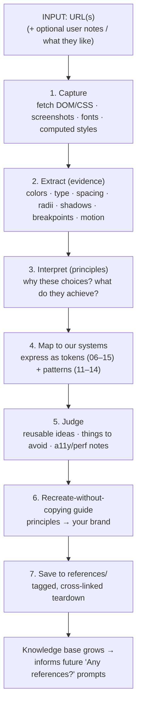
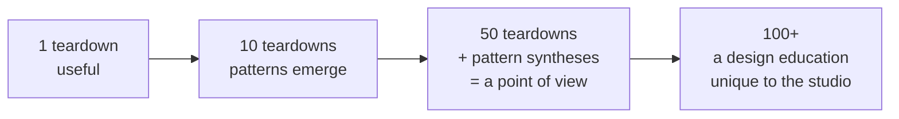
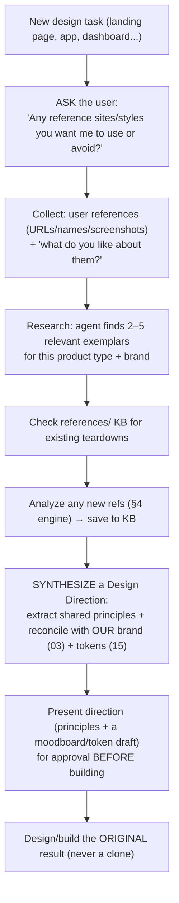
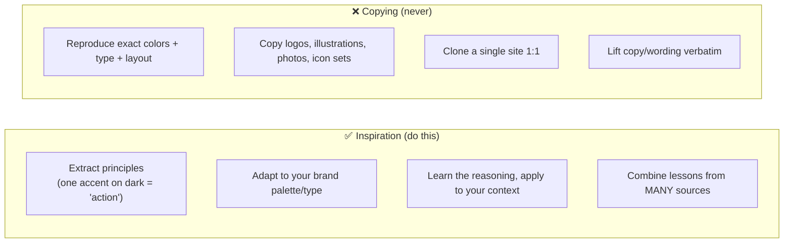

# 51 — Reference Analysis & The Style Knowledge Base

### Learning Style From the World's Best Sites — Without Copying Them

> *"Study a thousand masters, imitate none. The goal of looking at great work is not to reproduce it, but to extract the principles that made it great and make them your own."*

---

**Chapter type:** Cross-cutting capability (feeds every design chapter)
**DRI:** Creative Director + UX Researcher + AI Systems Designer (joint)
**Depends on:** [`00-CONSTITUTION.md`](./00-CONSTITUTION.md), [`03-BRAND_STRATEGY.md`](./03-BRAND_STRATEGY.md), [`04`](./04-DESIGN_PHILOSOPHY.md)–[`10`](./10-GRID_SYSTEM.md), [`15-DESIGN_TOKENS.md`](./15-DESIGN_TOKENS.md), [`23-MOTION_SYSTEM.md`](./23-MOTION_SYSTEM.md)
**Feeds:** all design + product-surface chapters; the studio's `references/` knowledge base

---

## Table of Contents
1. [Purpose](#1-purpose)
2. [Philosophy](#2-philosophy)
3. [Principles](#3-principles)
4. [The Reference-Analysis Engine](#4-the-reference-analysis-engine)
5. [The Standard Teardown (the 11 outputs)](#5-the-standard-teardown-the-11-outputs)
6. [The Knowledge Base](#6-the-knowledge-base)
7. [The "Any References?" Protocol](#7-the-any-references-protocol)
8. [Anti-Patterns & The Copying Line](#8-anti-patterns--the-copying-line)
9. [Real-World Example (worked)](#9-real-world-example-worked)
10. [AI Implementation Guidance](#10-ai-implementation-guidance)
11. [Human Review Checklist](#11-human-review-checklist)
12. [Automation Opportunities](#12-automation-opportunities)
13. [References for Further Study](#13-references-for-further-study)
14. [Review Checklist & Measurable Quality Criteria](#14-review-checklist--measurable-quality-criteria)

---

## 1. Purpose

This chapter defines a repeatable capability: **give the studio a URL (or a set of them), and produce a structured, principled teardown of that site's design language** — then save it into a growing, searchable **style knowledge base** (`references/`). Over time, after analyzing dozens or hundreds of great sites, the studio accumulates its own *taught* understanding of style: a library that turns "I like how that looks" into transferable, explainable principles.

Crucially, this capability is paired with a **workflow rule**: before designing any new surface, the studio (human or agent) *asks* whether there are references to use, gathers the user's references **plus** its own researched ones, distills them into a **design direction**, and only then designs — always producing something new, never a clone.

This is the bridge between *inspiration* (looking at great work) and *system* (the tokenized design foundations in Phases 2–3). It exists because taste is learnable when it is decomposed into principles — and because the difference between "influenced by" and "ripped off" is exactly the discipline this chapter enforces.

---

## 2. Philosophy

**Great design is legible if you know how to read it.** A world-class site is not magic; it is a set of deliberate, mostly-nameable decisions — a type scale, a restrained palette, a spacing rhythm, a motion language, an interaction grammar. Reference analysis is *reading design out loud*: naming those decisions so they can be learned, compared, and adapted. Every teardown is an exercise in Article VI (explainability) applied to someone else's work.

**Extract principles, not pixels.** The value of studying Linear or Stripe or Vercel is never their exact hex code or their specific hero. It is the *why* beneath the *what*: "one chromatic accent on a near-black canvas makes the accent mean 'action'," "hairline borders replace shadows to keep the surface quiet," "tight negative tracking on large display type reads as precision." Principles transfer; pixels don't. Copying pixels is theft and, worse, it's *shallow* — you inherit the surface without the reasoning, so it breaks the moment your context differs.

**A reference is a teacher, not a template.** We look at great work to *understand*, then we return to our own brand ([`03`](./03-BRAND_STRATEGY.md)), our own users ([`01`](./01-PROJECT_DISCOVERY.md)), and our own systems ([`06`](./06-COLOR_SYSTEM.md)–[`15`](./15-DESIGN_TOKENS.md)) and make something that is *ours*. The knowledge base is a faculty of teachers, each contributing a lesson; the final design is the student's own work, synthesized from many lessons.

**Learning compounds.** One teardown is useful; a hundred, cross-linked and tagged, become a *design education* — patterns recur, exceptions illuminate, and the studio develops a defensible, articulate point of view. This is Article IV (systems over artifacts) applied to taste itself: we build the machine that makes us better at design, not just one nice page.

---

## 3. Principles

### Principle 1 — Always principles-first
Every teardown answers *why* before *what*. A color value without its role is noise.
> *Rationale (Art. VI):* Transferable knowledge lives in the reasoning.

### Principle 2 — Structured and comparable
Every teardown uses the same template so references can be compared and searched.
> *Rationale (Art. IV, V):* Consistency makes a library, not a scrapbook.

### Principle 3 — Honest attribution and the copying line
Name the source; never reproduce its trademarks, exact assets, or wholesale look. Extract, adapt, transform (see §8).
> *Rationale (Art. III — ethics; legal):* Inspiration is legal and honorable; cloning is neither.

### Principle 4 — Evidence over impression
Ground observations in what's actually on the page (fetched DOM/CSS, measured values, screenshots), labeling inference as inference.
> *Rationale (Art. X):* "Feels premium" must decompose into observable causes.

### Principle 5 — Tie every reference back to our systems
Map findings to our token structure and chapters so a reference becomes *usable*, not just admired.
> *Rationale:* A reference that can't inform our tokens is entertainment, not knowledge.

### Principle 6 — The output is always something new
The deliverable of a reference-informed project is an *original* direction synthesized from many sources + our brand — never a single-source reproduction.
> *Rationale (Art. I, III):* We serve our user and our brand, not our envy of another site.

### Principle 7 — Ask before you assume
Before designing, ask the user for references; combine theirs with researched ones.
> *Rationale (Art. I):* The user often has taste signals we'd otherwise miss.

---

## 4. The Reference-Analysis Engine

The engine turns a URL into a saved teardown. It is a pipeline, and each stage is inspectable.



### Stage detail

| Stage | What happens | Tools |
| --- | --- | --- |
| **1. Capture** | Fetch page content/CSS; screenshot desktop + mobile; identify fonts, weights, key assets. | `fetch_page`, headless capture, font detection |
| **2. Extract** | Pull raw evidence: color values + frequency/role, type styles (family/size/weight/leading/tracking), spacing steps, radii, shadows/elevation, breakpoints, animation durations/easings. | computed-style scraping, screenshot color sampling |
| **3. Interpret** | Convert evidence to *principles*: hierarchy strategy, restraint, contrast approach, motion intent, interaction grammar. Label inference. | analysis (this chapter's lens: [`04`](./04-DESIGN_PHILOSOPHY.md), [`05`](./05-VISUAL_PSYCHOLOGY.md)) |
| **4. Map** | Re-express findings in *our* token vocabulary ([`15`](./15-DESIGN_TOKENS.md)) and component patterns ([`11`](./11-CARD_DESIGN.md)–[`14`](./14-COMPONENT_LIBRARY.md)). | token mapping |
| **5. Judge** | Separate the genuinely great (reusable) from the flawed (avoid), incl. a11y/perf audit ([`22`](./22-ACCESSIBILITY.md), [`35`](./35-PERFORMANCE.md)). | critique + automated checks |
| **6. Recreate guide** | Write the "how to get this *feeling* with your own brand" playbook. | synthesis |
| **7. Save** | Write a teardown file into `references/` using the template; tag + cross-link. | file write |

> **When automated capture isn't available**, the engine degrades gracefully: it uses fetched text/CSS, public design-analysis sources (labeled), and user-provided screenshots — always distinguishing measured from inferred (Principle 4).

---

## 5. The Standard Teardown (the 11 outputs)

Every teardown produces exactly these eleven sections (this is the contract, mirrored by `references/_TEMPLATE.md`):

1. **Design Philosophy** — the site's worldview in 3–5 sentences. What is it *for*, and what feeling does it engineer?
2. **Typography Breakdown** — families, the type scale (sizes/weights/leading/tracking), pairing strategy, how type carries hierarchy.
3. **Color Palette** — canvas/surfaces/ink/accents/semantics with roles; contrast approach; light/dark strategy.
4. **Spacing Scale** — the base unit and steps; density; rhythm; how proximity is used.
5. **Grid System** — columns, container caps, breakpoints, alignment discipline.
6. **Motion Language** — durations, easings, what animates and *why* (entrance, feedback, transitions); restraint level.
7. **Interaction Patterns** — hover/focus/press behaviors, navigation model, disclosure, notable components.
8. **UX Principles** — the usability philosophy: information density, onboarding, hierarchy of actions, clarity moves.
9. **Reusable Ideas** — the transferable lessons worth stealing *as principles* (the gold).
10. **Things to Avoid** — where it's flawed, inaccessible, slow, trendy-but-fragile, or context-specific.
11. **How to Recreate This Style Without Copying** — a principle→brand playbook that yields an *original* result.

Plus metadata (front-matter): URL, date analyzed, tags, category, one-line essence, and a "confidence: measured/inferred" note.

---

## 6. The Knowledge Base

The teardowns live in `references/` and become a compounding asset.

```
studio-os/
└── references/
    ├── README.md          # index: table of all references, tags, search tips
    ├── _TEMPLATE.md       # the 11-section teardown template (copy to start)
    ├── linear-app.md      # worked example (see §9)
    ├── <site-slug>.md     # one file per analyzed site
    └── patterns/          # (emergent) cross-reference syntheses
        ├── dark-mode-saas.md      # "what the best dark SaaS sites share"
        └── one-accent-restraint.md
```

**How it compounds:**
- **Tags** (`dark`, `saas`, `editorial`, `ecommerce`, `playful`, `minimal`, `high-density`, `motion-rich`) make the library filterable.
- **Pattern syntheses** (`references/patterns/`) emerge once several teardowns share a trait — e.g. after analyzing 8 dark SaaS sites, write "what they all do and where they differ." This is where the library stops being a list and becomes *taught style*.
- **Cross-links** connect references to our chapters (a Linear teardown links to [`06`](./06-COLOR_SYSTEM.md) restraint principles).
- **Periodic review**: stale references (site redesigned) get re-analyzed; the date/front-matter tracks freshness.



---

## 7. The "Any References?" Protocol

This is the workflow rule that makes the knowledge base *active* rather than a museum. **Before designing any new visual surface**, the studio (human or agent) runs this protocol:



**The opening question, verbatim pattern:**
> *"Before I design this, do you have any reference sites or styles you'd like me to draw from (or explicitly avoid)? Share URLs or names and, if you can, one line on what you like about each. I'll also research a few strong examples for this kind of product, analyze them, add them to our reference library, and then propose a direction that blends the best principles with your brand — as something original, not a copy."*

**Rules of the protocol:**
- The agent **always asks** (Principle 7) — even if it will also research on its own.
- User references are **weighted highest** but still filtered through our brand + the copying line (§8).
- The agent **always adds at least its own researched references** so the direction isn't narrow.
- The synthesized **Design Direction is approved before building** (small reversible step, Article IX).
- New references analyzed during a project are **saved to the KB** so the studio keeps learning.

---

## 8. Anti-Patterns & The Copying Line

The single most important boundary in this chapter: **inspiration vs. plagiarism.**



**The test (all must be true to be on the right side of the line):**
1. Would the source's team recognize their *specific* work in ours? → must be **No**.
2. Did we synthesize from **multiple** sources + our own brand? → must be **Yes**.
3. Can we explain every choice by a *principle*, not "because they did it"? → must be **Yes**.
4. Are all assets (logos, images, fonts, icons, copy) **ours or properly licensed**? → must be **Yes**.

| Anti-pattern | Why it fails |
| --- | --- |
| **Single-source cloning** | Legal/ethical risk; shallow; not yours; breaks in your context. |
| **Pixel-peeping without principles** | You copy the *what* and miss the *why*; can't adapt or defend it. |
| **Reproducing brand assets** | Trademark/copyright violation (logos, custom fonts, illustrations, photography). |
| **Copying inaccessible/slow patterns** | Great looks can hide a11y/perf failures — inherit the flaw. |
| **Trend-chasing** | Copying a fad dates instantly; principles endure. |
| **Ignoring context** | A dense trading UI's density is wrong for a marketing page. |
| **Not saving the analysis** | The learning evaporates; no compounding. |
| **Skipping the "ask" step** | Miss the user's taste signals; narrow direction. |

---

## 9. Real-World Example (worked)

A complete teardown of **Linear (linear.app)** produced by this engine lives at [`references/linear-app.md`](./references/linear-app.md). It demonstrates all 11 outputs from a live capture + corroborating research, mapped to our token system, ending in a "recreate without copying" playbook. Use it as the quality bar for every future teardown.

**Condensed essence (full version in the file):**
- **Philosophy:** darkness as a *substrate*, not a theme; the product UI is the only visual texture; quiet, precision-instrument feel.
- **Type:** custom sans, low weight band (~400–600), large display with tight negative tracking (precision signal).
- **Color:** near-black canvas + light-gray ink + **one** chromatic accent used only for action/focus (restraint = meaning).
- **Reusable idea:** "one accent on a quiet canvas makes the accent mean *act here*" → directly informs our [`06`](./06-COLOR_SYSTEM.md) restraint principle.
- **Recreate-without-copying:** adopt the *restraint + hairline-border + tight-tracking* principles with *your own* hue, typeface, and content — not their lavender, their font, or their layout.

---

## 10. AI Implementation Guidance

### 10.1 Where agents help (this is largely an agent capability)
- **Run the full engine** (§4): fetch, extract, interpret, map to tokens, judge, write the recreate guide, save to `references/`.
- **Execute the "Any References?" protocol** (§7) at the start of every design task.
- **Synthesize Design Directions** from multiple references + brand.
- **Maintain the KB:** tag, cross-link, detect emerging patterns, flag stale references for re-analysis.

### 10.2 Hard rules (Art. III, VI, X + the copying line)
- The agent **must ask for references before designing** (§7) and **must add its own researched ones**.
- Every teardown is **principles-first** and labels **measured vs. inferred** (Principle 4).
- The agent **must never output a single-source clone** and **must never reproduce trademarked assets/fonts/photos/copy**. It applies the four-part test in §8 and reports the result.
- Every teardown is **saved to `references/`** using the template and **mapped to our tokens/chapters**.
- The final design must be an **original synthesis**; the agent states which principles came from which references.

### 10.3 Prompt example — analyze a URL
```
ROLE: Reference analyst, bound by 00-CONSTITUTION + 51.
INPUT: <URL> (+ optional user note on what they like).
TASK: Run the reference-analysis engine.
  1. Capture + extract EVIDENCE (colors/type/spacing/radii/shadows/breakpoints/motion);
     label each value measured or inferred.
  2. Produce the 11-section teardown (philosophy → recreate-without-copying).
  3. Map findings to OUR tokens (15) and chapters (06–10, 23).
  4. Run the §8 four-part copying test and report PASS.
  5. Save to references/<slug>.md via _TEMPLATE.md with front-matter + tags.
OUTPUT: the teardown file + a 5-line essence summary. Do NOT reproduce brand assets or exact clones.
```

### 10.4 Prompt example — start a design task (the protocol)
```
TASK: We're about to design <surface>. Before designing:
  1. Ask me for reference sites/styles to use or avoid (+ what I like about them).
  2. Research 3–5 strong exemplars for this product type + our brand; analyze new ones (save to KB).
  3. Synthesize a Design Direction: shared principles reconciled with our brand (03) + tokens (15).
  4. Present the direction for my approval BEFORE building. State which principle came from which reference.
RULE: The result must be original (pass the §8 test), not a clone of any single reference.
```

---

## 11. Human Review Checklist

- [ ] The teardown is **principles-first** (why before what).
- [ ] All 11 outputs are present and **mapped to our tokens/chapters**.
- [ ] Observations distinguish **measured vs. inferred** evidence.
- [ ] a11y/perf flaws of the reference are **noted in "Things to Avoid."**
- [ ] The **four-part copying test** passes; no trademarked assets/fonts/photos/copy reproduced.
- [ ] The teardown is **saved to `references/`** with front-matter + tags.
- [ ] For a design task: the **"Any references?" question was asked**, user refs + researched refs combined.
- [ ] A **Design Direction** was synthesized and **approved before building**.
- [ ] The final design is an **original synthesis**, with principle-to-reference attribution.

---

## 12. Automation Opportunities

| Task | Automation |
| --- | --- |
| Capture | Headless-browser screenshotting + computed-style extraction pipeline. |
| Color/type extraction | Automated palette + font-style scraping from the live DOM. |
| Token mapping | Script converting extracted values into our token JSON draft ([`15`](./15-DESIGN_TOKENS.md)). |
| a11y/perf audit of references | Run axe + Lighthouse on the reference; auto-fill "Things to Avoid." |
| KB indexing | Auto-generate `references/README.md` table from front-matter. |
| Pattern detection | Cluster teardowns by tags/values to surface emerging pattern syntheses. |
| Staleness | Periodic re-fetch + diff to flag redesigned references. |
| Protocol enforcement | Design-task checklist bot that blocks "start building" until a direction is approved. |

---

## 13. References for Further Study
- **Learning from masters:** the long tradition of "copy to learn, then diverge" in art/design education — study of composition, not reproduction.
- **Design analysis practice:** public design-teardown and "design details" writing as a genre (study the *method*, not the content).
- **Design-token extraction tools:** the ecosystem of services that extract colors/fonts/tokens from live sites (use as capture aids; always apply the copying line).
- **IP & fair use basics:** trademark/copyright fundamentals distinguishing ideas (not protected) from specific expression/assets (protected). Consult counsel for edge cases.
- **Cross-references:** [`03-BRAND_STRATEGY.md`](./03-BRAND_STRATEGY.md), [`04-DESIGN_PHILOSOPHY.md`](./04-DESIGN_PHILOSOPHY.md), [`06-COLOR_SYSTEM.md`](./06-COLOR_SYSTEM.md), [`15-DESIGN_TOKENS.md`](./15-DESIGN_TOKENS.md), [`23-MOTION_SYSTEM.md`](./23-MOTION_SYSTEM.md), and the live [`references/`](./references/README.md) knowledge base.

---

## 14. Review Checklist & Measurable Quality Criteria

| Criterion | Target |
| --- | --- |
| Teardowns using the standard 11-output template | 100% |
| Teardowns that are principles-first (not value dumps) | 100% |
| Teardowns passing the four-part copying test | 100% |
| Design tasks that ran the "Any references?" protocol | 100% |
| Design directions approved before building | 100% |
| References mapped to our tokens/chapters | 100% |
| Trademarked assets/fonts reproduced | 0 |
| Knowledge base growth | steady ↑ (target: pattern synthesis at every ~10 refs) |

---

*End of `51-REFERENCE_ANALYSIS.md`. The living knowledge base lives in [`references/`](./references/README.md).*
