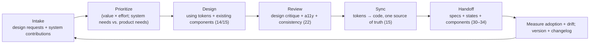
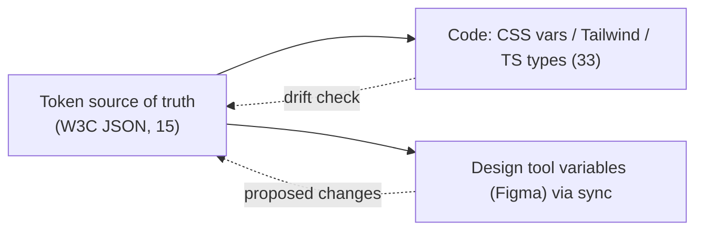
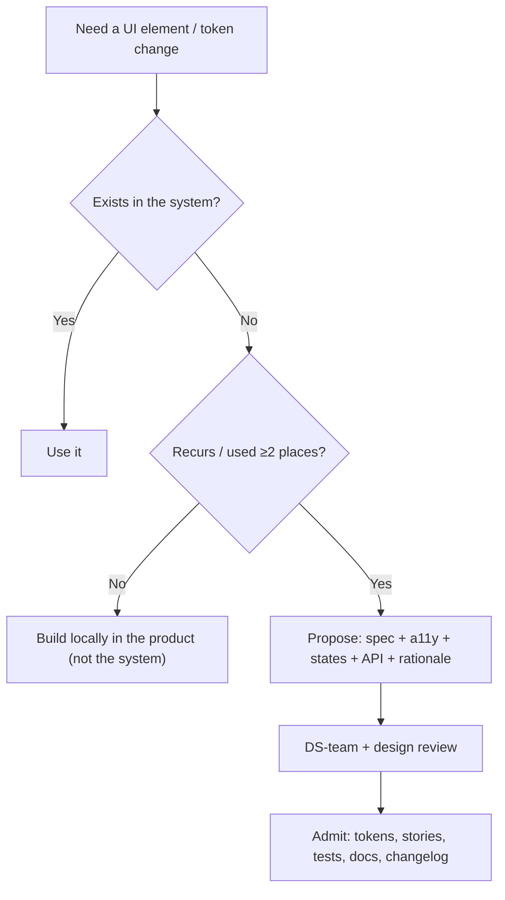

# 52 — Design Operations (DesignOps)

### Scaling Design as a Repeatable, Governed System

> *"A design system is not a Figma file and a component library that drift apart by Friday. DesignOps is the machinery that keeps design, code, and decisions in sync — so the studio's craft scales past the people who started it."*

---

**Chapter type:** Extended Capability (Systems & Operations)
**DRI:** Design Systems Engineer + Creative Director (joint)
**Depends on:** [`00-CONSTITUTION.md`](./00-CONSTITUTION.md), [`14`](./14-COMPONENT_LIBRARY.md), [`15`](./15-DESIGN_TOKENS.md), [`46`](./46-CODE_REVIEW.md), [`50`](./50-CONTINUOUS_IMPROVEMENT.md)
**Feeds:** the whole design half (04–29) and its handoff to engineering (30–34)

---

## Table of Contents
1. [Purpose](#1-purpose)
2. [Philosophy](#2-philosophy)
3. [Principles](#3-principles)
4. [Best Practices](#4-best-practices)
5. [Anti-Patterns](#5-anti-patterns)
6. [Real-World Examples](#6-real-world-examples)
7. [Common Mistakes](#7-common-mistakes)
8. [AI Implementation Guidance](#8-ai-implementation-guidance)
9. [Human Review Checklist](#9-human-review-checklist)
10. [Automation Opportunities](#10-automation-opportunities)
11. [References for Further Study](#11-references-for-further-study)
12. [Review Checklist & Measurable Quality Criteria](#12-review-checklist--measurable-quality-criteria)

---

## 1. Purpose

This chapter defines **DesignOps** — the operational discipline that lets design scale: how the design system is governed and versioned, how design and code stay in sync (design tokens as the bridge, [`15`](./15-DESIGN_TOKENS.md)), how design work is intake/prioritized/reviewed, how handoff to engineering works, and how design decisions are documented and kept consistent across a growing team (human + AI).

Where the design-foundation chapters ([`04`](./04-DESIGN_PHILOSOPHY.md)–[`15`](./15-DESIGN_TOKENS.md)) define *what good design is*, DesignOps defines *how the studio produces good design repeatably at scale* — the design-side equivalent of what code architecture ([`41`](./41-CODE_ARCHITECTURE.md)), review ([`46`](./46-CODE_REVIEW.md)), and continuous improvement ([`50`](./50-CONTINUOUS_IMPROVEMENT.md)) do for engineering. It operationalizes Article IV (systems over artifacts) and Article V (consistency) at the level of the *design organization itself*.

---

## 2. Philosophy

**The design system is a product with users — the whole team.** A design system isn't a deliverable you make once; it's a *living product* whose users are designers and engineers, with a roadmap, versioning, docs, support, and a team that owns it ([`14`](./14-COMPONENT_LIBRARY.md), [`15`](./15-DESIGN_TOKENS.md)). Treated as a one-off artifact, it decays: Figma and code drift apart, components fork, and within months everyone works around it. Treated as a *product*, it compounds — the single largest multiplier of a design team's output (Article IV).

**Design and code must share one source of truth, or they will diverge.** The most common DesignOps failure is the gap between the design tool and the codebase — a token changed in Figma but not in code, a component redesigned in one place. The only durable fix is a **single source of truth** (design tokens, [`15`](./15-DESIGN_TOKENS.md)) that flows *bidirectionally* between design and code, so a change in one is a change in both. DesignOps is largely the work of closing that gap and keeping it closed.

**Governance is what keeps a system a system.** Without a clear process for *who can add/change what, how, and when*, a design system either ossifies (nobody can change it, so people route around it) or fragments (everybody changes it, so it's inconsistent). DesignOps provides governance: a contribution model, an admission bar, versioning, and clear ownership (DRIs) — the same governance the [`README`](./README.md) applies to this manual, applied to the design system (Article XII — change deliberately, loudly).

**Operations exist to remove friction, not add process.** DesignOps done badly becomes bureaucracy — approvals, meetings, and process that slow everyone down. Done well, it *removes* friction: designers spend time designing (not re-deciding solved problems or hunting for the right component), handoff is smooth, and consistency is automatic. Every piece of process must justify itself by removing more friction than it adds (Article VIII).

---

## 3. Principles

### Principle 1 — Treat the design system as a governed, versioned product
Roadmap, ownership (DRIs), versioning, changelog, docs, support ([`14`](./14-COMPONENT_LIBRARY.md), [`15`](./15-DESIGN_TOKENS.md)).
> *Rationale (Art. IV):* Systems that aren't tended decay.

### Principle 2 — One source of truth; design ↔ code stay in sync
Design tokens bridge tool and code; a change in one propagates to the other.
> *Rationale ([`15`](./15-DESIGN_TOKENS.md)):* The design-code gap is the #1 DesignOps failure.

### Principle 3 — Clear contribution model + admission bar
A defined path to propose/add/change; components admitted only when they meet the bar ([`14`](./14-COMPONENT_LIBRARY.md)).
> *Rationale (Art. XII):* Governance prevents ossification *and* fragmentation.

### Principle 4 — Documented, discoverable design decisions
Usage guidance, do/don'ts, rationale (design ADRs) — findable by humans + agents.
> *Rationale (Art. VI):* Undocumented systems get misused + reinvented.

### Principle 5 — Smooth, low-friction handoff to engineering
Design→code handoff via shared tokens/components, specs, and states — not pixel guessing.
> *Rationale ([`30`](./30-REACT_GUIDE.md)–[`34`](./34-FRAMER_MOTION_GUIDE.md)):* Handoff friction is where quality leaks.

### Principle 6 — Operations remove friction, not add process
Every process earns its place by net-reducing friction; automate the repeatable.
> *Rationale (Art. VIII):* DesignOps ≠ bureaucracy.

### Principle 7 — Consistency is measured + enforced, not hoped for
Track adoption/drift; lint against off-system values ([`06`](./06-COLOR_SYSTEM.md), [`08`](./08-SPACING_SYSTEM.md), [`33`](./33-TAILWIND_GUIDE.md)).
> *Rationale (Art. V):* Discipline that can be automated should be.

### Principle 8 — The design system evolves via continuous improvement
Feedback → versioned changes → measured adoption ([`50`](./50-CONTINUOUS_IMPROVEMENT.md)).
> *Rationale ([`50`](./50-CONTINUOUS_IMPROVEMENT.md)):* A frozen system drifts from reality.

---

## 4. Best Practices

### 4.1 The DesignOps loop


### 4.2 The design system as a product ([`14`](./14-COMPONENT_LIBRARY.md), [`15`](./15-DESIGN_TOKENS.md))
- **Ownership:** a design-system team/DRI(s) accountable for tokens, components, docs, and adoption.
- **Roadmap + versioning:** SemVer, changelog, deprecation path, migration guides/codemods ([`14`](./14-COMPONENT_LIBRARY.md) §4.7).
- **Docs site:** the component library's docs (props, states, do/don'ts, a11y notes) *is* the system's UI ([`14`](./14-COMPONENT_LIBRARY.md)).
- **Support:** a channel for questions/requests; treat consumers (designers/engineers) as customers.

### 4.3 Design-token pipeline as the design↔code bridge ([`15`](./15-DESIGN_TOKENS.md))
The token system is where DesignOps is won: one source of truth generating CSS/Tailwind/TS *and* feeding the design tool.

Two-way sync (or a clear one-way authority with tooling) keeps Figma variables and code tokens identical. **Contrast + naming validated in the pipeline** ([`15`](./15-DESIGN_TOKENS.md), [`06`](./06-COLOR_SYSTEM.md)).

### 4.4 Contribution model + admission bar ([`14`](./14-COMPONENT_LIBRARY.md) §4.8, [`README`](./README.md) §13)

The bar (from [`14`](./14-COMPONENT_LIBRARY.md)): tokenized, accessible, all states, typed API, documented, tested — *or it doesn't enter the system.*

### 4.5 Design reviews & critique (the design-side of [`46`](./46-CODE_REVIEW.md))
Regular **design critique** — blameless ("critique the work, not the person"), against the studio's design principles ([`04`](./04-DESIGN_PHILOSOPHY.md)–[`10`](./10-GRID_SYSTEM.md)) + the Human Review Checklists in the design chapters + the a11y floor ([`22`](./22-ACCESSIBILITY.md)). Distinguish blocking (floor breach, off-system) from suggestion, exactly as in code review ([`46`](./46-CODE_REVIEW.md)).

### 4.6 Handoff to engineering ([`30`](./30-REACT_GUIDE.md)–[`34`](./34-FRAMER_MOTION_GUIDE.md))
Handoff is smooth *because the system is shared*, not because of a big spec doc:
- Designers compose from the **same components/tokens** engineers build from → most handoff is "use component X with these props."
- Specs cover **all states** (empty/loading/error/edge, [`04`](./04-DESIGN_PHILOSOPHY.md) P6), motion intent ([`23`](./23-MOTION_SYSTEM.md)), responsive behavior ([`21`](./21-RESPONSIVE_DESIGN.md)), and a11y notes ([`22`](./22-ACCESSIBILITY.md)).
- Design ↔ eng review *together* early (feasibility + edge cases), à la [`28`](./28-WIREFRAMING.md).

### 4.7 Measure adoption + drift (Principle 7, [`50`](./50-CONTINUOUS_IMPROVEMENT.md))
Track: **% of UI using system components** (vs. one-offs), **off-token values** in code ([`06`](./06-COLOR_SYSTEM.md)/[`08`](./08-SPACING_SYSTEM.md)/[`33`](./33-TAILWIND_GUIDE.md) lints), component **usage/health**, and design↔code **token drift**. Rising drift or falling adoption = the system is losing — act via the improvement loop ([`50`](./50-CONTINUOUS_IMPROVEMENT.md)).

### 4.8 Keep DesignOps lean (Principle 6)
Automate the repeatable (token pipeline, lints, doc generation, drift checks); reserve process for genuine governance decisions. Kill any ritual that adds more friction than it removes. The measure of DesignOps is *designers spending more time designing.*

---

## 5. Anti-Patterns

| Anti-pattern | Why it fails | Principle |
| --- | --- | --- |
| **Design system as a one-off artifact** | Decays; Figma/code drift; components fork. | P1 |
| **No design↔code source of truth** | Tokens/components diverge; endless re-sync. | P2 |
| **No governance** (anyone changes anything) | Fragmentation + inconsistency. | P3 |
| **No governance the other way** (nobody can change it) | Ossifies; people route around it. | P3 |
| **Undocumented components/decisions** | Misused; reinvented; distrusted. | P4 |
| **Pixel-perfect-spec handoff** (no shared system) | Guesswork; quality leaks; slow. | P5 |
| **DesignOps as bureaucracy** (process for its own sake) | Slows everyone; resented. | P6 |
| **Hoping for consistency** (no measurement/lint) | Drift accumulates invisibly. | P7 |
| **Frozen system** never versioned/improved | Drifts from real product needs. | P8 |
| **DS team disconnected from product teams** | Builds unused components; misses real needs. | P1, P8 |

---

## 6. Real-World Examples

### Example A — The Figma/code gap that a token pipeline closed
A team maintained colors/spacing in Figma *and* separately in code; every rebrand or tweak meant manually re-syncing both, and they always drifted (a "gray-600" that meant two different values). Introducing a **design-token source of truth** ([`15`](./15-DESIGN_TOKENS.md)) that generated code tokens *and* synced Figma variables closed the gap: one change, both places, contrast auto-validated. *DesignOps is largely the work of closing the design-code gap (Principle 2).*

### Example B — Governance saved a fragmenting system
As the team grew, three "Button" variants appeared (one per squad), the token set ballooned with near-duplicates, and consistency collapsed. A **contribution model + admission bar** ([`14`](./14-COMPONENT_LIBRARY.md) §4.8) plus a DS-team DRI restored order: one Button, a clear path to propose changes, and lints banning off-system values. The system became a system again (Principle 3, 7). *Without governance, a design system fragments by default.*

### Example C — Lean ops, not bureaucracy
A well-meaning DesignOps push added approval meetings for every design change — and designers revolted (it slowed everything). Refocusing on **removing friction** (Principle 6) — automating the token pipeline, lints, and doc generation; reserving human governance only for *new system components* — sped everyone up. *DesignOps exists to remove friction, not add process (Article VIII).*

---

## 7. Common Mistakes

- **Building a design system once** and not maintaining it as a product.
- **No single source of truth** between design tool and code (guaranteed drift).
- **Missing governance** (fragmentation) or **too much** (ossification).
- **Undocumented components/tokens/decisions.**
- **Handoff via heavy specs** instead of a shared component/token system.
- **DesignOps as process/bureaucracy** instead of friction-removal.
- **Not measuring** adoption/drift (consistency by hope).
- **A DS team isolated** from the product teams it serves.

---

## 8. AI Implementation Guidance

### 8.1 Where agents help
- **Build + maintain the token pipeline** and design↔code sync ([`15`](./15-DESIGN_TOKENS.md)); detect + report drift.
- **Enforce consistency**: lint off-system colors/spacing/type ([`06`](./06-COLOR_SYSTEM.md)/[`08`](./08-SPACING_SYSTEM.md)/[`33`](./33-TAILWIND_GUIDE.md)); flag one-off components.
- **Generate/update docs** (props, states, do/don'ts, a11y) from components ([`14`](./14-COMPONENT_LIBRARY.md)).
- **Draft design ADRs** and changelog/migration guides for system changes.
- **Report adoption/drift metrics** to the improvement loop ([`50`](./50-CONTINUOUS_IMPROVEMENT.md)).

### 8.2 Hard rules (Art. IV, V, VI, VIII)
- The agent treats **tokens/components as one source of truth**; it never introduces a design value outside the token system or a component that duplicates an existing one ([`14`](./14-COMPONENT_LIBRARY.md)/[`15`](./15-DESIGN_TOKENS.md)).
- New system components/tokens must meet the **admission bar** (tokenized, accessible, all states, typed, documented, tested) — otherwise it builds locally, not in the system.
- It **documents decisions** (usage + rationale) and updates **changelog/migration** on changes (Art. VI, XII).
- It **automates consistency** (lints, drift checks) rather than relying on discipline, and proposes process only when it **net-removes friction** (Art. VIII).
- It surfaces **adoption/drift** as improvement signals, not individual judgments ([`50`](./50-CONTINUOUS_IMPROVEMENT.md)).

### 8.3 Prompt example — set up the design↔code bridge
```
ROLE: Design Systems Engineer, bound by 00-CONSTITUTION + 52 (+14/15/33/22).
TASK: Establish the DesignOps token pipeline + governance for <product>.
CONSTRAINTS:
  - One token source of truth (15) → generate CSS vars + Tailwind theme + TS types; sync Figma variables.
  - Validate contrast + naming in the pipeline (06/15).
  - Consistency lints: ban off-token color/spacing/type + one-off components (06/08/33/14).
  - Contribution model + admission bar (14 §4.8); changelog + migration on changes.
  - Adoption/drift metrics wired to the improvement loop (50).
OUTPUT: pipeline config + lint rules + contribution/admission doc + metrics plan. Keep process lean (net friction-reducing).
```

### 8.4 Prompt example — audit DesignOps health
```
TASK: Audit DesignOps: design↔code token drift, off-system values in code, duplicate/one-off components,
undocumented components/decisions, missing governance (or excessive process), and adoption trend.
Output {issue, impact, fix}, prioritizing source-of-truth drift + consistency. Flag any bureaucracy that
adds more friction than it removes.
```

---

## 9. Human Review Checklist

- [ ] The design system is treated as a **governed, versioned product** (DRIs, roadmap, changelog, docs).
- [ ] **One source of truth**; design tool + code tokens are **in sync** (drift checked) ([`15`](./15-DESIGN_TOKENS.md)).
- [ ] A **contribution model + admission bar** exists; new components meet it or live locally ([`14`](./14-COMPONENT_LIBRARY.md)).
- [ ] Components/tokens/decisions are **documented + discoverable** (usage, do/don'ts, rationale).
- [ ] **Handoff is smooth** (shared components/tokens + all-states specs), not pixel-guessing.
- [ ] **Consistency is measured + lint-enforced** (adoption %, off-token drift) — not hoped for.
- [ ] **Design critique** happens, blameless, against principles + the a11y floor ([`22`](./22-ACCESSIBILITY.md), [`46`](./46-CODE_REVIEW.md)).
- [ ] The system **evolves** via the improvement loop (versioned changes + measured adoption, [`50`](./50-CONTINUOUS_IMPROVEMENT.md)).
- [ ] DesignOps **removes more friction than it adds** (no bureaucracy).
- [ ] The DS team is **connected to product teams** (builds what's actually needed).

---

## 10. Automation Opportunities

| Task | Automation |
| --- | --- |
| Token sync | Style Dictionary + Figma-variable sync; CI fails on design↔code drift ([`15`](./15-DESIGN_TOKENS.md)). |
| Consistency lints | Ban off-token color/spacing/type + arbitrary values ([`06`](./06-COLOR_SYSTEM.md)/[`08`](./08-SPACING_SYSTEM.md)/[`33`](./33-TAILWIND_GUIDE.md)). |
| Component adoption | Usage analytics (which components used where); one-off detection ([`14`](./14-COMPONENT_LIBRARY.md)). |
| Docs generation | Auto-generate component docs (props/states) from source. |
| Contrast/naming validation | In the token pipeline ([`06`](./06-COLOR_SYSTEM.md), [`15`](./15-DESIGN_TOKENS.md)). |
| Change safety | Public-API/token diff + required changelog + codemod on breaking changes. |
| Adoption/drift dashboards | Trend adoption + drift for the improvement loop ([`50`](./50-CONTINUOUS_IMPROVEMENT.md)). |

---

## 11. References for Further Study
- **DesignOps practice:** the DesignOps discipline literature (NN/g DesignOps articles; the "Design Systems" field — Alla Kholmatova, *Design Systems*).
- **Tokens & sync:** W3C Design Tokens format; Style Dictionary; Tokens Studio (Figma) ([`15`](./15-DESIGN_TOKENS.md)).
- **Governance:** public design-system governance/contribution models (major tech companies) as reference patterns; the [`README`](./README.md) governance model (§12–13).
- **Scaling design:** *Design Systems Handbook* (InVision) and practitioner writing on running a design system as a product.
- **Cross-references:** [`14-COMPONENT_LIBRARY.md`](./14-COMPONENT_LIBRARY.md), [`15-DESIGN_TOKENS.md`](./15-DESIGN_TOKENS.md), [`22-ACCESSIBILITY.md`](./22-ACCESSIBILITY.md), [`33-TAILWIND_GUIDE.md`](./33-TAILWIND_GUIDE.md), [`46-CODE_REVIEW.md`](./46-CODE_REVIEW.md), [`50-CONTINUOUS_IMPROVEMENT.md`](./50-CONTINUOUS_IMPROVEMENT.md).

---

## 12. Review Checklist & Measurable Quality Criteria

| Criterion | Target |
| --- | --- |
| Design↔code token drift | 0 (CI-checked) |
| UI built from system components (vs. one-offs) | ≥ 90% |
| Off-token values in code | ~0 (linted) |
| System components meeting the admission bar | 100% |
| Components with current docs | 100% |
| Design-system versioned + changelogged | Yes |
| Design-system adoption trend | ↑ |
| Designer time spent designing (vs. re-deciding/hunting) | ↑ |

---

*End of `52-DESIGN_OPS.md`.*
