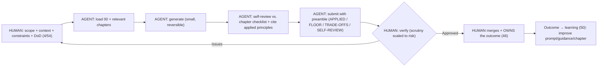
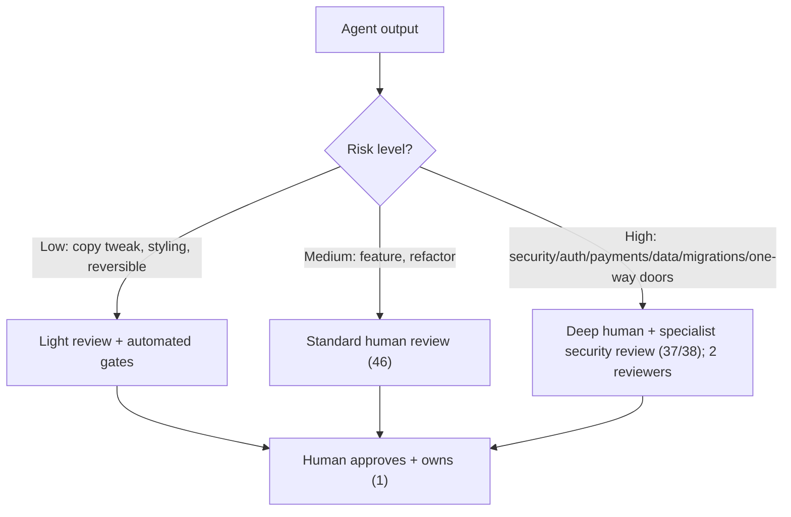

# 53 — AI Collaboration Protocol

### How Humans and AI Agents Build Together, Accountably

> *"AI is the fastest teammate you'll ever have — and the one most able to be confidently wrong at scale. The protocol is what turns raw speed into trustworthy output: clear scope in, cited work out, a human who owns the result."*

---

**Chapter type:** Extended Capability (Operations & Governance)
**DRI:** AI Systems Designer + Software Architect (joint)
**Depends on:** [`00-CONSTITUTION.md`](./00-CONSTITUTION.md) (esp. Article XI — the Human–AI Compact), [`46`](./46-CODE_REVIEW.md), [`50`](./50-CONTINUOUS_IMPROVEMENT.md)
**Feeds:** every chapter (each has AI Implementation Guidance); [`54-PROMPT_ENGINEERING.md`](./54-PROMPT_ENGINEERING.md)

---

## Table of Contents
1. [Purpose](#1-purpose)
2. [Philosophy](#2-philosophy)
3. [Principles](#3-principles)
4. [Best Practices](#4-best-practices)
5. [Anti-Patterns](#5-anti-patterns)
6. [Real-World Examples](#6-real-world-examples)
7. [Common Mistakes](#7-common-mistakes)
8. [AI Implementation Guidance](#8-ai-implementation-guidance)
9. [Human Review Checklist](#9-human-review-checklist)
10. [Automation Opportunities](#10-automation-opportunities)
11. [References for Further Study](#11-references-for-further-study)
12. [Review Checklist & Measurable Quality Criteria](#12-review-checklist--measurable-quality-criteria)

---

## 1. Purpose

This chapter defines the **operating protocol for human–AI collaboration** across the studio — the concrete workflow that makes Constitution **Article XI (the Human–AI Compact)** real: how agents are scoped and given context, how they cite and self-review their work, how humans stay accountable, how multiple agents coordinate, and how trust in agent output is calibrated (not assumed, not dismissed).

Every chapter in this manual already contains an **AI Implementation Guidance** section (topic-specific rules) and a **Human Review Checklist** (the human gate). This chapter is the *connective protocol* that ties them together into one coherent way of working — the studio's answer to "how, exactly, do humans and AI build together without either the speed being wasted or the accountability being lost?" It is the meta-workflow beneath [`54-PROMPT_ENGINEERING.md`](./54-PROMPT_ENGINEERING.md) (the craft of instruction) and beneath every chapter's agent rules.

---

## 2. Philosophy

**AI proposes; humans dispose — and a human owns every merged outcome.** This is Article XI, and it is the non-negotiable spine of the protocol. Agents generate, draft, refactor, and analyze at superhuman speed and scale; but *a human is accountable* for every decision that reaches users. This isn't distrust of AI — it's the recognition that **accountability cannot be delegated to a system that can't be held responsible.** The human is the one who answers for the outcome, so the human decides.

**Amplification cuts both ways: AI multiplies mistakes as fast as good work.** The same capability that lets an agent ship a well-typed, tested feature in ten minutes lets it ship a subtle security hole, a hallucinated fact, or an inaccessible pattern just as fast — and *plausibly*, which is worse (it *looks* right). Speed without a verification gate is how one wrong assumption becomes a hundred wrong files. The protocol exists to capture the amplification of *good* work while catching the amplification of *bad* work before it ships (Article XI, [`46`](./46-CODE_REVIEW.md)).

**Garbage in, garbage out — a vague prompt is a human failure.** Agents only know what they're given. When an agent produces off-target work, the cause is usually *missing scope, context, or constraints* — a human failure, not an agent failure (Article XI). The human's core responsibility is to supply clear scope, relevant context (which chapters apply), explicit constraints (the floor, budgets, conventions), and a concrete definition of done. The quality of what comes out is largely set by the quality of what goes in ([`54`](./54-PROMPT_ENGINEERING.md)).

**Trust is calibrated, cited, and verified — never assumed or dismissed.** The two failure modes are equal and opposite: **over-trust** (rubber-stamping agent output because it looks good) and **under-trust** (ignoring AI's real leverage). The protocol threads between them: agents must **cite** what they applied and **self-review** against the relevant checklist; humans **verify** rather than assume (trust but verify), scaling scrutiny to *risk* (a copy tweak vs. an auth change). Confidence is earned through traceability and verification, not vibes (Article X, XI).

---

## 3. Principles

### Principle 1 — AI proposes; a human disposes and owns the outcome
Every merged, user-affecting decision has an accountable human ([`46`](./46-CODE_REVIEW.md)).
> *Rationale (Art. XI):* Accountability can't be delegated to a non-responsible system.

### Principle 2 — Constitution-first; cite what was applied
Agents load [`00`](./00-CONSTITUTION.md) + relevant chapters and state which principles/chapters they used.
> *Rationale (Art. VI, XI):* Traceability enables review + trust.

### Principle 3 — Self-review before submission; report it
Agents run the target chapter's Human Review Checklist on their own output and report pass/fail.
> *Rationale ([`00`](./00-CONSTITUTION.md) §9):* Catch the obvious before a human looks.

### Principle 4 — Humans supply scope, context, constraints, and a definition of done
A vague prompt is a human failure; clear inputs are the human's job ([`54`](./54-PROMPT_ENGINEERING.md)).
> *Rationale (Art. XI):* Agents know only what they're given.

### Principle 5 — Neither may bypass the floor
No agent auto-merges past a quality gate; no human waives the floor to hit a date ([`00`](./00-CONSTITUTION.md) Art. III).
> *Rationale (Art. III, XI):* The floor is above both.

### Principle 6 — Calibrate scrutiny to risk (trust, but verify)
Light-touch review for low-risk, reversible work; deep human review for the floor, security, data, one-way doors.
> *Rationale (Art. II, IX):* Spend verification where the stakes are.

### Principle 7 — Surface trade-offs and gaps; never fabricate
Agents flag conflicts (Art. XII), say "I don't know / no evidence," and never invent facts/data/citations.
> *Rationale (Art. X):* Hallucination is the defining AI risk.

### Principle 8 — Small, reversible, reviewable agent steps
Prefer incremental, verifiable changes over large opaque ones ([`46`](./46-CODE_REVIEW.md), Art. IX).
> *Rationale (Art. IX):* Reviewability + easy rollback bound the risk.

### Principle 9 — Learn from agent outcomes; improve the protocol + prompts
Feed errors/successes back into better guidance, prompts, and chapters ([`50`](./50-CONTINUOUS_IMPROVEMENT.md)).
> *Rationale ([`50`](./50-CONTINUOUS_IMPROVEMENT.md)):* The collaboration itself is a learning system.

---

## 4. Best Practices

### 4.1 The collaboration loop (Article XI, operationalized)


### 4.2 The human's inputs (the "dispose"-enabler)
A good delegation includes (this is the [`54`](./54-PROMPT_ENGINEERING.md) scaffold, applied):
- **Role** (which specialist the agent is acting as).
- **Scope** (the specific, bounded deliverable — not "build the app").
- **Context** (which chapters apply; relevant code/design/data; the user outcome served, Art. I).
- **Constraints** (the floor: a11y AA/security/data-safety; budgets [`35`](./35-PERFORMANCE.md); conventions [`42`](./42-FOLDER_STRUCTURE.md)/[`43`](./43-CLEAN_CODE.md)).
- **Definition of Done** (tied to the chapter's Human Review Checklist + measurable evidence).
- **Output format** (files/diff/doc) and a request to **self-review + report**.
> A vague prompt → off-target output is the human's failure to fix, not the agent's (Principle 4).

### 4.3 The agent's output preamble (from [`00`](./00-CONSTITUTION.md) §8.3)
Every substantive agent deliverable starts with a traceable preamble:
```
APPLIED: Articles I, III, XI · Chapters 22 (a11y), 32 (TS), 37 (security)
FLOOR CHECK: security ✓ (authZ + input validated) · a11y ✓ (keyboard + labels) · data-safety ✓
TRADE-OFFS: chose server-render over client for SEO (36) — noted; needs human confirm
SELF-REVIEW: 11/12 checklist items pass; item 9 (perf budget) UNVERIFIED — human must run Lighthouse
GAPS/UNCERTAINTY: no evidence provided for assumption X — flagged, not fabricated
```
This makes the work **reviewable + calibratable** — the human sees exactly what to verify (Principles 2, 3, 7).

### 4.4 Risk-calibrated review (Principle 6, [`46`](./46-CODE_REVIEW.md))

Never skip the human *owner* — but scale the *depth* to the stakes (Article II/IX). Floor-touching + one-way-door work always gets deep review.

### 4.5 Handling hallucination + uncertainty (Principle 7, Art. X)
- Agents must **distinguish fact from inference** and label inference (as in [`01`](./01-PROJECT_DISCOVERY.md) synthesis rules).
- Agents must say **"I don't know" / "no evidence for X — recommend verifying"** rather than confabulate.
- **Never fabricate** facts, data, metrics, quotes, citations, or API behavior — a hard rule across the manual ([`01`](./01-PROJECT_DISCOVERY.md), [`02`](./02-PRODUCT_STRATEGY.md), [`17`](./17-LANDING_PAGE_DESIGN.md), [`36`](./36-SEO.md)).
- Humans **verify factual/technical claims**, especially anything load-bearing (API contracts, security, data).

### 4.6 The conflict-resolution protocol (from [`00`](./00-CONSTITUTION.md) §8.2)
When a requirement conflicts with a principle, the agent does **not** silently choose — it surfaces the conflict, names the Article, offers options with costs, recommends per the Quality Hierarchy (Art. II), and **awaits a human decision** (Art. XII). Loud, not silent.

### 4.7 Multi-agent coordination (specialists + orchestration)
When multiple agents collaborate (e.g. a designer-agent + engineer-agent + reviewer-agent):
- **Clear role boundaries** (each acts as one specialist) and a **defined handoff contract** (what one produces is what the next consumes) — mirroring code architecture's boundaries ([`41`](./41-CODE_ARCHITECTURE.md)).
- **A reviewer agent may critique, but a *human* still disposes** (Principle 1) — an agent reviewing another agent is *advisory*, never the final gate ([`46`](./46-CODE_REVIEW.md) §8).
- **Shared source of truth** (this manual + the codebase/tokens) so agents don't diverge.
- **One accountable human** for the overall outcome, even across many agents.

### 4.8 Feed outcomes back (Principle 9, [`50`](./50-CONTINUOUS_IMPROVEMENT.md))
When an agent errs, it's usually a **prompt/guidance gap** — fix it *systemically* (the ratchet, [`50`](./50-CONTINUOUS_IMPROVEMENT.md)): improve the delegating prompt/scaffold ([`54`](./54-PROMPT_ENGINEERING.md)), tighten a chapter's AI Implementation Guidance, or add an automated check. When it excels, capture the effective pattern. The human–AI collaboration is itself a learning system.

---

## 5. Anti-Patterns

| Anti-pattern | Why it fails | Principle |
| --- | --- | --- |
| **Auto-merging AI output** (no human owner) | Amplifies mistakes; no accountability. | P1, Art. XI |
| **Rubber-stamping** ("AI wrote it, must be fine") | Over-trust; plausible bugs ship. | P1, P6 |
| **Dismissing AI entirely** (fear/pride) | Wastes real leverage. | (balance) |
| **Vague prompts** then blaming the agent | Human failure disguised as AI failure. | P4 |
| **No citation/self-review** from the agent | Un-reviewable; un-calibratable. | P2, P3 |
| **Uniform review** (deep-review everything or nothing) | Wastes effort / misses high-risk. | P6 |
| **Trusting agent facts uncritically** | Hallucinated facts/data/citations ship. | P7, Art. X |
| **Agent silently resolving conflicts** | Hidden trade-offs against principles. | P6/§4.6, Art. XII |
| **Agent-approves-agent as final gate** | No human accountability. | P1, P7 |
| **Huge opaque agent changes** | Un-reviewable; risky. | P8 |
| **Not learning from agent errors** | Same mistakes recur; prompts stay bad. | P9 |
| **Bypassing the floor for AI speed** | Ships harm fast. | P5, Art. III |

---

## 6. Real-World Examples

### Example A — The self-review preamble that caught its own gap
An agent produced a feature and, per the protocol, submitted a preamble marking **"item 9 (perf budget) UNVERIFIED — human must run Lighthouse"** (§4.3). The human ran it, found the LCP over budget ([`35`](./35-PERFORMANCE.md)), and sent it back. Because the agent *flagged its own uncertainty* (Principle 7) instead of claiming success, the gap was caught cheaply. *Cited, self-reviewed output is calibratable; confident-but-opaque output is a landmine.*

### Example B — The vague prompt that was a human failure
A human asked an agent to "make the dashboard better" and got a generic, off-target redesign. The reflex was to blame the AI — but the real failure was **no scope, no context, no DoD** (Principle 4). Re-delegated with the [`54`](./54-PROMPT_ENGINEERING.md) scaffold (role, the specific view, which chapters apply, the user question it must answer [`16`](./16-DASHBOARD_DESIGN.md), the a11y/perf floor, and a checklist DoD), the same agent produced excellent work. *Garbage in, garbage out — the input is the human's job (Article XI).*

### Example C — Risk-calibrated review caught an auth hole
Two agent PRs landed the same day: a copy tweak and a new auth endpoint. The copy tweak got **light review + automated gates** (Principle 6). The auth endpoint got **deep human + security-specialist review** ([`37`](./37-SECURITY.md)/[`38`](./38-AUTHENTICATION.md)) — which caught a missing object-ownership check the agent's self-review had missed (automation catches only so much). *Scale scrutiny to stakes; never skip the human owner on floor-touching work (Principles 1, 5, 6).*

---

## 7. Common Mistakes

- **Auto-merging or rubber-stamping** agent output (over-trust) — or **refusing to use AI** (under-trust).
- **Giving vague prompts** then blaming the agent for off-target work.
- **Not requiring citation + self-review** from agents (un-reviewable output).
- **Reviewing everything identically** instead of scaling to risk.
- **Trusting agent-stated facts/APIs/citations** without verification (hallucination).
- **Letting agents silently resolve** principle conflicts.
- **Treating an agent's review as the final gate** (no human owner).
- **Shipping huge opaque agent changes.**
- **Not feeding agent errors back** into better prompts/guidance/checks.
- **Waiving the floor** for AI speed.

---

## 8. AI Implementation Guidance

*(This chapter is largely about agents; here the guidance is the protocol turned inward — how an agent should behave under it.)*

### 8.1 What every agent does, every task
1. **Load** [`00-CONSTITUTION.md`](./00-CONSTITUTION.md) + the task-relevant chapters (each has AI Implementation Guidance).
2. **Confirm the inputs** (role/scope/context/constraints/DoD); if any are missing/ambiguous, **ask** rather than guess (Principle 4).
3. **Generate in small, reversible steps** (Principle 8).
4. **Self-review** against the target chapter's Human Review Checklist + the floor (Principle 3).
5. **Submit with the preamble** (APPLIED / FLOOR CHECK / TRADE-OFFS / SELF-REVIEW / GAPS) (§4.3).
6. **Never fabricate**; label inference; flag uncertainty + conflicts (Principles 7, §4.6).
7. **Never claim final approval / never auto-merge**; a human owns the outcome (Principle 1).

### 8.2 Hard rules (Art. XI, III, X)
- The agent **always attaches the citation + self-review preamble**; work without it is incomplete.
- It **never fabricates** facts/data/metrics/quotes/citations/API behavior; it says "I don't know / verify X" (Art. X).
- It **surfaces conflicts loudly** and **awaits human decision** (never silently resolves against a principle) (Art. XII).
- It **never bypasses the floor** and **never auto-merges**; for high-risk (security/auth/payments/data/migrations) it explicitly **flags that deep human + specialist review is required** ([`37`](./37-SECURITY.md)/[`38`](./38-AUTHENTICATION.md)).
- When acting as a **reviewer agent**, its verdict is **advisory**; a human disposes ([`46`](./46-CODE_REVIEW.md) §8).
- It **asks for missing scope/context** rather than proceeding on guesses.

### 8.3 Prompt example — the delegation scaffold (human → agent)
```
ROLE: You are the {discipline} specialist, bound by 00-CONSTITUTION + 53.
SCOPE: {the specific, bounded deliverable}
CONTEXT: {chapters that apply} + {relevant code/design/data} + {the user outcome served (Art. I)}
CONSTRAINTS: floor (a11y AA / security / data-safety); {perf budget 35}; {conventions 42/43}
DEFINITION OF DONE: passes {chapter}'s Human Review Checklist; includes measurable evidence.
OUTPUT: {files/diff/doc}
PROTOCOL: work in small reversible steps; self-review against the checklist; submit with the
  preamble (APPLIED / FLOOR CHECK / TRADE-OFFS / SELF-REVIEW / GAPS). Ask if scope/context is unclear.
  Do NOT claim approval or fabricate — a human will verify and owns the merge (Art. XI).
```

### 8.4 Prompt example — audit a collaboration
```
TASK: Audit our human–AI workflow for: auto-merged/rubber-stamped agent output, missing citation/
self-review preambles, vague delegations, uniform (not risk-scaled) review, unverified agent-stated
facts, silent conflict resolution, agent-as-final-gate, and no learning loop from agent errors.
Output {gap, risk, fix}, prioritizing accountability (Art. XI) + floor (Art. III).
```

---

## 9. Human Review Checklist

- [ ] A **human owns** every merged, user-affecting agent output ([`46`](./46-CODE_REVIEW.md), Art. XI) — no auto-merge.
- [ ] The agent's output includes a **citation + self-review preamble** (APPLIED / FLOOR / TRADE-OFFS / SELF-REVIEW / GAPS).
- [ ] The human provided **clear scope, context, constraints, and DoD** (vague-prompt failures owned by the human).
- [ ] **Review depth scaled to risk**; floor-touching / one-way-door / security work got **deep + specialist** review.
- [ ] **No fabrication** — agent facts/data/citations were **verified** where load-bearing (Art. X).
- [ ] **Conflicts were surfaced** (not silently resolved) and decided by a human (Art. XII).
- [ ] The **floor was not bypassed** for speed (Art. III); automated gates + human gate both applied.
- [ ] Agent changes were **small + reviewable**; multi-agent handoffs had clear boundaries + one accountable human.
- [ ] Any **agent error fed back** into an improved prompt/guidance/check ([`50`](./50-CONTINUOUS_IMPROVEMENT.md)).
- [ ] Neither **over-trust** (rubber-stamp) nor **under-trust** (ignore leverage) — calibrated verification.

---

## 10. Automation Opportunities

| Task | Automation |
| --- | --- |
| Human-accountability gate | Merge-bot: block unless a human (not the authoring agent) approves agent PRs ([`46`](./46-CODE_REVIEW.md), Art. XI). |
| Preamble enforcement | CI/bot requiring the citation + self-review preamble on agent PRs. |
| Risk routing | Auto-route floor/security/auth/payments/migration changes to specialist reviewers (CODEOWNERS). |
| Fact-check assist | Flag agent-stated facts/APIs/citations for human verification on high-risk paths. |
| Floor gates | The full CI floor (tests/a11y/perf/security) runs on agent output like any other ([`44`](./44-TESTING.md)–[`47`](./47-DEPLOYMENT.md)). |
| Prompt/guidance registry | Versioned library of effective delegation scaffolds ([`54`](./54-PROMPT_ENGINEERING.md)); improve from outcomes ([`50`](./50-CONTINUOUS_IMPROVEMENT.md)). |
| Outcome learning | Track agent-error classes → systemic prompt/guidance fixes (the ratchet, [`50`](./50-CONTINUOUS_IMPROVEMENT.md)). |

---

## 11. References for Further Study
- **The compact:** [`00-CONSTITUTION.md`](./00-CONSTITUTION.md) Article XI (the Human–AI Compact) + §8–9 (agent operating loop, preamble); [`README`](./README.md) §9 (how AI agents use this manual).
- **Human-AI teaming:** research on appropriate reliance / trust calibration in human-AI teams; automation-bias literature (over-trust in automation).
- **AI safety-adjacent practice:** keeping a human in the loop; the limits of AI self-evaluation.
- **Prompting craft:** [`54-PROMPT_ENGINEERING.md`](./54-PROMPT_ENGINEERING.md).
- **Cross-references:** [`00-CONSTITUTION.md`](./00-CONSTITUTION.md), [`37-SECURITY.md`](./37-SECURITY.md), [`38-AUTHENTICATION.md`](./38-AUTHENTICATION.md), [`46-CODE_REVIEW.md`](./46-CODE_REVIEW.md), [`50-CONTINUOUS_IMPROVEMENT.md`](./50-CONTINUOUS_IMPROVEMENT.md), [`54-PROMPT_ENGINEERING.md`](./54-PROMPT_ENGINEERING.md), [`61-ETHICS_AND_RESPONSIBLE_AI.md`](./61-ETHICS_AND_RESPONSIBLE_AI.md).

---

## 12. Review Checklist & Measurable Quality Criteria

| Criterion | Target |
| --- | --- |
| Merged agent outputs with an accountable human owner | 100% (Art. XI) |
| Agent outputs including a citation + self-review preamble | 100% |
| High-risk (floor/security/data) agent work getting deep + specialist review | 100% |
| Fabricated facts/data/citations reaching production | 0 (Art. X) |
| Principle conflicts surfaced (not silently resolved) | 100% |
| Floor bypassed for AI speed | 0 (Art. III) |
| Agent error classes fed back into prompts/guidance | 100% |
| Delivery velocity (with accountability held) | ↑ trend |

---

*End of `53-AI_COLLABORATION_PROTOCOL.md`.*
