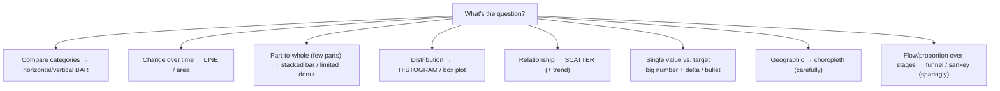

# 55 — Data Visualization

### Charts That Reveal the Truth, Fast and Honestly

> *"A chart is an argument made of ink. Made well, it lets someone see a truth in a second that a table would hide for an hour. Made badly — or dishonestly — it makes a lie look like a fact."*

---

**Chapter type:** Extended Capability (Design & Engineering)
**DRI:** Product Designer + Senior UI Designer + Frontend Architect
**Depends on:** [`00-CONSTITUTION.md`](./00-CONSTITUTION.md), [`05`](./05-VISUAL_PSYCHOLOGY.md), [`06`](./06-COLOR_SYSTEM.md), [`16`](./16-DASHBOARD_DESIGN.md), [`22`](./22-ACCESSIBILITY.md)
**Feeds:** [`16-DASHBOARD_DESIGN.md`](./16-DASHBOARD_DESIGN.md), [`35-PERFORMANCE.md`](./35-PERFORMANCE.md)

---

## Table of Contents
1. [Purpose](#1-purpose)
2. [Philosophy](#2-philosophy)
3. [Principles](#3-principles)
4. [Best Practices](#4-best-practices)
5. [Anti-Patterns](#5-anti-patterns)
6. [Real-World Examples](#6-real-world-examples)
7. [Common Mistakes](#7-common-mistakes)
8. [AI Implementation Guidance](#8-ai-implementation-guidance)
9. [Human Review Checklist](#9-human-review-checklist)
10. [Automation Opportunities](#10-automation-opportunities)
11. [References for Further Study](#11-references-for-further-study)
12. [Review Checklist & Measurable Quality Criteria](#12-review-checklist--measurable-quality-criteria)

---

## 1. Purpose

This chapter defines how the studio designs and builds **data visualizations** — charts, graphs, and visual data displays that let people *see* patterns, comparisons, and trends they couldn't extract from raw numbers. It goes deeper than the dashboard chapter's "pick the right chart" guidance ([`16`](./16-DASHBOARD_DESIGN.md)) into the craft and ethics of visualization itself: encoding choices, chart selection, honest scales, color, accessibility of charts, and performant rendering.

Data viz sits at the intersection of visual psychology ([`05`](./05-VISUAL_PSYCHOLOGY.md) — how the eye reads position/length/color), color ([`06`](./06-COLOR_SYSTEM.md) — perceptual, colorblind-safe palettes), accessibility ([`22`](./22-ACCESSIBILITY.md) — the notorious a11y gap), dashboards ([`16`](./16-DASHBOARD_DESIGN.md)), and performance ([`35`](./35-PERFORMANCE.md) — rendering thousands of points). Its governing ethic is Article X (evidence over opinion) *and* Article III/I (honesty — a misleading chart is a dark pattern made of data).

---

## 2. Philosophy

**A visualization exists to answer a question — not to decorate a number.** The point of a chart is *insight*: to let a human see a comparison, trend, distribution, or relationship faster and more accurately than a table would. If a chart doesn't answer a real question better than the raw number, it's decoration — and decoration that costs ink, load, and attention ([`16`](./16-DASHBOARD_DESIGN.md), Article VIII). We start from "what does the viewer need to *understand or decide*?" and choose the encoding that reveals it.

**Encode data in the channels the eye reads most accurately.** Not all visual channels are equal: humans judge **position** and **length** accurately, **angle/area** poorly, and **color hue/volume** worst of all ([`05`](./05-VISUAL_PSYCHOLOGY.md); Cleveland-McGill). A bar chart (length/position) communicates comparisons far better than a pie (angle/area) or a 3D chart (distorted volume). Good visualization is largely *choosing accurate encodings* — which is why the humble bar chart beats the flashy alternatives most of the time.

**Maximize the data, minimize the ink.** Tufte's principle: every drop of ink should carry information. Chartjunk — gratuitous gridlines, 3D effects, drop shadows, decorative backgrounds, redundant labels — actively *harms* comprehension by burying the signal (Article VIII, [`04`](./04-DESIGN_PHILOSOPHY.md) minimalism). We strip a chart to its data and the minimal scaffolding needed to read it: clear axes, direct labels, restrained color used to *mean* something.

**A misleading chart is a lie with a graph's credibility — honesty is non-negotiable.** Charts carry an air of objectivity, which makes deceptive ones especially harmful: truncated y-axes that exaggerate tiny differences, dual axes that manufacture correlations, cherry-picked ranges, inconsistent scales. These are **dark patterns made of data** (Article I, III; [`05`](./05-VISUAL_PSYCHOLOGY.md) Persuasion Ethics). The studio never distorts data to tell a preferred story — the chart must represent the truth as faithfully as the encoding allows.

---

## 3. Principles

### Principle 1 — Start from the question, then choose the encoding
Identify what the viewer needs to understand/decide; pick the chart that reveals it.
> *Rationale ([`16`](./16-DASHBOARD_DESIGN.md), Art. I):* No chart without a question.

### Principle 2 — Match the chart to the data relationship
Comparison→bar; trend→line; part-to-whole→stacked/limited; distribution→histogram; correlation→scatter.
> *Rationale ([`05`](./05-VISUAL_PSYCHOLOGY.md)):* The relationship dictates the right form.

### Principle 3 — Use the most accurately-perceived encodings
Prefer position/length over angle/area/hue; avoid 3D and pies-with-many-slices.
> *Rationale ([`05`](./05-VISUAL_PSYCHOLOGY.md), Cleveland-McGill):* Perceptual accuracy = faster, truer reading.

### Principle 4 — Maximize data-ink; remove chartjunk
Strip decoration; every mark should carry information ([`04`](./04-DESIGN_PHILOSOPHY.md), Art. VIII).
> *Rationale (Tufte):* Junk buries the signal.

### Principle 5 — Be honest: truthful scales, ranges, and baselines
Don't truncate axes to exaggerate; don't cherry-pick ranges or misuse dual axes.
> *Rationale (Art. I, III):* A misleading chart is a dark pattern.

### Principle 6 — Charts are accessible (not color-only; alternatives provided)
Colorblind-safe + non-color encoding; contrast; a data-table alternative; keyboard + screen-reader access ([`22`](./22-ACCESSIBILITY.md)).
> *Rationale (Art. III):* Charts are a top a11y failure area.

### Principle 7 — Provide context: labels, units, comparison, uncertainty
A number/trend needs a baseline, target, or benchmark to mean something; show uncertainty where relevant.
> *Rationale ([`16`](./16-DASHBOARD_DESIGN.md), Art. VI):* Context turns data into meaning.

### Principle 8 — Performant rendering at scale
Choose the right tech (SVG vs. canvas/WebGL) for the data volume; aggregate/sample huge datasets.
> *Rationale ([`35`](./35-PERFORMANCE.md)):* A janky chart is a broken chart.

---

## 4. Best Practices

### 4.1 Chart selection by question (the core decision)


| Encoding accuracy (best → worst) | Implication |
| --- | --- |
| Position on a common scale | Best — bar/scatter/line |
| Length | Very good — bars |
| Angle / slope | OK — line slope |
| Area | Poor — bubble (use cautiously) |
| Volume (3D) | Bad — **avoid 3D** |
| Color hue / saturation | Worst for quantity — use for *category*, not magnitude |

### 4.2 Honest scales (Principle 5)
- **Bar charts: baseline at zero, always** — truncating a bar's baseline lies about proportion (a bar's *length* is the message).
- **Line charts:** a non-zero baseline *can* be acceptable to show variation — but label it clearly and never to manufacture drama.
- **One axis per meaning; avoid dual y-axes** (they can imply correlations that aren't there) — if used, label unmistakably.
- **Consistent scales** across compared charts; **truthful ranges** (no cherry-picking the flattering window).
- **Don't distort** with unequal bins, misleading aspect ratios, or area-as-quantity errors.

### 4.3 Data-ink & clarity (Principle 4, [`04`](./04-DESIGN_PHILOSOPHY.md))
- Remove: 3D, drop shadows, heavy gridlines, decorative backgrounds, redundant legends when direct labels work.
- **Label directly** where possible (label the line end, not a distant legend) — reduces eye travel ([`05`](./05-VISUAL_PSYCHOLOGY.md)).
- Show **units** and clear axis titles; format numbers for humans (`1.2M`, not `1200000`); tabular figures for alignment ([`07`](./07-TYPOGRAPHY_SYSTEM.md)).
- Sort bars by value (not alphabetically) when comparison is the point; limit categories (aggregate the long tail into "Other").

### 4.4 Color in charts ([`06`](./06-COLOR_SYSTEM.md), [`05`](./05-VISUAL_PSYCHOLOGY.md))
- **Categorical:** distinct, colorblind-safe hues (limit to ~6–8; beyond that, rethink the chart).
- **Sequential/diverging:** perceptually-uniform ramps (OKLCH-based, [`06`](./06-COLOR_SYSTEM.md)) for magnitude; diverging around a meaningful midpoint.
- **Color ≠ the only channel:** pair with labels, patterns, or shapes so it survives grayscale + colorblindness (Principle 6, [`16`](./16-DASHBOARD_DESIGN.md)).
- **Semantic consistency:** if red=danger elsewhere, don't use red for a neutral series ([`06`](./06-COLOR_SYSTEM.md)).

### 4.5 Accessible charts (the non-negotiable, [`22`](./22-ACCESSIBILITY.md))
Charts are a top a11y gap. Every chart the studio ships:
- **Not color-only** — encode via position/label/pattern + accessible color; verify contrast.
- **Colorblind-safe palettes** (test with a simulator).
- **A data-table alternative** (toggle or visually-hidden `<table>`) — the underlying data, accessible to screen readers.
- **Accessible name + summary** (`aria-label`/`figcaption`: "Bar chart: revenue by month; peak in March").
- **Keyboard-operable** if interactive (tooltips reachable; focusable data points).
- Don't rely on **tooltip-only** information (hover isn't available to touch/keyboard).

### 4.6 Context & honesty of meaning (Principle 7, [`16`](./16-DASHBOARD_DESIGN.md))
Pair values with **comparison** (vs. target/prior/benchmark), show **trend direction**, and — for estimates/forecasts — show **uncertainty** (error bars, confidence bands, ranges). Don't imply false precision (`73.4182%` when the data is noisy). Annotate notable events/causes where they aid understanding.

### 4.7 Rendering technology & performance (Principle 8, [`35`](./35-PERFORMANCE.md))
| Data volume | Tech |
| --- | --- |
| Small–medium (≤ ~1–2k points), rich interactivity/a11y | **SVG** (D3, Recharts, visx) — DOM-accessible, styleable |
| Large (10k–100k+ points) | **Canvas** (rendering perf; add an a11y data-table alternative) |
| Massive / real-time | **WebGL** (deck.gl, regl) + server-side aggregation |
- **Aggregate/sample** huge datasets server-side ([`39`](./39-DATABASE_DESIGN.md)) — don't ship 100k points to the client.
- Debounce/throttle interactions; avoid re-rendering the whole chart on every hover ([`30`](./30-REACT_GUIDE.md)); animate cheaply ([`23`](./23-MOTION_SYSTEM.md)).

### 4.8 Chart states ([`16`](./16-DASHBOARD_DESIGN.md), [`04`](./04-DESIGN_PHILOSOPHY.md) P6)
Design **empty** ("no data yet"), **loading** (skeleton matching final geometry, no CLS), **error**, **single-data-point**, and **too-much-data** states — not just the ideal-dataset case.

---

## 5. Anti-Patterns

| Anti-pattern | Why it fails | Principle |
| --- | --- | --- |
| **3D charts** | Distort volume; hard to read accurately. | P3 |
| **Pie with many slices** | Angle/area are read poorly; unreadable > ~5 slices. | P2, P3 |
| **Truncated bar baseline** (not zero) | Lies about proportion. | P5, Art. III |
| **Dual y-axes to imply correlation** | Manufactures relationships. | P5 |
| **Cherry-picked ranges / inconsistent scales** | Deceptive; misleads. | P5 |
| **Chartjunk** (gridlines/shadows/backgrounds) | Buries the signal. | P4 |
| **Color-only encoding / non-colorblind-safe** | Excludes users; unreadable in grayscale. | P6, [`22`](./22-ACCESSIBILITY.md) |
| **No data-table alternative** | Inaccessible to screen readers. | P6, Art. III |
| **Tooltip-only data** | Lost on touch/keyboard. | P6 |
| **Wrong chart for the question** | Obscures the answer. | P1, P2 |
| **False precision** (over-decimal / no uncertainty) | Implies certainty that isn't there. | P7 |
| **Shipping 100k points to the client** | Jank; crashes; slow. | P8 |
| **Decorative chart** (no question answered) | Ink/attention cost, no insight. | P1 |

---

## 6. Real-World Examples

### Example A — Bar beat the pie (and told the truth)
A team showed market share as a **3D pie of 8 slices** — viewers couldn't tell which competitor was bigger, and the 3D perspective made front slices look larger. Switching to a **sorted horizontal bar chart** (length on a common scale, zero baseline) made the ranking instantly readable and *honest* — no perspective distortion (Principles 2, 3, 5). *The humble bar beats the flashy pie because the eye reads length accurately and angle/volume poorly.*

### Example B — The truncated axis that lied
A "growth" chart truncated the bar-chart y-axis to start at 95%, making a 96%→97% change look like a *doubling*. It failed the honesty principle (a bar's length is its message, Principle 5) — a chart-shaped dark pattern (Art. III). Fixed to a **zero baseline**, the real (small) change was visible; the *line-chart* version (with a labeled non-zero baseline) was offered where showing variation was legitimately useful. *Never distort the scale to tell a preferred story.*

### Example C — Accessible charts widened the audience
An analytics product encoded every chart by color alone, tooltip-only, canvas-rendered with no text alternative — invisible to colorblind and screen-reader users ([`22`](./22-ACCESSIBILITY.md)). Adding **colorblind-safe palettes + direct labels + a data-table toggle + accessible summaries + keyboard-reachable points** (Principle 6) made the product usable by everyone — and *clearer for all users* (labels + grayscale-safe encoding help sighted users too). *Accessible charts are better charts.*

---

## 7. Common Mistakes

- **Choosing the chart by aesthetics** (pie/3D/donut) instead of by the question/relationship.
- **Truncating bar baselines** or cherry-picking ranges (dishonest).
- **Chartjunk** — 3D, shadows, heavy gridlines, decorative fills.
- **Color-only, non-colorblind-safe** encoding; **no data-table alternative.**
- **Tooltip-only** information (fails touch/keyboard).
- **Too many categories/slices/series** (unreadable).
- **False precision** / no uncertainty shown.
- **Shipping raw huge datasets** to the client (no aggregation).
- **Only the ideal state** (no empty/loading/error).

---

## 8. AI Implementation Guidance

### 8.1 Where agents help
- **Recommend the chart type** from the data + question; flag wrong/deceptive choices.
- **Generate accessible chart components** (colorblind-safe, labels, data-table alternative, keyboard, summary).
- **Audit** for dishonest scales, chartjunk, color-only encoding, missing alternatives, false precision, and perf risks.
- **Add server-side aggregation** + choose SVG/canvas/WebGL by volume.
- **Produce all chart states** (empty/loading/error).

### 8.2 Hard rules (Art. I, III, X)
- The agent chooses the chart by **question + data relationship**, preferring **accurate encodings** (position/length; **no 3D**, no many-slice pies).
- **Honesty is enforced**: **zero baseline for bars**, truthful ranges/scales, no misleading dual axes — it refuses to distort data to tell a preferred story (Art. I/III).
- **Accessibility is built in**: not color-only, colorblind-safe + contrast-checked, **a data-table alternative**, accessible name/summary, keyboard-operable, not tooltip-only ([`22`](./22-ACCESSIBILITY.md)).
- **Context provided** (units, comparison, uncertainty); **no false precision.**
- **Performance**: aggregate large data server-side; right rendering tech; cheap animation ([`35`](./35-PERFORMANCE.md), [`23`](./23-MOTION_SYSTEM.md)).
- Ships **all states**; never a decorative chart that answers no question.

### 8.3 Prompt example — build an accessible chart
```
ROLE: Data-viz designer + Frontend, bound by 00-CONSTITUTION + 55 (+16/22/06/35).
INPUT: data = <schema/sample>; question = <what the viewer must understand/decide>.
TASK:
  1. Pick the chart type from the question + relationship (accurate encoding; no 3D/many-slice pie).
  2. Honest scale (zero baseline for bars; truthful range; single/labeled axis).
  3. Accessible: colorblind-safe + contrast-checked palette; NOT color-only; data-table alternative;
     accessible name + summary; keyboard-operable (not tooltip-only).
  4. Data-ink discipline (no chartjunk); direct labels; units; human-formatted numbers; show comparison/uncertainty.
  5. Choose SVG vs canvas/WebGL by volume; aggregate large data server-side. Provide empty/loading/error states.
OUTPUT: chart component (TSX) + data-table alternative + a11y self-check + honesty note (scale/baseline).
```

### 8.4 Prompt example — audit
```
TASK: Audit these charts for: wrong/deceptive chart types (3D, many-slice pie), truncated bar baselines,
misleading dual axes/ranges/scales, chartjunk, color-only/non-colorblind-safe encoding, missing data-table
alternative, tooltip-only data, false precision, and client-side rendering of huge datasets.
Output {chart, issue, severity, fix}. Flag any dishonest scale as a blocker (Art. III).
```

---

## 9. Human Review Checklist

- [ ] The chart answers a **clear question**; the type matches the **data relationship** (no decorative charts).
- [ ] Uses **accurately-perceived encodings** (position/length); **no 3D**, no many-slice pies.
- [ ] **Honest**: bars have a **zero baseline**; scales/ranges are truthful; no misleading dual axes.
- [ ] **Data-ink maximized** (no chartjunk); direct labels, units, human-formatted numbers.
- [ ] **Accessible**: not color-only, **colorblind-safe + contrast-checked**, **data-table alternative**, accessible name/summary, keyboard-operable (not tooltip-only) ([`22`](./22-ACCESSIBILITY.md)).
- [ ] **Context** present (comparison/target/benchmark); **uncertainty** shown where relevant; no false precision.
- [ ] **Performance**: large data aggregated server-side; right rendering tech; smooth interaction.
- [ ] All **states** designed (empty/loading/error/single-point/overflow).
- [ ] Color usage is **semantically consistent** with the system ([`06`](./06-COLOR_SYSTEM.md)).

---

## 10. Automation Opportunities

| Task | Automation |
| --- | --- |
| Colorblind/contrast check | Simulate CVD + verify chart-color contrast in CI ([`06`](./06-COLOR_SYSTEM.md), [`22`](./22-ACCESSIBILITY.md)). |
| Data-table alternative | Lint/test requiring a table alternative per chart. |
| A11y of charts | axe + keyboard tests on interactive charts ([`22`](./22-ACCESSIBILITY.md)). |
| Baseline/honesty check | Lint flagging non-zero bar baselines / dual axes for review. |
| State coverage | Storybook stories for empty/loading/error per chart. |
| Perf | Aggregation enforcement + render budgets for large datasets ([`35`](./35-PERFORMANCE.md)). |
| Grayscale render | Snapshot charts in grayscale to catch color-only encoding. |

---

## 11. References for Further Study
- **Foundational:** Edward Tufte, *The Visual Display of Quantitative Information* (data-ink, chartjunk); Cleveland & McGill on graphical perception (encoding accuracy).
- **Perception & practice:** Colin Ware, *Information Visualization*; Alberto Cairo, *The Truthful Art* / *How Charts Lie* (honesty).
- **Chart choice:** the Financial Times "Visual Vocabulary"; the data-viz catalogue of chart types.
- **Accessible & performant viz:** WAI guidance on accessible charts; D3/visx/Recharts/deck.gl docs; ColorBrewer / OKLCH palettes ([`06`](./06-COLOR_SYSTEM.md)).
- **Cross-references:** [`05-VISUAL_PSYCHOLOGY.md`](./05-VISUAL_PSYCHOLOGY.md), [`06-COLOR_SYSTEM.md`](./06-COLOR_SYSTEM.md), [`16-DASHBOARD_DESIGN.md`](./16-DASHBOARD_DESIGN.md), [`22-ACCESSIBILITY.md`](./22-ACCESSIBILITY.md), [`23-MOTION_SYSTEM.md`](./23-MOTION_SYSTEM.md), [`35-PERFORMANCE.md`](./35-PERFORMANCE.md), [`39-DATABASE_DESIGN.md`](./39-DATABASE_DESIGN.md).

---

## 12. Review Checklist & Measurable Quality Criteria

| Criterion | Target |
| --- | --- |
| Chart type matches the question/relationship | 100% |
| 3D charts / many-slice pies | 0 |
| Bar charts with zero baseline (honest scales) | 100% |
| Charts that are not color-only + colorblind-safe | 100% |
| Charts with a data-table alternative + accessible summary | 100% (floor) |
| Misleading scales/axes shipped | 0 (Art. III) |
| Large datasets aggregated server-side | 100% |
| Charts with all states designed | 100% |

---

*End of `55-DATA_VISUALIZATION.md`.*
