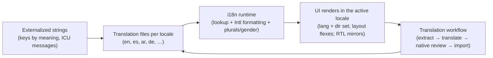

# 56 — Internationalization & Localization (i18n / l10n)

### Building for a World of Languages, Scripts, and Cultures

> *"Internationalization is not translation. It's building so that translation — and dates, currencies, plurals, right-to-left scripts, and cultural norms — is possible without rewriting the app. Bolt it on later and you rebuild; design it in and it's nearly free."*

---

**Chapter type:** Extended Capability (Design & Engineering)
**DRI:** Frontend Architect + Technical Writer + Brand Strategist
**Depends on:** [`00-CONSTITUTION.md`](./00-CONSTITUTION.md), [`09`](./09-LAYOUT_SYSTEM.md), [`21`](./21-RESPONSIVE_DESIGN.md), [`25`](./25-COPYWRITING.md), [`22`](./22-ACCESSIBILITY.md)
**Feeds:** [`references/patterns/localization-emerging-markets.md`](./references/patterns/localization-emerging-markets.md); all product surfaces

---

## Table of Contents
1. [Purpose](#1-purpose)
2. [Philosophy](#2-philosophy)
3. [Principles](#3-principles)
4. [Best Practices](#4-best-practices)
5. [Anti-Patterns](#5-anti-patterns)
6. [Real-World Examples](#6-real-world-examples)
7. [Common Mistakes](#7-common-mistakes)
8. [AI Implementation Guidance](#8-ai-implementation-guidance)
9. [Human Review Checklist](#9-human-review-checklist)
10. [Automation Opportunities](#10-automation-opportunities)
11. [References for Further Study](#11-references-for-further-study)
12. [Review Checklist & Measurable Quality Criteria](#12-review-checklist--measurable-quality-criteria)

---

## 1. Purpose

This chapter defines how the studio builds software that works across **languages, scripts, regions, and cultures** — the engineering (internationalization / **i18n**) that makes a product *adaptable*, and the practice (localization / **l10n**) that adapts it to a specific locale. It covers string externalization, translation workflows, plurals/gender, date/number/currency formatting, right-to-left (RTL) scripts, text expansion, and cultural adaptation.

i18n is deeply cross-cutting: it depends on layout ([`09`](./09-LAYOUT_SYSTEM.md) — logical properties for RTL), responsive design ([`21`](./21-RESPONSIVE_DESIGN.md) — text expansion/reflow), copywriting ([`25`](./25-COPYWRITING.md) — translatable, idiom-free strings), accessibility ([`22`](./22-ACCESSIBILITY.md) — `lang`, screen-reader language), and brand ([`03`](./03-BRAND_STRATEGY.md) — voice across cultures). It's also the engineering foundation beneath the localization *pattern* ([`references/patterns/localization-emerging-markets.md`](./references/patterns/localization-emerging-markets.md)). Its governing ethic: Article I (serve *these* users) + Article IX (architect for many locales from day one, because retrofitting is a one-way-door rewrite).

---

## 2. Philosophy

**Internationalization is architecture; localization is content.** *i18n* is the one-time engineering work of building so the app *can* adapt — externalized strings, locale-aware formatting, RTL support, flexible layouts. *l10n* is the ongoing content work of adapting to each locale — translations, regional formats, cultural tweaks. Confusing them is the core mistake: teams "add Spanish later" and discover the app hard-codes English strings, assumes `$`, breaks on long German words, and can't mirror for Arabic — so "later" means a *rewrite*. Do the i18n architecture up front (cheap); do l10n per locale (incremental).

**Architect for many locales even if you launch in one.** You rarely know at v1 which markets you'll enter — but the *cost* of i18n-ready architecture is low if done from the start and enormous if retrofitted (Article IX — retrofitting is a one-way door). So even a single-locale launch **externalizes strings, uses locale-aware formatting, uses logical CSS properties, and avoids the assumptions** that would block expansion. You're not translating yet; you're keeping the door open.

**Translation is not localization — culture matters as much as language.** A perfectly-translated string can still fail: an idiom that doesn't carry ("hit it out of the park"), a color or symbol with different cultural meaning, a name/address/phone format that assumes one country, an example that's culturally alien, or content that's insensitive in another context ([`25`](./25-COPYWRITING.md), [`05`](./05-VISUAL_PSYCHOLOGY.md)). Real localization adapts *meaning and appropriateness*, not just words — often with native reviewers, never with raw machine translation shipped blind.

**Every locale is a first-class user, not a second-class afterthought.** A cramped, half-translated, LTR-only experience for non-English users says "you don't matter" (Article I). If the studio serves a locale, it serves it *properly* — correct formatting, proper RTL mirroring, culturally-appropriate content, adequate space for expansion. Half-hearted localization is often worse than none; it signals neglect to exactly the users you're trying to win ([`references/patterns/localization-emerging-markets.md`](./references/patterns/localization-emerging-markets.md)).

---

## 3. Principles

### Principle 1 — i18n is architecture (do it up front); l10n is content (incremental)
Build adaptability once; add locales over time. Don't conflate them.
> *Rationale (Art. IX):* Retrofitting i18n is a rewrite.

### Principle 2 — Externalize all user-facing strings; never hard-code or concatenate
Strings live in resource files keyed by meaning; no sentence-fragment concatenation.
> *Rationale ([`25`](./25-COPYWRITING.md)):* Hard-coded/concatenated strings can't be translated correctly.

### Principle 3 — Locale-aware formatting for dates, numbers, currency, plurals, gender
Use the platform's `Intl` (or ICU) — never hand-format locale-dependent values.
> *Rationale:* Formats, plural rules, and gender vary wildly by locale.

### Principle 4 — Design for text expansion and variable length
Allow ~30–50%+ expansion (German, Finnish); layouts flex; no fixed-width text ([`21`](./21-RESPONSIVE_DESIGN.md)).
> *Rationale:* English is often the *shortest* language; fixed layouts break.

### Principle 5 — Support RTL via logical properties + `dir`
Use CSS logical properties + `dir="rtl"`/`bidi` so Arabic/Hebrew mirror correctly ([`09`](./09-LAYOUT_SYSTEM.md)).
> *Rationale ([`09`](./09-LAYOUT_SYSTEM.md), [`21`](./21-RESPONSIVE_DESIGN.md)):* Physical properties break RTL.

### Principle 6 — Localize meaning + culture, not just words
Adapt idioms, examples, symbols, colors, formats; use native review; no blind machine translation.
> *Rationale ([`25`](./25-COPYWRITING.md), [`05`](./05-VISUAL_PSYCHOLOGY.md)):* Translation ≠ localization.

### Principle 7 — Set `lang`, handle Unicode + fonts, and detect locale respectfully
Correct `lang`/`dir` (a11y, [`22`](./22-ACCESSIBILITY.md)); UTF-8 everywhere; fonts covering the scripts; sensible locale detection + user override.
> *Rationale (Art. III, [`22`](./22-ACCESSIBILITY.md)):* Screen readers, sorting, and rendering depend on it.

### Principle 8 — Every locale is first-class
Correct formatting, proper RTL, cultural fit, adequate space — no cramped half-translations.
> *Rationale (Art. I):* Half-hearted localization is worse than none.

---

## 4. Best Practices

### 4.1 The i18n architecture (build once)


### 4.2 Externalize strings (Principle 2, [`25`](./25-COPYWRITING.md))
```tsx
// ❌ Hard-coded + concatenated (untranslatable — word order/plurals differ by language)
return <p>You have {count} new {count === 1 ? "message" : "messages"}</p>;

// ✅ Externalized ICU message (handles plurals per locale)
// en.json: { "inbox.count": "{count, plural, =0 {No new messages} one {# new message} other {# new messages}}" }
return <p>{t("inbox.count", { count })}</p>;
```
- Keys are by **meaning/context** (`checkout.payButton`), not by English text (which changes).
- **Never concatenate** sentence fragments (word order, gender, plurals differ) — use full messages with placeholders/ICU.
- Provide **context/notes** to translators (where it appears, what a placeholder is).

### 4.3 Locale-aware formatting (Principle 3 — use `Intl`)
```ts
new Intl.DateTimeFormat(locale, { dateStyle: "long" }).format(date);         // 8 July 2026 / ٨ يوليو ٢٠٢٦
new Intl.NumberFormat(locale, { style: "currency", currency }).format(1234.5); // $1,234.50 / 1.234,50 €
new Intl.PluralRules(locale).select(count);                                    // en: one/other; ar: 6 forms
new Intl.RelativeTimeFormat(locale).format(-2, "day");                         // "2 days ago"
new Intl.ListFormat(locale).format(["a","b","c"]);                             // "a, b, and c"
```
Never hand-roll date/number/currency formatting — `Intl` (backed by CLDR) handles the thousands of locale rules. Plurals are **not** "=1 else many" (Arabic has 6 forms; some languages have none).

### 4.4 Design for text expansion (Principle 4, [`21`](./21-RESPONSIVE_DESIGN.md))
- Budget **~30–50%+ expansion** vs. English (a 10-char English label may be 20+ in German); some UI shrinks (CJK).
- **No fixed-width text containers**; let buttons/labels/nav flex and wrap; test with the longest expected translation (and a **pseudo-localization** pass, §4.8).
- Avoid text baked into images (can't translate; also a11y issue); avoid tight truncation that clips other languages.

### 4.5 Right-to-left (RTL) support (Principle 5, [`09`](./09-LAYOUT_SYSTEM.md))
```css
/* ✅ Logical properties mirror automatically for RTL */
.card { padding-inline-start: var(--space-4); margin-inline-end: var(--space-2); }
/* ❌ Physical properties don't mirror */
.bad { padding-left: 16px; margin-right: 8px; }
```
- Set `<html dir="rtl" lang="ar">`; use **logical properties** everywhere ([`09`](./09-LAYOUT_SYSTEM.md), [`21`](./21-RESPONSIVE_DESIGN.md)) so layout mirrors.
- **Mirror directional icons** (back/forward, progress) but **not** inherently-directional ones (a clock, a play button).
- Handle **bidi** (mixed LTR/RTL, e.g. an English brand name in Arabic text) with Unicode bidi controls where needed.
- **Test RTL** as a first-class layout, not an afterthought ([`21`](./21-RESPONSIVE_DESIGN.md)).

### 4.6 Culture, not just language (Principle 6, [`25`](./25-COPYWRITING.md), [`05`](./05-VISUAL_PSYCHOLOGY.md))
- **Avoid idioms/metaphors/humor** that don't translate; write translatable, plain source copy ([`25`](./25-COPYWRITING.md)).
- **Formats:** names (order, honorifics), addresses, phone numbers, units (metric/imperial), first day of week, time (12/24h) — locale-driven.
- **Symbols/colors/imagery:** meanings differ by culture ([`05`](./05-VISUAL_PSYCHOLOGY.md), [`06`](./06-COLOR_SYSTEM.md)); avoid culturally-specific icons/gestures/photos where they'd confuse or offend.
- **Native review:** have native speakers review l10n (not raw machine translation) — MT is a *draft aid*, never a blind ship (Principle 6).

### 4.7 Locale detection, `lang`, Unicode & fonts (Principle 7, [`22`](./22-ACCESSIBILITY.md), [`07`](./07-TYPOGRAPHY_SYSTEM.md))
- **Detect** via `Accept-Language`/user setting, but always allow **explicit override** (remembered); don't force by IP alone.
- Set correct **`lang`/`dir`** on `<html>` (and on mixed-language snippets) — critical for screen readers, sorting, hyphenation ([`22`](./22-ACCESSIBILITY.md)).
- **UTF-8 everywhere** (storage, transport, DB [`39`](./39-DATABASE_DESIGN.md)); handle Unicode correctly (normalization, grapheme-aware length/truncation — emoji/combining marks).
- **Fonts must cover the scripts** you support (Latin + Arabic + CJK + …) or provide script-appropriate fallbacks ([`07`](./07-TYPOGRAPHY_SYSTEM.md)); watch load weight for large CJK fonts ([`35`](./35-PERFORMANCE.md)).

### 4.8 Workflow, pseudo-localization & testing
- **Translation workflow:** extract keys → send to translators/TMS with context → **native review** → import; keep source + translations in version control; flag missing/stale keys.
- **Pseudo-localization** (e.g. `[!!! Ĉóóɳfirm Ṕáýměńt !!!]`) in dev: auto-expands + accents strings to surface **hard-coded strings, truncation, and expansion breakage** *before* real translation.
- **Test each locale**: longest-language layout, **RTL**, formatting, `lang`/`dir`, at 200% zoom ([`21`](./21-RESPONSIVE_DESIGN.md)/[`22`](./22-ACCESSIBILITY.md)).

---

## 5. Anti-Patterns

| Anti-pattern | Why it fails | Principle |
| --- | --- | --- |
| **Hard-coded strings** in components | Untranslatable; requires code changes per locale. | P2 |
| **Concatenating sentence fragments** | Word order/gender/plurals differ → broken grammar. | P2 |
| **Hand-formatting dates/numbers/currency** | Wrong for most locales. | P3 |
| **`=1 else many` pluralization** | Fails languages with 0/dual/6 plural forms. | P3 |
| **Fixed-width text / text in images** | Breaks on expansion; untranslatable. | P4 |
| **Physical CSS props** (`left/right/margin-left`) | RTL doesn't mirror. | P5 |
| **Blind machine translation shipped** | Cultural/grammatical errors; embarrassment. | P6 |
| **Idioms/culture-specific content** | Doesn't translate; confuses/offends. | P6 |
| **Missing/incorrect `lang`/`dir`** | Breaks screen readers, sorting, rendering. | P7, Art. III |
| **Non-UTF-8 / grapheme-naive length** | Corrupted text; emoji/combining-mark bugs. | P7 |
| **"Add i18n later"** (retrofit) | Becomes a rewrite. | P1, Art. IX |
| **Cramped half-translation / LTR-only** | Signals neglect; worse than nothing. | P8, Art. I |

---

## 6. Real-World Examples

### Example A — "Add Spanish later" became a rewrite
A team hard-coded English strings, concatenated fragments (`"You have " + n + " items"`), used `$`+`toFixed(2)` for money, and `padding-left` everywhere. When Spanish + Arabic markets opened, *nothing* worked: strings weren't extractable, the concatenation produced broken Spanish grammar, currency was wrong, and Arabic couldn't mirror. Retrofitting was effectively a rewrite (Principle 1, Art. IX). A sibling team that had done **i18n architecture up front** (externalized ICU strings, `Intl`, logical properties) added each locale in days. *i18n is cheap up front, a rewrite later.*

### Example B — Pluralization that only worked in English
An app used `count === 1 ? "item" : "items"` everywhere. In Arabic (6 plural forms) and Polish (complex rules) the grammar was wrong for most numbers. Switching to **`Intl.PluralRules` + ICU messages** (§4.2–4.3) produced correct plurals in every locale automatically — CLDR knows the rules so the team didn't have to (Principle 3). *Plurals are not "one vs. many."*

### Example C — RTL as first-class (via logical properties)
A dashboard used `margin-left`/`padding-right`/`text-align: left` throughout; for the Arabic launch it looked broken — nav on the wrong side, misaligned everything. Because the studio's baseline mandated **logical properties** ([`09`](./09-LAYOUT_SYSTEM.md)/[`21`](./21-RESPONSIVE_DESIGN.md)), the fix was mechanical: switch to `margin-inline-start`/`padding-inline-end`/`text-align: start`, set `dir="rtl"`, and mirror directional icons — the whole layout mirrored correctly (Principle 5). *RTL is nearly free with logical properties and painful without them.*

---

## 7. Common Mistakes

- **Treating i18n as "translate later"** instead of architecture done up front.
- **Hard-coding or concatenating** user-facing strings.
- **Hand-formatting** dates/numbers/currency instead of `Intl`.
- **Naive pluralization** (`=1 else many`).
- **Fixed-width layouts / text in images** that break on expansion.
- **Physical CSS properties** that don't mirror for RTL.
- **Shipping raw machine translation** without native review.
- **Idioms/culturally-specific content** that doesn't carry.
- **Wrong/missing `lang`/`dir`**; non-UTF-8; grapheme-naive string handling.
- **Cramped, half-translated, LTR-only** experiences for non-English users.

---

## 8. AI Implementation Guidance

### 8.1 Where agents help
- **Externalize strings** (extract hard-coded/concatenated strings into ICU messages with context notes).
- **Add locale-aware formatting** (`Intl` for dates/numbers/currency/plurals/lists/relative-time).
- **Convert physical → logical CSS** for RTL; set `lang`/`dir`; mirror directional icons.
- **Draft translatable source copy** (idiom-free) and translator notes ([`25`](./25-COPYWRITING.md)).
- **Audit** for hard-coded strings, concatenation, hand-formatting, naive plurals, physical props, missing `lang`/`dir`, and expansion/truncation risks; set up **pseudo-localization**.

### 8.2 Hard rules (Art. I, IX, III)
- The agent **externalizes all user-facing strings** (keyed by meaning, ICU) — **never hard-codes or concatenates** sentence fragments.
- It uses **`Intl`/ICU** for all locale-dependent formatting + **`Intl.PluralRules`** (never `=1 else many`).
- It uses **logical CSS properties** ([`09`](./09-LAYOUT_SYSTEM.md)/[`21`](./21-RESPONSIVE_DESIGN.md)) and designs for **text expansion** — no fixed-width text, no physical `left/right`.
- It sets correct **`lang`/`dir`**, assumes **UTF-8**, and handles Unicode **grapheme-aware** (emoji/combining marks) ([`22`](./22-ACCESSIBILITY.md)).
- It writes **translatable, idiom-free** source copy and **flags** anything needing **native cultural review** — it does **not** present raw machine translation as ship-ready (Principle 6).
- It **architects for i18n even in a single-locale build** (Art. IX) and treats every locale as **first-class** (Art. I).

### 8.3 Prompt example — make a feature i18n-ready
```
ROLE: Frontend Architect + Technical Writer, bound by 00-CONSTITUTION + 56 (+09/21/25/22).
TASK: Make <feature> internationalization-ready (launching in en, expanding to es + ar).
CONSTRAINTS:
  - Externalize all strings as ICU messages keyed by meaning (+ translator context notes); NO concatenation.
  - Intl for dates/numbers/currency/relative-time; Intl.PluralRules for plurals.
  - Logical CSS properties (RTL-safe); design for ~40% text expansion; no fixed-width text / no text-in-images.
  - Set lang/dir; mirror directional icons for RTL; UTF-8 + grapheme-aware string handling.
  - Idiom-free source copy; flag anything needing native cultural review.
  - Add pseudo-localization for dev testing.
OUTPUT: refactored components + en/ar message files (sample) + RTL notes + a pseudo-loc setup + an i18n self-check.
```

### 8.4 Prompt example — audit
```
TASK: Audit for i18n readiness: hard-coded/concatenated strings, hand-formatted dates/numbers/currency,
naive pluralization, fixed-width text / text-in-images, physical CSS props (RTL breakage), missing lang/dir,
non-UTF-8 / grapheme-naive handling, and idioms/culture-specific content. Output {location, issue, fix},
and note which strings need native review vs. safe machine-translation drafting.
```

---

## 9. Human Review Checklist

- [ ] i18n is **architected up front** (even for a single-locale launch); l10n added incrementally.
- [ ] **All user-facing strings externalized** (keyed by meaning, ICU); **no hard-coding or concatenation**.
- [ ] **`Intl`/ICU** used for dates/numbers/currency/relative-time; **`Intl.PluralRules`** for plurals.
- [ ] Layouts handle **text expansion** (~30–50%+); no fixed-width text / text-in-images.
- [ ] **Logical CSS properties** used; **RTL** mirrors correctly (`dir`, directional icons) ([`09`](./09-LAYOUT_SYSTEM.md), [`21`](./21-RESPONSIVE_DESIGN.md)).
- [ ] **Culture localized**, not just words (idioms/formats/symbols/colors); **native review** done (no blind MT).
- [ ] Correct **`lang`/`dir`** ([`22`](./22-ACCESSIBILITY.md)); **UTF-8**; grapheme-aware handling; fonts cover the scripts ([`07`](./07-TYPOGRAPHY_SYSTEM.md)).
- [ ] **Locale detection + user override** (remembered); not forced by IP alone.
- [ ] **Pseudo-localization + per-locale testing** (longest language, RTL, formats, 200% zoom) done.
- [ ] Every supported locale is **first-class** (no cramped half-translations).

---

## 10. Automation Opportunities

| Task | Automation |
| --- | --- |
| String extraction | i18n framework extraction (i18next/FormatJS/`next-intl`); flag hard-coded strings via lint. |
| Formatting enforcement | Lint banning hand-rolled date/number/currency formatting (require `Intl`). |
| Missing/stale keys | CI check for untranslated/missing/orphan keys per locale. |
| Pseudo-localization | Auto pseudo-loc build to catch hard-coded strings + truncation. |
| RTL/logical-props | Stylelint flagging physical properties ([`09`](./09-LAYOUT_SYSTEM.md), [`21`](./21-RESPONSIVE_DESIGN.md)). |
| `lang`/`dir` checks | a11y lint asserting correct `lang`/`dir` ([`22`](./22-ACCESSIBILITY.md)). |
| Visual regression per locale | Screenshot diffs incl. longest language + RTL. |
| TMS integration | Sync with a translation-management system + translator context. |

---

## 11. References for Further Study
- **Standards & APIs:** the ECMAScript **`Intl`** API (dates/numbers/plurals/lists/relative-time); **Unicode CLDR** (locale data) and ICU MessageFormat; the W3C Internationalization (i18n) guidelines.
- **RTL & bidi:** Unicode Bidirectional Algorithm; CSS logical properties (MDN) ([`09`](./09-LAYOUT_SYSTEM.md)).
- **Frameworks:** i18next / FormatJS (react-intl) / `next-intl` documentation.
- **Practice:** localization/pseudo-localization guides; W3C "text size in translation" (expansion) references.
- **Cross-references:** [`03-BRAND_STRATEGY.md`](./03-BRAND_STRATEGY.md), [`07-TYPOGRAPHY_SYSTEM.md`](./07-TYPOGRAPHY_SYSTEM.md), [`09-LAYOUT_SYSTEM.md`](./09-LAYOUT_SYSTEM.md), [`21-RESPONSIVE_DESIGN.md`](./21-RESPONSIVE_DESIGN.md), [`22-ACCESSIBILITY.md`](./22-ACCESSIBILITY.md), [`25-COPYWRITING.md`](./25-COPYWRITING.md), [`references/patterns/localization-emerging-markets.md`](./references/patterns/localization-emerging-markets.md).

---

## 12. Review Checklist & Measurable Quality Criteria

| Criterion | Target |
| --- | --- |
| User-facing strings externalized (not hard-coded/concatenated) | 100% |
| Locale-dependent values formatted via `Intl`/ICU | 100% |
| Pluralization via `Intl.PluralRules` (not `=1 else many`) | 100% |
| Layouts surviving ~40% text expansion + RTL | 100% |
| Logical CSS properties (RTL-safe) | 100% |
| Correct `lang`/`dir` + UTF-8 | 100% |
| Locales shipped with native review (no blind MT) | 100% |
| i18n architected before first localization | Yes (Art. IX) |

---

*End of `56-INTERNATIONALIZATION.md`.*
