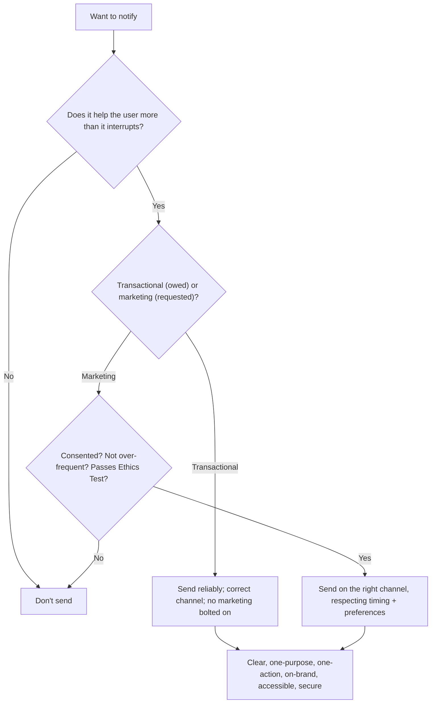

# 57 — Email & Notifications

### Reaching Users Respectfully, Across Every Channel

> *"A notification is an interruption you're asking permission to make of someone's attention. Send one that helps and you build trust; send one that doesn't and you've taught them to ignore you — or to leave."*

---

**Chapter type:** Extended Capability (Design & Engineering)
**DRI:** Product Designer + Technical Writer + Backend Architect
**Depends on:** [`00-CONSTITUTION.md`](./00-CONSTITUTION.md), [`03`](./03-BRAND_STRATEGY.md), [`05`](./05-VISUAL_PSYCHOLOGY.md), [`22`](./22-ACCESSIBILITY.md), [`25`](./25-COPYWRITING.md), [`37`](./37-SECURITY.md)
**Feeds:** [`18-SAAS_DESIGN.md`](./18-SAAS_DESIGN.md) (retention loops), [`24-MICRO_INTERACTIONS.md`](./24-MICRO_INTERACTIONS.md) (in-app)

---

## Table of Contents
1. [Purpose](#1-purpose)
2. [Philosophy](#2-philosophy)
3. [Principles](#3-principles)
4. [Best Practices](#4-best-practices)
5. [Anti-Patterns](#5-anti-patterns)
6. [Real-World Examples](#6-real-world-examples)
7. [Common Mistakes](#7-common-mistakes)
8. [AI Implementation Guidance](#8-ai-implementation-guidance)
9. [Human Review Checklist](#9-human-review-checklist)
10. [Automation Opportunities](#10-automation-opportunities)
11. [References for Further Study](#11-references-for-further-study)
12. [Review Checklist & Measurable Quality Criteria](#12-review-checklist--measurable-quality-criteria)

---

## 1. Purpose

This chapter defines how the studio designs and sends **email and notifications** — transactional and marketing email, push, in-app, and SMS — respectfully, accessibly, deliverably, and honestly. It covers when to notify (and when *not* to), channel choice, content/design, the technical realities (deliverability, HTML email quirks), consent and preferences, and the ethics of interrupting someone's attention.

Notifications are a retention loop for SaaS ([`18`](./18-SAAS_DESIGN.md)) and a trust surface for the whole brand ([`03`](./03-BRAND_STRATEGY.md)) — they carry the brand voice ([`25`](./25-COPYWRITING.md)) into someone's inbox/lock screen. They intersect visual psychology ([`05`](./05-VISUAL_PSYCHOLOGY.md) — ethical vs. manipulative attention-grabbing), accessibility ([`22`](./22-ACCESSIBILITY.md) — accessible email + in-app), security ([`37`](./37-SECURITY.md) — no sensitive data, phishing-resistance), and copywriting ([`25`](./25-COPYWRITING.md)). Governing ethic: Article I (serve the user's attention, don't exploit it) + Article III (consent, no dark patterns — this is where manipulative "engagement" hides).

---

## 2. Philosophy

**A notification spends the user's attention — so it must be worth more than it costs.** Attention is finite and precious; every ping, badge, and email is a withdrawal from a limited account and an interruption of a real life ([`05`](./05-VISUAL_PSYCHOLOGY.md), Article I). The test for *any* notification is simple and strict: *does this help the user more than it costs them to be interrupted?* If not, don't send it. Products that fail this test train users to disable notifications, filter to spam, or churn — the notification meant to retain them causes the opposite.

**Transactional is a service; marketing is a request.** There are two fundamentally different kinds of message. **Transactional** (password reset, receipt, order shipped, security alert) is a *service the user is owed* — they expect it, it must arrive reliably and instantly. **Marketing/engagement** (newsletters, "come back!", promotions) is a *request for attention* the user must have *consented* to and can *always* leave. Confusing them — sneaking marketing into transactional email, or making a receipt an ad — erodes trust and often breaks the law (Principle: consent, Article III).

**Consent and control are non-negotiable — the user owns their inbox.** Users must **opt in** to non-essential communication, **granularly control** what they receive, and **unsubscribe in one click** that actually works (Article III; anti-roach-motel from [`18`](./18-SAAS_DESIGN.md)). Making unsubscribe hard, burying preferences, defaulting people into everything, or ignoring an opt-out are dark patterns — and, for email, illegal in most jurisdictions (CAN-SPAM, GDPR, CASL). Respecting the user's control is both ethical and the only sustainable strategy.

**Deliverability and craft are the whole game — an unsent or ugly message helped no one.** A perfect notification that lands in spam, renders broken in Outlook, or is inaccessible to a screen reader is a failure. Email especially is a hostile medium (ancient rendering engines, aggressive spam filters), so the craft — sender reputation, authentication, resilient HTML, accessible markup, tested rendering — is not optional polish; it's what determines whether the message *works at all* (Article II, VII).

---

## 3. Principles

### Principle 1 — Notify only when it helps more than it interrupts
Every message passes the "worth more than the attention it costs" test, or it isn't sent.
> *Rationale (Art. I, [`05`](./05-VISUAL_PSYCHOLOGY.md)):* Attention is finite; noise trains users to ignore/leave.

### Principle 2 — Separate transactional (a service) from marketing (a request)
Transactional = expected + reliable; marketing = consented + leavable. Never blur them.
> *Rationale (Art. III):* Different expectations, consent, and law.

### Principle 3 — Consent, granular preferences, one-click unsubscribe
Opt-in for non-essential; per-category control; easy, honored opt-out (no roach motel).
> *Rationale (Art. III, [`18`](./18-SAAS_DESIGN.md)):* The user owns their inbox; also legally required.

### Principle 4 — Right channel for the message + respect timing/frequency
Match urgency/type to channel (in-app/email/push/SMS); rate-limit; respect quiet hours/timezones.
> *Rationale (Art. I):* Wrong channel/too-frequent = ignored or resented.

### Principle 5 — Clear, on-brand, actionable content (one purpose, one action)
Meaningful subject/preview; one primary message + action; brand voice ([`03`](./03-BRAND_STRATEGY.md), [`25`](./25-COPYWRITING.md)).
> *Rationale ([`25`](./25-COPYWRITING.md)):* Vague/multi-purpose messages get ignored.

### Principle 6 — Deliverable + resilient (email is a hostile medium)
Authenticate (SPF/DKIM/DMARC), protect sender reputation, use resilient HTML, test rendering.
> *Rationale (Art. II):* Undelivered/broken = failed, regardless of content.

### Principle 7 — Accessible (email + in-app)
Semantic, screen-reader-friendly email; plain-text alternative; accessible in-app notifications ([`22`](./22-ACCESSIBILITY.md)).
> *Rationale (Art. III):* Notifications must work for everyone.

### Principle 8 — Secure + private (no sensitive data; phishing-resistant)
No secrets/passwords/full PII in messages; secure links; help users spot real vs. phishing ([`37`](./37-SECURITY.md)).
> *Rationale (Art. III, [`37`](./37-SECURITY.md)):* Email is a top attack + leak vector.

### Principle 9 — No manipulative "engagement" (ethical attention only)
No guilt/streak-shaming, fake urgency, or dark-pattern notifications ([`05`](./05-VISUAL_PSYCHOLOGY.md) Ethics Test).
> *Rationale (Art. III):* Manipulative pings destroy trust; run the Persuasion Ethics Test.

---

## 4. Best Practices

### 4.1 The "should we send this?" decision


### 4.2 Channel selection (Principle 4)
| Channel | Best for | Watch-outs |
| --- | --- | --- |
| **In-app** | Contextual, non-urgent, while active | Only seen when using the app ([`24`](./24-MICRO_INTERACTIONS.md)) |
| **Email** | Transactional records, digests, longer content | Deliverability + rendering hell (§4.5–4.6) |
| **Push** | Timely, actionable, re-engagement (opted-in) | Easy to over-send → disabled; OS permission |
| **SMS** | Urgent/high-trust (OTP, critical alerts) | Costly; intrusive; strict consent; reserve for genuinely urgent |
> Match **urgency + type** to channel; don't SMS a newsletter or email a time-critical OTP as the only channel. Consider a **fallback** (push→email) for important messages.

### 4.3 Timing, frequency & batching (Principle 4, Art. I)
- **Rate-limit** per user; **batch/digest** low-priority items ("3 updates" not 3 pings).
- Respect **timezones + quiet hours**; don't ping at 3am.
- **Frequency caps** across channels (don't email + push + SMS the same thing).
- Let **preferences control frequency** (real-time / daily digest / weekly / off).

### 4.4 Content & design (Principle 5, [`25`](./25-COPYWRITING.md), [`03`](./03-BRAND_STRATEGY.md))
- **Subject line + preview text:** clear, honest, specific — the whole open-decision rides on it; no clickbait/false urgency ([`25`](./25-COPYWRITING.md), Principle 9).
- **One purpose, one primary action** (verb+object CTA, [`12`](./12-BUTTON_DESIGN.md)/[`25`](./25-COPYWRITING.md)); front-load the key info (scannable, [`05`](./05-VISUAL_PSYCHOLOGY.md)).
- **On-brand** voice + visual ([`03`](./03-BRAND_STRATEGY.md)); consistent sender name/address (recognizable, phishing-resistant).
- **Personalize honestly** (real name/context) — not fake intimacy; localize ([`56`](./56-INTERNATIONALIZATION.md)).
- Push/in-app: short, actionable, clear source; deep-link to the relevant place.

### 4.5 Email HTML (the hostile-medium craft, Principle 6)
- Email clients render with **ancient/quirky engines** (esp. Outlook/Word engine) — use a **battle-tested, table-based responsive email framework** (e.g. MJML) rather than modern app CSS; inline critical styles; limited CSS support.
- **Responsive** (mobile-first — most email is read on phones); **max ~600px** width; large tap targets.
- **Images:** decorative + non-essential (images are often blocked by default) — **never put critical info in images**; always meaningful `alt`; a text/CTA fallback if images don't load.
- **Dark-mode** aware (email dark modes mangle colors — test).
- **Always include a plain-text alternative** (multipart) — better deliverability + accessibility.

### 4.6 Deliverability (get to the inbox, Principle 6)
- **Authenticate:** SPF, DKIM, DMARC set up correctly (and BIMI where useful) — critical for inbox placement + anti-spoofing ([`37`](./37-SECURITY.md)).
- **Sender reputation:** use a reputable ESP; warm up domains; monitor bounce/complaint/spam rates; prune inactive/bouncing addresses.
- **List hygiene:** confirmed opt-in (double opt-in where appropriate); honor unsubscribes immediately; never buy lists.
- **Avoid spam triggers:** balanced text/image, no deceptive subjects, proper unsubscribe + physical address (CAN-SPAM), consistent sending patterns.
- **Monitor** delivery/open/click/complaint metrics ([`48`](./48-MONITORING.md)); test with inbox-placement/spam-score tools.

### 4.7 Accessibility (Principle 7, [`22`](./22-ACCESSIBILITY.md))
- **Email:** semantic where possible, logical reading order, sufficient contrast ([`06`](./06-COLOR_SYSTEM.md)), real text (not text-in-images), meaningful `alt`, descriptive link text, plain-text alternative, `lang` set.
- **In-app:** announce via live regions (`role="status"`/`alert`, [`22`](./22-ACCESSIBILITY.md)/[`24`](./24-MICRO_INTERACTIONS.md)); not color-only; dismissible + keyboard-accessible; don't auto-dismiss critical info too fast.
- **Push:** clear text (screen readers read notifications); not reliant on an image.

### 4.8 Consent, preferences & compliance (Principle 3, 8, Art. III, [`37`](./37-SECURITY.md))
- **Opt-in** for marketing (consent recorded); **granular preference center** (per category + frequency + channel); **one-click unsubscribe** that works instantly (and list-unsubscribe header).
- **Transactional** doesn't require opt-in but must **not carry marketing**.
- **Legal:** CAN-SPAM (US), GDPR/ePrivacy (EU), CASL (Canada) — consent, identification, unsubscribe, sender address.
- **Security/privacy:** **no passwords/secrets/full card or sensitive PII** in messages ([`37`](./37-SECURITY.md)); expiring, single-use, non-guessable links for resets/magic links ([`38`](./38-AUTHENTICATION.md)); help users distinguish real messages from phishing (consistent sender, no "click here to verify or lose your account" panic patterns — which are both dark patterns *and* teach users to fall for phishing).

---

## 5. Anti-Patterns

| Anti-pattern | Why it fails | Principle |
| --- | --- | --- |
| **Notification spam** (ping for everything) | Trains users to disable/ignore/churn. | P1 |
| **Marketing disguised as transactional** | Violates trust + consent + law. | P2, P3 |
| **No opt-in / opt-out buried / opt-out ignored** | Dark pattern; illegal. | P3, Art. III |
| **Default-everyone-into-everything** | No real consent; annoyance. | P3 |
| **Wrong channel** (SMS newsletter; email-only OTP) | Ignored or too slow/intrusive. | P4 |
| **3am pings / no frequency cap** | Resentment; disable. | P4 |
| **Clickbait/false-urgency subjects** | Erodes trust; spam flags. | P5, P9, Art. III |
| **Critical info in images** (blocked by default) | Message conveys nothing. | P6, P7 |
| **No SPF/DKIM/DMARC / bought lists** | Lands in spam; spoofable. | P6, [`37`](./37-SECURITY.md) |
| **No plain-text / inaccessible email** | Broken renders; excludes users. | P6, P7 |
| **Secrets/passwords/PII in messages** | Leak + phishing vector. | P8, [`37`](./37-SECURITY.md) |
| **Guilt/streak-shaming / manipulative pings** | Dark pattern; destroys goodwill. | P9, Art. III |

---

## 6. Real-World Examples

### Example A — Fewer notifications, higher retention
A product pinged for *every* event (someone viewed your profile, a minor update, "you have 1 new…"). Users disabled notifications wholesale — including the *useful* ones — and some churned. Applying the "helps > interrupts" test (Principle 1) + **digests + frequency caps + a granular preference center** (Principle 3, 4.3): far fewer, higher-value messages → *more* engagement and fewer opt-outs, because the surviving notifications were worth reading. *Less noise, more trust ([`18`](./18-SAAS_DESIGN.md)).*

### Example B — The password-reset email in spam (deliverability)
A team's transactional emails (resets, receipts) frequently landed in spam — users couldn't log in, support spiked. Root cause: **missing DKIM/DMARC** and a poor-reputation shared IP (Principle 6, §4.6). Setting up **SPF/DKIM/DMARC**, moving to a reputable ESP, adding a **plain-text alternative**, and monitoring complaint rates ([`48`](./48-MONITORING.md)) fixed inbox placement. *A transactional email in spam is a broken product feature (Principle 2, 6).*

### Example C — Rejecting the guilt notification
Growth proposed a push: *"😢 Your streak is about to die! Don't disappoint us — open the app now."* It failed the Persuasion Ethics Test ([`05`](./05-VISUAL_PSYCHOLOGY.md), Principle 9) — guilt/manipulation. **Rejected (Art. III).** Replaced with an **honest, helpful** reminder (*"Your 5-day streak is going strong — a 2-minute lesson keeps it up"*) that respected frequency caps and the user's preferences. Motivating without manipulation; it retained trust *and* users. *Ethical attention only.*

---

## 7. Common Mistakes

- **Over-notifying** (spam) until users disable everything.
- **Blending marketing into transactional** messages.
- **No opt-in / buried or broken unsubscribe / ignoring opt-outs.**
- **Wrong channel or bad timing/frequency** (3am, no caps).
- **Clickbait/false-urgency subjects.**
- **Critical info in images**; no plain-text alternative; inaccessible email.
- **Missing email authentication** (SPF/DKIM/DMARC); bought lists; poor list hygiene.
- **Putting secrets/PII** in messages; guessable/long-lived reset links.
- **Manipulative "engagement"** (guilt, streak-shaming, fake urgency).
- **Not testing rendering** across clients (Outlook/Gmail/Apple Mail/dark mode).

---

## 8. AI Implementation Guidance

### 8.1 Where agents help
- **Decide + design notifications**: run the "should we send + which channel" logic; draft on-brand, one-purpose content ([`25`](./25-COPYWRITING.md)).
- **Build resilient, accessible email** (MJML/table-based responsive + plain-text + alt text + dark-mode).
- **Set up deliverability + consent**: SPF/DKIM/DMARC guidance, preference center, one-click unsubscribe, list hygiene.
- **Audit** for spam/manipulation, missing consent/unsubscribe, transactional/marketing blending, secrets-in-messages, inaccessible email, over-notification.

### 8.2 Hard rules (Art. I, III, [`37`](./37-SECURITY.md))
- The agent applies the **"helps more than it interrupts"** test and **does not** generate notification spam or **manipulative** (guilt/fake-urgency/streak-shaming) messages — it runs the Persuasion Ethics Test ([`05`](./05-VISUAL_PSYCHOLOGY.md)) and refuses dark patterns even if asked to "boost engagement."
- It keeps **transactional and marketing separate**; marketing requires **consent + granular preferences + working one-click unsubscribe** (never buries/ignores opt-out) — and complies with CAN-SPAM/GDPR/CASL basics.
- It **never puts secrets/passwords/sensitive PII** in messages; reset/magic links are **short-lived, single-use, non-guessable** ([`37`](./37-SECURITY.md)/[`38`](./38-AUTHENTICATION.md)); it designs against phishing patterns.
- Email is **deliverable + resilient + accessible**: authenticated (SPF/DKIM/DMARC), table-based responsive, **plain-text alternative**, meaningful `alt`, no critical-info-in-images, contrast-checked, `lang` set ([`22`](./22-ACCESSIBILITY.md)).
- It respects **timing/frequency/timezones**, right channel, and localizes ([`56`](./56-INTERNATIONALIZATION.md)); in-app notifications are announced accessibly ([`24`](./24-MICRO_INTERACTIONS.md)).

### 8.3 Prompt example — design a notification/email
```
ROLE: Product Designer + Technical Writer + Backend, bound by 00-CONSTITUTION + 57 (+25/22/37).
TASK: Design the <event> notification (e.g. "order shipped" / "weekly digest" / "password reset").
CONSTRAINTS:
  - Confirm it passes "helps > interrupts"; classify transactional vs. marketing; pick the right channel.
  - Marketing → require consent + granular prefs + one-click unsubscribe; transactional → no marketing bolted on.
  - Content: clear honest subject/preview (no clickbait), one purpose + one action, on-brand voice (03/25), localized (56).
  - Email: MJML/table responsive + plain-text alt + meaningful alt + no critical-info-in-images + contrast + lang + dark-mode-safe.
  - Security: no secrets/PII; short-lived single-use links; phishing-resistant (consistent sender). Respect timing/frequency/timezone.
OUTPUT: message content + email HTML (resilient) + plain-text + channel/timing plan + a self-check (deliverability/a11y/consent/ethics).
```

### 8.4 Prompt example — audit
```
TASK: Audit our notifications/emails for: over-notification, marketing-in-transactional, missing consent /
buried-or-broken unsubscribe, wrong channel / bad timing, clickbait/false-urgency subjects, critical-info-
in-images / no plain-text / inaccessible email, missing SPF/DKIM/DMARC, secrets/PII in messages, and
manipulative "engagement" pings. Output {message, issue, severity, fix}. Flag dark patterns + secret leaks + missing auth as blockers.
```

---

## 9. Human Review Checklist

- [ ] Each notification **helps more than it interrupts**; no spam; digests + frequency caps used.
- [ ] **Transactional vs. marketing** clearly separated; marketing is **consented + leavable**.
- [ ] **Opt-in for non-essential**, **granular preferences**, **one-click unsubscribe** that works (and is honored).
- [ ] **Right channel + timing** (timezones/quiet hours); frequency-capped across channels.
- [ ] Content is **clear, honest, one-purpose, one-action, on-brand, localized** ([`03`](./03-BRAND_STRATEGY.md)/[`25`](./25-COPYWRITING.md)/[`56`](./56-INTERNATIONALIZATION.md)); no clickbait/false urgency.
- [ ] Email is **deliverable** (SPF/DKIM/DMARC, good reputation, list hygiene) + **resilient** (table-based responsive, tested across clients + dark mode) + **plain-text alternative**.
- [ ] **Accessible** (email + in-app): real text, meaningful alt, contrast, no critical-info-in-images, `lang`, live-region announce ([`22`](./22-ACCESSIBILITY.md)).
- [ ] **No secrets/PII** in messages; reset/magic links short-lived/single-use; phishing-resistant ([`37`](./37-SECURITY.md)/[`38`](./38-AUTHENTICATION.md)).
- [ ] **No manipulative** guilt/streak-shaming/fake-urgency (passes the Ethics Test).
- [ ] Delivery/engagement/complaint metrics **monitored** ([`48`](./48-MONITORING.md)); legal basics met.

---

## 10. Automation Opportunities

| Task | Automation |
| --- | --- |
| Deliverability | SPF/DKIM/DMARC validation; inbox-placement + spam-score tests; bounce/complaint monitoring ([`48`](./48-MONITORING.md)). |
| Email rendering | Automated cross-client render tests (Litmus/Email-on-Acid-style) incl. dark mode. |
| Accessibility | Contrast + alt-text + plain-text-presence checks on email templates ([`22`](./22-ACCESSIBILITY.md)). |
| Consent/unsubscribe | Tests that unsubscribe works + is honored; preference-center coverage; suppression-list enforcement. |
| Frequency capping | Rate-limit + dedupe across channels per user. |
| Ethics/spam scan | LLM audit of subjects/content vs. dark-pattern + spam-trigger catalog ([`05`](./05-VISUAL_PSYCHOLOGY.md)). |
| Secret-in-message scan | Block messages containing secrets/PII/passwords ([`37`](./37-SECURITY.md)). |
| Localization | i18n of templates ([`56`](./56-INTERNATIONALIZATION.md)); per-locale render checks. |

---

## 11. References for Further Study
- **Deliverability & standards:** SPF/DKIM/DMARC (+BIMI) documentation; ESP deliverability guides; the M3AAWG sending best practices.
- **Legal:** CAN-SPAM (US FTC), GDPR/ePrivacy (EU), CASL (Canada) — consent, identification, unsubscribe.
- **Email craft:** MJML / responsive-HTML-email guides; "email is not the web" rendering references; email accessibility (WebAIM/`Email Markup Consortium`).
- **Ethics of attention:** the deceptive-patterns catalog on notifications/consent ([`05`](./05-VISUAL_PSYCHOLOGY.md)); humane-notification practice.
- **Cross-references:** [`03-BRAND_STRATEGY.md`](./03-BRAND_STRATEGY.md), [`05-VISUAL_PSYCHOLOGY.md`](./05-VISUAL_PSYCHOLOGY.md), [`18-SAAS_DESIGN.md`](./18-SAAS_DESIGN.md), [`22-ACCESSIBILITY.md`](./22-ACCESSIBILITY.md), [`24-MICRO_INTERACTIONS.md`](./24-MICRO_INTERACTIONS.md), [`25-COPYWRITING.md`](./25-COPYWRITING.md), [`37-SECURITY.md`](./37-SECURITY.md), [`38-AUTHENTICATION.md`](./38-AUTHENTICATION.md), [`56-INTERNATIONALIZATION.md`](./56-INTERNATIONALIZATION.md).

---

## 12. Review Checklist & Measurable Quality Criteria

| Criterion | Target |
| --- | --- |
| Notifications passing "helps > interrupts" | 100% |
| Marketing with consent + working one-click unsubscribe | 100% (floor, Art. III) |
| Transactional email deliverability (inbox rate) | high; SPF/DKIM/DMARC = 100% |
| Emails with plain-text alternative + accessible markup | 100% |
| Critical info in images (blocked-by-default risk) | 0 |
| Secrets/PII in messages | 0 ([`37`](./37-SECURITY.md)) |
| Manipulative/dark-pattern notifications | 0 (Art. III) |
| Notification opt-out / disable rate | ↓ trend (sign of respect) |

---

*End of `57-EMAIL_AND_NOTIFICATIONS.md`.*
