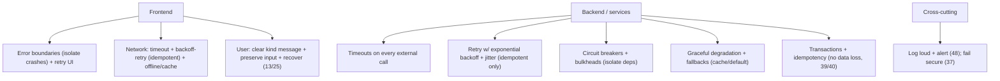
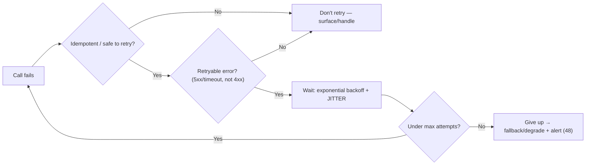

# 58 — Error Handling & Resilience

### Designing for When Things Go Wrong (Because They Will)

> *"The question is never whether things will fail — networks drop, services time out, inputs are malformed, disks fill. The question is whether your system fails like a cliff or like a trampoline. Resilience is choosing the trampoline, on purpose, everywhere."*

---

**Chapter type:** Extended Capability (Engineering)
**DRI:** Backend Architect + Frontend Architect + Software Architect
**Depends on:** [`00-CONSTITUTION.md`](./00-CONSTITUTION.md), [`13`](./13-FORM_DESIGN.md), [`25`](./25-COPYWRITING.md), [`30`](./30-REACT_GUIDE.md), [`40`](./40-API_DESIGN.md), [`43`](./43-CLEAN_CODE.md)
**Feeds:** [`48-MONITORING.md`](./48-MONITORING.md), [`59-INCIDENT_RESPONSE.md`](./59-INCIDENT_RESPONSE.md)

---

## Table of Contents
1. [Purpose](#1-purpose)
2. [Philosophy](#2-philosophy)
3. [Principles](#3-principles)
4. [Best Practices](#4-best-practices)
5. [Anti-Patterns](#5-anti-patterns)
6. [Real-World Examples](#6-real-world-examples)
7. [Common Mistakes](#7-common-mistakes)
8. [AI Implementation Guidance](#8-ai-implementation-guidance)
9. [Human Review Checklist](#9-human-review-checklist)
10. [Automation Opportunities](#10-automation-opportunities)
11. [References for Further Study](#11-references-for-further-study)
12. [Review Checklist & Measurable Quality Criteria](#12-review-checklist--measurable-quality-criteria)

---

## 1. Purpose

This chapter defines how the studio **handles errors and builds resilience** — so software degrades gracefully instead of collapsing when (not if) something fails. It spans the full stack: frontend error handling (error boundaries, network failures, user-facing messages), backend resilience (retries, timeouts, circuit breakers, graceful degradation), and the failure-handling patterns that keep a system standing under adverse conditions.

It complements error *messaging* in forms ([`13`](./13-FORM_DESIGN.md)) and copy ([`25`](./25-COPYWRITING.md)), React error handling ([`30`](./30-REACT_GUIDE.md)), API error contracts ([`40`](./40-API_DESIGN.md)), and clean-code error handling ([`43`](./43-CLEAN_CODE.md)); and it feeds monitoring ([`48`](./48-MONITORING.md)) and incident response ([`59`](./59-INCIDENT_RESPONSE.md)). Governing ethics: Article III (no data loss, fail securely), Article II (correctness/usability under failure), and Article I (the user's outcome must survive a bad network).

---

## 2. Philosophy

**Failure is a design input, not an edge case to handle later.** Distributed systems, networks, third parties, disks, and users all fail constantly — timeouts, drops, malformed data, race conditions, outages are the *normal operating environment*, not exceptional. Software that only works when everything works is software that mostly doesn't work. We design for failure *from the start*: every network call can fail, every dependency can be down, every input can be malformed — and the design specifies what happens then ([`04`](./04-DESIGN_PHILOSOPHY.md) P6 "design the states," extended to failure states).

**Degrade gracefully — fail like a trampoline, not a cliff.** The goal isn't zero failures (impossible); it's ensuring failures are *contained, recoverable, and gentle*. When a non-critical service is down, the feature that needs it degrades (shows cached data, a fallback, a clear message) while the rest of the app keeps working — rather than one failure white-screening everything. Resilience is about *blast-radius containment*: one component's failure must not become the whole system's failure ([`41`](./41-CODE_ARCHITECTURE.md) boundaries applied to failure).

**Fail loud to operators, gentle to users, and never lose data.** Three audiences, three behaviors. **Operators** need failures surfaced *loudly* — logged, alerted, traceable ([`48`](./48-MONITORING.md)) — never swallowed silently ([`43`](./43-CLEAN_CODE.md)). **Users** need failures handled *gently* — a clear, kind, actionable message and a way forward, never a stack trace or a dead end ([`13`](./13-FORM_DESIGN.md), [`25`](./25-COPYWRITING.md)). And **data** must *never* be lost or corrupted by a failure (Article III) — a failed operation leaves the system in a consistent state, and the user's in-progress work survives.

**Retries and resilience patterns are powerful and dangerous — wield them deliberately.** Retrying a failed call is often right — but a naive retry storm can turn a blip into an outage (a "retry storm" that DDoSes your own recovering service). Resilience patterns (retry-with-backoff-and-jitter, timeouts, circuit breakers, idempotency, bulkheads) are *disciplined* tools with rules, not reflexes. Applied thoughtfully they contain failure; applied carelessly they *amplify* it (Article VIII — earn the complexity; use the proven pattern correctly).

---

## 3. Principles

### Principle 1 — Design for failure from the start
Assume every call/dependency/input can fail; specify the behavior when it does.
> *Rationale ([`04`](./04-DESIGN_PHILOSOPHY.md) P6):* Failure is the normal environment, not an edge case.

### Principle 2 — Degrade gracefully; contain the blast radius
Non-critical failures degrade locally; one component's failure ≠ whole-app failure.
> *Rationale ([`41`](./41-CODE_ARCHITECTURE.md)):* Containment turns cliffs into trampolines.

### Principle 3 — Fail loud to operators, gentle to users
Log/alert every real failure ([`48`](./48-MONITORING.md)); show users clear, kind, actionable messages ([`25`](./25-COPYWRITING.md)) — never stack traces or dead ends.
> *Rationale (Art. VI, I):* Different audiences, different needs.

### Principle 4 — Never lose or corrupt data on failure
Failed operations leave a consistent state; user work is preserved; use transactions/idempotency.
> *Rationale (Art. III, [`39`](./39-DATABASE_DESIGN.md)):* Data safety is the floor.

### Principle 5 — Fail securely
Errors reveal nothing sensitive (no stack traces/SQL/secrets to users); deny by default on failure.
> *Rationale (Art. III, [`37`](./37-SECURITY.md)):* Verbose failure = attacker's map.

### Principle 6 — Retry wisely (backoff + jitter + idempotency); always time out
No naive retry storms; only retry idempotent/safe operations; bound everything with timeouts.
> *Rationale:* Careless retries amplify outages; hung calls exhaust resources.

### Principle 7 — Isolate failures (circuit breakers, bulkheads, fallbacks)
Stop cascading failures; give failing dependencies room to recover; provide fallbacks.
> *Rationale:* One slow/broken dependency shouldn't take down everything.

### Principle 8 — Handle errors explicitly; never swallow silently
Every error is caught, handled meaningfully, or deliberately propagated ([`43`](./43-CLEAN_CODE.md)).
> *Rationale ([`43`](./43-CLEAN_CODE.md)):* Swallowed errors are invisible, compounding bugs.

### Principle 9 — Recover: preserve state, offer retry, support offline/resume
Users can retry without re-doing work; interrupted flows resume ([`29`](./29-USER_FLOWS.md), [`13`](./13-FORM_DESIGN.md)).
> *Rationale (Art. I):* Recovery is the user-facing measure of resilience.

---

## 4. Best Practices

### 4.1 The resilience map (defense in depth against failure)


### 4.2 Frontend error handling ([`30`](./30-REACT_GUIDE.md), [`13`](./13-FORM_DESIGN.md), [`25`](./25-COPYWRITING.md))
- **Error boundaries** around risky subtrees so one component's crash doesn't white-screen the app — with a sensible fallback UI + a way to recover ([`30`](./30-REACT_GUIDE.md)); Next.js `error.tsx`/`global-error` ([`31`](./31-NEXTJS_GUIDE.md)).
- **Network failures:** every fetch has a **timeout**, a **loading/error/empty state** ([`04`](./04-DESIGN_PHILOSOPHY.md) P6), **retry** (for idempotent GETs), and offline/cached fallback where valuable (a data lib like TanStack Query handles retry/stale/cache well, [`30`](./30-REACT_GUIDE.md)).
- **Preserve user input** across failures ([`13`](./13-FORM_DESIGN.md)) — a failed submit never loses the form.
- **User-facing messages:** clear, kind, actionable, non-blaming, no stack traces ([`25`](./25-COPYWRITING.md)); offer the next step (retry/contact/go back).

### 4.3 Timeouts (Principle 6 — the most-forgotten resilience control)
**Every** call to something you don't control (network, DB, external API, even internal services) has a **timeout**. A call with no timeout can hang forever, exhaust connections/threads, and cascade into an outage. Set sensible per-operation timeouts; treat a timeout as a failure to handle (retry/fallback/degrade).

### 4.4 Retries — done right (Principle 6)

- **Only retry idempotent/safe** operations (or use **idempotency keys**, [`40`](./40-API_DESIGN.md)) — retrying a non-idempotent POST duplicates charges/records.
- **Exponential backoff + jitter** (not fixed-interval, not immediate) — prevents synchronized retry storms that DDoS your recovering service.
- **Cap attempts**; distinguish retryable (5xx, timeout, network) from non-retryable (4xx) errors.

### 4.5 Circuit breakers, bulkheads & graceful degradation (Principle 2, 7)
- **Circuit breaker:** after N failures to a dependency, "open" the circuit (stop calling it, fail fast / use fallback) for a cooldown, then test — gives the failing service room to recover and stops your app hammering it/hanging on it.
- **Bulkheads:** isolate resources (separate connection pools/queues per dependency) so one saturated dependency can't starve the rest (a compartmentalized ship doesn't sink from one breach).
- **Graceful degradation:** when a non-critical dependency is down, degrade *that feature* (cached/stale data, a default, "temporarily unavailable") while the core app works — don't fail the whole request.
- **Fallbacks:** cached values, sensible defaults, or a reduced experience.

### 4.6 Data integrity under failure (Principle 4, [`39`](./39-DATABASE_DESIGN.md), [`40`](./40-API_DESIGN.md))
- **Transactions** for multi-step writes (all-or-nothing) — a failure mid-way leaves a consistent state, not half-written data.
- **Idempotency keys** for critical writes so retries don't duplicate ([`40`](./40-API_DESIGN.md)).
- Beware **distributed** consistency (no cross-service transactions) — use patterns like the outbox/saga where needed; design for **at-least-once** delivery (make consumers idempotent).
- **Never** leave the user's data lost/corrupted by a failure (Art. III).

### 4.7 Error handling in code (Principle 8, [`43`](./43-CLEAN_CODE.md), [`32`](./32-TYPESCRIPT_GUIDE.md))
- **Never swallow** (`catch {}`) — handle, translate, or rethrow with context ([`43`](./43-CLEAN_CODE.md)).
- **Model expected failures with types** (discriminated unions / Result types, [`32`](./32-TYPESCRIPT_GUIDE.md)); reserve exceptions for the exceptional.
- **Validate inputs at boundaries** (bad input is a failure to handle, not a crash, [`32`](./32-TYPESCRIPT_GUIDE.md)/[`37`](./37-SECURITY.md)).
- **Log with context + correlation IDs** ([`48`](./48-MONITORING.md)); classify errors (expected vs. unexpected; user vs. system).

### 4.8 Recovery & the user (Principle 9, [`29`](./29-USER_FLOWS.md), [`13`](./13-FORM_DESIGN.md))
- **Retry without re-work:** preserved state + a retry button beats "start over."
- **Resume interrupted flows** (checkout/onboarding survive a dropped connection, [`29`](./29-USER_FLOWS.md)).
- **Offline tolerance** where valuable: queue actions, sync on reconnect, show clear offline state.
- **Dead-end-free:** every error state has a way forward ([`29`](./29-USER_FLOWS.md), [`26`](./26-USER_EXPERIENCE.md)).

### 4.9 Test the failures (chaos + fault injection, [`44`](./44-TESTING.md))
Failure paths are the *least-tested and most-important* code. **Test them explicitly:** simulate network failures/timeouts (MSW, [`44`](./44-TESTING.md)), dependency outages, malformed responses, and slow responses; assert graceful degradation + no data loss. For critical systems, **chaos engineering** (deliberately injecting failures in staging/prod-safely) verifies resilience holds under real conditions.

---

## 5. Anti-Patterns

| Anti-pattern | Why it fails | Principle |
| --- | --- | --- |
| **Only the happy path** (no failure states) | Real failures white-screen/break in prod. | P1 |
| **One failure kills everything** (no isolation) | Cliff, not trampoline. | P2, P7 |
| **Silent catch** (`catch {}`) | Invisible, compounding bugs. | P8 |
| **Stack traces / SQL to users** | Info leak + confusing dead end. | P3, P5 |
| **No timeouts** | Hung calls exhaust resources; cascade. | P6 |
| **Naive retries** (immediate, fixed, non-idempotent) | Retry storms; duplicate charges. | P6 |
| **Retrying 4xx / non-idempotent writes** | Pointless / harmful duplication. | P6 |
| **No circuit breaker/bulkhead** | One slow dep hangs/collapses everything. | P7 |
| **Data loss/corruption on failure** | Violates the floor. | P4, Art. III |
| **Losing user input on error** | Betrayal; abandonment. | P9, [`13`](./13-FORM_DESIGN.md) |
| **Dead-end error states** | User stuck; no way forward. | P9 |
| **Untested failure paths** | Resilience assumed, not verified. | 4.9 |

---

## 6. Real-World Examples

### Example A — The missing timeout that caused an outage
A service called an external API with **no timeout**. When that API slowed to a crawl (not even down — just slow), every request hung waiting, the connection pool exhausted, and the *entire* app went down — a total outage caused by a *partial* dependency slowdown. Adding **timeouts + a circuit breaker + a cached fallback** (Principles 6, 7) meant the slow dependency now fails fast and degrades that one feature while everything else keeps working. *No timeout = a single slow dependency can take down everything.*

### Example B — The retry storm that DDoS'd their own service
A service retried failed calls **immediately, with no backoff, no jitter, no cap**. When a downstream service had a brief blip, thousands of clients retried in perfect synchronization the instant it started recovering — instantly overwhelming it again, turning a 2-second blip into a 20-minute outage. Switching to **exponential backoff + jitter + capped attempts** (Principle 6, §4.4) let the service recover. *Careless retries amplify failures; disciplined ones contain them.*

### Example C — Error boundary + preserved state saved the UX
A single misbehaving widget (a third-party chart that threw on bad data) **white-screened the entire app** — users lost everything they were doing. Wrapping risky subtrees in **error boundaries** ([`30`](./30-REACT_GUIDE.md), Principle 2) meant that widget now shows a small "couldn't load this" fallback while the rest of the app — and the user's in-progress work ([`13`](./13-FORM_DESIGN.md), Principle 9) — stays intact. *Contain the blast radius; one component's crash isn't the app's crash.*

---

## 7. Common Mistakes

- **Designing only the happy path** (no failure/error/empty states).
- **No timeouts** on network/DB/external calls.
- **Naive retries** (immediate/fixed/no jitter/no cap) or retrying non-idempotent writes.
- **Silent `catch {}`** / swallowing errors.
- **Leaking stack traces/SQL/secrets** to users.
- **No failure isolation** (no error boundaries / circuit breakers / bulkheads).
- **Losing user data or input** on failure.
- **Dead-end error states** with no recovery path.
- **Not testing failure paths** (chaos/fault injection).

---

## 8. AI Implementation Guidance

### 8.1 Where agents help
- **Add failure handling**: error boundaries, timeouts, backoff-retry (idempotent-only), fallbacks, graceful degradation.
- **Write user-facing error messages** (clear/kind/actionable, [`25`](./25-COPYWRITING.md)) + operator logging with context ([`48`](./48-MONITORING.md)).
- **Add transactions/idempotency** for data-safe writes ([`39`](./39-DATABASE_DESIGN.md)/[`40`](./40-API_DESIGN.md)).
- **Generate failure-path tests** (simulated timeouts/outages/malformed data, [`44`](./44-TESTING.md)).
- **Audit** for missing timeouts, naive retries, silent catches, leaked errors, missing isolation, data-loss risk, dead-end states.

### 8.2 Hard rules (Art. III, II, [`43`](./43-CLEAN_CODE.md))
- The agent designs **failure states**, not just the happy path; every external call gets a **timeout** and a defined failure behavior.
- **Never swallows errors silently**; handles/translates/rethrows with context; **never leaks stack traces/SQL/secrets** to users (fails securely, [`37`](./37-SECURITY.md)).
- **Retries only idempotent/safe operations, with exponential backoff + jitter + a cap** — never naive/immediate retries, never retries 4xx or non-idempotent writes without idempotency keys.
- **No data loss/corruption on failure** — uses transactions/idempotency; **preserves user input**; provides a **recovery path** (retry-without-rework, resume) — no dead ends (Art. III).
- **Isolates failures** (error boundaries; circuit breakers/bulkheads/fallbacks where warranted) so one failure doesn't cascade.
- **Logs loud + provides gentle user messaging**; **tests failure paths** ([`44`](./44-TESTING.md)).

### 8.3 Prompt example — make a feature resilient
```
ROLE: Backend + Frontend Architect, bound by 00-CONSTITUTION + 58 (+30/40/39/25/48).
TASK: Make <feature/flow> resilient to failure.
CONSTRAINTS:
  - Every external call: timeout + defined failure behavior. Retry ONLY idempotent ops with
    exponential backoff + jitter + cap; idempotency keys for critical writes (40).
  - Frontend: error boundary + loading/error/empty states; preserve user input; retry-without-rework; offline/cache where useful.
  - Degrade gracefully (fallback/cached/default) when non-critical deps fail; circuit-breaker risky deps.
  - Data safety: transactions / consistent state on failure; NO data loss (Art. III).
  - Fail loud to operators (log w/ context + correlation, 48); gentle + actionable to users (25); no stack traces/secrets (37).
OUTPUT: implementation + failure-behavior table (per dependency) + user messages + failure-path tests (44).
```

### 8.4 Prompt example — audit
```
TASK: Audit for resilience gaps: missing timeouts, naive/immediate/non-idempotent retries, silent catches,
stack-traces/SQL/secrets leaked to users, no error boundaries/circuit breakers, data-loss/corruption risk on
failure, lost user input, dead-end error states, and untested failure paths. Output {location, risk, fix},
prioritizing data-safety + cascade risk.
```

---

## 9. Human Review Checklist

- [ ] **Failure states designed** (network/dependency/input failure), not just the happy path.
- [ ] **Every external call has a timeout** and a defined failure behavior.
- [ ] **Retries are disciplined** (idempotent-only, exponential backoff + jitter + cap; idempotency keys for critical writes); no naive retries / no retrying 4xx.
- [ ] **Failures isolated** (error boundaries; circuit breakers/bulkheads/fallbacks) — one failure doesn't cascade/white-screen.
- [ ] **Graceful degradation** for non-critical dependency failures (cached/default/"unavailable").
- [ ] **No data loss/corruption** on failure (transactions/idempotency, consistent state) ([`39`](./39-DATABASE_DESIGN.md), Art. III).
- [ ] Errors are **handled explicitly** (no silent catches); expected failures **typed** ([`43`](./43-CLEAN_CODE.md), [`32`](./32-TYPESCRIPT_GUIDE.md)).
- [ ] **Fail loud to operators** (logged w/ context + alerting, [`48`](./48-MONITORING.md)); **gentle to users** (clear/kind/actionable, no stack traces/secrets, [`25`](./25-COPYWRITING.md)/[`37`](./37-SECURITY.md)).
- [ ] **Recovery paths** exist (retry-without-rework, resume, offline where valuable); **no dead ends** ([`29`](./29-USER_FLOWS.md)).
- [ ] **Failure paths are tested** (simulated timeouts/outages/malformed data; chaos where critical) ([`44`](./44-TESTING.md)).

---

## 10. Automation Opportunities

| Task | Automation |
| --- | --- |
| Timeout lint | Flag network/DB/external calls lacking timeouts. |
| Retry-pattern lint | Detect naive retries / retries of non-idempotent ops. |
| Silent-catch lint | Flag empty catch blocks ([`43`](./43-CLEAN_CODE.md)). |
| Error-leak scan | Detect stack traces/SQL/secrets in user-facing responses ([`37`](./37-SECURITY.md)). |
| Failure-path tests | Simulated timeouts/outages/malformed responses in CI (MSW/fault injection) ([`44`](./44-TESTING.md)). |
| Chaos engineering | Scheduled fault injection in staging/prod-safely (Gremlin/Chaos-Mesh-style). |
| Data-integrity tests | Assert consistent state + no loss on simulated mid-operation failure. |
| Resilience monitoring | Alert on timeout/error/circuit-breaker-open rates ([`48`](./48-MONITORING.md)). |

---

## 11. References for Further Study
- **Resilience patterns:** *Release It!* (Michael Nygard) — circuit breakers, bulkheads, timeouts, stability patterns; Netflix Hystrix/resilience4j concepts.
- **Retries/backoff:** exponential-backoff-with-jitter literature (AWS Architecture blog); idempotency-key patterns ([`40`](./40-API_DESIGN.md)).
- **Distributed data:** *Designing Data-Intensive Applications* (Kleppmann) — failure, consistency, at-least-once, outbox/saga.
- **Chaos engineering:** Principles of Chaos Engineering; Netflix Chaos Monkey.
- **Cross-references:** [`13-FORM_DESIGN.md`](./13-FORM_DESIGN.md), [`25-COPYWRITING.md`](./25-COPYWRITING.md), [`30-REACT_GUIDE.md`](./30-REACT_GUIDE.md), [`39-DATABASE_DESIGN.md`](./39-DATABASE_DESIGN.md), [`40-API_DESIGN.md`](./40-API_DESIGN.md), [`43-CLEAN_CODE.md`](./43-CLEAN_CODE.md), [`44-TESTING.md`](./44-TESTING.md), [`48-MONITORING.md`](./48-MONITORING.md), [`59-INCIDENT_RESPONSE.md`](./59-INCIDENT_RESPONSE.md).

---

## 12. Review Checklist & Measurable Quality Criteria

| Criterion | Target |
| --- | --- |
| External calls with timeouts | 100% |
| Retries using backoff+jitter, idempotent-only | 100% |
| Silent catch blocks / errors leaking internals to users | 0 |
| Data loss/corruption on failure | 0 (floor, Art. III) |
| User input preserved on failure | 100% |
| Critical flows with recovery/resume (no dead ends) | 100% |
| Failure paths covered by tests | ≥ critical paths |
| Blast-radius containment (one failure ≠ whole-app failure) | Yes |
| MTTR / cascade incidents | ↓ trend ([`48`](./48-MONITORING.md)/[`59`](./59-INCIDENT_RESPONSE.md)) |

---

*End of `58-ERROR_HANDLING_AND_RESILIENCE.md`.*
