# 59 — Incident Response

### Handling Production Emergencies Calmly and Learning From Them

> *"An incident is not the failure. The failure is being unprepared for it — no plan, no roles, no rollback, and a blameful post-mortem that teaches everyone to hide the next one. Prepare for the fire before it starts."*

---

**Chapter type:** Extended Capability (Operations)
**DRI:** Backend Architect + Engineering Leads + SRE-minded ownership
**Depends on:** [`00-CONSTITUTION.md`](./00-CONSTITUTION.md), [`37`](./37-SECURITY.md), [`45`](./45-QA.md), [`47`](./47-DEPLOYMENT.md), [`48`](./48-MONITORING.md), [`58`](./58-ERROR_HANDLING_AND_RESILIENCE.md)
**Feeds:** [`50-CONTINUOUS_IMPROVEMENT.md`](./50-CONTINUOUS_IMPROVEMENT.md), [`49-MAINTENANCE.md`](./49-MAINTENANCE.md)

---

## Table of Contents
1. [Purpose](#1-purpose)
2. [Philosophy](#2-philosophy)
3. [Principles](#3-principles)
4. [Best Practices](#4-best-practices)
5. [Anti-Patterns](#5-anti-patterns)
6. [Real-World Examples](#6-real-world-examples)
7. [Common Mistakes](#7-common-mistakes)
8. [AI Implementation Guidance](#8-ai-implementation-guidance)
9. [Human Review Checklist](#9-human-review-checklist)
10. [Automation Opportunities](#10-automation-opportunities)
11. [References for Further Study](#11-references-for-further-study)
12. [Review Checklist & Measurable Quality Criteria](#12-review-checklist--measurable-quality-criteria)

---

## 1. Purpose

This chapter defines how the studio **responds to production incidents** — outages, security breaches, data issues, severe degradations — calmly, quickly, and in a way that turns each emergency into durable learning. It covers preparation (roles, runbooks, on-call), the live response (detect → mitigate → communicate → resolve), severity classification, communication (internal + external), and the blameless post-mortem that closes the loop.

Incident response is the *acute* companion to monitoring ([`48`](./48-MONITORING.md), which detects), resilience ([`58`](./58-ERROR_HANDLING_AND_RESILIENCE.md), which reduces incidents), deployment ([`47`](./47-DEPLOYMENT.md), which enables rollback/mitigation), QA ([`45`](./45-QA.md), whose blameless-post-mortem practice this extends), security ([`37`](./37-SECURITY.md), for breaches), and continuous improvement ([`50`](./50-CONTINUOUS_IMPROVEMENT.md), where learnings become ratchets). Governing ethics: Article III (protect users/data first), Article X (learn from evidence, blamelessly), Article XII/culture (no blame).

---

## 2. Philosophy

**Incidents are inevitable; being unprepared is a choice.** No matter how good your resilience ([`58`](./58-ERROR_HANDLING_AND_RESILIENCE.md)) and testing ([`44`](./44-TESTING.md)), production *will* break — a bad deploy, a dependency outage, a novel edge case, an attack. The mature stance isn't hoping it won't happen; it's being *ready* when it does: defined roles, runbooks, fast rollback, and practiced calm. An incident handled by a prepared team is a blip; the same incident handled by a panicked, role-less team is a prolonged, damaging outage. **Preparation is the difference.**

**Mitigate first; diagnose later.** In a live incident, the instinct to fully understand *why* before acting is often wrong — while you investigate, users keep suffering and data keeps being at risk. The priority order is **stop the bleeding first** (roll back, flip a feature flag off, fail over, [`47`](./47-DEPLOYMENT.md)), *then* find the root cause once users are safe. Restoring service is the emergency; understanding it is the follow-up. (This is why fast rollback [`47`](./47-DEPLOYMENT.md) and kill-switches are built beforehand.)

**Calm, coordinated, and communicated beats heroic and chaotic.** Incidents are stressful, and stress produces chaos: multiple people making conflicting changes, no one owning the response, stakeholders in the dark, and well-meaning "heroes" making it worse. A structured response — one clear **incident commander**, defined roles, a single source of truth, and steady communication — resolves faster and safer than uncoordinated heroics. Structure *reduces* panic; it's a gift to the people in the fire.

**Blameless, always — or the next incident happens in the dark.** The single most important cultural rule of incident response: **blame the system, never the person** (extending [`45`](./45-QA.md)/[`50`](./50-CONTINUOUS_IMPROVEMENT.md), Article X). When people fear blame, they hide mistakes, delay reporting incidents, and don't surface the near-misses that could prevent the next one. A blameless culture asks "what about our systems, processes, and safeguards allowed this?" — which produces real fixes. Punishing the engineer who tripped over a missing guardrail guarantees the guardrail stays missing.

---

## 3. Principles

### Principle 1 — Prepare before the fire (roles, runbooks, on-call, rollback)
Have an incident process, defined roles, runbooks, and fast rollback ready *before* you need them.
> *Rationale:* Unprepared response turns blips into outages.

### Principle 2 — Mitigate first, diagnose second
Stop user/data harm immediately (rollback/flag-off/failover); root-cause after service is restored.
> *Rationale (Art. III):* Users' safety outranks your curiosity.

### Principle 3 — One incident commander; clear roles; one source of truth
A single coordinator; defined responsibilities; a shared channel/doc — no conflicting heroics.
> *Rationale:* Coordination beats chaos under stress.

### Principle 4 — Classify severity; respond proportionally
A severity scale drives urgency, who's paged, and communication cadence.
> *Rationale ([`45`](./45-QA.md)):* Not every incident is all-hands; some are.

### Principle 5 — Communicate clearly (internal + honest external)
Keep responders + stakeholders informed; be honest and timely with affected users; no cover-ups.
> *Rationale (Art. I, III):* Silence + spin destroy trust; honesty preserves it.

### Principle 6 — Protect users and data first (esp. security incidents)
User safety, data integrity, and containment (for breaches) take priority ([`37`](./37-SECURITY.md), Art. III).
> *Rationale (Art. III):* The floor governs, even in a crisis.

### Principle 7 — Every significant incident → a blameless post-mortem → a ratchet
Systemic root cause + concrete preventions; never blame individuals ([`50`](./50-CONTINUOUS_IMPROVEMENT.md)).
> *Rationale (Art. X, [`50`](./50-CONTINUOUS_IMPROVEMENT.md)):* Learn once; never repeat.

### Principle 8 — Practice: drills, game-days, and up-to-date runbooks
Rehearse incidents; keep runbooks/contacts current; a plan never practiced fails under stress.
> *Rationale ([`58`](./58-ERROR_HANDLING_AND_RESILIENCE.md) chaos):* Preparedness is a skill, not a document.

---

## 4. Best Practices

### 4.1 The incident lifecycle

```mermaid
flowchart LR
    A["DETECT<br/>alert/monitor/report (48)"] --> B["DECLARE + classify severity; assign Incident Commander"]
    B --> C["MITIGATE first<br/>rollback / flag-off / failover (47) — stop the bleeding"]
    C --> D["COMMUNICATE<br/>internal channel + status page + stakeholders (5)"]
    D --> E["RESOLVE root cause"]
    E --> F["RECOVER + verify<br/>confirm healthy (48); all-clear"]
    F --> G["BLAMELESS POST-MORTEM → ratchet (50)"]
    G -.preventions.-> H["Resilience/tests/checks/runbooks (58/44/48)"]
```


### 4.2 Prepare (before anything happens — Principle 1, 8)
- **On-call rotation** (sustainable, clear, with escalation); everyone knows how to reach the right people.
- **Runbooks** for likely failures (how to diagnose + mitigate a DB outage, a bad deploy, a spiking error rate) — concrete, current, tested ([`48`](./48-MONITORING.md), [`58`](./58-ERROR_HANDLING_AND_RESILIENCE.md)).
- **Fast rollback + kill-switches** built in advance ([`47`](./47-DEPLOYMENT.md)) — the primary mitigation tools.
- **Incident tooling:** paging/alerting ([`48`](./48-MONITORING.md)), a dedicated incident channel + doc template, a status page.
- **Defined roles** (below) and a **severity scale** everyone knows.
- **Drills / game-days:** practice incidents (and chaos engineering, [`58`](./58-ERROR_HANDLING_AND_RESILIENCE.md)) so the real one isn't the first time.

### 4.3 Incident roles (Principle 3)
| Role | Responsibility |
| --- | --- |
| **Incident Commander (IC)** | Owns the response; coordinates; makes decisions; keeps focus. *Not necessarily the most senior — the coordinator.* |
| **Operations/Responders** | Do the technical investigation + mitigation. |
| **Communications lead** | Internal updates + external/status-page comms (5). |
| **Scribe** | Records the timeline (facts, decisions, times) for the post-mortem. |
> Small incident? One person may hold multiple roles. Big one? Separate them. The key: **someone is clearly the IC** — no leaderless scrambles or conflicting fixes.

### 4.4 Severity classification (Principle 4, aligns with [`45`](./45-QA.md))
| Sev | Meaning | Response |
| --- | --- | --- |
| **SEV1 — Critical** | Full outage / data loss / security breach / core flow down for many | All-hands; IC; immediate; frequent comms |
| **SEV2 — Major** | Significant degradation; important feature down; many affected | Urgent; on-call + IC; regular comms |
| **SEV3 — Minor** | Limited impact; workaround exists | Handled in hours; normal comms |
| **SEV4 — Low** | Minor/cosmetic; little user impact | Backlog/next business day |
Severity drives *urgency, who's paged, and comms cadence* — declare it early (and re-classify as you learn).

### 4.5 Mitigate first (Principle 2, [`47`](./47-DEPLOYMENT.md), [`58`](./58-ERROR_HANDLING_AND_RESILIENCE.md))
The fastest safe path to *stop user/data harm*, usually **before** full diagnosis:
- **Roll back** the recent deploy (the most common cause — [`47`](./47-DEPLOYMENT.md)) — often the fastest fix.
- **Flip a feature flag off** to disable the broken feature ([`47`](./47-DEPLOYMENT.md)).
- **Fail over / scale / shed load / enable degraded mode** ([`58`](./58-ERROR_HANDLING_AND_RESILIENCE.md)).
- For **security incidents:** contain first (revoke credentials, isolate affected systems, block the vector) — [`37`](./37-SECURITY.md).
> Restore service, *then* investigate root cause with users safe. This is why rollback/kill-switches are built beforehand (Principle 1).

### 4.6 Communicate (Principle 5, Art. I/III)
- **Internal:** a single incident channel; the IC posts regular status updates (what we know, what we're doing, next update time) so responders + stakeholders aren't guessing.
- **External (honest + timely):** a **status page** and/or direct notice to affected users — acknowledge the issue, avoid over-promising, update as it progresses, confirm resolution. **No cover-ups, no spin** — honesty preserves trust; silence and denial destroy it (Art. I/III).
- **Security/data breaches:** additional obligations — legal/regulatory notification (GDPR 72-hour breach notification, etc.), careful disclosure ([`37`](./37-SECURITY.md)); involve legal.

### 4.7 Resolve, recover & verify (Principle 2, [`48`](./48-MONITORING.md))
Once mitigated, find + fix the root cause (or roll forward a verified patch, [`47`](./47-DEPLOYMENT.md)); then **verify recovery** with monitoring ([`48`](./48-MONITORING.md)) before declaring all-clear — an incident isn't over because the fix deployed; it's over when metrics confirm health. Communicate the resolution.

### 4.8 The blameless post-mortem (Principle 7, [`50`](./50-CONTINUOUS_IMPROVEMENT.md), [`45`](./45-QA.md))
For every significant incident (SEV1/2, and notable SEV3), within a few days:
1. **Timeline** (facts + times, from the scribe's notes) — what happened, when detected, when mitigated, when resolved.
2. **Impact** (users/data/business affected; duration).
3. **Root cause** — the *systemic* why (5-whys past the proximate cause); **never** "person X made a mistake" but "our system let a mistake reach production."
4. **What went well / poorly** in the *response* (detection speed, mitigation, comms) — improve the process too.
5. **Action items (the ratchet, [`50`](./50-CONTINUOUS_IMPROVEMENT.md)):** concrete, owned, tracked preventions — a regression test ([`44`](./44-TESTING.md)), a resilience pattern ([`58`](./58-ERROR_HANDLING_AND_RESILIENCE.md)), a better alert ([`48`](./48-MONITORING.md)), a runbook, a deploy guardrail ([`47`](./47-DEPLOYMENT.md)), or a chapter amendment ([`README`](./README.md)).
> **Blameless (the prime directive):** everyone acted reasonably with the information + tools they had; the fix is to the *system*. Blame → hidden incidents → repeat failures.

---

## 5. Anti-Patterns

| Anti-pattern | Why it fails | Principle |
| --- | --- | --- |
| **No incident plan** (improvise every time) | Slow, chaotic, prolonged outages. | P1 |
| **Diagnosing before mitigating** | Users/data keep suffering while you investigate. | P2 |
| **Leaderless scramble** (no IC; conflicting fixes) | Chaos; people undo each other. | P3 |
| **No severity classification** | Over/under-reacting; wrong urgency. | P4 |
| **Silence / cover-up / spin** with users | Destroys trust; sometimes illegal. | P5, Art. III |
| **Ignoring data/security priority** in a breach | Amplifies harm; legal exposure. | P6, [`37`](./37-SECURITY.md) |
| **No post-mortem** (or post-mortem-as-document) | Same incident recurs. | P7 |
| **Blameful post-mortem** ("whose fault?") | Hidden incidents; no learning; fear. | P7, Art. X |
| **Action items never done** | Preventions don't ship; recurrence. | P7 |
| **Hero culture** (one person saves the day, no system) | Fragile; unsustainable; no shared learning. | P3, [`50`](./50-CONTINUOUS_IMPROVEMENT.md) |
| **Runbooks/contacts stale; never drilled** | Plan fails under real stress. | P8 |

---

## 6. Real-World Examples

### Example A — Mitigate-first turned an outage into a blip
A deploy introduced a bug that broke checkout. The on-call engineer's instinct was to find and fix the bug — but that would take an hour while sales were lost. Following **mitigate-first** (Principle 2), they **rolled back the deploy** ([`47`](./47-DEPLOYMENT.md)) in two minutes, restoring checkout immediately, *then* investigated the root cause calmly with users safe. A prepared rollback path ([`47`](./47-DEPLOYMENT.md), Principle 1) turned a potential hour-long revenue outage into a two-minute blip. *Stop the bleeding first; diagnose second.*

### Example B — Structure beat the scramble
An early SEV1 was chaos: five engineers making simultaneous, conflicting changes; no one coordinating; stakeholders in the dark; two "fixes" that made it worse. After adopting **incident roles** (Principle 3) — one **Incident Commander** coordinating, responders investigating, a comms lead updating a status page, a scribe on the timeline — the *next* SEV1 resolved far faster and calmer. *One clear commander + defined roles beats heroic chaos every time.*

### Example C — The blameless post-mortem that prevented a class of outage
A SEV1 traced to an engineer deploying a migration that locked a table. A **blameful** response would've been "they should've known" — and the *real* problem (no automated check for locking migrations, no expand/contract requirement) would've stayed, guaranteeing recurrence. The **blameless post-mortem** (Principle 7, [`50`](./50-CONTINUOUS_IMPROVEMENT.md)) asked "what let this reach prod?" and produced ratchets: a migration linter, an expand/contract requirement ([`39`](./39-DATABASE_DESIGN.md)), and a deploy guardrail ([`47`](./47-DEPLOYMENT.md)). The class of incident never recurred — *and* the engineer, unblamed, surfaced two more latent risks. *Blameless produces truth; truth produces prevention.*

---

## 7. Common Mistakes

- **No incident plan / roles / runbooks** — improvising under maximum stress.
- **Investigating before mitigating** while users suffer.
- **No incident commander** (leaderless, conflicting fixes).
- **No severity scale** (wrong level of response).
- **Poor/dishonest communication** (silence, spin, or over-promising).
- **Neglecting data/security priorities** in a breach; missing legal notification.
- **Skipping post-mortems** or writing them as blameful documents.
- **Post-mortem action items that never ship** (no ratchet).
- **Hero culture** instead of systems; **stale, never-drilled** runbooks.

---

## 8. AI Implementation Guidance

### 8.1 Where agents help
- **During an incident (assist, human-led):** summarize telemetry/logs to surface likely causes, correlate to recent deploys ([`47`](./47-DEPLOYMENT.md)/[`48`](./48-MONITORING.md)), suggest mitigation options (rollback/flag-off), and draft status-page/stakeholder updates — as *proposals for the IC*.
- **Prepare:** generate runbooks, incident-doc/post-mortem templates, and severity/escalation guides.
- **Post-mortem:** draft the blameless timeline + systemic root cause (5-whys) + a concrete ratchet of preventions ([`50`](./50-CONTINUOUS_IMPROVEMENT.md)).
- **Audit** incident readiness (runbooks current? rollback fast? roles defined? drills happening?).

### 8.2 Hard rules (Art. III, X, XI)
- The agent's incident help is **advisory**; a **human Incident Commander decides and owns** the response ([`53`](./53-AI_COLLABORATION_PROTOCOL.md), Art. XI) — it never auto-executes mitigations/rollbacks on production without human authorization.
- It prioritizes **mitigate-first** (stop user/data harm) and, for breaches, **user/data safety + containment + required notification** ([`37`](./37-SECURITY.md), Art. III).
- Post-mortems it drafts are **strictly blameless** (systemic causes, never individual fault) and end in **owned, trackable preventions** (the ratchet, [`50`](./50-CONTINUOUS_IMPROVEMENT.md)) — not just a document (Art. X).
- External comms it drafts are **honest + timely** — no spin, cover-up, or over-promising (Art. I/III).
- It flags when **legal/regulatory notification** may be required (security/data incidents, [`37`](./37-SECURITY.md)).

### 8.3 Prompt example — incident assist (human-led)
```
ROLE: Incident-response assistant, bound by 00-CONSTITUTION + 59 (+47/48/58/37). ADVISORY ONLY — a human IC decides + owns.
INPUT: symptoms + recent deploys + telemetry/logs.
TASK:
  1. Classify likely severity (SEV1–4) + impact.
  2. Surface likely causes (correlate to recent deploys/changes 47/48); label inference vs. evidence.
  3. Propose MITIGATION options first (rollback / flag-off / failover), ranked by speed + safety — for the IC to choose.
  4. Draft an internal status update + an honest external status-page message.
  5. If security/data: note containment steps + possible legal-notification obligations (37).
OUTPUT: severity + suspected causes + mitigation options + draft comms. Do NOT auto-execute anything.
```

### 8.4 Prompt example — blameless post-mortem
```
ROLE: bound by 00-CONSTITUTION + 59 (+50/45).
INPUT: incident timeline + telemetry.
TASK: Draft a BLAMELESS post-mortem: timeline (facts+times), impact, systemic root cause (5-whys — never
individual blame), what went well/poorly in the response, and a ratchet of concrete, owned, trackable
preventions (regression test 44 / resilience pattern 58 / better alert 48 / runbook / deploy guardrail 47 /
chapter amendment). Output the post-mortem + prevention plan. Focus on systems, never people.
```

---

## 9. Human Review Checklist

- [ ] An **incident plan** exists (roles, severity scale, runbooks, escalation) — prepared *before* incidents.
- [ ] **Fast rollback + kill-switches** are built and tested ([`47`](./47-DEPLOYMENT.md)); on-call + paging in place ([`48`](./48-MONITORING.md)).
- [ ] Response **mitigates first** (stop harm), diagnoses second.
- [ ] A single **Incident Commander** + clear roles + one source of truth (no leaderless scrambles).
- [ ] **Severity classified** early; response proportional.
- [ ] Communication is **clear internally + honest/timely externally** (status page; no spin/cover-up).
- [ ] **User/data safety prioritized** (breaches: containment + legal notification) ([`37`](./37-SECURITY.md), Art. III).
- [ ] **Recovery verified** via monitoring before all-clear ([`48`](./48-MONITORING.md)).
- [ ] A **blameless post-mortem** was done (systemic root cause) with **owned, tracked preventions** (ratchet) ([`50`](./50-CONTINUOUS_IMPROVEMENT.md)).
- [ ] Runbooks kept **current** and the process is **drilled**; no reliance on heroics.

---

## 10. Automation Opportunities

| Task | Automation |
| --- | --- |
| Detection → paging | Alerting + on-call paging (PagerDuty/Opsgenie-style) from monitoring ([`48`](./48-MONITORING.md)). |
| Incident tooling | Auto-create incident channel + doc from a template; declare/track severity; timeline capture. |
| Mitigation | One-click / health-check-triggered rollback + feature-flag kill-switches ([`47`](./47-DEPLOYMENT.md)). |
| Comms | Status-page automation; templated stakeholder updates. |
| Post-mortem | Auto-assemble timeline from logs/deploys; template + action-item tracking to done ([`50`](./50-CONTINUOUS_IMPROVEMENT.md)). |
| Metrics | Track MTTD/MTTR, incident frequency/severity trends ([`48`](./48-MONITORING.md), [`50`](./50-CONTINUOUS_IMPROVEMENT.md)). |
| Drills | Scheduled game-days / chaos experiments ([`58`](./58-ERROR_HANDLING_AND_RESILIENCE.md)); runbook-freshness reminders. |

---

## 11. References for Further Study
- **SRE incident practice:** Google *SRE Book* / *SRE Workbook* (incident management, IC role, blameless post-mortems); PagerDuty Incident Response docs.
- **Post-mortems:** the blameless post-mortem culture (Etsy's "Blameless PostMortems and a Just Culture", John Allspaw); "5 whys"; the retrospective prime directive ([`50`](./50-CONTINUOUS_IMPROVEMENT.md)).
- **Preparedness:** *Release It!* (Nygard) + chaos engineering ([`58`](./58-ERROR_HANDLING_AND_RESILIENCE.md)); incident-command-system concepts adapted to software.
- **Security incidents:** NIST incident-handling guidance; breach-notification obligations (GDPR/CCPA) ([`37`](./37-SECURITY.md)).
- **Cross-references:** [`37-SECURITY.md`](./37-SECURITY.md), [`45-QA.md`](./45-QA.md), [`47-DEPLOYMENT.md`](./47-DEPLOYMENT.md), [`48-MONITORING.md`](./48-MONITORING.md), [`49-MAINTENANCE.md`](./49-MAINTENANCE.md), [`50-CONTINUOUS_IMPROVEMENT.md`](./50-CONTINUOUS_IMPROVEMENT.md), [`58-ERROR_HANDLING_AND_RESILIENCE.md`](./58-ERROR_HANDLING_AND_RESILIENCE.md).

---

## 12. Review Checklist & Measurable Quality Criteria

| Criterion | Target |
| --- | --- |
| Incident plan (roles/severity/runbooks/escalation) in place | Yes |
| Fast, tested rollback + kill-switches available | Yes ([`47`](./47-DEPLOYMENT.md)) |
| Incidents with a named Incident Commander | 100% |
| Response mitigates-first (before full diagnosis) | 100% |
| Honest, timely external comms during user-facing incidents | 100% |
| Security/data incidents meeting notification obligations | 100% |
| SEV1/2 incidents with a blameless post-mortem | 100% |
| Post-mortem action items completed (ratchet) | ≥ 90% |
| MTTD / MTTR | ↓ trend |
| Incident recurrence (same root cause) | trend → 0 |

---

*End of `59-INCIDENT_RESPONSE.md`.*
