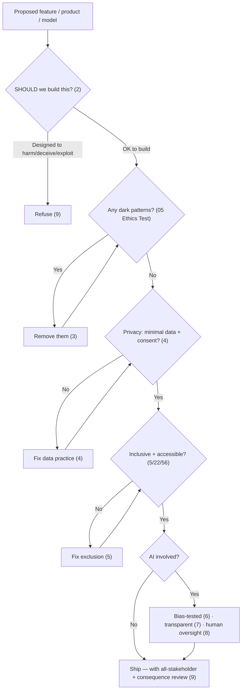

# 60 — Ethics & Responsible AI

### Building Software That Deserves the Trust It Asks For

> *"Just because you can build it doesn't mean you should. Every product shapes someone's choices, holds someone's data, and includes or excludes someone. Ethics is not a constraint on the work — it is the point of doing the work well."*

---

**Chapter type:** Extended Capability (Foundational / Cross-cutting)
**DRI:** Creative Director + Software Architect + AI Systems Designer (joint) — leadership-owned
**Depends on:** [`00-CONSTITUTION.md`](./00-CONSTITUTION.md) (esp. Articles I, III, XI), [`05`](./05-VISUAL_PSYCHOLOGY.md), [`22`](./22-ACCESSIBILITY.md), [`37`](./37-SECURITY.md), [`53`](./53-AI_COLLABORATION_PROTOCOL.md)
**Feeds:** every chapter — ethics is cross-cutting; it loops back to the Constitution

---

## Table of Contents
1. [Purpose](#1-purpose)
2. [Philosophy](#2-philosophy)
3. [Principles](#3-principles)
4. [Best Practices](#4-best-practices)
5. [Anti-Patterns](#5-anti-patterns)
6. [Real-World Examples](#6-real-world-examples)
7. [Common Mistakes](#7-common-mistakes)
8. [AI Implementation Guidance](#8-ai-implementation-guidance)
9. [Human Review Checklist](#9-human-review-checklist)
10. [Automation Opportunities](#10-automation-opportunities)
11. [References for Further Study](#11-references-for-further-study)
12. [Review Checklist & Measurable Quality Criteria](#12-review-checklist--measurable-quality-criteria)

---

## 1. Purpose

This chapter defines how the studio builds **ethically and responsibly** — covering both general software ethics (dark patterns, privacy, inclusion, honesty, accessibility, sustainability) and the specific responsibilities of building **with and around AI** (bias/fairness, transparency, human oversight, data consent, harmful-use prevention). It gathers the ethical threads woven through the entire manual into one explicit, actionable framework, and closes the loop back to the Constitution.

Ethics is not a new topic here — it's the *spine* of the whole manual: the Constitution's "craft is a moral act" (§2.1), Article I (the user is the point), Article III (the non-negotiable floor: security, accessibility, no dark patterns), Article XI (the Human–AI Compact), the Persuasion Ethics Test ([`05`](./05-VISUAL_PSYCHOLOGY.md)), honest copy ([`25`](./25-COPYWRITING.md)), consent ([`57`](./57-EMAIL_AND_NOTIFICATIONS.md)), privacy/security ([`37`](./37-SECURITY.md)), inclusion ([`22`](./22-ACCESSIBILITY.md)), and the AI collaboration protocol ([`53`](./53-AI_COLLABORATION_PROTOCOL.md)). This chapter makes that spine *visible and checkable* — a fitting final chapter, because it returns to the studio's first and deepest commitment: **quality is how we express respect for the people who use what we build** ([`00`](./00-CONSTITUTION.md) §2.1).

---

## 2. Philosophy

**Craft is a moral act.** (Restating the Constitution's founding belief, §2.1.) Software is not neutral: a slow page wastes a stranger's time, an inaccessible form excludes a disabled person from a service they're entitled to, a dark pattern manipulates someone against their interest, a breach exposes people who trusted us, a biased model denies someone a loan or a job. We hold a high ethical bar not out of piety but out of *obligation to the people on the other side of the screen*. Ethics isn't a layer on top of good work — good work *is* ethical work, and ethical lapses are quality failures with human victims.

**"Can we?" is an engineering question; "should we?" is the one that matters.** Capability is not permission. Every powerful thing the studio can build — a persuasive nudge, a data-collection pipeline, an AI that scores people, an engagement-maximizing loop — carries a *should-we* question that engineering can't answer. We ask it *deliberately, early, and out loud*, because the most damaging harms come from teams that only ever asked "can we?" and shipped. The willingness to *not build*, or to build differently, is a core studio competency (Article I, VIII).

**Consider everyone affected — not just the paying user.** A product's stakeholders extend far beyond the buyer: the vulnerable user, the person who *doesn't* fit the assumed profile, the gig worker on the other side of the marketplace, the community affected by what's optimized for, society at large. Ethical design widens the circle of consideration (Article I extended) — asking *who could this harm?*, *who does this exclude?*, *who bears the cost of what we optimize?* — and takes responsibility for the answers, including unintended consequences.

**AI raises the stakes: more power, more speed, more opacity — so more responsibility.** AI can help millions and harm millions faster than any prior technology, often *opaquely* (a biased model discriminates invisibly at scale; a hallucination misleads confidently; an optimization exploits a weakness no human designed). Building with AI therefore demands *extra* care: fairness testing, transparency about what's AI, human oversight of consequential decisions ([`53`](./53-AI_COLLABORATION_PROTOCOL.md), Article XI), consent for data use, and refusal to build harmful or manipulative systems. With greater capability comes greater duty — this is the responsible-AI half of the studio's ethics.

---

## 3. Principles

### Principle 1 — Craft is a moral act; ethics is quality
Ethical lapses are quality failures with human victims; hold the bar out of obligation.
> *Rationale ([`00`](./00-CONSTITUTION.md) §2.1):* Quality is respect for the user.

### Principle 2 — Ask "should we?", not just "can we?"
Deliberately question whether — and how — to build powerful/consequential things; be willing not to.
> *Rationale (Art. I, VIII):* Capability ≠ permission.

### Principle 3 — No dark patterns; honesty always (the floor)
No manipulation, deception, confirmshaming, fake urgency, hidden costs, or roach motels (Art. III, [`05`](./05-VISUAL_PSYCHOLOGY.md)).
> *Rationale (Art. III):* Manipulation crosses the non-negotiable floor.

### Principle 4 — Privacy by design; data minimization + consent
Collect the minimum, with clear consent, for stated purposes; protect it; honor deletion ([`37`](./37-SECURITY.md)).
> *Rationale (Art. III):* Data you don't hold can't be misused/leaked.

### Principle 5 — Inclusion & accessibility are ethical duties
Don't exclude by ability, language, culture, device, or assumption ([`22`](./22-ACCESSIBILITY.md), [`56`](./56-INTERNATIONALIZATION.md)).
> *Rationale (Art. III):* Exclusion is harm; the floor requires inclusion.

### Principle 6 — Fairness: test AI/algorithms for bias
Consequential automated decisions are tested for discriminatory impact across groups; mitigate.
> *Rationale (Art. I, X):* Biased systems harm real people at scale, invisibly.

### Principle 7 — Transparency & explainability (esp. AI)
Be honest about what's AI; explain consequential automated decisions; no deceptive AI.
> *Rationale (Art. VI):* People deserve to know + understand what affects them.

### Principle 8 — Meaningful human oversight of consequential decisions
A human is accountable for AI decisions affecting people's rights/opportunities/safety ([`53`](./53-AI_COLLABORATION_PROTOCOL.md), Art. XI).
> *Rationale (Art. XI):* Accountability can't be delegated to a system.

### Principle 9 — Refuse harm; consider all stakeholders + consequences
Decline to build systems designed to harm/deceive/exploit; weigh impact on all affected, incl. unintended.
> *Rationale (Art. I, III):* The willingness to refuse is a competency.

### Principle 10 — Sustainability & the long view
Consider environmental + societal cost (efficient software, [`35`](./35-PERFORMANCE.md); long-term effects) — build for a decade, responsibly.
> *Rationale (Art. II, IX):* Efficiency + longevity are also ethical.

---

## 4. Best Practices

### 4.1 The ethics gate (ask early, out loud)


### 4.2 General software ethics (the recurring threads, made checkable)
- **No dark patterns** (Principle 3): run the **Persuasion Ethics Test** ([`05`](./05-VISUAL_PSYCHOLOGY.md)) on every persuasive element; honest copy ([`25`](./25-COPYWRITING.md)); transparent pricing ([`19`](./19-ECOMMERCE_DESIGN.md)); easy cancellation ([`18`](./18-SAAS_DESIGN.md)); consented, leavable notifications ([`57`](./57-EMAIL_AND_NOTIFICATIONS.md)).
- **Privacy by design** (Principle 4, [`37`](./37-SECURITY.md)): minimize collection ([`13`](./13-FORM_DESIGN.md)); clear, specific consent (not pre-checked/bundled); purpose limitation; protect + encrypt; honor access/deletion/portability rights; no secret tracking.
- **Inclusion** (Principle 5): accessibility floor ([`22`](./22-ACCESSIBILITY.md)); inclusive language ([`25`](./25-COPYWRITING.md)); localization for real users ([`56`](./56-INTERNATIONALIZATION.md)); design for the edges, not just the assumed-typical user.
- **Honesty** (Principle 3, 7): truthful claims/charts ([`55`](./55-DATA_VISUALIZATION.md)), real social proof ([`17`](./17-LANDING_PAGE_DESIGN.md)), no fabrication ([`53`](./53-AI_COLLABORATION_PROTOCOL.md)).

### 4.3 Responsible AI — fairness & bias (Principle 6, [`53`](./53-AI_COLLABORATION_PROTOCOL.md))
For any AI/algorithm making or influencing **consequential decisions** about people (credit, hiring, moderation, pricing, ranking, eligibility):
- **Identify affected groups** and **test for disparate impact** across them (protected + relevant attributes) — bias hides in "neutral" models trained on biased data.
- **Examine training data** for representativeness + historical bias; document data provenance + limitations.
- **Mitigate** discovered bias (data, model, or decision-threshold changes); **re-test**.
- **Monitor in production** ([`48`](./48-MONITORING.md)) — models drift; fairness isn't a one-time check.
- Prefer **explainable** approaches for consequential decisions (Principle 7).

### 4.4 Responsible AI — transparency & oversight (Principles 7, 8, Art. XI)
- **Disclose AI:** be honest when users are interacting with AI or when AI generated content/decisions — no deceptive impersonation of humans.
- **Explainability:** for consequential automated decisions, provide a meaningful explanation + a path to **appeal / human review** ("your application was declined; here's why; request a human review").
- **Meaningful human oversight:** a human is accountable for AI decisions affecting rights/opportunities/safety ([`53`](./53-AI_COLLABORATION_PROTOCOL.md), Art. XI) — not a rubber-stamp, but genuine review with the power + information to override.
- **Provenance:** consider content authenticity/labeling for AI-generated media where deception is a risk.

### 4.5 Responsible AI — data & harmful-use (Principles 4, 9)
- **Data consent for AI:** use data to train/operate AI only with appropriate consent + rights; respect purpose limitation; be transparent about AI data use.
- **Refuse harmful use** (Principle 9): the studio doesn't build systems whose *purpose* is to deceive, manipulate, surveil illegitimately, discriminate, or harm — and designs guardrails against foreseeable misuse of what it does build.
- **Security of AI systems** ([`37`](./37-SECURITY.md)): guard against prompt injection, data exfiltration, and abuse; don't expose sensitive data to/through models.

### 4.6 Consider all stakeholders + consequences (Principle 9)
Before building consequential features, deliberately ask (a lightweight "consequence scan," pairs with the pre-mortem [`02`](./02-PRODUCT_STRATEGY.md)):
- **Who benefits, and who could be harmed** (incl. non-users, vulnerable groups, the other side of a marketplace)?
- **Who is excluded** by our assumptions?
- **What are we optimizing for, and who bears its cost?** (an engagement metric that harms wellbeing; a growth tactic that exploits.)
- **What's the worst-case misuse**, and can we design against it?
- **Unintended consequences** at scale?

### 4.7 Sustainability & the long view (Principle 10, [`35`](./35-PERFORMANCE.md), [`49`](./49-MAINTENANCE.md))
Efficient software uses less energy (performance [`35`](./35-PERFORMANCE.md) is also an environmental good — esp. at scale); build maintainable, long-lived systems ([`49`](./49-MAINTENANCE.md)) rather than disposable ones; consider the societal longevity of what you make (the manual's "good for the next 10 years" is an ethical aim, not just a technical one).

### 4.8 Governance: make ethics a decision, not an accident
- **Ethics review** for high-stakes features/products/models (a lightweight gate, not bureaucracy) — leadership-owned (Constitution amendments require leadership, [`00`](./00-CONSTITUTION.md) §12).
- **Empower dissent:** anyone can raise an ethical concern safely and stop-the-line on a clear floor breach (blameless culture, [`50`](./50-CONTINUOUS_IMPROVEMENT.md)/[`59`](./59-INCIDENT_RESPONSE.md)).
- **Document ethical decisions** (an ADR-style record for consequential should-we / trade-off calls, Art. VI/XII).
- **Feed ethics into continuous improvement** ([`50`](./50-CONTINUOUS_IMPROVEMENT.md)) — learn from ethical near-misses like any other.

---

## 5. Anti-Patterns

| Anti-pattern | Why it fails | Principle |
| --- | --- | --- |
| **"Can we?" without "should we?"** | Ships foreseeable harm. | P2 |
| **Dark patterns** (any) | Manipulation; crosses the floor. | P3, Art. III |
| **Growth/engagement at any cost** | Optimizes a metric by harming users. | P2, P9 |
| **Data maximization** ("collect everything") | Privacy risk; breach exposure; misuse. | P4 |
| **Consent theater** (pre-checked/bundled/buried) | Not real consent; often illegal. | P4 |
| **Excluding non-typical users** (a11y/i18n as optional) | Harm by exclusion. | P5, Art. III |
| **Unaudited AI on consequential decisions** | Invisible discrimination at scale. | P6 |
| **Deceptive AI** (impersonation; hidden AI) | Dishonest; erodes trust. | P7 |
| **Rubber-stamp "human oversight"** | Accountability theater. | P8, Art. XI |
| **Building harmful/exploitative systems** | Direct harm; reputational ruin. | P9 |
| **Ignoring stakeholders/consequences** | Unintended harm at scale. | P9 |
| **Ethics as PR** (statements, not practice) | Hollow; harm continues. | P1 |

---

## 6. Real-World Examples

### Example A — "Should we?" stopped a harmful feature
A team could build a feature that used behavioral data to detect and target users in vulnerable emotional states with upsells — technically impressive, and it would lift revenue. Asking **"should we?"** (Principle 2) surfaced the obvious: it exploited vulnerability for profit — a clear harm (Principle 9). **The studio declined to build it**, and instead built support-oriented features for those moments. *Capability wasn't permission; the willingness to not build was the ethical act.*

### Example B — The "neutral" model that discriminated
A hiring-screening model was "neutral" — it used no protected attributes. But trained on historical hiring data (which reflected past bias), it **learned to discriminate** via proxies (e.g. penalizing career gaps, certain schools), disadvantaging women and minority candidates invisibly, at scale. **Bias testing across groups** (Principle 6, §4.3) caught the disparate impact; the team examined the data, mitigated, re-tested, added ongoing monitoring ([`48`](./48-MONITORING.md)) and a human-review appeal path (Principles 7, 8). *"We don't use protected attributes" is not fairness — you must test for impact.*

### Example C — Privacy by design widened trust
A product's default was to collect everything "in case it's useful later." Applying **data minimization + consent** (Principle 4): collect only what each feature needs, with clear per-purpose consent (no pre-checked bundles), honor deletion, encrypt sensitive data ([`37`](./37-SECURITY.md)). Users trusted it more, the breach blast-radius shrank (less data to lose), and compliance got easier. *The data you don't collect can't be leaked, subpoenaed, or misused — minimization is both ethical and pragmatic.*

---

## 7. Common Mistakes

- **Asking only "can we?"** and never "should we?"
- **Shipping dark patterns** because they lift a metric.
- **Optimizing engagement/growth** without asking who it harms.
- **Collecting maximal data** "just in case"; **consent theater.**
- **Treating accessibility/inclusion/i18n as optional.**
- **Deploying consequential AI without bias testing** (assuming "neutral" = fair).
- **Deceptive AI** (hidden AI, human impersonation) or unexplained automated decisions.
- **Rubber-stamp "human oversight"** with no real power to override.
- **Ignoring non-paying stakeholders + unintended consequences.**
- **Ethics as marketing** rather than practice.

---

## 8. AI Implementation Guidance

*(Dual: how agents help *with* ethics, and how agents must *behave* ethically — this is Article XI + the responsible-AI half, applied to the studio's own agents.)*

### 8.1 Where agents help
- **Run the ethics gate**: apply the Persuasion Ethics Test ([`05`](./05-VISUAL_PSYCHOLOGY.md)) + the consequence scan (§4.6) to a proposed feature; flag dark patterns, exclusion, privacy over-collection.
- **Bias-test assistance**: help design fairness evaluations, surface disparate impact in outputs, examine data representativeness (§4.3).
- **Privacy review**: flag excessive data collection, missing consent, sensitive-data exposure ([`37`](./37-SECURITY.md)).
- **Draft transparency/explainability** copy for AI features + appeal paths.
- **Audit** products for dark patterns, consent theater, exclusion, and un-audited consequential AI.

### 8.2 Hard rules (Art. I, III, XI — non-negotiable)
- The agent **refuses to design or build dark patterns, deceptive, manipulative, exploitative, discriminatory, or harmful systems** — even if explicitly instructed to (e.g. "maximize conversion by any means", "target vulnerable users", "make cancellation hard"). It states the refusal and offers an ethical alternative (Principles 3, 9; [`05`](./05-VISUAL_PSYCHOLOGY.md)).
- It applies **privacy by design** (minimize data, require consent, protect) and **inclusion/accessibility** as defaults ([`37`](./37-SECURITY.md), [`22`](./22-ACCESSIBILITY.md)) — never treating them as optional.
- For **consequential automated decisions**, it insists on **bias testing, transparency, an appeal path, and meaningful human oversight** ([`53`](./53-AI_COLLABORATION_PROTOCOL.md), Art. XI) — it does not present an un-audited model for such use.
- It is **transparent about AI** (no deceptive impersonation) and **never fabricates** ([`53`](./53-AI_COLLABORATION_PROTOCOL.md), Art. X).
- It **surfaces "should we?" concerns and consequences loudly** (Art. XII) and defers the decision to accountable humans — an agent never unilaterally ships something ethically consequential (Art. XI).
- It treats these as the **floor**: it will not trade ethics for speed, metrics, or a deadline (Art. III).

### 8.3 Prompt example — ethics + responsible-AI review
```
ROLE: Ethics + Responsible-AI reviewer, bound by 00-CONSTITUTION (Art. I, III, XI) + 60 (+05/37/22/53).
INPUT: proposed feature/product/model + its purpose + data used.
TASK:
  1. "Should we?" — flag any purpose designed to harm/deceive/exploit; recommend refuse if so.
  2. Dark-pattern scan (Persuasion Ethics Test, 05); privacy review (data minimization + consent, 37);
     inclusion/accessibility check (22/56).
  3. If AI on consequential decisions: fairness/bias plan (affected groups + disparate-impact test),
     transparency + appeal path, and meaningful human-oversight design (53/Art. XI).
  4. Consequence scan (§4.6): who benefits/harmed/excluded; what we optimize + who bears the cost; worst-case misuse.
OUTPUT: findings + required fixes + a recommendation (proceed / fix-first / refuse), with rationale.
  Refuse to help implement anything designed to harm or manipulate.
```

### 8.4 Prompt example — audit
```
TASK: Ethics-audit this product for: dark patterns (05), data over-collection / consent theater (37),
accessibility/inclusion exclusion (22/56), un-audited consequential AI / possible bias, deceptive or hidden
AI, rubber-stamp "human oversight", and ignored stakeholders/consequences. Output {issue, harm, who's affected,
fix}, prioritizing floor breaches (Art. III). Flag anything designed to harm/manipulate as a blocker.
```

---

## 9. Human Review Checklist

- [ ] **"Should we?"** was asked (not just "can we?"); the studio is willing to *not* build / build differently.
- [ ] **No dark patterns** — every persuasive element passed the Persuasion Ethics Test ([`05`](./05-VISUAL_PSYCHOLOGY.md)); honest copy/claims/charts.
- [ ] **Privacy by design**: minimal data, clear (non-bundled/non-pre-checked) consent, purpose limitation, protection, honored deletion ([`37`](./37-SECURITY.md)).
- [ ] **Inclusive + accessible** — no exclusion by ability/language/culture/device ([`22`](./22-ACCESSIBILITY.md), [`56`](./56-INTERNATIONALIZATION.md)).
- [ ] **Consequential AI is bias-tested** across affected groups + monitored ([`48`](./48-MONITORING.md)); mitigations applied + re-tested.
- [ ] **Transparent AI** (disclosed, not deceptive); consequential decisions are **explainable** with an **appeal / human-review** path.
- [ ] **Meaningful human oversight** (real power to override) of decisions affecting rights/opportunities/safety ([`53`](./53-AI_COLLABORATION_PROTOCOL.md), Art. XI).
- [ ] **All stakeholders + consequences** considered (incl. non-users, vulnerable groups, worst-case misuse, unintended effects).
- [ ] **No harmful/exploitative purpose**; guardrails against foreseeable misuse.
- [ ] **Sustainability/long-view** considered (efficiency [`35`](./35-PERFORMANCE.md); longevity [`49`](./49-MAINTENANCE.md)).
- [ ] Ethics is **practiced + documented + dissent-safe**, not PR.

---

## 10. Automation Opportunities

| Task | Automation |
| --- | --- |
| Dark-pattern scan | LLM audit of flows/copy vs. the deceptive-patterns catalog ([`05`](./05-VISUAL_PSYCHOLOGY.md)) on conversion/consent surfaces. |
| Privacy checks | Data-collection inventory; consent-flow checks; PII/sensitive-data scanners ([`37`](./37-SECURITY.md)). |
| Accessibility/inclusion | axe + contrast + i18n checks as floor gates ([`22`](./22-ACCESSIBILITY.md), [`56`](./56-INTERNATIONALIZATION.md)). |
| Fairness/bias testing | Disparate-impact test suites on model outputs across groups; fairness dashboards + drift monitoring ([`48`](./48-MONITORING.md)). |
| AI transparency | Checks that AI interactions/content are disclosed; explanation + appeal paths present. |
| Consent enforcement | Verify unsubscribe/deletion honored; suppression lists ([`57`](./57-EMAIL_AND_NOTIFICATIONS.md)). |
| Ethics gate | Checklist/review-bot for high-stakes features; ethical-decision ADR records. |

> Automation flags *candidates*; **ethical judgment stays human** (and leadership-owned) — you can't fully automate "should we?" (Art. XI).

---

## 11. References for Further Study
- **The studio's own foundation:** [`00-CONSTITUTION.md`](./00-CONSTITUTION.md) (§2.1 craft-is-moral; Articles I, III, XI); the Persuasion Ethics Test ([`05`](./05-VISUAL_PSYCHOLOGY.md)).
- **Software ethics & dark patterns:** the deceptive-patterns (dark patterns) body of work (Harry Brignull); the ACM Code of Ethics; *Ruined by Design* (Mike Monteiro).
- **Privacy:** Privacy by Design (Ann Cavoukian); GDPR/CCPA principles (minimization, consent, rights) ([`37`](./37-SECURITY.md)).
- **Responsible AI:** major AI ethics frameworks (fairness/accountability/transparency — e.g. the FAT/FAccT community); NIST AI Risk Management Framework; the EU AI Act's risk-tiered approach; *Weapons of Math Destruction* (Cathy O'Neil).
- **Inclusion & sustainability:** WCAG/inclusive-design ([`22`](./22-ACCESSIBILITY.md)); sustainable web / web-performance-as-energy ([`35`](./35-PERFORMANCE.md)).
- **Cross-references:** [`00-CONSTITUTION.md`](./00-CONSTITUTION.md), [`05-VISUAL_PSYCHOLOGY.md`](./05-VISUAL_PSYCHOLOGY.md), [`22-ACCESSIBILITY.md`](./22-ACCESSIBILITY.md), [`37-SECURITY.md`](./37-SECURITY.md), [`53-AI_COLLABORATION_PROTOCOL.md`](./53-AI_COLLABORATION_PROTOCOL.md), [`56-INTERNATIONALIZATION.md`](./56-INTERNATIONALIZATION.md), [`57-EMAIL_AND_NOTIFICATIONS.md`](./57-EMAIL_AND_NOTIFICATIONS.md), [`50-CONTINUOUS_IMPROVEMENT.md`](./50-CONTINUOUS_IMPROVEMENT.md).

---

## 12. Review Checklist & Measurable Quality Criteria

| Criterion | Target |
| --- | --- |
| Dark patterns in shipped products | 0 (floor, Art. III) |
| Data collected beyond stated need | 0 (minimization) |
| Consent that is genuine (not pre-checked/bundled/buried) | 100% |
| Accessibility + inclusion floor met | 100% ([`22`](./22-ACCESSIBILITY.md)) |
| Consequential AI decisions bias-tested + monitored | 100% |
| Consequential AI decisions with explanation + appeal + human oversight | 100% (Art. XI) |
| AI interactions/content transparently disclosed | 100% |
| High-stakes features passing an ethics review | 100% |
| Harmful/exploitative systems built | 0 (Art. I/III) |
| Ethical concerns raisable safely (dissent-safe culture) | Yes |

---

## The Loop Closes (Again)

This chapter ends where the manual began: with the Constitution's founding conviction that **craft is a moral act** and **quality is how we express respect for the people who use what we build** ([`00-CONSTITUTION.md`](./00-CONSTITUTION.md) §2.1). Everything in these sixty chapters — the color contrast, the accessible form, the honest copy, the secure endpoint, the bias-tested model, the human who owns the AI's output — is, in the end, an act of respect for a person on the other side of a screen we will never meet.

> *"Build as if the person on the other side of the screen is someone you respect. That is the whole manual, in one sentence — and it is the one worth ending on."*

---

*End of `60-ETHICS_AND_RESPONSIBLE_AI.md`.*
